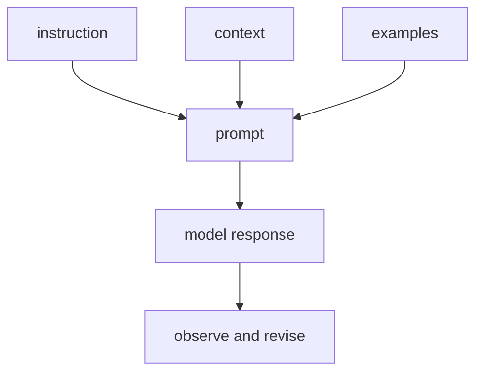
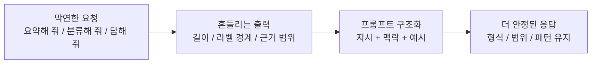

# P5-9.1 프롬프트 엔지니어링(prompt engineering)

P5-8.2에서는 정렬(alignment)이 단순히 친절한 답을 만드는 문제가 아니라, 유용성, 안전성, 사실성, 서비스 정책이 함께 걸린 설계 문제라는 점을 보았습니다. 그러면 이제 사용자의 손에 가장 먼저 잡히는 도구를 봐야 합니다.

사용자는 실제로 LLM의 행동을 어떻게 관찰하고 조정하는가?

이 절은 그 질문에 답합니다.

프롬프트 엔지니어링(prompt engineering)은 입력을 설계해 모델의 반응을 관찰하고, 원하는 형식과 조건에 더 가깝게 조정하는 실천적 방법이다.

같은 말을 더 쉽게 바꾸면 다음과 같습니다.

프롬프트는 모델에게 무엇을, 어떤 방식으로 답하라고 말하는 첫 번째 손잡이다.

## 이 절의 범위

이 절은 다음 질문에 답합니다.

- 프롬프트 엔지니어링은 무엇을 조정하는가?
- 왜 프롬프트가 LLM 사용 경험의 첫 번째 도구가 되었는가?
- 어떤 종류의 지시, 맥락, 예시가 실제로 도움이 되는가?

이 절에서는 다음 내용을 깊게 다루지 않습니다.

- 프롬프트 기법 이름 전체 목록
- 자동 프롬프트 최적화 알고리즘
- agent loop나 tool use 세부 구조

이 절에서는 입력 설계의 기본 손잡이만 다루고, Chain-of-thought, self-consistency, automatic prompt optimization 같은 이름은 P5-9.3 보충학습에서 다시 정리합니다. 프롬프트가 어디서 한계에 부딪히는지는 바로 다음 P5-9.2 프롬프트의 한계에서 다시 회수합니다. tool use와 agent 구조는 P5-12.1 도구 사용, P5-12.2 함수 호출, P5-13.1 에이전트에서 각각 다시 다룹니다.

프롬프트는 `마법의 주문`이 아니라, 모델 행동을 관찰하고 조정하기 위한 입력 설계 도구로 읽는 편이 안전합니다.

현재 Part 5에서 Chapter 9는 더 앞쪽으로 당겨 놓기보다, 지금 위치에서 `모델 조정 축`을 닫고 `외부 근거와 실행 구조`로 넘어가기 직전의 전환 장을 맡는 편이 맞습니다. 즉, 사전학습, 파인튜닝, 정렬을 본 뒤에 `사용자가 지금 당장 쥘 수 있는 첫 번째 손잡이`로 프롬프트를 읽고, 바로 다음 절에서 그 한계를 확인한 뒤 RAG와 도구 사용으로 넘어가는 흐름이 Part 5 본류에서는 가장 자연스럽습니다.

## 이 절의 목표

- 프롬프트 엔지니어링을 입문 수준에서 설명할 수 있습니다.
- 지시(instruction), 맥락(context), 예시(example)의 역할을 구분할 수 있습니다.
- 왜 프롬프트가 빠른 실험과 행동 관찰의 출발점이 되었는지 말할 수 있습니다.
- 다음 절의 한계 논의로 자연스럽게 넘어갈 수 있습니다.

## 이 절을 읽는 순서

이 절은 다음 순서로 읽으면 흐름이 잘 잡힙니다.

1. 먼저 `프롬프트는 무엇을 바꾸나`와 `프롬프트로 바로 바뀌는 것과 잘 안 바뀌는 것`을 읽고, 프롬프트가 입력 설계라는 점과 한계를 같이 잡습니다.
2. 그다음 `프롬프트를 이루는 기본 요소`, `지시는 무엇을 정하나`, `맥락은 무엇을 정하나`, `예시는 무엇을 정하나`를 읽으면서 프롬프트를 구성 요소 단위로 분해해 봅니다.
3. 마지막으로 사례와 Python 예제를 보면서, 실제 실무에서는 좋은 문장 하나를 쓰는 것보다 여러 입력에서 형식과 핵심 정보가 계속 유지되는지 관찰하는 일이 더 중요하다는 점을 확인합니다.

## 프롬프트는 무엇을 바꾸나

프롬프트는 보통 모델 내부 가중치를 바꾸지 않습니다. 대신 입력을 바꿉니다.

먼저 다음 세 질문으로 읽으면 좋습니다.

| 질문 | 짧은 답 |
| --- | --- |
| 사용자가 바로 바꾸는 것은 무엇인가? | 입력 문장과 조건 |
| 아직 바꾸지 않는 것은 무엇인가? | 모델 내부 가중치 |
| 그래서 프롬프트의 역할은 무엇인가? | 현재 모델 반응을 더 잘 끌어내는 입력 설계 |

즉, 사용자는 다음을 설계합니다.

- 무엇을 하라고 요청할지
- 어떤 배경 정보를 같이 줄지
- 어떤 형식으로 답을 받고 싶은지
- 어떤 예시를 보여 줄지

다음처럼 기억하면 좋습니다.

`프롬프트는 모델을 다시 학습시키는 것이 아니라, 현재 모델이 어떤 방식으로 반응하는지 더 잘 끌어내는 입력 설계다.`

이 절을 서비스 구조 관점으로 보면, 프롬프트는 `아직 외부 문서도, 외부 도구도 붙지 않은 가장 안쪽 제어 지점`입니다.

## 프롬프트로 바로 바뀌는 것과 잘 안 바뀌는 것

프롬프트를 처음 배우면 모든 문제가 입력 문장만 잘 쓰면 해결될 것처럼 느껴지기 쉽습니다. 하지만 프롬프트는 `바로 잘 바뀌는 층`과 `그것만으로는 잘 안 바뀌는 층`이 분명히 갈립니다.

| 프롬프트로 먼저 잘 바뀌는 것 | 프롬프트만으로는 잘 안 바뀌는 것 |
| --- | --- |
| 답변 길이와 형식 | 최신 정보 접근 |
| 설명 순서와 말투 | 외부 시스템 조회와 실행 |
| 예시를 따른 출력 패턴 | 계산 정확도 보장 |
| 범위와 근거를 보라는 지시 | 장기적 도메인 스타일의 완전한 고정 |

즉, 프롬프트는 `현재 모델 반응을 어떤 식으로 끌어낼지`를 바꾸는 데 강하지만, `모델 밖에 없는 정보`나 `실행 구조`, `지속적 적응` 자체를 대신하지는 않습니다.

## 왜 프롬프트가 첫 번째 도구가 되었나

이유는 매우 실용적입니다.

- 바로 시도할 수 있습니다
- 비용이 상대적으로 작습니다
- 모델을 다시 학습시키지 않아도 됩니다
- 실패해도 바로 수정하고 다시 관찰할 수 있습니다

즉, 프롬프트 엔지니어링은 LLM 시대의 `가장 빠른 실험 도구`였습니다.

그래서 많은 사용자는 알고리즘을 이해하기 전에 먼저 프롬프트를 통해 모델의 성격을 체감합니다. 이 점은 학습 순서에서도 중요합니다. 사용 경험이 먼저 오고, 그 뒤에 왜 그런 반응이 나오는지 이론이 따라옵니다.

## 프롬프트를 이루는 기본 요소

실무와 학습에서 가장 자주 보는 구성은 다음 세 가지입니다.

| 요소 | 중심 질문 |
| --- | --- |
| 지시(instruction) | 무엇을 하라고 요청하는가? |
| 맥락(context) | 어떤 배경 정보나 자료를 같이 주는가? |
| 예시(example) | 어떤 입력-출력 패턴을 보여 주는가? |

이 세 가지를 분리해 보면 프롬프트가 훨씬 덜 추상적으로 보입니다.

같은 요청을 더 구조적으로 쓰는 최소 흐름은 다음처럼 볼 수 있습니다.

| 순서 | 사용자가 정하는 것 |
| --- | --- |
| 1 | 무엇을 하라고 요청할지 |
| 2 | 무엇을 참고하라고 줄지 |
| 3 | 어떤 형식으로 답하길 원하는지 |

## 지시는 무엇을 정하나

지시는 작업의 목표를 정합니다.

예를 들어:

- `세 줄로 요약해 주세요`
- `독자 기준으로 설명해 주세요`
- `표 형식으로 정리해 주세요`

같은 문장은 모델에게 `무엇을 해야 하는지`를 알려 줍니다.

## 맥락은 무엇을 정하나

맥락은 모델이 참고해야 할 배경과 범위를 정합니다.

예를 들어:

- 원문 문서 일부
- 회사 내부 정책
- 직전 대화 내용
- 용어 정의

이런 정보가 없으면 모델은 일반적 패턴으로 메우려 할 가능성이 커집니다. 따라서 맥락은 정확도와 관련이 깊습니다.

## 예시는 무엇을 정하나

예를 들어:

- 질문과 답변 한 쌍
- 입력과 분류 라벨 한 쌍
- 원문과 요약문 한 쌍

이런 예시는 `이런 방식으로 답하면 된다`는 형태 신호를 줍니다. few-shot prompting이 유용하게 느껴지는 이유가 여기에 있습니다.

즉, 예시는 내용을 더 많이 넣는 장치라기보다 `어떤 형식과 반응 패턴을 따라야 하는가`를 보여 주는 장치에 가깝습니다. 그래서 이 절에서 확인해야 할 결과는 예시를 붙였을 때 모델이 단순 내용 생성만이 아니라, 요청한 형식과 반응 패턴까지 실제로 더 가깝게 따르는가입니다.

## 프롬프트 엔지니어링은 관찰 작업이기도 하다

이 표현을 먼저 잡아야 프롬프트 엔지니어링을 단순 문장 꾸미기가 아니라, 입력 변화에 따라 출력이 어떻게 달라지는지 관찰하고 실패 패턴을 찾는 작업으로 읽게 됩니다. 더 정확히는:

- 입력을 바꿔 보고
- 출력이 어떻게 달라지는지 관찰하고
- 실패 패턴을 찾고
- 더 안정적인 표현을 찾는

반복 실험에 가깝습니다.

즉, 프롬프트 엔지니어링은 `문장 감각`이기도 하지만 동시에 `행동 관찰 실험`입니다.

이 점이 중요한 이유는, 뒤 절에서 RAG나 도구 사용이 붙더라도 사용자는 여전히 먼저 `어떤 요청을 어떻게 적느냐`를 설계해야 하기 때문입니다.

처음 읽을 때는 프롬프트를 Part 5 본류의 `첫 번째 실무 손잡이`로만 잡고, 그 다음 손잡이가 무엇인지까지 함께 연결해 두면 흐름이 덜 끊깁니다.

| 지금 단계의 손잡이 | 바로 다음에 이어질 질문 | 뒤에서 본격적으로 다시 읽는 위치 |
| --- | --- | --- |
| 프롬프트(prompt) | 입력을 어떻게 써야 원하는 형식과 범위를 더 잘 끌어낼 수 있는가? | P5-9.1, P5-9.2 |
| RAG | 프롬프트만으로 부족하면 무엇을 근거로 답하게 할 것인가? | P5-10.1, P5-10.2 |
| 도구 사용(tool use) | 문서를 읽는 것만으로 부족하면 무엇을 실행하게 할 것인가? | P5-12.1, P5-12.2 |
| 에이전트(agent) | 여러 단계 작업을 어떤 순서로 이어가게 할 것인가? | P5-13.1 |

## 아주 단순하게 그리면



이 도식의 핵심은 프롬프트가 한 번 쓰고 끝나는 문장이 아니라, 관찰과 수정이 이어지는 작업이라는 점입니다.

## 사례로 보기

### 사례 1. 요약 작업

사용자가 긴 회의 메모를 붙여 넣고 `요약해 줘`라고만 적는 장면을 떠올려 볼 수 있습니다. 이 경우 모델은 길이, 말투, 중요도 기준을 스스로 추측해야 해서 어떤 답은 너무 길고 어떤 답은 핵심 결론을 빼먹을 수 있습니다. 같은 문서라도 임원 보고용 요약과 실무 인수인계용 요약은 남겨야 할 내용이 다를 수 있습니다. 사람이 먼저 해야 할 일은 더 똑똑한 모델을 찾는 것이 아니라 `몇 줄로`, `누구를 위한 요약인지`, `무엇을 남길지`를 분명히 적는 것입니다. 여기서 바뀌는 점은 `요약해 달라`는 요청 하나로 끝내는 기준에서 `길이, 독자, 남길 기준을 명시하는가`를 보는 기준으로 이동한다는 것입니다. `독자 기준으로 세 줄로 요약해 줘`처럼 길이와 독자 수준을 함께 주면 출력 흔들림이 줄어듭니다. 그렇지 않으면 내용은 맞아도 보고용으로는 너무 길고, 인수인계용으로는 너무 성긴 답이 나올 수 있습니다. 그래서 이 사례에서 확인해야 할 결과는 요약 길이, 독자, 남길 기준을 명시했을 때 출력 범위와 형식 흔들림이 실제로 줄어드는가입니다.

### 사례 2. 분류 작업

문의 분류 작업에서 `환불`, `배송`, `계정`, `오류` 라벨만 던져 주는 장면을 생각해 볼 수 있습니다. 사람도 라벨 이름만 보면 각 경계를 자기 방식으로 해석해 답이 흔들릴 수 있습니다. 예를 들어 `배송이 늦어서 환불하고 싶어요` 같은 문장은 `배송`과 `환불`이 함께 들어 있어 어느 라벨을 우선해야 할지 애매합니다. 이때 입력 예시와 라벨 예시를 함께 주면 모델은 `이런 문장은 이 라벨로 보낸다`는 패턴을 더 안정적으로 읽습니다. 예시가 없으면 비슷한 문의가 날마다 다른 큐로 가서 운영 처리 순서가 흔들릴 수 있습니다. 여기서 바뀌는 점은 `라벨 이름만 던져도 된다`는 기준에서 `라벨 경계를 보여 주는 예시가 필요한가`를 보는 기준으로 이동한다는 것입니다. 그래서 분류 사례에서는 프롬프트가 정답을 새로 만드는 것이 아니라, 라벨 해석 경계를 더 또렷하게 잡아 주는 역할을 합니다.
그래서 이 사례에서 확인해야 할 결과는 라벨 이름만 던졌을 때보다 입력 예시와 라벨 예시를 함께 준 뒤에 비슷한 문의가 더 일관되게 같은 큐로 모이는가입니다.

### 사례 3. 문서 기반 질의응답

문서 기반 질의응답에서 사용자가 `이 정책이면 가족도 같이 등록할 수 있나요?`라고 묻는다고 해 봅시다. 질문만 던지면 모델은 일반적인 복지 제도 상식을 섞어 답할 수 있고, 실제 문서 범위를 벗어날 위험이 큽니다. 사람이 먼저 해야 할 일은 더 장황하게 묻는 것이 아니라, 관련 규정 문단을 함께 넣어 `이 범위 안에서만 답하라`는 문맥을 주는 것입니다. 여기에 `근거 문장을 먼저 인용하고, 그 다음 짧게 해석하라` 같은 형식 조건까지 주면 답변 구조도 더 안정됩니다. 그렇지 않으면 그럴듯한 일반 상식을 답해도 실제 사내 규정과 다른 안내를 줄 수 있습니다. 여기서 바뀌는 점은 `질문만 잘 쓰면 된다`는 기준에서 `답이 묶여야 할 문서 범위와 근거 형식을 함께 주는가`를 보는 기준으로 이동한다는 것입니다. 그러면 응답은 일반 상식보다 붙여 준 문서 범위에 더 가깝게 묶입니다. 그래서 이 사례에서 확인해야 할 결과는 관련 문단과 근거 형식을 함께 넣었을 때 답이 일반 상식보다 실제 문서 범위에 더 가깝게 묶이는가입니다.

세 사례를 한 줄로 묶으면 다음과 같습니다.

| 상황 | 프롬프트가 가장 먼저 조정하는 것 |
| --- | --- |
| 요약 | 길이와 독자 수준 |
| 분류 | 출력 형식과 라벨 예시 |
| 질의응답 | 참고 범위와 근거 문맥 |

세 사례를 입력 설계 관점으로 다시 묶으면 다음과 같습니다.

| 상황 | 막연한 요청만 두면 흔들리는 것 | 프롬프트에서 먼저 명시해야 하는 것 |
| --- | --- | --- |
| 요약 작업 | 길이, 독자, 남길 핵심 | 줄 수, 대상 독자, 중요도 기준 |
| 분류 작업 | 라벨 경계와 우선순위 | 라벨 예시, 경계 사례 |
| 문서 기반 질의응답 | 답변 범위와 근거 제한 | 참고 문단, 인용 방식, 해석 범위 |

세 사례를 더 압축하면 다음처럼 읽을 수 있습니다.



핵심은 `더 화려한 문장`이 아니라 `무엇을 명시해야 흔들림이 줄어드는가`를 찾는 일입니다.

## 실행 가능한 Python 예제로 보기

이번 예제의 목표는 `좋은 문장을 한 번 쓰는 것`이 아니라, 같은 작업을 여러 요청 카드에 반복 적용했을 때 어떤 프롬프트가 더 안정적인 결과를 내는지 점검하는 것입니다. 실제 서비스에서도 프롬프트 평가는 한 번의 멋진 출력보다 `여러 입력에서 형식과 핵심 항목이 계속 유지되는가`를 보는 쪽이 더 중요합니다.

문제 상황:

- 고객지원팀이 매일 여러 운영 메모를 짧게 요약해야 함
- 단순 요청은 자유롭게 요약되지만, 운영상 꼭 남겨야 하는 항목이 빠질 수 있음
- 구조화 요청은 `독자`, `줄 수`, `반드시 남길 항목`을 함께 줘서 형식과 누락 여부를 점검하고 싶음

입력:

- 운영 메모 3개
- 각 메모에서 반드시 남겨야 하는 핵심 항목
- 단순 프롬프트와 구조화 프롬프트

출력:

- 메모별 응답
- 줄 수, 번호 형식, 핵심 항목 보존율, 슬롯 누락 여부
- 프롬프트 유형별 전체 요약 통계

프롬프트 설계 차이를 먼저 표로 보면 다음과 같습니다.

| 비교 항목 | 단순 프롬프트 | 구조화 프롬프트 |
| --- | --- | --- |
| 작업 지시 | `요약해 주세요` | `운영 담당자가 바로 읽을 3줄 요약` |
| 독자 정보 | 없음 | 운영 담당자 |
| 형식 제약 | 없음 | `상황`, `즉시 조치`, `남은 위험` |
| 점검 기준 | 사람이 눈대중 확인 | 슬롯 누락, 키워드 보존율 확인 |

문제 상황:

- 프롬프트 구조를 더 세밀하게 적으면 답변 품질뿐 아니라 형식 점검 가능성도 함께 달라진다

입력(input):

위에 정리한 요청별 사실 목록과 단순/구조화 프롬프트를 사용합니다.

확인할 개념:

- 프롬프트를 구조화하면 답변 내용뿐 아니라 형식 점검 가능성과 사실 보존 여부도 함께 달라질 수 있다

```python
requests = [
    {
        "name": "billing outage",
        "facts": [
            "새 결제 모듈 배포 후 카드 승인 실패율이 18퍼센트까지 올랐다.",
            "문제는 오전 9시 10분부터 시작되었고 모바일 결제에서 특히 크게 나타났다.",
            "운영팀은 새 결제 모듈을 이전 버전으로 되돌렸다.",
            "재발 방지를 위해 승인 로그 누락 구간을 오늘 안에 다시 수집해야 한다.",
        ],
        "must_keep": ["승인 실패율", "되돌렸다", "로그"],
    },
    {
        "name": "shipping delay",
        "facts": [
            "폭우로 남부 물류 허브 진입이 막혀 출고가 평균 하루 반 지연되고 있다.",
            "신선식품 주문은 일반 주문보다 먼저 안내 문자를 보내야 한다.",
            "고객센터는 환불보다 배송 지연 고지 문구를 먼저 확인해 달라는 요청을 받았다.",
            "오늘 저녁 6시에 허브 운영 재개 여부를 다시 확인할 예정이다.",
        ],
        "must_keep": ["하루 반", "신선식품", "저녁 6시"],
    },
    {
        "name": "account lock",
        "facts": [
            "사내 SSO 설정 변경 뒤 일부 사용자가 로그인 직후 계정 잠금 상태가 되었다.",
            "문제는 외부 파트너 계정에서 더 자주 나타났고, 비밀번호 재설정만으로는 풀리지 않았다.",
            "인프라팀은 정책 롤백 대신 동기화 지연 구간을 먼저 추적하고 있다.",
            "헬프데스크는 잠금 해제 수동 절차를 공지 문서에 추가해야 한다.",
        ],
        "must_keep": ["외부 파트너", "동기화", "수동 절차"],
    },
]

simple_prompt = "이 운영 메모를 짧게 요약해 주세요."
structured_prompt = {
    "instruction": "운영 담당자가 바로 읽고 행동할 수 있게 정확히 3줄로 요약해 주세요.",
    "reader": "독자는 운영 담당자입니다.",
    "required_slots": ["상황", "즉시 조치", "남은 위험"],
}


def simple_response(card):
    # 단순 요청에서는 앞부분 사실이 길게 이어지고, 운영상 중요한 뒷부분이 빠지기 쉽다.
    first = card["facts"][0]
    second = card["facts"][1]
    return f"{first} {second}"


def structured_response(card):
    return "\n".join(
        [
            f"1. 상황: {card['facts'][0]}",
            f"2. 즉시 조치: {card['facts'][2]}",
            f"3. 남은 위험: {card['facts'][3]}",
        ]
    )


def inspect_response(response, must_keep, required_slots):
    lines = [line.strip() for line in response.splitlines() if line.strip()]
    numbered_lines = all(
        line.startswith(f"{idx}.") for idx, line in enumerate(lines, start=1)
    ) if lines else False
    present_keywords = [keyword for keyword in must_keep if keyword in response]
    missing_slots = [
        slot for slot in required_slots if not any(slot in line for line in lines)
    ]
    return {
        "line_count": len(lines),
        "numbered_lines": numbered_lines,
        "keyword_coverage": f"{len(present_keywords)}/{len(must_keep)}",
        "present_keywords": present_keywords,
        "missing_slots": missing_slots,
    }


def run_batch(prompt_name, response_fn):
    reports = []
    for card in requests:
        response = response_fn(card)
        inspect = inspect_response(
            response=response,
            must_keep=card["must_keep"],
            required_slots=structured_prompt["required_slots"],
        )
        reports.append(
            {
                "name": card["name"],
                "response": response,
                "inspect": inspect,
            }
        )
    format_ok_count = sum(1 for report in reports if report["inspect"]["numbered_lines"])
    full_keyword_keep_count = sum(
        1 for report in reports if report["inspect"]["keyword_coverage"] == "3/3"
    )
    slot_ok_count = sum(
        1 for report in reports if not report["inspect"]["missing_slots"]
    )
    average_keyword_ratio = sum(
        len(report["inspect"]["present_keywords"]) / len(requests[idx]["must_keep"])
        for idx, report in enumerate(reports)
    ) / len(reports)
    return {
        "prompt_name": prompt_name,
        "reports": reports,
        "format_ok_count": format_ok_count,
        "full_keyword_keep_count": full_keyword_keep_count,
        "slot_ok_count": slot_ok_count,
        "average_keyword_ratio": round(average_keyword_ratio, 2),
    }


simple_batch = run_batch("simple", simple_response)
structured_batch = run_batch("structured", structured_response)

for batch in [simple_batch, structured_batch]:
    print(f"[{batch['prompt_name']} batch]")
    print("format_ok_count =", batch["format_ok_count"])
    print("slot_ok_count =", batch["slot_ok_count"])
    print("full_keyword_keep_count =", batch["full_keyword_keep_count"])
    print("average_keyword_ratio =", batch["average_keyword_ratio"])
    for report in batch["reports"]:
        print(f"- {report['name']}")
        print(report["response"])
        print(report["inspect"])
    print()
```

실행 결과 예시는 다음처럼 읽을 수 있습니다.

```text
[simple batch]
format_ok_count = 0
slot_ok_count = 0
full_keyword_keep_count = 0
average_keyword_ratio = 0.44
- billing outage
새 결제 모듈 배포 후 카드 승인 실패율이 18퍼센트까지 올랐다. 문제는 오전 9시 10분부터 시작되었고 모바일 결제에서 특히 크게 나타났다.
{'line_count': 1, 'numbered_lines': False, 'keyword_coverage': '1/3', 'present_keywords': ['승인 실패율'], 'missing_slots': ['상황', '즉시 조치', '남은 위험']}
- shipping delay
폭우로 남부 물류 허브 진입이 막혀 출고가 평균 하루 반 지연되고 있다. 신선식품 주문은 일반 주문보다 먼저 안내 문자를 보내야 한다.
{'line_count': 1, 'numbered_lines': False, 'keyword_coverage': '2/3', 'present_keywords': ['하루 반', '신선식품'], 'missing_slots': ['상황', '즉시 조치', '남은 위험']}
- account lock
사내 SSO 설정 변경 뒤 일부 사용자가 로그인 직후 계정 잠금 상태가 되었다. 문제는 외부 파트너 계정에서 더 자주 나타났고, 비밀번호 재설정만으로는 풀리지 않았다.
{'line_count': 1, 'numbered_lines': False, 'keyword_coverage': '1/3', 'present_keywords': ['외부 파트너'], 'missing_slots': ['상황', '즉시 조치', '남은 위험']}

[structured batch]
format_ok_count = 3
slot_ok_count = 3
full_keyword_keep_count = 1
average_keyword_ratio = 0.78
- billing outage
1. 상황: 새 결제 모듈 배포 후 카드 승인 실패율이 18퍼센트까지 올랐다.
2. 즉시 조치: 운영팀은 새 결제 모듈을 이전 버전으로 되돌렸다.
3. 남은 위험: 재발 방지를 위해 승인 로그 누락 구간을 오늘 안에 다시 수집해야 한다.
{'line_count': 3, 'numbered_lines': True, 'keyword_coverage': '3/3', 'present_keywords': ['승인 실패율', '되돌렸다', '로그'], 'missing_slots': []}
- shipping delay
1. 상황: 폭우로 남부 물류 허브 진입이 막혀 출고가 평균 하루 반 지연되고 있다.
2. 즉시 조치: 고객센터는 환불보다 배송 지연 고지 문구를 먼저 확인해 달라는 요청을 받았다.
3. 남은 위험: 오늘 저녁 6시에 허브 운영 재개 여부를 다시 확인할 예정이다.
{'line_count': 3, 'numbered_lines': True, 'keyword_coverage': '2/3', 'present_keywords': ['하루 반', '저녁 6시'], 'missing_slots': []}
- account lock
1. 상황: 사내 SSO 설정 변경 뒤 일부 사용자가 로그인 직후 계정 잠금 상태가 되었다.
2. 즉시 조치: 인프라팀은 정책 롤백 대신 동기화 지연 구간을 먼저 추적하고 있다.
3. 남은 위험: 헬프데스크는 잠금 해제 수동 절차를 공지 문서에 추가해야 한다.
{'line_count': 3, 'numbered_lines': True, 'keyword_coverage': '2/3', 'present_keywords': ['동기화', '수동 절차'], 'missing_slots': []}
```

이 결과를 읽을 때 핵심은 `구조화 프롬프트면 언제나 완벽하다`가 아닙니다. 위 결과에서도 `shipping delay`, `account lock`은 여전히 `3/3`이 아니라 `2/3`으로 남습니다. 즉, 구조화 프롬프트는 형식과 전개 순서를 더 안정시켜 주지만, 정말 빠뜨리면 안 되는 항목이 있다면 `반드시 포함할 키워드`나 `누락 시 다시 작성` 같은 추가 제어가 더 필요하다는 점도 같이 보입니다.

그래서 이 예제에서 확인해야 할 결과는 두 가지입니다.

- 구조화 프롬프트는 여러 요청 카드에서 `줄 수`, `번호 형식`, `슬롯 유지`를 더 안정적으로 만든다.
- 그래도 핵심 항목 보존은 항상 자동으로 해결되지 않으므로, 프롬프트 실험은 `형식 안정성`과 `내용 보존율`을 함께 점검해야 한다.

이 예제에서 독자가 직접 해 볼 수 있는 조정은 다음과 같습니다.

- `structured_prompt["required_slots"]`에 `고객 영향`을 추가해 4줄 형식으로 바꾸기
- `simple_response`와 `structured_response`의 선택 규칙을 바꿔 어떤 항목이 쉽게 빠지는지 보기
- `inspect_response`에 `max_line_length`, `must_quote_time`, `must_include_number` 같은 운영 규칙을 더 넣어 보기

이 예제에서 여기서 읽어야 할 핵심은 다음입니다.

- 단순 프롬프트는 `작업만 말한 상태`
- 구조화 프롬프트는 `작업, 독자, 슬롯, 점검 기준`을 함께 준 상태
- 따라서 프롬프트 엔지니어링은 예쁜 문장 경쟁이 아니라 `반복 가능한 입력 설계와 점검 설계`에 가깝습니다

## 이 예제를 입력 설계 관점으로 다시 보면

이 비교에서 중요한 것은 문장을 길게 쓰느냐가 아니라, 모델이 판단에 써야 할 정보를 어떤 칸에 나눠 넣느냐입니다. 그래서 프롬프트 엔지니어링은 표현 솜씨보다 `작업 요구`, `맥락`, `출력 형식`을 어떻게 구조적으로 배치하느냐의 문제로 읽는 편이 정확합니다.

## 여기까지를 한 줄로 묶으면

프롬프트 엔지니어링은 멋진 문장을 찾는 일이 아니라, 같은 모델이 여러 입력에서도 더 안정적으로 원하는 형식과 핵심 정보를 내놓게 만드는 입력 설계 작업입니다.

생성형 AI가 널리 쓰이기 시작하면서 프롬프트 엔지니어링은 많은 사람에게 첫 번째 실무 감각이 되었습니다. 전통적인 소프트웨어에서는 기능을 바꾸려면 코드를 수정해야 했지만, LLM 기반 도구에서는 입력 설계만으로도 행동이 크게 달라질 수 있었기 때문입니다.

이 역사 설명을 다음처럼 받아들이면 충분합니다.

`프롬프트는 LLM 시대의 첫 번째 제어 수단이었고, 많은 사용자는 여기서 처음으로 모델 행동이 바뀌는 경험을 했다.`

커리큘럼 관점에서 이 절이 중요한 이유는 다음과 같습니다.

- 모델 구조를 다 몰라도 행동 관찰을 시작할 수 있게 하고
- 이후 RAG, tool use, agent에서 입력 설계가 왜 중요한지 연결하며
- 동시에 다음 절에서 프롬프트만으로는 해결되지 않는 한계를 분리하게 해 주기 때문입니다

## 다음 절과의 연결

여기까지 오면 다음 질문이 남습니다.

- 프롬프트를 잘 쓰면 어디까지 해결할 수 있는가?
- 프롬프트만으로는 왜 최신성, 근거, 일관성을 완전히 보장하지 못하는가?

이 질문은 P5-9.2 프롬프트의 한계로 이어집니다.

## 이 절에서 기억할 관점

- 프롬프트 엔지니어링은 입력 설계를 통해 모델 행동을 관찰하고 조정하는 방법입니다.
- 지시, 맥락, 예시는 서로 다른 역할을 가집니다.
- 프롬프트는 빠른 실험과 관찰의 첫 번째 도구가 되었습니다.
- 하지만 이것은 모델 재학습이나 외부 근거 연결을 완전히 대체하지 않습니다.

## 체크리스트

- 프롬프트 엔지니어링을 입문 수준에서 설명할 수 있는가?
- 지시, 맥락, 예시의 역할을 구분할 수 있는가?
- 왜 프롬프트가 빠른 실험 도구가 되었는지 말할 수 있는가?
- 왜 다음 절에서 한계 논의가 이어져야 하는지 설명할 수 있는가?

## 출처와 참고 자료

- Tom B. Brown et al., `Language Models are Few-Shot Learners`, arXiv, 2020, 확인 날짜: 2026-06-29.
- Jason Wei et al., `Chain-of-Thought Prompting Elicits Reasoning in Large Language Models`, arXiv, 2022, 확인 날짜: 2026-06-29.
- OpenAI, 프롬프팅 관련 공식 문서, 확인 날짜: 2026-06-29.
