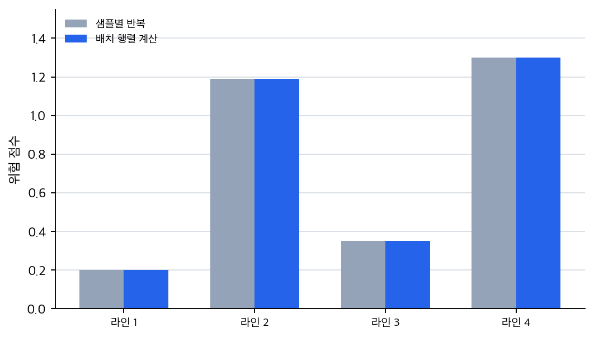
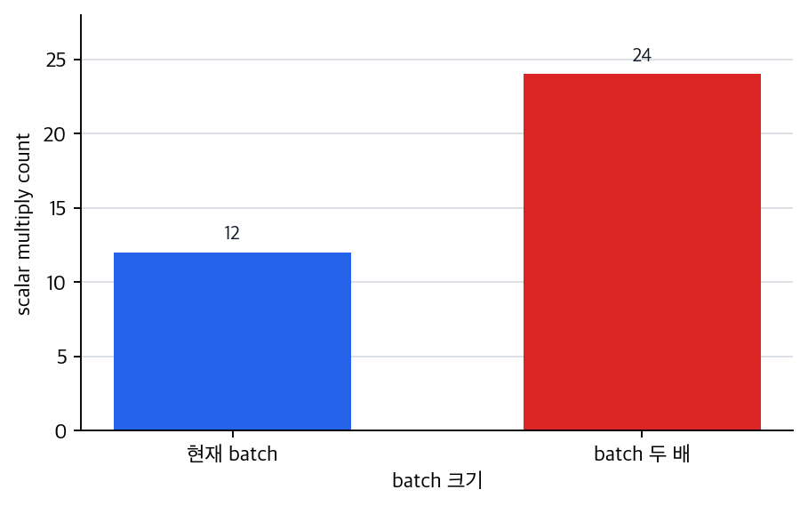

# P5-9.1 GPU와 병렬 처리

Section ID: `P5-9.1`
Version: `v2026.07.14`

P5-8장까지는 딥러닝 모델 내부에서 일어나는 학습 계산과 regularization을 보았습니다. 여기서 시야를 조금 넓히면 다음 질문이 생깁니다.

이렇게 많은 파라미터와 반복 계산이 필요한 딥러닝이, 왜 특정 시기부터 갑자기 실용적으로 보이기 시작했는가?

이 질문에 답할 때 빼놓기 어려운 요소가 GPU(graphics processing unit)와 병렬 처리(parallel processing)입니다.

딥러닝 확산은 알고리즘 아이디어만으로 이루어진 것이 아니라, 같은 연산을 매우 많이 동시에 처리할 수 있는 계산 자원의 발전과 강하게 연결되어 있다.

계산 자원 이야기가 다시 추상적으로 느껴질 때는 개념사전의 [GPU(graphics processing unit)](../../../reference/concept-glossary.md#gpugraphics-processing-unit)와 [병렬 처리(parallel processing)](../../../reference/concept-glossary.md#parallel-processing) 항목을 함께 다시 봅니다.

## 이 절의 범위

- 딥러닝은 왜 계산량이 많은가?
- CPU와 GPU를 입문 수준에서 어떻게 구분하면 좋은가?
- 병렬 처리란 무엇이며, 딥러닝과 왜 잘 맞는가?
- 딥러닝 확산의 역사에서 GPU가 왜 전환점처럼 언급되는가?

이 절에서는 다음 내용을 깊게 다루지 않습니다.

- CUDA 프로그래밍 세부 구조
- 메모리 대역폭, warp, kernel launch 같은 하드웨어 내부 최적화
- TPU와 NPU의 상세 비교

CUDA 내부 구조와 하드웨어 최적화 세부는 여기서 다루지 않습니다. 대신 다음 절 P5-9.2에서 배치(batch)와 텐서(tensor) 계산으로 더 구체적인 계산 형태를 이어서 봅니다. Transformer가 왜 GPU 병렬 처리와 잘 맞았는지는 P5-14.1, P5-14.2에서 다시 회수하고, TPU/NPU 상세 비교는 이 책의 현재 본편 범위 밖에 둡니다.

## 이 절의 목표

- 딥러닝이 큰 행렬 연산과 반복 계산 때문에 계산 자원에 민감하다는 점을 설명할 수 있습니다.
- CPU와 GPU의 차이를 `작업 배치 방식` 중심으로 직관적으로 설명할 수 있습니다.
- 병렬 처리가 딥러닝의 학습 속도와 실용성에 어떤 영향을 주었는지 말할 수 있습니다.
- AlexNet 같은 역사적 전환점을 GPU 관점에서 읽을 수 있습니다.

## 딥러닝은 왜 계산량이 많은가

딥러닝 모델은 한 번의 예측에도 많은 곱셈과 덧셈을 수행합니다. 학습 단계에서는 여기에 손실 계산, 역전파, optimizer 업데이트까지 더해집니다.

예를 들어:

- 입력이 많고
- 은닉층이 크고
- 데이터가 많고
- epoch를 여러 번 돌면

연산량은 매우 빠르게 커집니다.

특히 딥러닝에서는 다음 같은 계산이 반복됩니다.

- 벡터(vector)와 행렬(matrix) 곱
- 큰 텐서(tensor) 단위의 덧셈과 곱셈
- 배치(batch) 단위 반복 계산

즉, 딥러닝은 `복잡한 한 문제 하나`보다, `비슷한 수치 연산을 엄청 많이 반복하는 문제`에 가깝습니다.

## CPU와 GPU를 입문 수준에서 어떻게 구분할까

다음 비유가 가장 안전합니다.

- CPU는 비교적 적은 수의 강한 작업자들이 다양한 일을 유연하게 처리하는 쪽에 가깝고
- GPU는 매우 많은 수의 작업자들이 비슷한 일을 동시에 나누어 처리하는 쪽에 가깝습니다

이 비유는 완벽한 하드웨어 설명은 아니지만, 딥러닝과의 궁합을 설명하는 데에는 충분합니다.

즉:

- 운영체제, 브라우저, 복잡한 조건 분기 같은 작업은 CPU 감각이 강하고
- 같은 수치 연산을 대량으로 반복하는 작업은 GPU 감각이 강합니다

딥러닝은 바로 후자와 잘 맞습니다.

## 병렬 처리(parallel processing)는 무엇인가

병렬 처리는 여러 계산을 동시에 나누어 처리하는 방식입니다. 다음처럼 이해하면 충분합니다.

`서로 독립적이거나 비슷한 계산을 한 줄로 차례대로 처리하지 않고, 여러 계산 자원에 나누어 동시에 처리하는 것`

딥러닝에서는 특히:

- 한 배치에 들어 있는 여러 샘플
- 행렬의 여러 원소 계산
- 여러 채널(channel)과 feature map 연산

이 병렬화에 잘 맞습니다.

즉, 딥러닝은 `같은 패턴의 수치 연산을 많이 반복한다`는 점 때문에 GPU형 병렬 처리에 잘 맞는 구조를 갖습니다.

## 왜 딥러닝과 병렬 처리가 잘 맞는가

딥러닝 연산은 대체로 다음 세 특징으로 요약할 수 있습니다.

- 큰 행렬을 만든다
- 같은 연산을 많은 위치에 적용한다
- 여러 샘플을 한꺼번에 처리한다

이 구조는 `각 계산을 서로 나누기 쉬운 편`입니다.

예를 들어:

- 이미지 한 장의 서로 다른 위치에 합성곱(convolution)을 적용하거나
- 배치 안의 여러 샘플에 같은 선형층(linear layer)을 적용하거나
- 행렬의 여러 원소를 동시에 계산하는 것은

GPU의 강점과 잘 맞습니다.

`딥러닝은 같은 종류의 수치 계산을 대량으로 반복하기 때문에, 많은 계산 유닛이 동시에 움직이는 방식과 잘 맞는다.`

이 차이를 순차 처리와 병렬 처리로 나누어 그리면 다음과 같습니다.

```mermaid
--8<-- "assets/part-05/chapter-09/cpu-gpu-parallel-flow-ko.mmd"
```

이 도식에서 먼저 확인할 결과는, GPU의 핵심이 `더 복잡한 계산을 한다`는 점보다 `같은 계산을 여러 샘플과 위치에 한꺼번에 배치하기 쉽다`는 점이라는 사실입니다.

## 역사에서 GPU가 왜 전환점처럼 보이나

딥러닝 아이디어 자체는 최근에 갑자기 생긴 것이 아닙니다. 퍼셉트론, 다층 신경망, 역전파 같은 핵심 개념은 더 오래전부터 있었습니다. 그런데도 특정 시기 이후에 딥러닝이 급속히 확산된 이유 중 하나는 `계산할 수 있게 되었기 때문`입니다.

특히 2012년 AlexNet은 다음 요소가 함께 결합된 전환점으로 자주 설명됩니다.

- 대규모 데이터(ImageNet)
- 더 깊은 CNN 구조
- GPU 기반 학습
- 학습 기법과 정규화 기법의 결합

즉, 아이디어만으로는 부족했고, `그 아이디어를 실제 규모로 돌릴 수 있는 계산 자원`이 함께 필요했습니다.

## AlexNet은 왜 자주 언급되나

AlexNet은 다음처럼 이해하면 됩니다.

`딥러닝이 연구 개념을 넘어 실질적 성능 전환점으로 보이게 만든 대표 사례`

AlexNet이 자주 언급되는 이유는 단순히 모델이 컸기 때문이 아닙니다. GPU를 활용한 대규모 학습이 이미지 인식에서 큰 성능 차이를 보여 주면서, 딥러닝의 실용성이 널리 인식되기 시작했기 때문입니다.

이 때문에 GPU는 단순한 부품이 아니라, 딥러닝 역사에서 `아이디어를 산업 규모 실험으로 올려 준 장치`처럼 보입니다.

## 사례 및 예시

### 사례 1. 작은 업무 점수화 모델은 CPU로도 가능

라인별 에너지 사용량 추정용 선형 회귀나 경보 우선순위 자동 분류용 작은 MLP를 소규모 운영 데이터로 돌릴 때는, 한 번의 학습이 몇 초 안에 끝나는 경우가 많습니다. 사람은 딥러닝이라고 하면 처음부터 반드시 GPU가 있어야 한다고 느끼기 쉽지만, 이런 단계에서는 CPU만으로도 입력, 출력, 손실, 업데이트 흐름을 직접 확인하기에 충분합니다. 오히려 이 단계에서는 속도보다 `모델이 어떤 값을 받아 어떤 손실을 줄이는가`를 눈으로 따라가는 일이 더 중요할 수 있습니다. 그래서 이 사례에서 확인해야 할 결과는 GPU가 없어도 한 번의 학습 step과 손실 감소 흐름을 실제로 눈으로 따라갈 수 있는가입니다.

### 사례 2. 큰 이미지 모델 학습은 계산 자원 의존이 큼

이미지 분류 모델이 깊어지고 입력 이미지가 커지면, 한 번의 forward와 backward에서 처리해야 할 곱셈과 덧셈이 급격히 늘어납니다. 사람은 처음에는 `조금 오래 걸려도 학습은 되겠지`라고 생각할 수 있지만, CPU만으로는 한 epoch를 도는 데 너무 오래 걸려 하이퍼파라미터 하나 바꿔 보는 실험 자체가 부담스러워질 수 있습니다. 예를 들어 배치 크기나 학습률을 한 번 바꿔 볼 때마다 반나절을 기다려야 하면, 좋은 설정을 찾기 전에 실험 자체를 포기하게 될 수 있습니다. 이때 GPU는 단순히 `조금 빠른 부품`이 아니라, 여러 실험을 실제로 시도할 수 있게 만드는 장치가 됩니다. 그래서 이 사례에서 확인해야 할 결과는 같은 모델이라도 CPU에서는 실험 회전이 막히고, GPU를 쓰면 실제로 여러 설정 비교가 가능한 속도로 바뀌는가입니다.

| 사람이 먼저 보기 쉬운 기준 | GPU 관점으로 다시 읽는 기준 |
| --- | --- |
| 오래 걸려도 결국 학습만 되면 된다고 생각하기 쉽다 | 실험 회전이 막히면 좋은 설정 탐색 자체가 어려워진다 |
| GPU는 그냥 더 빠른 부품처럼 느끼기 쉽다 | 계산 자원은 `무엇을 시도할 수 있는가`를 바꾸는 조건이다 |
| 속도 차이는 편의 문제라고만 느끼기 쉽다 | 실제로는 batch, learning rate, 모델 크기 비교 가능 여부를 갈라놓는다 |

### 사례 3. LLM과 생성형 AI

LLM은 더 극단적인 사례입니다. 사람은 처음에는 `모델만 크면 더 똑똑해지는 것 아닌가`라고 생각하기 쉽지만, 실제로는 긴 토큰 시퀀스와 거대한 파라미터를 다루면서 한 step마다 큰 행렬 연산을 반복해야 합니다. 작은 실험조차도 메모리와 연산량이 빠르게 커져, 병렬 처리와 가속기(accelerator) 없이는 학습은 물론 실용적인 추론도 어려워질 수 있습니다. 예를 들어 문맥 길이를 조금 늘리거나 배치 크기를 조금만 키워도 메모리 부족으로 바로 중단되어, 성능 비교 이전에 `아예 실행 가능한가`가 먼저 문제가 될 수 있습니다. 그래서 이 사례에서 확인해야 할 결과는 모델 크기 증가가 단순 성능 기대만이 아니라 메모리 한계와 처리 가능 범위를 실제로 갈라놓는가입니다.

즉, GPU와 병렬 처리의 중요성은 Part 5로 갈수록 더 커집니다.

세 사례를 같이 놓고 보면 GPU를 `더 빠른 부품`보다 `무엇을 실제로 시도할 수 있는가를 바꾸는 조건`으로 읽어야 하는 이유가 더 분명해집니다.

| 장면 | 사람이 먼저 보기 쉬운 결과 | GPU 관점에서 실제로 구분해야 할 것 | 바로 다음에 확인할 것 |
| --- | --- | --- | --- |
| 작은 운영 점수화 모델 | 딥러닝이면 처음부터 GPU가 꼭 있어야 할 것처럼 느끼기 쉽습니다. | 작은 실험은 CPU로도 학습 흐름 확인이 가능하고, 병목이 아직 계산 자원보다 개념 이해일 수 있습니다. | 손실 감소와 update 흐름을 실제로 따라갈 수 있는지 봅니다. |
| 큰 이미지 모델 학습 | 오래 걸려도 결국 돌리기만 하면 된다고 보기 쉽습니다. | 실험 회전이 막히면 하이퍼파라미터 비교 자체가 어려워져 학습 가능 범위가 줄어듭니다. | 같은 모델로 여러 설정 비교가 가능한 속도인지 봅니다. |
| LLM과 생성형 AI | 모델만 크면 더 강력해질 것처럼 보기 쉽습니다. | 모델 크기 증가는 곧 메모리와 연산량 한계 증가이기도 해서, 성능보다 먼저 실행 가능 범위를 가릅니다. | 문맥 길이와 배치 크기 증가가 실제로 실행 가능성을 바꾸는지 봅니다. |

## 연습 및 예제

이번 예제의 목표는 같은 선형 연산이 `샘플 하나`에만 적용될 때와 `배치 전체`에 한 번에 적용될 때를 나란히 보는 것입니다.

입력:

- 라인 4개, feature 3개인 작은 배치
- 모든 라인에 공통으로 적용할 가중치 3개

출력:

- 라인별 위험 점수
- 한 번의 행렬 계산으로 얻은 점수
- 반복 계산 횟수
- 더 큰 batch로 커질 때 반복 계산 규모가 어떻게 늘어나는지 비교

문제 상황:

- 배치 계산은 같은 연산을 샘플마다 반복하는 대신 한 번의 행렬 연산으로 묶어 처리한다는 점을 직접 확인할 필요가 있다
- 작은 예제에서도 반복 횟수 증가를 같이 보면 왜 계산 자원이 실험 가능성을 바꾸는지 읽기 쉽다

확인할 개념:

- 배치 행렬 계산은 여러 샘플 점수를 한 번에 만든다
- 반복 계산과 행렬 계산이 같은 결과를 낸다는 점을 확인하면 배치 처리의 의미가 더 분명해진다
- batch가 커질수록 순차 반복 규모가 바로 커진다는 점을 같이 봐야 한다

입력(input):

위에 정리한 라인 batch와 공통 가중치 벡터를 사용합니다.

코드를 보기 전에 먼저 무엇이 같고 무엇이 커질지 예상해 보면 좋습니다.

| 비교 | 먼저 예상해 볼 비교 | 예상 이유 |
| --- | --- | --- |
| `scores_one_by_one` vs `scores_batch` | 같은 결과가 나올 가능성 | 계산 의미 자체는 같고 묶는 방식만 다르기 때문입니다. |
| `scalar multiply count` | batch가 커질수록 바로 늘어날 가능성 | 샘플 수와 feature 수만큼 반복 곱셈이 누적되기 때문입니다. |
| 실험 부담 | batch와 모델이 커질수록 CPU식 순차 계산 부담이 더 커질 가능성 | 같은 종류의 반복 계산이 빠르게 늘어나기 때문입니다. |

여기서 실제로 확인하려는 차이도 단순 계산량 비교에서 끝나지 않습니다. 같은 점수를 얻더라도 CPU 쪽 읽기는 `이번 실험 하나를 끝내는 데 얼마나 오래 걸리는가`로 이어지고, GPU 쪽 읽기는 `batch 크기, 입력 특징 수, 가중치 설정을 몇 번이나 다시 바꿔 볼 수 있는가`로 이어져야 합니다. 즉, 이 절의 계산 차이는 결국 `실험 회전 가능성` 차이까지 연결되어야 합니다.

이 표의 목적은 `결과는 같지만 계산 부담은 커진다`는 점을 분리해서 읽는 것입니다.

```python
import numpy as np

# 4 lines, 3 features each
batch = np.array([
    [1.0, 0.5, 2.0],
    [0.2, 1.5, 0.3],
    [1.2, 0.1, 0.7],
    [0.0, 2.0, 1.0],
])

weights = np.array([0.4, 0.8, -0.3])

scores_one_by_one = []
scalar_multiply_count = 0
for sample in batch:
    score = 0.0
    for x, w in zip(sample, weights):
        score += x * w
        scalar_multiply_count += 1
    scores_one_by_one.append(round(score, 3))

scores_batch = batch @ weights

print("batch shape =", batch.shape)
print("weights shape =", weights.shape)
print("scores_one_by_one =", scores_one_by_one)
print("scores_batch =", np.round(scores_batch, 3).tolist())
print("scalar multiply count =", scalar_multiply_count)
print("same result =", np.allclose(scores_one_by_one, np.round(scores_batch, 3)))
print("if batch size doubles, estimated scalar multiplies =", scalar_multiply_count * 2)
```

출력에서는 scores_one_by_one과 scores_batch가 같은지 먼저 보고, 그 계산이 몇 번 반복되는지 이어서 보면 됩니다.

```text
batch shape = (4, 3)
weights shape = (3,)
scores_one_by_one = [0.2, 1.19, 0.35, 1.3]
scores_batch = [0.2, 1.19, 0.35, 1.3]
scalar multiply count = 12
same result = True
if batch size doubles, estimated scalar multiplies = 24
```

- 계산 내용 자체는 같아도, 실제 딥러닝 프레임워크는 이런 연산을 `배치 전체 행렬 계산`으로 묶어 처리합니다
- 예제처럼 작은 데이터에서도 같은 곱셈이 12번 반복되며, 모델이 커지면 이 반복 횟수는 바로 커집니다
- GPU의 강점은 이런 반복 곱셈과 덧셈을 대량으로 병렬 처리하는 데 있습니다

첫 번째 산출물은 라인별 위험 점수입니다. 샘플별 반복 계산과 배치 행렬 계산은 같은 점수를 만들지만, 이 그래프가 보여 주는 핵심은 `결과가 같다`가 아니라 `같은 결과를 다른 계산 조직으로 얻는다`는 점입니다.



두 번째 산출물은 scalar multiply count입니다. 현재 예제의 4개 라인, 3개 feature에서는 곱셈이 12번 필요하고, batch 크기만 두 배가 되어도 같은 종류의 반복 계산은 24번으로 늘어납니다.



| 비교 | 지금 읽어야 할 핵심 |
| --- | --- |
| `scores_one_by_one` vs `scores_batch` | 결과는 같지만 계산 조직 방식이 다릅니다. |
| `12 -> 24` 반복 횟수 추정 | batch만 두 배가 되어도 같은 종류의 곱셈 부담이 바로 커집니다. |
| CPU vs GPU 감각 | GPU의 가치는 같은 계산을 더 빨리 끝내는 데서 끝나지 않고, 더 큰 batch와 더 많은 실험을 실제로 가능하게 만드는 데 있습니다. |

출력 숫자를 읽을 때도 `같은 결과가 나왔는가`와 `그 결과를 얻기 위해 감당해야 할 계산 규모`를 분리해서 봐야 합니다.

| 비교 | 출력에서 먼저 보이는 것 | 결과만 보면 남기 쉬운 해석 | GPU 관점까지 보면 바뀌는 해석 |
| --- | --- | --- | --- |
| `scores_one_by_one` vs `scores_batch` | 점수는 완전히 같습니다. | 그러면 계산 방식 차이는 중요하지 않다고 보기 쉽습니다. | 수학적으로 같은 연산이라도, 어떻게 묶어 처리하느냐가 실용 속도와 처리 규모를 바꿉니다. |
| `12 -> 24` 반복 횟수 추정 | batch가 두 배면 scalar multiply 추정도 바로 두 배가 됩니다. | 장난감 예제에서는 숫자가 작으니 큰 차이 아닌 것처럼 보일 수 있습니다. | 실제 모델에서는 batch, feature, layer가 함께 커져 반복 계산이 곧 실험 병목으로 바뀝니다. |
| CPU vs GPU 감각 | 작은 예제는 CPU로도 충분히 끝납니다. | GPU는 편의용 가속 정도라고 보기 쉽습니다. | 계산 자원은 단순 속도 차이가 아니라, 더 큰 batch와 더 많은 시도를 가능한 작업 범위로 바꾸는 조건입니다. |

| 실험 운영 기준 | CPU식 읽기만 하면 쉬운 판단 | GPU 관점까지 읽고 바뀌는 판단 |
| --- | --- | --- |
| batch 크기 조정 | 같은 점수만 나오면 batch를 바꿔 볼 이유가 약하다고 느끼기 쉽다 | batch를 키웠을 때 반복 계산 부담이 얼마나 커지는지 알면, 어떤 범위까지 실험을 돌릴 수 있을지 먼저 가늠하게 된다 |
| 하이퍼파라미터 탐색 | learning rate나 모델 폭을 여러 번 바꾸는 것이 그냥 시간이 조금 더 드는 문제처럼 보일 수 있다 | 같은 연산이 빠르게 불어나면, 계산 자원에 따라 시도 가능한 설정 수 자체가 달라진다는 점을 먼저 보게 된다 |
| 모델 규모 확장 | feature나 layer를 늘리면 정확도만 좋아질 것처럼 느끼기 쉽다 | 실제로는 반복 계산과 메모리 부담이 같이 커져, 성능 기대보다 먼저 `실행 가능한가`를 따져야 한다 |

이 결과를 운영 실험으로 바꾸면, CPU식 읽기는 `같은 점수가 나오니 계산 방식 차이는 부차적`이라는 판단으로 흐르기 쉽고, GPU 관점 읽기는 `어떤 batch와 어떤 설정까지 실제로 반복 실험이 가능한가`를 먼저 따지게 만듭니다. 이 절에서 읽어야 할 전환점은 단순 속도 차이가 아니라 바로 이런 `실험 설계 가능 범위`의 차이입니다.

Part 5에서 GPU 절이 중요한 이유는 단순히 하드웨어 지식을 넣기 위해서가 아닙니다. 딥러닝을 순수한 수학 이론으로만 보면, 왜 특정 시기에 갑자기 산업적 전환이 일어났는지 설명이 비게 됩니다.

이 절은 다음 연결을 만들어 줍니다.

- Part 2의 벡터/행렬/NumPy 계산
- Part 5의 역전파와 optimizer
- 다음 Part의 LLM 대규모 학습과 추론 비용

즉, GPU 절은 `딥러닝이 왜 큰 계산 산업이 되었는가`를 설명하는 역사적 연결 고리입니다.

여기서 한 번 멈추고, `언제 모델 구조보다 계산 자원 관점부터 먼저 떠올려야 하는가`를 짧게 고정해 두면 뒤 장을 읽을 때 판단 축이 덜 흔들립니다.

| 먼저 떠올릴 질문 | GPU·병렬 처리 관점이 먼저 필요한 이유 | 아직 이 절에서 깊게 들어가지 않을 것 |
| --- | --- | --- |
| 모델이 왜 갑자기 너무 느려졌는가 | 같은 연산이 대량 반복되는지, 배치와 행렬 계산이 병목인지 먼저 봐야 하기 때문 | 프레임워크 커널 최적화, CUDA 내부 구현 |
| 실험을 여러 번 돌려야 하는데 시간이 너무 오래 걸리는가 | 계산 자원은 단순 속도 문제가 아니라 실험 회전 자체를 가능하게 만드는 조건이기 때문 | TPU, NPU, 분산 학습 인프라 상세 |
| 모델이 커질수록 왜 학습 가능 여부 자체가 달라지는가 | 파라미터 수와 입력 크기 증가가 메모리와 연산량 한계를 함께 밀어 올리기 때문 | 메모리 대역폭, 하드웨어 아키텍처 세부 |

## 체크리스트

- GPU(graphics processing unit)와 병렬 처리(parallel processing)가 왜 딥러닝 확산과 강하게 연결되는지 설명할 수 있는가?
- 계산 자원 발전이 모델 구조 발전과 어떻게 맞물렸는지 말할 수 있는가?
- 딥러닝은 큰 수치 연산을 반복하는 계산 문제라는 점을 설명할 수 있는가?
- GPU는 비슷한 계산을 대량으로 동시에 처리하는 데 강하다는 점을 말할 수 있는가?
- GPU를 `딥러닝을 더 빨리 돌리는 부품` 정도로만 말하지 않고, `대량 반복 계산을 실제 실험 규모로 올려 주는 조건`으로 설명할 수 있는가?
- 작은 업무 실험 단계와 큰 이미지 모델, LLM 단계에서 계산 자원 문제가 왜 다른 크기로 나타나는지 구분해 말할 수 있는가?
- 모델 구조보다 실행 속도와 실험 회전이 더 큰 병목처럼 보일 때, 계산 자원 관점을 먼저 떠올릴 수 있는가?
- AlexNet이 데이터, 모델, GPU, 학습 기법이 결합된 전환점으로 자주 읽힌다는 점을 알고 있는가?

## 출처와 참고 자료

- Alex Krizhevsky, Ilya Sutskever, Geoffrey E. Hinton, `ImageNet Classification with Deep Convolutional Neural Networks`, NeurIPS 2012, 확인 날짜: 2026-06-29.
- Ian Goodfellow, Yoshua Bengio, Aaron Courville, `Deep Learning`, MIT Press, 2016, 확인 날짜: 2026-06-29. [https://www.deeplearningbook.org/](https://www.deeplearningbook.org/){: target="_blank" rel="noopener noreferrer" }
- NVIDIA, `What Is a GPU?`, NVIDIA Docs / corporate documentation, 확인 날짜: 2026-06-29. [https://www.nvidia.com/en-us/glossary/gpu/](https://www.nvidia.com/en-us/glossary/gpu/){: target="_blank" rel="noopener noreferrer" }
