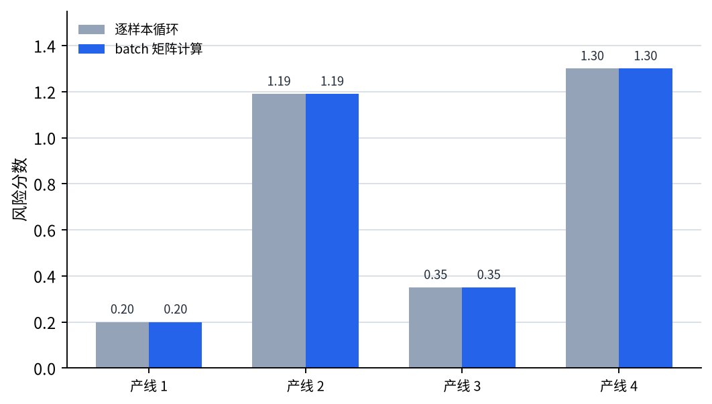
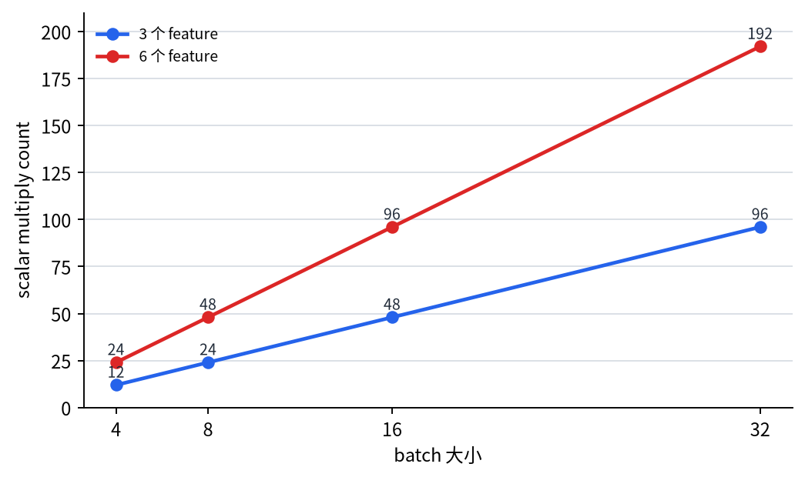

# P5-9.1 GPU 与并行处理（parallel processing）

Section ID: `P5-9.1`
Version: `v2026.07.17`

到 P5-8 章为止，我们主要看的是深度学习模型内部发生的学习计算和 regularization。把视野再稍微放宽一点，接下来就会冒出一个问题。

深度学习明明需要这么多 parameter 和重复计算，为什么偏偏是到了某个时期之后，才突然开始显得实用了？

要回答这个问题，很难绕开 GPU（graphics processing unit）和并行处理（parallel processing）。

深度学习的扩散，并不是只靠算法想法本身发生的。它也和能把大量相同运算同时处理掉的计算资源发展，紧紧连在一起。

如果之后又觉得计算资源这件事重新变得抽象，更适合一起回到[英文概念词汇表里的 GPU 条目](/AiBook/en/reference/concept-glossary/#gpugraphics-processing-unit)和[parallel processing 条目](/AiBook/en/reference/concept-glossary/#parallel-processing)，重新对齐这两个概念。

## 本节范围

- 为什么深度学习的计算量这么大？
- 在入门层面，CPU 和 GPU 该怎样区分？
- 什么叫并行处理，它为什么和深度学习这么合拍？
- 为什么在深度学习历史里，GPU 常常被说成一个转折点？

这一节先关住的是：为什么深度学习更像`海量重复相同数值运算的问题`，以及为什么这种重复计算会和 GPU、并行处理特别契合。也就是说，这里先专注于抓住`计算资源的大图景`。

同时，这一节也明确把接下来会继续具体化的问题交出去。GPU 擅长处理的深度学习计算，真实会以什么样的数据分组和 shape 被交给模型，会在下一节 P5-9.2 里继续通过 batch 和 tensor 计算说明。Transformer 为什么又会和 GPU 式并行处理特别契合，则会在后面的 P5-14.1、P5-14.2 再重新接回。

## 本节目标

- 能说明深度学习为什么会因为大矩阵运算和重复计算而对计算资源敏感。
- 能从`任务是怎么被打包的`这个角度，直观解释 CPU 和 GPU 的区别。
- 能说明并行处理怎样影响深度学习训练速度与实用性。
- 能从 GPU 的视角重新读 AlexNet 这类历史转折点。

## 为什么深度学习的计算量这么大

深度学习模型哪怕只是做一次预测，也要执行很多次乘法和加法。到了学习阶段，还会在此基础上继续叠上 loss 计算、backpropagation、optimizer update。

例如：

- 输入很多
- 隐藏层很大
- 数据很多
- epoch 还要重复很多次

那么运算量就会非常快地膨胀。

在深度学习里，下面这些计算尤其会反复出现。

- vector 和 matrix 的乘法
- 大 tensor 级别的加法与乘法
- 按 batch 重复的计算

也就是说，深度学习与其说像是`一个单独而复杂的问题`，不如说更接近`把非常相似的数值运算重复海量次的问题`。

## 在入门层面怎样区分 CPU 和 GPU

最安全的比喻是下面这样。

- CPU 更像是少量但很强的工作者，灵活地处理各种不同任务
- GPU 更像是非常多的工作者，把相似任务拆开后同时处理

这并不是精确的硬件定义，但已经足够用来解释：为什么 GPU 会和深度学习这么合拍。

也就是说：

- 操作系统、浏览器、复杂条件分支这类工作，更带有 CPU 的感觉
- 大量重复同类数值运算的工作，则更带有 GPU 的感觉

深度学习恰好非常适合后者。

## 什么是并行处理

并行处理，是把多个计算拆开后同时处理的方式。先理解到下面这个程度就够了。

`不是把彼此独立或相似的计算一项项排队算完，而是把它们分到多个计算资源上同时处理。`

在深度学习里，尤其下面这些对象很适合并行化：

- 一个 batch 里的多个样本
- 矩阵里的许多元素计算
- 多个 channel 和 feature map 运算

也就是说，正因为深度学习`会反复执行大量同一模式的数值运算`，它天生就很适合 GPU 式的并行处理结构。

## 为什么深度学习和并行处理这么合拍

深度学习计算大体可以压成下面三个特征。

- 会形成大矩阵
- 会把同样运算施加在很多位置上
- 会一次处理很多样本

这种结构`本身就比较容易被拆分成许多独立计算块`。

例如：

- 把 convolution 应用在一张图片的不同位置
- 把同一个 linear layer 应用到 batch 里的多个样本
- 同时计算矩阵里的很多元素

这些都很契合 GPU 的强项。

`正因为深度学习会大量重复同一种数值计算，所以它和许多计算单元同时开动的方式天然合拍。`

如果把这种差别画成顺序处理和并行处理的对照，大致就是下面这样。

```mermaid
--8<-- "assets/part-05/chapter-09/cpu-gpu-parallel-flow-zh.mmd"
```

这张图里首先要确认的结果是：GPU 的关键并不是`它会做更复杂的计算`，而是`同样的计算更容易一次性铺到许多样本和位置上`。

## 为什么 GPU 在历史里会显得像转折点

深度学习的核心想法并不是最近才突然出现。perceptron、多层神经网络、backpropagation 这些关键概念，在更早以前就已经存在了。可深度学习会在某个时间点后迅速扩散，其中一个重要原因正是：`它终于算得动了。`

尤其是 2012 年的 AlexNet，常常会被描述成下面这些因素一起汇合的转折点。

- 大规模数据（ImageNet）
- 更深的 CNN 结构
- 基于 GPU 的训练
- 训练技术和 regularization 技术的组合

也就是说，只有想法本身还不够，还必须有`能把这些想法在真实规模上跑起来的计算资源`一起到位。

## 为什么 AlexNet 会被反复提起

AlexNet 更适合这样理解。

`让深度学习不再只是研究概念，而开始像是真正性能转折点的代表性案例`

AlexNet 之所以被反复提起，并不只是因为模型很大，而是因为基于 GPU 的大规模训练在图像识别上拉开了明显性能差距，也让深度学习的实用性开始被广泛看见。

因此，GPU 不只是一个零件，而更像是深度学习历史里`把想法抬到工业规模实验上的装置`。

## 案例与示例

### 案例. 同样的风险分数，一条条算和按 batch 一起算

假设我们要根据 4 条工厂生产线的传感器数值，计算风险分数。每条生产线都有 3 个 feature，而且所有生产线都使用同一组权重向量。人一开始很容易觉得：既然最后结果一样，那把`line 1 score`、`line 2 score`、`line 3 score`一个个顺着算，似乎也没什么大差别。在一个很小的例子里，这种感觉确实没错。即使只用 CPU，也足够追踪每条生产线的分数是怎么被算出来的。

但这一节更重要的差异，不在最后那一个分数上，而在`计算是怎样被组织起来的`。如果生产线不是 4 条，而是 4,000 条，而且同一个线性运算要在每个学习 step 里反复执行，那么`把同样计算一条条按顺序跑完`和`把整个 batch 一次性打包起来`的差异就会马上变大。GPU 和并行处理真正的核心，也正是在这里。它们不是突然把数学变得更复杂，而是把海量同类乘法和加法组织成更容易同时执行的结构。

因此，这个案例里首先要确认的是两件事。

- 按样本逐个重复的计算，和按 batch 的矩阵计算，能不能得到同样的分数？
- batch 越大，顺序重复计算的负担会多快变重？

先把这个案例固定住，下面例子里为什么会同时去看 `same result` 和 `scalar multiply count`，就会更自然地接上。

## 练习与例子

这个例子的目标，是把`同一个线性运算只施加在单个样本上`和`一次施加在整个 batch 上`这两种情况并排放在一起。

输入：

- 一个很小的 batch，包含 4 条生产线，每条有 3 个 feature
- 一组会对所有生产线共同使用的 3 个权重

输出：

- 每条生产线的风险分数
- 一次矩阵计算得到的分数
- 重复计算次数
- 当 batch 变大时，重复计算规模会怎样继续增长的比较

问题场景：

- 需要直接确认：batch 计算的本质，是把本来要按样本重复的同一个运算，改成一次矩阵运算来处理
- 即使只是小例子，只要把重复次数的增长一起看进去，也会更容易读出：为什么计算资源会改变哪些实验真正可做

要确认的概念：

- batch 矩阵计算会一次性给出多个样本的分数
- 一旦确认重复计算和矩阵计算会得到同样结果，batch 处理的意义就会更清楚
- 还要一起看到：随着 batch 增大，顺序重复计算的规模会立刻膨胀

从初学者角度，更适合按下面三个步骤来读这个例子。

| 阅读步骤 | 先看什么 | 接着马上要抓住的问题 |
| --- | --- | --- |
| 1 | 每条生产线的分数是怎么算出来的 | 按样本重复计算和 batch 计算会不会得到同样分数？ |
| 2 | `scalar multiply count` 到底是多少 | 当同一种运算随着 batch 放大时，它会多快膨胀？ |
| 3 | 为什么要把 CPU 和 GPU 分开讲 | 即使结果一样，计算组织方式会不会改变实验真正可行的范围？ |

输入（input）：

我们使用上面整理好的生产线 batch 和共同权重向量。

在看代码之前，可以先预测：什么会保持不变，什么会继续变大。

| 比较 | 可以先预测的比较 | 预测理由 |
| --- | --- | --- |
| `scores_one_by_one` vs `scores_batch` | 很可能会得到同样结果 | 因为计算含义本身没变，只是打包方式不同 |
| `scalar multiply count` | 很可能会随着 batch 和 feature 数增长而立刻变大 | 因为乘法重复次数会按样本数和 feature 数一起累计 |
| 实验负担 | 随着 batch 和模型变大，CPU 式顺序计算会更吃力 | 因为同类重复计算会很快增长 |

这里真正要确认的差异，也不会停在简单的计算量比较上。哪怕最后分数一样，CPU 侧的读法也应该继续连到`做完这一个实验到底要花多久`，而 GPU 侧的读法则应该继续连到`batch 大小、输入 feature 数、权重设置还能被改多少次再试一遍`。也就是说，这一节的计算差异，最终必须一路连到`实验回转速度`的差异。

这张表的目的，是把`结果相同`和`计算负担增长`拆开来读。下面这段代码把 `batch size` 和 `feature count` 都保留成可直接改动的值，好让读者立刻实验：到底是哪一类值对重复计算的膨胀更敏感。

```python
import numpy as np

# 4 lines, 3 features each
batch = np.array([
    [1.0, 0.5, 2.0],
    [0.2, 1.5, 0.3],
    [1.2, 0.1, 0.7],
    [0.0, 2.0, 1.0],
])

weights = np.array([0.4, 0.8, -0.3])
probe_batch_sizes = [4, 8, 16, 32]
probe_feature_sizes = [3, 6]


def scalar_multiply_count(batch_size, feature_count):
    return batch_size * feature_count


scores_one_by_one = []
scalar_multiply_total = 0
for sample in batch:
    score = 0.0
    for x, w in zip(sample, weights):
        score += x * w
        scalar_multiply_total += 1
    scores_one_by_one.append(round(score, 3))

scores_batch = batch @ weights
scaling_table = {
    feature_count: [
        scalar_multiply_count(batch_size, feature_count)
        for batch_size in probe_batch_sizes
    ]
    for feature_count in probe_feature_sizes
}

print("batch shape =", batch.shape)
print("scores_one_by_one =", scores_one_by_one)
print("scores_batch =", np.round(scores_batch, 3).tolist())
print("same result =", np.allclose(scores_one_by_one, scores_batch))
print("scalar multiply count =", scalar_multiply_total)
for feature_count, counts in scaling_table.items():
    print(f"estimated scalar multiplies (feature={feature_count}) =", counts)
print("if batch size doubles, estimated scalar multiplies =", scalar_multiply_count(batch.shape[0] * 2, batch.shape[1]))
```

读输出时，先看 `scores_one_by_one` 和 `scores_batch` 是否一致，再看 `scalar multiply count` 和 `estimated scalar multiplies` 是怎样继续增长的。

```text
batch shape = (4, 3)
scores_one_by_one = [0.2, 1.19, 0.35, 1.3]
scores_batch = [0.2, 1.19, 0.35, 1.3]
same result = True
scalar multiply count = 12
estimated scalar multiplies (feature=3) = [12, 24, 48, 96]
estimated scalar multiplies (feature=6) = [24, 48, 96, 192]
if batch size doubles, estimated scalar multiplies = 24
```

- 分数本身是一样的
- 但 batch 越大，feature 越多，重复乘法次数就会立刻膨胀
- 也就是说，GPU 的意义不是改变答案，而是改变你能用多大规模、以多快速度继续实验

先看的第一份产物，是逐条生产线的风险分数比较图。它再次确认：按样本循环和按 batch 的矩阵计算，可以得到同样分数。



第二份产物，是随着 batch 大小和 feature 数增长，scalar multiply count 会怎样增长的图。这里最重要的点不是某个具体数字本身，而是：一旦 batch 和 feature 同时增长，重复计算的规模会快速拉高。



| 比较 | 现在要读的核心 |
| --- | --- |
| `same result` | 逐样本循环和 batch 矩阵计算可以给出同样答案。 |
| `scalar multiply count` | 即使只是小例子，只要 batch 与 feature 增长，重复计算规模就会立刻变大。 |
| `estimated scalar multiplies` | 这不是在炫耀大数字，而是在说明：计算资源会直接决定你还能不能继续扩大实验。 |

即使在读这些输出时，也要把`答案是否相同`和`实验是否还能负担得起`分开来读。

| 比较 | 输出里首先看到的 | 只看结果时容易留下的解读 | 把 GPU 视角一起算进去之后会改变的解读 |
| --- | --- | --- | --- |
| `same result` | `scores_one_by_one` 和 `scores_batch` 完全一致 | 容易觉得既然答案一样，就没有本质差别 | 结果一样并不代表计算组织方式一样，而后者会直接改变实验规模 |
| `scalar multiply count` | 在 `(4, 3)` 的小例子里只是 `12` 次乘法 | 容易觉得这个负担很小，没什么可区分 | 小例子只是为了让膨胀趋势可见，真正关键是它会跟 batch 与 feature 一起快速增长 |
| `estimated scalar multiplies` | feature 从 3 变 6、batch 持续翻倍时，次数马上跳到 `192` | 容易把它只看成机械的次数增加 | 它其实是在提示：CPU 式顺序实验会多快碰到瓶颈，而 GPU 式批量处理为什么能把实验范围继续往外推 |

也就是说，这个例子里，读者真正该抓住的不是`GPU 会不会改变数学答案`，而是`同样答案背后的计算组织方式，会不会改变你能做到多大规模、能试多少次实验。`

GPU 和并行处理之所以在深度学习历史里这么关键，也正是因为它们改变的不是模型定义本身，而是实验真正可执行的边界。

把这个结果再翻回真实实验运转，CPU 式读法很容易流向`只要分数一样，计算方式差异就是次要的`，而 GPU 式读法会更早先问：`什么 batch、什么设置，才是真正还能持续重复实验的。` 这一节真正要读出的转折点，不只是速度更快，而是这种`实验设计可行范围`的差异。

Part 5 里 GPU 这一节之所以重要，也不只是为了补一段硬件知识。如果把深度学习只看成纯数学理论，就会解释不出：为什么某个时期之后，它会突然引发产业级扩散。

这一节正在把下面这些东西连起来。

- Part 2 里的 vector / matrix / NumPy 计算
- Part 5 里的 backpropagation 与 optimizer
- 后续章节里 LLM 的大规模训练与推理成本

也就是说，GPU 这一节其实是那条历史桥梁，用来说明`为什么深度学习会变成大规模计算产业。`

先在这里停一下，把`什么时候该比模型结构更早想到计算资源视角`这条判断 기준固定住，后面的章节会更不容易摇晃。

| 先冒出的提问 | 为什么此时更需要 GPU / parallel processing 视角 | 这一节还不会继续深挖的东西 |
| --- | --- | --- |
| 为什么模型突然变得特别慢？ | 因为要先确认是不是海量同类运算在反复出现，batch 与矩阵计算是不是已经成了瓶颈 | framework kernel 优化、CUDA 内部实现 |
| 为什么实验需要反复跑很多次，却总是太耗时？ | 因为计算资源不只是速度问题，而是实验回转本身能不能成立的条件 | TPU、NPU、分布式训练基础设施细节 |
| 为什么模型一旦变大，连能不能训练都不一样了？ | 因为 parameter 数和输入规模增大时，会一起推高 memory 和运算上限 | memory bandwidth、硬件架构细节 |

## 在学习 흐름里应该把 GPU 放在哪里读

这一节最适合被拿出来的时刻，是当读者开始觉得：深度学习好像不只是模型问题，而也开始像计算资源问题的时候。GPU 不是某个模型里的附属零件，而应该被读成：让深度学习从`想法成立`走到`真实规模可重复实验`的关键条件之一。

| 首先出现的问题场景 | 为什么此时 GPU 视角更有用 | 接着会连到哪里 |
| --- | --- | --- |
| 模型和数据一变大，实验就显得越来越难跑 | 它能解释：为什么深度学习不是只靠算法，还强烈依赖计算组织方式 | 会继续连到 P5-9.2 里的 batch 与 tensor shape 阅读 |
| 看不出 CPU 和 GPU 为什么都要被单独提起 | 它能把`结果一样`与`任务如何被打包`分开来读 | 后面会继续连到更大的矩阵计算与 Transformer 并行结构 |
| 历史里 AlexNet 为什么总被当作转折点 | 它能说明：真正变的并不是概念突然诞生，而是大规模计算终于变得可行 | 会再连回模型规模、数据规模和实验速度的组合关系 |
| 感觉深度学习只是更复杂的数学 | 它能把重点重新拉回：大量重复同类运算才是 GPU 合拍的原因 | 会进一步连到 batch、tensor、shape 的计算语言 |

## 检查清单

- 能说明深度学习为什么特别依赖计算资源吗？
- 能把 CPU 和 GPU 的差别解释成`少量灵活工作者`与`大量同时处理相似工作的工作者`吗？
- 能说明 parallel processing 为什么会和深度学习这种重复数值运算结构特别契合吗？
- 能说明 GPU 改变的不是数学答案本身，而是实验规模和实验回转速度吗？
- 能从 GPU 视角重新理解 AlexNet 为什么像一个历史转折点吗？
- 能理解这一节先关住的是 GPU/并行处理的大图景，而 batch/tensor 问题会继续交给下一节吗？

## 出处与参考资料

- Alex Krizhevsky, Ilya Sutskever, Geoffrey E. Hinton, `ImageNet Classification with Deep Convolutional Neural Networks`, NeurIPS 2012, 确认日期：2026-06-29。
- Ian Goodfellow, Yoshua Bengio, Aaron Courville, `Deep Learning`, MIT Press, 2016, 确认日期：2026-06-29。 [https://www.deeplearningbook.org/](https://www.deeplearningbook.org/){: target="_blank" rel="noopener noreferrer" }
- NVIDIA, `What Is a GPU?`, NVIDIA Docs / corporate documentation, 确认日期：2026-06-29。 [https://www.nvidia.com/en-us/glossary/gpu/](https://www.nvidia.com/en-us/glossary/gpu/){: target="_blank" rel="noopener noreferrer" }
