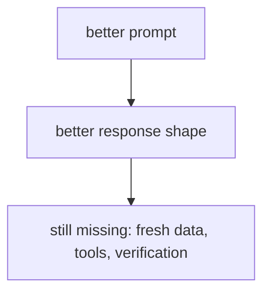

# P5-9.2 프롬프트의 한계

P5-9.1에서는 프롬프트 엔지니어링(prompt engineering)이 입력 설계를 통해 모델 행동을 관찰하고 조정하는 첫 번째 실무 도구라는 점을 보았습니다. 하지만 여기서 바로 더 중요한 질문이 나옵니다.

프롬프트를 잘 쓰면 정말 원하는 문제를 다 해결할 수 있을까?

이 절은 그 질문에 답합니다.

프롬프트는 모델 반응을 유도하는 강한 도구이지만, 최신성·사실성·근거 보장·장기 일관성까지 혼자 해결하는 도구는 아니다.

## 이 절의 범위

이 절은 다음 질문에 답합니다.

- 프롬프트만으로 해결하기 어려운 문제는 무엇인가?
- 왜 프롬프트가 좋아 보여도 실제 서비스에서는 불충분할 수 있는가?
- 어떤 시점에서 RAG, 파인튜닝, 도구 사용, 평가 체계가 필요해지는가?

이 절에서는 다음 내용을 깊게 다루지 않습니다.

- RAG 구현 세부
- 평가 자동화 도구 비교
- 에이전트 프레임워크 구조

프롬프트만으로 부족한 최신성·근거 문제는 바로 다음 P5-10.1 RAG의 필요성과 P5-10.2 검색 결과와 생성의 결합에서 다시 회수합니다. 평가 구조는 P5-15.1과 P5-15.2에서, 에이전트 프레임워크의 큰 그림은 P5-13.1과 P5-13.2에서 각각 다시 다룹니다.

이 절의 목적은 프롬프트 엔지니어링을 과대평가하지 않고, 다음 구조적 도구들이 왜 필요한지 설명하는 데 있습니다.

## 이 절의 목표

- 프롬프트의 한계를 입문 수준에서 설명할 수 있습니다.
- 최신성, 사실성, 일관성, 실행 가능성 문제가 왜 남는지 말할 수 있습니다.
- 프롬프트로 해결할 문제와 구조를 바꿔야 할 문제를 구분할 수 있습니다.
- 다음 장의 RAG 필요성으로 자연스럽게 넘어갈 수 있습니다.

## 프롬프트는 왜 강력하지만 불완전한가

프롬프트는 입력을 설계하는 도구입니다. 따라서 모델이 가진 능력을 더 잘 끌어내거나, 형식을 더 안정되게 만들 수는 있습니다. 하지만 입력 설계만으로는 모델 바깥의 문제를 모두 해결할 수 없습니다.

예를 들어 프롬프트는:

- 답변 길이 조정
- 형식 제어
- 예시 기반 패턴 유도
- 말투 조정

에는 강할 수 있습니다.

반면 프롬프트만으로는 다음이 자동 해결되지 않습니다.

- 최신 정보 반영
- 외부 문서 근거 보장
- 데이터베이스 조회
- 계산 결과 검증
- 긴 작업 흐름의 재현성

## 최신성 문제

모델이 학습 이후에 생긴 정보를 자동으로 아는 것은 아닙니다. 프롬프트를 더 정교하게 써도, 모델이 본 적 없는 최신 사실을 확실히 보장할 수는 없습니다.

따라서 `최신 정보를 기준으로 답해 줘`라는 프롬프트는 요청일 뿐, 외부 최신 데이터 연결을 대신하지 않습니다.

이 지점에서 RAG나 도구 사용이 필요해집니다.

## 사실성과 근거 문제

프롬프트에 `근거를 들어 설명해 줘`라고 써도, 모델이 실제 근거 문서를 조회한 것은 아닐 수 있습니다. 그럴듯한 설명을 만들어 낼 가능성은 있지만, 진짜 출처와 연결되었다는 보장은 없습니다.

즉:

- 근거를 요구하는 프롬프트
- 실제 근거 문서를 연결한 시스템

은 같은 것이 아닙니다.

이 구분이 없으면 사용자는 `출처처럼 보이는 답`을 `검증된 답`으로 오해할 수 있습니다.

## 일관성과 재현성 문제

프롬프트를 조금 바꾸거나, temperature가 달라지거나, 맥락 순서가 달라지면 출력이 변할 수 있습니다. 따라서 프롬프트만으로 아주 엄격한 재현성을 보장하기는 어렵습니다.

이것은 실무에서 다음과 같이 나타납니다.

- 같은 요청인데 표현이 흔들린다
- 분류 라벨이 미세하게 달라진다
- 표 형식이 가끔 깨진다
- 긴 작업에서 앞뒤 기준이 달라진다

이런 문제는 프롬프트 개선으로 줄일 수는 있지만, 완전히 없애기 어렵습니다.

## 실행과 행동 문제

프롬프트는 기본적으로 텍스트 입력입니다. 따라서:

- 실제 데이터베이스 조회
- 외부 API 호출
- 파일 수정
- 계산 결과 저장

같은 행동은 프롬프트만으로 일어나지 않습니다. 이런 단계에서는 도구 사용(tool use), 함수 호출(function calling), 에이전트(agent) 구조가 필요해집니다.

즉, 프롬프트는 `행동 요청`을 표현할 수는 있어도, 행동 실행 구조 그 자체는 아닙니다.

## 아주 단순하게 그리면



이 도식의 핵심은 프롬프트 개선이 중요하지만, 그것만으로 구조 문제를 다 해결하지는 못한다는 점입니다.

## 사례로 보기

### 사례 1. 최신 정책 안내

사용자가 `오늘부터 환불 기한이 며칠인가요?`라고 묻는 장면을 생각해 볼 수 있습니다. 프롬프트를 아무리 정교하게 써서 `정확하고 신중하게 답하라`고 지시해도, 최신 정책 원문이 입력에 들어오지 않으면 모델은 예전 기준을 말할 수 있습니다. 사람은 답변이 조심스럽고 말투가 단정하면 더 믿기 쉽지만, 이 장면에서 놓치기 쉬운 핵심은 답변 태도가 아니라 `현재 문서에 접근했는가`입니다. 최신 문서 연결이 없으면 정중한 오답이 그대로 운영 안내로 나갈 수 있습니다. 이 경우 문제는 프롬프트가 약해서가 아니라, 최신 정보를 연결하는 구조가 빠져 있다는 데 있습니다. 그래서 이 사례는 프롬프트 개선이 아니라 RAG 같은 정보 연결 구조가 먼저 필요한 장면입니다.

### 사례 2. 수치 계산이 중요한 보고서

주간 매출 보고서를 자동으로 작성한다고 해 봅시다. 프롬프트에 `숫자를 정확히 계산해서 표로 정리해 달라`고 넣을 수는 있지만, 실제 합계와 증감률을 계산 도구 없이 바로 믿으면 작은 산술 오류가 그대로 보고서에 들어갈 수 있습니다. 사람은 표 형식도 맞고 문장도 매끄러우면 `정확해 보인다`고 느끼기 쉽습니다. 하지만 이 장면에서 필요한 것은 더 강한 문장이 아니라 계산기나 후처리 검증처럼 숫자를 다시 확인하는 구조입니다. 계산이 한 칸만 틀려도 뒤 해석 문장과 의사결정까지 같이 어긋날 수 있습니다. 그래서 `정확히 해 달라`는 프롬프트와 `정확함을 보장하는 구조`는 서로 다른 문제임이 드러납니다.

### 사례 3. 반복 업무 자동화

운영팀이 `업로드된 파일을 읽고 분류해서 폴더에 저장해 달라`는 자동화를 원한다고 해 봅시다. 프롬프트로는 읽기, 분류, 저장까지 한 문장으로 적을 수 있지만, 실제 시스템에서는 파일 접근 권한, 분류 기준, 저장 위치, 실패 시 재시도 같은 단계가 따로 필요합니다. 사람은 요청 문장이 충분히 구체적이면 실행도 거의 해결된 것처럼 느끼기 쉽지만, 실제 세계에서는 말보다 권한과 도구 연결이 더 중요합니다. 권한이 없거나 저장 경로가 잘못되면 분류 자체는 맞아도 마지막 저장 단계에서 작업이 끊길 수 있습니다. 즉, 사람이 말로는 한 줄로 끝낼 수 있어도 실행 세계에서는 여러 도구와 애플리케이션이 붙어야 합니다. 그래서 이 장면에서 부족한 것은 더 긴 프롬프트가 아니라 실행 구조 자체입니다. 이 사례는 프롬프트만으로는 자동화의 마지막 단계까지 닫히지 않는다는 점을 보여 줍니다.

## 작은 Python 예제로 보기

이번 예제의 목표는 `프롬프트 요청`과 `실제 구조 보장`이 다른 문제라는 점을 보여 주는 것입니다.

입력:

- 하나의 강한 프롬프트

출력:

- 남아 있는 구조 문제 목록

```python
prompt = "최신 정책 문서를 근거로 정확한 답을 표 형식으로 정리해 주세요."

still_needed = [
    "latest_document_access",
    "source_verification",
    "format_validation",
    "possible_tool_use",
]

print("prompt =", prompt)
print("still_needed =", still_needed)
```

실행 결과 예시는 다음처럼 읽을 수 있습니다.

```text
prompt = 최신 정책 문서를 근거로 정확한 답을 표 형식으로 정리해 주세요.
still_needed = ['latest_document_access', 'source_verification', 'format_validation', 'possible_tool_use']
```

이 예제는 프롬프트가 좋아 보여도, 실제 시스템이 더 필요할 수 있다는 점을 보여 줍니다.

## 역사와 커리큘럼 관점

초기 생성형 AI 사용 경험에서는 프롬프트 엔지니어링이 매우 강하게 보였습니다. 실제로 입력 설계만으로도 모델 행동이 크게 달라졌기 때문입니다. 하지만 서비스화가 진행될수록 사람들은 곧 한계를 보게 되었습니다.

- 최신성 부족
- 근거 부족
- 출력 흔들림
- 실행 불가

이 한계가 드러나면서 RAG, tool use, agent, evaluation, harness 같은 다음 구조가 중요해졌습니다.

커리큘럼 관점에서 이 절이 중요한 이유는 다음과 같습니다.

- 프롬프트를 과대평가하지 않게 하고
- 구조를 추가해야 하는 시점을 판단하게 하며
- 다음 장에서 RAG가 왜 필요한지 자연스럽게 연결하기 때문입니다

## 다음 장과의 연결

여기까지 오면 다음 질문은 매우 직접적입니다.

- 프롬프트만으로 부족하다면, 외부 근거를 어떻게 연결해야 하는가?
- 모델 기억이 아니라 검색된 문서를 함께 넣는 구조는 어떻게 이해해야 하는가?

이 질문은 P5-10.1 RAG의 필요성으로 이어집니다.

## 이 절에서 기억할 관점

- 프롬프트는 강력한 입력 설계 도구이지만, 모든 구조 문제를 해결하지는 않습니다.
- 최신성, 근거, 일관성, 실행 가능성은 별도 구조가 필요한 경우가 많습니다.
- 프롬프트 개선과 시스템 설계는 다른 층위(level)의 문제입니다.
- 이 절은 RAG, 도구 사용, 평가 구조가 왜 필요한지 설명하는 연결 절입니다.

## 체크리스트

- 프롬프트의 한계를 입문 수준에서 설명할 수 있는가?
- 최신성, 근거, 일관성, 실행 문제가 왜 남는지 말할 수 있는가?
- 프롬프트로 해결할 문제와 구조를 바꿔야 할 문제를 구분할 수 있는가?
- 왜 다음 장에서 RAG가 등장해야 하는지 설명할 수 있는가?

## 출처와 참고 자료

- Tom B. Brown et al., `Language Models are Few-Shot Learners`, arXiv, 2020, 확인 날짜: 2026-06-29.
- OpenAI, 프롬프팅 및 RAG 관련 공식 문서, 확인 날짜: 2026-06-29.
- Anthropic, 프롬프팅과 tool use 관련 공개 문서, 확인 날짜: 2026-06-29.
