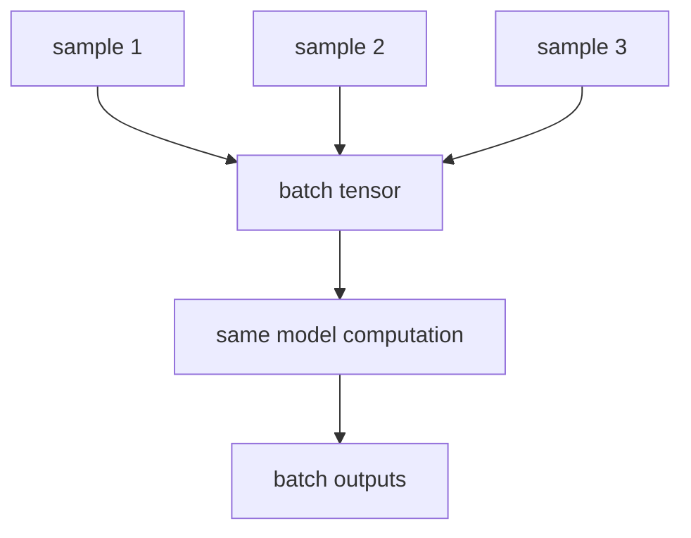

# P5-9.2 배치(batch)와 텐서(tensor) 계산

P5-9.1에서는 딥러닝이 왜 GPU와 병렬 처리(parallel processing)에 잘 맞는지 보았습니다. 여기서 바로 다음 질문이 생깁니다.

그렇다면 GPU가 잘 처리하는 딥러닝 계산은 실제로 어떤 모양의 데이터 묶음으로 주어지는가?

이 질문에 답할 때 반복해서 등장하는 표현이 배치(batch)와 텐서(tensor)입니다.

배치(batch)는 여러 샘플을 한꺼번에 계산하기 위한 묶음이고, 텐서(tensor)는 그런 묶음을 포함해 딥러닝이 다루는 다차원 숫자 배열의 일반 이름이다.

## 이 절의 범위

이 절은 다음 질문에 답합니다.

- 배치(batch)는 왜 필요한가?
- 텐서(tensor)는 벡터와 행렬에서 어떻게 확장되는가?
- 배치 단위 계산은 병렬 처리와 어떤 관계가 있는가?
- 입력 shape를 읽는 감각은 왜 중요한가?

이 절에서는 다음 내용을 깊게 다루지 않습니다.

- 메모리 레이아웃과 stride의 내부 구현
- 프레임워크별 tensor class 세부 차이
- 분산 배치 처리(distributed batching)의 시스템 상세

메모리 레이아웃과 stride의 내부 구현, 프레임워크별 tensor class 차이는 현재 절의 범위를 넘어가므로 여기서는 다루지 않습니다. 대신 `shape가 왜 중요한가`와 `큰 행렬 계산이 어떻게 이어지는가`라는 감각은 P5-13.2 attention과 P5-14.1, P5-14.2 Transformer 계산 구조에서 다시 회수합니다. 분산 배치 처리(distributed batching)의 시스템 상세는 이 책의 현재 본편 범위 밖에 둡니다.

이 절에서는 텐서 수학의 엄밀한 정의보다, `딥러닝 계산이 어떤 데이터 모양으로 흐르는가`를 설명합니다. GPU 병렬 처리의 큰 그림은 P5-9.1에서 이미 봤고, Transformer와 attention의 대규모 행렬 계산은 P5-13.2와 P5-14.1, P5-14.2에서 다시 연결합니다. 메모리 레이아웃, stride, 분산 배치 처리 세부는 이 책의 현재 본편 범위 밖에 둡니다.

## 이 절의 목표

- 배치를 `여러 샘플을 한 번에 처리하는 계산 단위`로 설명할 수 있습니다.
- 텐서를 `벡터와 행렬을 포함하는 다차원 배열`로 설명할 수 있습니다.
- shape를 읽는 습관이 왜 딥러닝 실습에 중요한지 말할 수 있습니다.
- 실행 가능한 Python 예제로 batch와 tensor shape 감각을 확인할 수 있습니다.

## 배치는 왜 필요한가

딥러닝에서는 같은 모델을 많은 샘플에 반복 적용합니다. 한 샘플씩 순서대로 처리할 수도 있지만, 그러면 병렬 처리의 이점을 충분히 살리기 어렵습니다.

배치(batch)는 여러 샘플을 묶어서 한 번에 계산하는 방식입니다.

예를 들어:

- 이미지 1장만 처리하는 대신 32장을 같이 처리하고
- 문장 1개만 넣는 대신 여러 문장을 같이 넣으며
- 표 데이터도 여러 행(row)을 한 번에 모델에 전달합니다

다음처럼 이해하면 충분합니다.

`배치는 모델이 같은 연산을 여러 샘플에 반복해야 할 때, 그 반복을 한 덩어리로 묶어 계산하게 해 준다.`

## 배치를 쓰면 무엇이 좋아지나

배치를 쓰는 이유는 단순히 편의 때문만이 아닙니다.

- GPU의 병렬 계산을 더 잘 활용할 수 있고
- 샘플 하나씩 처리할 때보다 계산 효율이 좋아질 수 있으며
- gradient도 여러 샘플의 정보를 한 번에 반영하게 됩니다

물론 배치가 너무 크면 메모리를 많이 쓰거나, 학습 dynamics가 달라질 수도 있습니다. 하지만 입문 단계에서는 먼저 `병렬 계산의 기본 단위`로 이해하면 충분합니다.

## 텐서는 무엇인가

Part 2에서 스칼라(scalar), 벡터(vector), 행렬(matrix)를 보았습니다. 텐서는 이 흐름의 자연스러운 확장입니다.

다음 표로 설명하면 충분합니다.

| 이름 | 예시 | 차원 수 |
| --- | --- | --- |
| 스칼라(scalar) | `3.14` | 0차원 |
| 벡터(vector) | `[1, 2, 3]` | 1차원 |
| 행렬(matrix) | `[[1, 2], [3, 4]]` | 2차원 |
| 텐서(tensor) | 배치가 붙은 이미지/문장 배열 | 3차원 이상도 포함 |

즉, 텐서는 특별한 마법 개념이라기보다 `다차원 숫자 배열`을 넓게 부르는 이름입니다.

`딥러닝에서는 입력, 중간 표현, 출력이 모두 텐서로 흐른다고 보면 된다.`

## 이미지, 문장, 표 데이터는 어떤 텐서로 보이나

딥러닝에서는 데이터 종류가 달라도 결국 텐서 모양으로 정리됩니다.

예를 들어:

- 표 데이터: `(batch_size, feature_count)`
- 흑백 이미지: `(batch_size, height, width)`
- 컬러 이미지: `(batch_size, channel, height, width)` 또는 프레임워크에 따라 채널 위치가 다를 수 있음
- 문장 임베딩: `(batch_size, sequence_length, embedding_dim)`

즉, 텐서는 데이터 도메인을 넘어 공통 계산 언어 역할을 합니다.

## shape를 읽는 감각이 왜 중요한가

실습에서 가장 자주 만나는 오류 중 하나는 shape를 잘못 읽어 `어느 축이 배치인지`, `어느 축이 길이·채널·특징 차원인지`를 헷갈리는 것입니다.

예를 들어:

- 배치 차원을 빼먹거나
- 행과 열을 뒤집거나
- 채널 위치를 헷갈리거나
- 라벨 shape와 출력 shape가 맞지 않으면

모델이 아예 실행되지 않거나, 실행은 되지만 엉뚱한 계산을 할 수 있습니다.

다음 습관이 중요합니다.

`딥러닝 실습에서는 값 자체만 보지 말고, 항상 shape를 함께 본다.`

## 배치 계산과 병렬 처리의 연결

P5-9.1에서 본 GPU의 강점은 비슷한 연산을 많이 동시에 처리하는 데 있었습니다. 배치는 바로 그 구조를 딥러닝 계산에 맞게 제공하는 방식입니다.

즉:

- 모델은 같은 가중치를 유지한 채
- 배치 안의 여러 샘플에 대해
- 같은 forward와 backward 패턴을 반복합니다

이 반복이 batch dimension으로 묶이면서 병렬 계산과 자연스럽게 연결됩니다.

이를 아주 단순하게 그리면 다음과 같습니다.



## 사례로 보기

### 사례 1. 표 데이터 분류

고객 데이터가 100개 있고 각 고객마다 feature가 20개라면, 사람은 한 명씩 읽어도 결국 같은 계산을 반복하는 것이니 큰 차이가 없다고 느끼기 쉽습니다. 하지만 딥러닝 계산에서는 여러 샘플을 한꺼번에 묶어 같은 연산을 병렬로 태우는 것이 더 자연스럽습니다. 예를 들어 한 번의 입력이 `(32, 20)`이라면, 이것은 단순 숫자 묶음이 아니라 `32명의 고객을 동시에`, `각 고객당 20개 특징으로` 처리한다는 뜻입니다. 여기서 바뀌는 점은 데이터를 `한 줄씩 보는 표`에서 `한 step의 계산 덩어리`로 읽는 방식입니다. 그 결과 모델과 프레임워크는 같은 가중치 연산을 32개 샘플에 한 번에 적용할 수 있습니다. 그래서 이 사례에서 확인해야 할 결과는 표의 행 개수만 보는 것이 아니라, 첫 축이 `같은 계산을 동시에 받는 샘플 묶음`으로 읽히는가입니다.

### 사례 2. 이미지 분류

컬러 이미지 32장을 한 번에 넣는다면 `(32, 3, 224, 224)` 같은 shape가 등장할 수 있습니다. 사람 눈에는 그냥 사진 32장처럼 보이기 쉽지만, 계산 입장에서는 `배치`, `채널`, `높이`, `너비`가 분리된 텐서입니다. 이 축을 구분하지 않으면 어떤 연산이 샘플 축에 적용되는지, 어떤 연산이 공간 축에 적용되는지 바로 헷갈리게 됩니다. 즉, 사람이 보던 기준이 `사진 몇 장인가`라면, 모델이 읽는 기준은 `각 축이 무엇을 뜻하는가`입니다. 이 차이를 이해해야 convolution, pooling, 배치 계산이 왜 같은 모양 규칙을 공유하는지도 자연스럽게 읽힙니다. 그래서 이 사례에서 확인해야 할 결과는 `(32, 3, 224, 224)`를 볼 때 사진 수만 세는 것이 아니라 배치축과 공간축을 실제로 나눠 읽을 수 있는가입니다.

### 사례 3. 문장 모델

문장 데이터를 다룰 때는 `(batch_size, sequence_length, embedding_dim)` 같은 shape가 자주 나옵니다. 사람은 문장을 그냥 글줄로 읽으니 길이만 보면 된다고 생각하기 쉽습니다. 하지만 모델은 한 번에 여러 문장을 처리하면서, 각 문장이 몇 개 토큰으로 잘렸는지와 각 토큰이 몇 차원 벡터로 표현되는지까지 함께 알아야 합니다. 예를 들어 16개 문장을 한꺼번에 읽고 각 문장이 128개 토큰, 각 토큰이 768차원 벡터라면, 텐서는 이 세 층위의 정보를 동시에 들고 있어야 합니다. 그래서 텐서는 표 데이터, 이미지, 문장처럼 서로 다른 입력을 `같은 계산 언어로 맞추는 공통 틀` 역할을 합니다. 그래서 이 사례에서 확인해야 할 결과는 문장 길이만 보는 것이 아니라, 배치축과 토큰축, 임베딩축을 구분해 shape를 읽을 수 있는가입니다.

## 실행 가능한 Python 예제로 보기

이번 예제의 목표는 같은 `첫 번째 축`이 표 데이터, 이미지, 문장 데이터에서 모두 `배치축`으로 읽힌다는 점을 직접 확인하는 것입니다.

입력:

- 표 데이터 배치
- 컬러 이미지 비슷한 4차원 텐서
- 문장 임베딩 비슷한 3차원 텐서

출력:

- 각 텐서의 shape
- 첫 번째 축이 가리키는 샘플 수
- 샘플 하나를 꺼냈을 때 남는 구조

문제 상황:

- 표 데이터, 이미지, 문장 임베딩은 모두 텐서로 다룰 수 있지만 축의 의미가 서로 다르다

확인할 개념:

- 텐서 해석은 값 자체보다 `shape`와 축 의미를 먼저 읽는 데서 시작한다
- 샘플 하나를 꺼냈을 때 어떤 구조가 남는지 보면 각 축 역할을 더 쉽게 구분할 수 있다

입력(input):

위에 정리한 표 데이터 배치, 이미지 텐서, 문장 임베딩 형태 텐서를 사용합니다.

```python
import numpy as np

tabular_batch = np.array([
    [25, 60000, 1],
    [41, 82000, 0],
    [33, 74000, 1],
])

# (batch, channel, height, width)
image_batch = np.arange(2 * 3 * 2 * 2).reshape(2, 3, 2, 2)

# (batch, sequence_length, embedding_dim)
text_batch = np.arange(2 * 4 * 3).reshape(2, 4, 3)

print("tabular_batch shape =", tabular_batch.shape)
print("number of customers =", tabular_batch.shape[0])
print("one customer row =", tabular_batch[0].tolist())
print()

print("image_batch shape =", image_batch.shape)
print("number of images =", image_batch.shape[0])
print("first image shape =", image_batch[0].shape)
print("first image, first channel =")
print(image_batch[0, 0])
print()

print("text_batch shape =", text_batch.shape)
print("number of sentences =", text_batch.shape[0])
print("first sentence shape =", text_batch[0].shape)
print("first token embedding =", text_batch[0, 0].tolist())
```

출력에서는 각 batch의 shape와 첫 샘플 구조가 데이터 종류마다 어떻게 달라지는지부터 보면 됩니다.

```text
tabular_batch shape = (3, 3)
number of customers = 3
one customer row = [25, 60000, 1]

image_batch shape = (2, 3, 2, 2)
number of images = 2
first image shape = (3, 2, 2)
first image, first channel =
[[0 1]
 [2 3]]

text_batch shape = (2, 4, 3)
number of sentences = 2
first sentence shape = (4, 3)
first token embedding = [0, 1, 2]
```

- 세 경우 모두 첫 번째 축은 `동시에 처리하는 샘플 수`입니다
- 샘플 하나를 꺼내면 표는 feature 행, 이미지는 채널-공간 구조, 문장은 토큰-임베딩 구조가 남습니다
- shape를 읽는다는 것은 숫자 개수만 세는 일이 아니라 각 축이 무엇을 뜻하는지 해석하는 일입니다

배치와 텐서라는 표현은 단순한 라이브러리 문법이 아니라, 딥러닝이 대규모 병렬 수치 계산 체계로 정착하면서 함께 일반화된 표현입니다. GPU 기반 학습이 확산되면서, 데이터를 `샘플 하나`보다 `묶음 단위 tensor`로 보는 감각이 사실상 표준이 되었습니다.

- Part 2의 선형대수와 NumPy 배열
- Part 3의 입력 행렬과 feature table
- P5-9.1의 GPU 병렬 처리

가 여기서 하나의 shape 언어로 합쳐지기 때문입니다.

즉, 텐서는 새로운 어려운 개념이라기보다, 앞에서 배운 배열 사고를 딥러닝 규모로 확장한 결과라고 보는 편이 좋습니다.

## 다음 절과의 연결

여기까지 오면 다음 질문이 남습니다.

- 이렇게 많은 텐서 계산을 거치며, 신경망은 결국 무엇을 배우는가?
- 사람이 직접 특징(feature)을 쓰지 않아도, 모델이 내부 표현(representation)을 배운다는 말은 무슨 뜻인가?

이 질문은 바로 P5-10.1 표현 학습(representation learning)으로 이어집니다.

## 이 절에서 기억할 관점

- 배치는 여러 샘플을 한꺼번에 처리하는 계산 단위입니다.
- 텐서는 딥러닝이 다루는 다차원 숫자 배열의 일반 이름입니다.
- shape를 읽을 때는 현재 축이 배치인지, 길이인지, 채널인지 구분해 입력과 출력이 기대한 구조와 맞는지 먼저 확인합니다.
- 배치와 텐서는 GPU 병렬 처리와 직접 연결되는 계산 표현입니다.

## 체크리스트

- 배치와 텐서를 각각 한 문장으로 설명할 수 있는가?
- 표 데이터, 이미지, 문장이 서로 다른 shape를 갖는다는 점을 설명할 수 있는가?
- shape를 확인하는 습관이 왜 중요한지 말할 수 있는가?
- 다음 절의 표현 학습으로 왜 자연스럽게 넘어가는지 연결할 수 있는가?

## 출처와 참고 자료

- Ian Goodfellow, Yoshua Bengio, Aaron Courville, `Deep Learning`, MIT Press, 2016, 확인 날짜: 2026-06-29. [https://www.deeplearningbook.org/](https://www.deeplearningbook.org/){: target="_blank" rel="noopener noreferrer" }
- Aurélien Géron, `Hands-On Machine Learning with Scikit-Learn, Keras, and TensorFlow`, 3rd ed., O'Reilly, 2022, 확인 날짜: 2026-06-29.
- NumPy Developers, `ndarray`, NumPy Documentation, 확인 날짜: 2026-06-29. [https://numpy.org/doc/stable/reference/arrays.ndarray.html](https://numpy.org/doc/stable/reference/arrays.ndarray.html){: target="_blank" rel="noopener noreferrer" }
