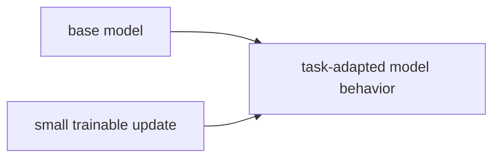

# P5-9.2 LoRA와 효율적 조정

P5-9.1에서는 파인튜닝(fine-tuning)이 사전학습된 모델을 특정 목적에 더 잘 맞게 추가 조정하는 과정이라는 점을 보았습니다. 하지만 현실에서는 곧바로 더 큰 제약이 나타납니다.

거대한 모델 전체를 매번 다시 조정하는 것은 비용이 너무 크지 않은가?

이 절은 그 문제에서 출발합니다.

LoRA는 거대한 모델 전체를 다시 크게 바꾸지 않고, 작은 추가 층을 통해 효율적으로 조정하려는 방법이다.

## 이 절의 범위

이 절은 다음 질문에 답합니다.

- 왜 효율적 조정(parameter-efficient fine-tuning)이 필요한가?
- LoRA는 어떤 문제를 줄이려는가?
- 전체 파인튜닝과 효율적 조정은 어떤 차이가 있는가?

이 절은 다음 내용은 깊게 다루지 않습니다.

- 저랭크(low-rank) 분해 수식
- adapter 계열 전체 비교표 세부
- 실제 GPU 메모리 계산식

이 절에서는 LoRA의 실무 감각만 잡고, instruction tuning이나 도메인 맞춤 조정과의 연결은 P5-10.1 지시 튜닝에서 다시 이어집니다. 저랭크 분해의 수학과 세부 메모리 계산은 현재 본편 범위 밖으로 둡니다.

이 절의 목적은 LoRA를 `작은 모델`로 오해하지 않게 하고, `큰 기반 모델 위에 작은 조정 층을 더하는 방식`으로 이해하게 만드는 것입니다.

## 이 절의 목표

- 효율적 조정이 왜 필요한지 설명할 수 있습니다.
- LoRA의 기본 아이디어를 입문 수준에서 말할 수 있습니다.
- 전체 파인튜닝과 LoRA의 비용 차이를 개념적으로 구분할 수 있습니다.
- 이후 instruction tuning이나 도메인 적응 설명과 연결할 수 있습니다.

## 왜 효율적 조정이 필요하나

LLM은 크기가 큽니다. 따라서 전체 모델 가중치를 모두 업데이트하려면 다음 부담이 커집니다.

- 메모리 사용량
- 학습 시간
- 저장 공간
- 여러 버전 관리 비용

실무에서는 같은 기반 모델을 바탕으로:

- 고객센터용
- 검색 보조용
- 문서 요약용
- 코드 도우미용

처럼 여러 목적에 맞춰 조정하고 싶을 수 있습니다. 이때 매번 전체 모델을 새로 조정하고 저장하는 것은 매우 비효율적일 수 있습니다.

## LoRA는 무엇을 하려 하나

LoRA의 핵심 생각은 단순화하면 다음과 같습니다.

`원래 큰 가중치 전체를 크게 다시 쓰지 말고, 작은 추가 조정분만 학습해서 붙이자.`

즉:

- 기반 모델(base model)은 크게 유지하고
- 작은 조정 파라미터만 따로 학습해
- 특정 목적 반응을 덧붙이는 방식입니다

그래서 LoRA는 `새 모델을 처음부터 따로 만드는 방법`이 아니라, `하나의 큰 기반 모델을 여러 목적에 효율적으로 적응시키는 방법`으로 이해하는 편이 좋습니다.

## 전체 파인튜닝과 무엇이 다른가

| 방식 | 핵심 차이 |
| --- | --- |
| 전체 파인튜닝(full fine-tuning) | 많은 가중치를 직접 업데이트 |
| LoRA | 작은 추가 조정분 중심으로 업데이트 |

다음처럼 기억하면 충분합니다.

`전체 파인튜닝은 본체를 직접 크게 고치는 방식이고, LoRA는 본체 위에 작은 조정 모듈을 얹어 목적 적응을 만드는 방식이다.`

## 왜 실무에서 매력적인가

LoRA 같은 방식이 매력적인 이유는 다음과 같습니다.

- 비용이 상대적으로 적습니다
- 같은 기반 모델을 재사용하기 쉽습니다
- 목적별 조정본을 따로 관리하기 쉽습니다
- 실험 속도를 높이기 쉽습니다

즉, LoRA는 단순한 이론 아이디어가 아니라, `LLM 운영 현실`과 연결된 선택지입니다.

## 무엇을 조심해야 하나

하지만 LoRA도 만능은 아닙니다.

- 모든 과업에서 항상 최선은 아닐 수 있습니다
- 조정 범위가 제한되므로 전체 파인튜닝보다 덜 맞을 수도 있습니다
- 데이터 품질 문제는 여전히 남습니다
- 평가 없이 `가볍다`는 이유만으로 선택하면 위험합니다

더 안전한 설명은 다음입니다.

`LoRA는 비용과 유연성을 개선하는 강한 실무 선택지이지만, 품질 검증을 대신하지는 않는다.`

## 아주 단순하게 그리면



이 도식의 핵심은 기반 모델 본체와 작은 조정분을 개념적으로 분리해 보는 데 있습니다.

## 사례로 보기

### 사례 1. 같은 기반 모델, 다른 업무

하나의 기반 모델 위에 고객 응답용 LoRA, 문서 요약용 LoRA, 코드 보조용 LoRA를 각각 얹는 식으로 목적별 변형을 만들 수 있습니다.

### 사례 2. 비용 제약이 큰 팀

대규모 GPU 자원이 넉넉하지 않은 팀은 전체 파인튜닝보다 LoRA 같은 방식으로 먼저 실험할 가능성이 높습니다.

### 사례 3. 빠른 비교 실험

같은 기반 모델에서 여러 조정본을 비교할 때, LoRA는 실험 속도와 버전 관리 측면에서 실무적 장점이 있을 수 있습니다.

## 작은 Python 예제로 보기

이번 예제의 목표는 실제 LoRA를 구현하는 것이 아니라, `전체 조정`과 `작은 조정분만 관리하는 방식`의 감각 차이를 보는 것입니다.

입력:

- 전체 모델 파라미터 수
- 조정 파라미터 수

출력:

- 조정 규모 차이

```python
base_model_params = 7_000_000_000
trainable_full = 7_000_000_000
trainable_lora = 8_000_000

print("base_model_params =", base_model_params)
print("trainable_full =", trainable_full)
print("trainable_lora =", trainable_lora)
print("idea = LoRA trains a much smaller set of task-specific parameters")
```

실행 결과 예시는 다음처럼 읽을 수 있습니다.

```text
base_model_params = 7000000000
trainable_full = 7000000000
trainable_lora = 8000000
idea = LoRA trains a much smaller set of task-specific parameters
```

이 예제는 특정 실제 제품 수치를 주장하는 것이 아닙니다. 다만 독자가 다음 감각을 잡게 해 줍니다.

- 기반 모델은 매우 크고
- 조정 대상은 훨씬 작을 수 있으며
- 그 차이가 실무 전략을 바꿀 수 있다는 점입니다

## 역사와 커리큘럼 관점

LoRA는 갑자기 튀어나온 단발 기술이라기보다, 큰 사전학습 모델을 더 적은 비용으로 목적 적응시키려는 흐름 안에 있습니다. 이 흐름에는 adapter, prefix tuning, prompt tuning 같은 계열도 함께 등장합니다.

커리큘럼 관점에서 이 절이 중요한 이유는 다음과 같습니다.

- 파인튜닝을 곧바로 `전체 모델 다시 학습`으로만 이해하지 않게 하고
- LLM 서비스 실무에서 비용과 구조 선택을 같이 생각하게 하며
- 이후 instruction tuning, alignment, 서비스 운영 절에서 `모델 조정 비용`을 읽는 기반을 만들기 때문입니다

## 다음 장과의 연결

여기까지 오면 이제 다음 질문이 남습니다.

- 단순 도메인 적응을 넘어서, 사용자의 자연어 지시를 더 잘 따르도록 만드는 과정은 무엇인가?
- 유용성과 안전성을 함께 맞추는 정렬(alignment) 문제는 어디서 등장하는가?

이 질문은 P5-10.1 지시 튜닝(instruction tuning)으로 이어집니다.

## 이 절에서 기억할 관점

- LoRA는 큰 기반 모델을 효율적으로 조정하려는 방법입니다.
- 전체 파인튜닝과 달리 작은 추가 조정분 중심으로 학습합니다.
- 비용, 저장, 버전 관리 측면에서 실무적 장점이 있습니다.
- 하지만 품질 검증과 데이터 품질 문제를 대신 해결해 주지는 않습니다.

## 체크리스트

- 왜 효율적 조정이 필요한지 설명할 수 있는가?
- LoRA의 기본 아이디어를 말할 수 있는가?
- 전체 파인튜닝과 LoRA의 차이를 설명할 수 있는가?
- 왜 다음 장에서 instruction tuning과 alignment 논의로 넘어가는지 설명할 수 있는가?

## 출처와 참고 자료

- Neil Houlsby et al., `Parameter-Efficient Transfer Learning for NLP`, ICML, 2019, 확인 날짜: 2026-06-29.
- Edward J. Hu et al., `LoRA: Low-Rank Adaptation of Large Language Models`, arXiv, 2021, 확인 날짜: 2026-06-29.
- Sebastian Raschka, 효율적 파인튜닝 교육 자료, 확인 날짜: 2026-06-29.
