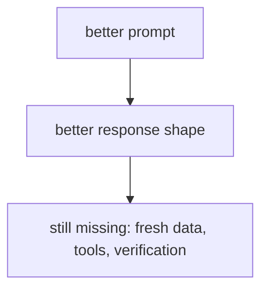
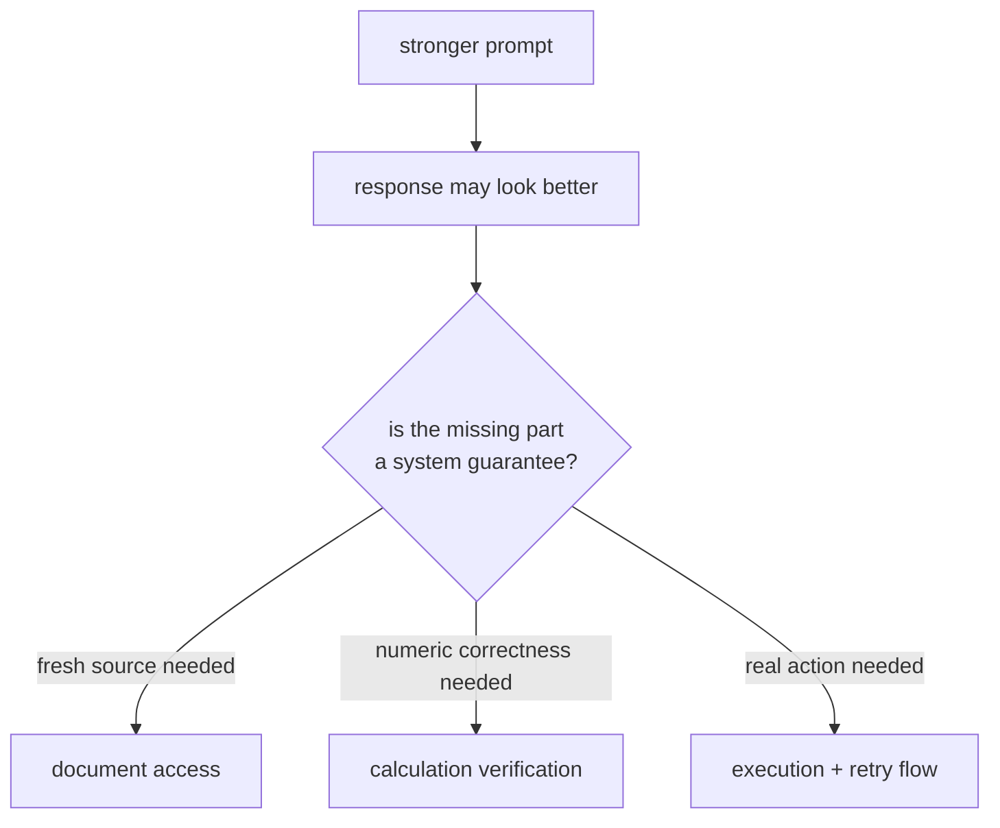

# P5-9.2 프롬프트의 한계

P5-9.1에서는 프롬프트 엔지니어링(prompt engineering)이 입력 설계를 통해 모델 행동을 관찰하고 조정하는 첫 번째 실무 도구라는 점을 보았습니다. 하지만 여기서 바로 더 중요한 질문이 나옵니다.

프롬프트를 잘 쓰면 정말 원하는 문제를 다 해결할 수 있을까?

이 절은 그 질문에 답합니다.

프롬프트는 모델 반응을 유도하는 강한 도구이지만, 최신성·사실성·근거 보장·장기 일관성까지 혼자 해결하는 도구는 아니다.

## 이 절의 범위

이 절은 다음 질문에 답합니다.

- 프롬프트만으로 해결하기 어려운 문제는 무엇인가?
- 왜 프롬프트가 좋아 보여도 실제 서비스에서는 불충분할 수 있는가?
- 어떤 시점에서 RAG, 파인튜닝, 도구 사용, 평가 체계가 필요해지는가?

이 절에서는 다음 내용을 깊게 다루지 않습니다.

- RAG 구현 세부
- 평가 자동화 도구 비교
- 에이전트 프레임워크 구조

프롬프트만으로 부족한 최신성·근거 문제는 바로 다음 P5-10.1 RAG의 필요성과 P5-10.2 검색 결과와 생성의 결합에서 다시 회수합니다. 평가 구조는 P5-15.1과 P5-15.2에서, 에이전트 프레임워크의 큰 그림은 P5-13.1과 P5-13.2에서 각각 다시 다룹니다.

이 절에서는 프롬프트 엔지니어링을 과대평가하지 않고, 다음 구조적 도구들이 왜 필요한지 설명합니다.

지금 읽는 층위는 `입력 조정의 한계를 확인하는 전환 층위`입니다. 앞 절이 `어떻게 물을까`를 다뤘다면, 여기서는 `잘 물어도 아직 남는 문제는 무엇인가`를 확인합니다. 바로 다음 P5-10.1에서는 이 질문이 `그렇다면 무엇을 근거로 답하게 할까`로 넘어가며, RAG는 프롬프트 확장판이 아니라 근거 연결 구조라는 점을 잡습니다.

즉, 여기서 독자가 붙잡아야 할 전환은 `말하는 방식 조정`에서 `답의 근거 연결`로 중심이 옮겨 간다는 점입니다. 이 한 줄이 보여야 바로 다음 RAG 절도 프롬프트를 더 길게 쓰는 요령이 아니라, 답의 출발점을 바꾸는 구조로 읽힙니다.

이 전환을 앞뒤 장과 한 번에 붙여 보면 다음처럼 읽는 편이 가장 안전합니다.

| 지금 단계의 손잡이 | 바로 다음에 이어질 질문 | 뒤에서 본격적으로 다시 읽는 위치 |
| --- | --- | --- |
| 프롬프트 입력 조정 | 같은 재료로 답하는 방식을 어떻게 조정할까? | P5-9.1 |
| 프롬프트 한계 확인 | 잘 물어도 아직 남는 문제는 무엇일까? | P5-9.2 |
| RAG 근거 연결 | 그렇다면 무엇을 근거로 답하게 할까? | P5-10 |

즉, 지금 장의 핵심은 `더 잘 물을까`에서 `질문 밖의 근거를 실제로 붙여야 하는가`로 손잡이가 바뀌고, 이 절이 `프롬프트 입력 조정 -> 프롬프트 한계 확인 -> RAG 근거 연결` 가운데 `한계 확인` 단계를 맡는다는 점입니다.

프롬프트 한계를 읽을 때는 `그래서 다음으로 무엇을 붙여야 하는가`를 같이 보면 더 안정적입니다.

| 지금 남는 문제 | 프롬프트만 더 고치면 되는가 | 다음으로 먼저 붙일 구조 | 왜 구조가 바뀌는가 |
| --- | --- | --- | --- |
| 답변 형식과 길이가 자주 흔들린다 | 때로는 그렇다 | 프롬프트 개선 또는 지시 형식 조정 | 아직은 입력 설계 층에서 해결될 수 있기 때문입니다. |
| 최신 정책이나 현재 버전 문서가 필요하다 | 아니다 | RAG, 최신 문서 연결 | 답의 출발점을 외부 문서로 바꿔야 하기 때문입니다. |
| 계산값, 저장, 조회 같은 실제 행동이 필요하다 | 아니다 | tool use, function calling | 말이 아니라 실제 실행 결과가 필요하기 때문입니다. |
| 같은 실패를 반복 점검하고 통과 기준을 세워야 한다 | 아니다 | evaluation, harness | 응답 문장보다 실행 기록과 판정 구조가 필요하기 때문입니다. |

즉, 프롬프트를 더 세게 쓰는 일은 `입력 조정`이고, RAG·tool use·evaluation으로 넘어가는 일은 `시스템 구조를 바꾸는 선택`입니다.

여기서 먼저 남겨야 할 것은 어떤 문제가 입력 조정 한계인지, 어떤 문제가 근거 연결 부재인지를 보여 주는 `failure_type`, `missing_grounding_reason`, 그리고 형식 흔들림 통계와 재현 실패 메모입니다. 이 기록이 있어야 P5-10.1의 RAG 필요 판단으로 왜 넘어가야 하는지 흔들리지 않고, 프롬프트 개선으로 줄일 문제와 시스템 구조를 바꿔야 할 문제를 나눌 수 있습니다. 뒤로 갈수록 이 기록은 P5-15의 평가 기준과 Part 6의 `review_summary`, `improvement_plan`, `project_note`, 회고 문서로 다시 읽힙니다.

## 이 절의 목표

- 프롬프트의 한계를 입문 수준에서 설명할 수 있습니다.
- 최신성, 사실성, 일관성, 실행 가능성 문제가 왜 남는지 말할 수 있습니다.
- 프롬프트로 해결할 문제와 구조를 바꿔야 할 문제를 구분할 수 있습니다.
- 다음 장의 RAG 필요성으로 자연스럽게 넘어갈 수 있습니다.

## 이 절을 읽는 순서

이 절은 다음 순서로 읽으면 흐름이 잘 잡힙니다.

1. 먼저 `프롬프트는 왜 강력하지만 불완전한가`를 읽고, 입력 설계가 바꿀 수 있는 층과 못 바꾸는 층을 나눕니다.
2. 그다음 `최신성 문제`, `사실성과 근거 문제`, `일관성과 재현성 문제`, `실행과 행동 문제`를 읽으면서 프롬프트만으로 남는 대표 실패를 유형별로 구분합니다.
3. 마지막으로 사례와 Python 예제를 보면서, 실제 서비스에서는 답변 문장보다 `문서 ID`, `계산 로그`, `실행 로그` 같은 구조 검증 항목이 더 중요해지는 장면을 확인합니다.

## 프롬프트는 왜 강력하지만 불완전한가

프롬프트는 입력을 설계하는 도구입니다. 따라서 모델이 가진 능력을 더 잘 끌어내거나, 형식을 더 안정되게 만들 수는 있습니다. 하지만 입력 설계만으로는 모델 바깥의 문제를 모두 해결할 수 없습니다.

예를 들어 프롬프트는:

- 답변 길이 조정
- 형식 제어
- 예시 기반 패턴 유도
- 말투 조정

에는 강할 수 있습니다.

반면 프롬프트만으로는 다음이 자동 해결되지 않습니다.

- 최신 정보 반영
- 외부 문서 근거 보장
- 데이터베이스 조회
- 계산 결과 검증
- 긴 작업 흐름의 재현성

## 최신성 문제

모델이 학습 이후에 생긴 정보를 자동으로 아는 것은 아닙니다. 프롬프트를 더 정교하게 써도, 모델이 본 적 없는 최신 사실을 확실히 보장할 수는 없습니다.

따라서 `최신 정보를 기준으로 답해 줘`라는 프롬프트는 요청일 뿐, 외부 최신 데이터 연결을 대신하지 않습니다.

이 지점에서 RAG나 도구 사용이 필요해집니다.

## 사실성과 근거 문제

프롬프트에 `근거를 들어 설명해 줘`라고 써도, 모델이 실제 근거 문서를 조회한 것은 아닐 수 있습니다. 그럴듯한 설명을 만들어 낼 가능성은 있지만, 진짜 출처와 연결되었다는 보장은 없습니다.

즉:

- 근거를 요구하는 프롬프트
- 실제 근거 문서를 연결한 시스템

은 같은 것이 아닙니다.

이 구분이 없으면 사용자는 `출처처럼 보이는 답`을 `검증된 답`으로 오해할 수 있습니다.

## 일관성과 재현성 문제

프롬프트를 조금 바꾸거나, temperature가 달라지거나, 맥락 순서가 달라지면 출력이 변할 수 있습니다. 따라서 프롬프트만으로 아주 엄격한 재현성을 보장하기는 어렵습니다.

이것은 실무에서 다음과 같이 나타납니다.

- 같은 요청인데 표현이 흔들린다
- 분류 라벨이 미세하게 달라진다
- 표 형식이 가끔 깨진다
- 긴 작업에서 앞뒤 기준이 달라진다

이런 문제는 프롬프트 개선으로 줄일 수는 있지만, 완전히 없애기 어렵습니다.

## 실행과 행동 문제

프롬프트는 기본적으로 텍스트 입력입니다. 따라서:

- 실제 데이터베이스 조회
- 외부 API 호출
- 파일 수정
- 계산 결과 저장

같은 행동은 프롬프트만으로 일어나지 않습니다. 이런 단계에서는 도구 사용(tool use), 함수 호출(function calling), 에이전트(agent) 구조가 필요해집니다.

즉, 프롬프트는 `행동 요청`을 표현할 수는 있어도, 행동 실행 구조 그 자체는 아닙니다.

## 아주 단순하게 그리면



이 도식의 핵심은 프롬프트 개선이 중요하지만, 그것만으로 구조 문제를 다 해결하지는 못한다는 점입니다.

## 사례로 보기

### 사례 1. 최신 정책 안내

사용자가 `오늘부터 환불 기한이 며칠인가요?`라고 묻는 장면을 생각해 볼 수 있습니다. 프롬프트를 아무리 정교하게 써서 `정확하고 신중하게 답하라`고 지시해도, 최신 정책 원문이 입력에 들어오지 않으면 모델은 예전 기준을 말할 수 있습니다. 사람은 답변이 조심스럽고 말투가 단정하면 더 믿기 쉽지만, 이 장면에서 놓치기 쉬운 핵심은 답변 태도가 아니라 `현재 문서에 접근했는가`입니다. 최신 문서 연결이 없으면 정중한 오답이 그대로 운영 안내로 나갈 수 있습니다. 여기서 바뀌는 점은 `말투가 신중한가`를 보던 기준에서 `최신 문서 근거가 실제로 붙었는가`를 보는 기준으로 이동한다는 것입니다. 이 경우 문제는 프롬프트가 약해서가 아니라, 최신 정보를 연결하는 구조가 빠져 있다는 데 있습니다. 그래서 이 사례에서 확인해야 할 결과는 말투가 아니라 최신 문서 근거가 실제로 붙어 있는가입니다.

### 사례 2. 수치 계산이 중요한 보고서

주간 매출 보고서를 자동으로 작성한다고 해 봅시다. 프롬프트에 `숫자를 정확히 계산해서 표로 정리해 달라`고 넣을 수는 있지만, 실제 합계와 증감률을 계산 도구 없이 바로 믿으면 작은 산술 오류가 그대로 보고서에 들어갈 수 있습니다. 사람은 표 형식도 맞고 문장도 매끄러우면 `정확해 보인다`고 느끼기 쉽습니다. 하지만 이 장면에서 필요한 것은 더 강한 문장이 아니라 계산기나 후처리 검증처럼 숫자를 다시 확인하는 구조입니다. 계산이 한 칸만 틀려도 뒤 해석 문장과 의사결정까지 같이 어긋날 수 있습니다. 여기서 바뀌는 점은 `표가 그럴듯한가`를 보던 기준에서 `원본 수치, 합계, 증감률이 실제로 일치하는가`를 보는 기준으로 이동한다는 것입니다. 그래서 `정확히 해 달라`는 프롬프트와 `정확함을 보장하는 구조`는 서로 다른 문제임이 드러납니다. 그래서 이 사례에서 확인해야 할 결과는 표 문장보다 합계, 증감률, 원본 수치가 서로 일치하는가입니다.

### 사례 3. 반복 업무 자동화

운영팀이 `업로드된 파일을 읽고 분류해서 폴더에 저장해 달라`는 자동화를 원한다고 해 봅시다. 프롬프트로는 읽기, 분류, 저장까지 한 문장으로 적을 수 있지만, 실제 시스템에서는 파일 접근 권한, 분류 기준, 저장 위치, 실패 시 재시도 같은 단계가 따로 필요합니다. 사람은 요청 문장이 충분히 구체적이면 실행도 거의 해결된 것처럼 느끼기 쉽지만, 실제 세계에서는 말보다 권한과 도구 연결이 더 중요합니다. 권한이 없거나 저장 경로가 잘못되면 분류 자체는 맞아도 마지막 저장 단계에서 작업이 끊길 수 있습니다. 즉, 사람이 말로는 한 줄로 끝낼 수 있어도 실행 세계에서는 여러 도구와 애플리케이션이 붙어야 합니다. 여기서 바뀌는 점은 `요청 문장이 구체적인가`를 보던 기준에서 `실제 저장 성공, 실패 처리, 재시도 구조가 있는가`를 보는 기준으로 이동한다는 것입니다. 그래서 이 장면에서 부족한 것은 더 긴 프롬프트가 아니라 실행 구조 자체입니다. 그래서 이 사례에서 확인해야 할 결과는 분류 문장 생성이 아니라 실제 저장 성공, 실패 처리, 재시도 경로가 있는가입니다.

세 사례를 구조 한계 관점으로 다시 묶으면 다음과 같습니다.

| 상황 | 프롬프트를 더 세게 써도 안 채워지는 것 | 실제로 더 붙여야 하는 구조 |
| --- | --- | --- |
| 최신 정책 안내 | 최신 정보 접근 | RAG 또는 최신 문서 연결 |
| 수치 계산 보고서 | 산술 정확도 보장 | 계산 도구, 후처리 검증 |
| 반복 업무 자동화 | 파일 접근, 저장, 재시도 | tool use, 권한 처리, 실행 흐름 |

같은 내용을 시스템 경계 기준으로 다시 보면 다음처럼 읽을 수 있습니다.



핵심은 `더 강한 문장`과 `더 강한 시스템 보장`이 서로 다른 층이라는 점입니다.

즉, 여기까지의 결론은 `프롬프트를 더 잘 쓰는 일`과 `답의 근거를 실제 문서에 묶는 일`이 다르다는 것입니다. 다음 장 P5-10부터는 바로 이 차이를 따라, 말하는 방식 조정이 아니라 `답의 출발점을 어디에 둘 것인가`를 읽습니다.

## 실행 가능한 Python 예제로 보기

이번 예제의 목표는 `강한 프롬프트`와 `실제 구조 보장`이 다른 문제라는 점을, 한두 개 출력이 아니라 점검 보고서 형태로 확인하는 것입니다. 실제 서비스에서는 답변 문장만 읽지 않고 `최신 문서가 붙었는가`, `계산 로그가 있는가`, `실행 로그가 남았는가` 같은 검증 항목을 함께 봐야 합니다.

문제 상황:

- 사용자는 최신 정책, 정확한 계산, 실제 저장 실행을 함께 기대할 수 있음
- 프롬프트에는 `최신 문서를 근거로`, `정확하게 계산해서`, `저장까지 완료해`라고 강하게 적어 둘 수 있음
- 하지만 최신 문서 연결, 계산 도구, 저장 도구가 없으면 답은 여전히 말뿐인 지시로 끝날 수 있음

입력:

- 세 가지 사용자 작업
- 프롬프트만 있는 응답
- 최신 문서 연결, 계산 로그, 저장 로그까지 붙인 구조화 응답

출력:

- 작업별 점검 보고서
- `prompt only`와 `structured`의 통과 항목 수
- 어떤 종류의 구조가 빠졌는지에 대한 요약

먼저 이 절에서 비교할 검증 항목을 표로 정리하면 다음과 같습니다.

| 작업 | 사용자가 기대하는 것 | 프롬프트만으로 자주 빠지는 것 | 붙여야 하는 구조 |
| --- | --- | --- | --- |
| 정책 안내 | 최신 문서 기준 답변 | 최신 버전 문서 ID | 문서 검색, 최신 버전 연결 |
| 수치 보고 | 계산값 정확성 | 계산 로그, 재계산 근거 | 계산 도구, 후처리 검산 |
| 파일 자동화 | 실제 저장 완료 | 저장 로그, 재시도 정보 | 파일 도구, 실행 로그 |

문제 상황:

- 강한 프롬프트만으로는 최신 정보, 계산 정확성, 실제 실행 완료까지 항상 보장되지 않는다

입력(input):

위에 정리한 작업 목록과 prompt-only 결과, tool-assisted 결과를 사용합니다.

확인할 개념:

- 강한 프롬프트만으로는 최신 정보 확인, 정확한 계산, 실제 실행 완료까지 항상 보장할 수 없다

```python
tasks = [
    {
        "name": "latest_policy",
        "question": "오늘 기준 환불 가능 기간은 며칠인가요?",
        "strong_prompt": "최신 정책 문서를 근거로 정확한 답을 한 문장으로 정리해 주세요.",
        "prompt_only_result": {
            "answer": "환불 가능 기간은 7일입니다.",
            "used_source": "old_model_memory",
            "document_id": None,
        },
        "structured_result": {
            "answer": "환불 가능 기간은 14일입니다.",
            "used_source": "policy_2026_06",
            "document_id": "refund-policy-2026-06",
        },
        "expected": {
            "latest_source": "policy_2026_06",
            "document_id": "refund-policy-2026-06",
        },
    },
    {
        "name": "numeric_report",
        "question": "세 지점의 주간 매출 합계와 평균을 알려 주세요.",
        "strong_prompt": "숫자를 정확하게 계산해서 합계와 평균을 한 줄로 알려 주세요.",
        "prompt_only_result": {
            "answer": "합계는 1100이고 평균은 350입니다.",
            "numbers": {"sum": 1100, "avg": 350},
            "used_calculator": False,
            "calc_log_id": None,
        },
        "structured_result": {
            "answer": "합계는 1200이고 평균은 400입니다.",
            "numbers": {"sum": 1200, "avg": 400},
            "used_calculator": True,
            "calc_log_id": "calc-log-782",
        },
        "expected": {
            "sum": 1200,
            "avg": 400,
        },
    },
    {
        "name": "file_automation",
        "question": "업로드된 계약서를 법무 폴더에 저장해 주세요.",
        "strong_prompt": "분류 후 올바른 폴더에 저장까지 완료했다고 보고해 주세요.",
        "prompt_only_result": {
            "answer": "계약서를 법무 폴더에 저장했습니다.",
            "saved": False,
            "save_log_id": None,
            "retry_available": False,
        },
        "structured_result": {
            "answer": "계약서를 legal/contracts 폴더에 저장했습니다.",
            "saved": True,
            "save_log_id": "save-log-2048",
            "retry_available": True,
        },
        "expected": {
            "saved": True,
        },
    },
]


def inspect_task(task_name, result, expected):
    if task_name == "latest_policy":
        checks = {
            "latest_source_ok": result["used_source"] == expected["latest_source"],
            "document_id_present": result["document_id"] == expected["document_id"],
        }
        return {
            "answer": result["answer"],
            "used_source": result["used_source"],
            "document_id": result["document_id"],
            "checks": checks,
            "passed_checks": sum(checks.values()),
            "total_checks": len(checks),
        }

    if task_name == "numeric_report":
        checks = {
            "sum_ok": result["numbers"]["sum"] == expected["sum"],
            "avg_ok": result["numbers"]["avg"] == expected["avg"],
            "calc_log_present": result["calc_log_id"] is not None,
            "used_calculator": result["used_calculator"],
        }
        return {
            "answer": result["answer"],
            "numbers": result["numbers"],
            "calc_log_id": result["calc_log_id"],
            "checks": checks,
            "passed_checks": sum(checks.values()),
            "total_checks": len(checks),
        }

    if task_name == "file_automation":
        checks = {
            "saved_ok": result["saved"] == expected["saved"],
            "save_log_present": result["save_log_id"] is not None,
            "retry_available": result["retry_available"],
        }
        return {
            "answer": result["answer"],
            "saved": result["saved"],
            "save_log_id": result["save_log_id"],
            "checks": checks,
            "passed_checks": sum(checks.values()),
            "total_checks": len(checks),
        }


def run_mode(mode_name):
    reports = []
    for task in tasks:
        result = task[f"{mode_name}_result"]
        inspect = inspect_task(task["name"], result, task["expected"])
        reports.append(
            {
                "name": task["name"],
                "question": task["question"],
                "inspect": inspect,
            }
        )

    fully_passed = sum(
        1 for report in reports
        if report["inspect"]["passed_checks"] == report["inspect"]["total_checks"]
    )
    total_passed_checks = sum(report["inspect"]["passed_checks"] for report in reports)
    total_checks = sum(report["inspect"]["total_checks"] for report in reports)
    average_pass_ratio = round(total_passed_checks / total_checks, 2)
    return {
        "mode_name": mode_name,
        "reports": reports,
        "fully_passed": fully_passed,
        "total_passed_checks": total_passed_checks,
        "total_checks": total_checks,
        "average_pass_ratio": average_pass_ratio,
    }


prompt_only_batch = run_mode("prompt_only")
structured_batch = run_mode("structured")

for batch in [prompt_only_batch, structured_batch]:
    print("=" * 80)
    print("mode =", batch["mode_name"])
    print("fully_passed =", batch["fully_passed"])
    print("passed_checks =", f\"{batch['total_passed_checks']}/{batch['total_checks']}\")
    print("average_pass_ratio =", batch["average_pass_ratio"])
    for report in batch["reports"]:
        print("-" * 80)
        print("task =", report["name"])
        print("question =", report["question"])
        print(report["inspect"])
    print()
```

실행 결과 예시는 다음처럼 읽을 수 있습니다.

```text
================================================================================
mode = prompt_only
fully_passed = 0
passed_checks = 0/9
average_pass_ratio = 0.0
--------------------------------------------------------------------------------
task = latest_policy
question = 오늘 기준 환불 가능 기간은 며칠인가요?
{'answer': '환불 가능 기간은 7일입니다.', 'used_source': 'old_model_memory', 'document_id': None, 'checks': {'latest_source_ok': False, 'document_id_present': False}, 'passed_checks': 0, 'total_checks': 2}
--------------------------------------------------------------------------------
task = numeric_report
question = 세 지점의 주간 매출 합계와 평균을 알려 주세요.
{'answer': '합계는 1100이고 평균은 350입니다.', 'numbers': {'sum': 1100, 'avg': 350}, 'calc_log_id': None, 'checks': {'sum_ok': False, 'avg_ok': False, 'calc_log_present': False, 'used_calculator': False}, 'passed_checks': 0, 'total_checks': 4}
--------------------------------------------------------------------------------
task = file_automation
question = 업로드된 계약서를 법무 폴더에 저장해 주세요.
{'answer': '계약서를 법무 폴더에 저장했습니다.', 'saved': False, 'save_log_id': None, 'checks': {'saved_ok': False, 'save_log_present': False, 'retry_available': False}, 'passed_checks': 0, 'total_checks': 3}

================================================================================
mode = structured
fully_passed = 3
passed_checks = 9/9
average_pass_ratio = 1.0
--------------------------------------------------------------------------------
task = latest_policy
question = 오늘 기준 환불 가능 기간은 며칠인가요?
{'answer': '환불 가능 기간은 14일입니다.', 'used_source': 'policy_2026_06', 'document_id': 'refund-policy-2026-06', 'checks': {'latest_source_ok': True, 'document_id_present': True}, 'passed_checks': 2, 'total_checks': 2}
--------------------------------------------------------------------------------
task = numeric_report
question = 세 지점의 주간 매출 합계와 평균을 알려 주세요.
{'answer': '합계는 1200이고 평균은 400입니다.', 'numbers': {'sum': 1200, 'avg': 400}, 'calc_log_id': 'calc-log-782', 'checks': {'sum_ok': True, 'avg_ok': True, 'calc_log_present': True, 'used_calculator': True}, 'passed_checks': 4, 'total_checks': 4}
--------------------------------------------------------------------------------
task = file_automation
question = 업로드된 계약서를 법무 폴더에 저장해 주세요.
{'answer': '계약서를 legal/contracts 폴더에 저장했습니다.', 'saved': True, 'save_log_id': 'save-log-2048', 'checks': {'saved_ok': True, 'save_log_present': True, 'retry_available': True}, 'passed_checks': 3, 'total_checks': 3}
```

이 결과에서 먼저 눈에 들어와야 하는 것은 `프롬프트 문장 자체는 강했지만`, `prompt_only`는 검증 항목 9개 중 0개만 통과했다는 점입니다. 반대로 `structured`는 답변 문장만 좋아진 것이 아니라, 최신 문서 ID, 계산 로그, 저장 로그처럼 시스템 바깥의 검증 항목까지 함께 채웁니다. 즉, 프롬프트의 한계는 `문장이 약해서`가 아니라 `시스템 경계 밖의 구조가 빠져 있어서` 생기는 경우가 많습니다.

그래서 이 예제에서 확인해야 할 결과는 두 가지입니다.

- 강한 프롬프트는 답변 모양을 바꿀 수 있어도 최신성, 계산 정확성, 실행 성공을 자동으로 보장하지 않는다.
- 실제 서비스에서는 답변 본문보다 `문서 ID`, `계산 로그`, `저장 로그`, `재시도 가능 여부` 같은 검증 항목을 함께 봐야 한다.

이 예제에서 독자가 직접 해 볼 수 있는 조정은 다음과 같습니다.

- `prompt_only_result`에 그럴듯한 `document_id`나 `save_log_id`를 일부러 넣고, 그것이 실제 기대값과 일치하는지 점검해 보기
- `numeric_report`에 지점 수를 더 늘리고 `median`, `growth_rate` 같은 새 계산 항목을 추가해 보기
- `file_automation`에 `path_ok`, `permission_ok`, `retry_count`를 넣어 저장 성공의 의미를 더 엄격하게 바꿔 보기

## 이 예제를 시스템 경계 관점으로 다시 보면

이 예제는 프롬프트가 강해질수록 모든 문제가 해결된다는 오해를 막아 줍니다. 실제 서비스에서는 최신 정보 접근, 계산 검증, 도구 호출과 실행 로그 같은 바깥 구조가 따로 필요하므로, 프롬프트는 시스템 전체 중 하나의 층으로만 읽어야 합니다.

## 여기까지를 한 줄로 묶으면

프롬프트는 응답 모양을 바꾸는 데 강하지만, 최신 문서 접근, 계산 검증, 실제 실행 성공 같은 시스템 보장은 별도 구조가 있어야만 확보됩니다.

이 절에서 더 중요하게 붙잡아야 할 점은 `입력 설계로 응답 모양을 바꾸는 일`과 `최신성, 근거, 실행 가능성을 보장하는 일`이 같은 문제가 아니라는 것입니다. 그래서 프롬프트의 한계는 프롬프트를 더 길게 쓰는 문제보다, 언제부터 RAG, tool use, evaluation 같은 다음 구조가 필요한지 판단하게 만드는 경계로 읽는 편이 좋습니다.

- 최신성 부족
- 근거 부족
- 출력 흔들림
- 실행 불가

즉, 여기서부터는 프롬프트를 더 다듬는 일만으로는 부족하고, 근거 연결은 RAG로, 실행은 tool use와 agent로, 검증과 운영은 evaluation과 harness로 넘겨 읽어야 합니다.

커리큘럼 관점에서 이 절이 중요한 이유는 다음과 같습니다.

- 바로 앞의 P5-9.1 프롬프트 엔지니어링을 `입력 설계의 첫 번째 손잡이`로 두되 만능 해법으로 오해하지 않게 하고
- 구조를 추가해야 하는 시점을 판단하게 하며
- 다음 장의 P5-10.1, P5-10.2 RAG와 뒤의 P5-12.1 도구 사용, P5-13.1 에이전트로 왜 확장되는지 자연스럽게 연결하기 때문입니다

## 다음 장과의 연결

여기까지 오면 다음 질문은 매우 직접적입니다.

- 프롬프트만으로 부족하다면, 외부 근거를 어떻게 연결해야 하는가?
- 모델 기억이 아니라 검색된 문서를 함께 넣는 구조는 어떻게 이해해야 하는가?

이 질문은 P5-10.1 RAG의 필요성으로 이어집니다.

## 이 절에서 기억할 관점

- 프롬프트는 강력한 입력 설계 도구이지만, 모든 구조 문제를 해결하지는 않습니다.
- 최신성, 근거, 일관성, 실행 가능성은 별도 구조가 필요한 경우가 많습니다.
- 프롬프트 개선과 시스템 설계는 다른 층위(level)의 문제입니다.
- 이 절은 RAG, 도구 사용, 평가 구조가 왜 필요한지 설명하는 연결 절입니다.

## 체크리스트

- 프롬프트의 한계를 입문 수준에서 설명할 수 있는가?
- 최신성, 근거, 일관성, 실행 문제가 왜 남는지 말할 수 있는가?
- 프롬프트로 해결할 문제와 구조를 바꿔야 할 문제를 구분할 수 있는가?
- 왜 다음 장에서 RAG가 등장해야 하는지 설명할 수 있는가?

## 출처와 참고 자료

- Tom B. Brown et al., `Language Models are Few-Shot Learners`, arXiv, 2020, 확인 날짜: 2026-06-29.
- OpenAI, 프롬프팅 및 RAG 관련 공식 문서, 확인 날짜: 2026-06-29.
- Anthropic, 프롬프팅과 tool use 관련 공개 문서, 확인 날짜: 2026-06-29.
