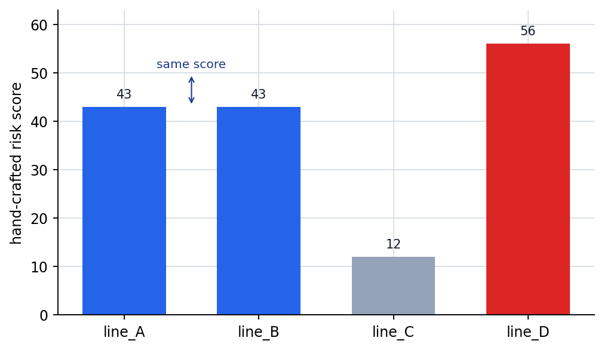
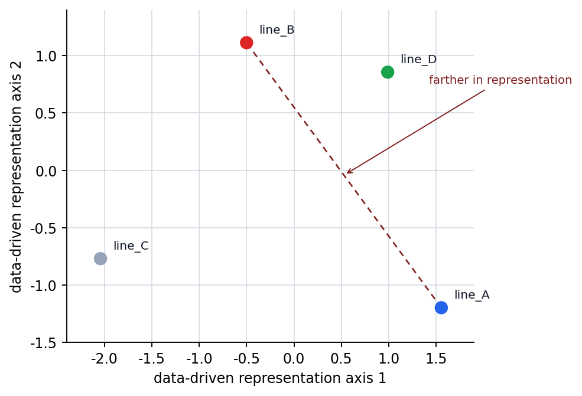

# P5-10.1 Representation Learning

Section ID: `P5-10.1`
Version: `v2026.07.17`

By the time we reach Chapter P5-9, we have seen that deep learning spread at practical scale because it repeats large tensor computations at the batch level, helped by GPUs and parallel processing. If we now turn the question back inward toward the model, the next question appears.

After all of this computation, what exactly does the neural network learn?

The key expression for answering this question is representation learning.

Representation learning means the process in which, instead of a person designing each feature one by one, the model learns useful internal representations from the data by itself.

When the distinction between representation and representation learning becomes blurry again in later structure chapters, reread together the glossary entries on [representation](../../../reference/concept-glossary.md#representation) and [representation learning](../../../reference/concept-glossary.md#representation-learning).

## Scope Of This Section

- What does a representation mean?
- How is representation learning different from feature engineering?
- Why is representation learning regarded as such a turning point in deep learning?
- How can we explain to the reader what it means to learn internal representations?

This section first closes representation learning as `the process in which the model forms useful internal features on its own`, and focuses on holding onto what changed compared with the older way where people directly chose the features.

At the same time, it is clear what question we will go into next. How representations are read as becoming more abstract in deeper layers is explained in the next section, P5-10.2. Representation in the image domain reconnects in P5-11.1 and P5-11.2, and sequence and attention-based representations reconnect in P5-12.1, P5-12.2, P5-13.1, and P5-13.2.

## Goals Of This Section

- You can explain representation learning as `the process in which the model forms useful internal features on its own`.
- You can compare the difference between the way people directly create features and the deep-learning approach.
- You can describe why deep learning spread so widely together with the success of representation learning.
- Through an executable Python example, you can compare human-defined features with a simple intuition of representation learning.

## What Is A Representation

The word representation can sound abstract to readers. In this book, it is enough first to understand it like this.

`An internal numeric form where the original data has been transformed into a shape that is easier for the model to handle`

For example, we can look at the same equipment operation record in two ways.

- original input: number of recent temperature excursions, duration of pressure fluctuation, restart delay time
- internal representation: abstract numeric combinations such as thermal burden, operation instability, and urgency of follow-up inspection that the model combines during computation

Of course, the model does not actually attach those names. But what matters here is the intuition that `it creates an intermediate representation that is easier to compute with than the original`.

If we split the same idea into the input, the human-readable explanation, and the representation used by the model, the difference between the three levels becomes clearer.

| Level | How a person reads it | How the model handles it |
| --- | --- | --- |
| original data | observed values such as number of recent temperature excursions, duration of pressure fluctuation, and restart delay | numeric vector or tensor input |
| human-made explanation | interpretations such as high thermal burden or unstable operation | not yet the model's internal computation |
| internal representation | intermediate numeric combinations without labels | representations used for the next-layer computation and final prediction |

That is, representation learning is not literally learning the interpretation sentences that people attach. It is closer to forming an internal coordinate system inside the model that is useful for prediction.

## What Is Different From Feature Engineering

In early machine learning and more traditional approaches, it was very important for people to design features directly.

For example, in an image problem a person might create features such as:

- edge count
- texture descriptor
- color histogram

In a text problem, people organized features such as:

- word frequency
- length
- whether a certain pattern is included

The turning point of representation learning is that the model came to learn a large part of these feature combinations directly from data.

That is:

- feature engineering is closer to a way where a person decides in advance `what to look at`
- representation learning is closer to a way where the model internally finds `what is useful` during learning

If we compress that difference further, it can be read through the following table.

| Question | Feature-engineering-centered approach | Representation-learning-centered approach |
| --- | --- | --- |
| Who decides the features? | a person decides first | the model forms them during learning |
| The developer's central task | design features through domain knowledge | design the data, structure, and learning setup |
| Strength | interpretation is relatively direct | can capture complex combinations more broadly |
| Burden | high manual design cost for every problem | data and computational resources become more important |

If we compress this difference once more from the viewpoint `who transforms the same input into which coordinate system`, it becomes the following flow.

```mermaid
--8<-- "assets/part-05/chapter-10/manual-vs-learned-coordinates-en.mmd"
```

That is, feature engineering is closer to a flow where a person first chooses axes that are easy to read from outside, while representation learning is closer to a flow where the model creates new internal axes useful for the task during learning.

## Why Was This Difference Important

This difference mattered not only because of automation.

There are limits to features created by people.

- each problem needs a different feature design
- there can be combinations that people miss
- as the data becomes more complex, manually designing features becomes very difficult

Deep learning developed in the direction of directly learning more useful representations from raw input through many layers and nonlinear transformations.

It is enough to remember it like this.

`The strength of deep learning lies not only in being a large model, but in its ability to form features on its own.`

## How Does Representation Learning Look In Images, Speech, And Text

Representation learning keeps a similar way of thinking even when the data domain changes.

### Images

- early layers can lead to edges or simple patterns
- deeper layers can lead to shapes and partial structures
- later layers can lead to object-level information

### Speech

- rather than the raw waveform itself
- it can lead to more useful internal representations such as pronunciation patterns, syllable clues, and speaker characteristics

### Text

- rather than characters or tokens themselves
- it can lead to internal representations that better capture context, syntax, and semantic relations

That is, across data types, representation learning has the shared structure of `the ability to transform the input into a more useful intermediate form`.

It becomes more concrete again when we move that viewpoint into work scenes.

| Scene | Features that are easy for a person to make directly | Representations the model may learn better |
| --- | --- | --- |
| maintenance-priority recommendation | recent alarm count, number of rework calls, downtime duration | latent patterns such as groups of similar failures, risk-transition tendencies, and repeated intervention patterns |
| early detection of batch anomalies | recent count of temperature excursions, recent count of pressure fluctuations | instability patterns that change over time, combinations of multiple anomaly signals |
| document classification | word frequency, document length | topic representations that change with context, groupings of similar sentence structures |

From this point onward in Part 5, we split the same representation learning again by `which neural-network structure reads it more naturally depending on the data structure`.

| Structure that continues later | Data problem handled first | How representation learning appears here |
| --- | --- | --- |
| CNN | problems where nearby positions create meaning together, such as images | rises from local patterns to larger visual structure |
| RNN/LSTM/GRU | problems where order changes the meaning, such as sentences, speech, and time series | builds sequential context by carrying over previous state |
| Attention/Transformer | problems where distant position relations must be compared directly | reads with weights on which positions are more important to one another |

That is, the later chapters are not a section that simply keeps adding new model names. They are a section where the same idea of `representation learning` is read separately according to what structure solves it in images, sequential data, and long-context relation problems.

## Why Does It Look Like A Turning Point In The History Of Deep Learning

Deep learning did not gain attention only because the layers became deeper. What mattered was that `deep structures actually began learning useful representations`.

The reason CNNs drew attention in image recognition after AlexNet was also that they showed cases where the model learned stronger hierarchical representations than hand-crafted features made by people.

This point also connects to the spread of the deep-learning paradigm that we saw in Part 1.

That is, representation learning is one of the core factors that made deep learning look like `a computational approach that replaces feature engineering`.

## Drawn Very Simply

```mermaid
--8<-- "assets/part-05/chapter-10/feature-engineering-vs-representation-learning-en.mmd"
```

This diagram compresses the viewpoint difference between traditional feature engineering and deep-learning representation learning.

## Cases And Examples

### Representative Case. Maintenance-Priority Recommendation

Suppose an equipment-maintenance team is deciding which line to inspect first. At first, people can easily feel that making statistical columns such as `number of alarms in the last 7 days`, `number of rework calls`, and `average downtime` should be enough. This approach is fast and easy to explain. But in reality, combinations that are not well exposed by one single number may matter, such as `a flow where temperature alarms repeat, then pressure instability follows, and then rework calls increase`.

A representation-learning model can look together at each line's alarm history and action information and build more compressed internal representations of failure groups and risk-transition patterns. So rather than relying on a simple alarm-count rule, it can better capture `which inspection order is more urgent for this line right now`, and the resulting maintenance priority can change in a more context-appropriate way than a simple frequency ranking.

The result to check in this case is whether, rather than lines that only have a similar recent alarm count, lines with a similar actual risk-transition flow receive the same follow-up inspection item earlier.

| Standard that is easy for a person to see first | Standard to reread from the representation-learning viewpoint |
| --- | --- |
| a few statistics such as alarm count or downtime feel sufficient | different anomaly combinations may be hidden behind the same statistical values |
| it is easy to feel that one score is enough to line up the lines | a single score can flatten latent patterns such as the direction of risk transition |
| similar numbers are easy to read as similar failure states | in reality they may be farther apart on a different representation axis |

The same viewpoint applies to other data as well. But the key to hold onto in this section is not the domain name, but `does it unfold patterns that are buried by one-line rules or hand-crafted axes into a new coordinate system`.

| Scene | Result that is easy for a person to see first | What actually needs to be distinguished from the representation-learning viewpoint |
| --- | --- | --- |
| image inspection | it looks as if rules such as bright-line length and number of lifted segments should be enough | patterns such as reflection, folds, and texture combinations may matter more and fit hand-crafted rules poorly |
| maintenance-log search | it can seem that counting words should be enough to group similar logs | even with different surface words, the context of the same handling flow can be grouped in a closer representation |
| automated quality inspection | a few criteria such as crack length and number of spots can seem sufficient | combinations of position, direction, and surrounding brightness change are easy to miss with only two or three hand-crafted numbers |

## Practice And Example

The goal of this example is to compare, in a maintenance-priority recommendation scene, one risk score directly made by a person with a two-dimensional intermediate representation computed from data.

Input:

- 4 equipment lines with counts of consecutive temperature alarms, counts of pressure instability, and counts of rework calls
- one single human-defined risk-score rule
- two representation axes computed from the input data

Output:

- hand-crafted risk score
- 2D data-driven representation
- where each equipment line is placed in the new coordinate system
- a comparison of lines that can look similar in a single score but differ in representation coordinates

Problem situation:

- to understand representation learning, we first need to confirm the intuition of rereading the original features after moving them into a different coordinate system
- we also need to see together that differences buried under one single risk score can split apart in the new representation coordinates
- if the representation axes are chosen manually by a person, the core point that `useful axes are formed from the data and the learning process` can be misunderstood, so even in the example the axes need to be computed from the data
- by changing `line_B`'s number of rework calls, we need to be able to confirm how the human-made score and the representation coordinates from the data change together

Concepts to confirm:

- a representation can be seen as the result of rearranging the original input along different axes
- when we look together at the positions of lines in the new coordinate system, it becomes easier to see why intermediate representations matter
- even with the same hand-crafted risk score, if the representation coordinates differ, the pattern can be read differently

Input:

After standardizing the raw data summarized above, we use linear-algebra computation to obtain two auxiliary representation axes that separate the data most strongly.

This example does not directly implement neural-network representation learning. Instead, before entering the representation-learning section, it acts as an auxiliary experiment for confirming how a one-line score chosen by a person and an intermediate coordinate system computed from data leave different reading results. Because the representation axes are not entered manually by a person but are computed from the input data first and then read, we can focus on the difference between `a chosen score` and `a representation obtained from the data`.

Before reading the code, it helps to predict what kind of comparison will appear.

| Comparison | Difference to predict first | Reason for the prediction |
| --- | --- | --- |
| `risk_score` | it will likely line up the equipment lines only along one dimension of risk | because a person-chosen rule presses several anomaly signals into one single axis |
| `representation` | even with the same raw data, positions may differ across two axes | because auxiliary axes computed from the data can separately preserve the combined directions of temperature, pressure, and rework |
| lines with similar scores | they may become more separated in representation coordinates | because differences in risk type hidden inside a single score can appear over two axes |

The purpose of this table is to read separately `one-line score` and `multi-axis representation`.

The experimental value is `line_b_rework_calls`. At first it is set to `5.0`, and after running it once, lower it to `1.0` and compare how `line_B` moves in the representation coordinates.

```python
import numpy as np

lines = ["line_A", "line_B", "line_C", "line_D"]
line_b_rework_calls = 5.0
data = np.array([
    [6.0, 5.0, 1.0],  # repeated temperature alarms, then pressure instability
    [2.0, 3.0, line_b_rework_calls],  # fewer alarms, but repeated rework calls
    [1.0, 1.0, 1.0],
    [5.0, 4.0, 5.0],
])

# hand-crafted feature: one risk score chosen by a person
risk_score = data[:, 0] * 3 + data[:, 1] * 4 + data[:, 2] * 5

# data-driven representation: compute two auxiliary axes from the input data
mean = data.mean(axis=0)
std = data.std(axis=0)
standardized = (data - mean) / std

_, _, components = np.linalg.svd(standardized, full_matrices=False)
axes = components[:2].copy()
if axes[0, 0] < 0:
    axes[0] *= -1
if axes[1, 2] < 0:
    axes[1] *= -1
representation = standardized @ axes.T

for line, raw, score, rep in zip(lines, data, risk_score, representation):
    print(
        f"{line}: raw={raw.tolist()}, "
        f"risk_score={score:.2f}, "
        f"representation={np.round(rep, 2).tolist()}"
    )

score_gap = round(float(risk_score[0] - risk_score[1]), 2)
rep_gap = round(float(np.linalg.norm(representation[0] - representation[1])), 2)
print("score_gap(line_A, line_B) =", score_gap)
print("representation_gap(line_A, line_B) =", rep_gap)
```

In the output, first compare the single score `risk_score` and the axis information carried at the same time by `representation`.

```text
line_A: raw=[6.0, 5.0, 1.0], risk_score=43.00, representation=[1.56, -1.2]
line_B: raw=[2.0, 3.0, 5.0], risk_score=43.00, representation=[-0.5, 1.11]
line_C: raw=[1.0, 1.0, 1.0], risk_score=12.00, representation=[-2.04, -0.77]
line_D: raw=[5.0, 4.0, 5.0], risk_score=56.00, representation=[0.99, 0.86]
score_gap(line_A, line_B) = 0.0
representation_gap(line_A, line_B) = 3.09
```

- `risk_score` is a single score pressed down by a person using one chosen standard
- `representation` spreads the same input back out over two auxiliary axes computed from the data, making it possible to read separately, in broad terms, `temperature-and-pressure difference` and `rework-call difference`
- real deep-learning representation learning does not stop at hand-picked axes or a simple decomposition like this, but creates many more intermediate representations during learning and adjusts which ones are useful for the task

The first artifact is the one-line risk score made by a person. `line_A` and `line_B` both have the score `43.00`, so they look like the same level of risk.



The second artifact is the coordinate after moving the same input into two auxiliary representation axes. `line_A` and `line_B`, which looked the same in the one-line score, become far apart in the representation coordinates, so the difference in maintenance pattern hidden behind the single score can be read separately.



If we compare once more here, the difference made by representation learning becomes even clearer.

| Comparison | The key to read now |
| --- | --- |
| `risk_score` | The equipment lines are ranked only by one line of risk score. |
| `representation` | The same lines can reveal different risk types across two axes. |
| `line_A` vs `line_B` | If we look only at the score, they read as the same risk, but in the representation they remain far apart as a `temperature-pressure transition line` and a `rework-expansion line`. |

Even when reading the output numbers, we should separate `score difference` from `representation-coordinate difference`.

| Comparison | What appears first in the output | Interpretation that is easy to leave if we look only at the score | Interpretation that changes once we include representation learning |
| --- | --- | --- | --- |
| `risk_score` | The score gap between `line_A` and `line_B` is `0.0`. | It is easy to think the two lines are in the same risk state. | A one-line score can flatten different combinations of temperature alarms, pressure instability, and rework calls, hiding different maintenance patterns. |
| `representation` | The coordinate gap between the same two lines is fairly large at `3.09`. | It can feel as if the representation-coordinate difference is exaggerated even though the score is the same. | In the new coordinate system, temperature-pressure differences and rework-call differences stay alive separately, so pattern differences behind the same total score are revealed. |
| `line_A` vs `line_B` | Both have risk signals, but the emphasized axes differ. | It is easy to think the same response is sufficient because the risk scores are the same. | If the representation coordinates differ, the follow-up inspection order or the required action can also differ. |

If you lower `line_b_rework_calls` to `1.0` and run it again, both `line_B`'s score and its representation coordinates change. The question the reader should hold onto here is not only `is the score larger`, but `when the input combination changes, do the one-line risk score and the representation coordinates obtained from the data move in the same way`.

Representation learning is a very central concept in deep-learning education. That is because this concept is needed to explain along one axis:

- that deep learning is not just a large linear regression
- why CNNs, RNNs, and Transformers are powerful
- why embeddings and LLMs are important

Historically, the turning point that must be confirmed here is that the center of gravity shifted from feature-engineering-centered thinking to data-driven learning of internal representations. If we explain the achievements of deep learning only through GPUs or scale, we explain only half of the story. The flow becomes complete only when we look at representation learning together with them.

If we pause here once and briefly fix `when should we bring up the representation-learning viewpoint before the structure name`, the common axis will shake less when reading the later chapters on CNNs, RNNs, and Transformers.

| Question to think of first | Why the representation-learning viewpoint is needed first | What later sections continue from here |
| --- | --- | --- |
| why do we need an internal coordinate system that distinguishes the same input better? | because intermediate representations that are more useful than the raw values create the performance difference | how representations change in deeper layers |
| why did traditional feature engineering have limits? | because rules decided in advance by people cannot easily capture all complex combinations and latent patterns | which structures learn which kinds of representations better by domain |
| why can CNNs, embeddings, and LLMs be explained along one axis? | because even with different structures, they share the common goal of making internal representations more useful | representation learning for images, sequences, and long context |

## Checklist

- Can you explain how representation learning differs from manual feature design?
- Can you answer the question `what does deep learning learn?` from the viewpoint of internal representation?
- Can you explain that representation learning is the process in which the model forms useful internal features by itself?
- Can you say that the difference between traditional feature engineering and deep learning lies in `who designs the features`?
- Can you explain through a real case the difference between a single human-made score and a multidimensional representation learned by the model?
- Can you explain the turning point of deep learning not only through computational resources but also through the expansion of representation-learning ability?
- When the common axis becomes blurry while many structure names appear, can you think first of the representation-learning viewpoint?
- When you need to group CNNs, embeddings, and LLMs into one flow, can you bring back again that they are all structures that make useful internal representations better?

## Sources And References

- Yoshua Bengio, Aaron Courville, Pascal Vincent, `Representation Learning: A Review and New Perspectives`, IEEE TPAMI, 2013, checked on 2026-06-29.
- Ian Goodfellow, Yoshua Bengio, Aaron Courville, `Deep Learning`, MIT Press, 2016, checked on 2026-06-29. [https://www.deeplearningbook.org/](https://www.deeplearningbook.org/){: target="_blank" rel="noopener noreferrer" }
- Alex Krizhevsky, Ilya Sutskever, Geoffrey E. Hinton, `ImageNet Classification with Deep Convolutional Neural Networks`, NeurIPS 2012, checked on 2026-06-29.
