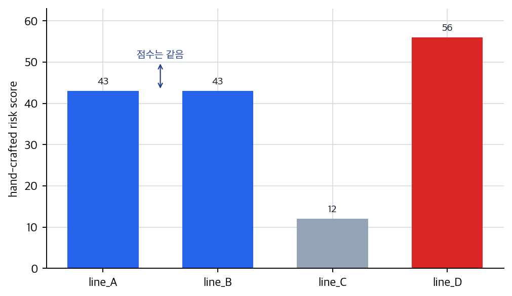
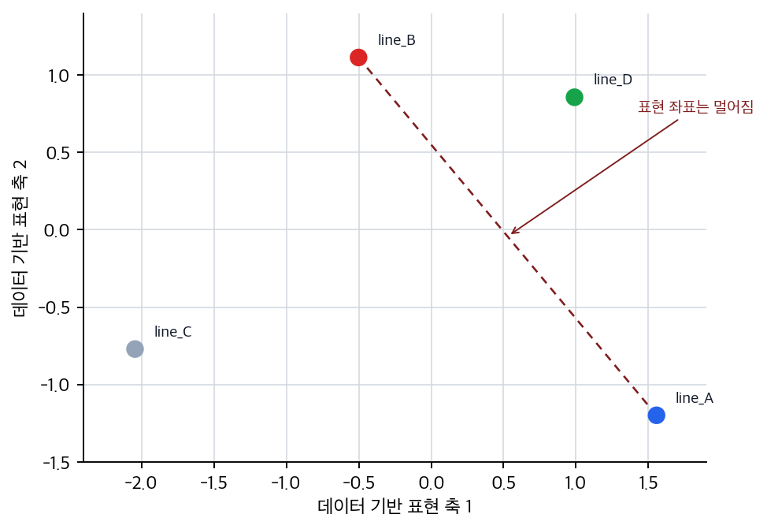

# P5-10.1 표현 학습(representation learning)

Section ID: `P5-10.1`
Version: `v2026.07.17`

P5-9장까지 오면 딥러닝이 큰 텐서 계산을 배치 단위로 반복하며, GPU와 병렬 처리 덕분에 실용적인 규모로 확산되었다는 점을 보았습니다. 이제 다시 질문을 모델 안쪽으로 돌리면 다음 물음이 생깁니다.

이 많은 계산 끝에, 신경망은 도대체 무엇을 배우는가?

이 질문에 답할 때 핵심이 되는 표현이 표현 학습(representation learning)입니다.

표현 학습은 사람이 특징(feature)을 일일이 설계하는 대신, 모델이 데이터에서 유용한 내부 표현을 스스로 배우는 과정을 뜻한다.

표현과 표현 학습의 구분이 뒤 구조 장에서 다시 흐려지면 개념사전의 [표현(representation)](../../../reference/concept-glossary.md#representation)과 [표현 학습(representation learning)](../../../reference/concept-glossary.md#representation-learning) 항목을 함께 다시 봅니다.

## 이 절의 범위

- 표현(representation)은 무엇을 뜻하는가?
- 표현 학습은 특징 공학(feature engineering)과 어떻게 다른가?
- 딥러닝에서 표현 학습이 왜 전환점처럼 여겨지는가?
- 내부 표현을 배운다는 말은 독자에게 어떻게 설명할 수 있는가?

이 절에서는 표현 학습을 `모델이 유용한 내부 특징을 스스로 형성하는 과정`으로 먼저 닫고, 사람이 특징을 직접 고르던 방식과 무엇이 달라졌는지를 붙잡는 데 집중합니다.

대신 이번 절에서 바로 더 들어갈 질문도 분명합니다. 깊은 층에서 표현이 어떻게 점점 추상화된다고 읽어야 하는지는 다음 절 P5-10.2에서 이어서 설명합니다. 이미지 도메인 표현은 P5-11.1, P5-11.2에서, 시퀀스와 attention 기반 표현은 P5-12.1, P5-12.2, P5-13.1, P5-13.2에서 다시 연결합니다.

## 이 절의 목표

- 표현 학습을 `유용한 내부 특징을 모델이 스스로 형성하는 과정`으로 설명할 수 있습니다.
- 사람이 직접 특징을 만드는 방식과 딥러닝 방식의 차이를 비교할 수 있습니다.
- 딥러닝이 왜 표현 학습의 성공과 함께 크게 확산되었는지 말할 수 있습니다.
- 실행 가능한 Python 예제로 사람이 정의한 특징과 간단한 표현 학습 감각을 비교할 수 있습니다.

## 표현이란 무엇인가

표현(representation)은 독자에게 추상적으로 들리기 쉽습니다. 이 책에서는 먼저 다음처럼 이해하면 충분합니다.

`원래 데이터를 모델이 더 잘 다루기 쉬운 형태로 바꿔 놓은 내부 숫자 표현`

예를 들어 같은 설비 운영 기록을 두 가지 방식으로 볼 수 있습니다.

- 원본 입력: 최근 온도 이탈 횟수, 압력 흔들림 지속 시간, 재기동 지연 시간
- 내부 표현: 모델이 계산 과정에서 조합한 열적 부담, 운전 불안정성, 후속 점검 시급도 같은 추상적 숫자 조합

물론 모델이 실제로 그런 이름을 붙이는 것은 아닙니다. 하지만 여기서는 `원본보다 계산하기 쉬운 중간 표현을 만든다`는 감각이 중요합니다.

같은 생각을 입력, 사람이 읽는 설명, 모델이 쓰는 표현으로 나누면 세 층위의 차이가 더 분명해집니다.

| 층위(level) | 사람이 읽는 방식 | 모델이 다루는 방식 |
| --- | --- | --- |
| 원본 데이터 | 최근 온도 이탈 횟수, 압력 흔들림 지속 시간, 재기동 지연 시간 같은 관측값 | 숫자 벡터나 텐서 입력 |
| 사람이 만든 설명 | 열적 부담이 크다, 운전이 불안정하다 같은 해석 | 아직 모델 내부 계산은 아님 |
| 내부 표현 | 이름표가 없는 중간 숫자 조합 | 다음 층 계산과 최종 예측에 쓰이는 표현 |

즉, 표현 학습은 사람이 붙인 해석 문장을 그대로 배우는 것이 아니라, 예측에 유용한 내부 좌표계를 모델 안에서 형성하는 일에 가깝습니다.

## 특징 공학(feature engineering)과 무엇이 다른가

머신러닝 초창기와 전통적 접근에서는 사람이 직접 특징(feature)을 설계하는 일이 매우 중요했습니다.

예를 들어 이미지 문제에서는 사람이 다음 같은 특징을 만들 수도 있었습니다.

- edge count
- texture descriptor
- color histogram

텍스트 문제에서는:

- 단어 등장 빈도
- 길이
- 특정 패턴 포함 여부

같은 특징을 사람이 정리했습니다.

표현 학습의 전환점은, 모델이 이런 특징 조합을 상당 부분 데이터에서 직접 학습하게 되었다는 점입니다.

즉:

- 특징 공학은 사람이 `무엇을 볼지` 미리 정하는 방식에 가깝고
- 표현 학습은 모델이 `무엇이 유용한지` 학습 과정에서 내부적으로 찾아가는 방식에 가깝습니다

이 차이를 더 압축하면 다음 표처럼 읽을 수 있습니다.

| 질문 | 특징 공학 중심 접근 | 표현 학습 중심 접근 |
| --- | --- | --- |
| 누가 특징을 정하는가? | 사람이 먼저 정함 | 모델이 학습 과정에서 형성함 |
| 개발자의 중심 작업 | 도메인 지식으로 특징 설계 | 데이터, 구조, 학습 설정 설계 |
| 강점 | 해석이 비교적 직접적임 | 복잡한 조합을 더 넓게 포착할 수 있음 |
| 부담 | 문제마다 수작업 설계 비용이 큼 | 데이터와 계산 자원이 더 중요해짐 |

이 차이를 `같은 입력을 누가 어떤 좌표계로 바꾸는가`라는 관점으로 다시 압축하면 다음 흐름으로 볼 수 있습니다.

```mermaid
--8<-- "assets/part-05/chapter-10/manual-vs-learned-coordinates-ko.mmd"
```

즉, 특징 공학은 사람이 바깥에서 읽기 쉬운 축을 먼저 골라 주는 흐름에 가깝고, 표현 학습은 모델이 과업에 유용한 내부 축을 학습 중에 새로 만드는 흐름에 가깝습니다.

## 왜 이 차이가 중요했나

이 차이가 중요한 이유는 단순한 자동화 때문만이 아닙니다.

사람이 만든 특징에는 한계가 있습니다.

- 문제마다 다른 특징 설계가 필요하고
- 사람이 놓치는 조합이 있을 수 있으며
- 데이터가 복잡해질수록 수작업 특징 설계가 매우 어려워집니다

딥러닝은 많은 층과 비선형 변환을 통해, 원시 입력(raw input)에서 더 유용한 표현을 직접 배우려는 방향으로 발전했습니다.

다음처럼 기억하면 충분합니다.

`딥러닝의 강점은 단순히 큰 모델이 아니라, 특징을 스스로 형성하는 능력에 있다.`

## 이미지, 음성, 텍스트에서 표현 학습은 어떻게 보이나

표현 학습은 데이터 도메인이 달라도 비슷한 사고를 가집니다.

### 이미지

- 초기 층은 edge나 간단한 패턴
- 더 깊은 층은 모양, 부분 구조
- 더 뒤쪽은 객체 수준 정보

처럼 이어질 수 있습니다.

### 음성

- 단순 파형 자체보다
- 발음 패턴, 음절 단서, 화자 특성 같은

더 유용한 내부 표현으로 이어질 수 있습니다.

### 텍스트

- 문자나 토큰 자체보다
- 문맥, 구문, 의미적 관계를 더 잘 담는

내부 표현으로 이어질 수 있습니다.

즉, 표현 학습은 데이터 종류를 넘어 `입력을 더 유용한 중간 형태로 바꾸는 능력`이라는 공통 구조를 가집니다.

이 관점을 업무 장면으로 다시 옮기면 더 실감이 납니다.

| 장면 | 사람이 직접 만들기 쉬운 특징 | 모델이 더 잘 배울 수 있는 표현 |
| --- | --- | --- |
| 정비 우선순위 추천 | 최근 경보 수, 재작업 호출 수, 정지 시간 | 비슷한 고장 묶음, 위험 전이 경향, 반복 개입 패턴 같은 잠재 패턴 |
| 배치 이상 조기 탐지 | 최근 온도 이탈 수, 최근 압력 흔들림 수 | 시간에 따라 변하는 불안정 패턴, 여러 이상 신호의 결합 |
| 문서 분류 | 단어 빈도, 문서 길이 | 문맥에 따라 달라지는 주제 표현, 비슷한 문장 구조의 묶음 |

이제 Part 5 뒤쪽은 같은 표현 학습을 `데이터 구조마다 어떤 신경망이 더 자연스럽게 읽는가`로 다시 나눠 읽습니다.

| 뒤에서 이어지는 구조 | 먼저 다루는 데이터 문제 | 표현 학습이 여기서 보이는 방식 |
| --- | --- | --- |
| CNN | 이미지처럼 가까운 위치가 함께 의미를 만드는 문제 | 지역 패턴에서 더 큰 시각 구조로 올라간다 |
| RNN/LSTM/GRU | 문장, 음성, 시계열처럼 순서가 의미를 바꾸는 문제 | 이전 상태를 이어받아 순차 문맥을 만든다 |
| Attention/Transformer | 멀리 떨어진 위치 관계를 직접 비교해야 하는 문제 | 어떤 위치가 서로 더 중요한지 가중치를 두고 읽는다 |

즉, 뒤 장들은 새 모델 이름을 계속 추가하는 구간이 아니라, `표현 학습`이라는 같은 생각이 이미지, 순차 데이터, 긴 문맥 관계 문제에서 각각 어떤 구조로 풀리는지 나누어 읽는 구간입니다.

## 왜 딥러닝의 역사에서 전환점처럼 보이나

딥러닝이 크게 주목받은 이유는 단순히 층을 더 깊게 쌓았기 때문만은 아닙니다. 중요한 것은 `깊은 구조가 유용한 표현을 실제로 학습하기 시작했다`는 점이었습니다.

이미지 인식에서 AlexNet 이후 CNN이 주목받은 이유도, 사람이 직접 만든 특징보다 모델이 더 강력한 계층적 표현을 배우는 사례를 보여 주었기 때문입니다.

이 점은 Part 1에서 보았던 딥러닝 패러다임 확산과도 연결됩니다.

즉, 표현 학습은 딥러닝을 `특징 공학을 대체하는 계산 방식`으로 보이게 만든 핵심 요소 중 하나입니다.

## 이를 아주 단순하게 그리면

```mermaid
--8<-- "assets/part-05/chapter-10/feature-engineering-vs-representation-learning-ko.mmd"
```

이 도식은 전통적 특징 공학과 딥러닝 표현 학습의 관점 차이를 압축합니다.

## 사례 및 예시

### 대표 사례. 정비 우선순위 추천

설비 유지보수 팀이 어떤 라인을 먼저 점검할지 정한다고 해 봅시다. 사람은 먼저 `최근 7일 경보 수`, `재작업 호출 횟수`, `평균 정지 시간` 같은 통계 열을 만들면 충분하다고 느끼기 쉽습니다. 이 방식은 빠르고 설명하기 쉽지만, 실제로는 `온도 경보가 반복된 뒤 압력 불안정이 따라오고, 그다음 재작업 호출이 늘어나는 흐름`처럼 숫자 하나로 잘 안 드러나는 조합이 중요할 수 있습니다.

표현 학습 모델은 라인별 경보 이력과 조치 정보를 함께 보며 고장 묶음과 위험 전이 패턴을 더 압축된 내부 표현으로 만들 수 있습니다. 그래서 단순 경보 수 규칙보다 `지금 이 라인에서 어떤 점검 순서가 더 시급한가`를 더 잘 잡을 수 있고, 정비 우선순위가 단순 빈도순보다 더 맥락에 맞게 달라지는 결과로 이어집니다.

이 사례에서 확인해야 할 결과는 최근 경보 수만 비슷한 라인보다, 실제 위험 전이 흐름이 비슷한 라인에게 같은 후속 점검 항목이 더 앞쪽에 추천되는가입니다.

| 사람이 먼저 보기 쉬운 기준 | 표현 학습 관점으로 다시 읽는 기준 |
| --- | --- |
| 경보 수나 정지 시간 같은 몇 개 통계면 충분할 것 같다 | 서로 다른 이상 조합이 같은 통계값 뒤에 숨어 있을 수 있다 |
| 점수 하나로 라인을 줄 세우면 편하다고 느끼기 쉽다 | 단일 점수로는 위험 전이 방향 같은 잠재 패턴이 납작해질 수 있다 |
| 비슷한 숫자는 비슷한 고장 상태라고 보기 쉽다 | 실제로는 다른 표현 축에서 더 멀리 떨어질 수 있다 |

같은 관점은 다른 데이터에도 적용됩니다. 다만 이 절에서 붙잡을 핵심은 도메인 이름이 아니라, `한 줄 규칙이나 수작업 축으로는 묻히는 패턴을 새 좌표계로 다시 펼친다`는 점입니다.

| 장면 | 사람이 먼저 보기 쉬운 결과 | 표현 학습 관점에서 실제로 구분해야 할 것 |
| --- | --- | --- |
| 이미지 검사 | 밝은 선 길이, 들뜬 구간 개수 같은 규칙이면 충분해 보입니다. | 반사광, 접힘, 질감 조합처럼 수작업 규칙에 잘 안 담기는 패턴이 더 중요할 수 있습니다. |
| 정비 로그 검색 | 단어 빈도만 세도 비슷한 로그를 모을 수 있을 것처럼 보입니다. | 표면 단어가 달라도 같은 처리 흐름 문맥은 더 가까운 표현으로 모일 수 있습니다. |
| 품질 검사 자동화 | 금 길이와 점 개수 같은 몇 개 기준이면 충분해 보입니다. | 위치, 방향, 주변 밝기 변화 조합은 수작업 수치 둘셋으로는 놓치기 쉽습니다. |

## 연습 및 예제

이번 예제의 목표는 정비 우선순위 추천 장면에서 사람이 직접 만든 위험 점수 하나와, 데이터에서 계산한 2차원 중간 표현을 비교하는 것입니다.

입력:

- 설비 라인 4개의 온도 경보 연속 횟수, 압력 불안정 횟수, 재작업 호출 횟수
- 사람이 정의한 단일 위험 점수 규칙
- 입력 데이터에서 계산한 두 개의 표현 축

출력:

- hand-crafted risk score
- 2차원 data-driven representation
- 각 설비 라인이 새 좌표계에서 어디에 놓이는지
- 단일 점수로는 비슷해 보여도 표현 좌표에서는 달라질 수 있는 라인 비교

문제 상황:

- 표현 학습을 이해하려면 원래 특징을 그대로 보지 않고 다른 좌표계로 옮겨 읽는 감각을 먼저 확인할 필요가 있다
- 단일 위험 점수 하나로는 묻히는 차이가 새 표현 좌표에서는 갈라질 수 있다는 점도 같이 봐야 한다
- 표현 축을 사람이 임의로 정하면 `유용한 축이 데이터와 학습 과정에서 형성된다`는 핵심을 오해할 수 있으므로, 예제 안에서도 축을 데이터에서 계산해야 한다
- `line_B`의 재작업 호출 횟수를 바꿔 보며, 사람이 만든 점수와 데이터에서 얻은 표현 좌표가 함께 어떻게 달라지는지 확인할 수 있어야 한다

확인할 개념:

- 표현은 원래 입력을 다른 축으로 재배열한 결과로 볼 수 있다
- 새 좌표계에서 라인 위치를 같이 보면 왜 중간 표현이 중요한지 더 잘 보인다
- 같은 hand-crafted risk score라도 representation 좌표가 다르면 다른 패턴으로 읽힐 수 있다

입력(input):

위에 정리한 원본 데이터를 표준화한 뒤, 선형 대수 계산으로 데이터가 가장 크게 갈라지는 두 보조 표현 축을 구합니다.

이 예제는 신경망 표현 학습을 그대로 구현하는 코드가 아닙니다. 대신 표현 학습 절에 들어가기 전에, 사람이 정한 한 줄 점수와 데이터에서 계산한 중간 좌표가 어떻게 다른 판독 결과를 남기는지 확인하는 보조 실험입니다. 표현 축을 사람이 직접 적어 넣지 않고 입력 데이터에서 계산한 뒤 그 좌표를 읽기 때문에, `정한 점수`와 `데이터에서 얻은 표현`의 차이에 집중할 수 있습니다.

코드를 보기 전에 먼저 어떤 비교가 벌어질지 예상해 보면 좋습니다.

| 비교 | 먼저 예상해 볼 차이 | 예상 이유 |
| --- | --- | --- |
| `risk_score` | 설비 라인을 한 줄 위험도로만 세울 가능성 | 사람이 고른 규칙이 여러 이상 신호를 하나의 축으로 눌러 만들기 때문입니다. |
| `representation` | 같은 원본이라도 두 축에서 다른 위치로 갈 가능성 | 데이터에서 계산한 보조 축은 온도·압력·재작업의 결합 방향을 따로 남길 수 있기 때문입니다. |
| 비슷한 score의 라인 | 표현 좌표에서는 더 분리될 가능성 | 단일 점수에는 숨어 있던 위험 유형 차이가 두 축에서는 드러날 수 있습니다. |

이 표의 목적은 `한 줄 점수`와 `여러 축 표현`을 분리해서 읽는 것입니다.

실험할 값은 `line_b_rework_calls`입니다. 처음에는 `5.0`으로 두고 실행한 뒤, `1.0`처럼 낮춰서 `line_B`가 표현 좌표에서 어떻게 이동하는지 비교합니다.

```python
import numpy as np

lines = ["line_A", "line_B", "line_C", "line_D"]
line_b_rework_calls = 5.0
data = np.array([
    [6.0, 5.0, 1.0],  # repeated temperature alarms, then pressure instability
    [2.0, 3.0, line_b_rework_calls],  # fewer alarms, but repeated rework calls
    [1.0, 1.0, 1.0],
    [5.0, 4.0, 5.0],
])

# hand-crafted feature: one risk score chosen by a person
risk_score = data[:, 0] * 3 + data[:, 1] * 4 + data[:, 2] * 5

# data-driven representation: compute two auxiliary axes from the input data
mean = data.mean(axis=0)
std = data.std(axis=0)
standardized = (data - mean) / std

_, _, components = np.linalg.svd(standardized, full_matrices=False)
axes = components[:2].copy()
if axes[0, 0] < 0:
    axes[0] *= -1
if axes[1, 2] < 0:
    axes[1] *= -1
representation = standardized @ axes.T

for line, raw, score, rep in zip(lines, data, risk_score, representation):
    print(
        f"{line}: raw={raw.tolist()}, "
        f"risk_score={score:.2f}, "
        f"representation={np.round(rep, 2).tolist()}"
    )

score_gap = round(float(risk_score[0] - risk_score[1]), 2)
rep_gap = round(float(np.linalg.norm(representation[0] - representation[1])), 2)
print("score_gap(line_A, line_B) =", score_gap)
print("representation_gap(line_A, line_B) =", rep_gap)
```

출력에서는 risk_score 같은 단일 점수와 representation이 동시에 담는 축 정보를 먼저 비교하면 됩니다.

```text
line_A: raw=[6.0, 5.0, 1.0], risk_score=43.00, representation=[1.56, -1.2]
line_B: raw=[2.0, 3.0, 5.0], risk_score=43.00, representation=[-0.5, 1.11]
line_C: raw=[1.0, 1.0, 1.0], risk_score=12.00, representation=[-2.04, -0.77]
line_D: raw=[5.0, 4.0, 5.0], risk_score=56.00, representation=[0.99, 0.86]
score_gap(line_A, line_B) = 0.0
representation_gap(line_A, line_B) = 3.09
```

- `risk_score`는 사람이 하나의 기준으로 눌러 만든 단일 점수입니다
- `representation`은 같은 입력을 데이터에서 계산한 두 개 보조 축으로 다시 펼쳐, 대체로 `온도·압력 쪽 차이`와 `재작업 호출 쪽 차이`를 따로 읽을 수 있게 합니다
- 실제 딥러닝의 표현 학습은 이런 축을 손으로 정하거나 단순 분해로 끝내지 않고, 더 많은 중간 표현을 학습 과정에서 만들고 어떤 표현이 과업에 유용한지도 함께 조정합니다

첫 번째 산출물은 사람이 만든 한 줄 위험 점수입니다. `line_A`와 `line_B`는 점수가 모두 `43.00`이라 같은 위험처럼 보입니다.



두 번째 산출물은 같은 입력을 두 개 보조 표현 축으로 옮긴 좌표입니다. 한 줄 점수에서는 같았던 `line_A`와 `line_B`가 표현 좌표에서는 멀어지므로, 단일 점수 뒤에 숨어 있던 정비 패턴 차이를 따로 읽을 수 있습니다.



여기서 한 번 더 비교해 보면 표현 학습의 차이가 더 분명해집니다.

| 비교 | 지금 읽어야 할 핵심 |
| --- | --- |
| `risk_score` | 설비 라인은 한 줄 위험 점수로만 줄 세워집니다. |
| `representation` | 같은 라인도 두 축에서 다른 위험 유형을 드러낼 수 있습니다. |
| `line_A` vs `line_B` | score만 보면 같은 위험처럼 읽히지만, representation에서는 `온도-압력 전이형 라인`과 `재작업 확산형 라인`이 꽤 멀리 떨어진 좌표로 남습니다. |

출력 숫자를 읽을 때도 `점수 차이`와 `표현 좌표 차이`를 분리해서 봐야 합니다.

| 비교 | 출력에서 먼저 보이는 것 | 점수만 보면 남기 쉬운 해석 | 표현 학습까지 보면 바뀌는 해석 |
| --- | --- | --- | --- |
| `risk_score` | `line_A`와 `line_B`의 점수 차이는 `0.0`입니다. | 두 라인은 같은 위험 상태라고 보기 쉽습니다. | 한 줄 점수는 온도 경보, 압력 불안정, 재작업 호출의 다른 조합을 납작하게 눌러 서로 다른 정비 패턴을 숨길 수 있습니다. |
| `representation` | 같은 두 라인의 좌표 거리는 `3.09`로 꽤 큽니다. | 점수는 같은데 표현 좌표 차이가 과장된 것처럼 느낄 수 있습니다. | 새 좌표계에서는 온도·압력 쪽 차이와 재작업 호출 쪽 차이가 따로 살아나, 같은 총점 뒤의 패턴 차이가 드러납니다. |
| `line_A` vs `line_B` | 둘 다 위험 신호가 있지만 강조되는 축이 다릅니다. | 위험 점수가 같으니 같은 대응이면 충분하다고 보기 쉽습니다. | 표현 좌표가 다르면 후속 점검 순서나 필요한 조치가 달라질 수 있습니다. |

`line_b_rework_calls`를 `1.0`으로 낮춰 다시 실행하면 `line_B`의 점수와 표현 좌표가 함께 바뀝니다. 이때 독자가 붙잡아야 할 질문은 `점수가 더 크냐`만이 아니라, `입력 조합을 바꿨을 때 한 줄 위험 점수와 데이터에서 얻은 표현 좌표가 같은 방식으로 움직이는가`입니다.

표현 학습(representation learning)은 딥러닝 교육에서 매우 중심적인 개념입니다. 왜냐하면 이 개념이 있어야:

- 딥러닝이 단순한 큰 선형회귀가 아니라는 점
- CNN, RNN, Transformer가 왜 강력한지
- 임베딩과 LLM이 왜 중요한지

를 하나의 축으로 설명할 수 있기 때문입니다.

역사적으로 이 개념에서 확인해야 할 전환은 feature engineering 중심 사고에서 data-driven internal representation 학습으로 무게중심이 옮겨 갔다는 점입니다. 딥러닝의 성과를 단순히 GPU나 규모로만 설명하면 절반만 설명한 셈이고, 표현 학습까지 함께 보아야 흐름이 완성됩니다.

여기서 한 번 멈추고, `언제 구조 이름보다 표현 학습 관점부터 먼저 꺼내야 하는가`를 짧게 고정해 두면 뒤의 CNN, RNN, Transformer 장을 읽을 때 공통 축이 덜 흔들립니다.

| 먼저 떠올릴 질문 | 표현 학습 관점이 먼저 필요한 이유 | 뒤 절에서 이어질 것 |
| --- | --- | --- |
| 왜 같은 입력을 더 잘 구분하는 내부 좌표가 필요한가 | 단순 원본 값보다 예측에 유용한 중간 표현이 성능 차이를 만들기 때문 | 깊은 층에서 표현이 어떻게 달라지는가 |
| 왜 전통적 특징 공학만으로는 한계가 있었는가 | 사람이 미리 정한 규칙이 복잡한 조합과 잠재 패턴을 모두 담기 어렵기 때문 | 도메인별 구조가 어떤 표현을 더 잘 배우는가 |
| 왜 CNN, 임베딩, LLM을 한 축으로 설명할 수 있는가 | 서로 다른 구조도 결국 내부 표현을 더 유용하게 만들려는 공통 목표를 가지기 때문 | 이미지, 시퀀스, 긴 문맥 표현 학습 |

## 체크리스트

- 표현 학습(representation learning)이 수작업 특징 설계와 어떻게 다른지 설명할 수 있는가?
- 딥러닝이 `무엇을 배우는가`라는 질문에 내부 표현 관점으로 답할 수 있는가?
- 표현 학습은 모델이 유용한 내부 특징을 스스로 형성하는 과정이라는 점을 설명할 수 있는가?
- 전통적 특징 공학과 딥러닝의 차이는 `누가 특징을 설계하는가`에 있다는 점을 말할 수 있는가?
- 사람이 만든 단일 점수와 모델이 학습한 다차원 표현의 차이를 실제 사례로 설명할 수 있는가?
- 딥러닝의 전환을 계산 자원만이 아니라 표현 학습 능력의 확대와 함께 설명할 수 있는가?
- 구조 이름은 많은데 왜 성능 차이가 나는지 공통 축이 흐릴 때, 표현 학습 관점을 먼저 떠올릴 수 있는가?
- CNN, 임베딩, LLM을 하나의 흐름으로 묶어 읽어야 할 때, 모두 유용한 내부 표현을 더 잘 만드는 구조라는 점을 다시 꺼낼 수 있는가?

## 출처와 참고 자료

- Yoshua Bengio, Aaron Courville, Pascal Vincent, `Representation Learning: A Review and New Perspectives`, IEEE TPAMI, 2013, 확인 날짜: 2026-06-29.
- Ian Goodfellow, Yoshua Bengio, Aaron Courville, `Deep Learning`, MIT Press, 2016, 확인 날짜: 2026-06-29. [https://www.deeplearningbook.org/](https://www.deeplearningbook.org/){: target="_blank" rel="noopener noreferrer" }
- Alex Krizhevsky, Ilya Sutskever, Geoffrey E. Hinton, `ImageNet Classification with Deep Convolutional Neural Networks`, NeurIPS 2012, 확인 날짜: 2026-06-29.
