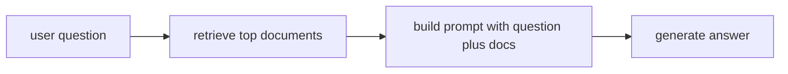

# P5-10.2 검색 결과와 생성의 결합

P5-10.1에서는 RAG(retrieval-augmented generation)가 왜 필요한지 보았습니다. 이제 한 단계 더 들어가야 합니다.

찾아온 문서는 실제로 어디에 붙고, 답변은 그 위에서 어떻게 만들어지는가?

이 절은 그 흐름을 직관적으로 설명합니다.

RAG에서 검색 결과는 모델 입력 맥락에 붙고, 모델은 그 문서 범위 안에서 답을 생성하려고 시도한다.

## 이 절의 범위

이 절은 다음 질문에 답합니다.

- 검색 결과는 생성 전에 어떻게 쓰이는가?
- 문서를 많이 넣는다고 항상 좋은가?
- 검색 품질과 생성 품질은 왜 따로 봐야 하는가?

이 절에서는 다음 내용을 깊게 다루지 않습니다.

- chunking 전략 세부
- reranker 구현 세부
- context window 최적화 알고리즘

검색 저장소와 인덱스 문제는 다음의 P5-11.1 벡터 데이터베이스와 P5-11.2 인덱스와 검색 품질에서 다시 회수합니다. context window 제약 자체는 앞의 P5-3.2 attention과 context window에서 이미 다루었고, 운영상 제약은 P5-16.1에서 다시 연결합니다.

이 절의 목적은 RAG를 `검색 후 생성`이라는 두 단계 구조로 분해하고, 두 단계 각각의 실패 지점을 구분하는 데 있습니다.

## 이 절의 목표

- 검색 결과와 생성이 어떻게 이어지는지 설명할 수 있습니다.
- 검색 단계와 생성 단계의 실패를 구분할 수 있습니다.
- 많이 넣는 것과 잘 넣는 것이 다르다는 점을 말할 수 있습니다.
- 다음 장의 벡터 데이터베이스와 인덱스 설명으로 자연스럽게 넘어갈 수 있습니다.

## 검색 결과는 어디에 붙나

가장 단순한 형태에서는 검색된 문서 일부가 프롬프트 맥락에 함께 들어갑니다.

예를 들어 입력은 다음처럼 구성될 수 있습니다.

- 사용자 질문
- 검색된 문서 발췌
- 답변 형식 지시

즉, 모델은 `질문만` 받는 것이 아니라, `질문 + 관련 문서 + 응답 지시`를 함께 받게 됩니다.

다음처럼 기억하면 좋습니다.

`RAG는 검색 결과를 모델 바깥에서 따로 가지고 있다가, 답하기 직전에 입력 맥락으로 붙여 넣는 구조다.`

## 문서를 많이 넣으면 항상 좋은가

아닙니다. 여기서 중요한 것은 `양`보다 `관련성`과 `정리 방식`입니다.

문서를 너무 많이 넣으면:

- 핵심이 묻힐 수 있고
- 서로 충돌하는 문장이 섞일 수 있으며
- context window를 낭비할 수 있고
- 모델이 오히려 헷갈릴 수 있습니다

따라서 검색 결과는 `많이 모으는 것`보다 `질문에 맞는 자료를 적절한 크기와 순서로 넣는 것`이 더 중요합니다.

## 검색 실패와 생성 실패는 어떻게 다른가

이 구분이 매우 중요합니다.

### 검색 실패

- 관련 문서를 못 찾았다
- 오래된 문서가 먼저 나왔다
- 질문과 상관없는 문서가 섞였다

### 생성 실패

- 문서를 가져왔는데도 잘못 요약했다
- 문서 근거보다 일반 기억으로 답했다
- 출처를 잘못 연결했다

즉, RAG 시스템에서 답이 이상하면 항상 `모델이 나쁘다`고만 말할 수 없습니다. 먼저 검색이 틀렸는지, 생성이 틀렸는지를 나눠 봐야 합니다.

## 왜 답변 품질이 흔들릴 수 있나

RAG는 두 단계를 결합하기 때문에 흔들릴 수 있는 지점도 늘어납니다.

- 검색 문서 선택
- 문서 길이와 발췌 방식
- 문서 순서
- 생성 지시 방식
- 인용 형식

이 때문에 RAG는 단순히 검색 하나, 생성 하나가 아니라 `검색 파이프라인 + 생성 파이프라인`으로 읽는 것이 더 정확합니다.

## 아주 단순하게 그리면



이 도식의 핵심은 검색 결과가 답변 뒤에 붙는 것이 아니라, `답변 전에 입력 맥락으로 들어간다`는 점입니다.

## 사례로 보기

### 사례 1. 제품 지원 챗봇

고객이 `자동 저장을 끄려면 어디로 들어가야 하나요?`라고 묻는 제품 지원 챗봇을 생각해 볼 수 있습니다. 검색 단계는 먼저 최신 매뉴얼에서 `자동 저장`, `설정`, `환경설정`이 들어간 관련 문단을 찾아와야 합니다. 그다음 생성 단계는 그 문단 내용을 그대로 복사하는 대신, 고객 질문에 맞춰 `어느 메뉴를 누르고 어떤 순서로 들어가야 하는지`를 다시 설명합니다. 만약 검색이 잘못되어 다른 제품 버전 문단을 가져오면 생성이 아무리 자연스러워도 엉뚱한 기능을 안내하게 됩니다. 그래서 이 장면은 검색과 생성이 한 단계가 아니라, `맞는 문단을 가져온 뒤 그 문단을 질문형 답으로 바꾸는 두 단계`임을 보여 줍니다.

### 사례 2. 법률 문서 보조

법률 문서 보조 도구에서 사용자가 `이 조항이면 계약 해지가 바로 가능한가요?`라고 묻는다고 해 봅시다. 검색 단계는 먼저 관련 조문과 판례 요약을 찾아 현재 질문과 가까운 문서를 모읍니다. 생성 단계는 그 문서를 바탕으로 `바로 가능`, `추가 조건 필요`, `판단 보류`처럼 질의응답 형태로 다시 정리합니다. 하지만 생성이 문서에 없는 강한 단정을 덧붙이면, 검색은 맞았어도 최종 답은 위험해질 수 있습니다. 그래서 이 사례에서는 `문서를 찾는 정확성`과 `문서 바깥으로 나가지 않는 정리`를 따로 봐야 합니다.

### 사례 3. 개발 문서 질의응답

개발자가 `이 API에서 timeout 옵션은 어디에 넣나요?`라고 묻는 장면을 떠올려 볼 수 있습니다. 사람은 검색이 올바른 버전의 공식 문서를 가져오면 `이제 거의 끝났다`고 느끼기 쉽습니다. 하지만 생성 단계가 예전 예제 코드와 새 문서를 섞거나 옵션 이름을 비슷한 다른 인자로 바꿔 말하면, 최종 답은 여전히 실패로 이어질 수 있습니다. 즉, 검색이 맞다고 해서 자동으로 답도 맞는 것은 아닙니다. 이 사례는 `올바른 문서를 찾는 일`과 `찾은 문서를 질문형 설명으로 안전하게 재구성하는 일`이 별도 단계임을 보여 줍니다.

## 작은 Python 예제로 보기

이번 예제의 목표는 검색과 생성을 한 단계로 섞지 않고, 둘을 나눠 보는 감각을 만드는 것입니다.

입력:

- 질문
- 검색 결과
- 생성용 입력 조합

출력:

- 답변 직전의 결합 상태

```python
question = "벡터 검색이 왜 필요한가요?"

retrieved_docs = [
    "문서 A: 의미가 비슷한 텍스트를 벡터 공간에서 가깝게 찾는다.",
    "문서 B: 키워드가 달라도 의미 기반 검색이 가능하다.",
]

prompt_payload = {
    "question": question,
    "docs": retrieved_docs,
    "instruction": "문서를 바탕으로 독자 기준으로 설명해 주세요.",
}

print("question =", question)
print("retrieved_docs =", retrieved_docs)
print("prompt_payload =", prompt_payload)
```

실행 결과 예시는 다음처럼 읽을 수 있습니다.

```text
question = 벡터 검색이 왜 필요한가요?
retrieved_docs = ['문서 A: 의미가 비슷한 텍스트를 벡터 공간에서 가깝게 찾는다.', '문서 B: 키워드가 달라도 의미 기반 검색이 가능하다.']
prompt_payload = {'question': '벡터 검색이 왜 필요한가요?', 'docs': ['문서 A: 의미가 비슷한 텍스트를 벡터 공간에서 가깝게 찾는다.', '문서 B: 키워드가 달라도 의미 기반 검색이 가능하다.'], 'instruction': '문서를 바탕으로 독자 기준으로 설명해 주세요.'}
```

이 예제는 검색 결과가 답변과 섞여 사라지는 것이 아니라, 생성 직전 `입력 payload`의 일부로 합쳐진다는 점을 보여 줍니다.

## 역사와 커리큘럼 관점

RAG가 중요해진 이유는 단순히 검색 기술이 새로워서가 아닙니다. 생성형 AI가 실제 업무에 쓰이기 시작하면서, 사람들은 `그럴듯한 답`보다 `문서 기반 답`을 더 원하게 되었기 때문입니다.

커리큘럼 관점에서 이 절이 중요한 이유는 다음과 같습니다.

- 검색과 생성을 하나로 뭉뚱그리지 않게 하고
- 다음 장의 벡터 데이터베이스와 인덱스가 왜 필요한지 준비시키며
- 이후 평가 장에서 `검색 품질`과 `답변 품질`을 따로 점검해야 한다는 관점을 만들기 때문입니다

## 다음 장과의 연결

여기까지 오면 다음 질문이 남습니다.

- 검색은 어떤 자료구조와 저장 구조 위에서 빨라지는가?
- 텍스트를 벡터로 저장하고 찾는 시스템은 어떤 역할을 하는가?

이 질문은 P5-11.1 벡터 데이터베이스(vector database)로 이어집니다.

## 이 절에서 기억할 관점

- 검색 결과는 생성 전에 입력 맥락으로 붙습니다.
- 많이 넣는 것보다 관련성 있게 잘 넣는 것이 더 중요합니다.
- 검색 실패와 생성 실패는 구분해야 합니다.
- 이 절은 다음 장의 벡터 데이터베이스와 인덱스 설명의 직접 기반입니다.

## 체크리스트

- 검색 결과와 생성이 어떻게 이어지는지 설명할 수 있는가?
- 검색 실패와 생성 실패를 구분할 수 있는가?
- 왜 문서를 많이 넣는다고 항상 답이 좋아지지 않는지 설명할 수 있는가?
- 왜 다음 장에서 벡터 데이터베이스를 배워야 하는지 말할 수 있는가?

## 출처와 참고 자료

- Patrick Lewis et al., `Retrieval-Augmented Generation for Knowledge-Intensive NLP Tasks`, NeurIPS, 2020, 확인 날짜: 2026-06-29.
- OpenAI, 검색/RAG 관련 공식 문서, 확인 날짜: 2026-06-29.
- 관련 교육 자료 및 기술 블로그, 확인 날짜: 2026-06-29.
