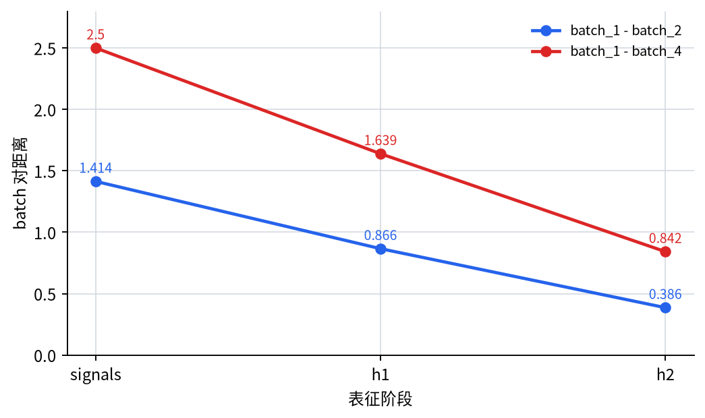
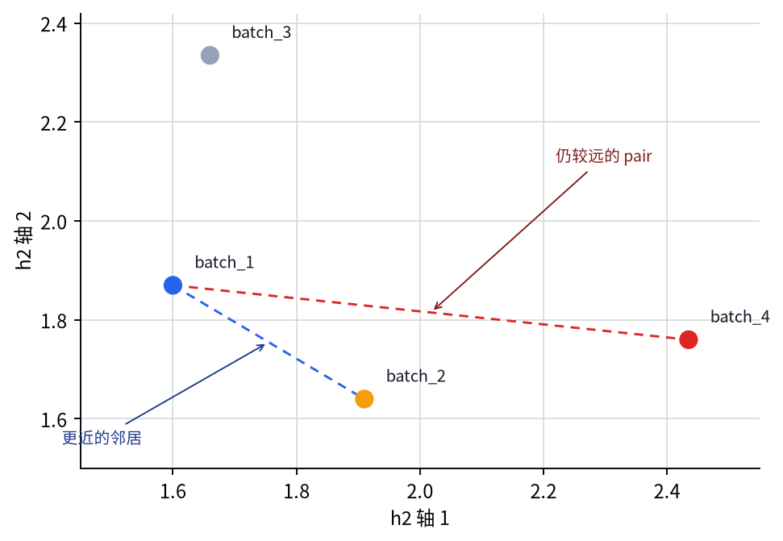

# P5-10.2 深层中的表征

Section ID: `P5-10.2`
Version: `v2026.07.17`

在 P5-10.1 里，我们已经把 representation learning 解释成`模型自己学出有用内部 feature 的过程`。顺着这个解释，接下来的问题就会自然出现。

那么，在深层神经网络里，随着层越来越深，表征会怎样变化？

通常的说法是：层越深，表征会从更局部、更简单的 pattern，逐渐移动到更抽象、也更靠近任务（task）的 pattern。

如果之后又想重新确认：`层变深时，表征究竟该怎样读`，更适合回到[英文概念词汇表里的 representation 条目](/AiBook/en/reference/concept-glossary/#representation)。

## 本节范围

- 什么叫 low-level feature，什么又叫 high-level representation？
- 为什么会说：把很多层堆起来，就可能得到更抽象的表征？
- 深层里的表征，在不同数据领域里会怎样相似，又怎样不同？
- 为什么这里的说明不该被读成完美定律，而该被读成一种直观倾向？

这一节先把深层表征关成：`从更靠近原始输入的简单 pattern，朝更靠近任务的抽象表征移动的倾向`，并专注于把这种直觉安全地解释清楚。

同时，这一节也明确把哪些问题留到后面。图像里的层级表征，会在 P5-11.1、P5-11.2 再次接回；顺序数据和 attention 型表征，则会在 P5-12.1、P5-12.2、P5-13.1、P5-13.2、P5-14.1、P5-14.2 里继续展开。

也就是说，这里不会把`更深 = 更聪明`之类的夸张说法塞给读者，而是尽量安全地说明层级表征的直觉。

## 本节目标

- 能把深层表征解释成`从简单 pattern 走向更抽象表征的倾向`。
- 能说明：堆层数的意义不只是 parameter 变多，也和表征层级发生变化有关。
- 能比较图像、语音、文本里的层级表征直觉。
- 能通过可执行的 Python 例子，确认信号穿过多层后表征空间会怎样改变。

## low-level 和 high-level 到底是什么意思

在入门阶段，先用下面这个区分就足够。

- low-level feature：最贴近原始输入的模式
- high-level representation：更贴近任务的抽象组合

例如，在图像里：

- 前面先出现 edge、方向、简单纹理
- 中间会出现局部形状
- 更后面则会出现 object clue

也就是说，在图像里，经常可以看到这样一种层级：低层 pattern 经过局部形状，再往后汇成 object 级别的线索。

重要的是，这并不是一个对所有网络都完全一致的公式，而更像是一种在教学中反复出现的直观倾向。

如果再按层的角色写得更清楚一点，大致就是下面这样。

| 表征层级 | 常见的解释 | 与任务的距离 |
| --- | --- | --- |
| low-level | edge、短频率 pattern、token 邻域线索 | 仍然离 raw input 很近 |
| mid-level | 局部形状、音节线索、句法 pattern | 连接输入和任务的中间结构 |
| high-level | object clue、说话人特征、句子语义角色 | 更靠近任务判断 |

## 为什么堆层后，表征会开始变化

每一层都会在前一层输出之上再做新的组合。因此，后面的层不再直接盯着原输入，而是在使用前面已经形成的表征作为材料。

也就是说：

- 第一层处理更贴近输入的信号
- 下一层处理这些信号的组合
- 更深的层，再处理这些组合的组合

正因为这种重复存在，才会说表征随着层数变深而变得更抽象。

先把它记成下面这句话就够了。

`深层并不是在反复重新看原始数据，而是在拿已经整理好的中间表征继续重组，进而形成更靠近任务的表征。`

如果把这个过程换成一个很小的工作比喻，会更容易读。

- 第一阶段先把原始记录里显眼的线索记下来
- 第二阶段把这些线索重新合成更有意义的中间判断材料
- 最后阶段再用这些中间材料，做出更接近真实任务的结论

神经网络每一层的工作方式当然不会完全等同，但在入门阶段，可以先把它读成类似的`线索 -> 中间结构 -> 靠近任务的表征`流程。

这里真正重要的是：后面的层不是把原始输入原封不动地再看一遍，而是在重组前面已经整理出的表征。

```mermaid
--8<-- "assets/part-05/chapter-10/layered-recomposition-flow-zh.mmd"
```

也就是说，深度更准确的读法，不只是`层数增加了`，而是`多了一道重组已经形成的表征的阶段。`

## 图像里的层级表征直觉

图像领域是这种解释最直观的地方。

例如，想到 CNN 时，可以先这样理解：

- 前面的 filter 会先对 edge 或小 pattern 起反应
- 中间层会对眼睛、耳朵、轮子之类的局部结构起反应
- 更后面的层则会被解释成在组合更大的线索，例如储罐轮廓、阀门布局、警示灯位置

当然，真实网络内部比这复杂得多。但这里最重要的流向仍然是：`小 pattern -> 局部结构 -> 更大的有意义线索`。

## 语音和文本里的层级表征直觉

这种直觉在图像之外也依然有用。

### 语音

- 原始波形或短频率线索
- 发音碎片
- 音节、单词、说话人特征之类的线索

也就是说，在语音里，经常能观察到这样一层：低层频率线索经过发音碎片，再往更大的语言线索过渡。

### 文本

- token 级信息
- 相邻上下文 pattern
- 句子级语义和角色

也就是说，在文本里，也经常会看到 token 与近邻上下文 pattern 累积之后，继续导向句子层面的语义与角色线索。

因此，即使数据领域不同，那条层级式解释仍然经常成立：`前面处理更近的信号，后面处理更靠近任务的结构。`

把它们按领域并排放在一起，差异和共通点会更清楚。

| 领域 | 前面更容易看到的东西 | 往后更容易看到的东西 |
| --- | --- | --- |
| 图像 | 边界、方向、小纹理 | 局部结构、object clue |
| 语音 | 短频率 pattern、发音碎片 | 音节、单词、说话人特征 |
| 文本 | token、邻近上下文 | 句子角色、语义关系、任务线索 |

## 但不能把这种解释说得过满

层级表征的直觉在教学里非常有用，但还必须同时知道下面几点。

- 不是每一层都一定只对应一个干净明确的意义
- 不同领域、不同结构里，表征的长相会不一样
- 在现代模型里，也会出现比单线层级更复杂的交互

也就是说，这一节的解释不是严格普适定律，而更像是一张`帮助理解学习流程的安全基础地图`。

尤其下面这些误解，更适合主动避开。

| 常见误解 | 更安全的说法 |
| --- | --- |
| 更深的层永远更聪明 | 更深的层更倾向于形成更靠近任务的表征 |
| 每一层都有唯一固定意义 | 层表征会重叠、会混合，解释并不总是那么整齐 |
| 所有模型都会表现出同样层级结构 | 层级直觉很有用，但仍然会随结构和领域变化 |

## 如果把它画得极简

```mermaid
--8<-- "assets/part-05/chapter-10/hierarchical-representation-flow-zh.mmd"
```

这张图是在把深层表征直觉压到最短。

## 案例与示例

### 代表案例. 实封缺陷图像分类

假设包装线上要区分封口正常的包装袋，和边缘微微翘起的弱封口包装袋。人一开始很容易只想看那些立刻能看见的局部线索，比如亮线长度、翘起区段数量。但只要拍摄角度稍微变化，或者反光突然变强，同样的弱封口在只看线长和亮度时，也可能看起来像正常。前面的层会先对短边界、亮度变化、小皱褶碎片这类局部 pattern 起反应；更深的层，则会继续把封口线怎样连接、边缘曲率怎样变化、皱褶和反光怎样一起出现，这些更大的质量线索组合起来。所以可以这样解释：随着层更深，表征不再只贴着反光点或短线碎片，而会逐渐转向`整个封口结构是怎样连起来的`，因此即使图像局部 pattern 相似，也能形成更稳定的质量区分。

因此，这个案例里要确认的结果是：那些只看短亮度变化时会混淆的包装袋，能不能在把封口整体结构线索也算进去之后，更稳定地被分成正常和弱封口。

| 人最容易先看的标准 | 用层级表征视角重读的标准 |
| --- | --- |
| 只要几条发亮的线相似，就容易觉得质量一样 | 即使前层会同时对相似反光起反应，更深的层也可能把封口整体连接结构分开 |
| 只看短边界碎片时，正常和弱封口很容易混淆 | 当这些局部碎片被重新组合成边缘曲率与连接方式后，区分会更稳定 |
| 容易觉得变深只是让数值更多了 | 真正要看的不是数值多少，而是`哪条质量区分轴变得更清楚了` |

同样的视角也适用于别的数据。只是这一节真正要抓住的核心，不是领域名字，而是：`前面更近的线索，是否会在后层里被重新组合成更大的结构判断轴。`

| 场景 | 人最容易先看到的结果 | 用层级表征视角真正要区分的东西 | 接着马上该确认什么 |
| --- | --- | --- | --- |
| 实封缺陷图像分类 | 只要反光线和边界碎片相似，看起来就像同样质量 | 即使前层局部 pattern 相似，后层也可能把封口整体连接结构保留成更重要的轴 | 看正常与弱封口能否借整体结构线索更稳定地分开 |
| 设备摄像头场景再识别 | 只要大圆筒的印象相似，就容易觉得是同一场景 | 即使光照和角度变了，更深层仍可能更稳定保留储罐-管道-阀门布局这种结构轴 | 看设备结构线索是否比局部反光摇晃保留得更久 |
| 句子分类 | 只要几个关键词相似，就容易觉得属于同一类型 | 更深表征里，比起单词本身，句子意图和风险方向可能会成为更重要的轴 | 看看原本像状态汇报的句子，会不会被分成复检请求 |
| 生产 batch 时序 | 最近值相似时，状态就容易看起来相似 | 更深层里，重复节奏和反应顺序可能比最近平均值更重要 | 看风险组和稳定组是否更早分开 |

## 练习与例子

这个例子的目标，是看生产 batch 的异常信号，穿过一层、再穿过两层之后，会怎样被重新排进另一套表征空间。

问题场景：

- 在浅层输入空间里看起来相似的生产 batch，也可能在穿过多层之后，进入一个更容易区分的表征空间
- 但这个例子里的权重不是由真实学习得到的，而是固定变换，只用来观察逐层变换会怎样改写表征空间

输入：

- 4 个生产 batch 的两个异常信号指标
- 两阶段固定权重变换

输出：

- 输入空间里的 batch 信号
- 第一层 hidden representation
- 第二层 hidden representation
- 随着层加深，batch 间距离怎样变化
- 哪些 batch 对会变近，哪些仍然相对不那么接近

要确认的概念：

- 学出来的深层表征，不会把输入原封不动留下，而会把它重新排列到更有用的空间里
- 这个例子不实现完整学习过程，只单独抽出`逐层变换怎样改写坐标与距离关系`
- 要读出深度的意义，就必须看 batch 间距离在一层、两层之后怎样变化
- 只看最终 label 不够，还要一起看中间 hidden representation 的变化
- 深层表征会在新的坐标系里重新整理：`哪些 batch 变得更像，哪些 batch 不再那么像`

从初学者角度，这个例子最适合按下面三个步骤来读。

| 阅读步骤 | 先看什么 | 接着马上要抓住的问题 |
| --- | --- | --- |
| 1 | `signals`, `h1`, `h2` | 随着信号穿过多层，同一个输入 batch 会不会被重新放进别的坐标系？ |
| 2 | 距离输出值 | 哪些 batch 对更快变近，哪些仍然相对不那么近？ |
| 3 | 两张图 | 除了距离减少之外，关系的`重新排序`是不是也真的看得见？ |

输入（input）：

我们使用上面整理好的生产 batch 异常信号向量，以及逐层权重变换。

这里的 `w1`、`w2` 并不是为了宣称它们就是训练好的模型 parameter。真实深度学习里，这些变换会通过数据、loss、optimizer 被不断调整。这里把那整个学习过程拿掉，只留下：在固定变换 `signals -> h1 -> h2` 下，表征空间和距离关系会怎样改变。

在看代码之前，可以先预测某些 batch 对会怎样变化。

| 比较 | 可以先预测的变化 | 预测理由 |
| --- | --- | --- |
| `batch_1` vs `batch_2` | 它们可能会变得更近 | 即使输入指标不同，经过多层之后也可能压缩到相近的异常组合轴上 |
| `batch_1` vs `batch_4` | 它们仍可能相对更远 | 一开始就差得更开的 pair，即使到更深层里也未必会靠到同样程度 |

这张表的目的，是先固定住：不是`层变深时一切都同样移动`，而是`表征空间会重新排列各 batch 之间的关系。`

```python
import numpy as np

signals = np.array([
    [1.0, 2.0],
    [2.0, 1.0],
    [0.5, 3.0],
    [3.0, 0.5],
])

w1 = np.array([
    [0.8, 0.3, 0.4],
    [0.1, 0.65, 0.45],
])

w2 = np.array([
    [0.6, 0.2],
    [0.4, 0.8],
    [0.3, 0.1],
])

def relu(x):
    return np.maximum(0.0, x)

def pair_distance(a, b):
    return round(float(np.linalg.norm(a - b)), 3)

h1 = relu(signals @ w1)
h2 = relu(h1 @ w2)

print("signals =")
print(np.round(signals, 3))
print()
print("h1 =")
print(np.round(h1, 3))
print()
print("h2 =")
print(np.round(h2, 3))
print()
print("distance(batch_1, batch_2) in signals =", pair_distance(signals[0], signals[1]))
print("distance(batch_1, batch_2) in h1 =", pair_distance(h1[0], h1[1]))
print("distance(batch_1, batch_2) in h2 =", pair_distance(h2[0], h2[1]))
print("distance(batch_1, batch_4) in signals =", pair_distance(signals[0], signals[3]))
print("distance(batch_1, batch_4) in h1 =", pair_distance(h1[0], h1[3]))
print("distance(batch_1, batch_4) in h2 =", pair_distance(h2[0], h2[3]))
```

输出时，依次看 `signals`、`h1`、`h2`，再接着看 `batch_1` 和 `batch_2` 的距离如何随着层数变化即可。

```text
signals =
[[1.  2. ]
 [2.  1. ]
 [0.5 3. ]
 [3.  0.5]]

h1 =
[[1.   1.6  1.3 ]
 [1.7  1.1  1.4 ]
 [0.7  2.2  1.45]
 [2.45 0.95 1.7 ]]

h2 =
[[1.6   1.87 ]
 [1.91  1.64 ]
 [1.66  2.335]
 [2.435 1.76 ]]

distance(batch_1, batch_2) in signals = 1.414
distance(batch_1, batch_2) in h1 = 0.866
distance(batch_1, batch_2) in h2 = 0.386
distance(batch_1, batch_4) in signals = 2.5
distance(batch_1, batch_4) in h1 = 1.639
distance(batch_1, batch_4) in h2 = 0.842
```

- 输入 batch 信号不会原样直达答案，而是经过中间表征 `h1`、`h2` 后重新排列。
- 同一对 batch 在穿过层之后，彼此可能变得更近，也可能相对仍然更远。
- 深层表征不该被读成`只是数值变多了`，而更适合读成：层级变换会改变 batch 之间的关系。
- 在真正学得出的模型里，还要继续确认这种关系变化是否真的朝着降低损失、改善任务判断的方向被调整。

把距离变化分开画出来后，更容易看清：即使两组 batch 对都变近，它们靠近的速度和程度也不相同。`batch_1` 和 `batch_2` 在 `h2` 里留下了更近的邻居关系，而 `batch_1` 和 `batch_4` 虽然也靠近，但相对仍更远。



只看最终 `h2` 表征空间时，也能看到：深层表征并不是简单地把值缩小，而是在重新安排各 batch 之间的位置关系。



因此解读输出时，不该只看`某个距离是否变小`，而要同时看`batch 之间的关系被怎样重新整理`。

| 比较 | 现在应该抓住的重点 |
| --- | --- |
| `batch_1` vs `batch_2` | 它们在输入空间里不同，但随着层数加深，会被压缩成更近的表征。 |
| `batch_1` vs `batch_4` | 这组也会靠近，但仍比 `batch_1` vs `batch_2` 更远，说明深层会重新排列关系的先后顺序。 |
| 整体解读 | 深度不是把 batch 全都挤到一起，而是在学得出的模型里，允许`哪些 batch 更像、哪些 batch 没那么像`在新的坐标系里被重新整理。这个示例只把坐标变化和关系重排单独拿出来看。 |

读输出数字时，也要把`距离是否变小`和`哪一对 batch 会被留下为更重要的近邻`分开来看。

| 比较 | 输出里先看到的事实 | 只看距离时容易留下的解读 | 结合层级表征后会改变的解读 |
| --- | --- | --- | --- |
| `batch_1` vs `batch_2` | 距离从 `1.414 -> 0.866 -> 0.386`，明显变近。 | 可能会误以为层变深时所有东西只是一起变得相似。 | 在这个固定变换里，这对 batch 被重新排成更近的邻居。真正的模型还要继续确认这种重排是否有利于任务。 |
| `batch_1` vs `batch_4` | 距离从 `2.5 -> 1.639 -> 0.842`，也在变近。 | 容易得出`反正所有 batch 最后都会差不多`的印象。 | 即使也变近，它仍比 `batch_1` vs `batch_2` 更远，说明深层在重新排序关系，而不是简单压缩所有差异。 |
| 整体解读 | 表面看上去像所有距离都在缩小。 | 会把深度读成单纯压缩数值的过程。 | 更重要的是：哪些关系会被保留成更近、哪些关系不会，都会随着坐标系改变而被重新定义。这是否正确，要靠学习与评估去确认。 |

深层表征这条主线，是解释深度学习为何不同于 shallow model 的关键。重点不只是层数变多，而是`会形成层级化的内部表征`。只有这样，CNN、RNN、Transformer 才不会被误读成只是更大的函数。

这个视角也会把上一节 P5-10.1 的表征学习，继续展开成`随着层数增加，内部表征会继续变化`。接下来的 P5-11.1、P5-11.2 会在 CNN 里继续展开，P5-12.1、P5-12.2 会在序列模型里继续展开，P5-13.1、P5-13.2 会在 attention 里继续展开。因此，这一节也承担着把 Part 5 后续结构章节连接起来的概念桥梁作用。

这里也可以先停一下，把`什么时候应该先从层级表征视角读，而不是只盯着层数`短暂固定下来。这样进入下一章 CNN 时，关于深度的说明就能自然过渡到结构说明。

| 先想到的问题 | 为什么要先用层级表征视角 | 下一节会继续接到哪里 |
| --- | --- | --- |
| 为什么继续加层，不只是为了增加参数？ | 因为前面的表征可以被重新组合，变成更接近任务的表征。 | CNN 如何逐层放大局部 pattern |
| 为什么要区分低层特征和高层表征？ | 因为在谈结构之前，先要看清`什么东西正在逐步抽象化`。 | 图像、序列、attention 中的表征差异 |
| 为什么说深层模型和 shallow model 不一样？ | 因为更安全的理解方式，是把深度读成内部表征持续重排的过程，而不只是函数变大。 | 后续各结构如何进行表征学习 |

## 检查清单

- 能解释随着层数加深，表征通常会朝更抽象、也更靠近任务的模式移动这一直觉吗？
- 能同时说明这不是绝对法则，而是一种常见倾向吗？
- 能解释堆更多层的意义，不只在于参数增加，也在于表征层级发生变化吗？
- 能把深度解释成`中间表征被继续重组的阶段增加了`，而不是只说`层数变多了`吗？
- 能说明图像、语音、文本里都常会出现层级表征直觉吗？
- 能说明 low-level、mid-level、high-level 的区分更像教学用基础地图，而不是严格定律吗？
- 当有人只用参数数量解释深度时，能先想到层级表征视角吗？
- 当准备进入下一章 CNN 时，能先想到`局部 pattern 会怎样层层长成更大的结构`吗？

## 来源与参考资料

- Yoshua Bengio, Aaron Courville, Pascal Vincent, `Representation Learning: A Review and New Perspectives`, IEEE TPAMI, 2013，确认日期：2026-06-29。
- Ian Goodfellow, Yoshua Bengio, Aaron Courville, `Deep Learning`, MIT Press, 2016，确认日期：2026-06-29。[https://www.deeplearningbook.org/](https://www.deeplearningbook.org/){: target="_blank" rel="noopener noreferrer" }
- Dumitru Erhan et al., `Why Does Unsupervised Pre-training Help Deep Learning?`, JMLR, 2010，确认日期：2026-06-29。
