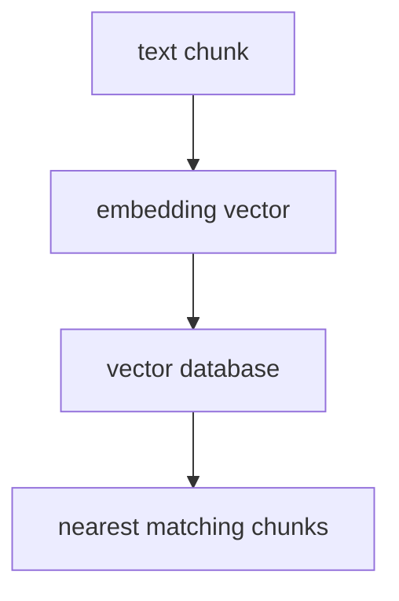

# P5-11.1 벡터 데이터베이스(vector database)

P5-10.2에서는 검색 결과가 생성 전에 입력 맥락으로 붙는다는 점을 보았습니다. 그러면 다음 질문이 자연스럽게 이어집니다.

그 검색은 실제로 어떤 저장 구조 위에서 돌아가는가?

이 절은 그 질문에 답합니다.

벡터 데이터베이스(vector database)는 임베딩(embedding) 벡터와 그에 연결된 원문, 메타데이터를 저장하고, 비슷한 벡터를 빠르게 찾도록 돕는 시스템이다.

## 이 절의 범위

이 절은 다음 질문에 답합니다.

- 왜 텍스트를 그대로 검색하지 않고 벡터를 저장하는가?
- 벡터 데이터베이스는 무엇을 저장하고 무엇을 돌려주는가?
- 왜 RAG 구조에서 벡터 데이터베이스가 자주 등장하는가?

이 절에서는 다음 내용을 깊게 다루지 않습니다.

- 특정 상용 제품 비교
- ANN(approximate nearest neighbor) 알고리즘 수식
- 샤딩과 클러스터 운영 세부

벡터 저장소의 역할은 여기서 잡고, 속도와 근사 검색의 균형은 바로 다음 P5-11.2 인덱스와 검색 품질에서 다시 회수합니다. 특정 제품 비교와 클러스터 운영 세부는 빠르게 바뀌는 주제라 현재 본편 범위 밖으로 둡니다.

벡터 데이터베이스는 `새로운 종류의 마법 저장소`가 아니라, 임베딩 검색을 서비스 구조 안에서 다루기 쉽게 만든 시스템으로 읽는 편이 맞습니다.

## 이 절의 목표

- 벡터 데이터베이스를 입문 수준에서 설명할 수 있습니다.
- 임베딩, 문서 조각(chunk), 메타데이터가 함께 저장된다는 점을 말할 수 있습니다.
- 왜 RAG에서 일반 키워드 검색만으로는 부족할 수 있는지 설명할 수 있습니다.
- 다음 절의 인덱스와 검색 품질 문제로 자연스럽게 넘어갈 수 있습니다.

## 왜 벡터를 저장하나

앞 절에서 보았듯, RAG는 관련 문서를 먼저 찾는 구조입니다. 그런데 질문과 문서가 항상 같은 단어를 쓰는 것은 아닙니다.

예를 들어 사용자는:

- `환불 기준이 바뀌었나요?`

라고 묻고, 문서에는:

- `반품 처리 기간 변경`

처럼 다른 표현이 있을 수 있습니다.

이런 경우 단순 키워드 검색은 놓칠 수 있지만, 의미가 비슷한 표현을 벡터 공간에서 가깝게 찾는 방식은 도움이 될 수 있습니다.

즉, 벡터 데이터베이스는 `문장을 숫자 벡터로 바꾼 뒤, 의미가 가까운 것을 빠르게 찾는 일`을 서비스 안에서 관리하기 쉽게 해 줍니다.

## 벡터 데이터베이스는 무엇을 저장하나

독자가 가장 자주 오해하는 지점은 `벡터만 저장하는가?`입니다. 실제로는 보통 다음이 함께 들어갑니다.

- 임베딩 벡터
- 원문 또는 문서 조각(chunk)
- 문서 ID
- 제목, 날짜, 출처 같은 메타데이터(metadata)

즉, 벡터 데이터베이스는 보통 `숫자 벡터만 덩그러니 모아 둔 곳`이 아니라, `검색 후 다시 원문을 꺼내 올 수 있게 연결된 저장소`로 보는 편이 맞습니다.

## 무엇을 돌려주나

질문을 임베딩으로 바꿔 검색하면, 시스템은 보통 다음을 돌려줍니다.

- 가까운 벡터 항목들
- 그 항목에 연결된 문서 조각
- 유사도 점수
- 메타데이터

그리고 RAG 파이프라인은 이 결과를 다시 프롬프트 맥락으로 붙여 생성 단계에 넘깁니다.

## 왜 RAG에서 자주 등장하나

RAG는 `질문 -> 관련 문서 검색 -> 생성` 구조입니다. 여기서 검색이 의미 기반으로 이루어지려면, 벡터 저장과 유사도 검색을 효율적으로 다루는 계층이 필요합니다.

다음처럼 기억하면 좋습니다.

`벡터 데이터베이스는 RAG에서 검색 단계의 실무형 저장소 역할을 한다.`

즉, 이 시스템의 역할은 모델을 대신하는 것이 아니라, 모델이 참고할 문서를 잘 찾아오도록 돕는 것입니다.

## 일반 데이터베이스와 무엇이 다른가

이 절에서는 엄밀 비교보다 역할 차이만 잡으면 충분합니다.

| 저장소 관점 | 중심 질문 |
| --- | --- |
| 일반 데이터베이스 | 정확히 일치하는 키, 필드, 조건을 어떻게 찾을까? |
| 벡터 데이터베이스 | 의미가 비슷한 항목을 어떻게 가깝게 찾을까? |

물론 실제 서비스에서는 두 종류를 같이 쓰기도 합니다. 예를 들어:

- 사용자 ID나 날짜 필터는 일반 필드 검색
- 의미가 비슷한 문서 찾기는 벡터 검색

처럼 결합될 수 있습니다.

## 벡터 데이터베이스도 만능은 아니다

이 점을 같이 넣어야 `벡터 데이터베이스를 붙였다`는 사실과 `검색 품질 문제가 자동으로 해결됐다`는 판단을 섞지 않게 됩니다.

벡터 데이터베이스가 있다고 해서:

- 항상 가장 관련된 문서를 찾는 것
- 오래된 문서를 자동으로 배제하는 것
- 잘못 쪼개진 문서를 스스로 고치는 것

이 자동으로 해결되지는 않습니다.

즉, 벡터 저장 구조는 중요하지만, 문서를 어떻게 나누는지, 메타데이터를 어떻게 붙이는지, 어떤 임베딩 모델을 쓰는지도 여전히 중요합니다.

## 아주 단순하게 그리면



이 도식의 핵심은 텍스트가 먼저 벡터로 바뀌고, 검색은 그 벡터 저장소에서 일어난다는 점입니다.

## 사례로 보기

### 사례 1. 사내 위키 검색

사내 위키에서 사용자가 `퇴사 전에 회사 노트북을 어디에 반납하나요?`라고 묻는 장면을 생각해 보겠습니다. 사람이 키워드 검색만 쓰면 먼저 `노트북 반납`이란 표현이 그대로 들어간 문서를 찾게 됩니다. 하지만 실제 문서 제목은 `오프보딩 절차`, `자산 회수 안내`, `퇴사 체크리스트`처럼 다를 수 있고, 핵심 문장은 본문 안의 `IT 자산은 보안팀 데스크로 회수한다`일 수 있습니다. 이때 질문에는 `반납`이 있고 문서에는 `회수`만 있어도, 업무 흐름은 사실상 같습니다. 벡터 데이터베이스는 질문과 문서 조각을 의미 기반 벡터로 저장해 이런 표현 차이를 넘어서 관련 문단을 후보로 올리기 쉽게 만듭니다. 그래서 이 사례에서 확인해야 할 결과는 `반납`이란 단어가 없어도 `회수` 문단이 실제 후보로 올라오는가입니다.

### 사례 2. 제품 매뉴얼 검색

제품 매뉴얼에서 사용자가 `설정을 처음 상태로 되돌리고 싶어요`라고 묻는다고 해 봅시다. 사람이 문자열 검색만 쓰면 `처음 상태`, `되돌리기` 같은 표현이 들어간 문서부터 찾으려 합니다. 하지만 실제 매뉴얼은 `공장 초기화`, `설정 복원`, `리셋 후 재부팅`처럼 다른 용어를 섞어 쓸 수 있고, 메뉴 경로는 본문 표 한 칸에만 들어 있을 수 있습니다. 예를 들어 검색은 개요 문단만 찾고 실제 버튼 순서가 적힌 문단을 놓칠 수 있습니다. 벡터 데이터베이스는 이런 문서 조각을 의미가 가까운 위치에 저장해 표현 차이가 있어도 관련 후보를 더 고르게 모읍니다. 그래서 이 사례에서 확인해야 할 결과는 개요 설명보다 실제 버튼 순서가 적힌 문단이 함께 후보로 올라오는가입니다.

### 사례 3. 개발 문서 지원

개발자가 `요청 제한이 걸리면 잠깐 기다렸다 다시 보내는 옵션이 있나요?`라고 묻는다고 해 봅시다. 사람은 함수 이름이나 옵션명을 정확히 알아야 검색이 될 것이라고 먼저 생각할 수 있습니다. 하지만 질문에는 정확한 이름이 없고, 실제로는 retry나 backoff 설명이 들어 있는 API 문단을 찾아야 할 수 있습니다. 예를 들어 문서에는 `exponential backoff`와 `max_retries`만 적혀 있는데, 질문은 `잠깐 기다렸다 다시 보내기`처럼 완전히 풀어 쓸 수 있습니다. 키워드 검색만 쓰면 이름이 없는 질문에서 관련 문단이 후보에 올라오지 않을 수 있습니다. 벡터 데이터베이스는 이런 질문과 문서 조각을 의미 기반으로 가깝게 저장해 관련 API 설명을 더 잘 끌어올립니다. 그래서 이 사례에서 확인해야 할 결과는 정확한 옵션명을 몰라도 retry나 backoff 문단이 실제 후보로 올라오는가입니다.

## 작은 Python 예제로 보기

이번 예제의 목표는 실제 벡터 검색 엔진을 구현하는 것이 아니라, 벡터 데이터베이스에 어떤 단위가 들어가는지 감각적으로 보는 것입니다.

입력:

- 문서 조각
- 벡터
- 메타데이터

출력:

- 저장 레코드 형태

```python
record = {
    "id": "doc-001-chunk-02",
    "text": "환불 요청 처리 기한이 14일로 변경되었습니다.",
    "embedding": [0.12, -0.44, 0.81, 0.09],
    "metadata": {
        "source": "policy_notice_2026_06_29",
        "date": "2026-06-29",
        "category": "refund",
    },
}

print("record =", record)
print("next_step = similarity search over embedding")
```

실행 결과 예시는 다음처럼 읽을 수 있습니다.

```text
record = {'id': 'doc-001-chunk-02', 'text': '환불 요청 처리 기한이 14일로 변경되었습니다.', 'embedding': [0.12, -0.44, 0.81, 0.09], 'metadata': {'source': 'policy_notice_2026_06_29', 'date': '2026-06-29', 'category': 'refund'}}
next_step = similarity search over embedding
```

그래서 이 예제에서 확인해야 할 결과는 임베딩 숫자만이 아니라 원문 텍스트와 메타데이터가 함께 저장되어, 검색 뒤에 다시 꺼내 쓸 수 있는 구조라는 점입니다.

## 이 예제를 저장 구조 관점으로 다시 보면

앞의 예제는 벡터 데이터베이스를 구현하는 코드가 아니라, `비슷한 벡터를 찾는다`는 말 뒤에 실제로는 원문과 메타데이터까지 함께 저장하고 다시 꺼내는 계층이 있다는 점을 보여 주는 최소 장면입니다. 여기서 읽어야 할 핵심은 임베딩 숫자만으로 끝나지 않고, 검색 이후 답변 단계에 다시 쓸 정보를 함께 보존해야 한다는 점입니다.

## 역사와 커리큘럼 관점

임베딩과 벡터 검색 자체는 LLM 이전에도 중요했습니다. 하지만 생성형 AI 서비스가 널리 퍼지면서, 이 기술은 `문서를 찾아 답변에 붙이는 구조`의 핵심 계층으로 다시 주목받게 되었습니다.

커리큘럼 관점에서 이 절이 중요한 이유는 다음과 같습니다.

- 임베딩을 추상적 수학 개념에서 서비스 저장 구조로 연결하고
- 다음 절의 인덱스와 검색 품질 문제를 읽을 준비를 시키며
- 바로 앞의 P5-10.1, P5-10.2 RAG 흐름을 실제 저장 계층으로 다시 묶어 읽게 하고, 다음의 P5-11.2 인덱스와 검색 품질, 뒤의 P5-12.1 도구 사용과 P5-13.1 에이전트 구조에서 검색 기반 기능이 어디에 들어가는지 더 분명하게 보여 주며, 이후 P6-5.1 문서 기반 RAG 챗봇 목표, P6-5.2 검색 품질과 답변 검증, P6-6.1 agent의 기본 구조처럼 검색 기반 기능과 도구 연결 기능을 설계할 때 바로 재사용할 수 있게 하기 때문입니다

## 다음 절과의 연결

여기까지 오면 다음 질문이 남습니다.

- 비슷한 벡터를 빠르게 찾는 일은 어떻게 가능한가?
- 왜 검색 속도와 검색 정확도 사이에 균형 문제가 생기는가?

이 질문은 P5-11.2 인덱스(index)와 검색 품질로 이어집니다.

## 이 절에서 기억할 관점

- 벡터 데이터베이스는 임베딩 벡터와 원문, 메타데이터를 함께 저장하고 검색하는 시스템입니다.
- RAG에서는 질문과 가까운 문서 조각을 빠르게 다시 찾는 검색 단계의 실무형 저장소 역할을 합니다.
- 일반 키워드 중심 저장소와 달리, 표현이 달라도 의미가 가까운 문서 조각을 후보로 올리는 유사도 검색에 강점을 둡니다.
- 하지만 문서 분할, 메타데이터, 임베딩 모델 선택 문제를 대신 해결하지는 않습니다.

## 체크리스트

- 벡터 데이터베이스를 입문 수준에서 설명할 수 있는가?
- 무엇이 저장되고 무엇이 반환되는지 말할 수 있는가?
- 왜 RAG에서 이 구조가 자주 등장하는지 설명할 수 있는가?
- 왜 다음 절에서 인덱스와 검색 품질을 봐야 하는지 말할 수 있는가?

## 출처와 참고 자료

- Jeffrey Pennington et al., 임베딩과 의미 벡터 관련 기초 자료, 확인 날짜: 2026-06-29.
- 관련 벡터 검색 및 ANN 교육 자료, 확인 날짜: 2026-06-29.
- OpenAI, 임베딩 및 검색 관련 공식 문서, 확인 날짜: 2026-06-29.
