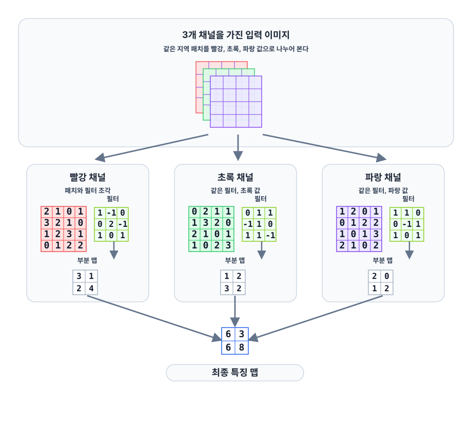
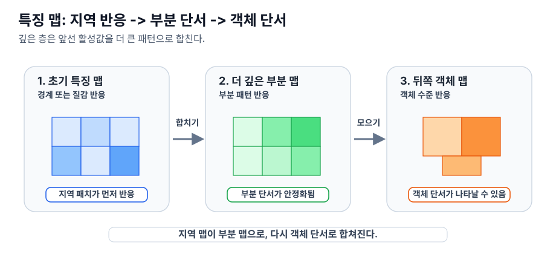

# P5-11.1 합성곱 신경망(CNN)의 직관

Section ID: `P5-11.1`
Version: `v2026.07.12`

P5-10장에서는 깊은 신경망이 층을 거치며 더 유용한 표현(representation)을 학습할 수 있다는 점을 보았습니다. 이제 이 관점을 이미지 쪽으로 좁히면 다음 질문이 생깁니다.

이미지처럼 공간 구조가 있는 데이터에서는, 왜 일반적인 완전연결층(fully connected layer)보다 합성곱 신경망(CNN)이 더 자연스럽다고 말하는가?

이 질문에 답하는 구조가 합성곱 신경망(CNN)입니다.

합성곱 신경망은 이미지 전체를 한꺼번에 같은 방식으로 보지 않고, 작은 지역 패턴(local pattern)을 반복해서 살피며 더 큰 시각적 구조를 배우는 신경망이다.

이미지 구조를 읽는 기본 정의를 다시 잡아야 할 때는 개념사전의 [합성곱 신경망(CNN, convolutional neural network)](../../../reference/concept-glossary.md#cnn-convolutional-neural-network) 항목을 기준으로 돌아옵니다.

## 이 절의 범위

- 합성곱 신경망은 왜 이미지와 잘 맞는가?
- 지역 패턴(local pattern)을 본다는 말은 무엇을 뜻하는가?
- 완전연결층만 쓰는 방식과 어떤 차이가 있는가?
- CNN이 표현 학습 관점에서 왜 중요한가?

이 절에서 먼저 닫아야 하는 핵심은 `이미지는 가까운 위치가 함께 의미를 만들기 때문에, 지역 패턴을 반복적으로 읽는 구조가 필요하다`는 점입니다.

즉, 지금 장의 핵심은 `이미지 전체를 한 번에 섞어 볼까`에서 `가까운 위치의 지역 구조를 반복해서 읽을까`로 손잡이가 바뀐다는 점입니다.

여기서 먼저 읽는 것은 optimizer나 regularization 같은 학습 절차가 아니라, 가까운 위치의 단서를 어떤 순서와 범위로 묶어 더 큰 시각 구조로 올려 읽는가라는 입력 구조입니다.

| 지금 이 절에서 읽는 것 | 바로 다음 절이나 보충학습으로 넘기는 것 |
| --- | --- |
| 이미지의 지역 구조를 왜 반복적으로 읽어야 하는가 | convolution, pooling이 그 구조를 실제로 어떻게 계산하는가 |
| 완전연결층과 CNN이 입력을 보는 방식의 차이 | CNN 이후 vision 구조를 어떤 기준으로 비교할 것인가 |

이 절에서는 다음 내용을 깊게 다루지 않습니다.

- convolution 수식의 엄밀한 전개
- padding, stride, dilation의 세부 구현 차이
- 최신 vision architecture의 상세 비교

구체적 연산인 convolution과 pooling은 P5-11.2에서 이어서 다루고, 이미지 도메인 표현 학습의 큰 흐름은 앞의 P5-10.1, P5-10.2에서 이미 잡았습니다. 이 절에서는 그 큰 흐름을 이미지 장면 위에 다시 얹어 읽습니다. CNN 이후의 vision 구조 비교는 보충학습 P5-11.3에서 `CNN과 Vision Transformer(ViT)를 어떤 관점에서 비교하면 되는가` 수준으로만 다루고, 더 최신 세부 변형까지의 상세 비교는 이 책의 현재 본편 범위 밖에 둡니다.

## 이 절의 목표

- CNN을 `이미지의 지역 구조를 반복적으로 읽는 신경망`으로 설명할 수 있습니다.
- 왜 이미지에서는 위치와 근처 패턴이 중요한지 말할 수 있습니다.
- 완전연결층과 CNN의 차이를 입문 수준에서 비교할 수 있습니다.
- 실행 가능한 Python 예제로 지역 패턴을 읽는 감각을 확인할 수 있습니다.

## 왜 이미지에는 공간 구조가 중요할까

이미지는 단순한 숫자 목록이 아닙니다. 각 픽셀(pixel)은 주변 픽셀과 함께 의미를 만듭니다.

예를 들어:

- edge는 인접한 밝기 변화에서 나타나고
- 모서리(corner)는 여러 edge의 만남에서 나타나며
- 밸브, 경광등, 작은 깨짐 같은 부분 구조도 근처 픽셀 조합에서 드러납니다

즉, 이미지에서는 `가까운 위치의 관계`가 매우 중요합니다.

핵심은 이미지가 값 자체만이 아니라, 그 값의 위치와 주변 연결 관계까지 함께 읽어야 하는 데이터라는 점입니다.

`이미지는 값이 있는 것만 중요한 것이 아니라, 그 값이 어디에 있고 주변과 어떻게 이어지는지가 중요하다.`

## 완전연결층만 쓰면 왜 불편한가

이미지를 길게 펼쳐서(flatten) 완전연결층에 넣는 방법도 이론적으로는 가능합니다. 하지만 이 방식은 이미지의 공간 구조를 독자에게 직관적으로 보존하지 못합니다.

예를 들어:

- 서로 이웃한 픽셀 관계를 별도로 강조하지 못하고
- 위치마다 같은 패턴이 반복된다는 감각이 약해지며
- 파라미터 수도 매우 커질 수 있습니다

즉, 완전연결층은 `모든 입력을 한 번에 섞는 방식`에 가깝고, 이미지의 지역 구조를 먼저 보는 데에는 덜 자연스럽습니다.

같은 차이를 아주 짧게 표로 보면 다음과 같습니다.

| 관점 | 완전연결층만 사용 | CNN |
| --- | --- | --- |
| 입력을 보는 방식 | 전체를 한 번에 길게 펼쳐 본다 | 작은 지역을 반복해서 본다 |
| 위치 감각 | 이웃 픽셀 감각이 약해지기 쉽다 | 근처 픽셀 관계를 더 자연스럽게 본다 |
| 같은 패턴의 재사용 | 위치마다 별도 학습처럼 느껴진다 | 같은 필터를 여러 위치에 반복 적용한다 |
| 입문용 직관 | 모든 값을 한 번에 섞는다 | 작은 패턴에서 큰 구조로 올라간다 |

같은 이미지 장면을 두 구조로 나눠 보면 차이가 더 직접 보입니다.

| 같은 장면 | 완전연결층으로 먼저 읽을 때 남기 쉬운 것 | CNN으로 먼저 읽을 때 더 붙잡는 것 |
| --- | --- | --- |
| 압력계 다이얼 이미지 | 원형 계기 하나라는 전체 인상 | 바늘 각도, 눈금 교차, 숫자판 경계 같은 지역 단서 |
| 설비 사진 | 사진 전체의 큰 색과 모양 인상 | 밸브, 경광등, 탱크 경계 같은 반복 부분 구조 |
| 표면 검사 이미지 | 제품 전체 실루엣과 평균적인 밝기 | 작은 스크래치, 깨짐, 얼룩 같은 국소 이상 |

## CNN은 무엇을 다르게 하나

CNN은 이미지 전체를 한 번에 보기보다, 작은 창(window)이나 필터(filter)를 움직이며 지역 패턴을 반복적으로 찾는 구조입니다.

예를 들어 어떤 필터는:

- 세로 edge에 반응하고
- 어떤 필터는 가로 edge에 반응하며
- 어떤 필터는 더 복잡한 작은 모양에 반응할 수 있습니다

중요한 점은 이 필터가 이미지의 한 위치에서만 쓰이지 않고, 여러 위치에 반복 적용된다는 것입니다.

즉, CNN은 `같은 패턴이 이미지의 어디에 나타나든 비슷하게 볼 수 있게` 설계된 구조처럼 읽을 수 있습니다.

## 그림으로 먼저 보면

계기 판독과 객체 검출은 CNN의 직관을 설명할 때 자주 쓰는 대표 장면입니다. 둘 다 처음부터 `이 계기 상태다`, `이 물체다`를 한 번에 아는 것이 아니라, 작은 선과 경계, 모서리, 부분 모양을 먼저 읽고 그 조합을 더 큰 판단으로 올려 간다는 점이 잘 보이기 때문입니다.

먼저 `이미지 장면 -> 사람이 먼저 보는 단서 -> CNN이 쌓아 가는 표현`을 한 줄로 붙여 보면 다음과 같습니다.

| 장면 | 사람이 먼저 보는 단서 | CNN이 쌓아 가는 표현 |
| --- | --- | --- |
| 압력계 다이얼 이미지 | 짧은 바늘 선, 눈금 교차, 원형 경계 | needle edges -> dial parts -> gauge-state pattern |
| 설비 사진 | 밸브 윤곽, 경광등 경계, 손잡이 모양 | edges/textures -> parts -> equipment-like region |

아래 세 도식은 채널 결합과 계층적 표현이 어떻게 커지는지를 단계별로 보여 줍니다. 숫자와 배열은 외부 그림을 옮긴 것이 아니라, 그 개념만 설명하기 위해 새로 단순화한 예시입니다.

1. 한 필터가 RGB 채널을 따로따로 버리는 것이 아니라 함께 읽는다는 점을 봅니다.
2. 같은 사진을 두고도 깊은 층일수록 더 넓은 영역을 함께 본다는 점을 봅니다.
3. 그 넓어진 시야가 feature map 위에서 더 큰 시각 단서로 어떻게 합쳐지는지 봅니다.

### 그림 1. 한 필터는 채널을 함께 읽는다



이 그림에서 먼저 봐야 할 것은 `채널이 셋이면 CNN이 이미지를 셋으로 완전히 따로 처리한다`가 아니라, `한 필터가 채널 전반의 같은 위치 패치를 함께 읽고 그 반응을 합쳐 하나의 feature map을 만든다`는 점입니다. 색 정보도 지역 패턴 안에서 함께 읽히며, 최종적으로는 `이 위치에서 어떤 패턴이 강하게 나타났는가`라는 반응 지도로 정리됩니다.

이 그림을 읽을 때는 다음 순서면 충분합니다.

1. 맨 위의 입력 패치가 빨강, 초록, 파랑 값으로 나뉘어 있다는 점을 봅니다.
2. 각 채널에서 부분 반응(partial map)이 하나씩 나온다는 점을 봅니다.
3. 맨 아래에서는 그 반응이 더해져 최종 feature map 하나로 모인다는 점을 봅니다.

즉, `채널 수만큼 최종 맵도 따로따로 남는다`가 아니라, `같은 위치 패치에 대한 채널별 반응이 합쳐져 하나의 패턴 반응이 된다`가 이 그림의 핵심입니다.

### 그림 2. 깊은 층일수록 더 넓게 본다


두 번째 그림은 같은 설비 사진을 세 번 다시 써서, `입력 사진은 그대로인데 layer가 깊어질수록 receptive field가 넓어진다`는 점만 따로 보여 줍니다. 왼쪽 패널은 초기 convolution이 작은 지역 패치에서 금속 질감과 밸브 경계 같은 국소 단서를 읽는 상황이고, 가운데 패널은 더 넓은 영역을 함께 보며 배관 연결부와 탱크 상단처럼 묶인 부분 구조를 읽는 상황이며, 오른쪽 패널은 여러 부분 단서를 함께 모아 설비 몸체 전체 수준의 단서를 읽을 수 있는 상황입니다.

이 그림에서는 사진이 바뀌지 않는다는 점이 특히 중요합니다. 바뀌는 것은 입력 사진이 아니라, 한 층이 함께 읽을 수 있는 범위와 그 범위 안에서 묶을 수 있는 패턴의 크기입니다.

### 그림 3. 반응 지도도 더 큰 단서로 합쳐진다



세 번째 그림은 이제 사진 대신 반응 지도로 시선을 옮깁니다. 초기 feature map에서는 특정 위치의 edge나 texture 반응이 먼저 강해지고, 더 깊은 part map에서는 인접한 반응이 함께 맞아떨어질 때 더 큰 부분 패턴이 안정적으로 나타나며, 더 뒤의 object map에서는 여러 부분 단서가 함께 맞을 때 객체 수준의 activation이 가능해집니다.

즉, CNN 설명에서 중요한 것은 `사진 전체를 한 번에 외웠는가`가 아니라, `초기 convolution 반응이 feature map을 거쳐 더 큰 객체 단서로 실제로 쌓이는가`입니다. 이 세 번째 그림은 바로 그 `쌓인다`는 말을 반응 지도 관점에서 다시 보여 주는 그림입니다.

압력계 다이얼 이미지를 아주 단순한 흑백 장면으로 줄이면 다음처럼 생각할 수 있습니다.

| gauge-like image patch | what stands out first |
| --- | --- |
| `[[0, 1, 1, 0], [0, 1, 0, 0], [1, 1, 0, 0], [0, 0, 0, 0]]` | 가는 바늘 선, 눈금과 만나는 교차 지점, 원형 경계 후보 |

설비 장면에서도 초기 단서는 밸브 경계, 탱크 윤곽, 경광등 형태처럼 지역 반응으로 먼저 드러납니다.

| equipment-like image patch | what stands out first |
| --- | --- |
| `[[pipe, pipe, tank, tank], [valve, tank, beacon, beacon], [valve, tank, tank, panel]]` | 밸브 경계, 길게 이어진 탱크 몸체, 네모난 제어함 윤곽 |

이 두 표는 실제 고해상도 이미지를 그대로 그린 것은 아니지만, CNN 설명에서 먼저 잡아야 할 질문이 `이 장면에서 어느 작은 부분이 먼저 읽히는가`라는 점을 보여 줍니다.

압력계 판독에서도 처음부터 `안전 구간`, `경고 구간` 같은 라벨로 읽는 것이 아니라, 앞의 작은 이미지 장면에서 본 바늘 선, 눈금 교차, 원형 경계 같은 지역 단서가 먼저 쌓여 계기 상태 판단으로 올라갑니다.

객체 검출(object detection)도 지역 단서가 모여 물체 위치와 라벨 판단으로 이어지는 흐름으로 읽을 수 있습니다.

```mermaid
--8<-- "assets/part-05/chapter-11/cnn-object-detection-flow-ko.mmd"
```

이 도식에서 확인해야 할 결과는 객체 검출도 전체 장면을 한 번에 외우는 일이 아니라, 앞의 장면 표에서 본 밸브나 경광등 같은 부분 단서를 먼저 읽고 그것이 모여 `equipment-like region`을 만든 뒤 최종 위치와 라벨 판단으로 이어진다는 점입니다.

## 지역 패턴에서 큰 구조로 간다

CNN의 직관은 Part 5에서 이미 본 계층적 표현 학습과도 자연스럽게 연결됩니다.

- 초기 층은 작은 지역 패턴
- 중간 층은 부분 구조
- 더 깊은 층은 더 큰 객체 단서

즉, CNN은 픽셀 자체를 바로 정답으로 연결하는 것이 아니라, `edge -> 부분 구조 -> 객체 단서`처럼 작은 지역 패턴에서 더 큰 시각적 단서로 올라가는 계층 구조를 만듭니다. 그래서 CNN은 단순한 이미지용 연산이 아니라, `지역 패턴을 쌓아 더 큰 시각적 표현을 만드는 구조`로 읽는 편이 맞습니다.

## 왜 CNN이 전환점처럼 보였나

딥러닝 역사에서 CNN이 크게 주목받은 이유는 이미지 인식에서 사람이 직접 만든 특징보다 더 강력한 계층적 표현을 학습하는 사례를 보여 주었기 때문입니다.

특히 AlexNet 이후 CNN은 다음을 함께 보여 주었습니다.

- 깊은 신경망이 이미지에서 실제로 강한 성능을 낼 수 있고
- GPU 학습과 결합해 규모를 키울 수 있으며
- 표현 학습이 수작업 특징 설계를 크게 대체할 수 있다는 점

즉, CNN은 딥러닝의 표현 학습 관점을 이미지 도메인에서 가장 인상적으로 보여 준 구조 중 하나입니다.

## 사례 및 예시

### 사례 1. 압력계 다이얼 판독

현장 카메라가 압력계 다이얼을 읽는다고 해 보겠습니다. 사람은 처음에는 원형 계기 하나가 보인다는 전체 인상만 보고 상태를 비슷하게 느끼기 쉽습니다. 하지만 실제 판별에서는 `바늘 끝이 어느 눈금 근처에 있는가`, `바늘 선이 눈금과 어떤 각도로 만나는가`, `반사 때문에 일부가 가려져도 원형 경계와 숫자판 위치가 유지되는가` 같은 작은 차이를 다시 봐야 합니다. CNN은 이런 지역 구조를 먼저 읽고, 그 조합을 점차 더 큰 계기 상태 표현으로 이어 가는 방식과 잘 맞습니다.
그래서 이 사례에서 확인해야 할 결과는 원형 계기라는 전체 인상보다, 바늘 끝과 눈금 교차 같은 국소 단서가 실제로 먼저 살아나 안전 구간과 경고 구간이 더 안정적으로 갈라지는가입니다.

| 사람이 먼저 보기 쉬운 기준 | CNN 관점으로 다시 읽는 기준 |
| --- | --- |
| 원형 계기 하나라는 전체 인상만 보면 비슷한 상태처럼 느끼기 쉽다 | 바늘 끝 위치와 눈금 교차 같은 작은 차이가 먼저 갈라지는지 봐야 한다 |
| 반사나 그림자가 있으면 계기 전체 인상으로 대충 판단하려 한다 | 어느 지역 단서가 실제로 다른 반응을 만드는지 먼저 읽어야 한다 |
| 둘 다 원형이고 숫자판이 비슷하니 헷갈리는 것이 당연하다고 본다 | CNN은 전체 원보다 `바늘 선`, `눈금 경계`, `교차 위치` 같은 국소 차이를 먼저 본다 |

### 사례 2. 설비 장면 재식별

같은 혼합 탱크 장면을 아침 점검 화면과 야간 점검 화면에서 다시 찾아야 한다고 해 보겠습니다. 사람은 사진 전체 인상만으로 먼저 판단하려 들 수 있지만, 조명과 각도가 달라지면 탱크 전체 윤곽만으로는 쉽게 흔들릴 수 있습니다. 실제로는 밸브 손잡이 위치, 배관이 꺾이는 방향, 경광등 반사, 제어함 모서리처럼 작은 부분 단서를 보고 전체 장면으로 묶어 가야 더 안정적입니다. CNN도 이런 작은 지역 단서가 먼저 잡히고, 그 단서들이 쌓이면서 더 큰 설비 장면 표현으로 이어질 수 있습니다.
그래서 이 사례에서 확인해야 할 결과는 조명과 각도 변화에도 불구하고, 밸브·배관·경광등 주변의 지역 단서가 실제로 먼저 반응해 같은 설비 장면 판단이 더 안정적으로 유지되는가입니다.

### 사례 3. 산업 비전

공장 표면 검사에서는 전체 제품 사진이 비슷해 보여도, 특정 모서리의 작은 깨짐이나 표면의 미세한 스크래치가 불량을 가를 수 있습니다. 사람은 전체 모양이 비슷하면 같은 제품으로 보고 넘어가기 쉽고, 규칙을 몇 개 적어 두는 방식만으로는 이런 지역 이상을 빠짐없이 잡기 어렵습니다. CNN은 국소적인 스크래치, 얼룩, 깨짐 같은 신호를 부분 패턴으로 읽는 데 잘 맞기 때문에 산업 비전과 자주 연결됩니다.
그래서 이 사례에서 확인해야 할 결과는 전체 제품 모양보다 작은 스크래치와 깨짐 위치가 실제로 먼저 불량 후보를 갈라, 재검사 우선순위가 더 분명해지는가입니다.

세 사례에서 공통으로 확인해야 할 결과는 이미지 전체 인상보다 지역 단서가 먼저 읽혀야 한다는 점입니다. 압력계에서는 바늘과 눈금의 교차 차이가 더 안정적으로 잡히는지, 설비 장면에서는 밸브·배관·경광등 주변 구조가 유지되는지, 산업 비전에서는 작은 결함 위치가 실제 불량 후보로 남는지를 보면 충분합니다.

세 사례를 같이 놓고 보면 CNN을 `이미지용 모델 이름`보다 `전체 인상보다 지역 구조를 먼저 읽는 방식`으로 봐야 하는 이유가 더 분명해집니다.

| 장면 | 사람이 먼저 보기 쉬운 결과 | CNN 관점에서 실제로 구분해야 할 것 | 바로 다음에 확인할 것 |
| --- | --- | --- | --- |
| 압력계 다이얼 판독 | 원형 계기 하나처럼 보여 비슷한 상태처럼 보입니다. | 바늘 끝 위치, 눈금 교차, 경계 근처 반응 같은 국소 차이가 먼저 살아야 합니다. | 안전 구간과 경고 구간이 지역 단서 기준으로 더 안정적으로 갈라지는지 봅니다. |
| 설비 장면 재식별 | 설비 전체 인상만 비슷하면 같은 장면처럼 보입니다. | 조명과 배경보다 밸브, 배관, 경광등 주변의 지역 구조가 더 안정적인 단서일 수 있습니다. | 지역 단서가 유지될 때 같은 설비 장면 판단이 더 안정적으로 남는지 봅니다. |
| 산업 비전 | 전체 제품 모양이 비슷하면 같은 상태처럼 보입니다. | 작은 스크래치, 깨짐, 얼룩 위치가 전체 인상보다 먼저 불량 후보를 갈라야 합니다. | 어느 패치가 재검사 우선 후보로 남는지 봅니다. |

## 연습 및 예제

이번 예제의 목표는 이미지 전체가 아니라 작은 구역을 보며 `어느 위치가 운영상 다시 봐야 할 후보인가`를 확인하는 것입니다. 단순히 패치를 몇 개 뽑는 데서 끝내지 않고, 정상 패널과 스크래치가 있는 패널을 나란히 비교해 `지역 반응`이 어떻게 달라지는지도 함께 봅니다.

예제를 읽기 전에, 이번 절에서 실제로 확인해야 할 최소 포인트를 먼저 고정하면 다음과 같습니다.

| 확인 포인트 | 예제에서 바로 볼 값 | 왜 중요한가 |
| --- | --- | --- |
| 지역 창이 몇 개 생기는가 | `number of 2x2 patches` | CNN이 전체 이미지가 아니라 여러 지역을 반복해서 읽는다는 점을 보여 준다 |
| 정상 패널과 결함 패널의 반응이 어떻게 갈리는가 | `normal best`, `scratch best` | 같은 제품군 이미지라도 국소 이상이 생기면 어느 위치 반응이 커지는지 바로 보이기 때문이다 |
| 어느 위치가 운영상 다시 봐야 할 후보가 되는가 | `best patch position`, `score gap` | 불량 검사에서는 전체 평균보다 `어느 작은 구역을 다시 볼 것인가`가 더 중요하기 때문이다 |
| 정상 패널도 반응이 있는데 왜 결함 패널이 더 우선인가 | `normal best score`, `scratch best score` | 지역 반응은 둘 다 있지만, 결함 장면에서는 훨씬 더 큰 국소 변화가 드러날 수 있기 때문이다 |

입력:

- 5x5 정상 패널 밝기 배열
- 5x5 스크래치가 있는 패널 밝기 배열
- 2x2 크기의 작은 창

출력:

- 가능한 2x2 지역 패치 수
- 정상 패널과 결함 패널의 가장 강한 지역 반응 위치
- 각 위치의 간단한 지역 점수
- 정상/결함 장면의 점수 차이

문제 상황:

- 표면 검사 운영에서는 제품 전체 인상보다 `어느 작은 위치가 다시 검사 대상이 되는가`가 더 중요하므로, CNN의 지역 읽기 직관을 그 장면으로 직접 확인해 볼 필요가 있다

확인할 개념:

- convolution은 지역 패치를 반복적으로 훑으며 반응을 만든다
- 같은 제품처럼 보여도 국소 결함이 생기면 특정 위치 반응이 더 커질 수 있다
- 운영에서는 `전체 평균이 다른가`보다 `어느 패치가 다시 봐야 할 후보인가`가 더 중요하다

입력(input):

위에 정리한 정상 패널, 스크래치 패널, 2x2 창을 사용합니다.

코드를 보기 전에 먼저 어떤 비교가 벌어질지 예상해 보면 좋습니다.

| 비교 | 먼저 예상해 볼 변화 | 예상 이유 |
| --- | --- | --- |
| `normal best score` | 작지만 0은 아닐 가능성 | 정상 패널도 경계 부근에서는 약한 지역 차이가 있을 수 있습니다. |
| `scratch best score` | 더 크게 뛸 가능성 | 스크래치가 있는 위치에서는 국소 밝기 변화가 더 급격하기 때문입니다. |
| `score gap` | 양수일 가능성 | 운영상 다시 봐야 할 후보는 정상보다 결함 쪽에서 더 강한 반응으로 나타날 수 있습니다. |

이 표의 목적은 `반응이 있느냐 없느냐`보다 `어느 장면에서 더 강한 지역 반응이 튀는가`를 먼저 읽는 것입니다.

```python
import numpy as np

normal_panel = np.array([
    [5, 5, 5, 5, 5],
    [5, 6, 6, 6, 5],
    [5, 6, 6, 6, 5],
    [5, 6, 6, 6, 5],
    [5, 5, 5, 5, 5],
], dtype=float)

scratch_panel = np.array([
    [5, 5, 5, 5, 5],
    [5, 6, 6, 9, 9],
    [5, 6, 6, 9, 8],
    [5, 6, 6, 8, 7],
    [5, 5, 5, 5, 5],
], dtype=float)

def local_response(patch):
    return float(np.max(patch) - np.min(patch))

def scan_panel(panel):
    patches = []
    for i in range(panel.shape[0] - 1):
        for j in range(panel.shape[1] - 1):
            patch = panel[i:i+2, j:j+2]
            score = local_response(patch)
            patches.append({"position": (i, j), "patch": patch.copy(), "score": score})
    best = max(patches, key=lambda item: item["score"])
    return patches, best

normal_patches, normal_best = scan_panel(normal_panel)
scratch_patches, scratch_best = scan_panel(scratch_panel)

print("normal panel best =", normal_best["position"], "score =", round(normal_best["score"], 3))
print(normal_best["patch"])
print()
print("scratch panel best =", scratch_best["position"], "score =", round(scratch_best["score"], 3))
print(scratch_best["patch"])
print()
print("number of 2x2 patches =", len(normal_patches))
print("score gap =", round(scratch_best["score"] - normal_best["score"], 3))
print("inspection_priority =", "scratch panel" if scratch_best["score"] > normal_best["score"] else "normal panel")
```

출력에서는 정상 패널의 최고 반응 위치, 결함 패널의 최고 반응 위치, 그리고 두 장면의 score gap을 순서대로 보면 됩니다.

```text
normal panel best = (0, 0) score = 1.0
[[5. 5.]
 [5. 6.]]

scratch panel best = (0, 2) score = 4.0
[[5. 5.]
 [6. 9.]]

number of 2x2 patches = 16
score gap = 3.0
inspection_priority = scratch panel
```

이 예제에서 확인해야 할 핵심은 다음과 같습니다.

- CNN은 이미지 전체를 한 번에만 보는 것이 아니라 작은 지역 창을 반복해서 읽습니다.
- 정상 장면과 결함 장면을 비교하면, 국소 이상이 있는 위치에서 반응 점수가 더 커질 수 있습니다.
- 운영에서는 `가장 반응이 큰 지역을 다시 검사 후보로 남긴다`는 감각이 중요합니다.
- 그런 지역 정보가 뒤에서 더 큰 표현으로 쌓일 수 있습니다.

| 비교 | 지금 읽어야 할 핵심 |
| --- | --- |
| `normal best` | 정상 장면도 약한 지역 반응은 있을 수 있습니다. |
| `scratch best` | 결함 장면에서는 특정 패치에서 훨씬 더 큰 반응이 튀어 운영상 우선 후보가 됩니다. |
| `inspection_priority` | CNN 직관은 전체 사진 인상보다 `어느 작은 구역을 먼저 다시 봐야 하는가`를 앞세우는 데 있습니다. |

출력 숫자를 읽을 때도 `반응이 있느냐`와 `어느 지역이 먼저 우선 후보가 되는가`를 분리해서 봐야 합니다.

| 비교 | 출력에서 먼저 보이는 것 | 점수만 보면 남기 쉬운 해석 | CNN 관점까지 보면 바뀌는 해석 |
| --- | --- | --- | --- |
| `normal best` | 정상 패널도 최고 반응 점수 `1.0`은 나옵니다. | 정상 장면에도 반응이 있으니 CNN이 별로 구분하지 못하는 것처럼 보일 수 있습니다. | 지역 반응 자체는 정상 장면에도 있지만, 그 크기와 위치가 결함 장면만큼 강한 재검사 후보는 아닙니다. |
| `scratch best` | 스크래치 패널 최고 반응은 `4.0`으로 크게 뜁니다. | 그냥 숫자가 커졌을 뿐이라고 보기 쉽습니다. | 국소 결함이 있는 위치에서 지역 반응이 훨씬 커져, CNN이 전체 인상보다 작은 이상 위치를 먼저 드러내고 있음을 보여 줍니다. |
| `inspection_priority` | 최종 우선 검사는 `scratch panel`로 나옵니다. | 단순히 더 밝은 쪽을 골랐다고 보기 쉽습니다. | 핵심은 전체 평균이 아니라 `어느 2x2 패치가 다시 봐야 할 후보인가`를 먼저 고르는 구조라는 점입니다. |

즉, 이 예제는 `전체 제품 사진이 비슷해 보여도 특정 모서리 근처 패치 반응이 갑자기 커지면 다시 검토해야 한다`는 운영 감각을 보여 줍니다. CNN이 중요한 이유는 단순히 이미지를 잘 분류해서가 아니라, 이런 `국소 결함 후보`를 전체 인상보다 먼저 드러내는 구조이기 때문입니다.

CNN은 딥러닝 입문 커리큘럼에서 거의 항상 중요한 전환점으로 다뤄집니다. 이유는 단순합니다.

- 바로 앞의 P5-10.1, P5-10.2에서 본 표현 학습과 계층적 표현이 실제로 무엇을 뜻하는지 이미지 도메인에서 가장 직관적으로 보여 주고
- GPU와 대규모 데이터의 결합이 어떤 성능 전환을 만들었는지 설명할 수 있으며
- 이후 vision transformer 같은 구조를 배울 때도 CNN이 중요한 비교 기준이 되기 때문입니다

즉, CNN은 딥러닝의 역사, 구조, 실용성 세 축이 만나는 장입니다.

여기서 한 번 멈추고, `언제 이미지 분류 문제를 전체 인상보다 지역 패턴 관점부터 먼저 읽어야 하는가`를 짧게 고정해 두면 다음 convolution 절로 넘어갈 때 구조 설명의 기준선이 덜 흔들립니다.

| 먼저 떠올릴 질문 | CNN 직관이 먼저 필요한 이유 | 다음 절에서 이어질 것 |
| --- | --- | --- |
| 왜 같은 물체가 위치나 배경이 달라도 비슷하게 읽혀야 하는가 | 전체를 한 번에 섞기보다 지역 패턴을 여러 위치에서 반복해서 읽는 편이 자연스럽기 때문 | convolution이 실제로 위치별 반응을 어떻게 계산하는가 |
| 왜 작은 흠집이나 부분 구조가 중요할 때 완전연결 감각이 약한가 | 전체 인상보다 국소 단서가 먼저 살아야 하기 때문 | feature map과 pooling이 어떤 신호를 남기는가 |
| 왜 CNN이 표현 학습의 대표 구조로 자주 등장하는가 | 지역 단서가 더 큰 시각 표현으로 쌓이는 과정을 가장 직관적으로 보여 주기 때문 | 계층적 시각 표현의 실제 연산 흐름 |

## 체크리스트

- 왜 이미지처럼 공간 구조가 있는 데이터에서는 CNN이 자연스럽다고 말하는지 설명할 수 있는가?
- 완전연결층과 CNN의 읽기 방식 차이를 말할 수 있는가?
- CNN은 이미지의 지역 패턴을 반복적으로 읽는 신경망이라는 점을 설명할 수 있는가?
- 이미지를 `픽셀 숫자 전체`로만 보지 않고, `가까운 위치가 함께 만드는 지역 구조`로 먼저 설명할 수 있는가?
- 이미지에서는 값뿐 아니라 위치와 주변 관계가 중요하다는 점을 말할 수 있는가?
- 압력계, 설비 장면, 산업 비전 사례에서 공통으로 먼저 읽어야 할 것이 지역 단서라는 점을 설명할 수 있는가?
- 이미지 문제를 전체 인상으로만 설명하고 있을 때, 지역 패턴 관점을 먼저 떠올릴 수 있는가?
- 다음 절에서 convolution을 읽을 때도 먼저 `어느 지역 패턴에 얼마나 반응하는가`를 떠올릴 준비가 되어 있는가?

## 출처와 참고 자료

- Yann LeCun et al., `Gradient-Based Learning Applied to Document Recognition`, Proceedings of the IEEE, 1998, 확인 날짜: 2026-06-29.
- Alex Krizhevsky, Ilya Sutskever, Geoffrey E. Hinton, `ImageNet Classification with Deep Convolutional Neural Networks`, NeurIPS 2012, 확인 날짜: 2026-06-29.
- Ian Goodfellow, Yoshua Bengio, Aaron Courville, `Deep Learning`, MIT Press, 2016, 확인 날짜: 2026-06-29. [https://www.deeplearningbook.org/](https://www.deeplearningbook.org/){: target="_blank" rel="noopener noreferrer" }
