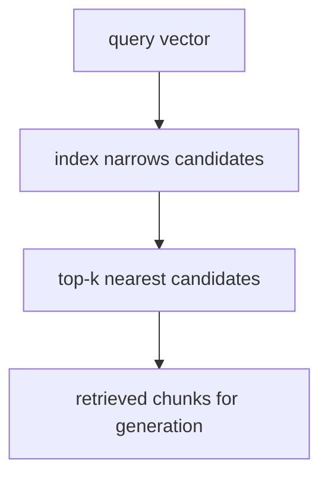

# P5-11.2 인덱스(index)와 검색 품질

P5-11.1에서는 벡터 데이터베이스가 임베딩 벡터와 원문, 메타데이터를 함께 저장하고 검색 단계에서 실무형 저장소 역할을 한다는 점을 보았습니다. 이제 질문은 더 구체적이 됩니다.

비슷한 벡터를 빠르게 찾는 일은 왜 어렵고, 무엇을 포기하거나 조정해야 하는가?

이 절은 그 질문에 답합니다.

인덱스(index)는 검색 속도를 높이기 위한 구조이며, 벡터 검색에서는 보통 속도와 정확도 사이의 균형을 함께 고민하게 만든다.

## 이 절의 범위

이 절은 다음 질문에 답합니다.

- 왜 벡터를 하나씩 모두 비교하지 않는가?
- 인덱스는 검색에서 어떤 역할을 하는가?
- 검색 속도와 검색 품질은 왜 함께 조정해야 하는가?

이 절에서는 다음 내용을 깊게 다루지 않습니다.

- HNSW, IVF, PQ 수학 세부
- 특정 엔진 파라미터 튜닝
- 대규모 분산 검색 아키텍처

이 절은 인덱스를 `근사 검색을 위한 구조`로 읽는 데 집중하고, 이후 서비스 안에서 검색 외부 기능이 어떻게 확장되는지는 P5-12.1 도구 사용으로 이어집니다. 엔진별 수학과 분산 검색 아키텍처의 세부 구현은 현재 본편 범위 밖으로 둡니다.

이 절의 목적은 인덱스를 단순한 내부 기술명으로 넘기지 않고, `빠른 검색을 위해 근사(approximation)를 허용하는 구조`라는 점을 이해하게 하는 데 있습니다.

## 이 절의 목표

- 인덱스의 역할을 입문 수준에서 설명할 수 있습니다.
- 정확히 찾는 검색과 빠르게 찾는 검색의 차이를 말할 수 있습니다.
- 벡터 검색 품질을 속도와 분리해서 볼 수 없다는 점을 설명할 수 있습니다.
- 다음 장의 도구 사용과 서비스 구조 설명으로 이어질 준비를 할 수 있습니다.

## 왜 모든 벡터를 다 비교하지 않나

가장 단순한 방법은 질문 벡터와 저장된 모든 벡터를 하나씩 비교하는 것입니다. 하지만 문서 수가 많아지면 이 방식은 매우 느려질 수 있습니다.

예를 들어:

- 문서가 수백 개면 가능할 수 있지만
- 문서가 수십만, 수백만 개면
- 모든 벡터를 매번 다 비교하는 비용이 커집니다

그래서 실무에서는 `정확히 다 비교하는 방법` 대신 `가까울 것 같은 후보를 빠르게 좁히는 방법`이 중요해집니다. 이때 인덱스가 등장합니다.

## 인덱스는 무엇을 하나

인덱스를 다음처럼 이해하면 충분합니다.

`인덱스는 전체를 처음부터 끝까지 다 보지 않고, 가까울 가능성이 높은 후보를 더 빨리 찾도록 돕는 탐색 구조다.`

즉, 인덱스는 검색 속도를 높이기 위한 `길 찾기 구조`에 가깝습니다.

이 점은 일반 데이터베이스 인덱스와도 닮아 있지만, 벡터 검색에서는 `의미가 가까운 항목`을 찾기 위한 방식이라는 점이 다릅니다.

## 왜 속도와 정확도가 함께 걸리나

여기서 중요한 개념이 `근사 검색(approximate search)`입니다.

벡터 검색에서는 보통:

- 아주 정확하지만 느린 방식
- 조금 덜 정확할 수 있지만 빠른 방식

사이에서 균형을 잡습니다.

다음처럼 기억하면 좋습니다.

`벡터 검색 인덱스는 보통 가장 완벽한 답 하나를 항상 찾는 구조보다, 충분히 좋은 후보를 빠르게 찾는 구조에 가깝다.`

## 검색 품질은 무엇으로 흔들리나

검색 품질은 단순히 인덱스 종류만으로 정해지지 않습니다. 다음 요소가 함께 영향을 줍니다.

- 임베딩 품질
- 문서 조각(chunk) 크기
- 메타데이터 필터
- 인덱스 설정
- top-k 개수

즉, 검색 품질 문제는 `저장 구조`, `문서 준비`, `검색 전략`이 함께 만드는 문제입니다.

## 왜 RAG 품질과 직접 연결되나

RAG는 검색 결과를 생성에 붙입니다. 따라서 검색 품질이 낮으면 생성은 잘해도 시작점이 흔들립니다.

예를 들어:

- 관련 없는 문서를 가져오면 답이 엉뚱해지고
- 덜 중요한 문서가 먼저 오면 핵심이 빠질 수 있으며
- 오래된 문서가 섞이면 최신성 문제가 다시 생길 수 있습니다

즉, 벡터 검색 품질은 곧 RAG 답변 품질의 상한을 결정하는 요소 중 하나입니다.

## 아주 단순하게 그리면



이 도식의 핵심은 인덱스가 `답변 생성`을 직접 하는 것이 아니라, `검색 후보를 빠르게 좁히는 역할`을 한다는 점입니다.

## 사례로 보기

### 사례 1. 사내 문서 검색 속도

사내 위키 문서가 수백 개일 때는 검색이 빨랐는데, 수만 개로 늘자 갑자기 느려졌다고 해 봅시다. 사람은 처음에는 `검색이 조금 늦네` 정도로만 느끼기 쉽습니다. 하지만 운영 단계에서는 답변 지연이 곧 사용자 이탈로 이어집니다. 예를 들어 휴가 규정 질문 하나에 후보 문서를 고르는 데 4초가 더 걸리면, 뒤 생성 단계가 같아도 사용자는 챗봇 전체가 느리다고 느끼게 됩니다. 이 시점부터 문제는 단순히 문서가 많아졌다는 사실이 아니라, 많은 문서 중 후보를 얼마나 빨리 줄일 수 있는가입니다. 인덱스 구조와 검색 전략은 바로 이 후보 압축 속도를 바꾸는 핵심 장치가 됩니다. 그래서 검색 속도 사례는 인덱스가 왜 운영 문제로 올라오는지 보여 줍니다.

### 사례 2. 매뉴얼 답변 품질

제품 매뉴얼에서 정확한 설정 문단 하나를 찾아야 하는데, 검색을 너무 빠르게 만들려고 근사 설정을 강하게 준다고 해 봅시다. 사람은 응답 시간이 빨라지면 검색이 더 좋아졌다고 느끼기 쉽습니다. 하지만 그러면 응답 시간은 줄어들 수 있어도, 정작 가장 중요한 문단이 후보에서 빠져 답변 품질이 바로 흔들릴 수 있습니다. 예를 들어 `자동 저장 끄기` 질문에 설정 개요 문단만 잡히고 실제 메뉴 경로 문단이 빠지면, 답변은 `설정에서 바꾸세요` 수준으로 끝나 실제 사용자는 여전히 버튼 위치를 찾지 못할 수 있습니다. 반대로 항상 가장 엄격한 검색만 쓰면 관련 문단은 잘 찾더라도 답이 너무 늦어집니다. 즉, 운영자는 `빨라졌는가`만이 아니라 `빠르게 찾은 후보가 충분히 좋은가`를 함께 봐야 합니다. 이 사례는 인덱스 설정이 속도와 품질 사이의 선택 문제라는 점을 보여 줍니다.

### 사례 3. 개발 문서 도우미

개발 문서 도우미가 비슷한 이름의 API 문서를 여러 개 가진 상태라고 해 봅시다. 사람은 최종 답만 보면 보통 `모델이 코드를 잘못 설명했다`고 먼저 느낍니다. 하지만 top-k 결과에 현재 버전 문서 대신 예전 버전 문서가 섞이면, 생성 단계는 그 후보를 바탕으로 꽤 자연스러운 답을 만들 수 있습니다. 예를 들어 2.x 버전 옵션을 묻는 질문에 1.x 문서가 후보 상단에 들어오면, 답변은 매끄러워도 바로 실행하면 에러가 나는 코드 예시가 나올 수 있습니다. 즉, 실제 시작점은 `후보 문서 묶음이 이미 어긋난 것`일 수 있습니다. 그래서 이 장면에서는 생성 평가와 별도로 검색 품질 평가가 필요합니다. 이 사례는 top-k 후보 자체를 따로 점검해야 하는 이유를 분명하게 보여 줍니다.

## 작은 Python 예제로 보기

이번 예제의 목표는 인덱스 구현이 아니라, `속도`와 `품질`을 함께 읽는 감각을 만드는 것입니다.

입력:

- 두 가지 검색 설정

출력:

- 속도와 품질 비교

```python
search_fast = {"latency_ms": 25, "recall_like_score": 0.82}
search_strict = {"latency_ms": 90, "recall_like_score": 0.93}

print("search_fast =", search_fast)
print("search_strict =", search_strict)
print("observation = faster search may return less complete candidates")
```

실행 결과 예시는 다음처럼 읽을 수 있습니다.

```text
search_fast = {'latency_ms': 25, 'recall_like_score': 0.82}
search_strict = {'latency_ms': 90, 'recall_like_score': 0.93}
observation = faster search may return less complete candidates
```

이 예제는 실제 엔진 성능을 주장하는 것이 아닙니다. 다만 독자가 `검색 속도`와 `검색 품질`을 함께 읽어야 한다는 점을 기억하게 해 줍니다.

## 역사와 커리큘럼 관점

벡터 검색이 널리 쓰이면서, 검색 문제는 다시 `자료구조와 알고리즘`의 감각으로 돌아왔습니다. 하지만 LLM 서비스 문맥에서는 이것이 단순한 검색 엔진 문제가 아니라, 생성 품질과 사용자 경험에 직접 연결된다는 점이 더 중요합니다.

커리큘럼 관점에서 이 절이 중요한 이유는 다음과 같습니다.

- 벡터 데이터베이스를 단순 저장소가 아니라 탐색 구조와 함께 읽게 하고
- 이후 평가 장에서 검색 지표를 왜 별도로 봐야 하는지 준비시키며
- 서비스 구조에서 속도, 비용, 품질이 함께 얽힌다는 관점을 강화하기 때문입니다

## 다음 장과의 연결

여기까지 오면 다음 질문이 남습니다.

- 검색된 정보를 넘어서, 모델이 외부 기능을 직접 호출해야 하는 경우는 무엇인가?
- 문서 검색과 도구 사용은 어떻게 다른가?

이 질문은 P5-12.1 도구 사용(tool use)으로 이어집니다.

## 이 절에서 기억할 관점

- 인덱스는 검색 속도를 높이기 위한 탐색 구조입니다.
- 벡터 검색에서는 속도와 정확도 사이의 균형을 함께 고민합니다.
- 검색 품질은 인덱스뿐 아니라 임베딩, chunking, 메타데이터 전략에도 영향을 받습니다.
- RAG 답변 품질은 검색 품질과 직접 연결됩니다.

## 체크리스트

- 인덱스의 역할을 입문 수준에서 설명할 수 있는가?
- 왜 모든 벡터를 다 비교하지 않는지 말할 수 있는가?
- 왜 속도와 검색 품질을 함께 봐야 하는지 설명할 수 있는가?
- 왜 다음 장에서 도구 사용을 따로 봐야 하는지 말할 수 있는가?

## 출처와 참고 자료

- 관련 ANN(approximate nearest neighbor) 교육 자료, 확인 날짜: 2026-06-29.
- 벡터 검색 엔진과 인덱스 구조 소개 자료, 확인 날짜: 2026-06-29.
- OpenAI, 임베딩 및 검색 관련 공식 문서, 확인 날짜: 2026-06-29.
