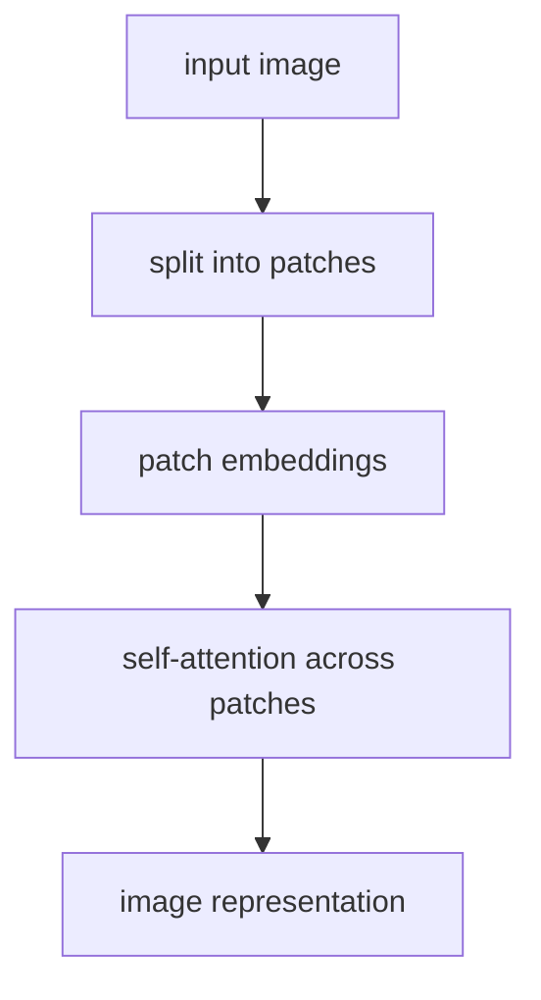

# P5-11.3 보충학습: 합성곱 신경망(CNN)과 비전 트랜스포머(ViT, Vision Transformer) 비교

Section ID: `P5-11.3`
Version: `v2026.07.07`

P5-11.1과 P5-11.2에서는 합성곱 신경망(CNN)이 왜 이미지와 잘 맞는지, 그리고 convolution과 pooling이 어떤 역할을 하는지를 먼저 보았습니다. 여기서 자연스럽게 다음 질문이 생깁니다.

합성곱 신경망 이후에 자주 언급되는 비전 트랜스포머(ViT, Vision Transformer)는 무엇이 다르며, 둘을 어떤 관점으로 비교하면 되는가?

비전 트랜스포머의 다른 출발 단위를 짧게 다시 확인해야 할 때는 개념사전의 [비전 트랜스포머(ViT, Vision Transformer)](../../../reference/concept-glossary.md#vit-vision-transformer) 항목을 기준으로 돌아옵니다.

## 이 보충학습의 범위

- 합성곱 신경망과 ViT는 이미지를 어떻게 읽기 시작하는가?
- 지역 패턴 중심 읽기와 토큰 관계 중심 읽기는 어떤 차이가 있는가?
- 입문 단계에서는 둘을 어떻게 비교하면 충분한가?

이 보충학습에서는 다음 내용을 깊게 다루지 않습니다.

- ViT의 전체 학습 레시피와 최신 변형 계보
- Swin Transformer, ConvNeXt 같은 세부 구조 비교
- vision benchmark 수치 중심의 최신 모델 경쟁

ViT의 self-attention 자체는 P5-13.2와 P5-14.1에서 다시 연결되고, 여기서는 이미지 관점에서 `지역 패턴을 먼저 읽는가`, `패치 관계를 먼저 읽는가`라는 출발 문제 차이까지만 정리합니다. 최신 비전 모델의 세부 계보와 성능 경쟁은 이 책의 현재 범위 밖에 둡니다.

## 이 보충학습의 목표

- CNN과 ViT가 이미지를 읽는 출발 단위를 비교해 설명할 수 있습니다.
- CNN의 지역 패턴 중심 읽기와 ViT의 patch 관계 중심 읽기를 구분할 수 있습니다.
- patch token과 self-attention이 이미지 해석에서 어떤 직관을 주는지 말할 수 있습니다.
- 뒤의 attention, Transformer 절과 이 보충학습이 어떻게 이어지는지 연결할 수 있습니다.

## 이 보충학습을 읽는 순서

1. 먼저 CNN에서 이미 익숙해진 `지역 패턴을 읽는다`는 출발점을 떠올립니다.
2. 그 다음 ViT가 이미지를 패치 토큰으로 나누고 attention으로 관계를 읽는다는 점을 비교합니다.
3. 마지막에 왜 이 비교가 `이미지 문제를 어떤 계산 단위와 어떤 관계 가정으로 풀기 시작하는가`라는 질문으로 읽혀야 하는지 정리합니다.

## 먼저 한 줄로 비교하면

| 구조 | 이미지를 읽는 첫 직관 |
| --- | --- |
| CNN | 작은 지역 패턴을 반복해서 읽는다 |
| ViT | 이미지를 패치(patch) 토큰으로 나누고, 토큰 사이 관계를 attention으로 읽는다 |

이 한 줄만 먼저 잡아도 입문 단계에서는 충분합니다.

## CNN은 무엇이 자연스러운가

CNN은 이미지에서 가까운 픽셀들이 함께 의미를 만든다는 점을 바로 구조에 반영합니다.

- edge, corner, texture 같은 작은 지역 단서를 먼저 읽고
- 그것을 더 큰 부분 구조로 쌓아 올리며
- 같은 필터를 여러 위치에 반복 적용합니다

그래서 CNN은 `이미지에는 지역 패턴이 중요하다`는 직관과 잘 맞습니다.

## ViT는 무엇이 다르게 느껴지는가

ViT는 이미지를 작은 패치 조각들로 나눈 뒤, 각 패치를 토큰처럼 다룹니다. 그리고 각 패치가 다른 패치와 어떤 관계를 가지는지를 attention으로 읽습니다.

여기서 먼저 풀어야 할 말은 `패치를 토큰처럼 다룬다`는 표현입니다. 언어 모델에서 토큰이 문장을 이루는 작은 단위이듯, ViT에서는 이미지도 작은 정사각형 조각들로 나누어 그 조각 하나하나를 계산의 기본 단위처럼 다룹니다.

즉, ViT는 `3x3 필터가 주변 픽셀을 훑는 방식`이 아니라, `이미지를 여러 칸으로 잘라 각 칸을 하나의 입력 단위로 두는 방식`으로 출발합니다.

즉, ViT는 이미지를 패치 단위 토큰으로 바꾸고, 패치 사이 관계를 attention으로 계산하는 구조입니다.

- 이미지를 여러 개의 작은 조각으로 나눈다
- 각 조각을 하나의 토큰처럼 본다
- 어떤 조각이 다른 조각과 함께 중요해지는지 attention으로 계산한다

이 흐름을 아주 단순하게 쓰면 다음과 같습니다.



이 도식은 이미지가 patch 관계 계산을 거쳐 표현으로 묶이는 순서를 압축합니다.

1. 이미지를 작은 조각으로 나눕니다.
2. 각 조각을 숫자 벡터 하나로 바꿉니다.
3. 각 조각이 다른 조각을 얼마나 참고할지 attention으로 계산합니다.
4. 그 결과를 합쳐 이미지 전체를 설명하는 표현으로 넘깁니다.

즉, ViT는 처음부터 `한 패치가 다른 패치와 어떤 관계를 맺는가`를 계산 흐름에 올려 둔 구조입니다.

이 흐름을 아주 단순한 표로 다시 쓰면 다음과 같습니다.

| 단계 | ViT에서 실제로 하는 일 |
| --- | --- |
| 1 | 이미지 한 장을 여러 patch로 자른다 |
| 2 | 각 patch를 숫자 벡터 하나로 바꾼다 |
| 3 | 각 patch가 다른 patch를 얼마나 참고해야 하는지 attention으로 계산한다 |
| 4 | 여러 patch 관계를 합쳐 최종 판단에 쓸 표현을 만든다 |

아주 단순한 4칸 그림으로 생각하면 다음과 같습니다.

| 단계 | 입문용 직관 |
| --- | --- |
| 원본 이미지 | 자동차가 들어 있는 한 장의 사진 |
| 패치 분할 | 사진을 4개나 16개의 작은 타일로 나눈다 |
| 패치 토큰 | 각 타일을 숫자 벡터 하나처럼 바꿔 읽기 시작한다 |
| attention | 바퀴가 있는 타일과 차체가 있는 타일이 함께 중요해지는지 본다 |

즉, ViT는 처음부터 `픽셀 바로 옆의 관계`만 먼저 강하게 가정하기보다, `이 조각과 저 조각이 서로 얼마나 관련 있는가`를 더 직접적으로 묻는 구조입니다.

CNN이 `가까운 곳에서 시작해 큰 구조로 올라가는 느낌`이라면, ViT는 `조각들 사이의 관계를 더 직접적으로 읽는 느낌`에 가깝습니다.

`CNN은 지역 패턴을 쌓아 올라가고, ViT는 패치 토큰 사이 관계를 바로 읽으려 한다.`

## 패치를 나눈다는 말은 왜 중요한가

ViT를 처음 읽을 때 가장 헷갈리는 지점은 `왜 굳이 이미지를 조각으로 잘라야 하지?`라는 질문입니다.

핵심은 attention이 `입력 단위들 사이의 관계`를 계산하는 구조라는 점입니다. 문장에서는 그 입력 단위가 토큰이고, 이미지에서는 그 역할을 patch가 맡습니다.

- 문장에서는 단어 조각들이 서로 관계를 맺습니다.
- ViT에서는 이미지 조각들이 서로 관계를 맺습니다.

즉, patch는 단순한 전처리 꼼수가 아니라, `이미지에서도 attention이 읽을 기본 단위가 필요하다`는 요구에 대한 답입니다.

핵심은 patch가 이미지의 작은 구역을 attention이 읽을 수 있는 기본 단위 벡터로 바꾸는 출발점이라는 점입니다.

- patch 하나는 이미지의 작은 정사각형 구역입니다.
- patch 하나는 나중에 숫자 벡터 하나가 됩니다.
- attention은 이 patch 벡터들이 서로 얼마나 관련 있는지 계산합니다.

여기서 patch를 너무 작게 자르면 계산량이 커지고, 너무 크게 자르면 작은 지역 정보가 뭉개질 수 있습니다. 이런 설계 선택과 학습 레시피는 ViT 세부 구현 주제이므로 이 절에서는 다루지 않고, 현재는 `ViT는 patch를 입력 단위로 삼는다`는 점만 확실히 잡으면 충분합니다.

이 말을 CNN과 대비해 다시 읽으면 차이가 더 분명해집니다.

- CNN에서는 작은 필터가 `픽셀 근처`를 훑으며 반응을 만듭니다.
- ViT에서는 잘라 둔 patch가 `처음부터 하나의 읽기 단위`가 됩니다.

즉, CNN의 첫 질문이 `이 근처에 edge나 texture가 있나?`에 가깝다면, ViT의 첫 질문은 `이 패치가 다른 패치와 어떤 관계를 맺나?`에 더 가깝습니다.

## CNN과 ViT의 출발 단위를 나란히 보면

| 질문 | CNN | ViT |
| --- | --- | --- |
| 처음 계산이 닿는 단위 | 작은 receptive field | 잘라 놓은 patch |
| 처음 강조하는 것 | 가까운 픽셀의 지역 패턴 | patch와 patch 사이 관계 |
| 층이 깊어질 때 기대하는 변화 | 더 큰 부분 구조를 읽음 | 더 넓은 patch 관계를 읽음 |

## 장면으로 비교해 보면

자동차 이미지를 분류한다고 해 보겠습니다. 사람은 처음에는 바퀴, 창문, 차체 윤곽 같은 부분을 먼저 떠올립니다.

- CNN 관점에서는 바퀴 경계, 창문 모서리, 차체 질감 같은 지역 단서가 먼저 잡히고, 그것이 쌓여 자동차 표현으로 이어집니다.
- ViT 관점에서는 왼쪽 아래 패치의 둥근 바퀴 단서와 위쪽 패치의 창문 단서, 가운데 패치의 차체 단서가 서로 어떤 관계를 이루는지 더 직접적으로 읽는다고 생각할 수 있습니다.

즉, 같은 자동차 장면을 보더라도:

- CNN은 `부분 패턴을 층층이 쌓아 가는 구조`
- ViT는 `패치들 사이의 관계를 attention으로 읽는 구조`

처럼 `부분 패턴 누적`과 `패치 관계 해석`의 출발 차이로 비교할 수 있습니다.

즉, 비교의 핵심은 `가까운 지역 단서`와 `패치 사이 관계` 중 무엇을 먼저 세우느냐입니다.

- CNN은 먼저 `바퀴 경계`, `창문 모서리`, `차체 질감` 같은 가까운 단서를 읽습니다.
- ViT는 `왼쪽 아래 패치`, `가운데 패치`, `위쪽 패치`가 함께 자동차를 이루는지 관계를 더 직접적으로 따집니다.

같은 말을 더 짧은 장면으로 다시 써 보면 다음과 같습니다.

| 질문 | CNN이 먼저 보는 것 | ViT가 먼저 세우는 것 |
| --- | --- | --- |
| 말 사진에서 다리와 몸통을 읽을 때 | 다리 경계, 털 질감, 몸통 윤곽 같은 지역 반응 | 다리가 있는 패치와 몸통이 있는 패치가 함께 말을 이루는지 |
| 자동차 사진에서 바퀴와 창문을 읽을 때 | 둥근 바퀴 경계, 창문 모서리 같은 부분 반응 | 바퀴 패치와 창문 패치, 차체 패치의 관련성 |

이 비교에서 중요한 것은 `CNN은 부분을 본다`, `ViT는 전체를 본다`처럼 단순하게 갈라버리는 일이 아닙니다. 둘 다 결국 이미지 전체 판단으로 가지만, 출발 직관이 `지역 패턴 중심`이냐 `패치 관계 중심`이냐에서 차이가 납니다.

## 실행 가능한 Python 예제로 보기

이번 예제의 목표는 `같은 작은 이미지도 CNN은 겹치는 지역 패치 흐름으로 읽고, ViT는 큰 patch token 흐름으로 읽는다`는 점을 눈으로 확인하는 것입니다. 실제 학습 모델 전체를 구현하지는 않지만, 같은 입력이 두 구조에서 어떤 계산 단위로 바뀌는지는 직접 볼 수 있습니다.

문제 상황:

- 같은 이미지라도 CNN과 ViT는 입력을 자르는 단위와 관계를 보는 출발점이 다르다

입력:

- 4x4 장난감 이미지
- CNN이 읽는 2x2 지역 패치
- ViT가 읽는 2x2 patch token

출력:

- CNN 방식의 겹치는 지역 패치 목록
- ViT 방식의 비겹침 patch token 목록
- 각 patch를 펼친 벡터와 간단한 patch embedding 값

확인할 개념:

- CNN은 겹치는 지역 패치를 따라 부분 구조를 먼저 읽는다
- ViT는 비겹침 patch token을 만들어 조각 사이 관계를 다루는 쪽에서 출발한다
- 같은 입력이라도 어떤 계산 단위로 바꾸느냐에 따라 이후 모델 구조 해석이 달라진다

입력(input):

위에 정리한 4x4 장난감 이미지와 CNN·ViT 방식의 패치 분할 규칙을 사용합니다.

```python
import numpy as np

image = np.array([
    [0, 1, 1, 0],
    [0, 1, 1, 0],
    [2, 2, 0, 0],
    [2, 2, 0, 0],
], dtype=float)


def cnn_local_patches(image, kernel_size=2, stride=1):
    patches = []
    for i in range(0, image.shape[0] - kernel_size + 1, stride):
        for j in range(0, image.shape[1] - kernel_size + 1, stride):
            patch = image[i:i + kernel_size, j:j + kernel_size]
            patches.append(((i, j), patch.copy()))
    return patches


def vit_patch_tokens(image, patch_size=2):
    tokens = []
    for i in range(0, image.shape[0], patch_size):
        for j in range(0, image.shape[1], patch_size):
            patch = image[i:i + patch_size, j:j + patch_size]
            flat = patch.flatten()
            tokens.append(((i, j), patch.copy(), flat))
    return tokens


embedding_weight = np.array([0.5, 0.2, 0.7, 0.1])

cnn_patches = cnn_local_patches(image, kernel_size=2, stride=1)
vit_tokens = vit_patch_tokens(image, patch_size=2)

print("[cnn local patches]")
for position, patch in cnn_patches:
    print("position =", position)
    print(patch)

print("[vit patch tokens]")
for position, patch, flat in vit_tokens:
    embedding_value = round(float(flat @ embedding_weight), 2)
    print("position =", position)
    print(patch)
    print("flat_token =", flat.tolist())
    print("patch_embedding =", embedding_value)
```

출력에서는 CNN의 겹치는 local patch들과 ViT의 patch token 구성이 어떻게 달라지는지부터 보면 됩니다.

```text
[cnn local patches]
position = (0, 0)
[[0. 1.]
 [0. 1.]]
position = (0, 1)
[[1. 1.]
 [1. 1.]]
position = (0, 2)
[[1. 0.]
 [1. 0.]]
position = (1, 0)
[[0. 1.]
 [2. 2.]]
position = (1, 1)
[[1. 1.]
 [2. 0.]]
position = (1, 2)
[[1. 0.]
 [0. 0.]]
position = (2, 0)
[[2. 2.]
 [2. 2.]]
position = (2, 1)
[[2. 0.]
 [2. 0.]]
position = (2, 2)
[[0. 0.]
 [0. 0.]]
[vit patch tokens]
position = (0, 0)
[[0. 1.]
 [0. 1.]]
flat_token = [0.0, 1.0, 0.0, 1.0]
patch_embedding = 0.3
position = (0, 2)
[[1. 0.]
 [1. 0.]]
flat_token = [1.0, 0.0, 1.0, 0.0]
patch_embedding = 1.2
position = (2, 0)
[[2. 2.]
 [2. 2.]]
flat_token = [2.0, 2.0, 2.0, 2.0]
patch_embedding = 3.0
position = (2, 2)
[[0. 0.]
 [0. 0.]]
flat_token = [0.0, 0.0, 0.0, 0.0]
patch_embedding = 0.0
```

같은 이미지를 보더라도 어디서부터 표현을 만들기 시작하는지가 다르기 때문에, 뒤에서 attention과 patch embedding을 읽을 때도 `무엇을 토큰처럼 취급하는가`를 함께 봐야 합니다.

| 먼저 볼 출력 | 이 출력이 뜻하는 것 | 바꿔 보면 달라지는 것 |
| --- | --- | --- |
| CNN 패치 개수와 ViT patch token 개수 | 같은 입력도 출발 계산 단위가 다르다는 뜻 | `stride`, `patch_size`, 이미지 크기를 바꾸면 단위 수와 겹침 정도가 달라집니다 |
| CNN의 `(0, 0)`, `(0, 1)` 패치가 서로 겹친다 | CNN은 겹치는 지역 창을 촘촘히 훑으며 인접 위치 차이를 계속 읽는다는 뜻 | `stride`를 2로 바꾸면 겹침이 줄고 지역 반응 개수도 함께 줄어듭니다 |
| ViT의 `flat_token`과 `patch_embedding`이 patch마다 하나씩 나온다 | ViT는 patch를 잘라 벡터 하나로 바꾼 뒤 그 벡터들을 토큰처럼 다룬다는 뜻 | `patch_size`를 더 작게 하면 token 수가 늘고, 더 크게 하면 token 수가 줄어듭니다 |

즉, CNN은 겹치며 이동하는 지역 창에서 출발하고, ViT는 잘라 놓은 patch token에서 출발한 뒤 그 관계를 attention으로 읽는다는 점이 이 비교의 핵심입니다.

이 예제에서는 `image` 크기를 8x8로 늘리거나 `patch_size`, `stride`를 바꿔 볼 수 있습니다. 그러면 독자는 단순히 `CNN은 부분, ViT는 패치`라는 문장을 외우는 대신, 같은 입력이 `몇 개의 겹치는 지역 반응`과 `몇 개의 patch token`으로 바뀌는지 직접 비교해 볼 수 있습니다.

| 먼저 보인 출력 신호 | 지금 바로 해 볼 변화 | 아직 이 예제만으로 서두르지 않을 결론 |
| --- | --- | --- |
| CNN은 9개의 겹치는 패치를 만든다 | `stride`를 1과 2로 바꿔 겹침 정도와 패치 수가 어떻게 달라지는지 본다 | 겹치는 패치가 많다고 해서 곧바로 항상 더 좋은 이미지 이해라고 단정하지 않는다 |
| ViT는 4개의 patch token으로 시작한다 | `patch_size`를 더 작게 하거나 크게 해 token 수가 어떻게 바뀌는지 본다 | token 수가 많다고 해서 곧바로 항상 더 좋은 attention 결과가 나온다고 단정하지 않는다 |
| patch마다 `patch_embedding`이 하나씩 나온다 | embedding weight나 patch 값을 바꿔 어떤 patch가 더 큰 token 표현을 만드는지 본다 | 장난감 patch embedding 예제 하나로 실제 ViT 전체 성능과 inductive bias 차이를 모두 결론내리지 않는다 |

## self-attention과는 어떻게 연결되나

ViT를 이미지용 Transformer처럼 이해하려면, `패치를 토큰처럼 본다`는 말 다음에 `그래서 self-attention을 쓸 수 있다`는 연결이 보여야 합니다.

- 문장에서는 토큰들이 서로를 참고합니다.
- ViT에서는 patch 토큰들이 서로를 참고합니다.
- 그래서 이미지에서도 self-attention을 적용할 수 있습니다.

즉, ViT는 `attention이 원래 언어에서 쓰이던 방식이 이미지를 읽는 문제에도 옮겨 올 수 있다`는 사례로 볼 수 있습니다.

다만 self-attention의 계산식과 Q, K, V 전개는 여기서 처음 다루지 않습니다. 그 핵심 구조는 P5-13.2에서 다시 정리하고, Transformer 전체 흐름은 P5-14.1에서 회수합니다.

## 입문 단계에서 무엇을 기억하면 되나

다음 표 정도로 기억하면 충분합니다.

| 질문 | CNN | ViT |
| --- | --- | --- |
| 처음 무엇을 강조하나 | 지역 패턴 | 패치 토큰 관계 |
| 핵심 계산 직관 | convolution + pooling | self-attention |
| 이미지 설명의 느낌 | 작은 부분에서 큰 구조로 올라감 | 여러 패치 사이 관련성을 직접 읽음 |

| 추가 질문 | CNN | ViT |
| --- | --- | --- |
| 처음 잘라 보는 단위 | 작은 receptive field | 잘라 놓은 patch token |

## Part 5 흐름에서 왜 중요한가

이 보충학습이 필요한 이유는 Part 5 뒤쪽에서 attention과 Transformer를 배우게 되기 때문입니다.

- P5-11에서는 이미지에서 CNN이 왜 자연스러운지 먼저 잡고
- P5-13, P5-14에서는 attention과 Transformer가 왜 전환점이 되었는지 배우며
- 그 뒤에야 `이미지에서도 attention 계열 구조가 쓰일 수 있겠구나`라는 연결이 더 자연스럽게 보입니다

즉, 이 보충학습은 CNN을 지운 뒤 ViT로 바로 넘어가려는 문서가 아니라, `이미지용 지역 패턴 구조`와 `토큰 관계 구조`가 서로 다른 문제 설정에서 출발한다는 점을 미리 정리해 두는 자리입니다.

여기서 한 번 멈추고, `언제 CNN 본문 설명만으로는 부족하고 ViT 비교 관점을 따로 꺼내야 하는가`를 짧게 고정해 두면 뒤 attention, Transformer 절과의 연결이 더 안정적입니다.

| 먼저 떠올릴 질문 | CNN-vs-ViT 비교 관점이 먼저 필요한 이유 | 뒤 절에서 이어질 것 |
| --- | --- | --- |
| 왜 이미지 attention 구조가 갑자기 등장해도 완전히 낯설지 않은가 | 패치 토큰과 관계 읽기라는 출발 차이를 미리 잡아 두면 이미지 문맥에서도 attention을 연결해 읽을 수 있기 때문 | self-attention과 Transformer의 일반 계산 구조 |
| 왜 CNN과 ViT를 단순 구형/신형 비교로 읽으면 안 되는가 | 둘은 이미지를 읽는 첫 계산 단위와 관계 가정이 다르기 때문 | attention 기반 vision 구조를 어떤 질문으로 읽을지 |
| 왜 patch라는 말이 중요해지는가 | 이미지에서도 토큰처럼 취급할 기본 단위가 있어야 attention 구조를 적용할 수 있기 때문 | patch token, self-attention, image transformer 확장 |

## 이 보충학습에서 기억할 관점

- CNN은 지역 패턴을 반복해서 읽는 이미지 구조이고 ViT는 이미지 패치를 토큰처럼 본 뒤 패치 사이 관계를 attention으로 읽는 구조이며, 둘의 차이는 `부분 패턴 중심`과 `토큰 관계 중심`의 출발 직관 차이로 먼저 이해하면 충분합니다.

## 짧은 점검

- CNN과 ViT를 `부분 패턴 중심`과 `패치 관계 중심`의 출발 차이로 설명할 수 있는가?
- patch를 단순 전처리가 아니라 `이미지에서 attention이 읽을 기본 단위`로 설명할 수 있는가?
- 뒤의 attention 절을 읽을 때도 먼저 `이미지 조각도 토큰처럼 관계를 맺을 수 있는가`를 떠올릴 준비가 되어 있는가?

## 언제 이 관점을 먼저 떠올려야 하는가

- CNN 설명만으로는 이미지 attention 구조 연결이 낯설게 느껴질 때, CNN-vs-ViT 비교 관점을 먼저 떠올립니다.
- patch가 왜 중요한지 설명해야 할 때, 이미지에서도 토큰처럼 읽을 기본 단위가 필요하다는 점을 다시 봅니다.
- CNN과 ViT를 구형/신형 비교로만 읽으려 할 때, 지역 패턴 중심과 패치 관계 중심의 출발 차이를 다시 꺼냅니다.

## 체크리스트

- CNN과 ViT가 이미지를 읽기 시작하는 단위가 어떻게 다른지 설명할 수 있는가?
- 지역 패턴 출발과 토큰/패치 출발의 차이를 입문 수준에서 말할 수 있는가?

## 출처와 참고 자료

- Alexey Dosovitskiy et al., `An Image is Worth 16x16 Words: Transformers for Image Recognition at Scale`, ICLR 2021, 확인 날짜: 2026-06-30.
- Ashish Vaswani et al., `Attention Is All You Need`, NeurIPS 2017, 확인 날짜: 2026-06-30.
- Ian Goodfellow, Yoshua Bengio, Aaron Courville, `Deep Learning`, MIT Press, 2016, 확인 날짜: 2026-06-30. [https://www.deeplearningbook.org/](https://www.deeplearningbook.org/){: target="_blank" rel="noopener noreferrer" }
