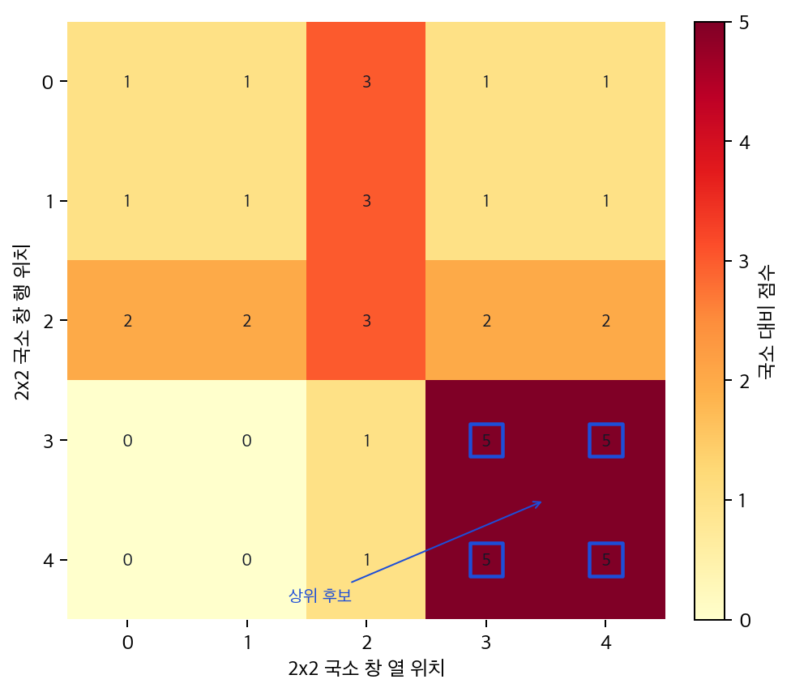
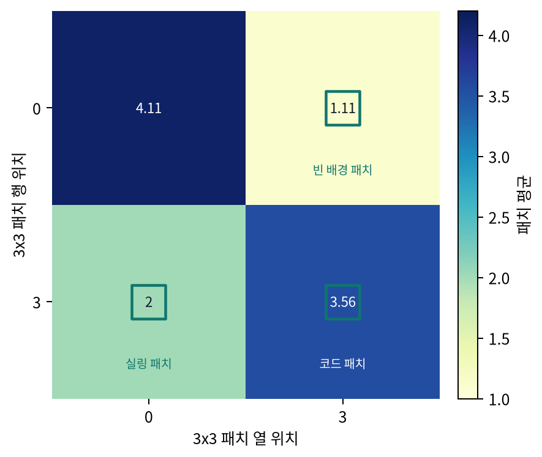

# P5-11.3 보충학습: 합성곱 신경망(CNN)과 비전 트랜스포머(ViT, Vision Transformer) 비교

> Section ID: `P5-11.3`
> Version: `v2026.07.20`

P5-11.1과 P5-11.2에서는 합성곱 신경망(CNN)이 왜 이미지와 잘 맞는지, 그리고 convolution과 pooling이 어떤 역할을 하는지를 먼저 보았습니다. 여기서 자연스럽게 다음 질문이 생깁니다.

합성곱 신경망 이후에 자주 언급되는 비전 트랜스포머(ViT, Vision Transformer)는 무엇이 다르며, 이 차이를 왜 나중의 생성형 AI와 멀티모달 모델을 이해하기 전에 알아두면 좋은가?

비전 트랜스포머의 다른 출발 단위를 짧게 다시 확인해야 할 때는 개념사전의 [비전 트랜스포머(ViT, Vision Transformer)](../../../reference/concept-glossary.md#vit-vision-transformer) 항목을 기준으로 돌아옵니다.

## CNN과 ViT를 가르는 입력 단위

- 합성곱 신경망과 ViT는 이미지를 어떻게 읽기 시작하는가?
- 지역 패턴 중심 읽기와 토큰 관계 중심 읽기는 어떤 차이가 있는가?
- 이 차이가 왜 뒤의 attention, Transformer, 생성형 AI 이해의 준비가 되는가?

이 보충학습에서는 CNN과 ViT를 `이미지를 어떤 계산 단위로 읽기 시작하는가`라는 질문으로 비교합니다. 목적은 모델 계보를 길게 설명하는 데 있지 않고, 이미지도 나중에는 `토큰처럼 잘린 입력`과 `관계 계산`의 관점으로 읽히게 된다는 점을 미리 붙잡는 데 있습니다.

ViT의 self-attention 자체는 P5-13.2와 P5-14.1에서 다시 연결합니다. 여기서는 이미지 관점에서 `지역 패턴을 먼저 읽는가`, `패치 관계를 먼저 읽는가`라는 출발 차이와, 그 차이가 생성형 AI로 넘어갈 때 왜 유용한지만 정리합니다.

## 지역 패턴과 패치 관계의 구분

- CNN과 ViT가 이미지를 읽는 출발 단위를 비교해 설명할 수 있습니다.
- CNN의 지역 패턴 중심 읽기와 ViT의 패치 관계 중심 읽기를 구분할 수 있습니다.
- 패치 토큰과 self-attention이 이미지 해석에서 어떤 직관을 주는지 말할 수 있습니다.
- 뒤의 attention, Transformer, 생성형 AI 관련 절에서 왜 `입력을 토큰처럼 다룬다`는 관점이 반복되는지 연결할 수 있습니다.

## CNN 직관에서 ViT 직관으로

1. 먼저 CNN에서 이미 익숙해진 `지역 패턴을 읽는다`는 출발점을 떠올립니다.
2. 그 다음 ViT가 이미지를 패치 토큰으로 나누고 attention으로 관계를 읽는다는 점을 비교합니다.
3. 마지막에 이 비교가 왜 뒤의 Transformer 계열 모델과 생성형 AI 입력 해석의 준비가 되는지 정리합니다.

## 먼저 한 줄로 비교하면

| 구조 | 이미지를 읽는 첫 직관 |
| --- | --- |
| CNN | 작은 지역 패턴을 반복해서 읽는다 |
| ViT | 이미지를 패치 토큰으로 나누고, 토큰 사이 관계를 attention으로 읽는다 |

이 한 줄은 뒤에서 `이미지도 토큰처럼 다룰 수 있나?`라는 질문이 나왔을 때 다시 돌아올 기준이 됩니다.

## CNN은 무엇이 자연스러운가

CNN은 이미지에서 가까운 픽셀들이 함께 의미를 만든다는 점을 바로 구조에 반영합니다.

- edge, corner, texture 같은 작은 지역 단서를 먼저 읽고
- 그것을 더 큰 부분 구조로 쌓아 올리며
- 같은 필터를 여러 위치에 반복 적용합니다

그래서 CNN은 `이미지에는 지역 패턴이 중요하다`는 직관과 잘 맞습니다.

## ViT는 무엇이 다르게 느껴지는가

ViT는 이미지를 작은 패치 조각들로 나눈 뒤, 각 패치를 토큰처럼 다룹니다. 그리고 각 패치가 다른 패치와 어떤 관계를 가지는지를 attention으로 읽습니다.

여기서 먼저 풀어야 할 말은 `패치를 토큰처럼 다룬다`는 표현입니다. 언어 모델에서 토큰이 문장을 이루는 작은 단위이듯, ViT에서는 이미지도 작은 정사각형 조각들로 나누어 그 조각 하나하나를 계산의 기본 단위처럼 다룹니다.

즉, ViT는 `3x3 필터가 주변 픽셀을 훑는 방식`이 아니라, `이미지를 여러 칸으로 잘라 각 칸을 하나의 입력 단위로 두는 방식`으로 출발합니다.

즉, ViT는 이미지를 패치 단위 토큰으로 바꾸고, 패치 사이 관계를 attention으로 계산하는 구조입니다.

- 이미지를 여러 개의 작은 조각으로 나눈다
- 각 조각을 하나의 토큰처럼 본다
- 어떤 조각이 다른 조각과 함께 중요해지는지 attention으로 계산한다

이 흐름을 아주 단순하게 쓰면 다음과 같습니다.

```mermaid
--8<-- "assets/part-05/chapter-11/vit-patch-flow-ko.mmd"
```

이 도식은 이미지가 패치 관계 계산을 거쳐 표현으로 묶이는 순서를 압축합니다.

1. 이미지를 작은 조각으로 나눕니다.
2. 각 조각을 숫자 벡터 하나로 바꿉니다.
3. 각 조각이 다른 조각을 얼마나 참고할지 attention으로 계산합니다.
4. 그 결과를 합쳐 이미지 전체를 설명하는 표현으로 넘깁니다.

즉, ViT는 처음부터 `한 패치가 다른 패치와 어떤 관계를 맺는가`를 계산 흐름에 올려 둔 구조입니다.

아주 단순한 4칸 그림으로 생각하면 다음과 같습니다.

| 단계 | 입문용 직관 |
| --- | --- |
| 원본 이미지 | 탱크와 밸브가 함께 보이는 설비 사진 한 장 |
| 패치 분할 | 사진을 4개나 16개의 작은 타일로 나눈다 |
| 패치 토큰 | 각 타일을 숫자 벡터 하나처럼 바꿔 읽기 시작한다 |
| attention | 밸브가 있는 타일과 탱크 몸체 타일이 함께 중요해지는지 본다 |

즉, ViT는 처음부터 `픽셀 바로 옆의 관계`만 먼저 강하게 가정하기보다, `이 조각과 저 조각이 서로 얼마나 관련 있는가`를 더 직접적으로 묻는 구조입니다. 이 점이 뒤에서 Transformer 계열 생성형 모델을 읽을 때도 낯설지 않게 연결됩니다.

CNN이 `가까운 곳에서 시작해 큰 구조로 올라가는 느낌`이라면, ViT는 `조각들 사이의 관계를 더 직접적으로 읽는 느낌`에 가깝습니다.

`CNN은 지역 패턴을 쌓아 올라가고, ViT는 패치 토큰 사이 관계를 바로 읽으려 한다.`

## 패치를 나눈다는 말은 왜 중요한가

ViT를 처음 읽을 때 가장 헷갈리는 지점은 `왜 굳이 이미지를 조각으로 잘라야 하지?`라는 질문입니다.

핵심은 attention이 `입력 단위들 사이의 관계`를 계산하는 구조라는 점입니다. 문장에서는 그 입력 단위가 토큰이고, 이미지에서는 그 역할을 patch가 맡습니다.

- 문장에서는 단어 조각들이 서로 관계를 맺습니다.
- ViT에서는 이미지 조각들이 서로 관계를 맺습니다.

즉, patch는 단순한 전처리 꼼수가 아니라, `이미지에서도 attention이 읽을 기본 단위가 필요하다`는 요구에 대한 답입니다.

핵심은 patch가 이미지의 작은 구역을 attention이 읽을 수 있는 기본 단위 벡터로 바꾸는 출발점이라는 점입니다.

- patch 하나는 이미지의 작은 정사각형 구역입니다.
- patch 하나는 나중에 숫자 벡터 하나가 됩니다.
- attention은 이 patch 벡터들이 서로 얼마나 관련 있는지 계산합니다.

여기서 patch를 너무 작게 자르면 계산량이 커지고, 너무 크게 자르면 작은 지역 정보가 뭉개질 수 있습니다. 이런 설계 선택과 학습 레시피는 ViT 세부 구현 주제이므로 이 절에서는 다루지 않고, 현재는 `ViT는 patch를 입력 단위로 삼는다`는 점만 확실히 잡으면 충분합니다.

이 말을 CNN과 대비해 다시 읽으면 차이가 더 분명해집니다.

- CNN에서는 작은 필터가 `픽셀 근처`를 훑으며 반응을 만듭니다.
- ViT에서는 잘라 둔 patch가 `처음부터 하나의 읽기 단위`가 됩니다.

즉, CNN의 첫 질문이 `이 근처에 edge나 texture가 있나?`에 가깝다면, ViT의 첫 질문은 `이 패치가 다른 패치와 어떤 관계를 맺나?`에 더 가깝습니다.

이 차이는 나중의 생성형 AI를 읽을 때도 그대로 이어집니다. 생성형 AI에서는 텍스트를 토큰으로 자르고, 이미지도 패치나 latent token 같은 단위로 바꾸고, 그 단위들 사이 관계를 계산하는 구조가 반복해서 등장합니다. 그래서 여기서 `이미지를 어떤 단위로 잘라 읽는가`를 먼저 붙잡아 두면, 뒤에서 모델 이름이 바뀌어도 입력을 해석하는 기본 관점은 덜 흔들립니다.

## CNN과 ViT의 출발 단위를 나란히 보면

| 질문 | CNN | ViT |
| --- | --- | --- |
| 처음 계산이 닿는 단위 | 작은 receptive field | 잘라 놓은 패치 |
| 처음 강조하는 것 | 가까운 픽셀의 지역 패턴 | 패치와 패치 사이 관계 |
| 층이 깊어질 때 기대하는 변화 | 더 큰 부분 구조를 읽음 | 더 넓은 패치 관계를 읽음 |

## 생성형 AI로 이어서 보면 무엇이 준비되나

이 절을 굳이 CNN 본문 뒤에 두는 이유는 `ViT도 알아두자`에 있지 않습니다. 더 중요한 이유는, 이미지도 나중에는 `토큰처럼 잘린 입력`으로 다뤄질 수 있다는 감각을 미리 만들어 두기 위해서입니다.

초심자에게 생성형 AI가 갑자기 어렵게 느껴지는 이유 중 하나는, 텍스트에서는 토큰 이야기를 하다가 이미지에서는 패치, latent, multimodal token 같은 말이 갑자기 튀어나오기 때문입니다. 하지만 밑바탕 질문은 크게 다르지 않습니다.

- 입력을 어떤 단위로 자를 것인가
- 그 단위를 어떤 벡터 표현으로 바꿀 것인가
- 그 단위들 사이 관계를 어떤 방식으로 계산할 것인가
- 그 결과를 다음 생성이나 분류, 설명 단계로 어떻게 넘길 것인가

CNN은 이 질문에 대해 `가까운 픽셀과 지역 패턴`을 먼저 세우는 쪽에 가깝고, ViT는 `잘라 둔 패치 토큰과 그 관계`를 먼저 세우는 쪽에 가깝습니다. 생성형 AI를 읽을 때는 대개 ViT 쪽 관점이 더 자주 다시 등장합니다. 이미지 생성 모델, vision-language model, multimodal chatbot을 볼 때도 입력을 일정한 단위로 바꾸고, 그 단위들 사이 관계를 계산하고, 필요하면 텍스트 토큰과 함께 다루는 구조가 반복되기 때문입니다.

물론 모든 생성형 AI가 ViT와 완전히 같은 구조를 쓰는 것은 아닙니다. 어떤 모델은 이미지를 patch token으로 읽고, 어떤 모델은 CNN 계열 인코더를 거친 표현을 쓰고, 어떤 모델은 latent space 안의 토큰 비슷한 단위를 씁니다. 그래도 독자가 먼저 붙잡아야 할 공통 질문은 같습니다. `이미지를 한 번에 덩어리로 처리하는가`가 아니라, `어떤 입력 단위로 나누고 그 단위 관계를 어떻게 계산하는가`를 보는 쪽이 더 생산적인 읽기입니다.

이 관점을 텍스트와 이미지 입력에 나란히 대면 다음처럼 볼 수 있습니다.

| 질문 | 텍스트 입력 | 이미지 입력(CNN 쪽 직관) | 이미지 입력(ViT 쪽 직관) |
| --- | --- | --- | --- |
| 처음 나누는 단위 | 토큰 | 작은 지역 창 주변 픽셀 | 패치 토큰 |
| 처음 강조하는 것 | 토큰 순서와 문맥 관계 | 가까운 위치의 지역 패턴 | 패치 사이 관계 |
| 뒤에서 다시 중요해지는 질문 | 어떤 토큰이 다른 토큰과 연결되는가 | 어느 위치의 지역 단서가 먼저 반응하는가 | 어느 패치가 다른 패치와 함께 중요해지는가 |
| 생성형 AI 준비 관점 | 토큰 단위 입력 읽기 | 지역 특징 추출 직관 | 토큰화된 이미지 입력과 attention 직관 |

이 표의 목적은 텍스트와 이미지를 억지로 같다고 말하는 데 있지 않습니다. 오히려 서로 다른 입력이라도 `입력을 잘라 기본 단위를 만들고, 그 단위 관계를 계산한다`는 공통 틀을 보여 주는 데 있습니다. 이 틀을 먼저 잡아 두면, 뒤에서 `text token`, `image token`, `patch embedding`, `vision encoder`, `multimodal token` 같은 표현이 나와도 각각을 외워 붙이기보다 같은 질문 위에서 정리할 수 있습니다.

## 사례 및 예시

### 사례 1. 배관 사진에서 밸브와 본체를 읽는 방식

배관 사진을 보고 밸브 상태를 분류한다고 해 보겠습니다. 사람은 처음에는 밸브 손잡이, 배관 본체, 금속 윤곽처럼 눈에 띄는 부분이 보이는지부터 먼저 떠올리기 쉽습니다.

- CNN 관점에서는 밸브 경계, 금속 질감, 배관 윤곽 같은 지역 반응이 먼저 잡히고, 그런 반응이 여러 층을 지나며 더 큰 설비 표현으로 쌓입니다.
- ViT 관점에서는 밸브가 들어 있는 패치와 배관 본체가 들어 있는 패치가 서로 어떤 관련성으로 함께 중요해지는지를 더 직접적으로 읽는다고 생각할 수 있습니다.

| 질문 | CNN이 먼저 보는 것 | ViT가 먼저 세우는 것 |
| --- | --- | --- |
| 배관 사진에서 밸브와 배관 본체를 읽을 때 | 밸브 경계, 금속 질감, 배관 윤곽 같은 지역 반응 | 밸브가 있는 패치와 배관 본체 패치가 함께 같은 설비를 이루는지 |

그래서 이 사례에서 확인해야 할 결과는 `둘 다 배관을 맞히는가`가 아니라, CNN은 `어느 위치의 지역 반응이 먼저 강하게 뜨는가`, ViT는 `어느 패치 관계가 함께 중요해지는가`를 다른 출발 질문으로 세우는지입니다.

```mermaid
--8<-- "assets/part-05/chapter-11/cnn-vit-valve-body-case-flow-ko.mmd"
```

이 도식은 사례 1을 `같은 입력 -> CNN의 지역 단서 질문 -> ViT의 패치 관계 질문`으로 다시 압축해, 둘이 어디서부터 다른 판단을 시작하는지 한 번에 다시 읽게 합니다.

이 비교에서 중요한 것은 `CNN은 부분을 본다`, `ViT는 전체를 본다`처럼 단순하게 갈라버리는 일이 아닙니다. 둘 다 결국 이미지 전체 판단으로 가지만, 출발 직관이 `지역 패턴 중심`이냐 `패치 관계 중심`이냐에서 차이가 납니다.

생성형 AI 쪽으로 연결할 때도 바로 이 차이가 중요합니다. 나중에 이미지를 토큰처럼 자르고, 여러 토큰 관계를 attention으로 읽고, 텍스트 토큰과 함께 다루는 구조를 만나면 `왜 이미지도 이런 방식으로 표현될 수 있는가`를 여기서 미리 준비하게 됩니다.

## 연습 및 예제

이번 예제의 목표는 포장 검사 카메라가 한 프레임에서 `국소 결함 후보`와 `멀리 떨어진 구역 관계`를 어떻게 다르게 읽게 되는지, 같은 입력을 CNN 방식과 ViT 방식으로 나눠 보며 확인하는 것입니다. 실제 CNN이나 ViT 모델 전체를 구현하지는 않지만, 같은 프레임이 두 구조에서 어떤 계산 단위로 바뀌는지는 직접 볼 수 있습니다.

문제 상황:

- 같은 검사 프레임이라도 CNN은 작은 결함 후보를 촘촘히 훑고, ViT는 더 큰 구역 토큰 사이 관계를 비교하는 쪽에서 출발한다

입력:

- 라벨 인쇄 영역, 빈 배경 영역, 실링 영역, 코드 영역이 함께 들어 있는 6x6 검사 프레임
- CNN이 읽는 2x2 지역 패치
- ViT가 읽는 3x3 패치 토큰

출력:

- CNN 방식으로 뽑은 상위 국소 결함 후보
- ViT 방식의 구역별 패치 토큰 평균
- 코드 영역 토큰과 다른 구역 토큰 사이 차이

확인할 개념:

- CNN은 겹치는 지역 패치를 따라 부분 결함 후보를 먼저 읽는다
- ViT는 비겹침 패치 토큰을 만들어 떨어진 구역 사이 관계를 비교하는 쪽에서 출발한다
- 같은 입력이라도 어떤 계산 단위로 바꾸느냐에 따라 `지금 먼저 드러나는 이상 신호`가 달라진다

여기서 ViT 쪽의 `patch token mean`은 실제 patch embedding이나 self-attention 결과가 아닙니다. 실제 ViT는 패치를 벡터로 투영하고, 위치 정보와 여러 attention 층을 거쳐 관계를 계산합니다. 이 예제에서는 그 과정을 줄이고, `이미지를 겹치지 않는 큰 패치 단위로 바꾸면 어떤 구역 비교 질문이 먼저 생기는가`만 확인합니다.

입력(input):

위에 정리한 6x6 포장 검사 프레임과 CNN·ViT 방식의 분할 규칙을 사용합니다.

코드를 보기 전에 먼저 붙잡아야 할 질문은 하나입니다. 같은 프레임을 두 구조에 넣으면, CNN은 `어느 작은 위치가 먼저 튀는가`를, ViT 쪽 보조 계산은 `어느 구역 관계가 먼저 벌어지는가`를 앞에 세운다는 점입니다.

```python
# 같은 검사 프레임에서 CNN의 겹치는 지역 점수와 ViT식 비겹침 patch token 평균이 어떤 다른 이상 신호를 먼저 드러내는지 비교하는 예제입니다.
inspection_frame = [
    [4, 4, 4, 1, 1, 1],
    [4, 5, 4, 1, 2, 1],
    [4, 4, 4, 1, 1, 1],
    [2, 2, 2, 3, 3, 3],
    [2, 2, 2, 3, 8, 3],
    [2, 2, 2, 3, 3, 3],
]


def cnn_local_scores(image, window=2, stride=1):
    patches = []
    for i in range(0, len(image) - window + 1, stride):
        for j in range(0, len(image[0]) - window + 1, stride):
            values = []
            for di in range(window):
                for dj in range(window):
                    values.append(image[i + di][j + dj])
            local_score = max(values) - min(values)
            patches.append(((i, j), local_score, values))
    return sorted(patches, key=lambda item: (-item[1], item[0]))


def vit_patch_tokens(image, patch_size=3):
    tokens = []
    for i in range(0, len(image), patch_size):
        for j in range(0, len(image[0]), patch_size):
            values = []
            for di in range(patch_size):
                for dj in range(patch_size):
                    values.append(image[i + di][j + dj])
            mean_value = round(sum(values) / len(values), 2)
            tokens.append(((i, j), mean_value, values))
    return tokens


cnn_candidates = cnn_local_scores(inspection_frame, window=2, stride=1)[:5]
vit_tokens = vit_patch_tokens(inspection_frame, patch_size=3)
token_means = {position: mean for position, mean, _ in vit_tokens}

print("[cnn top local candidates]")
for position, score, values in cnn_candidates:
    print("position =", position, "score =", score, "values =", values)

print("[vit patch tokens]")
for position, mean, values in vit_tokens:
    print("position =", position, "mean =", mean, "values =", values)

print("seal_code_gap =", round(abs(token_means[(3, 0)] - token_means[(3, 3)]), 2))
print("blank_code_gap =", round(abs(token_means[(0, 3)] - token_means[(3, 3)]), 2))
```

출력에서는 CNN의 상위 국소 결함 후보와 ViT의 구역 토큰 요약이 어떻게 다른 질문을 먼저 던지는지부터 보면 됩니다.

```text
[cnn top local candidates]
position = (3, 3) score = 5 values = [3, 3, 3, 8]
position = (3, 4) score = 5 values = [3, 3, 8, 3]
position = (4, 3) score = 5 values = [3, 8, 3, 3]
position = (4, 4) score = 5 values = [8, 3, 3, 3]
position = (0, 2) score = 3 values = [4, 1, 4, 1]
[vit patch tokens]
position = (0, 0) mean = 4.11 values = [4, 4, 4, 4, 5, 4, 4, 4, 4]
position = (0, 3) mean = 1.11 values = [1, 1, 1, 1, 2, 1, 1, 1, 1]
position = (3, 0) mean = 2.0 values = [2, 2, 2, 2, 2, 2, 2, 2, 2]
position = (3, 3) mean = 3.56 values = [3, 3, 3, 3, 8, 3, 3, 3, 3]
seal_code_gap = 1.56
blank_code_gap = 2.45
```

같은 프레임을 보더라도 어디서부터 표현을 만들기 시작하는지가 다르기 때문에, 뒤에서 attention과 patch embedding을 읽을 때도 `무엇을 토큰처럼 취급하는가`를 함께 봐야 합니다.

CNN 방식의 2x2 국소 점수를 지도로 보면, 코드 영역 주변의 겹치는 창들이 연속으로 상위 후보가 됩니다. 여기서 먼저 드러나는 질문은 `어느 작은 위치를 다시 검사해야 하는가`입니다.



ViT 방식의 출발 단위를 흉내 내어 3x3 패치 평균을 따로 보면, 같은 프레임이 네 개의 큰 구역 단위로 요약됩니다. 이 평균값은 실제 ViT attention 값이 아니라, 패치 토큰으로 출발할 때 어떤 구역 비교 질문이 생기는지 보여 주는 보조값입니다.



| 먼저 볼 출력 | 이 출력이 뜻하는 것 | 바꿔 보면 달라지는 것 |
| --- | --- | --- |
| CNN 상위 후보가 `(3, 3)` 주변에 몰린다 | CNN은 `코드 영역 한가운데의 국소 이상`을 먼저 강하게 드러낸다는 뜻 | `window` 크기나 `stride`를 바꾸면 국소 결함 후보 밀집도가 달라집니다 |
| ViT 보조 패치 평균에서 `(3, 3)` 구역이 `3.56`으로 높다 | 코드 영역 전체를 하나의 패치 단위로 요약하면 다른 구역과 비교할 출발점이 생긴다는 뜻 | `patch_size`를 더 작게 하면 더 잘게 쪼개고, 더 크게 하면 구역 요약이 거칠어집니다 |
| `seal_code_gap`과 `blank_code_gap`이 함께 계산된다 | 패치 단위 출발에서는 떨어진 구역 사이 차이를 비교하는 질문이 자연스럽게 나온다는 뜻 | 다른 구역 조합을 비교하면 `어느 관계가 이상한가`를 다른 방식으로 읽을 수 있습니다 |

출력 숫자를 읽을 때도 `어느 위치가 먼저 뜨는가`와 `어느 구역 관계가 더 벌어지는가`를 분리해서 봐야 합니다.

| 비교 | 출력에서 먼저 보이는 것 | 이 비교에서 붙잡아야 할 뜻 |
| --- | --- | --- |
| CNN 상위 후보 | `(3, 3)` 주변 2x2 창이 연속으로 상위에 뜹니다. | CNN은 겹치는 지역 창을 훑으며 `어느 작은 위치가 다시 검사 후보인가`를 먼저 세우는 구조라는 뜻입니다. |
| 패치 단위 보조값 | `(3, 3)` 패치는 평균 `3.56`, `(0, 3)` 패치는 평균 `1.11`로 요약됩니다. | 이미지를 패치 단위로 바꾸면 `어느 구역이 다른 구역과 어떻게 다른가`라는 질문이 앞에 나온다는 뜻입니다. |
| `seal_code_gap` vs `blank_code_gap` | 코드-실링보다 코드-빈배경 gap이 더 크게 벌어집니다. | ViT 쪽에서는 `어느 구역이 다른 구역과 더 어긋나는가` 같은 관계 질문이 자연스럽게 앞으로 나온다는 뜻입니다. |

즉, CNN은 겹치며 이동하는 지역 창에서 출발해 `어디를 다시 봐야 하는가`를 먼저 만들고, ViT는 잘라 놓은 패치 토큰에서 출발해 `어느 구역이 다른 구역과 관계상 어긋나는가`를 비교하는 쪽으로 이어진다는 점이 이 비교의 핵심입니다.

이 예제에서는 `inspection_frame` 크기를 늘리거나 `patch_size`, `stride`를 바꿔 볼 수 있습니다. 그러면 독자는 단순히 `CNN은 부분, ViT는 패치`라는 문장을 외우는 대신, 같은 입력이 `몇 개의 국소 결함 후보`와 `몇 개의 구역 토큰 관계`로 바뀌는지 직접 비교해 볼 수 있습니다. 이 감각은 나중에 생성형 AI에서 이미지 토큰 수, 패치 크기, 멀티모달 입력 단위를 읽을 때도 이어집니다.

## self-attention과는 어떻게 연결되나

ViT를 이미지용 Transformer처럼 이해하려면, `패치를 토큰처럼 본다`는 말 다음에 `그래서 self-attention을 쓸 수 있다`는 연결이 보여야 합니다.

- 문장에서는 토큰들이 서로를 참고합니다.
- ViT에서는 패치 토큰들이 서로를 참고합니다.
- 그래서 이미지에서도 self-attention을 적용할 수 있습니다.

즉, ViT는 `attention이 원래 언어에서 쓰이던 방식이 이미지를 읽는 문제에도 옮겨 올 수 있다`는 사례로 볼 수 있습니다.

이 연결은 생성형 AI를 읽을 때 특히 중요합니다. 나중에 텍스트 생성 모델, 이미지 설명 모델, 질의응답형 멀티모달 모델을 보면 입력이 서로 달라도 attention은 계속 `단위들 사이에서 무엇이 무엇을 참고하는가`를 계산하는 쪽으로 등장합니다. 여기서 ViT를 통해 이미지도 그런 계산 틀에 들어올 수 있다는 점을 먼저 보면, 뒤 절에서 attention이 언어 밖으로 확장되는 이유를 더 자연스럽게 받아들일 수 있습니다.

다만 self-attention의 계산식과 Q, K, V 전개는 여기서 처음 다루지 않습니다. 그 핵심 구조는 P5-13.2에서 다시 정리하고, Transformer 전체 흐름은 P5-14.1에서 회수합니다.

## 생성형 AI를 위해 무엇을 기억하면 되나

다음 표 정도로 기억하면 충분합니다.

| 질문 | CNN | ViT |
| --- | --- | --- |
| 처음 무엇을 강조하나 | 지역 패턴 | 패치 토큰 관계 |
| 핵심 계산 직관 | convolution + pooling | self-attention |
| 이미지 설명의 느낌 | 작은 부분에서 큰 구조로 올라감 | 여러 패치 사이 관련성을 직접 읽음 |
| 생성형 AI 쪽으로 이어질 준비 | 지역 단서 기반 입력 직관 | 토큰화된 이미지 입력과 관계 계산 직관 |

이 정도까지 정리되면, 생성형 AI를 공부할 때 이 절에서 바로 가져갈 수 있는 준비 문장은 다음과 같습니다.

1. 이미지도 텍스트처럼 어떤 기본 단위로 잘라 읽을 수 있다.
2. 그 단위가 무엇인지에 따라 모델의 출발 질문이 달라진다.
3. ViT 관점은 이미지 입력을 토큰과 관계 계산의 틀로 읽게 해 준다.
4. 그래서 나중에 image token, multimodal token, vision encoder 같은 말을 만나도 완전히 새 언어처럼 느껴지지 않는다.

## Part 5 흐름에서 왜 중요한가

이 보충학습이 필요한 이유는 Part 5 뒤쪽에서 attention과 Transformer를 배우고, 그 뒤 생성형 AI에서도 `토큰`, `관계`, `멀티모달 입력`이 반복해서 나오기 때문입니다.

- P5-11에서는 이미지에서 CNN이 왜 자연스러운지 먼저 잡고
- P5-13, P5-14에서는 attention과 Transformer가 왜 전환점이 되었는지 배우며
- 그 뒤에야 `이미지에서도 attention 계열 구조가 쓰일 수 있겠구나`, `이미지도 토큰처럼 다룰 수 있겠구나`라는 연결이 더 자연스럽게 보입니다

즉, 이 보충학습은 CNN을 지운 뒤 ViT로 바로 넘어가려는 문서가 아니라, `이미지용 지역 패턴 구조`와 `토큰 관계 구조`가 서로 다른 문제 설정에서 출발한다는 점을 미리 정리해 두는 자리입니다.

여기서 한 번 멈추고, `언제 CNN 본문 설명만으로는 부족하고 ViT 비교 관점을 따로 꺼내야 하는가`를 짧게 고정해 두면 뒤 attention, Transformer 절과의 연결이 더 안정적입니다.

| 먼저 떠올릴 질문 | CNN-vs-ViT 비교 관점이 먼저 필요한 이유 | 뒤 절에서 이어질 것 |
| --- | --- | --- |
| 왜 이미지 attention 구조가 갑자기 등장해도 완전히 낯설지 않은가 | 패치 토큰과 관계 읽기라는 출발 차이를 미리 잡아 두면 이미지 문맥에서도 attention을 연결해 읽을 수 있기 때문 | self-attention과 Transformer의 일반 계산 구조 |
| 왜 CNN과 ViT를 단순 구형/신형 비교로 읽으면 안 되는가 | 둘은 이미지를 읽는 첫 계산 단위와 관계 가정이 다르기 때문 | attention 기반 vision 구조를 어떤 질문으로 읽을지 |
| 왜 패치라는 말이 중요해지는가 | 이미지에서도 토큰처럼 취급할 기본 단위가 있어야 attention 구조를 적용할 수 있기 때문 | 패치 토큰, self-attention, image transformer 확장과 멀티모달 입력 읽기 |

## 체크리스트

- CNN과 ViT가 이미지를 읽기 시작하는 단위가 어떻게 다른지 설명할 수 있는가?
- 지역 패턴 출발과 토큰/패치 출발의 차이를 입문 수준에서 말할 수 있는가?
- CNN은 지역 패턴을 반복해서 읽고, ViT는 이미지 패치를 토큰처럼 본 뒤 패치 사이 관계를 attention으로 읽는다는 점을 설명할 수 있는가?
- CNN과 ViT를 `부분 패턴 중심`과 `패치 관계 중심`의 출발 차이로 설명할 수 있는가?
- 패치를 단순 전처리가 아니라 `이미지에서 attention이 읽을 기본 단위`로 설명할 수 있는가?
- CNN 설명만으로는 이미지 attention 구조 연결이 낯설게 느껴질 때, CNN-vs-ViT 비교 관점을 먼저 떠올릴 수 있는가?
- CNN과 ViT를 구형/신형 비교로만 읽으려 할 때, 지역 패턴 중심과 패치 관계 중심의 출발 차이를 다시 꺼낼 수 있는가?
- 뒤의 attention 절을 읽을 때도 먼저 `이미지 조각도 토큰처럼 관계를 맺을 수 있는가`를 떠올릴 준비가 되어 있는가?

## 출처와 참고 자료

- Alexey Dosovitskiy et al., `An Image is Worth 16x16 Words: Transformers for Image Recognition at Scale`, ICLR 2021, URL: [https://openreview.net/forum?id=YicbFdNTTy](https://openreview.net/forum?id=YicbFdNTTy){: target="_blank" rel="noopener noreferrer" }, 확인 날짜: 2026-06-30.
- Ashish Vaswani et al., `Attention Is All You Need`, NeurIPS 2017, URL: [https://papers.nips.cc/paper_files/paper/2017/hash/3f5ee243547dee91fbd053c1c4a845aa-Abstract.html](https://papers.nips.cc/paper_files/paper/2017/hash/3f5ee243547dee91fbd053c1c4a845aa-Abstract.html){: target="_blank" rel="noopener noreferrer" }, 확인 날짜: 2026-06-30.
- Ian Goodfellow, Yoshua Bengio, Aaron Courville, `Deep Learning`, MIT Press, 2016, 확인 날짜: 2026-06-30. [https://www.deeplearningbook.org/](https://www.deeplearningbook.org/){: target="_blank" rel="noopener noreferrer" }
