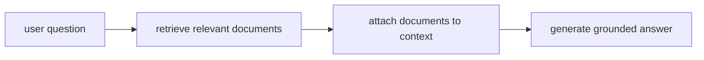

# P5-12.1 RAG의 필요성

P5-11.2에서는 프롬프트만으로는 최신성, 근거 보장, 실행 가능성 같은 문제를 해결하기 어렵다는 점을 보았습니다. 여기서 다음 질문이 나옵니다.

모델 기억에만 의존하지 않고, 외부 근거를 함께 쓰려면 어떻게 해야 하는가?

이 절은 그 질문에 답합니다.

RAG(retrieval-augmented generation)는 모델이 답을 만들기 전에 관련 문서를 먼저 찾고, 그 문서를 바탕으로 생성하도록 연결하는 구조다.

같은 말을 더 쉽게 바꾸면 다음과 같습니다.

RAG는 모델 기억만 믿지 말고, 먼저 근거 문서를 찾아서 그 문서를 보고 답하게 하자는 방식이다.

## 이 절의 범위

이 절은 다음 질문에 답합니다.

- 왜 프롬프트만으로는 부족해서 RAG가 필요해지는가?
- RAG는 어떤 문제를 줄이려는가?
- 어떤 상황에서 RAG가 파인튜닝보다 먼저 고려될 수 있는가?

이 절은 다음 내용은 깊게 다루지 않습니다.

- 벡터 인덱스 구현 세부
- re-ranking 알고리즘
- 장기 메모리 시스템 전체 설계

RAG의 실제 결합 흐름은 바로 다음 P5-12.2 검색 결과와 생성의 결합에서 다시 회수하고, 검색 저장 구조와 인덱스 문제는 P5-13.1 벡터 데이터베이스, P5-13.2 인덱스와 검색 품질에서 이어집니다. 장기 메모리 시스템 전체 설계는 현재 본편 범위 밖으로 둡니다.

이 절의 목적은 RAG를 유행어가 아니라 `외부 근거 연결 구조`로 설명하고, 왜 LLM 서비스에서 매우 자주 등장하는지 보여 주는 데 있습니다.

## 이 절의 목표

- RAG의 필요성을 입문 수준에서 설명할 수 있습니다.
- 왜 최신성, 근거, 내부 문서 활용 문제가 RAG로 이어지는지 말할 수 있습니다.
- 파인튜닝과 RAG가 해결하려는 문제가 다르다는 점을 구분할 수 있습니다.
- 다음 절의 실제 결합 흐름으로 자연스럽게 넘어갈 수 있습니다.

## 왜 모델 기억만으로는 부족한가

LLM은 사전학습과 조정을 통해 많은 패턴을 배웁니다. 하지만 실제 서비스에서는 다음과 같은 요구가 매우 자주 나옵니다.

먼저 다음 세 질문으로 읽으면 좋습니다.

| 질문 | 짧은 답 |
| --- | --- |
| 왜 기존 모델만으로 부족한가? | 최신 정보와 내부 문서가 자동 반영되지 않아서 |
| 무엇을 추가하려는가? | 답하기 전에 근거 문서를 찾는 단계 |
| 그래서 바뀌는 것은 무엇인가? | 답의 출발점이 기억에서 문서 근거로 이동한다 |

- 오늘 바뀐 정책을 반영해야 한다
- 회사 내부 문서를 근거로 답해야 한다
- 최신 제품 사양을 기준으로 설명해야 한다
- 답변에 실제 출처를 붙여야 한다

이런 요구는 모델 내부에 이미 들어 있는 기억만으로는 안정적으로 해결되기 어렵습니다.

이유는 단순합니다.

- 학습 시점 이후 정보는 자동으로 갱신되지 않고
- 내부 문서는 애초에 학습에 포함되지 않았을 수 있으며
- 답변이 그럴듯해 보여도 실제 근거와 연결되지 않을 수 있기 때문입니다

## RAG는 무엇을 바꾸려 하나

RAG의 기본 발상은 매우 실용적입니다.

`먼저 관련 문서를 찾고, 그 문서를 함께 넣은 뒤, 그 범위 안에서 답을 생성하자.`

즉, 모델이 혼자 기억을 꺼내는 구조에서:

- 검색(retrieval)이 먼저 일어나고
- 그 결과가 맥락(context)으로 붙고
- 생성(generation)이 그 위에서 진행되는 구조로 바뀝니다

이 때문에 RAG는 `모델을 더 똑똑하게 만드는 기술`이라기보다, `답변 근거를 외부 자료와 연결하는 서비스 구조`로 이해하는 편이 더 정확합니다.

서비스 구조 관점에서는, 프롬프트가 `모델에게 어떻게 물을까`를 다뤘다면 RAG는 `무엇을 근거로 답하게 할까`를 다루는 단계입니다.

## RAG는 어떤 문제를 줄이려 하나

RAG는 보통 다음 문제를 줄이려는 방향으로 쓰입니다.

- 최신 정보 부족
- 내부 문서 미반영
- 근거 없는 일반론적 답변
- 출처 추적 어려움

다음처럼 기억하면 좋습니다.

`RAG는 모델의 기억을 믿기만 하지 않고, 필요한 문서를 먼저 가져와 답의 근거 범위를 좁히는 방법이다.`

## 파인튜닝과 무엇이 다른가

이 차이는 매우 중요합니다.

| 방식 | 주로 해결하려는 문제 |
| --- | --- |
| 파인튜닝(fine-tuning) | 특정 형식, 반응 성향, 도메인 적합성 조정 |
| RAG | 최신 정보, 외부 근거, 문서 기반 응답 연결 |

예를 들어:

- 답변 형식을 회사 스타일에 맞추는 일은 파인튜닝이 더 관련 있을 수 있습니다
- 오늘 바뀐 환불 정책을 반영하는 일은 RAG가 더 직접적입니다

이 구분이 없으면 사용자는 모든 문제를 파인튜닝이나 프롬프트 하나로 해결하려는 오해에 빠지기 쉽습니다.

같은 요청 흐름으로 다시 정리하면 다음과 같습니다.

- 프롬프트: 질문 방식을 다듬는다
- 파인튜닝: 반응 성향과 형식을 더 맞춘다
- RAG: 답변 전에 외부 근거를 붙인다

## 왜 실무에서 자주 쓰이나

실무에서는 `정답처럼 보이는 말`보다 `근거가 확인되는 말`이 중요할 때가 많습니다.

예를 들어:

- 사내 위키 기반 답변
- 제품 매뉴얼 기반 고객 지원
- 법률/정책 문서 기반 검색 응답
- 기술 문서 기반 개발 보조

이런 경우 RAG는 모델을 바꾸기보다 `근거 접근 경로`를 바꾸는 방법이기 때문에 실용적입니다.

독자에게는 다음 한 줄이 중요합니다.

`실무에서는 멋진 답보다 근거가 추적되는 답이 더 중요할 때가 많다.`

## RAG도 만능은 아니다

하지만 RAG도 과장하면 안 됩니다.

RAG가 있다고 해서:

- 항상 가장 관련된 문서를 찾는 것
- 찾은 문서를 항상 정확히 읽는 것
- 인용이 항상 올바른 것
- 검색 결과가 충분한 것

이 자동으로 보장되지는 않습니다.

즉, RAG는 `검색 문제`와 `생성 문제`를 같이 다루게 만들 뿐, 두 문제를 모두 자동 해결하는 것은 아닙니다.

더 안전한 설명은 다음입니다.

`RAG는 답의 근거를 외부 자료에 연결하는 강한 구조이지만, 검색 품질과 생성 품질을 따로 점검해야 한다.`

## 아주 단순하게 그리면



이 도식의 핵심은 `검색이 먼저 오고, 생성이 그 뒤에 온다`는 점입니다.

## 사례로 보기

### 사례 1. 사내 정책 질의응답

질문이 `출장비 정산 기준이 어떻게 바뀌었나요?`라면, 일반 기억에 의존하는 답보다 최신 사내 정책 문서를 먼저 검색해 붙이는 구조가 더 적절합니다.

### 사례 2. 제품 매뉴얼 기반 지원

제품 사용법을 묻는 고객 질문에 대해, RAG는 최신 매뉴얼과 FAQ를 먼저 불러온 뒤 답을 생성하게 만들 수 있습니다.

### 사례 3. 개발 문서 검색

API 문서를 기반으로 답해야 하는 개발 보조 도구에서는, 모델 자체 기억보다 현재 문서 검색이 더 중요할 수 있습니다.

세 사례를 한 줄로 묶으면 다음과 같습니다.

| 상황 | RAG가 먼저 필요한 이유 |
| --- | --- |
| 사내 정책 | 최신 내부 문서를 근거로 써야 해서 |
| 제품 지원 | 최신 매뉴얼을 먼저 확인해야 해서 |
| 개발 문서 | 현재 버전 문서를 기반으로 답해야 해서 |

## 작은 Python 예제로 보기

이번 예제의 목표는 실제 검색 시스템을 구현하는 것이 아니라, `질문 -> 문서 검색 -> 답변 생성`이라는 역할 분리를 감각적으로 보는 것입니다.

입력:

- 질문
- 검색된 문서 목록

출력:

- 답변 전에 어떤 근거가 붙는지 확인

```python
question = "환불 정책이 오늘 어떻게 바뀌었나요?"

retrieved_docs = [
    "2026-06-29 정책 공지: 환불 요청 처리 기한이 7일에서 14일로 변경됨",
    "FAQ: 환불 접수는 계정 메뉴에서 시작",
]

print("question =", question)
print("retrieved_docs =", retrieved_docs)
print("next_step = generate answer using retrieved docs")
```

실행 결과 예시는 다음처럼 읽을 수 있습니다.

```text
question = 환불 정책이 오늘 어떻게 바뀌었나요?
retrieved_docs = ['2026-06-29 정책 공지: 환불 요청 처리 기한이 7일에서 14일로 변경됨', 'FAQ: 환불 접수는 계정 메뉴에서 시작']
next_step = generate answer using retrieved docs
```

이 예제는 RAG가 답변 그 자체보다, `답변 전에 어떤 근거를 붙이느냐`를 먼저 바꾸는 구조라는 점을 보여 줍니다.

이 예제에서 여기서 읽어야 할 핵심은 다음입니다.

- 질문만 있다고 바로 답하지 않고
- 먼저 문서를 찾고
- 그 문서를 붙인 뒤 답한다는 점입니다

즉, RAG의 핵심 변화는 `답변 문장`보다 `답변 전에 거치는 근거 단계`에 있습니다.

## 역사와 커리큘럼 관점

생성형 AI가 실제 서비스에 들어가면서, 사람들은 곧 `모델이 그럴듯하게 말하는 것`과 `근거를 가진 답을 하는 것`이 다르다는 점을 체감했습니다. 이 문제의식이 검색과 생성을 결합하는 흐름을 강하게 밀었습니다.

커리큘럼 관점에서 이 절이 중요한 이유는 다음과 같습니다.

- 프롬프트의 한계를 구조적으로 보완하는 첫 번째 해법을 보여 주고
- 임베딩과 벡터 검색이 P5-13.1 벡터 데이터베이스, P5-13.2 인덱스와 검색 품질에서 어떻게 다시 확장되고, 외부 기능 연결이 P5-14.1 도구 사용으로 어떻게 이어지는지 연결하며
- 이후 서비스 아키텍처 설명에서 `모델만으로 끝나지 않는다`는 시각을 고정해 주기 때문입니다

## 다음 절과의 연결

여기까지 오면 다음 질문이 남습니다.

- 검색된 문서는 실제로 어디에 붙는가?
- 검색 결과를 많이 넣는다고 항상 답이 좋아지는가?

이 질문은 P5-12.2 검색 결과와 생성의 결합으로 이어집니다.

## 이 절에서 기억할 관점

- RAG는 관련 문서를 먼저 찾고, 그 문서를 바탕으로 생성하도록 연결하는 구조입니다.
- 최신성, 근거, 내부 문서 활용 문제 때문에 RAG가 필요해집니다.
- 파인튜닝과 RAG는 해결하려는 문제가 다릅니다.
- RAG도 검색 품질과 생성 품질을 따로 점검해야 합니다.

## 체크리스트

- RAG의 필요성을 입문 수준에서 설명할 수 있는가?
- 왜 모델 기억만으로는 부족한지 말할 수 있는가?
- 파인튜닝과 RAG의 차이를 설명할 수 있는가?
- 왜 다음 절에서 검색 결과와 생성 결합 구조를 더 자세히 봐야 하는지 설명할 수 있는가?

## 출처와 참고 자료

- Patrick Lewis et al., `Retrieval-Augmented Generation for Knowledge-Intensive NLP Tasks`, NeurIPS, 2020, 확인 날짜: 2026-06-29.
- OpenAI, RAG 및 파일/검색 관련 공식 문서, 확인 날짜: 2026-06-29.
- Meta AI 및 관련 교육 자료, RAG 소개 문서, 확인 날짜: 2026-06-29.
