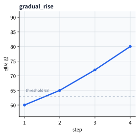
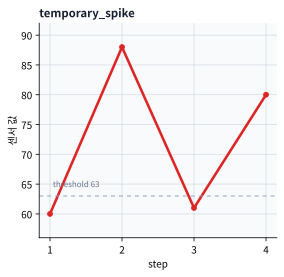

# P5-12.1 순환 신경망(RNN), 장단기 메모리(LSTM), 게이트 순환 유닛(GRU)의 필요성

> Section ID: `P5-12.1`
> Version: `v2026.07.19`

P5-11장에서는 CNN이 이미지처럼 공간 구조가 있는 데이터에서 지역 패턴을 잘 다룬다는 점을 보았습니다. 여기서 데이터 유형을 바꾸면 다음 질문이 생깁니다.

문장, 음성, 시계열처럼 순서(order)가 중요한 데이터는 어떻게 다루는가?

이 질문에 답하려는 구조가 순환 신경망(RNN), 장단기 메모리(LSTM), 게이트 순환 유닛(GRU)입니다.

순환 신경망 계열 구조는 현재 입력만 보지 않고, 앞에서 본 정보를 어느 정도 이어받아 순차 데이터(sequence data)를 처리하려는 신경망입니다.

순차 상태 구조의 기본 이름이 다시 섞이면 개념사전의 [순환 신경망(RNN, recurrent neural network)](../../../reference/concept-glossary.md#rnn-recurrent-neural-network), [장단기 메모리(LSTM, long short-term memory)](../../../reference/concept-glossary.md#lstm-long-short-term-memory), [게이트 순환 유닛(GRU, gated recurrent unit)](../../../reference/concept-glossary.md#gru-gated-recurrent-unit) 항목을 함께 다시 봅니다.

## 이 절의 범위

- 왜 순차 데이터에는 순서 개념이 중요한가?
- 일반적인 feed-forward 구조만으로는 어떤 답답함이 생기는가?
- 순환 신경망은 어떤 아이디어를 도입했는가?
- LSTM과 GRU는 왜 추가로 필요해졌는가?

이 절에서 먼저 닫아야 하는 핵심은 `순차 데이터는 마지막 입력 하나가 아니라 앞에서 누적된 상태가 현재 판단을 바꾼다`는 점입니다. 즉, 여기서는 `순차 상태를 왜 들고 가야 하는가`와 `기본 RNN만으로는 왜 오래 기억하기 어려웠는가`를 먼저 닫습니다. 장기 의존성(long-term dependency) 문제는 바로 다음 절 P5-12.2에서 더 집중해서 다룹니다.

## 이 절의 목표

- 순차 데이터 문제에서 `순서`와 `문맥(context)`이 왜 중요한지 설명할 수 있습니다.
- RNN을 `이전 상태를 이어받는 구조`로 설명할 수 있습니다.
- LSTM과 GRU가 등장한 이유를 장기 기억 유지 문제와 연결할 수 있습니다.
- 실행 가능한 Python 예제로 순차 누적 상태가 실제 판단을 어떻게 바꾸는지 확인할 수 있습니다.

## 왜 순차 데이터는 특별한가

순차 데이터(sequence data)는 항목의 순서가 바뀌면 의미가 달라질 수 있습니다.

예를 들어 문장에서는 단어는 같아도 순서가 바뀌면 의미가 달라집니다. 음성에서는 같은 소리 조각도 앞뒤 리듬에 따라 다른 발음처럼 들릴 수 있습니다. 센서 데이터에서는 마지막 숫자 하나보다 그 전에 어떻게 올라왔고 내려왔는지가 더 중요할 때가 많습니다.

즉, 순차 데이터는 단순한 집합(set)이나 표 한 줄과 다르게 `앞뒤 관계`를 포함합니다. 순차 데이터에서는 무엇이 있는가뿐 아니라, 어떤 순서로 나타나는가가 중요합니다.

## 일반적인 feed-forward 구조만으로는 왜 답답한가

일반적인 feed-forward network는 입력을 한 번에 받아 출력으로 보내는 데에는 자연스럽습니다. 하지만 순차 데이터에서는 곧 한계가 드러납니다.

예를 들어 문장 끝에서 `확인했다`라는 표현을 읽을 때, 앞에서 이미 `차단`, `누유`, `금지` 같은 단서가 나왔는지에 따라 같은 단어의 의미가 달라질 수 있습니다. 센서에서도 마지막 값이 80이라고 해서 곧바로 같은 판단이 나오는 것은 아닙니다. 그 80이 천천히 누적된 상승 끝에 나온 것인지, 잠깐 튀었다가 다시 올라온 것인지에 따라 현재 상태는 다르게 읽힐 수 있습니다.

즉, 순차 데이터에서는 `지금 보는 입력`과 `이전에 본 입력`을 함께 연결해야 할 때가 많습니다. 문제는 일반적인 feed-forward 구조는 이런 누적 흐름을 구조 자체로 들고 가는 데에 익숙하지 않다는 점입니다.

여기서 RNN의 기본 아이디어가 등장합니다.

같은 차이를 아주 짧게 비교하면 다음과 같습니다.

| 구조 | 입력을 보는 감각 |
| --- | --- |
| feed-forward | 한 번에 받은 입력을 바로 출력으로 보낸다 |
| RNN | 현재 입력을 보면서 이전 상태도 함께 들고 간다 |

같은 장면을 두 구조로 나눠 보면 차이가 더 직접 보입니다.

| 같은 장면 | feed-forward로 먼저 읽을 때 남기 쉬운 것 | RNN으로 먼저 읽을 때 더 붙잡는 것 |
| --- | --- | --- |
| 문장 끝의 부정 표현 | 현재 단어 자체의 즉시 신호 | 앞 단어부터 누적된 문장 흐름 |
| 짧은 음성 조각 해석 | 지금 들리는 소리 조각의 모양 | 직전 소리와 이어지는 시간 맥락 |
| 마지막 센서 값 판단 | 현재 숫자 크기 하나 | 직전 여러 step의 상승·하락 흐름 |

## RNN은 무엇을 도입했나

RNN의 핵심 발상은 매우 단순하게 요약할 수 있습니다. `현재 입력을 처리할 때, 이전 step에서 만들어 둔 상태(state)도 함께 사용하자`는 것입니다.

즉, RNN은 각 시점(time step)마다:

- 현재 입력 \(x_t\)
- 이전 상태 \(h_{t-1}\)

를 받아 새로운 상태 \(h_t\)를 만듭니다.

핵심은 RNN이 이전에 본 정보를 상태처럼 들고, 다음 단계 계산에 함께 넘기려는 구조라는 점입니다. 그래서 이 절에서 RNN을 읽을 때는 `현재 입력을 본다`보다 `현재 입력을 이전 상태와 함께 본다`는 차이를 먼저 붙잡는 편이 좋습니다.

이를 아주 단순하게 그리면 다음과 같습니다.

```mermaid
--8<-- "assets/part-05/chapter-12/rnn-state-flow-ko.mmd"
```

이 도식에서 확인해야 할 결과는 현재 출력이 지금 입력만으로 정해지는 것이 아니라, 이전 시점의 상태가 다음 시점으로 계속 전달되며 함께 영향을 준다는 점입니다.

## RNN만으로 충분하지 않았던 이유

기본 RNN은 중요한 아이디어를 제공했지만, 실제 순차 데이터는 그렇게 짧고 단순하지 않습니다. 상태를 계속 다음 step으로 넘기다 보면 앞에서 본 단서가 뒤로 갈수록 약해질 수 있고, 지금 입력이 강하게 들어올수록 오래전 정보는 더 쉽게 밀려날 수 있습니다.

즉, `기억하고 싶다`는 아이디어와 `실제로 오래 유지된다`는 것은 다릅니다. 이 차이가 바로 다음 절의 장기 의존성(long-term dependency) 문제로 이어집니다.

## 그래서 LSTM과 GRU가 나왔다

LSTM과 GRU는 기본 RNN의 기억 문제를 더 잘 다루려는 구조입니다.

핵심은 LSTM과 GRU가 무엇을 더 오래 남기고 무엇을 버릴지, 그리고 현재 입력을 얼마나 반영할지를 더 세밀하게 조절하려 했다는 점입니다. 즉, 이들은 단순히 `더 복잡한 RNN`이 아니라, `기억을 더 잘 관리하려는 RNN`이라고 볼 수 있습니다.

이 차이를 입문 단계에서는 다음처럼 읽으면 충분합니다.

- basic RNN은 `상태를 이어간다`는 아이디어를 보여 줍니다.
- LSTM과 GRU는 `그 상태를 어떻게 더 오래, 더 안정적으로 유지할지`를 보강합니다.

## LSTM과 GRU는 왜 둘 다 배우나

입문 단계에서는 이름이 많아 혼란스러울 수 있습니다. 하지만 다음처럼 구분하면 충분합니다.

- RNN: 순차 상태를 이어가는 가장 기본 아이디어
- LSTM: 기억 유지 문제를 더 강하게 다루는 대표 구조
- GRU: 비슷한 목적을 조금 더 간결하게 구현한 구조

즉, 셋은 서로 무관한 경쟁자라기보다, `순차 기억 문제를 다루는 같은 계열의 발전 흐름`으로 보는 편이 좋습니다.

입문 단계에서는 아래 표처럼 `상태 전달`, `기억 조절`, `구조 단순화`의 차이만 먼저 잡아도 충분합니다.

| 이름 | 먼저 잡아야 할 직관 |
| --- | --- |
| RNN | 상태를 다음 step으로 넘긴다 |
| LSTM | 오래 남길 정보와 버릴 정보를 더 세밀하게 조절한다 |
| GRU | 비슷한 목적을 더 간결한 구조로 구현한다 |

모델 이름을 따로 외우기보다, 작은 순차 장면에서 어떤 질문을 먼저 떠올려야 하는지 같이 붙여 두면 흐름이 더 안정적입니다.

| 작은 순차 장면 | 먼저 떠올릴 구조 | 그 구조가 출발점이 되는 이유 |
| --- | --- | --- |
| 짧은 운영 메모 해석처럼 앞뒤 몇 단어 흐름만 이어도 되는 경우 | RNN | `현재 입력 + 이전 상태`라는 가장 기본 순차 상태 아이디어를 바로 보기 좋기 때문입니다. |
| 문장 끝 부정 표현이나 앞 주어처럼 조금 더 먼 단서를 오래 붙잡아야 하는 경우 | LSTM | 무엇을 남기고 무엇을 버릴지 더 세밀하게 조절해 장기 기억 유지 문제를 더 직접 다루기 때문입니다. |
| LSTM과 비슷한 목적이지만 구조를 조금 더 간결하게 가져가고 싶은 경우 | GRU | 순차 기억 보강 감각은 유지하면서 상태 조절 구조를 비교적 단순하게 읽기 좋기 때문입니다. |

이 표의 목적은 `언제나 어느 모델이 더 우월한가`를 정하는 데 있지 않습니다. 현재 절에서는 `순차 상태를 처음 도입할 때는 RNN`, `기억 유지 문제가 더 중요해지면 LSTM/GRU`라는 문제 장면 중심 손잡이를 잡는 정도면 충분합니다.

## 사례 및 예시

### 대표 사례. 운영 메모 해석

운영 메모에서 `누유는 확인됐지만 재가동은 승인하지 않았다` 같은 문장을 생각해 볼 수 있습니다. 사람은 메모를 읽다가 중간에 `승인`이나 `재가동` 같은 단어를 보면 먼저 작업 진행 쪽으로 해석하기 쉽습니다. 하지만 끝에 나오는 `않았다`와 앞부분의 `누유` 단서가 함께 남아 있어야, 이 문장이 실제로는 `재가동 보류` 쪽 의미라는 점을 놓치지 않게 됩니다. 마지막 몇 단어만 보거나 단어를 따로 떼어 보면 쉽게 오해할 수 있습니다. 즉, 현재 위치 의미를 읽을 때도 앞 단어와 중간 문맥이 함께 중요합니다. 순차 상태를 이어가는 구조는 바로 이런 `앞에서 본 위험 단서와 뒤의 승인 부정이 함께 남아 있어야 하는 상황`에서 필요해집니다.
그래서 이 사례에서 확인해야 할 결과는 마지막 `승인` 계열 단어만 따라가지 않고, 앞의 누유 단서와 뒤의 부정 표현이 함께 남아 최종 판단이 실제로 `재가동 보류`로 닫히는가입니다.

같은 관점은 설비 경보음 인식이나 시계열 예측에도 그대로 이어집니다. 다만 이 절에서 붙잡을 핵심은 도메인 이름이 아니라, `같은 마지막 입력도 앞에서 누적된 상태가 다르면 다른 결론이 나오는가`입니다.

세 사례를 같이 놓고 보면 RNN/LSTM/GRU를 `시간축 모델 이름`보다 `같은 마지막 입력도 누적 상태가 다르면 다른 결론이 나오는 구조`로 읽어야 하는 이유가 더 분명해집니다.

| 사례 | 지금 입력만 보면 놓치기 쉬운 것 | 순차 상태가 추가하는 맥락 | 이 절에서 확인할 결과 |
| --- | --- | --- | --- |
| 운영 메모 해석 | `누유`, `차단` 같은 앞 단서의 즉시 의미 | 같은 마지막 확인 문구라도 앞 단서에 따라 안전 해석이 달라지는 흐름 | 최종 판단이 마지막 단어 하나가 아니라 앞 조치 흐름을 반영하는가 |
| 설비 경보음 인식 | 짧은 파형 조각 하나의 모호함 | 앞뒤 반복 리듬과 경보 패턴이 이어지는 시간 맥락 | 같은 소리 조각이 앞뒤 연결에 따라 더 안정적으로 해석되는가 |
| 시계열 예측 | 마지막 숫자 하나의 크기 | 직전 여러 step의 상승·하락 추세 | 같은 마지막 값도 이전 흐름에 따라 다른 경보가 나오는가 |

| 사람이 먼저 보기 쉬운 기준 | 순차 상태 관점으로 다시 읽는 기준 |
| --- | --- |
| 마지막 단어나 마지막 값이 같으면 비슷한 판단이 나올 것이라고 본다 | 같은 마지막 입력도 앞에서 어떤 흐름이 누적됐는지에 따라 다른 상태와 다른 결론이 나온다 |
| 중간 단서는 참고 설명 정도라고 느낀다 | 중간 단서가 상태에 누적되지 않으면 마지막 입력 해석 자체가 쉽게 흔들린다 |
| 순차 모델은 그냥 `시간축 데이터용 모델 이름`이라고 외우기 쉽다 | 실제 핵심은 `현재 입력 + 이전 상태`라는 판단 구조가 추가된다는 점이다 |

## 연습 및 예제

이번 예제의 목표는 `이전 상태를 다음 step으로 넘긴다`는 말이 실제 판단에서 어떤 차이를 만드는지 확인하는 것입니다. 이번에는 순차 상태가 없는 아주 단순한 기준과, 순차 상태를 이어받는 기준을 나란히 두고 비교합니다. 즉, `마지막 입력만 보는 판단`과 `앞의 흐름까지 남기는 판단`이 어디서 갈라지는지 실제 출력으로 확인합니다.

예제를 읽기 전에, 이번 절에서 실제로 확인해야 할 최소 포인트를 먼저 고정하면 다음과 같습니다.

| 확인 포인트 | 예제에서 바로 볼 값 | 왜 중요한가 |
| --- | --- | --- |
| baseline과 상태 기반 판단이 어디서 갈라지는가 | `baseline_last_word_label`, `baseline_last_value_alert`와 최종 `label`, `alert` | 순차 모델이 마지막 입력 하나보다 누적 상태를 본다는 점을 보여 준다 |
| 상태가 step마다 어떻게 누적되는가 | 각 줄의 `state=` 출력 | RNN류 구조의 핵심이 현재 입력 즉시 판단이 아니라 상태 갱신이라는 점을 보여 준다 |
| 같은 마지막 입력도 왜 다른 결론이 나오는가 | `gradual_rise`와 `temporary_spike`의 마지막 step 비교 | 직전 흐름이 다르면 현재 판단도 달라진다는 순차 문맥 감각을 눈으로 확인하게 한다 |

입력:

- 같은 마지막 확인 문구를 가진 짧은 운영 메모 세 개
- 같은 마지막 온도 `80`을 가진 두 시계열

출력:

- 마지막 입력만 보는 baseline 판단
- 각 step에서 갱신되는 문장 상태값
- 최종 문장 라벨
- 마지막 값만 보는 baseline 경보 여부
- 각 step에서 갱신되는 센서 상태값
- 마지막 step에서의 경보 여부

문제 상황:

- 순차 데이터는 마지막 값만 보는 방식과 중간 상태를 계속 갱신하는 방식의 차이를 직접 비교해 볼 필요가 있다

확인할 개념:

- RNN류 구조는 입력을 한 번에 보지 않고 step마다 상태를 갱신한다
- 마지막 값만 보는 baseline과 비교하면 순차 상태 업데이트의 의미가 더 분명해진다

코드를 보기 전에, 어떤 경우에 baseline과 상태 기반 판단이 갈라질지 먼저 예상해 보면 좋습니다.

| 장면 | 마지막 입력만 보는 baseline 예상 | 상태를 누적해 보는 쪽 예상 | 먼저 붙잡아야 할 이유 |
| --- | --- | --- | --- |
| `shutdown_confirmed` | `확인`만 보고 `restart_allowed` | 앞의 `차단` 조치가 남아 `hold_required` | 마지막 단어가 같아도 앞 조치 흐름이 왜 상태 안에 남아야 하는지 본다 |
| `leak_confirmed` | `확인`만 보고 `restart_allowed` | 앞의 `누유` 단서가 남아 `hold_required` | 같은 마지막 단어라도 앞 상태가 다르면 결론이 갈라질 수 있음을 본다 |
| `gradual_rise` vs `temporary_spike` | 둘 다 마지막 값 `80`만 보고 경보 | 지속 상승만 경보, 일시 튐은 경보 아님 | 같은 마지막 값도 직전 추세에 따라 상태가 다르게 남는다는 점을 본다 |

입력(input):

위에 정리한 단어 신호, 센서 신호, 초기 상태값을 사용합니다.





이 그래프는 코드 실행 전에 먼저 `마지막 값이 같다`와 `누적 상태가 같다`를 분리해서 보게 합니다. `gradual_rise`와 `temporary_spike`는 둘 다 80으로 끝나지만, 순차 상태는 직전 흐름을 함께 남기기 때문에 최종 경보 해석이 달라질 수 있습니다.

```python
word_signal = {
    "누유": -2.2,
    "차단": -1.5,
    "재가동": 1.2,
    "확인": 0.8,
}

def classify_with_last_word(words):
    last_signal = word_signal.get(words[-1], 0.0)
    return "restart_allowed" if last_signal > 0 else "hold_required"

def run_sentence(name, words, alpha=0.7):
    state = 0.0
    print(f"[sentence: {name}]")
    print("baseline_last_word_label =", classify_with_last_word(words))
    for step, word in enumerate(words, start=1):
        signal = word_signal.get(word, 0.0)
        state = alpha * state + signal
        print(f"step {step}: word={word:>6}, signal={signal:>4}, state={state:>5.2f}")
    label = "restart_allowed" if state > 0 else "hold_required"
    print("final_label =", label)
    print()

def alert_with_last_value(sequence, threshold):
    return sequence[-1] >= threshold

def run_sequence(name, sequence, alpha=0.6, threshold=63):
    state = 0.0
    print(f"[sensor: {name}]")
    print("baseline_last_value_alert =", alert_with_last_value(sequence, threshold))
    for step, x in enumerate(sequence, start=1):
        state = alpha * state + (1 - alpha) * x
        alert = state >= threshold
        print(f"step {step}: input={x:>3}, state={state:>6.2f}, alert={alert}")
    print()

gradual_rise = [60, 65, 72, 80]
temporary_spike = [80, 60, 60, 80]

run_sentence("shutdown_confirmed", ["차단", "확인"])
run_sentence("leak_confirmed", ["누유", "확인"])
run_sentence("restart_confirmed", ["재가동", "확인"])
run_sequence("gradual_rise", gradual_rise)
run_sequence("temporary_spike", temporary_spike)
```

출력에서는 baseline_last_word_label과 final_label이 언제 갈라지는지, 그리고 중간 state가 어떻게 누적되는지부터 보면 됩니다.

```text
[sentence: shutdown_confirmed]
baseline_last_word_label = restart_allowed
step 1: word=    차단, signal=-1.5, state=-1.50
step 2: word=    확인, signal= 0.8, state=-0.25
final_label = hold_required

[sentence: leak_confirmed]
baseline_last_word_label = restart_allowed
step 1: word=    누유, signal=-2.2, state=-2.20
step 2: word=    확인, signal= 0.8, state=-0.74
final_label = hold_required

[sentence: restart_confirmed]
baseline_last_word_label = restart_allowed
step 1: word=   재가동, signal= 1.2, state= 1.20
step 2: word=    확인, signal= 0.8, state= 1.64
final_label = restart_allowed

[sensor: gradual_rise]
baseline_last_value_alert = True
step 1: input= 60, state= 24.00, alert=False
step 2: input= 65, state= 40.40, alert=False
step 3: input= 72, state= 53.04, alert=False
step 4: input= 80, state= 63.82, alert=True

[sensor: temporary_spike]
baseline_last_value_alert = True
step 1: input= 80, state= 32.00, alert=False
step 2: input= 60, state= 43.20, alert=False
step 3: input= 60, state= 49.92, alert=False
step 4: input= 80, state= 61.95, alert=False
```

출력 숫자를 읽을 때도 `마지막 입력`과 `누적 상태`를 분리해서 봐야 합니다.

| 비교 | 출력에서 먼저 보이는 것 | 마지막 입력만 보면 남기 쉬운 해석 | 순차 상태까지 보면 바뀌는 해석 |
| --- | --- | --- | --- |
| `shutdown_confirmed` / `leak_confirmed` / `restart_confirmed` | 모두 마지막 단어는 `확인`인데 최종 라벨은 갈립니다. | 같은 마지막 단어면 같은 판단이 나와야 할 것처럼 보입니다. | `차단`과 `누유`처럼 앞에서 누적된 보류 신호가 남아 있으면, 마지막 `확인`이 와도 최종 판단은 `hold_required`가 될 수 있습니다. |
| `gradual_rise` vs `temporary_spike` | 둘 다 마지막 값은 `80`인데 마지막 alert는 갈립니다. | 마지막 값이 같으니 둘 다 경보가 떠야 할 것처럼 보입니다. | 지속 상승은 상태를 경보선 위로 밀어 올리지만, 일시 튐 뒤 복귀한 흐름은 같은 마지막 값이어도 상태가 덜 쌓여 경보가 안 뜰 수 있습니다. |
| 각 step의 `state=` 출력 | 입력 하나하나보다 상태가 점진적으로 바뀝니다. | 중간 출력은 부가 설명일 뿐이라고 보기 쉽습니다. | RNN류 구조의 핵심은 지금 입력보다 `누적 상태를 어떻게 갱신하느냐`에 있다는 점이 드러납니다. |

| 먼저 볼 출력 | 이 출력이 뜻하는 것 | 바꿔 보면 달라지는 것 |
| --- | --- | --- |
| `baseline_last_word_label = restart_allowed`인데 `shutdown_confirmed`와 `leak_confirmed`의 `final_label = hold_required`다 | 마지막 단어만 보면 같은 판단이 나와도, 순차 상태는 앞의 차단·위험 단서를 남겨 다른 결론을 만들 수 있다는 뜻 | `차단`, `누유` 신호 크기나 `alpha`를 바꾸면 앞의 보류 흐름이 얼마나 오래 남는지 달라집니다 |
| `baseline_last_value_alert = True`인데 `temporary_spike` 마지막 `alert=False`다 | 마지막 값 하나만 보면 같은 경보처럼 보여도, 순차 상태는 직전 흐름을 남겨 다른 결론을 만들 수 있다는 뜻 | 임계값이나 `alpha`를 바꾸면 `지속 상승`과 `일시적 튐`이 얼마나 쉽게 갈라지는지 달라집니다 |
| `gradual_rise`와 `temporary_spike`의 마지막 입력이 둘 다 `80`인데 state가 다르다 | 현재 판단이 지금 step 하나가 아니라 이전 step들의 누적 흔적까지 함께 본다는 뜻 | 중간 값을 바꾸면 같은 마지막 입력도 상태가 얼마나 크게 달라지는지 더 선명해집니다 |
| 운영 메모 예제에서 같은 마지막 `확인`인데 `shutdown_confirmed`와 `leak_confirmed`의 state가 다르다 | 같은 확인 문구도 앞 조치 단서가 다르면 상태와 최종 판단이 달라진다는 뜻 | `차단`, `누유` 신호 값을 바꾸면 앞 조치 흐름이 얼마나 강하게 남는지 볼 수 있습니다 |

위 결과는 세 가지를 함께 보여 줍니다. 첫째, 운영 메모 예제에서는 baseline이 마지막 단어 `확인`만 보고 `shutdown_confirmed`, `leak_confirmed`, `restart_confirmed`를 모두 `restart_allowed`로 읽지만, 순차 상태 쪽은 앞의 차단·위험 단서가 얼마나 강했는지를 남겨 `shutdown_confirmed`와 `leak_confirmed`를 `hold_required`로 갈라냅니다. 둘째, 센서 예제에서는 baseline이 마지막 값 `80`만 보고 두 시계열 모두 경보라고 판단하지만, 상태를 쓰는 쪽은 `지속 상승`과 `일시적 튐`을 다르게 남길 수 있습니다. 셋째, 마지막 입력이 둘 다 `80`이거나 마지막 단어가 모두 `확인`이어도 상태값이 같지 않은 이유는 현재 step의 판단이 `지금 입력 하나`로 정해지는 것이 아니라, 이전 step들에서 누적된 상태를 함께 참고하기 때문입니다.

운영 메모 쪽도 같은 기준으로 읽으면 핵심이 더 분명해집니다. baseline은 마지막 단어가 주는 즉시 신호에 쉽게 끌리지만, 순차 상태 쪽은 `차단`, `누유`, `재가동`, `확인`이 차례로 남긴 흔적을 누적해 마지막 결론을 만듭니다. 실제 LSTM과 GRU는 바로 이 상태 관리를 더 오래, 더 안정적으로 하려는 방향으로 이해하면 됩니다.

이 예제는 진짜 RNN 전체를 구현한 것은 아닙니다. 하지만 실제로 읽어야 할 핵심은 더 분명합니다.

- 같은 현재 입력도 이전 흐름에 따라 다른 상태를 만든다
- 상태가 없으면 마지막 단어나 마지막 숫자 같은 아주 거친 기준으로 쉽게 무너진다
- 문장에서는 뒤 단어가 앞 단어의 의미를 바꾸려면 중간 상태가 살아 있어야 한다
- 상태가 다르면 마지막 판단도 달라질 수 있다
- 순차 구조의 핵심은 `현재 값`만이 아니라 `이전까지 쌓인 흔적`을 함께 본다는 데 있다

이 예제도 결과를 한 번 읽고 끝내기보다, 어떤 값을 바꿔 보면 `상태 누적` 감각이 더 선명해지는지 바로 이어서 확인하는 편이 좋습니다.

| 먼저 보인 출력 신호 | 지금 바로 해 볼 변화 | 아직 이 예제만으로 서두르지 않을 결론 |
| --- | --- | --- |
| `temporary_spike`는 마지막 값이 80이어도 경보가 아니다 | `alpha`를 높이거나 낮춰 과거 상태를 얼마나 오래 끌고 가는지 비교한다 | RNN 계열이 언제나 마지막 값 기준보다 무조건 낫다고 단정하지 않는다 |
| 같은 마지막 `확인`인데도 상태와 결론이 갈라진다 | `누유`, `차단`, `재가동` 신호를 바꿔 앞 조치 흐름이 얼마나 오래 남는지 본다 | 단어 신호 몇 개만으로 실제 운영 언어 이해 전체를 설명한다고 단정하지 않는다 |
| 두 시계열의 마지막 state가 다르다 | 중간 값을 더 올리거나 낮춰 `지속 추세`와 `일시 튐`이 어디서 갈라지는지 본다 | 이 간단한 상태 업데이트 식 하나로 LSTM·GRU 내부 게이트 전체를 대체하지 않는다 |

즉, RNN의 기본 직관은 `현재 입력을 바로 분류한다`보다 `이전 상태를 들고 와 현재 입력과 함께 새 상태를 만든다`에 더 가깝습니다. LSTM과 GRU는 바로 이 상태를 `무엇을 더 오래 남길지`, `무엇을 잊을지` 더 잘 조절하려고 나온 구조라고 읽으면 됩니다.

이 절에서 얻어야 할 기준은 분명합니다. 같은 마지막 단어나 같은 마지막 숫자라도 앞에서 어떤 흐름이 누적됐는지에 따라 현재 판단은 달라질 수 있습니다. RNN은 이 누적 상태라는 발상을 가장 먼저 구조로 드러낸 모델이고, LSTM과 GRU는 그 상태가 너무 빨리 약해지지 않도록 보강하려는 구조입니다. 바로 다음 절 P5-12.2에서는 이 `상태를 넘긴다`는 방식이 어디에서 흔들리는지, 즉 오래전 단서를 왜 끝까지 붙들기 어려운지를 더 구체적으로 봅니다.

## 체크리스트

- 순차 데이터(sequence data)에서 상태 전달이 왜 중요한지 설명할 수 있는가?
- RNN, LSTM, GRU가 같은 계열로 묶이는 이유를 말할 수 있는가?
- 순차 데이터를 읽을 때는 같은 항목이라도 앞뒤 순서와 누적 문맥에 따라 해석이 달라진다는 점을 설명할 수 있는가?
- RNN은 이전 상태를 이어받아 현재 입력을 처리하려는 구조라는 점을 설명할 수 있는가?
- LSTM과 GRU는 오래 기억하기 어려운 문제를 더 잘 다루려는 발전 구조라는 점을 말할 수 있는가?
- 같은 마지막 단어나 마지막 숫자라도 앞 흐름이 다르면 다른 결론이 나올 수 있다는 점을 사례로 설명할 수 있는가?
- 입력 종류보다 앞뒤 순서와 누적 문맥이 더 중요해 보일 때, 순차 상태 관점을 먼저 떠올릴 수 있는가?
- LSTM과 GRU를 `다른 모델 이름`이 아니라 `상태를 더 오래 안정적으로 관리하려는 보강 구조`로 설명할 수 있는가?

## 출처와 참고 자료

- David E. Rumelhart, Geoffrey E. Hinton, Ronald J. Williams, `Learning representations by back-propagating errors`, Nature, 1986, 확인 날짜: 2026-07-19. [https://doi.org/10.1038/323533a0](https://doi.org/10.1038/323533a0){: target="_blank" rel="noopener noreferrer" }
- Sepp Hochreiter, Jürgen Schmidhuber, `Long Short-Term Memory`, Neural Computation, 1997, 확인 날짜: 2026-07-19. [https://doi.org/10.1162/neco.1997.9.8.1735](https://doi.org/10.1162/neco.1997.9.8.1735){: target="_blank" rel="noopener noreferrer" }
- Kyunghyun Cho et al., `Learning Phrase Representations using RNN Encoder-Decoder for Statistical Machine Translation`, arXiv, 2014, 확인 날짜: 2026-07-19. [https://arxiv.org/abs/1406.1078](https://arxiv.org/abs/1406.1078){: target="_blank" rel="noopener noreferrer" }
