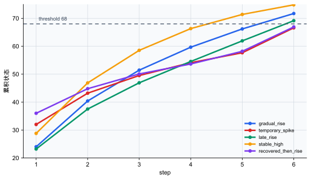

# P5-12.1 为什么需要循环神经网络（RNN）、长短期记忆（LSTM）和门控循环单元（GRU）

> Section ID: `P5-12.1`
> Version: `v2026.07.20`

在 P5-11 章里，我们已经看到，CNN 能很好地处理图像这类具有空间结构的数据中的局部模式。把数据类型换一下，这里就会自然出现下一个问题。

像句子、语音、时间序列这样顺序（order）很重要的数据，该怎么处理？

尝试回答这个问题的结构，就是循环神经网络（RNN）、长短期记忆（LSTM）和门控循环单元（GRU）。

循环网络这一类结构，并不只看当前输入，而是想把前面见过的一部分信息继续带下去，用来处理序列数据（sequence data）。

如果关于顺序状态结构的基本名称又开始混在一起，可以一起回到概念词汇表里的 [RNN（recurrent neural network）](../../../reference/concept-glossary.md#rnn-recurrent-neural-network)、[LSTM（long short-term memory）](../../../reference/concept-glossary.md#lstm-long-short-term-memory)、[GRU（gated recurrent unit）](../../../reference/concept-glossary.md#gru-gated-recurrent-unit) 条目重新对齐。

## 本节范围

- 为什么在序列数据里，顺序这个概念很重要？
- 只靠一般的 feed-forward 结构，会出现什么不顺手的地方？
- 循环神经网络引入了什么想法？
- 为什么后来还需要 LSTM 和 GRU？

本节首先要收住的核心，是`在序列数据里，改变当前判断的并不只是最后一个输入，而是前面累积下来的状态`。也就是说，这里先收住的是`为什么要把序列状态带下去`，以及`为什么只靠 basic RNN 很难长时间记住信息`。long-term dependency 问题会在下一节 P5-12.2 里更集中地展开。

## 本节目标

- 能说明为什么在序列数据问题里，`顺序`和`上下文（context）`很重要。
- 能把 RNN 解释成`把前一状态继续带下去的结构`。
- 能把 LSTM 和 GRU 的出现，与长期记忆维持问题联系起来。
- 能通过可运行的 Python 例子，确认累积的序列状态会怎样实际改变判断。

## 为什么序列数据是特殊的

在序列数据（sequence data）里，如果项目的顺序变了，含义也可能跟着变。

例如，在句子里，即使单词相同，只要顺序改变，意思就会不同。在语音里，即使是同一段声音碎片，也可能因为前后节奏不同而听起来像不同发音。在传感器数据里，很多时候比起最后一个数字本身，更重要的是它之前是怎样上升、怎样下降的。

也就是说，序列数据和简单的集合（set）或表格中的一行不同，它包含了`前后关系`。在序列数据里，重要的不只是出现了什么，还包括它是按照什么顺序出现的。

## 为什么只靠一般的 feed-forward 结构会觉得不顺手

一般的 feed-forward network 很适合一次性接收输入，再直接送出输出。但一到序列数据里，它的局限就会很快露出来。

例如，当我们读到句子结尾的`确认了`时，这个词的意义会因为前面是否已经出现过`阻断`、`泄漏`、`禁止`这样的线索而不同。在传感器数据里也是一样。最后一个值是 80，并不自动意味着每次都应得到同样判断。这个 80 到底是缓慢上升累积出来的，还是短暂跳高以后又重新上来的，会让当前状态被读成不同含义。

也就是说，在序列数据里，我们经常需要把`现在看到的输入`和`之前看过的输入`连起来。问题在于，一般的 feed-forward 结构并不擅长把这种累积流程直接保留在结构本身里。

这时，RNN 的基本想法就出现了。

把这种差异非常简短地并排放在一起，会是下面这样。

| 结构 | 读取输入时的感觉 |
| --- | --- |
| feed-forward | 一次收到输入，就直接送到输出 |
| RNN | 在看当前输入时，也把前一状态一起带着 |

把同一场景分别放进这两种结构里看，差异会更直接。

| 同一场景 | 用 feed-forward 先读时容易留下什么 | 用 RNN 先读时更能抓住什么 |
| --- | --- | --- |
| 句子结尾的否定表达 | 当前单词本身的即时信号 | 从前面单词一路累积下来的句子流向 |
| 解释一小段语音碎片 | 此刻听见的声音碎片形状 | 和前一声音片段连起来的时间上下文 |
| 判断最后一个传感器值 | 当前数字的大小本身 | 前面几个 step 的上升与下降趋势 |

## RNN 引入了什么

RNN 的核心想法其实可以概括得很简单：`在处理当前输入时，也把前一个 step 准备好的状态一起用上。`

也就是说，RNN 在每一个时间点（time step）都会接收：

- 当前输入 \(x_t\)
- 前一状态 \(h_{t-1}\)

然后生成新的状态 \(h_t\)。

关键点在于，RNN 想把之前看到的信息当作一种状态带着走，再和下一步计算一起传下去。所以在本节读 RNN 时，比起先记住`它看当前输入`，更适合先抓住`它把当前输入和前一状态一起看`这个差别。

状态传递听起来可能有点抽象，但实际可以这样读。按照后面 Python 例子里的同一个 `MEMO_ALPHA=0.85` 设置，如果前一状态是 `-1.5`，当前输入 `确认` 的信号是 `0.8`，那么新状态就不是只看当前输入时的 `0.8`，而是会把`前面留下的暂缓信号 + 当前确认信号`一起反映进去。

| step | 当前输入 | 只看最后输入的值 | 反映前一状态后的新状态 | 要读出的差异 |
| --- | --- | ---: | ---: | --- |
| 1 | `阻断` | -1.5 | -1.50 | 暂缓一侧的线索先留在状态里 |
| 2 | `确认` | 0.8 | -0.48 | 即使最后一个词偏正向，也会因为前面的暂缓痕迹，最终状态仍然是负数 |

这个小计算里重要的点，并不是说 RNN 会忽略 `确认` 这个当前输入。它会看当前输入，只是会和前一个 step 传来的状态一起看。因此，即使同样是 `确认`，前面出现过的是 `阻断` 还是 `重新启动`，都会让最后状态和判断不同。

把它画得非常简单，就是下面这样。

```mermaid
--8<-- "assets/part-05/chapter-12/rnn-state-flow-zh.mmd"
```

这张图里需要确认的结果是：当前输出并不是只由此刻输入决定的。前一时间点的状态会继续传到下一时间点，并和当前输入一起产生影响。

## 为什么只靠 RNN 还不够

basic RNN 提供了一个很重要的想法，但真实的序列数据并不会总是这么短、这么简单。状态不断被传到下一个 step 时，前面见过的线索会随着距离变远而慢慢变弱；而当前输入一旦很强，较早之前的信息就更容易被挤掉。

例如，即使最开始出现了 `泄漏` 这样很强的暂缓线索，如果后面长时间接着很多无关词，最后又出现 `确认`，basic RNN 的状态就可能越来越被当前输入拉走。状态传递结构本身是必要的，但如果不能调节什么要长期留下、什么要快速变弱，就很难把很久以前的关键线索抓到最后。

| 情况 | 只靠状态传递会产生的压力 | 为什么会成为问题 |
| --- | --- | --- |
| 前面有重要线索，后面接着很长的中立输入 | 状态会在每个 step 一点点被稀释 | 最初线索可能不足以留到最终判断 |
| 当前输入很强 | 最新输入会覆盖前一状态 | 旧线索和当前线索之间的平衡会摇晃 |
| 必要记忆和可以丢掉的痕迹混在一起 | 都用同一种方式传到下一个 step | 重要信息和噪声无法区分 |

也就是说，`想记住`这个想法，和`真的能稳定地记很久`，是两回事。这种差距会直接通向下一节里的 long-term dependency 问题。

## 所以 LSTM 和 GRU 出现了

LSTM 和 GRU 是想更好处理 basic RNN 记忆问题的结构。

关键在于，LSTM 和 GRU 会更细致地控制：什么应该留下更久，什么应该丢掉，以及当前输入应该被反映多少。也就是说，它们不只是`更复杂的 RNN`，更适合被理解成`想把记忆管理得更好的 RNN`。

在入门阶段，把这个差异读成下面这样就足够了。

- basic RNN 展示的是`把状态继续带下去`这个想法
- LSTM 和 GRU 补强的是`怎样把这个状态保留得更久、更稳定`

因此，LSTM 和 GRU 的必要性并不是`比 RNN 多了一个名字`，而在于：如果要把顺序状态真正用到实际问题里，就还需要管理记忆的装置。入门阶段，与其先背内部 gate 公式，不如先抓住下面这些问题。

| 问题 | basic RNN 里先看到的局限 | LSTM/GRU 想补强的方向 |
| --- | --- | --- |
| 什么要留下更久？ | 所有状态都以同样方式混进下一个 step | 尝试把重要线索保留得更久 |
| 什么要忘掉？ | 旧痕迹和噪声一起留下，或者一起变弱 | 尝试减少不太重要的信息 |
| 当前输入要反映多少？ | 新输入很容易摇动前一状态 | 尝试调节新输入和既有状态的反映程度 |

## 为什么 LSTM 和 GRU 两个都要学

在入门阶段，名字一多容易混乱。但先像下面这样区分就够了。

- RNN：把序列状态继续带下去的最基本想法
- LSTM：更强地处理记忆维持问题的代表结构
- GRU：用稍微更简洁的形式实现相似目标的结构

也就是说，更适合把这三者看成不是互不相关的竞争者，而是`处理序列记忆问题的同一家族发展流向`。

在入门阶段，先抓住下面这张表里`状态传递`、`记忆调节`、`结构简化`的差别，就已经够用了。

| 名称 | 首先要抓住的直觉 |
| --- | --- |
| RNN | 把状态传给下一个 step |
| LSTM | 更细致地控制哪些信息该长期保留、哪些该丢弃 |
| GRU | 用更简洁的结构实现相似目标 |

与其把模型名字分开死记，不如顺手把在小型序列场景里首先该想到什么问题一起留下，这样整体流程会更稳。

| 小型序列场景 | 先想到的结构 | 为什么它会成为起点 |
| --- | --- | --- |
| 像短运维备忘录那样，只需要把前后几个词的流向接起来时 | RNN | 因为它最适合直接看见`当前输入 + 前一状态`这个最基本的序列状态想法 |
| 需要把句尾否定表达、句首主语这类稍远一点的线索保持更久时 | LSTM | 因为它通过更细致地控制保留与丢弃，更直接处理长期记忆维持问题 |
| 想实现和 LSTM 相近的目标，但希望结构更简洁一点时 | GRU | 因为它在保留序列记忆补强感的同时，让状态调节结构相对更易读 |

这张表的目的，并不是决定`哪个模型永远更强`。在本节里，只要先抓住这样一个问题场景手柄就够了：`第一次引入序列状态时先看 RNN，记忆维持变得更重要时再看 LSTM/GRU。`

## 案例与示例

### 代表案例：解释运维备忘录

可以想一想这样一句运维备忘录：`确认有泄漏，但没有批准重新启动。` 人在读备忘录时，如果中途看见`批准`或`重新启动`这样的词，很容易先往工作继续进行的方向理解。但只有当最后的否定表达`没有`和前面的`泄漏`线索一起留下来，才不会漏掉这句话真正的意思其实是`重新启动应暂缓`。如果只看最后几个词，或者把单词拆开来看，就很容易误读。也就是说，即使是在读当前位置的意思时，前面的词和中间上下文也一样重要。把序列状态继续带下去的结构，正是为这种`前面出现过的风险线索和后面出现的审批否定必须一起保留下来`的情况而需要的。

所以，这个案例里要确认的结果，是模型有没有只跟着最后那个`批准`类词走，而是把前面的泄漏线索和后面的否定表达一起保留下来，最终让判断真正收束为`重新启动暂缓`。

同样的视角也会直接延伸到设备警报声识别和时间序列预测里。不过，本节真正要抓住的核心不是领域名称，而是`同样的最后输入，只要前面积累下来的状态不同，结论会不会变。`

把这三个案例放在一起，会更清楚地看到：RNN/LSTM/GRU 不该只被读成`时间轴模型的名字`，而应该被读成`同样的最后输入，也会因为累积状态不同而导向不同结论的结构`。

| 案例 | 只看当前输入时容易漏掉什么 | 序列状态额外补进来的上下文 | 本节要确认的结果 |
| --- | --- | --- | --- |
| 运维备忘录解释 | `泄漏`、`阻断`这类前面线索的即时含义 | 即使最后的确认短语相同，也会因为前面线索不同而改变安全解释的流程 | 最终判断是否反映了前面的处置流程，而不是只看最后一个词 |
| 设备警报声识别 | 一小段波形碎片本身的含糊性 | 重复节奏和警报模式在前后碎片间延续的时间上下文 | 同一声音碎片是否会因为前后连接不同而被更稳定地解释 |
| 时间序列预测 | 最后一个数字本身的大小 | 前面几个 step 的上升与下降趋势 | 同样的最后值，是否会因为前面的流向不同而触发不同警报 |

| 人容易先看的标准 | 从序列状态视角重新读时的标准 |
| --- | --- |
| 如果最后一个词或最后一个值相同，应该会得到相似判断 | 即使最后输入相同，只要前面累积的流向不同，就会形成不同状态和不同结论 |
| 中间线索像是补充说明，不是关键 | 如果中间线索没有累积进状态里，最后输入本身的解释也很容易摇晃 |
| 很容易只把序列模型记成`用于时间轴数据的模型名字` | 真正的核心是：这里额外加入了`当前输入 + 前一状态`这种判断结构 |

## 练习与例子

这个例子的目标，是确认`把前一状态传给下一步`这句话在实际判断里到底会造成什么差别。这一次，我们把一个完全不带序列状态的简单 baseline，和一个会把序列状态继续带下去的 baseline 并排比较。也就是说，我们会通过实际输出来确认：`只看最后输入的判断`，和`把前面流向保留下来的判断`，到底会从哪里开始分开。同时也一起看一个数据处理角度：当 CSV 文件里混着多个 sequence 的行时，必须按 `sequence_id` 恢复 step 顺序，才能计算顺序状态。

在读例子之前，先把本节实际需要确认的最小点固定下来，会更清楚。

| 确认点 | 在例子里直接要看的值 | 为什么重要 |
| --- | --- | --- |
| baseline 判断和状态型判断会从哪里分开 | `baseline_label`/`state_label`、`baseline_alert`/`state_alert` | 说明序列模型看的不是最后一个输入，而是累积状态 |
| 状态会怎样一步一步累积 | `trace` 输出里的 `previous_state -> new_state` | 说明 RNN 家族结构的核心不是当前输入的即时判断，而是状态更新 |
| 为什么同样的最后输入也会导向不同结论 | `changed=True` 的行 | 让我们用眼睛直接确认：只要前一段流向不同，当前判断也会不同 |

输入：

- 具有相同最后确认短语的运维备忘录 sequence
- 具有相同最后温度 `80` 的传感器 sequence
- 输入文件：[`rnn-sequence-events.csv`](../../../assets/part-05/chapter-12/rnn-sequence-events.csv)

输出：

- 只看最后输入的 baseline 判断
- memo summary 里的最终句子标签和是否 `changed`
- 只看最后一个值的 baseline 警报判断
- sensor summary 里的最终累积状态、警报判断和是否 `changed`
- 代表 trace 中的 `previous_state -> new_state` 状态更新流程

问题场景：

- 在序列数据里，需要直接比较：只看最后值的方法，与持续更新中间状态的方法，到底有什么不同

要确认的概念：

- RNN 家族结构不是一次性看完整个输入，而是按 step 更新状态
- 和只看最后值的 baseline 放在一起比较时，序列状态更新的意义会更清楚

在看代码之前，先猜一猜 baseline 和状态型判断会在什么地方分开，会更有帮助。

| 场景 | 只看最后输入的 baseline 预测 | 累积状态一侧的预测 | 为什么要先抓住它 |
| --- | --- | --- | --- |
| `shutdown_confirmed` | 只看 `确认`，预测 `restart_allowed` | 前面的 `阻断` 处置仍然保留，所以预测 `hold_required` | 让我们看到：为什么即使最后一个词相同，前面的处置流向也必须保留在状态里 |
| `leak_confirmed` | 只看 `确认`，预测 `restart_allowed` | 前面的 `泄漏` 线索仍然保留，所以预测 `hold_required` | 让我们看到：即使最后一个词相同，只要前一状态不同，结论就会分开 |
| `gradual_rise` vs `temporary_spike` | 只看最后值 `80`，两者都预测为警报 | 只有持续上升那条会触发警报，短暂尖峰不会 | 让我们看到：即使最后值相同，只要前面趋势不同，留下的状态也会不同 |

输入（input）：

CSV 的一行表示一个 sequence 里的一个 step。`sequence_id` 表示同一个顺序分组，`kind` 区分运维备忘录（`memo`）和传感器（`sensor`）。运维备忘录使用 `token`，传感器 sequence 使用 `sensor_value`。这个 Python 例子会读取这个文件，按 `sequence_id` 恢复 step 顺序，然后比较只看最后输入的判断和累积状态判断。

下面的代码默认在仓库根目录运行。



这张图会在运行代码前，先把`最后值相同`和`累积状态相同`分开来看。CSV 里的传感器 sequence 都以 80 结束，但因为序列状态也会保留前一段流向，所以只有一部分 sequence 会越过警报阈值。

```python
from collections import defaultdict
from pathlib import Path
import csv

DATA_PATH = Path("docs/assets/part-05/chapter-12/rnn-sequence-events.csv")

MEMO_ALPHA = 0.85     # 数值越低，前面的线索越快变弱。
SENSOR_ALPHA = 0.6    # 数值越高，过去的传感器状态保留越久。
SENSOR_THRESHOLD = 68

WORD_SIGNAL = {
    "누유": -2.2,
    "차단": -1.5,
    "재가동": 1.2,
    "승인": 0.6,
    "확인": 0.8,
}

def load_sequences(path):
    sequences = defaultdict(list)
    with path.open(encoding="utf-8", newline="") as f:
        for row in csv.DictReader(f):
            sequences[row["sequence_id"]].append(row)
    for rows in sequences.values():
        rows.sort(key=lambda row: int(row["step"]))
    return sequences

def label_from_state(state):
    return "restart_allowed" if state > 0 else "hold_required"

def label_from_last_token(rows):
    last_signal = WORD_SIGNAL.get(rows[-1]["token"], 0.0)
    return label_from_state(last_signal)

def trace_memo_state(rows, alpha=MEMO_ALPHA):
    state = 0.0
    trace = []
    for row in rows:
        previous_state = state
        step = int(row["step"])
        word = row["token"]
        input_signal = WORD_SIGNAL.get(word, 0.0)
        state = alpha * state + input_signal
        trace.append((step, word, input_signal, previous_state, state))
    return trace

def alert_from_last_value(rows, threshold=SENSOR_THRESHOLD):
    return float(rows[-1]["sensor_value"]) >= threshold

def trace_sensor_state(rows, alpha=SENSOR_ALPHA, threshold=SENSOR_THRESHOLD):
    state = 0.0
    trace = []
    for row in rows:
        previous_state = state
        step = int(row["step"])
        value = float(row["sensor_value"])
        state = alpha * state + (1 - alpha) * value
        trace.append((step, value, previous_state, state, state >= threshold))
    return trace

sequences = load_sequences(DATA_PATH)

print(f"操作变量: MEMO_ALPHA={MEMO_ALPHA}, SENSOR_ALPHA={SENSOR_ALPHA}, SENSOR_THRESHOLD={SENSOR_THRESHOLD}")
print()

print("[memo summary: 同样的最后单词 '확인' 会不会被读成不同意思]")
print("case                  last_word  baseline_label   final_state  state_label      changed")
for case_name, rows in sequences.items():
    if rows[0]["kind"] != "memo":
        continue
    trace = trace_memo_state(rows)
    final_state = trace[-1][-1]
    baseline_label = label_from_last_token(rows)
    state_label = label_from_state(final_state)
    changed = baseline_label != state_label
    print(f"{case_name:27} {rows[-1]['token']:>5}  {baseline_label:15} {final_state:>10.2f}  {state_label:15} {changed}")

print()
print("[sensor summary: 同样的最后值 80 会不会被读成不同意思]")
print("case              last_value  baseline_alert  final_state  state_alert  changed")
for case_name, rows in sequences.items():
    if rows[0]["kind"] != "sensor":
        continue
    trace = trace_sensor_state(rows)
    final_state = trace[-1][3]
    baseline_alert = alert_from_last_value(rows)
    state_alert = trace[-1][4]
    changed = baseline_alert != state_alert
    print(f"{case_name:29} {rows[-1]['sensor_value']:>5}  {str(baseline_alert):>14}  {final_state:>11.2f}  {str(state_alert):>11}  {changed}")

print()
print("[trace: memo_shutdown_confirmed]")
for step, word, signal, previous_state, new_state in trace_memo_state(sequences["memo_shutdown_confirmed"]):
    print(
        f"step {step}: input={word}, input_signal={signal:>4}, "
        f"previous_state={previous_state:>5.2f} -> new_state={new_state:>5.2f}"
    )

print()
print("[trace: sensor_temporary_spike]")
for step, value, previous_state, new_state, alert in trace_sensor_state(sequences["sensor_temporary_spike"]):
    print(
        f"step {step}: input={value:>3}, "
        f"previous_state={previous_state:>5.2f} -> new_state={new_state:>5.2f}, "
        f"state_alert={alert}"
    )
```

在输出里，先找 `changed=True` 的行。那些行就是只看最后输入的 baseline 和累积顺序状态判断分开的地方。接着在 `trace` 里确认哪一个前一状态被传进了下一个 step。

```text
操作变量: MEMO_ALPHA=0.85, SENSOR_ALPHA=0.6, SENSOR_THRESHOLD=68

[memo summary: 同样的最后单词 '확인' 会不会被读成不同意思]
case                  last_word  baseline_label   final_state  state_label      changed
memo_shutdown_confirmed       확인  restart_allowed      -0.12  hold_required   True
memo_leak_confirmed           확인  restart_allowed      -0.55  hold_required   True
memo_restart_confirmed        확인  restart_allowed       2.18  restart_allowed False
memo_blocked_then_approved    확인  restart_allowed       1.26  restart_allowed False
memo_leak_then_recovered      확인  restart_allowed       0.47  restart_allowed False

[sensor summary: 同样的最后值 80 会不会被读成不同意思]
case              last_value  baseline_alert  final_state  state_alert  changed
sensor_gradual_rise             80            True        71.72         True  False
sensor_temporary_spike          80            True        66.60        False  True
sensor_late_rise                80            True        69.16         True  False
sensor_stable_high              80            True        74.83         True  False
sensor_recovered_then_rise      80            True        66.91        False  True

[trace: memo_shutdown_confirmed]
step 1: input=차단, input_signal=-1.5, previous_state= 0.00 -> new_state=-1.50
step 2: input=점검, input_signal= 0.0, previous_state=-1.50 -> new_state=-1.27
step 3: input=대기, input_signal= 0.0, previous_state=-1.27 -> new_state=-1.08
step 4: input=확인, input_signal= 0.8, previous_state=-1.08 -> new_state=-0.12

[trace: sensor_temporary_spike]
step 1: input=80.0, previous_state= 0.00 -> new_state=32.00, state_alert=False
step 2: input=60.0, previous_state=32.00 -> new_state=43.20, state_alert=False
step 3: input=59.0, previous_state=43.20 -> new_state=49.52, state_alert=False
step 4: input=61.0, previous_state=49.52 -> new_state=54.11, state_alert=False
step 5: input=63.0, previous_state=54.11 -> new_state=57.67, state_alert=False
step 6: input=80.0, previous_state=57.67 -> new_state=66.60, state_alert=False
```

读输出数字时，也要把`最后输入`和`累积状态`分开看。

| 比较 | 输出里先看到的现象 | 只看最后输入时容易留下的解释 | 连同顺序状态一起看后改变的解释 |
| --- | --- | --- | --- |
| `memo_*` sequence | 最后单词都是 `확인`，但 `changed` 不同 | 同样的最后单词似乎就应该得到同样判断 | 如果前面累积的 `차단`、`누유` 这类暂缓信号还留着，即使最后来了 `확인`，最终判断也可能是 `hold_required` |
| `sensor_*` sequence | 最后值都是 `80`，但只有一部分是 `changed=True` | 最后值相同，所以似乎都应该报警 | 持续上升会把状态推到警报线以上，但短暂尖峰后又回落的流向，即使最后值相同，状态也可能还没积累到报警程度 |
| `trace` 里的 `previous_state -> new_state` | 当前输入不会直接变成最终判断，而是和前一状态混合 | 中间输出很容易被看成只是补充说明 | RNN 家族结构的核心在于`怎样更新累积状态`，而不只是当前输入本身 |

| 先看的输出 | 这个输出意味着什么 | 改一改会变化的地方 |
| --- | --- | --- |
| memo summary 中 `changed=True` 的行 | 即使只看最后单词会得到同样判断，顺序状态也可能保留前面的阻断·风险线索，从而得到不同结论 | 改 CSV 的 `token`、`WORD_SIGNAL` 的值、`MEMO_ALPHA`，前面的暂缓流向会留下多久就会改变 |
| sensor summary 中 `changed=True` 的行 | 即使只看最后值像是同样的警报，顺序状态也可能保留前一段流向，从而得到不同结论 | 改 CSV 中间的 `sensor_value`、`SENSOR_THRESHOLD`、`SENSOR_ALPHA`，`持续上升`和`短暂尖峰`会多容易分开就会改变 |
| `trace` 中 `previous_state` 进入下一次 `new_state` 计算 | 当前判断看的不是现在这一个 step，而是连同前面 step 累积的痕迹一起看 | 改中间输入值，同样最后输入下状态会差多少会更清楚 |

上面的结果同时展示了三件事。第一，在运维备忘录例子里，baseline 只看最后单词 `确认`，所以会把所有 memo sequence 都读成 `restart_allowed`；但顺序状态一侧会留下前面的阻断·风险线索有多强，于是把一部分 sequence 分成 `hold_required`。第二，在传感器例子里，baseline 只看最后值 `80`，所以会把所有 sensor sequence 都判断为警报；但状态一侧可以把持续上升和短暂尖峰后回落的流向留下成不同状态。第三，即使最后输入都是 `80`，或者最后单词都是 `确认`，状态值也不会相同，因为当前 step 的判断不是由`现在这一个输入`单独决定，而是还会参考前面 step 累积下来的状态。

运维备忘录一侧也按同样标准读，核心会更清楚。baseline 容易被最后单词的即时信号拉走，但顺序状态一侧会累积 `차단`、`누유`、`재가동`、`확인` 依次留下的痕迹，再形成最后结论。实际的 LSTM 和 GRU，可以理解成正是朝着把这种状态管理得更久、更稳定的方向发展。

这个例子并没有实现真正完整的 RNN。但它真正要读出来的核心更清楚。

- 同样的当前输入，也会因为前面流向不同而形成不同状态
- 没有状态时，判断很容易退化成最后单词或最后数字这样很粗糙的标准
- 在句子里，如果后面的词要改变前面词的意义，中间状态就必须还活着
- 状态不同，最后判断也可能不同
- 顺序结构的核心不只是看`当前值`，而是还看`到目前为止累积的痕迹`

| 先看到的输出信号 | 现在就可以尝试的变化 | 先不要急着下的结论 |
| --- | --- | --- |
| 一部分 `sensor_*` sequence 虽然最后值是 80，却没有触发警报 | 改 CSV 的中间 `sensor_value`、`SENSOR_ALPHA`、`SENSOR_THRESHOLD`，比较过去状态会被保留多久 | 不要立刻断定 RNN 家族总是无条件比最后值 baseline 更好 |
| 即使最后的 `확인` 相同，状态和结论仍然会分开 | 改 CSV 的 `token`、`WORD_SIGNAL`、`MEMO_ALPHA`，观察前面处置流向会留下多久 | 不要断定只靠几个词信号就能解释真实运维语言理解的全部 |
| 多个传感器 sequence 最后的 state 不同 | 把中间值再调高或调低，观察`持续趋势`和`短暂尖峰`会从哪里开始分开 | 不要把这一条简单的状态更新公式，当作对 LSTM、GRU 全部门控机制的替代 |

也就是说，RNN 的基本直觉，更接近`把前一状态带进来，再和当前输入一起形成新状态`，而不是`立刻对当前输入做分类`。LSTM 和 GRU，正可以被读成是为了把这个状态里的`哪些该多留一会儿`、`哪些该忘掉`控制得更好而出现的结构。

本节应该得到的判断标准其实很明确。即使最后一个词相同，或者最后一个数字相同，只要前面累积下来的流向不同，当前判断就可能不同。RNN 是最早把这种`累积状态`想法直接做进结构里的模型，而 LSTM 和 GRU 则是想补强这个状态，不让它过快变弱的结构。下一节 P5-12.2 会更具体地去看：这种`把状态继续传下去`的方式，会在什么地方开始摇晃，也就是为什么久远以前的线索很难一直抓到最后。

## 检查清单

- 能解释为什么在序列数据（sequence data）里，状态传递很重要吗？
- 能说明为什么 RNN、LSTM、GRU 会被归到同一家族里吗？
- 能说明读序列数据时，即使是同一项，也会因为前后顺序和累积上下文不同而有不同解释吗？
- 能说明 RNN 是接过前一状态来处理当前输入的结构吗？
- 能说明 LSTM 和 GRU 是想更好处理难以长期记住这一问题的发展结构吗？
- 能用案例说明，即使最后单词或最后数字相同，前面流向不同也可能带来不同结论吗？
- 当输入类型本身不如前后顺序和累积上下文更重要时，能先想到序列状态视角吗？
- 能把 LSTM 和 GRU 解释成不是`另一个模型名字`，而是`想把状态更稳定地保留更久的补强结构`吗？

## 来源与参考资料

- David E. Rumelhart, Geoffrey E. Hinton, Ronald J. Williams, `Learning representations by back-propagating errors`, Nature, 1986, 确认日期：2026-07-19。[https://doi.org/10.1038/323533a0](https://doi.org/10.1038/323533a0){: target="_blank" rel="noopener noreferrer" }
- Sepp Hochreiter, Jürgen Schmidhuber, `Long Short-Term Memory`, Neural Computation, 1997, 确认日期：2026-07-19。[https://doi.org/10.1162/neco.1997.9.8.1735](https://doi.org/10.1162/neco.1997.9.8.1735){: target="_blank" rel="noopener noreferrer" }
- Kyunghyun Cho et al., `Learning Phrase Representations using RNN Encoder-Decoder for Statistical Machine Translation`, arXiv, 2014, 确认日期：2026-07-19。[https://arxiv.org/abs/1406.1078](https://arxiv.org/abs/1406.1078){: target="_blank" rel="noopener noreferrer" }
