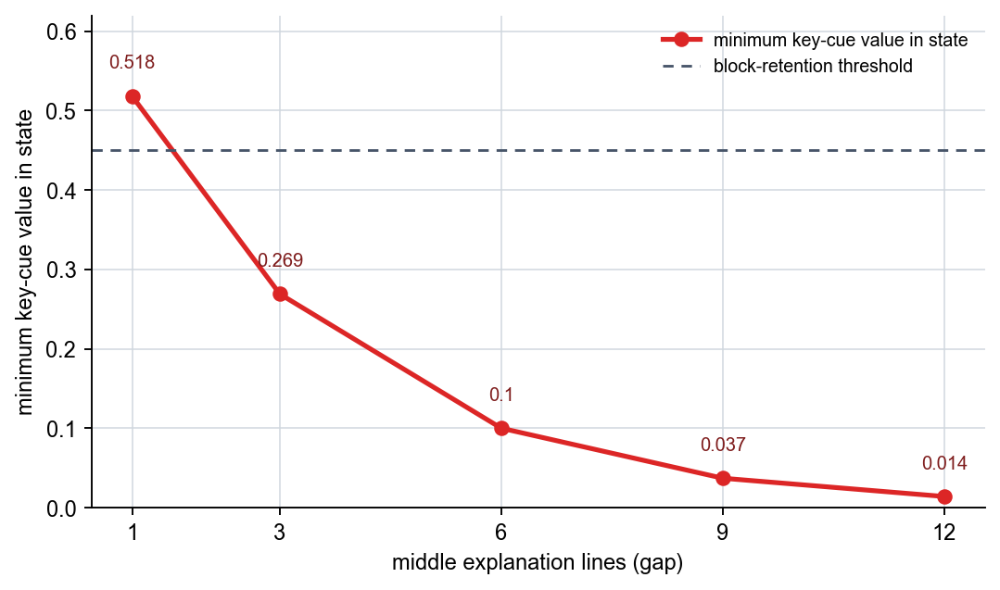
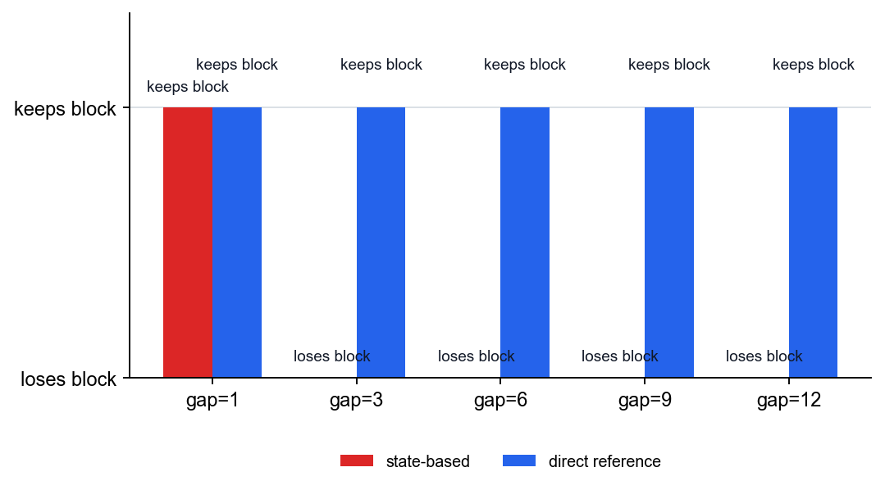

# P5-12.2 Long-Term Dependency

> Section ID: `P5-12.2`
> Version: `v2026.07.20`

In P5-12.1, we explained that RNNs, LSTMs, and GRUs are structures that appeared to handle sequence data. The very next question appears here.

Why was it hard for sequential models to maintain information from far back all the way to the end, and why was that such a serious problem?

The concept that answers this question is long-term dependency.

Long-term dependency means a problem where information from far earlier matters for the current judgment, but the model cannot maintain or pass that information forward for long enough.

When reading the later attention chapters and needing to confirm again the starting point of the distance problem, return to the glossary entry on [long-term dependency](../../../reference/concept-glossary.md#long-term-dependency).

## The Question Of How Long-Term Dependencies Shape Current Decisions

- What does long-term dependency mean?
- Why does old information tend to weaken in a basic RNN?
- How does this problem appear in real sentences, speech, and time series?
- Why are LSTM and GRU connected to this problem?

The core point that this section needs to close first is that `a structure that passes sequential state forward is still not enough to bring a distant earlier cue stably into the current judgment`. In other words, here we first close `why an earlier cue disappears`, `why that shakes the current judgment`, and `to what extent LSTM/GRU tried to relieve it`. Attention itself is continued in the next chapter, P5-13.1.

## Standards For Distant Clues And State Preservation

- You can explain long-term dependency as `the problem where earlier information is needed but is not maintained well enough`.
- You can explain at an introductory level why a basic RNN struggles with long context.
- You can connect more clearly why LSTM and GRU appeared.
- You can explain why attention becomes the natural next topic.

## What Does Long-Term Dependency Mean

In sequence data, the meaning of the current position can depend on information that appeared much earlier.

For example, in a sentence, the subject at the very beginning can change the interpretation of a verb much later, and a prohibition condition near the front can reverse the action judgment at the end of the sentence. In speech, the pronunciation flow of an earlier segment may need to remain in order to interpret a later sound fragment. In time series, a small abnormal sign near the beginning can become the key evidence behind an alert judgment much later.

At such a time, to interpret the current position properly, the model may need to remember a cue from far back.

The key point is that the current judgment is not satisfied by only nearby information, and instead must continue referring to cues far back in the sequence.

Long-term dependency is not merely the problem `it would be nice if earlier information remained`. It asks, `if the earlier information is missing, does the current judgment itself become unstable?` When nearby cues alone do not close the answer, that is when long-term dependency appears as a real problem.

## Why Does A Basic RNN Easily Lose Old Information

An RNN carries the previous state at each step, but that state is updated every time by mixing it with the new input. The problem is that this update does not happen once or twice, but repeatedly. As the state goes through many steps, earlier cues can be overwritten, diluted, and mixed with other signals until their form becomes blurred.

It becomes easier if we imagine a small memo board on which new sentences keep being written. The sentence written just now is clear, but an important rule written much earlier becomes less noticeable as more new memos are piled on top. An RNN is similar. Its core idea is good, but in a long sequence it had the limitation that it was hard to manage precisely `what should remain for a long time`.

What matters in this section is not memorizing formulas first, but holding onto the feel that `as the state keeps being updated, information from far earlier can become fainter as it moves farther back`.

## Why Is This Not Just A Simple Performance Problem

Long-term dependency is not merely a problem of being `a little less accurate`. It changes the very way a sequential structure is interpreted. Some problems can be answered with only nearby information, but in other problems, the moment the older information drops out, the whole current judgment becomes distorted.

That is, the long-term dependency problem is a question about `how far the model can maintain context`. Here it becomes easier to understand if we separate `near cues` from `distant cues`.

| Cue type | Example |
| --- | --- |
| near cue | the immediately preceding word, or the sensor change over the last few seconds |
| distant cue | the subject at the start of the sentence, earlier tense information, or an abnormal sign much farther ahead |

Long-term dependency mainly appears when the second type matters.

## So What Were LSTM And GRU Trying To Do

As we saw in P5-12.1, LSTM and GRU are structures that try to manage memory better than a basic RNN.

The key is that they try to control more finely:

- what information should be kept
- what information should be discarded
- how strongly the current input should be reflected

so that long-term dependency can be handled better.

That is, LSTM and GRU can be seen as `structures that try to let information we want to remember survive for longer`.

This explanation also connects directly to the previous section. If we viewed the RNN in P5-12.1 as `a structure that passes state forward`, here we can read LSTM and GRU as `structures that made that state easier to preserve`.

## So The Next Chapter Question Appears

LSTM and GRU relieved the long-term dependency problem, but the burden of still having to pass state in sequence remained. So the next chapter changes the question slightly. It moves beyond `can we preserve a distant cue all the way inside the state` to `can we directly look again at the earlier position we need right now`.

In the present section, we do not spread this transition out at length. It is enough to hold only the point that `with state preservation alone, it is difficult to bring a distant cue stably all the way to the end`.

## Cases And Examples

### Representative Case. Interpreting A Long Work Instruction

Imagine a maintenance-procedure document where, near the front, there is a sentence saying `do not begin restart before the pressure has been fully released`, and later, in a work question, it asks again `can the line be brought back up now?` When people read a document roughly, they often look back only at the sentences near the question and summarize an answer while remembering only `restart`. But in reality, the earlier condition `the pressure must be released first` is the core, and if that sentence is missed, the result can be a dangerous restart instruction. A basic RNN has to keep preserving that earlier condition inside its state while moving through the long sentence flow, so an important cue from the front can become blurred as we move later.

So the result to confirm in this case is whether the model follows not only the sentences right near the current question, but also preserves the earlier no-restart condition to the end and reflects it in the final guidance.

The same viewpoint extends directly to long spoken work instructions and time-series anomaly detection. But the core point to hold in this section is not the domain name, but `how the current judgment shakes when a distant cue weakens inside the state`.

| Case | Cue that must remain from the beginning | Problem that appears as the middle gap becomes longer | Result to confirm in this section |
| --- | --- | --- | --- |
| interpreting a long work instruction | an earlier condition such as `restart is forbidden until the pressure is fully released` | by the time we reach the later question, the core safety condition can become blurred | whether the final guidance reflects the earlier condition together with the current question |
| recognizing a long spoken work instruction | earlier audio cues about prohibition conditions, exceptions, and scope of action | as we move toward the later action phrases, the earlier spoken cue can weaken | whether the earlier cue is preserved even at the final interpretation point |
| time-series anomaly detection | an early increase in vibration or an early configuration anomaly | recent values can remain while the initial anomaly sign becomes faint | whether the final alert still reflects the early abnormal signal |

| Standard that is easy for a person to see first | Standard to reread from the sequential-state viewpoint |
| --- | --- |
| it feels sufficient to look only at the sentence right near the question or the most recent sensor value | even if nearby cues remain well, a distant earlier cue can become faint after passing through many steps |
| once we read an earlier cue, it feels as if it will naturally remain later too | while the state keeps being updated, exception conditions, subjects, and early anomaly signals can weaken |
| it feels like only a small loss of performance | if the earlier cue disappears, it becomes a structural problem in which the current judgment itself shakes |

The result that ultimately needs to be confirmed across these cases is clear. The core of long-term dependency is not simply `does the model remember a distant cue well`, but `if that cue drops out, does the current judgment actually become unstable?`

## If We Draw This Very Simply

```mermaid
--8<-- "assets/part-05/chapter-12/long-term-dependency-flow-en.mmd"
```

The result to confirm in this diagram is that as the important cue from an earlier input passes through repeated state updates and approaches the current decision stage, it can gradually weaken.

## Practice And Example

The goal of this example is to confirm directly how quickly a sequential state loses an earlier cue as the gap between `the early rule` and `the final question` grows longer. We place the input in a CSV file where lines from several documents are mixed together. Python restores the line order for each `document_id`, then compares state weakening by gap length. Direct reference is not code that implements attention. It is only a comparison baseline for contrasting `a baseline that can look again at a far earlier position` with a state-preservation method.

Input:

- one line of a core no-restart rule at the very beginning of the document
- middle explanation sections of different lengths
- one identical restart question at the end of the document
- input file: [`long-dependency-instruction-log.csv`](../../../assets/part-05/chapter-12/long-dependency-instruction-log.csv){ .csv-preview }

Output:

- the final state value for each gap length
- the state-based decision result
- the minimum state-based key-cue value at the question point
- the direct-reference decision result that finds the earlier rule again
- the direct match score between the question line and the rule line

Problem situation:

- in long context, the question is how strongly the earlier rule remains by the time we reach the later question, and sequential state alone can weaken

Concepts to confirm:

- as time grows longer, sequential state can leave earlier cues more weakly
- if we compare direct reference with state-based judgment, the long-term dependency problem becomes more intuitive

Input:

A row in the CSV means one line inside one document. `document_id` groups rows from the same document, `gap` is the number of middle explanation lines between the rule line and the question line, `line_no` is the line order inside the document, and `role` distinguishes rule, middle explanation, and question. The Python example reads this file, restores the line order by document, and calculates how much of the earlier rule cue remains inside the state at the question point.

Before looking at the code, it helps to predict first what outputs will shake as the gap becomes longer and what outputs will remain stable. That makes the difference between `state preservation` and `direct reference` clearer.

| Comparison item | Output to predict first | Why that is the prediction |
| --- | --- | --- |
| `state_support` | it is likely to keep shrinking as the gap grows longer | because earlier cues such as `restart`, `blocked`, and `pressure` keep passing through decay and gradually weaken |
| `state_decision` | with a short gap it is likely to be `keeps block`, and with a long gap it is likely to change to `loses block` | if the core prohibition condition does not remain enough inside the state, the final judgment can shake |
| `direct_match_score` | it is likely to stay stable even if the gap grows longer | direct reference picks up the same earlier rule line again, so the gap itself does not directly lower the score |
| `direct_decision` | it is likely to remain `keeps block` for every gap | if we can find the earlier rule position again at the question point, there is less reason to lose the prohibition condition |

The purpose of this table is not to memorize the exact numbers in advance. Even with the same rule and the same question, it is there to help hold before the code that sequential state can shake as the gap grows longer, while direct reference can pick up the same position again.

```python
from collections import defaultdict
from pathlib import Path
import csv

DATA_PATH = Path("docs/assets/part-05/chapter-12/long-dependency-instruction-log.csv")
DECAY = 0.72
SUPPORT_THRESHOLD = 0.45

def load_documents(path):
    documents = defaultdict(list)
    with path.open(encoding="utf-8", newline="") as f:
        for row in csv.DictReader(f):
            documents[row["document_id"]].append(row)
    for rows in documents.values():
        rows.sort(key=lambda row: int(row["line_no"]))
    return dict(sorted(documents.items(), key=lambda item: int(item[1][0]["gap"])))

def sequential_state(rows, decay=DECAY):
    state = {"restart": 0.0, "blocked": 0.0, "pressure": 0.0}
    for row in rows:
        lowered = row["text"].lower()
        for key in state:
            state[key] *= decay
        if "restart" in lowered:
            state["restart"] += 1.0
        if "blocked" in lowered:
            state["blocked"] += 1.0
        if "pressure" in lowered or "vented" in lowered:
            state["pressure"] += 1.0
    support = round(min(state.values()), 3)
    decision = "keeps block" if support >= SUPPORT_THRESHOLD else "loses block"
    return {key: round(value, 3) for key, value in state.items()}, support, decision

def direct_reference(rows):
    best = (0, "", "")
    for row in rows:
        if row["role"] == "question":
            continue
        lowered = row["text"].lower()
        score = sum(1 for keyword in ["restart", "blocked", "pressure"] if keyword in lowered)
        if score > best[0]:
            best = (score, row["line_no"], row["text"])
    decision = "keeps block" if best[0] == 3 else "loses block"
    return best, decision

documents = load_documents(DATA_PATH)

print(f"Control variables: DECAY={DECAY}, SUPPORT_THRESHOLD={SUPPORT_THRESHOLD}")
print()
print("[summary: how much of the earlier rule cue remains as the gap grows]")
print("document_id  gap  lines  state_support  state_decision  direct_score  direct_decision")
for document_id, rows in documents.items():
    state_snapshot, state_support, state_decision = sequential_state(rows)
    best_match, direct_decision = direct_reference(rows)
    print(
        f"{document_id:10} {rows[0]['gap']:>4} {len(rows):>6} "
        f"{state_support:>14.3f}  {state_decision:14} "
        f"{best_match[0]:>12}  {direct_decision}"
    )

print()
print("[trace: doc_gap_6]")
trace_rows = documents["doc_gap_6"]
state_snapshot, state_support, state_decision = sequential_state(trace_rows)
best_match, direct_decision = direct_reference(trace_rows)
print("state_snapshot =", state_snapshot)
print("state_support =", state_support)
print("state_decision =", state_decision)
print("best_direct_match =", best_match[2])
print("direct_decision =", direct_decision)
```

In the output, start by looking at whether `state_support` weakens as the gap grows. `direct_score` and `direct_decision` are not the result of implementing attention. They are only a comparison baseline showing that, if the same earlier rule line can be found again, distance itself does not directly lower the judgment.

```text
Control variables: DECAY=0.72, SUPPORT_THRESHOLD=0.45

[summary: how much of the earlier rule cue remains as the gap grows]
document_id  gap  lines  state_support  state_decision  direct_score  direct_decision
doc_gap_1     1      3          0.518  keeps block               3  keeps block
doc_gap_3     3      5          0.269  loses block               3  keeps block
doc_gap_6     6      8          0.100  loses block               3  keeps block
doc_gap_9     9     11          0.037  loses block               3  keeps block
doc_gap_12   12     14          0.014  loses block               3  keeps block

[trace: doc_gap_6]
state_snapshot = {'restart': 1.1, 'blocked': 0.1, 'pressure': 0.1}
state_support = 0.1
state_decision = loses block
best_direct_match = Rule restart stays blocked until vessel pressure is fully vented
direct_decision = keeps block
```

- even with the same no-restart rule and the same question, as the gap between them grows longer, the `blocked` and `pressure` cues inside the sequential state weaken quickly
- `state_support` shows how much of the core cue remains at the question point, and it drops quickly as the gap grows longer
- when the number of middle explanation lines increases, the state-based method becomes more likely to lose the earlier core safety condition
- the direct-reference comparison is only a baseline for the next chapter. Here `direct_score` remains 3 throughout, so we only confirm that the distance problem appears more directly in the state-preservation method

The first result to look at in this example is the flow in which `state_support` falls below the threshold as the gap grows longer. Even with the same rule and the same question, when more middle explanation lines are inserted, the `blocked` and `pressure` cues inside the sequential state weaken quickly.



The second result is the difference between the state-based decision and the direct-reference comparison baseline. From `gap=3`, the state-based decision changes to `loses block`, but the direct-reference baseline keeps `keeps block` because it can pick up the earlier rule line again.



If we reread the output as an operational judgment, it becomes clearer that the long-term dependency problem is not only a score drop, but a shaking in how a safety measure is interpreted.

| Gap interval | Interpretation easy to keep from the state-based side | Interpretation that changes when direct reference is included |
| --- | --- | --- |
| `gap=1` | the earlier prohibition rule still remains enough, so the no-restart judgment is maintained | even when sequential state alone can endure, direct reference picks up the same evidence again more explicitly |
| `gap=3` | as the middle explanation grows, the prohibition evidence becomes blurred and the no-restart judgment starts to shake | if we look up the earlier rule line again, the no-restart judgment can still be maintained |
| `gap=6` | if we look only at the information near the final question, the prohibition evidence is almost lost | even when the gap is long, if we refer again to the core rule position, the safety condition is not missed |

## Conclusion To Hold From This Example

This simple comparison code does not implement attention itself. But the connection we need to read is clear. On the sequential-state side, the core question is `can the earlier cue remain inside the state`, and the fact that this state can shake as the gap grows longer is the core point of the present section.

If we just saw in P5-12.1 `a structure that carries sequential state forward`, here we need to understand where that structure begins to run into limits. Rather than memorizing only the structure names, we should first hold `what problem made the next structure necessary`. In the next section, P5-13.1, we continue with why `a way of looking again at the needed earlier position` appeared in order to overcome this limit.

## Checklist

- Can you explain long-term dependency as `the problem where old information matters but is not maintained well enough, so the current judgment shakes`?
- Can you say why the difficulty of maintaining old information leads to attention?
- Can you say that in a basic RNN, a distant earlier cue can easily weaken as time grows longer?
- Can you explain that LSTM and GRU are structures that try to handle this problem better?
- Can you explain why `state_support` shrinks as the gap grows longer?
- Can you talk about state preservation and direct reference as two different ideas?
- When reading the next chapter on attention, are you ready first to ask `which earlier position needs to be looked at again`?

## Sources And References

- Sepp Hochreiter, Jürgen Schmidhuber, `Long Short-Term Memory`, Neural Computation, 1997, checked on 2026-07-19. [https://doi.org/10.1162/neco.1997.9.8.1735](https://doi.org/10.1162/neco.1997.9.8.1735){: target="_blank" rel="noopener noreferrer" }
- Yoshua Bengio, Patrice Simard, Paolo Frasconi, `Learning Long-Term Dependencies with Gradient Descent is Difficult`, IEEE Transactions on Neural Networks, 1994, checked on 2026-07-19. [https://doi.org/10.1109/72.279181](https://doi.org/10.1109/72.279181){: target="_blank" rel="noopener noreferrer" }
- Ian Goodfellow, Yoshua Bengio, Aaron Courville, `Deep Learning`, MIT Press, 2016, checked on 2026-06-29. [https://www.deeplearningbook.org/](https://www.deeplearningbook.org/){: target="_blank" rel="noopener noreferrer" }
