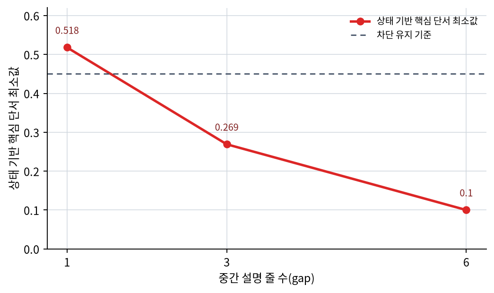
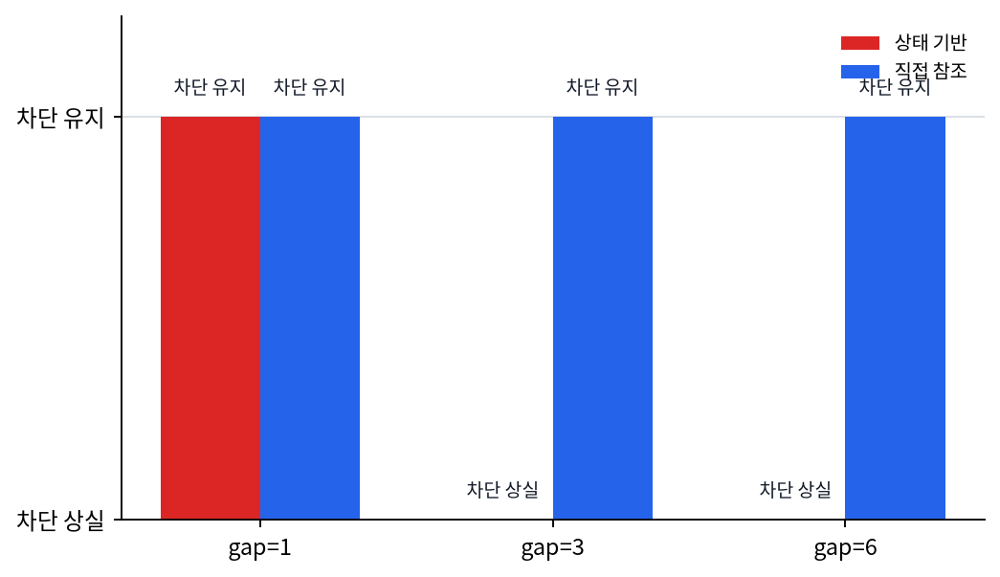

# P5-12.2 장기 의존성(long-term dependency)

> Section ID: `P5-12.2`
> Version: `v2026.07.19`

P5-12.1에서는 RNN, LSTM, GRU가 순차 데이터(sequence data)를 다루기 위해 등장한 구조라고 설명했습니다. 여기서 바로 다음 질문이 생깁니다.

왜 순차 모델은 오래전 정보를 끝까지 유지하기 어려웠고, 그것이 왜 큰 문제였는가?

이 질문에 답하는 개념이 장기 의존성(long-term dependency)입니다.

장기 의존성은 현재 판단에 오래전 정보가 중요한데도, 모델이 그 정보를 충분히 오래 유지하거나 전달하지 못하는 문제를 뜻합니다.

이후 attention 장을 읽다가 거리 문제의 출발점을 다시 확인해야 할 때는 개념사전의 [장기 의존성(long-term dependency)](../../../reference/concept-glossary.md#long-term-dependency) 항목으로 돌아갑니다.

## 이 절의 범위

- 장기 의존성은 무엇을 뜻하는가?
- 왜 기본 RNN에서는 오래전 정보가 약해지기 쉬운가?
- 이 문제가 실제 문장, 음성, 시계열에서 어떻게 드러나는가?
- LSTM과 GRU가 왜 이 문제와 연결되는가?

이 절에서 먼저 닫아야 하는 핵심은 `순차 상태를 넘기는 구조만으로는 먼 앞 단서를 현재 판단까지 안정적으로 들고 오기 어렵다`는 점입니다. 즉, 여기서는 `오래전 단서가 왜 사라지는가`, `그것이 왜 현재 판단을 흔드는가`, `LSTM/GRU는 이를 어디까지 완화하려 했는가`를 먼저 닫습니다. attention 자체는 다음 장 P5-13.1에서 이어서 다룹니다.

## 이 절의 목표

- 장기 의존성을 `오래전 정보가 필요한데 잘 유지되지 않는 문제`로 설명할 수 있습니다.
- 기본 RNN이 긴 문맥을 다루기 어려운 이유를 입문 수준에서 말할 수 있습니다.
- LSTM과 GRU가 왜 등장했는지 더 분명히 연결할 수 있습니다.
- attention이 왜 자연스러운 다음 주제가 되는지 설명할 수 있습니다.

## 장기 의존성은 무엇을 뜻하나

순차 데이터에서는 현재 위치의 의미가 훨씬 앞에 있던 정보에 달려 있을 수 있습니다.

예를 들어 문장에서는 맨 앞의 주어가 한참 뒤 동사의 해석을 바꿀 수 있고, 앞부분의 금지 조건이 문장 끝의 행동 판단을 뒤집을 수 있습니다. 음성에서는 앞 구간의 발음 흐름이 뒤 소리 조각의 해석에 남아 있어야 합니다. 시계열에서는 초반 이상 징후가 한참 뒤 경보 판단의 핵심 근거가 될 수 있습니다.

이때 현재 위치를 제대로 해석하려면, 오래전 단서를 기억하고 있어야 할 수 있습니다.

핵심은 현재 판단이 가까운 정보만으로는 부족하고, 한참 앞의 단서까지 이어서 참조해야 한다는 점입니다.

장기 의존성은 `이전 정보가 있으면 좋다` 정도의 문제가 아니라, `오래전 정보가 없으면 현재 판단 자체가 흔들리는가`를 묻는 문제입니다. 가까운 단서만으로는 답이 닫히지 않을 때, 그때 장기 의존성이 실제 문제로 드러납니다.

## 왜 기본 RNN은 오래전 정보를 놓치기 쉬운가

RNN은 각 step에서 이전 상태를 이어받지만, 그 상태는 매번 새 입력과 섞이며 갱신됩니다. 문제는 이 갱신이 한두 번이 아니라 계속 반복된다는 점입니다. 상태를 여러 번 거칠수록 앞에서 들어온 단서는 덮이고, 희석되고, 다른 신호와 섞여 형태가 흐려질 수 있습니다.

작은 메모판에 새 문장을 계속 덧쓰는 상황을 떠올리면 더 쉽습니다. 방금 적은 문장은 또렷하지만, 오래전에 적은 중요한 규칙은 계속 새 메모가 올라오면 점점 눈에 덜 띄게 됩니다. RNN도 비슷하게, 핵심 아이디어는 좋지만 긴 시퀀스에서는 `무엇을 오래 남길지`를 정교하게 관리하기 어렵다는 한계가 있었습니다.

이 절에서 중요한 것은 수식을 먼저 외우는 일이 아니라, `상태를 계속 갱신하다 보면 오래전 정보가 뒤로 갈수록 희미해질 수 있다`는 감각을 잡는 것입니다.

## 왜 이것이 단순한 성능 문제가 아닌가

장기 의존성은 단순히 `조금 덜 정확하다` 정도의 문제가 아니라, 순차 구조를 해석하는 방식 자체를 바꿉니다. 어떤 문제는 가까운 정보만 보면 충분하지만, 어떤 문제는 오래전 정보가 빠지는 순간 현재 판단 전체가 틀어지기 때문입니다.

즉, 장기 의존성 문제는 모델이 `얼마나 멀리까지 문맥을 유지할 수 있는가`에 대한 질문입니다. 여기서는 `가까운 단서`와 `먼 단서`를 나눠 보면 이해가 빨라집니다.

| 단서 유형 | 예 |
| --- | --- |
| 가까운 단서 | 바로 앞 단어, 직전 몇 초의 센서 변화 |
| 먼 단서 | 문장 맨 앞 주어, 오래전 시제 정보, 훨씬 앞쪽 이상 징후 |

장기 의존성은 주로 두 번째 유형이 중요할 때 드러납니다.

## 그래서 LSTM과 GRU는 무엇을 하려 했나

P5-12.1에서 본 것처럼 LSTM과 GRU는 기본 RNN보다 더 잘 기억을 관리하려는 구조입니다.

핵심은 어떤 정보는 남기고 어떤 정보는 버리며, 현재 입력을 얼마나 반영할지를 더 세밀하게 조절한다는 점입니다.

- 어떤 정보는 남기고
- 어떤 정보는 버리고
- 현재 입력을 얼마나 반영할지

를 더 세밀하게 조절해, 장기 의존성을 더 잘 다루려는 시도입니다.

즉, LSTM과 GRU는 `오래 기억하고 싶은 정보를 더 오래 살아남게 하려는 구조`라고 볼 수 있습니다.

이 설명은 바로 앞 절과도 이어집니다. P5-12.1에서 RNN을 `상태를 넘기는 구조`로 봤다면, 여기서는 LSTM과 GRU를 `그 상태를 더 잘 보존하게 만든 구조`로 읽으면 됩니다.

## 그래서 다음 장 질문이 생긴다

LSTM과 GRU는 장기 의존성 문제를 완화했지만, 여전히 상태를 차례대로 전달해야 한다는 부담은 남아 있었습니다. 그래서 다음 장에서는 질문이 조금 바뀝니다. `오래전 단서를 상태 안에 끝까지 보존할 수 있는가`를 넘어서, `지금 필요한 앞 위치를 다시 직접 볼 수 있는가`가 다음 질문이 됩니다.

현재 절에서는 이 전환을 길게 펼치지 않고, `상태 보존만으로는 먼 단서를 끝까지 안정적으로 들고 오기 어렵다`는 지점까지만 붙잡으면 충분합니다.

## 사례 및 예시

### 대표 사례. 긴 작업 지시 해석

정비 절차 문서 앞부분에 `압력을 완전히 해소하기 전에는 재기동을 시작하면 안 된다`라는 문장이 있고, 뒤쪽 작업 질문에서 `지금 라인을 다시 올려도 되는가?`를 다시 묻는 상황을 생각해 보겠습니다. 사람이 문서를 대충 읽을 때는 보통 질문 바로 근처 문장만 다시 보고 `재기동`만 기억한 채 답을 정리하기 쉽습니다. 그런데 실제로는 앞쪽의 `압력을 먼저 해소해야 한다`는 조건이 핵심이라, 그 문장을 놓치면 위험한 재기동 안내를 내릴 수 있습니다. basic RNN은 긴 문장을 따라가며 이런 앞쪽 조건을 상태 안에 계속 보존해야 하므로, 뒤로 갈수록 중요한 단서가 흐려질 수 있습니다.

그래서 이 사례에서 확인해야 할 결과는 현재 질문 시점이 바로 근처 문장만 따르지 않고, 앞쪽의 재기동 금지 조건을 끝까지 유지해 최종 안내에 반영하는가입니다.

같은 관점은 긴 음성 작업 지시나 시계열 이상 탐지에도 그대로 이어집니다. 다만 이 절에서 붙잡을 핵심은 도메인 이름이 아니라, `먼 단서가 상태 안에서 약해질 때 현재 판단이 어떻게 흔들리는가`입니다.

| 사례 | 초반에 꼭 남아 있어야 하는 단서 | 중간 간격이 길어질수록 생기는 문제 | 이 절에서 확인할 결과 |
| --- | --- | --- | --- |
| 긴 작업 지시 해석 | `압력을 완전히 해소하기 전에는 재기동 금지` 같은 앞 조건 | 뒤 질문 시점에는 핵심 안전 조건이 흐려질 수 있다 | 최종 안내가 앞 조건까지 함께 반영하는가 |
| 긴 음성 작업 지시 인식 | 앞 오디오 구간의 금지 조건, 예외 조항, 조치 범위 단서 | 뒤쪽 조치 표현으로 갈수록 앞 음성 단서가 약해질 수 있다 | 마지막 해석 시점에서도 앞 단서가 유지되는가 |
| 시계열 이상 탐지 | 초반의 작은 진동 증가나 설정 이상 | 최근 값만 남고 초기 이상 징후가 희미해질 수 있다 | 마지막 경보가 초반 이상 신호까지 반영하는가 |

| 사람이 먼저 보기 쉬운 기준 | 순차 상태 관점으로 다시 읽는 기준 |
| --- | --- |
| 질문 바로 근처 문장이나 최근 센서값만 보면 충분하다고 느끼기 쉽다 | 가까운 단서는 잘 남아도 먼 앞 단서는 여러 step을 지나며 희미해질 수 있다 |
| 앞 단서를 한 번 읽었으면 뒤에서도 계속 유지될 것 같다고 생각하기 쉽다 | 상태를 계속 갱신하는 동안 예외 조건, 주어, 초기 이상 신호가 약해질 수 있다 |
| 성능이 조금 떨어지는 문제 정도로 느끼기 쉽다 | 앞 단서가 사라지면 현재 판단 자체가 흔들리는 구조 문제가 된다 |

이 사례들에서 최종적으로 확인해야 할 결과는 분명합니다. 장기 의존성의 핵심은 `먼 단서를 잘 기억하느냐`가 아니라, 그 단서가 빠지면 현재 판단이 실제로 흔들리는가에 있습니다.

## 이를 아주 단순하게 그리면

```mermaid
--8<-- "assets/part-05/chapter-12/long-term-dependency-flow-ko.mmd"
```

이 도식에서 확인해야 할 결과는 오래전 입력의 중요한 단서가 상태 갱신을 거치며 현재 결정 단계에 도달할수록 점점 약해질 수 있다는 점입니다.

## 연습 및 예제

이번 예제의 목표는 `초반 규칙`과 `마지막 질문` 사이의 간격이 길어질수록, 순차 상태가 앞 단서를 얼마나 빨리 잃는지 직접 확인하는 것입니다. 비교를 위해 같은 문맥을 `직접 다시 찾는 방식`과도 나란히 두지만, 여기서 먼저 붙잡아야 할 핵심은 상태 기반 방식이 gap 길이에 따라 어떻게 흔들리는가입니다.

입력:

- 문서 맨 앞의 핵심 재기동 금지 규칙 한 줄
- 길이가 다른 중간 설명 구간
- 문서 끝의 같은 재기동 질문 한 줄

출력:

- 간격 길이별 최종 상태값
- 상태 기반 판정 결과
- 질문 시점에서의 상태 기반 핵심 단서 최소값
- 앞 규칙을 다시 찾는 direct reference 판정 결과
- 질문과 규칙 줄 사이의 direct match score

문제 상황:

- 긴 문맥에서는 앞에서 본 규칙이 뒤 질문 시점까지 얼마나 남는지 순차 상태만으로는 약해질 수 있다

확인할 개념:

- 순차 상태는 시간이 길어질수록 앞 단서를 약하게 남길 수 있다
- 직접 참조와 상태 기반 판단을 비교하면 장기 의존성 문제가 더 직관적으로 보인다

입력(input):

위에 정리한 규칙 문장, 질문 문장, 문서 줄 목록을 사용합니다.

코드를 보기 전에 먼저 gap이 길어질수록 어떤 출력이 흔들리고 어떤 출력은 유지될지 예상해 보면, `상태 보존`과 `직접 참조`의 차이가 더 잘 보입니다.

| 비교 항목 | 먼저 예상해 볼 출력 | 예상 이유 |
| --- | --- | --- |
| `state_support` | gap이 길어질수록 계속 작아질 가능성이 큼 | `restart`, `blocked`, `pressure` 같은 앞 단서가 decay를 거치며 점점 약해지기 때문입니다. |
| `state_decision` | 짧은 gap에서는 `keeps block`, 긴 gap에서는 `loses block`으로 바뀔 가능성이 큼 | 핵심 금지 조건이 상태 안에 충분히 남지 않으면 최종 판단이 흔들릴 수 있습니다. |
| `direct_match_score` | gap이 길어져도 유지될 가능성이 큼 | 직접 참조는 같은 규칙 줄을 다시 집어 올리므로 간격 자체가 점수를 직접 깎지 않습니다. |
| `direct_decision` | 모든 gap에서 `keeps block`으로 유지될 가능성이 큼 | 질문 시점마다 앞의 규칙 위치를 다시 찾을 수 있다면 금지 조건을 놓칠 이유가 줄어듭니다. |

이 표의 목적은 정확한 숫자를 미리 외우는 데 있지 않습니다. 같은 규칙과 같은 질문이어도, 순차 상태는 간격이 길어질수록 흔들리고 직접 참조는 같은 위치를 다시 집어 올릴 수 있다는 차이를 코드 전에 붙잡는 데 있습니다.

```python
restart_block_rule = "Rule: restart stays blocked until vessel pressure is fully vented."
restart_question = "Question: can the line restart now?"

def sequential_state(instruction_document, decay=0.72):
    state = {"restart": 0.0, "blocked": 0.0, "pressure": 0.0}
    for line in instruction_document:
        lowered = line.lower()
        for key in state:
            state[key] *= decay
        if "restart" in lowered:
            state["restart"] += 1.0
        if "blocked" in lowered:
            state["blocked"] += 1.0
        if "pressure" in lowered or "vented" in lowered:
            state["pressure"] += 1.0
    support = round(min(state.values()), 3)
    decision = "keeps block" if support >= 0.45 else "loses block"
    return {key: round(value, 3) for key, value in state.items()}, support, decision

def direct_reference(instruction_document):
    matches = []
    for idx, line in enumerate(instruction_document[:-1], start=1):
        lowered = line.lower()
        score = 0
        for keyword in ["restart", "blocked", "pressure"]:
            if keyword in lowered:
                score += 1
        matches.append((score, idx, line))
    best = max(matches)
    decision = "keeps block" if best[0] == 3 else "loses block"
    return best, decision

for gap in [1, 3, 6]:
    filler = [
        f"Detail line {i}: general maintenance note only."
        for i in range(1, gap + 1)
    ]
    instruction_document = [restart_block_rule] + filler + [restart_question]
    state_snapshot, state_support, state_decision = sequential_state(instruction_document)
    best_match, direct_decision = direct_reference(instruction_document)
    print(f"[gap={gap}]")
    print("document_length =", len(instruction_document))
    print("state_snapshot =", state_snapshot)
    print("state_support =", state_support)
    print("state_decision =", state_decision)
    print("direct_match_score =", best_match[0])
    print("best_direct_match =", best_match[2])
    print("direct_decision =", direct_decision)
    print()
```

출력에서는 gap이 커질수록 state_support가 약해지고 direct_match_score는 유지되는지부터 보면 됩니다.

```text
[gap=1]
document_length = 3
state_snapshot = {'restart': 1.518, 'blocked': 0.518, 'pressure': 0.518}
state_support = 0.518
state_decision = keeps block
direct_match_score = 3
best_direct_match = Rule: restart stays blocked until vessel pressure is fully vented.
direct_decision = keeps block

[gap=3]
document_length = 5
state_snapshot = {'restart': 1.269, 'blocked': 0.269, 'pressure': 0.269}
state_support = 0.269
state_decision = loses block
direct_match_score = 3
best_direct_match = Rule: restart stays blocked until vessel pressure is fully vented.
direct_decision = keeps block

[gap=6]
document_length = 8
state_snapshot = {'restart': 1.1, 'blocked': 0.1, 'pressure': 0.1}
state_support = 0.1
state_decision = loses block
direct_match_score = 3
best_direct_match = Rule: restart stays blocked until vessel pressure is fully vented.
direct_decision = keeps block
```

- 같은 재기동 금지 규칙과 같은 질문이라도, 둘 사이의 간격이 길어질수록 순차 상태 안의 `blocked`, `pressure` 단서가 빠르게 약해집니다
- `state_support`는 질문 시점에서 핵심 단서가 얼마나 남아 있는지를 보여 주며, gap이 길어질수록 빠르게 줄어듭니다
- 상태 기반 방식은 중간 설명 줄이 늘어나면 앞의 핵심 안전 조건을 잃기 쉬워집니다
- 직접 다시 찾는 방식은 간격이 길어져도 같은 규칙 줄을 다시 집어 올 수 있고, 여기서는 `direct_match_score`가 계속 3으로 유지됩니다

이 예제에서 먼저 볼 산출물은 gap이 길어질 때 `state_support`가 기준선 아래로 내려가는 흐름입니다. 같은 규칙과 같은 질문이라도, 중간 설명 줄이 늘어나면 순차 상태 안의 `blocked`, `pressure` 단서가 빠르게 약해집니다.



두 번째 산출물은 상태 기반 판정과 직접 참조 판정의 차이입니다. `gap=3`, `gap=6`에서는 상태 기반 판정이 `loses block`으로 바뀌지만, 직접 참조는 앞 규칙 줄을 다시 집어 올 수 있으므로 `keeps block`을 유지합니다.



출력을 운영 판단으로 다시 읽으면 장기 의존성 문제가 단순 점수 하락이 아니라 안전 조치 해석의 흔들림이라는 점이 더 분명해집니다.

| gap 구간 | state 기반으로 남기 쉬운 해석 | direct reference까지 보면 바뀌는 해석 |
| --- | --- | --- |
| `gap=1` | 앞 금지 규칙이 아직 남아 있어 재기동 차단 판단을 유지한다 | 순차 상태만으로도 버티지만, 직접 참조는 같은 근거를 더 명시적으로 다시 집어 온다 |
| `gap=3` | 중간 설명이 늘자 금지 근거가 흐려져 차단 판단이 흔들리기 시작한다 | 앞 규칙 줄을 다시 찾으면 재기동 금지 판단을 계속 유지할 수 있다 |
| `gap=6` | 마지막 질문 근처 정보만 보면 금지 근거를 거의 잃어버린다 | 간격이 길어져도 핵심 규칙 위치를 다시 참조하면 안전 조건을 놓치지 않는다 |

## 이 예제에서 붙잡아야 할 결론

이 간단한 비교 코드는 attention 자체를 구현한 것은 아닙니다. 하지만 읽어야 할 연결은 분명합니다. 순차 상태 쪽은 `앞 단서를 상태 안에 계속 남겨 둘 수 있는가`가 핵심이고, gap이 길어질수록 그 상태가 흔들릴 수 있다는 점이 지금 절의 핵심입니다.

바로 앞의 P5-12.1에서 `순차 상태를 이어받는 구조`를 보았다면, 여기서는 그 구조가 어디에서 막히는지를 이해해야 합니다. 단순히 구조 이름을 외우는 대신, `무엇이 문제였기 때문에 다음 구조가 나왔는가`를 먼저 붙잡아야 합니다. 다음 절 P5-13.1에서는 이 한계를 넘기 위해 왜 `필요한 위치를 다시 보는 방식`이 등장하는지를 이어서 설명합니다.

## 체크리스트

- 장기 의존성(long-term dependency)이 어떤 문제를 뜻하는지 설명할 수 있는가?
- 오래전 정보를 유지하기 어려운 점이 왜 attention으로 이어지는지 말할 수 있는가?
- 장기 의존성은 오래전 정보가 중요한데도 충분히 유지되지 않는 문제라는 점을 설명할 수 있는가?
- 기본 RNN에서는 시간이 길어질수록 오래전 단서가 약해지기 쉽다는 점을 말할 수 있는가?
- LSTM과 GRU는 이 문제를 더 잘 다루려는 구조라는 점을 설명할 수 있는가?
- 장기 의존성을 `기억이 조금 약해진다` 정도가 아니라 `오래전 단서가 없으면 현재 판단 자체가 흔들리는가`의 문제로 설명할 수 있는가?
- 상태 보존과 직접 참조를 서로 다른 발상으로 나눠 말할 수 있는가?
- 다음 장의 attention을 읽을 때도 먼저 `어떤 앞 위치를 다시 봐야 하는가`를 떠올릴 준비가 되어 있는가?

## 출처와 참고 자료

- Sepp Hochreiter, Jürgen Schmidhuber, `Long Short-Term Memory`, Neural Computation, 1997, 확인 날짜: 2026-07-19. [https://doi.org/10.1162/neco.1997.9.8.1735](https://doi.org/10.1162/neco.1997.9.8.1735){: target="_blank" rel="noopener noreferrer" }
- Yoshua Bengio, Patrice Simard, Paolo Frasconi, `Learning Long-Term Dependencies with Gradient Descent is Difficult`, IEEE Transactions on Neural Networks, 1994, 확인 날짜: 2026-07-19. [https://doi.org/10.1109/72.279181](https://doi.org/10.1109/72.279181){: target="_blank" rel="noopener noreferrer" }
- Ian Goodfellow, Yoshua Bengio, Aaron Courville, `Deep Learning`, MIT Press, 2016, 확인 날짜: 2026-06-29. [https://www.deeplearningbook.org/](https://www.deeplearningbook.org/){: target="_blank" rel="noopener noreferrer" }
