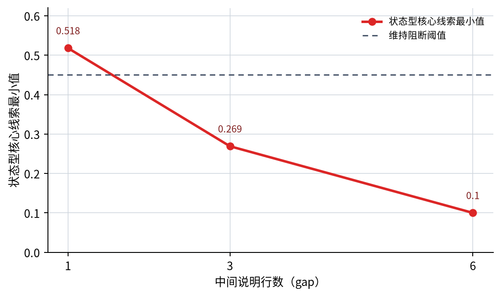
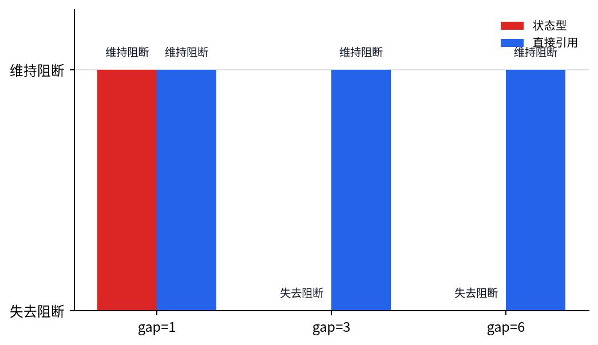

# P5-12.2 长期依赖（long-term dependency）

Section ID: `P5-12.2`
Version: `v2026.07.18`

在 P5-12.1 里，我们已经说明过，RNN、LSTM、GRU 是为了处理序列数据（sequence data）而出现的结构。这里紧接着就会出现下一个问题。

为什么序列模型很难把很早之前的信息一直保留到最后，而这又为什么会成为很大的问题？

回答这个问题的概念，就是长期依赖（long-term dependency）。

长期依赖指的是：当前判断需要很久以前的信息，但模型却无法把这条信息稳定地保留或传递足够久。

之后在阅读 attention 章节时，如果需要再次确认距离问题的出发点，可以回到英文概念词汇表里的 [long-term dependency](/AiBook/en/reference/concept-glossary/#long-term-dependency)条目重新对齐。

## 本节范围

- long-term dependency 指的是什么？
- 为什么在 basic RNN 里，久远以前的信息容易变弱？
- 这个问题会怎样出现在真实句子、语音和时间序列里？
- 为什么 LSTM 和 GRU 会和这个问题连在一起？

本节首先要收住的核心，是`只靠把序列状态继续传下去，还不足以把很远之前的线索稳定带进当前判断`。也就是说，这里先收住的是`为什么早期线索会消失`、`为什么这会摇动当前判断`、以及`LSTM/GRU 想把这个问题缓解到什么程度`。attention 本身会在下一章 P5-13.1 继续展开。

## 本节目标

- 能把长期依赖解释成`明明需要早期信息，但它没有被保留得足够好`这个问题。
- 能在入门层次说明为什么 basic RNN 难以处理很长的上下文。
- 能更清楚地说明为什么 LSTM 和 GRU 会出现。
- 能解释为什么 attention 会成为自然的下一个主题。

## 长期依赖指的是什么

在序列数据里，当前位置的意义，可能依赖于很久以前出现过的信息。

例如，在句子里，最前面的主语可能会改变很后面动词的解释；前面出现的禁止条件，也可能会推翻句尾的动作判断。在语音里，前一段发音流程可能必须保留下来，后面的声音碎片才解释得准。在时间序列里，开头阶段的一点异常征兆，也可能会变成很久之后警报判断的关键依据。

这时，如果想把当前位置解释正确，就可能必须记住很久以前的线索。

关键点在于：当前判断并不能只靠附近信息就收住，而是必须继续参考很远之前的线索。

长期依赖并不只是`前面信息如果能留下来会更好`这么轻的问题。它真正问的是：`如果早期信息缺席了，当前判断本身会不会摇晃？` 当附近线索本身已经不足以把答案收住时，长期依赖就会真正显现成问题。

## 为什么 basic RNN 容易丢掉早期信息

RNN 会在每个 step 把前一状态继续带下去，但这个状态每次都会和新输入混在一起重新更新。问题在于，这种更新不是一两次，而是会不断重复。状态经过的 step 越多，前面进来的线索就越可能被覆盖、被稀释、被其他信号混在一起，最后变得模糊。

如果把它想成一块很小的备忘板，就更容易理解。刚刚写上去的新句子很清楚，但更早之前写下的重要规则，随着越来越多新备忘录叠上来，会慢慢没那么显眼。RNN 也类似。它的核心想法很好，但一旦序列变长，就会碰到一个限制：它很难精细地管理`什么应该长期留下来`。

本节真正重要的，不是先去背公式，而是先抓住这种感觉：`状态不断更新时，久远以前的信息会随着距离变远而越来越淡。`

## 为什么这不只是一个简单的性能问题

长期依赖并不只是`准确率稍微差一点`这么简单。它会改变我们理解序列结构的方式。有些问题只看附近信息就够了，但也有一些问题，只要久远的早期信息一掉，当前判断整体就会歪掉。

也就是说，长期依赖问题真正问的是：`模型到底能把上下文维持到多远？` 这里把`近线索`和`远线索`分开来看，会更快理解。

| 线索类型 | 例子 |
| --- | --- |
| 近线索 | 紧接在前面的单词、最近几秒里的传感器变化 |
| 远线索 | 句子开头的主语、更早之前的时态信息、很早阶段出现的异常征兆 |

长期依赖主要就是在第二类线索变得重要时暴露出来的。

## 所以 LSTM 和 GRU 想做什么

正如我们在 P5-12.1 里看到的，LSTM 和 GRU 是想比 basic RNN 更好地管理记忆的结构。

关键在于，它们会更细致地控制：

- 哪些信息要保留
- 哪些信息要丢弃
- 当前输入要被反映多少

以便更好地处理长期依赖。

也就是说，LSTM 和 GRU 可以被理解成`想让那些应该被记住的信息活得更久的结构`。

这个说明也和上一节直接连着。如果在 P5-12.1 里，我们把 RNN 读成`把状态继续传下去的结构`，那么这里就可以把 LSTM 和 GRU 读成`让这个状态更容易被保留下来的结构`。

## 所以下一章的问题会出现

LSTM 和 GRU 缓解了长期依赖问题，但`仍然必须按顺序传状态`这个负担还在。所以到下一章，问题会稍微换一个问法。它不再只问`能不能把很远之前的线索一直保存在状态里`，而是进一步问：`现在需要的那个前面位置，能不能直接再回头看一次？`

在本节里，这个转折不需要展开得很长。只要先抓住这一点就够了：`只靠状态保留，很难把远线索稳定地一路带到最后。`

## 案例与示例

### 代表案例：解释长工作指令

想象一份维修步骤文档。文档前面写着`在压力完全释放之前，不得开始重新启动`，而在后面的工作问题里又问了一次：`现在可以重新把这条线拉起来吗？` 人在粗略读文档时，常常只会回头看问题附近的几句，然后只记住`重新启动`就开始整理答案。但实际上，前面那句`必须先释放压力`才是关键；如果漏掉这句，就可能给出危险的重新启动指示。basic RNN 在跟着长句流向往后走时，必须把这种前面的条件一直保存在状态里，因此越往后走，前面的关键线索就越可能变得模糊。

所以，这个案例里要确认的结果是：模型有没有只跟着当前问题附近的句子走，而是把前面的禁止重启条件一直保留到最后，并反映进最终指导里。

同样的视角也会直接延伸到长语音工作指令和时间序列异常检测里。不过，本节真正要抓住的不是领域名称，而是`当远线索在状态里变弱时，当前判断会怎样摇晃。`

| 案例 | 开头必须保留下来的线索 | 中间间隔变长时出现的问题 | 本节要确认的结果 |
| --- | --- | --- | --- |
| 解释长工作指令 | `在压力完全释放之前禁止重启`这类前置条件 | 到后面提问位置时，核心安全条件可能已经变得模糊 | 最终指导是否把前置条件和当前问题一起反映进去 |
| 识别长语音工作指令 | 前段音频里的禁止条件、例外条款、处置范围线索 | 越往后面的动作表达走，前面的语音线索越可能变弱 | 到最后解释位置时，前面线索是否仍然被保留下来 |
| 时间序列异常检测 | 早期出现的小幅振动增加或配置异常 | 最近数值仍然存在，但最初的异常征兆可能逐渐变淡 | 最终警报是否还反映了早期异常信号 |

| 人容易先看的标准 | 从序列状态视角重新读时的标准 |
| --- | --- |
| 只看问题附近的句子或最近的传感器值，好像就够了 | 即使近线索保留得不错，远处的早期线索也可能在经过许多 step 后变淡 |
| 觉得前面的线索看过一次以后，后面自然也会一直留下来 | 在状态不断更新的过程中，例外条件、主语、早期异常信号都可能被削弱 |
| 觉得这只是性能稍微下降一点的问题 | 一旦前面线索消失，就会变成当前判断本身被摇动的结构性问题 |

这些案例里最终要确认的结果其实很明确。长期依赖的核心，不只是`能不能把远线索记住`，而是`一旦它掉了，当前判断会不会真的跟着摇晃。`

## 把它画得非常简单

```mermaid
--8<-- "assets/part-05/chapter-12/long-term-dependency-flow-zh.mmd"
```

这张图里需要确认的结果是：早期输入中的重要线索，在不断经过状态更新、接近当前决策阶段时，可能会一点一点地变弱。

## 练习与例子

这个例子的目标，是直接确认：`早期规则`和`最后问题`之间的间隔变长时，序列状态会多快丢掉前面的线索。为了比较，我们也把它和`直接再把规则找出来的方式`并排放着看；但这里首先要抓住的核心，是状态型方式会怎样随着 gap 长度变化而摇晃。

输入：

- 文档最前面那一行核心的禁止重启规则
- 长度不同的中间说明区段
- 文档最后同样一句重新启动提问

输出：

- 不同 gap 长度下的最终状态值
- 基于状态的判定结果
- 提问位置上基于状态的关键线索最小值
- 重新找到前面规则的 direct reference 判定结果
- 规则行与问题行之间的 direct match score

问题场景：

- 在长上下文里，前面看到的规则到了后面提问位置时到底还剩多少，只靠序列状态时可能会被削弱

要确认的概念：

- 间隔越长，序列状态越可能让早期线索保留得更弱
- 把 direct reference 和基于状态的判断放在一起比较时，长期依赖问题会更直观

输入（input）：

这里使用上面整理好的规则句、提问句和文档行列表。

在看代码之前，先猜一猜 gap 变长时哪些输出会摇晃、哪些输出会维持住，会更容易看出`状态保留`和`直接引用`之间的差异。

| 比较项 | 先猜的输出 | 这样预测的理由 |
| --- | --- | --- |
| `state_support` | 很可能会随着 gap 变长而持续缩小 | 因为前面的 `restart`、`blocked`、`pressure` 线索会不断经过 decay，越来越弱 |
| `state_decision` | gap 短时可能是 `keeps block`，gap 长时可能会改成 `loses block` | 如果核心禁止条件没有足够保留在状态里，最终判断就会摇晃 |
| `direct_match_score` | 即使 gap 变长，也很可能保持不变 | 因为 direct reference 会再次把同一条早期规则拿出来，gap 本身不会直接把分数压低 |
| `direct_decision` | 很可能在所有 gap 里都维持 `keeps block` | 如果在提问位置能再次找到前面的规则位置，禁止条件就不容易丢掉 |

这张表的目的并不是让人先把精确数字背下来。它是想在读代码之前，先抓住这样一个差别：即使规则和问题相同，序列状态会随着 gap 变长而摇晃，而 direct reference 则可以把同一位置再次拿起来。

```python
restart_block_rule = "Rule: restart stays blocked until vessel pressure is fully vented."
restart_question = "Question: can the line restart now?"

def sequential_state(instruction_document, decay=0.72):
    state = {"restart": 0.0, "blocked": 0.0, "pressure": 0.0}
    for line in instruction_document:
        lowered = line.lower()
        for key in state:
            state[key] *= decay
        if "restart" in lowered:
            state["restart"] += 1.0
        if "blocked" in lowered:
            state["blocked"] += 1.0
        if "pressure" in lowered or "vented" in lowered:
            state["pressure"] += 1.0
    support = round(min(state.values()), 3)
    decision = "keeps block" if support >= 0.45 else "loses block"
    return {key: round(value, 3) for key, value in state.items()}, support, decision

def direct_reference(instruction_document):
    matches = []
    for idx, line in enumerate(instruction_document[:-1], start=1):
        lowered = line.lower()
        score = 0
        for keyword in ["restart", "blocked", "pressure"]:
            if keyword in lowered:
                score += 1
        matches.append((score, idx, line))
    best = max(matches)
    decision = "keeps block" if best[0] == 3 else "loses block"
    return best, decision

for gap in [1, 3, 6]:
    filler = [
        f"Detail line {i}: general maintenance note only."
        for i in range(1, gap + 1)
    ]
    instruction_document = [restart_block_rule] + filler + [restart_question]
    state_snapshot, state_support, state_decision = sequential_state(instruction_document)
    best_match, direct_decision = direct_reference(instruction_document)
    print(f"[gap={gap}]")
    print("document_length =", len(instruction_document))
    print("state_snapshot =", state_snapshot)
    print("state_support =", state_support)
    print("state_decision =", state_decision)
    print("direct_match_score =", best_match[0])
    print("best_direct_match =", best_match[2])
    print("direct_decision =", direct_decision)
    print()
```

在输出里，可以先看：gap 变大时 `state_support` 会不会变弱，而 `direct_match_score` 会不会保持不变。

```text
[gap=1]
document_length = 3
state_snapshot = {'restart': 1.518, 'blocked': 0.518, 'pressure': 0.518}
state_support = 0.518
state_decision = keeps block
direct_match_score = 3
best_direct_match = Rule: restart stays blocked until vessel pressure is fully vented.
direct_decision = keeps block

[gap=3]
document_length = 5
state_snapshot = {'restart': 1.269, 'blocked': 0.269, 'pressure': 0.269}
state_support = 0.269
state_decision = loses block
direct_match_score = 3
best_direct_match = Rule: restart stays blocked until vessel pressure is fully vented.
direct_decision = keeps block

[gap=6]
document_length = 8
state_snapshot = {'restart': 1.1, 'blocked': 0.1, 'pressure': 0.1}
state_support = 0.1
state_decision = loses block
direct_match_score = 3
best_direct_match = Rule: restart stays blocked until vessel pressure is fully vented.
direct_decision = keeps block
```

- 即使是同样的禁止重启规则和同样的问题，它们之间的 gap 越长，序列状态里的 `blocked`、`pressure` 线索也会越快变弱
- `state_support` 显示的是提问位置上核心线索到底还剩多少，而它会随着 gap 变长快速下降
- 中间说明行一旦变多，基于状态的方式就更容易丢掉前面的核心安全条件
- 即使 gap 变长，直接再把规则找出来的方式仍然可以重新拿起同一条规则行，这里 `direct_match_score` 会一直保持为 3

在这个例子里，第一眼最该看的产物，就是当 gap 变长时，`state_support` 会一路掉到阈值以下的这条趋势。即使规则和问题相同，只要中间说明行变多，状态里的 `blocked` 和 `pressure` 线索就会很快变弱。



第二个要看的产物，是状态型判定和 direct reference 判定之间的差异。在 `gap=3` 和 `gap=6` 里，状态型判定已经变成 `loses block`，但 direct reference 因为能再次把前面的规则行拿起来，所以仍然保持 `keeps block`。



如果把这些输出重新读成运维判断，就会更清楚地看到：长期依赖问题不只是分数下降，而是对安全措施的解释会真正摇晃。

| gap 区间 | 只从 state 一侧容易留下的解释 | 把 direct reference 一起看后改变的解释 |
| --- | --- | --- |
| `gap=1` | 前面的禁止规则还保留得够多，所以禁止重启判断还能维持 | 即使只靠序列状态也还能撑住，direct reference 仍然会更明确地再次拿起同一证据 |
| `gap=3` | 中间说明变长后，禁止证据开始模糊，禁止重启判断开始摇晃 | 如果再次回头找前面的规则行，禁止重启判断仍然可以维持 |
| `gap=6` | 如果只看最后问题附近的信息，禁止证据几乎已经丢掉 | 即使间隔很长，只要重新引用核心规则位置，安全条件就不会被漏掉 |

## 从这个例子里要抓住的结论

这段简单的比较代码本身并没有实现 attention。但我们需要读出来的连接已经很清楚。在序列状态这一侧，核心问题是`前面的线索能不能一直留在状态里`；而这种状态会随着 gap 变长而摇晃，正是本节的核心。

如果我们在 P5-12.1 刚刚看到的是`把序列状态继续带下去的结构`，那么这里就该理解：这种结构会从哪里开始碰到极限。与其只背结构名字，不如先抓住`是什么问题让后面的结构变得必要`。下一节 P5-13.1 会继续接着解释：为了跨过这个极限，为什么会出现`直接再去看需要的前面位置`这种想法。

## 检查清单

- 能解释长期依赖到底是在说什么问题吗？
- 能说明为什么旧信息难以维持，会自然把话题带到 attention 吗？
- 能说明长期依赖是`明明需要早期信息，但它没有被保留得足够好`这个问题吗？
- 能说出为什么在 basic RNN 里，远处的早期线索会随着时间变长而容易变弱吗？
- 能说明 LSTM 和 GRU 是想更好处理这个问题的结构吗？
- 能把长期依赖解释成不只是`记忆稍微变弱一点`，而是`只要前面线索缺失，当前判断本身就会摇晃`的问题吗？
- 能把状态保留和 direct reference 说成两种不同想法吗？
- 到下一章去读 attention 时，是否已经准备好先问：`到底需要重新看哪一个前面位置？`
