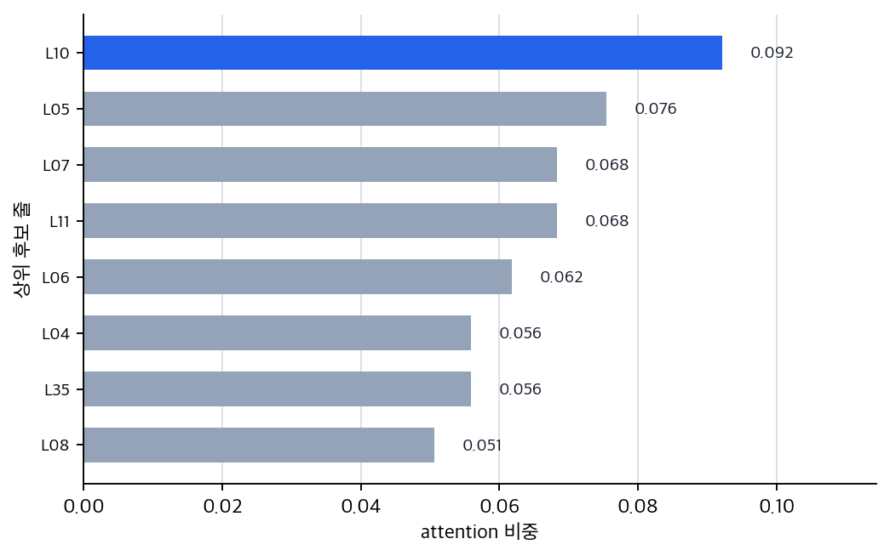
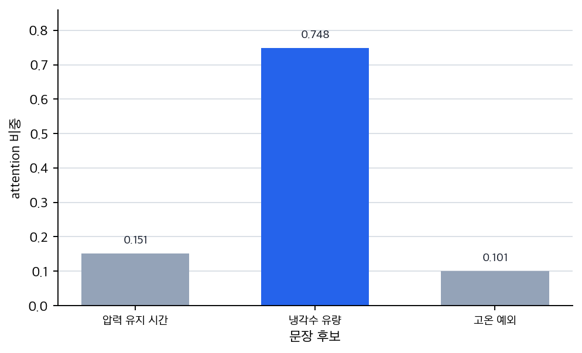
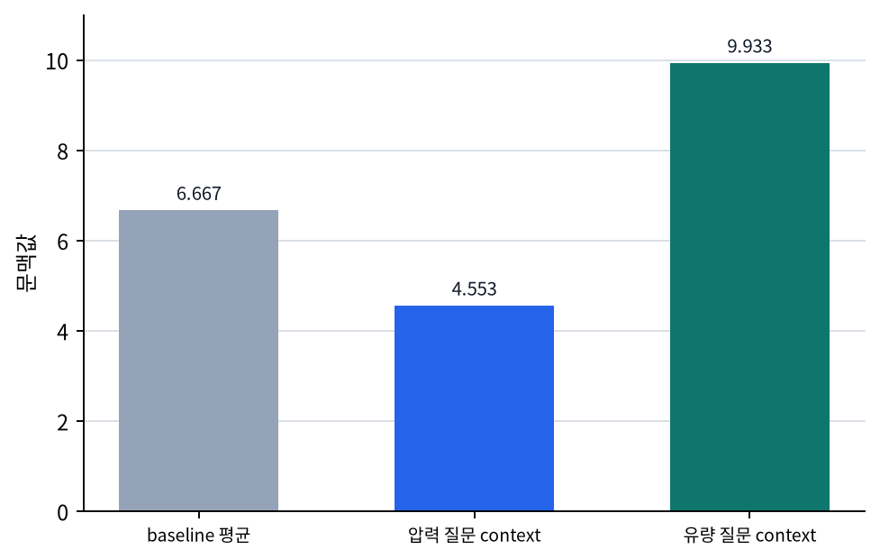

# P5-13.1 어텐션(Attention)의 직관

> Section ID: `P5-13.1`
> Version: `v2026.07.31`

P5-12.2에서는 장기 의존성(long-term dependency) 때문에 순차 모델이 오래전 정보를 충분히 유지하기 어려울 수 있다는 점을 보았습니다. 여기서 다음 질문이 생깁니다.

현재 위치가 필요한 과거 정보를 더 직접적으로 참고하게 만들 수는 없는가?

이 질문에 대한 대표적 답이 어텐션(Attention)입니다.

어텐션은 현재 계산에 정말 중요한 위치나 토큰(token)에 더 큰 비중을 두어, 필요한 정보를 더 직접적으로 참고하게 만드는 방식입니다.

attention의 기본 문제의식을 다시 짧게 잡아야 할 때는 개념사전의 [어텐션(Attention)](../../../reference/concept-glossary-parts/08-ieung.md#attention) 항목을 기준으로 다시 읽습니다.

## Attention이 필요한 위치를 다시 보는 질문

- 어텐션은 어떤 문제를 해결하려는가?
- `필요한 위치를 더 강하게 본다`는 말은 무엇을 뜻하는가?
- attention은 RNN 계열과 어떻게 연결되는가?
- 왜 attention이 큰 전환점처럼 느껴졌는가?

이 절에서 먼저 닫아야 하는 핵심은 `오래 기억하려고만 애쓰기보다, 지금 필요한 위치를 다시 찾아보는 방식이 필요했다`는 점입니다.

self-attention과 Transformer 연결은 다음 절과 다음 장에서 이어서 다룹니다. query, key, value와 multi-head attention의 입문적 설명은 보충학습 P5-13.3에서 회수합니다.

## 참조 가중치와 문맥 선택의 판단 기준

- attention을 `중요한 위치를 더 직접적으로 참고하는 방식`으로 설명할 수 있습니다.
- 장기 의존성 문제와 attention의 연결을 말할 수 있습니다.
- 초기 encoder-decoder와 운영 문서 변환 장면에서 왜 attention이 중요했는지 설명할 수 있습니다.
- 실행 가능한 Python 예제로 가중 평균 형태의 attention 직관을 확인할 수 있습니다.

## attention은 왜 등장했나

기본 RNN이나 encoder-decoder 구조에서는 긴 입력 전체를 하나의 압축된 상태(state)에 담으려는 경향이 있었습니다. 입력이 짧을 때는 버틸 수 있어도, 길이가 늘어나면 지금 꼭 필요한 단서가 그 압축된 상태 안에서 흐려지기 쉬웠습니다.

attention은 이 문제를 다르게 봅니다.

`현재 출력을 만들 때, 입력 전체 중 어디를 더 참고해야 하는지를 직접 계산하자.`

즉, 오래전 정보를 무조건 상태 안에만 눌러 담아 두는 대신, 필요할 때 다시 꺼내 보려는 발상입니다. 이 절에서 attention을 읽는 핵심은 `더 오래 기억하게 만들기`보다 `지금 필요한 위치를 다시 찾게 만들기`에 있습니다.

## `더 강하게 본다`는 말은 무엇인가

attention의 핵심은 현재 과업과 더 관련 있는 위치에 더 큰 가중치를 두고 정보를 다시 모으는 데 있습니다. 중요한 것은 모든 위치를 미리 똑같이 취급하지 않는다는 점입니다.

- 현재 위치에서
- 과거 입력이나 다른 위치들을 훑어보고
- 그중 더 중요한 위치에 더 큰 점수를 주고
- 그 점수를 바탕으로 정보를 모읍니다

즉, 모든 위치를 똑같이 보는 것이 아니라, `현재 과업과 더 관련 있는 위치를 더 크게 참고하는 방식`입니다. 그래서 같은 입력을 두고도 현재 질문이 달라지면, 다시 크게 봐야 할 위치도 함께 달라질 수 있습니다.

이 흐름을 아주 짧게 표로 보면 다음과 같습니다.

| 단계 | 지금 일어나는 일 |
| --- | --- |
| 1 | 현재 위치가 다른 위치들을 훑는다 |
| 2 | 관련 있는 위치에 더 큰 점수를 준다 |
| 3 | 그 점수를 반영해 문맥 정보를 모은다 |

아래 짧은 문장 예시는 현재 문장이 뒤 문장에서 이유 단서를 더 크게 참고하는 장면으로 `훑기 -> 점수 주기 -> 문맥 모으기`를 보여 줍니다.

```text
재기동은 연기되었다. 이유는 압력 불안정이었다.
```

만약 지금 모델이 `이유는 무엇인가?`에 답하려 한다면, 모든 단어를 같은 비중으로 보는 것이 아니라 `압력`, `불안정`, `이유` 같은 위치에 더 큰 비중을 둘 것입니다. 즉, attention에서 `더 강하게 본다`는 말은 `현재 질문과 더 직접 연결된 위치가 계산에 더 크게 반영된다`는 뜻입니다.

## 직접 참조 예시로 보면 왜 직관적인가

attention은 역사적으로 sequence-to-sequence 번역(sequence-to-sequence translation) 맥락에서 큰 힘을 얻었지만, 독자 입장에서는 `현재 문구를 만들 때 입력 어디를 다시 봐야 하는가`라는 작업 지시 변환 장면으로 읽는 편이 더 직접적입니다.

예를 들어 영문 운전 절차를 한국어 작업 지침으로 바꿀 때 현재 출력 문구가 어떤 단어를 만들고 있을 때:

- 입력 문장 전체 중 어떤 단어가 지금 가장 관련 있는지
- 그 위치를 더 강하게 참고할 수 있습니다

즉, 출력 단어 하나를 만들 때마다 입력 전체를 훑되, 필요한 위치에 더 무게를 두는 방식입니다.

`attention은 지금 작성하는 작업 지침 문구에 맞는 입력 위치를 찾아 더 많이 참고하게 하는 장치다.`

## attention은 장기 의존성 문제에 어떻게 답하나

장기 의존성 문제는 오래전 정보가 현재까지 약해지거나 사라질 수 있다는 것이었습니다. attention은 이 문제에 대해 다음처럼 답합니다.

- 굳이 오래전 정보를 상태 안에 희미하게만 남겨 두지 말고
- 현재 step에서 과거 위치 전체를 다시 훑어보며
- 중요한 곳을 직접 선택해서 참고하자

즉, attention은 `기억을 더 오래 보존하는 것`보다, `필요한 정보를 더 잘 찾아오는 것`에 가까운 발상입니다.

P5-12.2를 `상태가 멀리 갈수록 정보가 희미해질 수 있다`는 절로 읽었다면, 이 절은 그 문제를 `그러면 지금 필요한 위치를 다시 보자`로 뒤집는 절입니다.

이 전환만 따로 아주 짧게 압축하면 다음 흐름으로 읽을 수 있습니다.

```mermaid
--8<-- "assets/part-05/chapter-13/attention-direct-reference-bridge-ko.mmd"
```

이 도식의 핵심은 `오래 들고 가는 것`에서 `필요할 때 다시 찾는 것`으로 손잡이가 바뀐다는 점입니다.

## 이를 아주 단순하게 그리면

```mermaid
--8<-- "assets/part-05/chapter-13/attention-focus-flow-ko.mmd"
```

이 도식은 attention을 `필요한 위치 탐색 -> 가중치 부여 -> 집중된 문맥 형성`으로 압축합니다.

같은 입력 문장이라도 현재 질문이 바뀌면 다시 봐야 할 위치가 어떻게 달라지는지 한 번 더 짧게 고정하면 다음처럼 볼 수 있습니다.

```mermaid
--8<-- "assets/part-05/chapter-13/attention-question-shift-ko.mmd"
```

이 비교 도식에서 먼저 붙잡아야 할 점은 다음과 같습니다.

- 입력 문장은 같아도 `무엇을 묻는가`가 바뀌면 높은 비중을 받는 위치도 함께 바뀝니다.
- 그래서 attention의 핵심은 `중요한 문장을 미리 하나 정해 두는 것`이 아니라, 현재 질문에 따라 다시 참조 위치를 고르는 데 있습니다.
- 이 감각이 잡혀야 다음 절의 self-attention에서 `토큰마다 다시 보는 위치가 달라진다`는 설명으로 더 자연스럽게 넘어갈 수 있습니다.

## attention을 `요약`으로 오해하면 어디서 어긋나나

attention을 처음 접하면 `중요한 부분만 남기는 요약 장치`처럼 느끼기 쉽습니다. 하지만 여기서는 조금 더 정확하게 구분하는 편이 좋습니다.

- attention은 현재 계산에서 더 중요한 위치에 더 큰 비중을 둡니다
- 그래서 전체 문맥이 `중요한 부분이 더 강조된 상태`로 다시 읽힐 수 있습니다
- 하지만 attention 자체가 입력 길이를 줄이거나 내용을 따로 압축 저장하는 것은 아닙니다

즉, attention의 핵심은 `문맥을 줄이는 것`보다 `문맥 안에서 무엇을 더 크게 참고할 것인가`에 있습니다.

이 차이를 한 문장으로 줄이면 다음과 같습니다.

`attention은 문맥을 짧게 요약하는 장치라기보다, 현재 계산에서 중요한 위치를 더 크게 읽게 만드는 장치다.`

## 왜 큰 전환점처럼 보였나

attention은 단순히 성능을 조금 올린 보조 기법이 아니라, sequence modeling의 관점을 바꾸는 효과가 있었습니다.

이전에는:

- 긴 문장을 압축 상태에 넣는 방식이 중심이었다면

attention 이후에는:

- 입력 전체를 두고 필요한 위치를 선택적으로 참고하는 방식이 더 강조되었습니다

이 변화는 이후 self-attention과 Transformer로 이어지며, RNN 중심 흐름에서 큰 전환을 만들어 냈습니다. 현재 절에서 독자가 붙잡아야 하는 것도 바로 이 지점입니다. `정보를 오래 들고 갈까`에서 `필요한 위치를 다시 볼까`로 질문 자체가 바뀌었다는 점입니다.

## 어텐션의 직관: 확인할 판단 기준

이 사례를 읽을 때는 다음 두 가지를 먼저 확인한다.

- attention이 필요한 위치를 다시 보는 계산이라는 점을 직관적으로 보여 주는지 확인한다.
- 이어지는 사례에서 입력, 비교 기준, 출력, 한계가 제목의 판단 기준과 어떻게 연결되는지 확인한다.

### 대표 사례. 운전 절차 변환 문서

영문 운전 절차 문서를 한국어 작업 지침으로 바꾼다고 생각해 보겠습니다. 사람은 처음에는 왼쪽에서 오른쪽으로 차례로 읽으며 바로 옮기면 된다고 느끼기 쉽습니다. 하지만 실제로는 지금 만들고 있는 한국어 지침 문구가 입력 문장 전체 중 어느 위치와 가장 직접 연결되는지 다시 확인해야 할 때가 많습니다. 예를 들어 문장 앞쪽의 주체와 뒤쪽의 안전 조건 관계를 놓치면, 문장은 문법상 맞아 보여도 누가 무엇을 먼저 해야 하는지가 어색해질 수 있습니다. 사람이 절차 문서를 옮길 때도 보통 현재 쓰는 단어에 맞는 입력 위치를 다시 눈으로 찾아봅니다. attention은 바로 이 `지금 출력할 문구에 가장 관련 있는 입력 위치를 더 강하게 본다`는 직관과 잘 맞고, 긴 문장에서 멀리 떨어진 핵심 단어를 놓치는 문제를 줄이는 방향으로 이해할 수 있습니다.
그래서 이 사례에서 확인해야 할 결과는 현재 번역 문구가 가까운 단어만 따라가지 않고, 앞 주체와 뒤 안전 조건을 실제로 다시 함께 참조해 조건부 작업 지침으로 닫히는가입니다.

같은 관점은 장애 메모 요약이나 매뉴얼 질의응답에도 그대로 이어집니다. 다만 이 절에서 붙잡을 핵심은 도메인 이름이 아니라, `현재 질문이나 출력 목표가 바뀌면 다시 크게 참고할 위치도 함께 바뀌는가`입니다.

세 사례를 같이 놓고 보면 attention을 `중요한 부분을 대충 요약하는 장치`보다 `현재 질문이나 출력 목표에 따라 다시 참고할 위치를 바꾸는 구조`로 읽어야 하는 이유가 더 분명해집니다.

| 사람이 먼저 보기 쉬운 기준 | attention 관점으로 다시 읽는 기준 |
| --- | --- |
| 문장 전체를 한 번 읽어 둔 인상만으로도 현재 질문에 답할 수 있다고 느낀다 | 현재 질문이나 출력 목표가 바뀌면 다시 봐야 할 위치도 함께 바뀐다 |
| 중요한 문장은 처음부터 고정되어 있다고 본다 | 같은 문서라도 `무엇을 묻는가`에 따라 높은 비중을 받는 위치가 달라진다 |
| attention을 단순한 요약 장치처럼 이해하기 쉽다 | 핵심은 길이를 줄이는 것이 아니라 현재 과업에 맞게 참조 비중을 다시 나누는 데 있다 |

## 연습 및 예제

이번 예제의 목표는 여러 위치 중 중요한 곳에 더 큰 비중을 주고 가중 평균을 만드는 attention 직관을 확인하는 것입니다. 이번에는 세 개 숫자를 코드 안에 직접 넣지 않고, 운영 매뉴얼 후보 줄을 CSV 파일로 따로 둔 뒤 같은 후보 묶음을 질문별로 다시 읽어 보겠습니다.

문제 상황:

- 모든 입력 줄을 똑같이 평균내면 현재 질문과 직접 관련된 단서가 흐려질 수 있다
- 같은 매뉴얼이라도 `압력`, `냉각수 유량`, `재기동 승인` 중 무엇을 묻는지에 따라 더 크게 참고해야 할 줄이 달라진다

입력:

- [`attention-operating-manual-candidates.csv`](../../../assets/part-05/chapter-13/attention-operating-manual-candidates.csv){ .csv-preview }
- 40개의 운영 매뉴얼 후보 줄
- 각 줄의 대표 신호값 `evidence_signal`
- 질문별 관련도 점수 `score_pressure_hold`, `score_flow_limit`, `score_restart_permission`

출력:

- 모든 후보를 똑같이 평균낸 baseline 문맥값
- 질문마다 달라지는 attention 비중
- 질문마다 달라지는 문맥값
- 각 질문에서 가장 크게 반영되는 후보 줄

확인할 개념:

- attention은 모든 후보를 같은 비중으로 보는 대신 현재 질문에 더 관련된 위치를 더 크게 본다
- baseline 평균과 attention 가중 평균을 비교해야 왜 중요한 위치 선택이 필요한지 보인다
- 같은 후보 묶음도 질문이 달라지면 비중이 다시 나뉜다
- CSV처럼 줄이 많은 입력으로 바꾸면 attention이 `어떤 줄을 더 볼 것인가`의 문제라는 점이 더 분명해진다

CSV의 한 행은 `문서 안의 한 줄`을 뜻합니다. `evidence_signal`은 그 줄이 문맥값에 기여하는 대표 수치이고, `score_*` 열은 질문별 관련도 점수입니다. 실제 attention 모델의 학습된 점수를 그대로 구현한 것은 아니지만, `질문별 점수 -> softmax 비중 -> 가중 평균 문맥값`이라는 직관을 확인하기에는 충분합니다.

CSV 내용 일부를 먼저 보면 다음과 같습니다.

| line_id | section | text 요약 | evidence_signal | 압력 점수 | 유량 점수 | 재기동 점수 |
| --- | --- | --- | ---: | ---: | ---: | ---: |
| L05 | pressure | venting 뒤 3분 대기 | 3.0 | 2.8 | 0.1 | 0.7 |
| L10 | pressure | hold time은 마지막 불안정 판독부터 계산 | 2.9 | 3.0 | 0.1 | 1.1 |
| L13 | coolant | 냉각수 유량은 12 units 이상 유지 | 12.0 | 0.2 | 2.9 | 0.5 |
| L18 | coolant | 주 유량이 기준 미만이면 standby pump 시작 | 12.6 | 0.1 | 2.8 | 0.9 |
| L25 | restart | 압력, 유량, 서명이 모두 통과해야 재기동 | 7.2 | 1.3 | 1.7 | 3.0 |
| L40 | handover | routine cleaning note는 세 질문 모두 낮은 우선순위 | 4.6 | 0.1 | 0.1 | 0.1 |

코드를 보기 전에, 같은 CSV를 두고 질문만 바꾸면 어느 구간의 줄에 weight가 몰릴지 먼저 예상해 보면 좋습니다.

| 질문 | baseline에서 생기기 쉬운 오해 | attention에서 먼저 예상할 변화 |
| --- | --- | --- |
| `압력 해소 유지 시간은?` | 전체 매뉴얼 평균만 보면 압력 hold 단서가 흐려질 수 있다 | pressure 구간과 누락된 압력 timestamp 줄이 위로 올라와야 한다 |
| `냉각수 유량 기준은?` | 같은 매뉴얼이면 앞 질문과 비슷한 문맥이 나올 것이라고 느끼기 쉽다 | coolant 구간과 flow meter 관련 줄이 위로 올라와야 한다 |
| `재기동 승인 조건은?` | 재기동은 압력이나 유량 중 하나만 보면 된다고 오해할 수 있다 | restart 구간과 승인 차단 조건 줄이 위로 올라와야 한다 |

입력(input):

위 CSV를 읽어 질문별 관련도 점수를 softmax로 정규화합니다.

```python
from pathlib import Path
import csv
import math

DATA_PATH = Path("docs/assets/part-05/chapter-13/attention-operating-manual-candidates.csv")

QUESTIONS = {
    "압력 해소 유지 시간은?": "score_pressure_hold",
    "냉각수 유량 기준은?": "score_flow_limit",
    "재기동 승인 조건은?": "score_restart_permission",
}

with DATA_PATH.open(encoding="utf-8", newline="") as f:
    rows = list(csv.DictReader(f))

values = [float(row["evidence_signal"]) for row in rows]
baseline_context = sum(values) / len(values)

def softmax(scores):
    # 점수 자체보다 점수의 상대적 차이가 attention 비중을 만든다는 점을 보기 위해 최댓값을 빼고 계산합니다.
    max_score = max(scores)
    exp_scores = [math.exp(score - max_score) for score in scores]
    total = sum(exp_scores)
    return [score / total for score in exp_scores]

def run_attention(question, score_column):
    scores = [float(row[score_column]) for row in rows]
    weights = softmax(scores)
    context = sum(w * v for w, v in zip(weights, values))
    top_rows = sorted(zip(rows, weights), key=lambda item: item[1], reverse=True)[:3]

    print("question =", question)
    print("csv_rows =", len(rows))
    print("baseline_uniform_context =", round(baseline_context, 3))
    print("context =", round(context, 3))
    print("shift_from_baseline =", round(context - baseline_context, 3))
    for row, weight in top_rows:
        print(row["line_id"], row["section"], "weight =", round(weight, 3), "signal =", row["evidence_signal"])
    print()

for question, score_column in QUESTIONS.items():
    run_attention(question, score_column)
```

출력에서는 질문 관련 후보 줄이 top 3에 어떻게 올라오는지부터 보면 됩니다.

```text
question = 압력 해소 유지 시간은?
csv_rows = 40
baseline_uniform_context = 6.88
context = 4.685
shift_from_baseline = -2.195
L10 pressure weight = 0.092 signal = 2.9
L05 pressure weight = 0.076 signal = 3.0
L07 pressure weight = 0.068 signal = 3.2

question = 냉각수 유량 기준은?
csv_rows = 40
baseline_uniform_context = 6.88
context = 9.922
shift_from_baseline = 3.042
L13 coolant weight = 0.093 signal = 12.0
L18 coolant weight = 0.084 signal = 12.6
L14 coolant weight = 0.076 signal = 11.6

question = 재기동 승인 조건은?
csv_rows = 40
baseline_uniform_context = 6.88
context = 6.449
shift_from_baseline = -0.431
L25 restart weight = 0.097 signal = 7.2
L26 restart weight = 0.08 signal = 6.8
L30 restart weight = 0.072 signal = 6.6
```

- baseline처럼 모든 후보를 똑같이 평균내면 문맥값은 `6.88`이 되어 압력, 냉각수, 재기동, 로그, 인수인계 줄이 모두 같은 비중으로 섞입니다
- 압력 질문에서는 `L10`, `L05`, `L07`처럼 hold time과 안정화 대기 조건을 말하는 줄이 위로 올라옵니다
- 냉각수 유량 질문에서는 `L13`, `L18`, `L14`처럼 flow limit과 pump 조건을 말하는 줄이 위로 올라옵니다
- 재기동 승인 질문에서는 `L25`, `L26`, `L30`처럼 승인 조건과 차단 조건을 말하는 줄이 위로 올라옵니다
- 즉, attention은 모든 위치를 똑같이 평균내지 않고, 현재 질문과 더 관련 있는 위치를 더 크게 반영합니다

이 예제에서 먼저 볼 산출물은 질문별 attention 비중입니다. 압력 해소 유지 시간 질문에서는 pressure 후보 줄이 상위에 모이고, 냉각수 유량 기준 질문에서는 coolant 후보 줄이 상위에 모입니다.





두 번째로 볼 산출물은 문맥값입니다. baseline 평균은 질문을 구분하지 못해 `6.88`에 머물지만, attention context는 질문에 따라 `4.685`, `9.922`, `6.449`로 달라집니다.



출력 숫자를 읽을 때도 `같은 후보 집합`과 `질문에 따라 달라지는 weight`를 분리해서 봐야 합니다.

| 비교 | 출력에서 먼저 보이는 것 | 평균만 보면 남기 쉬운 해석 | attention까지 보면 바뀌는 해석 |
| --- | --- | --- | --- |
| `baseline_uniform_context` | 세 질문 모두 baseline은 `6.88`로 같습니다. | 같은 CSV라면 문맥도 거의 같아야 할 것처럼 보입니다. | baseline은 질문을 반영하지 못해, 현재 필요한 위치가 바뀌어도 같은 평균값에 머뭅니다. |
| `압력 해소 유지 시간은?` | pressure 줄이 top 3에 모입니다. | 숫자값이 낮은 줄이 우연히 선택되어 context가 내려간 것처럼 보일 수 있습니다. | 질문이 유지 시간에 맞춰져 있으므로, attention은 압력 hold 후보를 더 크게 참고하도록 비중을 다시 나눕니다. |
| `냉각수 유량 기준은?` | coolant 줄이 top 3에 모입니다. | 같은 CSV인데 이번엔 숫자 큰 쪽이 우연히 선택된 것처럼 보일 수 있습니다. | 질문이 바뀌자 참조 비중이 다시 배분되어, 유량 기준 쪽 문맥이 더 크게 형성됩니다. |
| `재기동 승인 조건은?` | restart 줄이 top 3에 모입니다. | 재기동은 압력과 유량 줄의 평균으로 충분해 보일 수 있습니다. | 재기동 질문은 압력·유량 단서를 일부 참고하되, 최종 승인과 차단 조건 줄을 더 크게 참고합니다. |

## 이 예제를 질문-후보 비교 관점으로 다시 보면

앞의 숫자는 실제 단어 임베딩 전체를 계산한 것은 아니지만, 직관은 분명합니다.

- baseline 평균은 `후보 줄들이 그냥 같은 CSV 안에 있었다`는 사실만 반영합니다.
- attention 가중 평균은 `지금 질문이 무엇이냐`를 기준으로, 후보들 사이 비중을 다시 나눕니다.
- 그래서 질문이 `압력 해소 유지 시간`, `냉각수 유량 기준`, `재기동 승인 조건`으로 바뀌면 같은 후보 묶음이어도 가장 크게 참고하는 위치가 달라집니다.

즉, attention은 단순히 정보를 더 많이 모으는 방식이 아니라, `현재 질문에 맞게 어떤 정보를 더 크게 섞을지 다시 정하는 방식`입니다.

attention은 sequence-to-sequence 번역 연구에서 큰 영향력을 얻었고, 이후 self-attention과 Transformer로 이어지면서 현대 딥러닝의 핵심 문맥 참조 방식으로 자리 잡았습니다. 이 절에서 독자가 남겨야 할 결론은 간단합니다. attention은 `정보를 오래 들고 가는 구조`보다 `지금 필요한 위치를 다시 크게 보는 구조`에 더 가깝습니다. 다음 절 P5-13.2에서는 이 직접 참조 발상이 같은 시퀀스 안 토큰들이 서로를 다시 읽는 구조로 어떻게 이어지는지를 설명합니다.

## 체크리스트

- 어텐션(Attention)이 `필요한 위치를 다시 참고하는 방식`이라는 점을 설명할 수 있는가?
- 장기 의존성 문제와 어텐션의 연결을 말할 수 있는가?
- attention은 현재 계산에 중요한 위치를 더 크게 참고하는 방식이라는 점을 설명할 수 있는가?
- 이는 장기 의존성 문제에 대한 더 직접적인 응답이라는 점을 말할 수 있는가?
- attention을 `기억을 더 오래 남기는 방법`이 아니라 `지금 필요한 위치를 더 크게 다시 보는 방법`으로 설명할 수 있는가?
- baseline 평균과 가중 평균의 차이를 현재 질문 기준으로 설명할 수 있는가?
- 상태를 오래 보존하는 설명만으로는 왜 성능이 막히는지 부족할 때, attention의 직접 참조 관점을 먼저 떠올릴 수 있는가?
- 다음 절의 self-attention을 읽을 때도 먼저 `현재 토큰이 같은 시퀀스 안 어디를 다시 봐야 하는가`를 떠올릴 준비가 되어 있는가?

## 출처와 참고 자료

- Dzmitry Bahdanau, Kyunghyun Cho, Yoshua Bengio, `Neural Machine Translation by Jointly Learning to Align and Translate`, ICLR 2015, 확인 날짜: 2026-07-19. [https://arxiv.org/abs/1409.0473](https://arxiv.org/abs/1409.0473){: target="_blank" rel="noopener noreferrer" }
- Ian Goodfellow, Yoshua Bengio, Aaron Courville, `Deep Learning`, MIT Press, 2016, 확인 날짜: 2026-06-29. [https://www.deeplearningbook.org/](https://www.deeplearningbook.org/){: target="_blank" rel="noopener noreferrer" }
- Kyunghyun Cho et al., `Learning Phrase Representations using RNN Encoder-Decoder for Statistical Machine Translation`, arXiv, 2014, 확인 날짜: 2026-07-19. [https://arxiv.org/abs/1406.1078](https://arxiv.org/abs/1406.1078){: target="_blank" rel="noopener noreferrer" }
