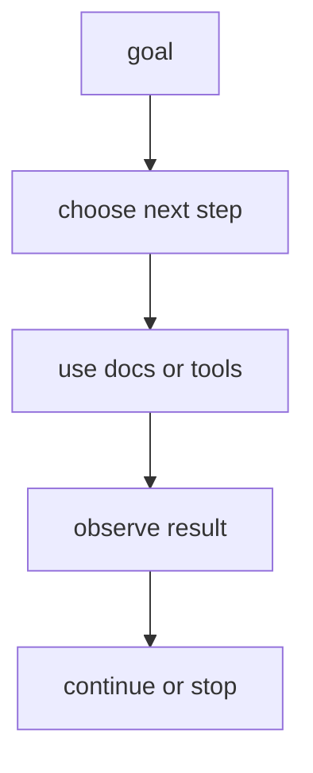

# P5-13.1 에이전트(agent)

P5-12.2에서는 함수 호출(function calling)이 도구 사용을 구조화된 형식으로 표현하는 방식이라는 점을 보았습니다. 그러면 이제 질문이 한 단계 더 커집니다.

도구 호출이 한 번으로 끝나지 않고, 여러 단계 작업을 이어 가야 하면 무엇이라고 보아야 하는가?

이 절은 그 질문에 답합니다.

에이전트(agent)는 목표를 받고, 필요한 하위 작업을 이어 가며, 도구 사용과 관찰을 반복해 결과를 만드는 작업 구조다.

## 이 절의 범위

이 절은 다음 질문에 답합니다.

- 에이전트는 무엇을 하는 구조인가?
- 프롬프트, RAG, tool use와 agent는 어떻게 다른가?
- 왜 에이전트를 단순 챗봇과 같은 것으로 보면 혼동이 생기는가?

이 절에서는 다음 내용을 깊게 다루지 않습니다.

- 다중 에이전트(multi-agent) 협업 설계
- planner, executor, critic 세부 패턴 비교
- 프레임워크별 구현 차이

에이전트의 최소 실행 구조는 여기와 다음 P5-13.2 계획, 행동, 관찰에서 먼저 회수합니다. 도구 연결 표준과 실행 환경 문제는 P5-14.1 MCP와 도구 연결, P5-14.2 하네스에서 다시 다루고, 다중 에이전트 설계 전개는 현재 본편 범위 밖으로 둡니다.

이 절에서는 agent를 유행어처럼 두지 않고, `목표를 작업 흐름으로 이어 가는 실행 구조`로 설명합니다.

## 이 절의 목표

- 에이전트를 입문 수준에서 설명할 수 있습니다.
- 프롬프트, RAG, tool use와 agent의 차이를 말할 수 있습니다.
- 에이전트가 왜 여러 단계와 상태(state)를 다루는 구조인지 설명할 수 있습니다.
- 다음 절의 계획, 행동, 관찰 흐름으로 자연스럽게 넘어갈 수 있습니다.

## 에이전트는 무엇을 더하나

프롬프트는 입력 설계입니다.  
RAG는 외부 문서를 찾아 붙이는 구조입니다.  
tool use는 외부 기능을 호출하는 구조입니다.

먼저 다음 세 질문으로 읽으면 좋습니다.

| 질문 | 짧은 답 |
| --- | --- |
| 에이전트에서 새로 중요해지는 것은 무엇인가? | 여러 단계의 연결 |
| 한 번의 도구 호출과 무엇이 다른가? | 중간 결과를 보고 다음 행동을 바꾼다 |
| 그래서 중심이 무엇으로 바뀌는가? | 한 번의 답변에서 목표 중심 워크플로우로 |

그러면 agent는 무엇을 더할까요?

핵심은 `여러 단계를 이어 가는 것`입니다.

예를 들어 어떤 목표가:

- 정보를 찾고
- 필요한 도구를 고르고
- 중간 결과를 읽고
- 다음 행동을 바꾸고
- 실패하면 다시 시도하고
- 최종 결과를 정리하는

흐름으로 이어진다면, 이것은 단순 단발 요청보다 agent 구조에 가깝습니다.

즉, 에이전트는 `한 번의 응답`보다 `목표를 향한 작업 흐름`에 중심이 있습니다.

서비스 구조 관점으로 보면, 프롬프트는 `어떻게 물을까`, RAG는 `무엇을 읽을까`, tool use는 `무엇을 실행할까`를 다룹니다. agent는 여기에 `어떤 순서로 이어 갈까`를 더합니다.

## 왜 단순 챗봇과 같은 말이 아닌가

종종 agent를 `더 똑똑한 챗봇` 정도로 이해합니다. 하지만 더 안전한 설명은 다음과 같습니다.

`에이전트는 대화형 인터페이스를 가질 수 있지만, 핵심은 대화 자체가 아니라 목표를 위해 작업 단계를 이어 가는 실행 구조에 있다.`

예를 들어 에이전트는 다음을 할 수 있습니다.

- 질문을 다시 분해하기
- 문서를 검색하기
- 파일을 읽기
- 테스트를 실행하기
- 실패 원인을 보고 다시 시도하기

이런 흐름은 단순한 한 번의 답변보다 `작업 orchestration`에 더 가깝습니다.

## 프롬프트, RAG, tool use와 어떻게 다른가

| 구조 | 중심 역할 |
| --- | --- |
| 프롬프트(prompt) | 입력을 설계한다 |
| RAG | 관련 문서를 찾아 답변 근거로 붙인다 |
| tool use | 외부 기능을 호출한다 |
| agent | 여러 단계 작업을 목표 중심으로 이어 간다 |

즉, agent는 앞선 구조들을 포함할 수 있습니다. 프롬프트도 쓰고, RAG도 쓰고, 도구도 쓸 수 있습니다. 하지만 그 자체로는 각각과 다른 `상위 작업 구조`입니다.

이 표를 다음 한 줄로 다시 기억해도 좋습니다.

- 프롬프트는 입력 단위
- RAG와 tool use는 기능 단위
- agent는 흐름 단위

## 왜 상태(state)가 중요해지나

여러 단계 작업을 이어 가려면 시스템은 중간 상태를 알아야 합니다.

예를 들어:

- 이미 어떤 문서를 읽었는가
- 어떤 도구 호출이 성공했는가
- 어떤 오류가 발생했는가
- 다음에 무엇을 해야 하는가

이런 정보가 없으면 에이전트는 매 단계마다 맥락을 잃고 같은 실수를 반복할 수 있습니다.

따라서 agent는 단순한 출력 생성보다 `상태를 가진 실행`에 더 가깝습니다.

이 점 때문에 agent 설명에서는 `왜?`라는 질문에 답하기 위해 현재 단계, 이전 결과, 남은 목표를 함께 봐야 합니다.

## 왜 실무에서 중요해졌나

LLM이 실제 작업에 들어가면서 사람들은 곧 다음을 원하게 되었습니다.

- 단순 설명을 넘어서
- 실제 자료를 모으고
- 도구를 사용하고
- 결과를 다시 정리하고
- 끝까지 처리해 주는 흐름

이 요구가 커질수록, 단일 응답 모델보다 agent 구조가 더 자주 등장하게 됩니다.

예를 들어:

- 개발 보조
- 리서치 보조
- 문서 처리 자동화
- 고객 대응 워크플로우

같은 곳에서 agent 구조가 두드러집니다.

## 에이전트도 만능은 아니다

이 점도 반드시 같이 넣어야 합니다.

에이전트가 있다고 해서:

- 항상 올바른 계획을 세우는 것
- 무한 반복을 피하는 것
- 잘못된 도구 호출을 모두 막는 것
- 비용과 지연 시간을 자동으로 최적화하는 것

을 자동으로 해결하는 것은 아닙니다. 그래서 이 절에서 계속 확인해야 할 결과는 `여러 단계를 이어 갈 수 있는가`만이 아니라, `어디서 멈추고 다시 계획하며 사람에게 넘겨야 하는가`까지 구조 안에 드러나는가입니다.

오히려 단계가 늘어나면:

- 실패 지점이 늘고
- 로그가 더 필요하며
- 승인과 권한 관리가 중요해지고
- 평가와 재현성이 더 어려워질 수 있습니다

즉, agent는 능력을 넓히는 동시에 운영 복잡도도 크게 키웁니다.

## 아주 단순하게 그리면



이 도식의 핵심은 agent가 `질문 -> 답변` 한 번으로 끝나는 구조가 아니라, `목표 -> 단계 선택 -> 실행 -> 관찰`의 반복 구조라는 점입니다.

## 사례로 보기

### 사례 1. 코딩 에이전트

사용자가 `로그인 오류를 고쳐 달라`고 요청하면, 사람은 먼저 `원인 설명 한 번`이나 `수정 코드 한 조각`을 기대하기 쉽습니다. 하지만 실제 코딩 에이전트는 관련 파일을 찾고 오류 지점을 읽은 뒤 패치를 적용하고 테스트를 다시 실행합니다. 예를 들어 첫 수정 후 테스트가 다른 인증 예외를 새로 드러내면, 거기서 멈추지 않고 다음 수정으로 이어 가야 합니다. 사람이 중간 결과를 확인해 보듯이, 에이전트도 테스트 실패나 새 오류 메시지를 보고 다음 행동을 바꿉니다. 이 관찰을 무시하면 원래 오류 하나는 줄여도 다른 회귀를 남긴 채 끝날 수 있습니다. 여기서 바뀌는 점은 `수정 코드 한 번을 내놓는가`를 보던 기준에서 `테스트 결과를 보고 다음 행동을 바꾸는 흐름이 있는가`를 보는 기준으로 이동한다는 것입니다. 이런 구조는 `답변 한 번`이 아니라 `읽기-수정-실행-재확인`이 이어지는 작업 흐름이므로 agent라고 부릅니다. 그래서 이 사례에서 확인해야 할 결과는 수정 코드 한 번으로 끝나는 것이 아니라, 테스트 결과를 보고 다음 행동이 실제로 바뀌는가입니다.

### 사례 2. 문서 조사 에이전트

사용자가 `최신 환불 정책을 근거와 함께 정리해 달라`고 요청하면, 사람은 검색 한 번으로 바로 답이 끝날 것처럼 느끼기 쉽습니다. 하지만 문서 조사 에이전트는 관련 공지와 규정 문서를 먼저 찾고, 사람이 수작업으로 조사할 때처럼 문서 날짜와 근거 수준을 확인한 뒤 부족하면 검색어를 바꾸거나 다른 출처를 더 읽습니다. 예를 들어 검색 첫 결과가 작년 공지라면, 거기서 바로 요약하지 않고 최신 개정 문서를 다시 찾아야 합니다. 반대로 최신 공지는 찾았지만 세부 조건이 별도 규정 PDF에 있으면, 공지 하나만으로 끝내지 않고 그 PDF까지 다시 열어 근거를 보강해야 할 수 있습니다. 그렇지 않으면 겉보기에는 출처가 붙어 있어도 실제로는 오래된 근거를 붙이거나 핵심 조건을 빠뜨린 답이 됩니다. 여기서 바뀌는 점은 `검색 결과 하나가 나왔는가`를 보던 기준에서 `날짜와 근거 수준을 확인하며 재탐색하는가`를 보는 기준으로 이동한다는 것입니다. 즉, 검색-읽기-요약-출처 정리-재탐색이 한 목표 아래에서 이어지기 때문에 단순 검색기보다 에이전트에 가깝습니다. 그래서 이 사례에서 확인해야 할 결과는 첫 검색 결과를 바로 요약하는 대신, 날짜와 근거 수준을 다시 확인하며 최신 문서를 끝까지 찾는가입니다.

### 사례 3. 업무 자동화 에이전트

사용자가 `오늘 접수된 긴급 문의를 찾아 담당자 캘린더까지 확인해 달라`고 요청할 수 있습니다. 사람은 이 요청을 문장 하나로 말하더라도, 실제 시스템에서는 메일함 조회, 긴급 여부 분류, 담당자 검색, 캘린더 확인, 결과 기록을 차례로 이어 가야 합니다. 예를 들어 긴급 문의로 분류된 항목이 세 개라면, 담당자마다 다른 캘린더를 다시 조회하고 일정이 겹치면 우선순위까지 다시 정해야 할 수 있습니다. 각 단계는 개별 도구 호출이지만, 핵심은 그 호출들을 하나의 업무 목표로 연결하고 중간 결과에 따라 다음 순서를 바꾸는 데 있습니다. 중간 결과를 보지 않고 처음 순서만 밀어붙이면, 긴급도가 낮은 건을 먼저 처리하거나 담당자 일정 충돌을 놓칠 수 있습니다. 여기서 바뀌는 점은 `도구를 차례로 호출하는가`를 보던 기준에서 `중간 결과에 따라 실제 순서와 우선순위가 바뀌는가`를 보는 기준으로 이동한다는 것입니다. 그래서 이 사례에서 확인해야 할 결과는 도구 호출 목록을 나열하는 데 그치지 않고, 중간 결과에 따라 실제 작업 순서와 우선순위가 바뀌는가입니다.

세 사례를 한 줄로 묶으면 다음과 같습니다.

| 상황 | agent로 보는 이유 |
| --- | --- |
| 코딩 보조 | 읽기-수정-테스트-요약이 이어져서 |
| 문서 조사 | 검색-읽기-정리-재탐색이 반복되어서 |
| 업무 자동화 | 여러 시스템 동작을 하나의 목표로 묶어서 |

## 실행 가능한 Python 예제로 보기

이번 예제의 목표는 실제 에이전트 프레임워크 전체를 구현하는 것이 아니라, 하나의 목표가 들어왔을 때 `검색`, `읽기`, `요약`, `출처 부착` 같은 여러 작업 단계와 상태로 풀리는 장면을 눈으로 확인하는 것입니다.

문제 상황:

- 사용자는 최신 환불 정책을 요약하고 출처까지 붙인 답을 원함
- 이 목표는 한 문장 생성만으로 끝나지 않고 여러 단계를 거쳐야 함
- 각 단계가 끝날 때마다 상태가 누적되어 다음 단계 선택에 쓰여야 함

입력:

- 하나의 목표
- 현재 상태 객체

출력:

- 단계별 실행 계획
- 단계가 끝날 때마다 갱신되는 상태

```python
goal = "최신 환불 정책을 찾아 요약하고 출처를 붙여 답변한다."

state = {
    "goal": goal,
    "documents_found": [],
    "summary_ready": False,
    "sources_attached": False,
}


def build_plan(state):
    steps = []
    if not state["documents_found"]:
        steps.append("search_policy_docs")
    if state["documents_found"] and not state["summary_ready"]:
        steps.append("read_top_documents")
        steps.append("summarize_changes")
    if state["summary_ready"] and not state["sources_attached"]:
        steps.append("attach_sources")
    return steps


def simulate_step(step, state):
    if step == "search_policy_docs":
        state["documents_found"] = [
            "policy_notice_2026_06_29",
            "refund_rules_appendix",
        ]
    elif step == "read_top_documents":
        state["read_complete"] = True
    elif step == "summarize_changes":
        state["summary_ready"] = True
        state["draft_summary"] = "환불 요청 처리 기한이 7일에서 14일로 늘어났습니다."
    elif step == "attach_sources":
        state["sources_attached"] = True
        state["final_answer"] = (
            "환불 요청 처리 기한이 7일에서 14일로 늘어났습니다. "
            "출처: policy_notice_2026_06_29, refund_rules_appendix"
        )
    return state


plan = build_plan(state)
print("[goal]")
print(goal)
print("[initial plan]")
print(plan)

for step in plan:
    state = simulate_step(step, state)
    print(f"[after {step}]")
    print(state)

second_plan = build_plan(state)
print("[next plan after first pass]")
print(second_plan)
```

실행 결과 예시는 다음처럼 읽을 수 있습니다.

```text
[goal]
최신 환불 정책을 찾아 요약하고 출처를 붙여 답변한다.
[initial plan]
['search_policy_docs']
[after search_policy_docs]
{'goal': '최신 환불 정책을 찾아 요약하고 출처를 붙여 답변한다.', 'documents_found': ['policy_notice_2026_06_29', 'refund_rules_appendix'], 'summary_ready': False, 'sources_attached': False}
[next plan after first pass]
['read_top_documents', 'summarize_changes']
```

그래서 이 예제에서 확인해야 할 결과는 답변 한 문장이 아니라, 목표를 이루기 위한 여러 단계 흐름과 누적 상태가 먼저 명시되고, 그 상태에 따라 다음 단계가 다시 정해진다는 점입니다.

이 예제에서 독자가 직접 해 볼 수 있는 조정은 다음과 같습니다.

- `documents_found`를 비운 채 다시 계획을 세워 같은 단계가 반복되는지 보기
- `simulate_step`에 실패 상태를 넣어 다음 계획이 어떻게 바뀌는지 보기
- `attach_sources`를 마지막이 아니라 중간 단계로 옮기면 왜 흐름이 어색해지는지 생각해 보기

## 이 예제를 작업 흐름 관점으로 다시 보면

앞의 예제는 agent 전체를 구현하는 코드가 아니라, `목표 하나를 바로 문장 하나로 닫는 구조`가 아니라 `목표를 여러 단계 흐름으로 풀어야 하는 구조`라는 점을 가장 짧게 보여 주는 장면입니다. 여기서 읽어야 할 핵심은 단계 수를 세는 일이 아니라, 같은 목표라도 검색, 읽기, 요약, 출처 부착처럼 서로 다른 행동이 이어져야 한다는 점입니다.

이 예제에서 여기서 읽어야 할 핵심은 다음입니다.

- 목표는 하나지만
- 단계는 여러 개일 수 있고
- 각 단계의 결과가 다음 단계 선택에 영향을 준다는 점입니다

## 역사와 커리큘럼 관점

LLM이 널리 쓰이기 시작했을 때는 대화형 응답이 가장 먼저 주목받았습니다. 하지만 실제 생산성 도구나 자동화 도구로 확장되면서, 사람들은 곧 `답만 잘하는 모델`보다 `일을 이어 가는 구조`를 원하게 되었습니다. 이 흐름에서 agent 개념이 빠르게 중요해졌습니다.

커리큘럼 관점에서 이 절이 중요한 이유는 다음과 같습니다.

- 바로 앞의 P5-12.1 도구 사용과 P5-12.2 함수 호출을 `한 번의 호출`이 아니라 `여러 단계를 잇는 실행 구조` 안에 다시 놓게 하고
- 다음 절의 계획, 행동, 관찰 루프를 이해하게 하며
- 뒤의 P5-14.1 MCP, P5-14.2 하네스, P5-15.1 평가를 왜 함께 봐야 하는지 준비시키기 때문입니다

## 다음 절과의 연결

여기까지 오면 다음 질문이 남습니다.

- 에이전트는 실제로 어떤 반복 구조로 움직이는가?
- 계획(plan), 행동(action), 관찰(observation), 종료(stop)는 어떻게 구분되는가?

이 질문은 P5-13.2 계획, 행동, 관찰로 이어집니다.

## 이 절에서 기억할 관점

- 에이전트는 목표를 작업 흐름으로 이어 가는 실행 구조입니다.
- 프롬프트, RAG, tool use와는 다른 상위 구조입니다.
- 에이전트는 여러 단계, 상태, 관찰, 재시도를 다룹니다.
- 능력을 넓히는 대신 운영 복잡도도 키웁니다.

## 체크리스트

- 에이전트를 입문 수준에서 설명할 수 있는가?
- 프롬프트, RAG, tool use와의 차이를 말할 수 있는가?
- 왜 상태와 단계 반복이 중요한지 설명할 수 있는가?
- 왜 다음 절에서 계획/행동/관찰 구조를 더 봐야 하는지 말할 수 있는가?

## 출처와 참고 자료

- Shunyu Yao et al., `ReAct: Synergizing Reasoning and Acting in Language Models`, arXiv, 2022, 확인 날짜: 2026-06-29.
- OpenAI, Agents 관련 공식 문서, 확인 날짜: 2026-06-29.
- 관련 LLM agent engineering 교육 자료, 확인 날짜: 2026-06-29.
