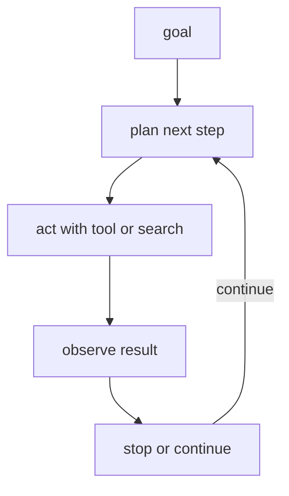

# P5-13.2 계획, 행동, 관찰

P5-13.1에서는 에이전트(agent)가 목표를 작업 흐름으로 이어 가는 실행 구조라는 점을 보았습니다. 그러면 이제 그 내부 흐름을 더 구체적으로 봐야 합니다.

에이전트는 실제로 어떤 반복 구조로 움직이는가?

이 절은 그 질문에 답합니다.

에이전트는 보통 목표를 기준으로 다음 단계를 계획하고, 행동하고, 결과를 관찰한 뒤, 계속할지 멈출지를 판단하는 반복 구조를 가진다.

## 이 절의 범위

이 절은 다음 질문에 답합니다.

- 계획(plan), 행동(action), 관찰(observation)은 무엇을 뜻하는가?
- 왜 이 세 요소를 나눠 보는 것이 중요한가?
- 종료 조건(stop condition)은 왜 필요한가?

이 절에서는 다음 내용을 깊게 다루지 않습니다.

- 탐색 전략 세부 수식
- 다중 agent 협업 패턴
- 장기 메모리 시스템 설계

이 절은 단일 에이전트 루프의 기본 구조에 집중하고, 도구 연결과 실행 환경은 다음의 P5-14.1 MCP와 도구 연결, P5-14.2 하네스에서 다시 회수합니다. 다중 에이전트와 장기 메모리 설계 전부는 현재 본편 범위 밖으로 둡니다.

이 절의 목적은 에이전트를 추상적인 개념으로 두지 않고, `반복 루프(loop)`로 읽게 하는 데 있습니다.

## 이 절의 목표

- 계획, 행동, 관찰을 각각 설명할 수 있습니다.
- 종료 조건이 왜 필요한지 말할 수 있습니다.
- 에이전트 루프에서 어디서 실패가 생길 수 있는지 구분할 수 있습니다.
- 다음 장의 MCP와 하네스(harness) 설명으로 자연스럽게 넘어갈 수 있습니다.

## 계획(plan)은 무엇인가

계획은 `지금 무엇을 해야 하는가`를 정하는 단계입니다.

예를 들어 목표가:

`최신 환불 정책을 찾아 요약하라`

라면 계획 단계는 다음과 비슷할 수 있습니다.

- 먼저 정책 문서를 검색한다
- 최신 공지를 우선 확인한다
- 변경된 부분만 추려 낸다

즉, 계획은 목표를 더 작은 하위 단계로 나누는 일입니다.

## 행동(action)은 무엇인가

행동은 실제로 무언가를 수행하는 단계입니다.

예를 들어:

- 검색 도구 호출
- 파일 읽기
- 계산 실행
- API 요청

같은 것이 행동에 들어갑니다.

중요한 점은 행동은 `말로만 다음 단계를 제안하는 것`이 아니라, 외부 세계에 실제 영향을 주거나 실제 결과를 가져오는 단계라는 점입니다.

## 관찰(observation)은 무엇인가

관찰은 행동의 결과를 읽는 단계입니다.

예를 들어:

- 검색 결과가 너무 적었다
- 파일이 없었다
- 계산 결과가 예상과 달랐다
- API 호출이 실패했다

같은 것이 관찰에 들어갑니다.

관찰이 없으면 에이전트는 같은 행동을 계속 반복하거나, 실패한 줄도 모르고 다음 단계로 넘어갈 수 있습니다.

## 왜 이 셋을 나눠 봐야 하나

독자는 이 흐름을 한 덩어리로 보기 쉽습니다. 하지만 나눠 보면 문제가 훨씬 잘 보입니다.

예를 들어:

- 계획이 틀린 것인가?
- 도구 행동이 실패한 것인가?
- 결과를 잘못 읽은 것인가?

이렇게 구분해야 디버깅과 평가가 가능해집니다.

즉, 계획/행동/관찰 분리는 단순 이론 구분이 아니라, 실제 운영과 평가를 위한 구분입니다.

## 종료 조건(stop condition)은 왜 필요한가

에이전트는 반복 구조이기 때문에 `언제 멈출지`가 매우 중요합니다.

멈추는 기준이 없으면:

- 같은 검색을 계속 반복하거나
- 이미 충분한 답이 있는데도 추가 행동을 하거나
- 비용과 시간이 불필요하게 늘어날 수 있습니다

종료 조건은 보통 다음과 연결됩니다.

- 목표 달성
- 충분한 근거 확보
- 재시도 한도 초과
- 권한/오류 때문에 중단

즉, stop condition은 에이전트의 품질뿐 아니라 비용과 안전성에도 직접 연결됩니다.

## 어디서 실패가 생기나

에이전트 루프는 강력하지만 실패 지점도 많습니다.

- 계획이 비현실적일 수 있음
- 잘못된 도구를 선택할 수 있음
- 관찰 결과를 오독할 수 있음
- 멈춰야 할 때 계속할 수 있음

따라서 agent 설계는 보통 `더 많은 자유`와 `더 많은 통제 필요`가 함께 따라옵니다.

## 아주 단순하게 그리면



이 도식의 핵심은 agent가 일직선 파이프라인이 아니라, 관찰 뒤에 다시 다음 계획으로 돌아가는 루프 구조라는 점입니다.

## 사례로 보기

### 사례 1. 문서 조사 에이전트

사용자가 `지난달 환불 정책 변경점을 요약해 달라`고 요청했는데 첫 검색 결과가 오래된 공지만 보여 줄 수 있습니다. 사람은 보통 첫 결과가 마음에 안 들면 검색어를 바꾸거나 날짜를 다시 제한합니다. 이때 에이전트도 `결과가 부족하다`는 관찰을 바탕으로 검색어를 바꾸거나 날짜 필터를 다시 적용해야 합니다. 예를 들어 첫 검색이 `환불 정책`으로는 너무 넓게 잡혔다면, 다음 단계에서는 월 범위를 넣거나 `공지`, `개정` 같은 단어를 더 붙여 다시 찾게 됩니다. 그대로 오래된 문서만 요약하면 답변은 매끄러워도 사용자에게 지난달이 아닌 예전 기준을 안내하게 됩니다. 문서가 충분히 모이면 그때만 요약 단계로 넘어가므로, 다음 계획은 항상 직전 관찰 결과에 의해 바뀝니다.

### 사례 2. 코딩 에이전트

사용자가 버그 수정을 요청하면 에이전트는 먼저 관련 파일을 고치고 테스트를 실행합니다. 사람도 수동 디버깅에서는 테스트가 실패하면 그 로그를 읽고 다음 수정 방향을 바꿉니다. 예를 들어 첫 수정 뒤에 기존 오류는 사라졌지만 다른 인증 테스트가 깨졌다면, 다음 행동은 원래 코드 설명을 반복하는 것이 아니라 새 실패를 기준으로 패치를 조정하는 쪽이 됩니다. 이 로그를 무시하고 처음 계획만 계속 밀어붙이면, 한 버그를 고치고 다른 회귀를 만드는 식으로 결과가 더 나빠질 수 있습니다. 에이전트에서도 실패 로그가 곧 새로운 관찰 결과가 되어 다음 패치 방향을 바꾸게 됩니다. 즉, `수정한다 -> 실행한다 -> 실패를 읽는다 -> 다시 수정한다`는 반복이 계획-행동-관찰 루프의 전형적인 실무 사례입니다.

### 사례 3. 예약 보조 에이전트

사용자가 `내일 오후에 30분 회의 잡아 줘`라고 요청했는데, 캘린더를 조회해 보니 빈 시간이 하나도 없을 수 있습니다. 사람은 이 경우 그냥 실패라고 끝내기보다 다른 시간대를 찾거나, 참석자 범위를 줄일지 다시 묻습니다. 에이전트도 그대로 예약을 시도하는 대신 다른 시간대를 제안하거나, 참석자 범위를 줄일지 사용자에게 다시 물어야 합니다. 빈 시간이 없는데도 그대로 예약을 밀어 넣으려 하면 이중 예약이나 실패 응답만 남길 수 있습니다. 관찰 결과 하나가 바로 다음 행동을 바꾸는 점에서, 이 작업은 고정 파이프라인보다 루프 구조로 이해하는 편이 맞습니다.

## 작은 Python 예제로 보기

이번 예제의 목표는 실제 agent loop 실행이 아니라, 계획, 행동, 관찰이 어떻게 구분되는지 감각적으로 보는 것입니다.

## 사례로 다시 묶어 보기

### 사례 1. 문서를 찾았지만 읽는 순서를 다시 정해야 하는 경우

정책 문서 두 개를 찾았는데 하나는 요약 공지이고 다른 하나는 본문 규정이라고 해 봅시다. 사람은 검색이 성공했으니 바로 요약해도 된다고 느끼기 쉽지만, 실제로는 어떤 문서를 먼저 읽고 어떤 문서를 근거로 삼을지 다시 결정해야 할 수 있습니다. 예를 들어 공지문은 변경 사실만 알려 주고 세부 조건은 본문 규정에 있을 수 있습니다. agent loop에서는 이런 장면에서 `찾았으니 끝`이 아니라 `무엇을 먼저 읽을지 다시 계획`하는 단계가 이어집니다. 이 사례는 agent가 단순 검색기가 아니라 중간 관찰 뒤에 다음 행동을 다시 고르는 구조임을 보여 줍니다.

### 사례 2. 계획은 맞았지만 행동 결과가 예상과 다른 경우

검색 계획 자체는 타당했는데 실제 검색 결과가 오래된 공지 두 개만 나왔다고 해 봅시다. 사람도 수작업으로 조사할 때는 이 경우 검색어를 바꾸거나 날짜 조건을 더 좁혀 다시 시도합니다. 즉, 처음 계획이 틀렸다기보다 관찰 결과가 기대와 달라서 다음 행동을 바꿔야 하는 상황입니다. agent loop는 이런 `계획 -> 행동 -> 관찰 -> 새 결정`을 반복 가능한 구조로 분리해 보여 줍니다. 이 사례는 agent를 마법처럼 보지 않고, 실패한 검색 뒤의 재계획까지 포함한 실행 구조로 보게 해 줍니다.

### 사례 3. 답을 만들기 전에 멈춰야 하는 경우

관련 문서를 찾았지만 서로 기준이 충돌하거나 최신 날짜가 불분명하다고 해 봅시다. 사람은 이런 경우 바로 답하기보다 검토 필요 상태로 넘기거나 추가 확인을 합니다. agent loop에서도 항상 다음 행동이 `계속 진행`일 필요는 없고, `사람 검토 요청`이나 `추가 승인 대기`가 될 수 있습니다. 예를 들어 환불 정책 두 문서가 서로 다른 기간을 말하면, 요약보다 먼저 어느 문서가 최신인지 확인해야 합니다. 이 사례는 loop의 핵심이 많이 움직이는 데 있는 것이 아니라, 관찰에 따라 멈추거나 넘기는 결정도 구조 안에 넣는 데 있다는 점을 보여 줍니다.

입력:

- 목표

출력:

- 단계별 구분

```python
goal = "최신 환불 정책을 찾아 사용자에게 요약한다."

plan = "search latest refund policy notice"
action = "call search_policy_docs"
observation = "found 2 recent notices"
decision = "continue to reading and summarizing"

print("goal =", goal)
print("plan =", plan)
print("action =", action)
print("observation =", observation)
print("decision =", decision)
```

실행 결과 예시는 다음처럼 읽을 수 있습니다.

```text
goal = 최신 환불 정책을 찾아 사용자에게 요약한다.
plan = search latest refund policy notice
action = call search_policy_docs
observation = found 2 recent notices
decision = continue to reading and summarizing
```

이 예제는 agent loop를 마법처럼 보지 않고, `무엇을 하기로 했고`, `무엇을 했고`, `무엇을 봤고`, `그래서 다음에 무엇을 할지`를 나눠 보는 습관을 만듭니다.

## 역사와 커리큘럼 관점

LLM이 실제 업무 자동화에 들어가면서, 사람들은 곧 단일 응답보다 반복 실행 구조를 더 많이 다루게 되었습니다. 이 흐름에서 계획, 행동, 관찰을 분리해 보는 관점이 중요해졌고, ReAct 같은 연구는 이런 흐름을 학술적으로 드러내는 대표 사례가 되었습니다.

커리큘럼 관점에서 이 절이 중요한 이유는 다음과 같습니다.

- agent를 추상적 마케팅 용어에서 실행 구조로 바꿔 읽게 하고
- 다음 장의 MCP와 하네스에서 왜 상태, 권한, 로그가 중요한지 준비시키며
- 이후 평가 장에서 단계별 실패 분석을 가능하게 하기 때문입니다

## 다음 절과의 연결

여기까지 오면 다음 질문이 남습니다.

- 이런 도구와 상태를 여러 시스템 사이에서 표준적으로 연결하려면 무엇이 필요한가?
- 외부 도구와 데이터 연결을 더 일관되게 만드는 프로토콜은 무엇인가?

이 질문은 P5-14.1 MCP와 도구 연결로 이어집니다.

## 이 절에서 기억할 관점

- 에이전트는 계획, 행동, 관찰, 종료 판단의 반복 구조를 가집니다.
- 이 구분은 디버깅, 평가, 운영에 직접 중요합니다.
- 종료 조건이 없으면 비용과 실패가 커질 수 있습니다.
- 이 절은 MCP, 하네스, 평가 구조를 이해하기 위한 연결 절입니다.

## 체크리스트

- 계획, 행동, 관찰을 각각 설명할 수 있는가?
- 왜 종료 조건이 필요한지 말할 수 있는가?
- 에이전트 루프에서 어디서 실패가 생길 수 있는지 구분할 수 있는가?
- 왜 다음 장에서 MCP와 하네스를 봐야 하는지 설명할 수 있는가?

## 출처와 참고 자료

- Shunyu Yao et al., `ReAct: Synergizing Reasoning and Acting in Language Models`, arXiv, 2022, 확인 날짜: 2026-06-29.
- OpenAI, Agents 관련 공식 문서, 확인 날짜: 2026-06-29.
- 관련 agent engineering 교육 자료, 확인 날짜: 2026-06-29.
