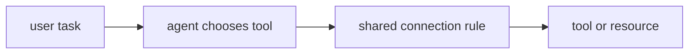
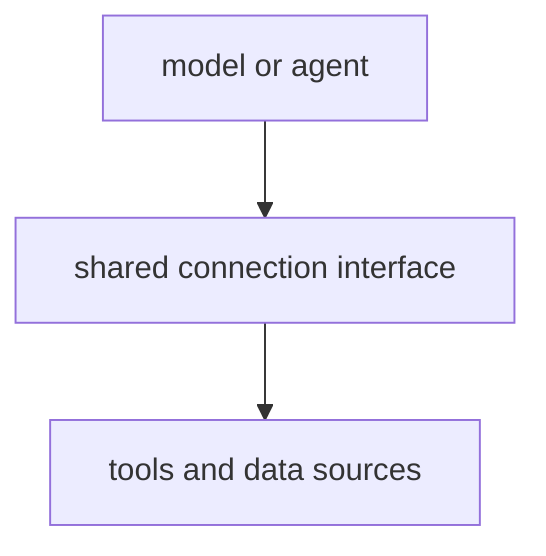

# P5-14.1 MCP와 도구 연결

P5-13.2에서는 에이전트(agent)가 계획, 행동, 관찰의 반복 구조를 가진다는 점을 보았습니다. 이 절에서는 이런 도구와 상태를 여러 시스템 사이에서 더 일관되게 연결하려면 무엇이 필요한지 봅니다.

MCP(Model Context Protocol)는 모델, 에이전트, 애플리케이션이 외부 도구와 데이터에 더 일관되게 연결되도록 돕는 인터페이스 관점입니다. 즉, 여러 도구와 데이터를 제각각 붙이지 말고 더 일정한 방식으로 연결하자는 약속에 가깝습니다.

## 이 절의 범위

이 절은 다음 질문에 답합니다.

- 왜 도구 연결에 표준화된 인터페이스 관점이 필요한가?
- MCP를 어떤 역할로 이해하면 좋은가?
- MCP는 모델 자체가 아니라 어떤 연결 문제를 다루는가?

이 절에서는 다음 내용을 깊게 다루지 않습니다.

- 프로토콜 메시지 포맷 세부
- 특정 SDK 구현 비교
- 인증/권한 체계 전체 설계

MCP의 연결 관점은 여기서 잡고, 실행을 감싸는 운영 장치의 역할은 바로 다음 P5-14.2 하네스에서 다시 회수합니다. 인증과 권한이 실제 실패 대응과 만나는 지점은 P5-16.2 운영 중 실패 대응에서 다시 이어지며, 프로토콜 포맷 세부는 현재 본편 범위 밖으로 둡니다.

이 절에서는 MCP를 제품 유행어처럼 소개하지 않고, `도구 연결을 덜 제각각으로 만들려는 표준화 관점`으로 설명합니다.

처음 읽을 때는 지금 읽는 층위를 다음처럼 고정해 두면 덜 흔들립니다.

| 지금 읽는 층위 | 앞 절에서 가져온 것 | 뒤 절로 넘길 것 |
| --- | --- | --- |
| 연결 인터페이스 층위 | tool use와 agent 실행 흐름 | 하네스, 평가, 실패 대응 같은 운영 층위 |

## 이 절의 목표

- MCP를 입문 수준에서 설명할 수 있습니다.
- 모델 능력과 연결 인터페이스를 구분할 수 있습니다.
- 왜 agent와 tool use가 커질수록 연결 표준이 중요해지는지 말할 수 있습니다.
- 다음 절의 하네스(harness) 설명으로 자연스럽게 넘어갈 수 있습니다.

## 이 절을 읽는 순서

이 절은 다음 순서로 읽으면 흐름이 덜 끊깁니다.

1. 왜 표준 연결이 필요한지 먼저 읽습니다.
2. 그다음 MCP가 모델 성능이 아니라 연결 형식을 다룬다는 점을 구분합니다.
3. 사례와 Python 예제에서는 `공통 연결 관점이 있으면 실제로 무엇이 덜 흔들리는가`를 확인합니다.

## 왜 표준 연결이 필요해지나

도구 사용이 한두 개일 때는 개별 연결을 직접 만들어도 됩니다. 하지만 에이전트 구조가 커지면 문제가 생깁니다.

먼저 다음 세 질문으로 읽으면 좋습니다.

| 질문 | 짧은 답 |
| --- | --- |
| 왜 이런 연결 약속이 필요한가? | 도구 수가 늘면 연결 방식이 제각각이 되기 쉬워서 |
| 무엇을 일정하게 맞추려는가? | 도구 설명, 요청 형식, 응답 형식 |
| 그래서 바뀌는 것은 무엇인가? | 모델보다 연결 환경이 덜 혼란스러워진다 |

- 어떤 도구는 파일을 읽고
- 어떤 도구는 검색을 하고
- 어떤 도구는 데이터베이스를 조회하고
- 어떤 도구는 API를 호출하고

이런 연결이 모두 제각각이면, 시스템은 점점 다루기 어려워집니다.

다음처럼 이해하면 좋습니다.

`도구가 늘어날수록, 모델이 무엇을 쓸 수 있고 어떤 형식으로 써야 하는지를 일정하게 맞추지 않으면 연결 방식마다 실패 원인이 달라진다.`

서비스 구조 관점으로 다시 말하면, tool use는 `도구를 부른다`에 가깝고, MCP는 `그 도구들을 어떤 공통 형식으로 드러낼까`를 다루는 단계입니다.

이 차이를 한 번 더 단순화하면 다음과 같습니다.



이 그림에서 핵심은 에이전트가 매번 도구마다 다른 사적 규칙을 외우는 대신, 공통 연결 규칙을 통해 도구와 자원을 본다는 점입니다.

## MCP는 무엇을 표준화하려 하나

MCP를 너무 기술 세부로 들어가기 전에, 먼저 역할만 잡으면 충분합니다.

MCP가 다루는 핵심은 다음과 같습니다.

- 어떤 도구가 있는가
- 어떤 데이터나 리소스를 읽을 수 있는가
- 어떤 형식으로 요청하고 응답할 것인가

즉, MCP는 보통 `모델이 더 똑똑해지는 방법`이 아니라, `모델과 외부 시스템이 덜 혼란스럽게 연결되는 방법`으로 읽는 편이 정확합니다.

여기서 `모델이 스스로 더 잘하게 되는 변화`와 `외부 도구 연결 방식이 정리되는 변화`를 분리해서 봐야, 성능 문제와 연결 문제를 같은 층위로 섞지 않게 됩니다.

## 왜 모델 자체와 구분해야 하나

이 구분을 먼저 잡아야 모델 자체 한계인지, 도구 노출 방식과 연결 설계 문제인지 원인을 나눠 볼 수 있습니다.

모델은:

- 텍스트를 이해하고 생성하는 능력

을 중심으로 합니다.

반면 MCP 같은 연결 관점은:

- 외부 도구와 데이터에 접근하는 방법
- 그 접근 형식의 일관성

을 중심으로 합니다.

따라서 MCP는 `모델 내부 능력`이 아니라 `주변 실행 환경의 연결 문제`에 가깝습니다.

## 왜 에이전트 시대에 더 중요해졌나

단일 프롬프트 기반 사용에서는 연결 문제가 비교적 단순했습니다. 하지만 agent 구조가 등장하면 다음이 같이 필요해집니다.

- 파일 읽기
- 검색
- 코드 실행
- 데이터 조회
- 상태 전달

이처럼 여러 도구가 한 작업 흐름 안에서 엮일수록, 도구 설명 방식과 호출 방식이 일정해야 시스템이 커지기 쉽습니다.

즉, MCP는 `agent가 더 많은 외부 능력을 다루는 시대`와 함께 중요해진 관점이라고 볼 수 있습니다.

## MCP가 있으면 무엇이 쉬워지나

너무 과장하지 말고 다음 정도만 잡으면 좋습니다.

- 도구 목록을 일정한 방식으로 드러내기 쉬워짐
- 요청/응답 구조를 더 일관되게 유지하기 쉬워짐
- 여러 시스템을 바꿔도 연결 관점을 재사용하기 쉬워짐

즉, MCP는 `새 능력 생성기`라기보다 `연결 정리 도구`에 가깝습니다.

같은 요청 흐름으로 다시 정리하면 다음과 같습니다.

- 프롬프트: 요청을 적는다
- RAG: 읽을 문서를 붙인다
- 도구 사용: 실행할 기능을 부른다
- 에이전트: 여러 단계를 이어 간다
- MCP: 그 연결들을 더 일정한 형식으로 다루게 돕는다

## MCP도 만능은 아니다

이 점도 같이 넣어야 합니다.

MCP가 있다고 해서:

- 도구 품질이 자동으로 좋아지거나
- 권한 문제가 사라지거나
- 잘못된 호출이 모두 없어지거나
- 평가가 자동 해결되는 것

은 아닙니다.

즉, 연결 형식이 정리되는 것과, 실제 운영 품질이 좋아지는 것은 다른 문제입니다.

## 아주 단순하게 그리면



이 도식의 핵심은 MCP를 `모델과 도구 사이의 연결 계층`으로 읽는 데 있습니다.

같은 내용을 연결 혼잡도 관점으로 다시 비교하면 다음과 같습니다.

| 상태 | 모델이나 에이전트가 알아야 하는 것 | 흔한 운영 문제 |
| --- | --- | --- |
| MCP 같은 공통 연결 관점이 약할 때 | 도구마다 다른 이름, 인자 형식, 반환 형식 | 형식 불일치, 예외 처리 증가, 새 도구 추가 비용 증가 |
| MCP 같은 공통 연결 관점이 있을 때 | 공통 방식으로 노출된 도구 목록과 리소스 정보 | 연결 자체보다 권한, 품질, 평가 문제를 더 분리해 다루기 쉬워짐 |

## 사례로 보기

사례를 읽을 때는 `도구가 무엇인가`보다 `어디에서 연결 규칙이 먼저 흔들리는가`를 중심으로 보면 좋습니다.

### 사례 1. 문서 읽기와 검색을 함께 쓰는 에이전트

사내 정책 문서를 찾아 답하는 에이전트를 생각해 볼 수 있습니다. 사람은 파일 읽기와 문서 검색이 둘 다 `문서를 보는 일`이니 비슷하게 붙이면 된다고 생각하기 쉽습니다. 하지만 이 에이전트는 어떤 경우에는 파일을 직접 열어야 하고, 어떤 경우에는 검색으로 관련 문서를 먼저 찾아야 합니다. 예를 들어 정확한 파일 경로를 이미 아는 경우와, 키워드만 알고 있어 후보 문서를 먼저 찾아야 하는 경우는 접근 방식이 다릅니다. 그런데 파일 읽기 도구와 검색 도구가 서로 다른 호출 규칙과 결과 형식을 쓰면, 에이전트는 답을 만들기 전에 `어떤 방식으로 접근해야 하는가`부터 따로 배워야 합니다. 이 연결이 뒤섞이면 답변 전 준비 단계에서 잘못된 도구를 골라 검색해야 할 문서를 직접 읽으려 하거나, 반대로 경로가 있는 파일을 괜히 검색으로 돌릴 수 있습니다. 여기서 바뀌는 점은 `둘 다 문서를 보는 일인가`를 보던 기준에서 `읽을 자원과 검색할 자원을 같은 형식으로 구분해 다룰 수 있는가`를 보는 기준으로 이동한다는 것입니다. MCP 같은 연결 계층은 이런 자원을 더 일정한 형식으로 드러내어 `읽을 수 있는 것`, `검색할 수 있는 것`을 같은 방식으로 다루기 쉽게 만듭니다. 그래서 이 사례에서 확인해야 할 결과는 경로가 있는 문서는 바로 읽고, 경로가 없는 질문은 먼저 검색하는 식으로 도구 선택이 실제로 더 일관되게 갈라지는가입니다.

### 사례 2. 코딩 에이전트

코딩 에이전트가 코드베이스를 검색하고, 파일을 읽고, 테스트를 실행하고, 패치를 적용한다고 해 봅시다. 사람은 보통 `검색 도구 하나, 실행 도구 하나`씩 따로 붙이면 될 것처럼 생각하기 쉽습니다. 하지만 직접 스크립트를 붙이면 각 도구의 입력 형식과 반환 형식이 제각각이라 한 단계씩 별도 예외 처리가 늘어나기 쉽습니다. 예를 들어 검색 결과는 파일 목록인데 테스트 실행기는 디렉터리 경로를 기대하고, 패치 도구는 또 다른 형식을 요구할 수 있습니다. 이렇게 되면 실제 코드를 고치는 일보다 `도구를 서로 이어 붙이는 일`이 더 큰 부담이 될 수 있습니다. 이 연결이 불안정하면 패치 자체는 맞아도 테스트 실행 단계에서 형식 불일치로 멈춰, 결과적으로 수정 검증이 끝나지 않을 수 있습니다. 여기서 바뀌는 점은 `도구를 각각 붙였는가`를 보던 기준에서 `도구 사이 입력과 반환 형식이 예측 가능하게 이어지는가`를 보는 기준으로 이동한다는 것입니다. 연결 표준 관점이 들어오면 에이전트는 `검색 가능 도구`, `읽기 가능 자원`, `실행 가능 도구`를 더 예측 가능한 방식으로 다룰 수 있습니다. 그래서 이 사례에서 확인해야 할 결과는 패치 내용보다 먼저 입력 형식 불일치로 멈추던 단계가 줄고, 검색 결과에서 테스트 실행까지의 연결이 실제로 더 안정되는가입니다.

### 사례 3. 조직 내부 시스템 연결

조직 내부에서 문서 저장소, 업무 DB, 캘린더 API를 함께 쓰는 비서를 떠올려 볼 수 있습니다. 사람은 필요한 데이터만 있으면 연결 자체는 큰 문제가 아니라고 생각하기 쉽습니다. 하지만 실제로 손으로 붙이면 문서는 검색 쿼리, DB는 SQL 비슷한 질의, 캘린더는 별도 API 인자처럼 접근 방식이 모두 달라집니다. 예를 들어 같은 `오늘 일정 확인` 요청도, 사람 정보는 DB에서 찾고 일정은 캘린더 API에서 조회하며 관련 안내는 문서 저장소에서 다시 읽어야 할 수 있습니다. 이때 문제는 `데이터가 없다`가 아니라 `데이터마다 접근 규칙이 너무 다르다`는 데 생깁니다. 접근 규칙이 제각각이면 한 시스템에서 얻은 값을 다음 시스템 호출에 넘기는 과정에서 형식 오류나 누락이 쉽게 생길 수 있습니다. 여기서 바뀌는 점은 `필요한 데이터가 있나`를 보던 기준에서 `서로 다른 시스템 접근 규칙을 일정한 형식으로 다룰 수 있는가`를 보는 기준으로 이동한다는 것입니다. MCP 같은 연결 계층은 이런 시스템을 모델 친화적으로 드러내어, 에이전트가 어떤 자원에 접근 가능한지와 어떤 형식으로 써야 하는지를 더 일정하게 만듭니다. 그래서 이 사례에서 확인해야 할 결과는 사람 정보 조회, 일정 조회, 안내 문서 읽기가 서로 다른 규칙 때문에 자주 끊기지 않고 하나의 작업 흐름으로 더 안정적으로 이어지는가입니다.

세 사례를 한 줄로 묶으면 다음과 같습니다.

| 상황 | MCP 관점이 필요한 이유 |
| --- | --- |
| 문서 읽기 + 검색 | 여러 읽기 자원을 같은 식으로 다루기 위해 |
| 코딩 에이전트 | 파일, 실행기, 검색기 호출 방식을 정리하기 위해 |
| 내부 시스템 연결 | 서로 다른 시스템을 공통 인터페이스로 묶기 위해 |

세 사례를 연결 안정성 관점으로 다시 묶으면 다음과 같습니다.

| 상황 | 공통 연결 관점이 없을 때 먼저 흔들리는 것 | 공통 연결 관점이 있을 때 먼저 안정되는 것 |
| --- | --- | --- |
| 문서 읽기 + 검색 | 읽기 자원과 검색 자원 선택 규칙 | 어떤 자원은 읽고 어떤 자원은 검색하는 구분 |
| 코딩 에이전트 | 도구별 입력·반환 형식 연결 | 검색에서 실행까지의 형식 예측 가능성 |
| 내부 시스템 연결 | 시스템마다 다른 접근 규칙 | 사람 정보, 일정, 문서 조회의 연결 흐름 |

## 실행 가능한 Python 예제로 보기

이번 예제의 목표는 실제 프로토콜 세부를 구현하는 것이 아니라, 에이전트가 여러 요청을 처리할 때 `공통 연결 계층이 있으면 어떤 요청은 끝까지 진행되고`, `형식이 제각각이면 어디에서 멈추는가`를 눈으로 확인하는 것입니다. 단순히 목록 모양만 검사하면 연결 계층의 의미가 잘 드러나지 않으므로, 이번에는 여러 사용자 요청을 실제로 흘려 보내 보겠습니다.

문제 상황:

- 에이전트는 검색 도구, 파일 읽기 도구, 테스트 실행 도구를 함께 써야 함
- 문서 저장소와 코드베이스 파일도 각각 다른 자원임
- 각 항목이 제각각 노출되면 어떤 이름으로 어떤 인자를 써야 하는지 매번 따로 알아야 함

입력:

- 공통 연결 계층에 등록된 도구 목록
- 형식이 제각각인 연결 목록

출력:

- 요청별 실행 결과
- 어떤 도구와 리소스가 실제로 선택되었는지에 대한 run report
- 공통 연결 계층이 있을 때와 없을 때 성공률이 어떻게 달라지는지 보여 주는 요약값

먼저 이 예제에서 함께 볼 비교 기준은 다음과 같습니다.

| 점검 항목 | 왜 필요한가 |
| --- | --- |
| `request_success` | 사용자 요청이 실제로 끝까지 진행되는지 봐야 해서 |
| `tool_resolved` | 필요한 도구를 공통 형식으로 찾을 수 있어야 해서 |
| `resource_resolved` | 읽을 자원을 일정한 방식으로 식별할 수 있어야 해서 |
| `failure_reason` | 어떤 연결 결함이 먼저 실행을 멈추는지 구분해야 해서 |

문제 상황:

- MCP 계층은 도구와 자원을 일정한 규약으로 연결해야 하므로 어느 층에서 해석이 끊기는지 확인할 필요가 있다

입력(input):

위에 정리한 connection layer 시나리오를 사용합니다.

확인할 개념:

- MCP 연결 문제는 도구 해석, 자원 해석, 승인 흐름 중 어느 단계에서 끊기는지 분리해 봐야 원인을 잡을 수 있다

```python
from pprint import pprint


connection_layers = [
    {
        "name": "consistent_layer",
        "tools": [
            {"name": "search_docs", "input_schema": ["query"], "returns": "document_hits"},
            {"name": "read_file", "input_schema": ["path"], "returns": "file_text"},
            {"name": "run_tests", "input_schema": ["target"], "returns": "test_report"},
            {"name": "query_employee_db", "input_schema": ["employee_id"], "returns": "employee_record"},
        ],
        "resources": [
            {"name": "policy_repository", "type": "document_store"},
            {"name": "codebase_files", "type": "filesystem"},
            {"name": "employee_directory", "type": "database"},
        ],
    },
    {
        "name": "inconsistent_layer",
        "tools": [
            {"tool_name": "search_docs", "returns": "document_hits"},
            {"name": "read_file", "input_schema": ["path"]},
            {"name": "run_tests", "returns": "test_report"},
            {"name": "query_employee_db", "schema": ["employee_id"], "returns": "employee_record"},
        ],
        "resources": [
            {"resource": "policy_repository"},
            {"name": "codebase_files", "kind": "filesystem"},
            {"name": "employee_directory"},
        ],
    },
]


requests = [
    {
        "request_id": "req-01",
        "goal": "사내 환불 정책을 찾아 요약한다",
        "tool_needed": "search_docs",
        "resource_needed": "policy_repository",
        "payload": {"query": "환불 정책 최신 버전"},
    },
    {
        "request_id": "req-02",
        "goal": "특정 경로의 파일을 읽는다",
        "tool_needed": "read_file",
        "resource_needed": "codebase_files",
        "payload": {"path": "docs/parts/part-05/index.md"},
    },
    {
        "request_id": "req-03",
        "goal": "직원 ID로 조직 정보를 조회한다",
        "tool_needed": "query_employee_db",
        "resource_needed": "employee_directory",
        "payload": {"employee_id": "E-102"},
    },
    {
        "request_id": "req-04",
        "goal": "변경 후 테스트를 실행한다",
        "tool_needed": "run_tests",
        "resource_needed": "codebase_files",
        "payload": {"target": "tests/test_login.py"},
    },
]


def find_tool(layer, tool_name):
    for tool in layer["tools"]:
        if tool.get("name") == tool_name:
            return tool
    return None


def find_resource(layer, resource_name):
    for resource in layer["resources"]:
        if resource.get("name") == resource_name:
            return resource
    return None


def run_request(layer, request):
    tool = find_tool(layer, request["tool_needed"])
    resource = find_resource(layer, request["resource_needed"])

    if tool is None:
        return {
            "request_id": request["request_id"],
            "goal": request["goal"],
            "tool_resolved": False,
            "resource_resolved": resource is not None,
            "request_success": False,
            "failure_reason": "tool_name_not_exposed_in_common_shape",
        }

    if "input_schema" not in tool:
        return {
            "request_id": request["request_id"],
            "goal": request["goal"],
            "tool_resolved": True,
            "resource_resolved": resource is not None,
            "request_success": False,
            "failure_reason": "tool_schema_missing",
        }

    if resource is None:
        return {
            "request_id": request["request_id"],
            "goal": request["goal"],
            "tool_resolved": True,
            "resource_resolved": False,
            "request_success": False,
            "failure_reason": "resource_name_not_exposed",
        }

    if "type" not in resource:
        return {
            "request_id": request["request_id"],
            "goal": request["goal"],
            "tool_resolved": True,
            "resource_resolved": True,
            "request_success": False,
            "failure_reason": "resource_type_missing",
        }

    missing_inputs = [
        field for field in tool["input_schema"] if field not in request["payload"]
    ]
    if missing_inputs:
        return {
            "request_id": request["request_id"],
            "goal": request["goal"],
            "tool_resolved": True,
            "resource_resolved": True,
            "request_success": False,
            "failure_reason": f"missing_inputs:{missing_inputs}",
        }

    return {
        "request_id": request["request_id"],
        "goal": request["goal"],
        "tool_resolved": True,
        "resource_resolved": True,
        "request_success": True,
        "tool_name": tool["name"],
        "resource_name": resource["name"],
        "resource_type": resource["type"],
        "used_payload": request["payload"],
        "failure_reason": None,
    }


layer_reports = []
for layer in connection_layers:
    run_reports = [run_request(layer, request) for request in requests]
    summary = {
        "request_count": len(run_reports),
        "success_count": sum(report["request_success"] for report in run_reports),
        "tool_resolution_success_count": sum(report["tool_resolved"] for report in run_reports),
        "resource_resolution_success_count": sum(report["resource_resolved"] for report in run_reports),
        "failure_reasons": [report["failure_reason"] for report in run_reports if report["failure_reason"]],
    }
    layer_reports.append(
        {
            "layer_name": layer["name"],
            "summary": summary,
            "run_reports": run_reports,
        }
    )

overall = {
    "layers_tested": len(layer_reports),
    "fully_successful_layers": sum(
        report["summary"]["success_count"] == len(requests)
        for report in layer_reports
    ),
}

print("[overall]")
pprint(overall)
print()

for report in layer_reports:
    print("=" * 80)
    print(f"[layer] {report['layer_name']}")
    print("[summary]")
    pprint(report["summary"])
    print("[run_reports]")
    for run_report in report["run_reports"]:
        pprint(run_report)
    print()
```

실행 결과 예시는 다음처럼 읽을 수 있습니다.

```text
[overall]
{'fully_successful_layers': 1, 'layers_tested': 2}

================================================================================
[layer] consistent_layer
[summary]
{'failure_reasons': [],
 'request_count': 4,
 'resource_resolution_success_count': 4,
 'success_count': 4,
 'tool_resolution_success_count': 4}
[run_reports]
{'failure_reason': None,
 'goal': '사내 환불 정책을 찾아 요약한다',
 'request_id': 'req-01',
 'request_success': True,
 'resource_name': 'policy_repository',
 'resource_resolved': True,
 'resource_type': 'document_store',
 'tool_name': 'search_docs',
 'tool_resolved': True,
 'used_payload': {'query': '환불 정책 최신 버전'}}
{'failure_reason': None,
 'goal': '특정 경로의 파일을 읽는다',
 'request_id': 'req-02',
 'request_success': True,
 'resource_name': 'codebase_files',
 'resource_resolved': True,
 'resource_type': 'filesystem',
 'tool_name': 'read_file',
 'tool_resolved': True,
 'used_payload': {'path': 'docs/parts/part-05/index.md'}}
{'failure_reason': None,
 'goal': '직원 ID로 조직 정보를 조회한다',
 'request_id': 'req-03',
 'request_success': True,
 'resource_name': 'employee_directory',
 'resource_resolved': True,
 'resource_type': 'database',
 'tool_name': 'query_employee_db',
 'tool_resolved': True,
 'used_payload': {'employee_id': 'E-102'}}
{'failure_reason': None,
 'goal': '변경 후 테스트를 실행한다',
 'request_id': 'req-04',
 'request_success': True,
 'resource_name': 'codebase_files',
 'resource_resolved': True,
 'resource_type': 'filesystem',
 'tool_name': 'run_tests',
 'tool_resolved': True,
 'used_payload': {'target': 'tests/test_login.py'}}
================================================================================
[layer] inconsistent_layer
[summary]
{'failure_reasons': ['tool_name_not_exposed_in_common_shape',
                     'resource_type_missing',
                     'tool_schema_missing',
                     'tool_schema_missing'],
 'request_count': 4,
 'resource_resolution_success_count': 3,
 'success_count': 0,
 'tool_resolution_success_count': 3}
[run_reports]
{'failure_reason': 'tool_name_not_exposed_in_common_shape',
 'goal': '사내 환불 정책을 찾아 요약한다',
 'request_id': 'req-01',
 'request_success': False,
 'resource_resolved': False,
 'tool_resolved': False}
{'failure_reason': 'resource_type_missing',
 'goal': '특정 경로의 파일을 읽는다',
 'request_id': 'req-02',
 'request_success': False,
 'resource_resolved': True,
 'tool_resolved': True}
{'failure_reason': 'tool_schema_missing',
 'goal': '직원 ID로 조직 정보를 조회한다',
 'request_id': 'req-03',
 'request_success': False,
 'resource_resolved': True,
 'tool_resolved': True}
{'failure_reason': 'tool_schema_missing',
 'goal': '변경 후 테스트를 실행한다',
 'request_id': 'req-04',
 'request_success': False,
 'resource_resolved': True,
 'tool_resolved': True}
```

이 예제에서 먼저 봐야 할 것은 `consistent_layer`에서는 네 요청이 모두 성공하지만, `inconsistent_layer`에서는 도구 이름, 입력 형식, 자원 타입이 제각각이라 네 요청이 모두 중간에서 멈춘다는 점입니다. 즉, 같은 도구 수를 갖고 있어도 `name`, `input_schema`, `type` 같은 최소 공통 형식이 맞지 않으면 에이전트는 실제 업무 흐름을 끝까지 밀고 가지 못합니다.

이 예제에서 확인해야 할 결과는 모델이나 에이전트가 외부 시스템을 제각각 직접 다루는 것이 아니라, 도구와 리소스를 공통 인터페이스로 드러내는 연결 계층을 통해 접근한다는 점입니다.

이 예제에서 독자가 직접 해 볼 수 있는 조정은 다음과 같습니다.

- 새 도구 `query_database`를 두 레이어에 각각 추가해 같은 방식으로 노출되는지 보기
- `inconsistent_layer`의 도구 하나에만 `input_schema`를 추가해도 전체 일관성이 왜 아직 깨지는지 확인하기
- 리소스에 `permissions` 같은 필드를 넣어 권한 관점까지 확장해 보기

이 예제에서 읽어야 할 핵심은 다음입니다.

- 모델이 직접 모든 시스템을 제각각 아는 것이 아니라
- 중간 연결 계층을 통해
- 도구와 리소스를 일정한 형식으로 본다는 점입니다

## 이 예제를 연결 계층 관점으로 다시 보면

이 장난감 구조는 도구가 많아지는 시대에 중요한 것이 `도구 개수`보다 `어떻게 같은 방식으로 연결하느냐`라는 점을 보여 줍니다. 그래서 MCP를 읽을 때도 개별 도구 기능보다, 모델과 외부 시스템 사이의 연결 형식을 통일해 주는 계층이라는 역할을 먼저 잡는 것이 좋습니다.

여기까지를 한 줄로 묶으면, MCP 관점은 `도구를 더 많이 붙이는 기술`이 아니라 `붙인 도구들을 같은 방식으로 읽고 호출하게 만드는 연결 규칙`입니다.

LLM이 실제 작업 환경으로 들어오면서, 문제는 단순히 `모델이 무슨 답을 하는가`를 넘어서 `어떤 시스템과 어떻게 연결되는가`로 이동했습니다. 이 흐름에서 연결 표준과 공통 인터페이스 관점이 점점 더 중요해졌습니다.

커리큘럼 관점에서 이 절이 중요한 이유는 다음과 같습니다.

- 바로 앞의 P5-12.1, P5-12.2 도구 사용 구조와 P5-13.1, P5-13.2 에이전트 실행 구조를 `연결 계층` 관점에서 다시 읽게 하고
- agent와 tool use를 시스템 연결 문제까지 확장해 읽게 하며
- 다음 절의 P5-14.2 하네스와 뒤의 P5-16.2 운영 실패 대응으로 넘어갈 준비를 시키고, Part 6 프로젝트에서 도구 연결 아키텍처를 설계할 때 재사용할 관점을 제공하기 때문입니다

## 다음 절과의 연결

여기까지 오면 다음 질문이 남습니다.

- 연결 형식이 정리되어도, 실행을 안정적으로 감싸고 로그와 평가를 남기는 구조는 무엇인가?
- 에이전트 실행을 반복 가능하게 관리하려면 무엇이 더 필요한가?

이 질문은 P5-14.2 하네스(harness)로 이어집니다.

## 이 절에서 기억할 관점

- MCP는 모델과 도구/데이터 사이 연결을 더 일관되게 만드는 인터페이스 관점입니다.
- 이것은 모델 능력 자체보다 연결 구조의 문제를 다룹니다.
- agent와 tool use가 커질수록 연결 표준의 중요성이 커집니다.
- 연결 표준이 있다고 해서 운영 품질이 자동 해결되지는 않습니다.

## 체크리스트

- MCP를 입문 수준에서 설명할 수 있는가?
- 모델 능력과 연결 인터페이스를 구분할 수 있는가?
- 왜 agent 시대에 연결 표준이 중요해졌는지 말할 수 있는가?
- 왜 다음 절에서 하네스를 따로 봐야 하는지 설명할 수 있는가?

## 출처와 참고 자료

- OpenAI, MCP 관련 공식 문서와 소개 자료, 확인 날짜: 2026-06-29.
- 관련 tool integration 및 agent engineering 교육 자료, 확인 날짜: 2026-06-29.
