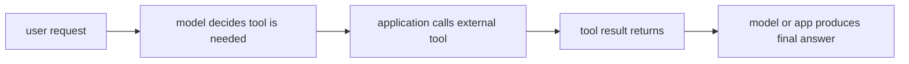

# P5-14.1 도구 사용(tool use)

P5-13.2에서는 벡터 검색에서 인덱스가 검색 속도와 품질의 균형을 만드는 구조라는 점을 보았습니다. 하지만 검색은 외부 세계와 연결되는 한 가지 방식일 뿐입니다. 이제 더 넓은 질문이 나옵니다.

`모델이 문서를 읽는 것을 넘어, 외부 기능을 실제로 호출해야 한다면 어떻게 해야 하는가?`

이 절은 그 질문에 답합니다.

초심자 기준에서는 먼저 다음 한 문장으로 잡으면 충분합니다.

`도구 사용(tool use)은 모델이 텍스트만 생성하는 데서 멈추지 않고, 계산기, 검색기, 데이터베이스, API 같은 외부 기능을 연결해 쓰는 구조다.`

같은 말을 더 쉽게 바꾸면 다음과 같습니다.

`도구 사용은 모델이 말만 하는 것을 넘어서, 필요한 기능을 밖에서 불러와 실제 결과를 받아 쓰게 하는 방식이다.`

## 이 절의 범위

이 절은 다음 질문에 답합니다.

- 도구 사용은 왜 필요한가?
- RAG와 도구 사용은 무엇이 다른가?
- 어떤 상황에서 모델 단독 답변보다 도구 호출이 더 적합한가?

이 절은 다음 내용은 깊게 다루지 않습니다.

- agent loop 전체 구조
- 권한 관리 시스템 세부
- 특정 SDK의 구현 방식

이 절의 목적은 tool use를 `모델이 갑자기 실행 능력을 가진다`는 식으로 설명하지 않고, `애플리케이션이 모델과 외부 기능을 연결하는 구조`로 설명하는 데 있습니다.

## 이 절의 목표

- 도구 사용을 초심자 수준에서 설명할 수 있습니다.
- RAG와 도구 사용의 차이를 말할 수 있습니다.
- 계산, 조회, 실행 같은 작업에서 왜 도구가 필요한지 설명할 수 있습니다.
- 다음 절의 함수 호출(function calling) 구조로 자연스럽게 넘어갈 수 있습니다.

## 왜 도구 사용이 필요한가

LLM은 텍스트 생성에 강하지만, 다음과 같은 작업은 모델 단독으로 처리하기 어렵거나 위험할 수 있습니다.

초심자는 먼저 다음 세 질문으로 읽으면 좋습니다.

| 질문 | 초심자용 짧은 답 |
| --- | --- |
| 왜 도구가 필요한가? | 말만으로는 정확한 계산, 조회, 실행이 어렵기 때문에 |
| 무엇이 추가되는가? | 외부 기능 호출 단계 |
| 그래서 바뀌는 것은 무엇인가? | 답을 추측하는 대신 실제 결과를 가져오는 구조 |

- 정확한 계산
- 데이터베이스 조회
- 일정 예약
- 이메일 전송
- 파일 읽기와 수정
- 실시간 API 호출

이런 작업은 단순히 `답처럼 보이는 문장`을 만드는 것과 다릅니다. 실제로 외부 세계에 영향을 주거나, 검증 가능한 결과를 가져와야 합니다.

따라서 도구 사용은 보통 다음 목적 때문에 등장합니다.

- 모델의 약한 계산 능력을 보완하기 위해
- 실시간 정보에 접근하기 위해
- 실제 시스템 동작으로 이어지게 하기 위해

서비스 구조 관점으로 다시 말하면, RAG가 `근거 문서 읽기`를 붙였다면 tool use는 `실제 기능 실행`을 붙이는 단계입니다.

## RAG와 무엇이 다른가

이 차이를 분리해 두는 것이 중요합니다.

| 구조 | 중심 역할 |
| --- | --- |
| RAG | 관련 문서를 찾아서 답변 근거로 붙인다 |
| 도구 사용(tool use) | 외부 기능을 호출해 실제 결과를 가져오거나 실행한다 |

예를 들어:

- 문서 검색 후 설명하는 것은 RAG에 가깝습니다
- 환율 API를 호출해 최신 값을 가져오는 것은 도구 사용에 가깝습니다
- 계산기로 정확한 합계를 구하는 것도 도구 사용에 가깝습니다

즉, RAG는 주로 `읽기(read)` 중심이고, tool use는 `조회(query)`, `계산(compute)`, `실행(act)`까지 포함하는 더 넓은 구조입니다.

## 모델이 직접 도구를 쓰는가

초심자는 여기서 `모델이 스스로 API를 때리는가?`라는 오해를 하곤 합니다. 더 안전한 설명은 다음입니다.

`모델은 보통 어떤 도구가 필요할지에 대한 출력을 만들고, 실제 호출은 애플리케이션이나 실행 환경이 맡는다.`

즉, 도구 사용은:

- 모델이 요청 구조를 제안하고
- 시스템이 그 요청을 해석해
- 실제 도구를 호출하고
- 그 결과를 다시 모델이나 사용자에게 연결하는

협업 구조에 가깝습니다.

초심자는 여기서 `모델이 실행 명령을 제안한다`와 `시스템이 실제로 실행한다`를 분리해서 기억하는 것이 중요합니다.

## 어떤 상황에서 특히 유용한가

도구 사용은 다음 상황에서 매우 실용적입니다.

- 숫자 계산이 정확해야 할 때
- 최신 외부 시스템 조회가 필요할 때
- 파일이나 데이터 조작이 필요할 때
- 실행 결과를 다시 요약해야 할 때

초심자 기준에서는 다음처럼 기억하면 좋습니다.

`도구 사용은 모델이 잘 말하는 능력과, 시스템이 실제로 하는 능력을 연결하는 구조다.`

같은 요청 흐름으로 다시 정리하면 다음과 같습니다.

- 프롬프트: 질문 방식 조정
- RAG: 답하기 전 근거 문서 연결
- 도구 사용: 답하기 전 또는 답하는 중 실제 기능 호출

## 도구 사용도 만능은 아니다

이 점도 같이 넣어야 합니다.

도구 사용이 있다고 해서:

- 항상 올바른 도구를 고르는 것
- 필요한 인자를 정확히 구성하는 것
- 권한 없는 작업을 자동으로 막는 것
- 잘못된 실행 결과를 스스로 모두 교정하는 것

이 자동 보장되지는 않습니다.

즉, 도구 사용은 능력을 넓히지만, 동시에 다음 문제가 생깁니다.

- 권한(permission)
- 승인(approval)
- 실패 처리(error handling)
- 로그(trace)
- 재현성(reproducibility)

이 문제들은 뒤 장의 에이전트와 하네스(harness) 구조로 이어집니다.

## 아주 단순하게 그리면



이 도식의 핵심은 모델이 혼자 끝내는 것이 아니라, 외부 시스템과 왕복이 생긴다는 점입니다.

## 사례로 보기

### 사례 1. 계산기 도구

사용자가 `복리 계산을 해 줘`라고 묻는다면, 모델이 머리로 근사한 답을 만드는 것보다 계산기 도구를 호출해 정확한 값을 가져오는 편이 더 안전할 수 있습니다.

### 사례 2. 일정 조회

사용자가 `다음 주 비어 있는 회의실을 찾아 줘`라고 요청하면, 이것은 문장 생성 문제가 아니라 실제 캘린더 시스템 조회 문제입니다. 도구 사용이 필요합니다.

### 사례 3. 파일 수정

코딩 에이전트가 파일을 읽고 수정하고 테스트하는 흐름은, 단순 설명이 아니라 도구 사용과 실행 환경이 결합된 사례입니다.

세 사례를 한 줄로 묶으면 다음과 같습니다.

| 상황 | 도구 사용이 필요한 이유 |
| --- | --- |
| 계산 | 추정이 아니라 정확한 수치가 필요해서 |
| 일정 조회 | 실제 시스템 상태를 확인해야 해서 |
| 파일 수정 | 실행 가능한 작업 결과를 만들어야 해서 |

## 작은 Python 예제로 보기

이번 예제의 목표는 실제 외부 API를 호출하는 것이 아니라, `모델 출력`과 `도구 호출`이 구분된다는 점을 보는 것입니다.

입력:

- 사용자 요청
- 선택된 도구
- 도구 인자

출력:

- 호출 준비 구조

```python
user_request = "오늘 서울 환율을 알려 주세요."

tool_call = {
    "tool": "exchange_rate_lookup",
    "arguments": {
        "city": "Seoul",
        "date": "today",
    },
}

print("user_request =", user_request)
print("tool_call =", tool_call)
print("next_step = application executes the tool")
```

실행 결과 예시는 다음처럼 읽을 수 있습니다.

```text
user_request = 오늘 서울 환율을 알려 주세요.
tool_call = {'tool': 'exchange_rate_lookup', 'arguments': {'city': 'Seoul', 'date': 'today'}}
next_step = application executes the tool
```

이 예제는 모델이 최종 답을 바로 쓴 것이 아니라, 먼저 어떤 외부 기능을 써야 하는지 구조화된 요청을 만들 수 있다는 점을 보여 줍니다.

이 예제에서 초심자가 읽어야 할 핵심은 다음입니다.

- 사용자 요청과
- 도구 호출 구조와
- 실제 실행 단계가 분리되어 있다는 점입니다

즉, tool use는 `대답` 이전에 `실행 준비 구조`를 만든다고 볼 수 있습니다.

## 역사와 커리큘럼 관점

초기 LLM 사용 경험은 주로 `잘 말하는 모델`에 집중되어 있었습니다. 하지만 실서비스로 가면 곧 한계가 드러났습니다.

- 최신성 부족
- 계산 오류
- 실제 시스템과 단절

이 한계를 넘기 위해 검색, 계산기, 코드 실행기, 데이터베이스, API를 연결하는 흐름이 빠르게 중요해졌습니다.

커리큘럼 관점에서 이 절이 중요한 이유는 다음과 같습니다.

- RAG와 도구 사용을 섞지 않게 하고
- 이후 함수 호출, 에이전트, MCP를 이해할 준비를 시키며
- `LLM은 혼자 일하지 않는다`는 서비스 구조 관점을 강화하기 때문입니다

## 다음 절과의 연결

여기까지 오면 다음 질문이 남습니다.

- 도구를 써야 한다는 판단을 시스템이 어떻게 구조화해서 전달하는가?
- 문자열로 막연히 요청하지 않고, 인자와 이름을 분리해서 전달하는 방식은 무엇인가?

이 질문은 P5-14.2 함수 호출(function calling)로 이어집니다.

## 이 절에서 기억할 관점

- 도구 사용은 모델과 외부 기능을 연결하는 구조입니다.
- RAG는 읽기 중심, tool use는 조회·계산·실행까지 포함하는 더 넓은 구조입니다.
- 실제 도구 호출은 보통 애플리케이션과 실행 환경이 수행합니다.
- 도구 사용은 능력을 넓히지만 권한, 실패 처리, 로그 문제를 함께 데려옵니다.

## 체크리스트

- 도구 사용을 초심자 수준에서 설명할 수 있는가?
- RAG와 도구 사용의 차이를 말할 수 있는가?
- 왜 계산, 조회, 실행 문제에서 도구가 필요한지 설명할 수 있는가?
- 왜 다음 절에서 함수 호출 구조가 필요한지 말할 수 있는가?

## 출처와 참고 자료

- 관련 tool use/augmented LLM 교육 자료, 확인 날짜: 2026-06-29.
- OpenAI, function calling 및 tools 관련 공식 문서, 확인 날짜: 2026-06-29.
- Anthropic, tool use 관련 공개 문서, 확인 날짜: 2026-06-29.
