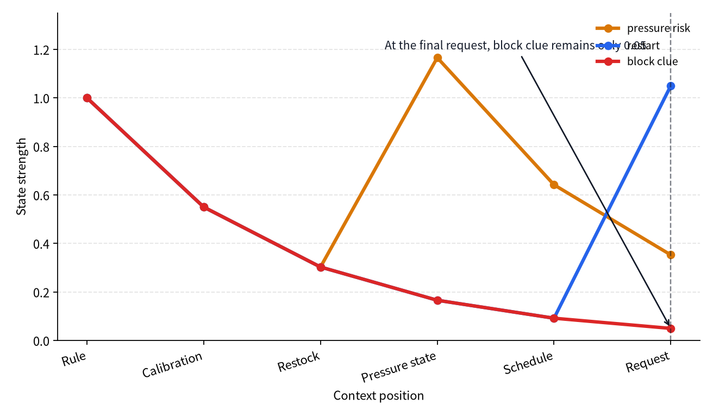
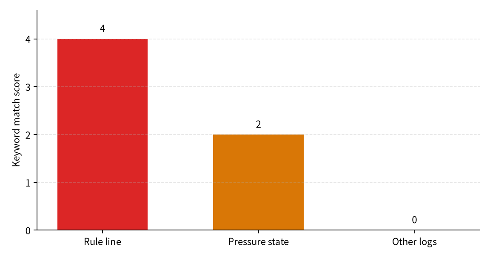

# P5-14.2 Parallel Processing And Long Context

Section ID: `P5-14.2`
Version: `v2026.07.18`

In P5-14.1, we explained the Transformer as a combination of self-attention, feed-forward, residual connection, and layer normalization. The next question remains.

Why did the Transformer look more suited to parallel processing than RNNs, and why did it look like a stronger turning point even for long-context problems?

The Transformer is closer to a structure that calculates the relationships among tokens all at once rather than only passing state token by token in sequence, so it showed major advantages in parallel processing and long-context reference.

When you need to fix again the baseline of this computational feel in a short form, it helps to reread together the glossary entries on [Transformer](../../../reference/concept-glossary.md#transformer), [self-attention](../../../reference/concept-glossary.md#self-attention), and [parallel processing](../../../reference/concept-glossary.md#parallel-processing).

## Scope Of This Section

- Why do the computational flows of the RNN and the Transformer feel different?
- Why was the Transformer advantageous from the viewpoint of parallel processing?
- What intuitive advantage does self-attention give when handling long context?
- Why did this difference connect to the era of large-scale generative models?

The core point that this section needs to close first is that `the Transformer was not merely a better-named model, but a structure that changed sequential transfer into relationship computation and simultaneously pushed up GPU parallel processing and long-context rereference`.

KV cache is revisited in P6-3.4, and sparse attention plus long context are revisited in P6-3.5. That is, here we first close why `a structure that computes token relationships all at once` was more advantageous for parallel processing and distant-context rereference than `sequential state transfer`.

There is also one explanation that must be closed here. We cannot leave only the impression that `the Transformer is faster`. Inside the present section, the reader has to understand why `a structure that computes token relationships all at once` was more advantageous for parallel processing and distant-context rereference than `sequential state transfer`. Explanations of internal block components such as residual and normalization belong to the previous section; here we focus on the difference in computational feel.

This section first understands the large structural difference between `RNN versus Transformer` rather than comparing them fully through mathematics.

## Goals Of This Section

- You can explain the difference in computational flow between RNNs and Transformers.
- You can say why the Transformer fits parallel processing better.
- You can explain intuitively the advantage of self-attention in long-context reference.
- You can connect why this difference led into large-scale generative-model training.

## The Reading Order Of This Section

This section places RNN sequential transfer and Transformer relationship computation side by side, and then explains how that difference continues into parallel processing and long-context problems.

1. First look at RNN sequential transfer and Transformer relationship computation side by side.
2. Then read why that difference connects to GPU parallel processing.
3. Next confirm the difference in feel when rereading distant positions in long context.
4. Finally organize why this structural difference became the foundation of modern generative models.

## Why Does The Transformer Look Different

The self-attention of the Transformer lets each token refer together to the other tokens in the same sequence. This structure makes it easier to treat token relatedness through more matrix-like computation.

That is:

- it no longer has to pass state only one token at a time in strict sequence
- and the feel becomes stronger that the relationships among tokens are calculated at once

`RNNs pass state in order, while the Transformer calculates the relationships among tokens more all at once.`

If P5-14.1 was a section explaining `what is inside the Transformer block`, this section explains `what that block structure changed in the actual computation method and in training scale`.

## Why Does The RNN Feel Strongly Sequential

The RNN family was a structure in which each step inherited the previous state and produced the next state. So the computational feel naturally looks like this.

- it sees the first token and creates a state
- with that state it sees the second token
- then it passes that state to the third token again

That is, it is closer to a flow that pushes tokens forward one by one.

The core is that the RNN continues computation by passing the state made earlier toward the later positions.

`An RNN is a structure that computes sequentially by passing the state made earlier toward later positions.`

## Why Was This Advantageous For Parallel Processing

As we already saw in Part 5, GPUs are strong when they process many similar computations at the same time. The Transformer's self-attention and large matrix operations fit that structure well.

That is, the Transformer:

- makes it easier to bundle token-relatedness computation into tensor operations
- scales well at the batch level
- and showed a direction that fit large-scale parallel training well

The core point is that the Transformer reconstructed token-relatedness computation into parallel matrix operations, making it fit large-scale GPU training.

`The Transformer fit large-scale GPU training well because it was easy to turn token relationships into parallel matrix operations.`

The key point that the reader must hold here is not that `the Transformer added one smarter rule`, but that `it reconstructed the computation itself into a form that GPUs are good at`. That is, the question of this section is not `what components are inside the block`, but `when that block is repeated, why did the computational flow change`.

If we shorten this difference further for introductory reading, it becomes the following.

| Viewpoint | RNN family | Transformer |
| --- | --- | --- |
| computational flow | the result of the previous step is needed for the next step | token relationships are computed more all at once |
| fit with GPUs | strong sequential dependence | easy to bundle into large matrix operations |
| distant-context reference | depends heavily on state transfer | looks more directly at the needed position |

## Why Was It Advantageous In Long Context

In an RNN, for very distant information to reach the current point, the state has to pass through many intermediate steps. In self-attention, by contrast, the current token can refer more directly to a faraway token.

That is, the advantage in long context lies in the fact that distant information does not have to remain only as a faint trace inside intermediate state, but can be rereferred to more directly at the current position.

- distant information does not have to be kept only faintly inside intermediate state
- and when the current position needs it, it can refer to the relevant earlier position more directly

Because of this, the Transformer created a strong turning point for problems that read long context.

That is, the shift to read in this section is that the computational feel moved from `the model must remember distant information for a long time` to `the model can find that distant information again right now`.

## If We Draw This Very Simply

```mermaid
--8<-- "assets/part-05/chapter-14/long-context-direct-reference-en.mmd"
```

This diagram symbolizes together the RNN-style sequential-transfer feel and the more direct-reference feel given by self-attention.

If we compare the same long-context request once more only through the two computational paths, it can be seen as follows.

```mermaid
--8<-- "assets/part-05/chapter-14/sequential-vs-direct-baseline-en.mmd"
```

The first points to hold from this comparison are the following.

- on the sequential-transfer side, the earlier rule has to be carried in intermediate state all the way to the final request
- on the direct-reference side, the current request position directly pulls in again the earlier rule and the relevant state line that it needs
- so the difference lies not only in the result `it sees the distant cue again`, but in the computational path itself by which that cue is reached

## Cases And Examples

The diagram below regroups the three cases of this section through the difference between `reading centered on sequential transfer` and `reading centered on direct reference`.

```mermaid
--8<-- "assets/part-05/chapter-14/long-context-task-flow-en.mmd"
```

This diagram shows that even when the tasks differ, the core problem is similar. All of them involve `bringing a cue from far earlier back into the current position`, and the Transformer deals with that problem by more direct reference.

If we split the same problem into the two computational feels, the difference becomes more direct. Here we need to look not only at `what is rereferred to`, but also at `when the current position rereads that cue, does the computation push line by line in sequence, or does it handle the relationships among several positions together`.

| The same scene | What can easily happen when read first through sequential-transfer thinking | What is first expected when read through direct-reference thinking |
| --- | --- | --- |
| long work-permit Q&A | prohibition conditions and exception clauses from the front can become blurred by the time we reach the later question | the current answer position looks up again the earlier cues and corrects the safety judgment |
| long shift-handoff risk judgment | it becomes easy to lose the early alarm and the basis from the middle checks and rely only on the final status report | the current judgment position brings back again the earlier logs and the basis from the middle checks that it needs |
| long configuration-file review | it becomes easy to look only near the current line and miss the definitions and restriction rules from much earlier | the current position rerefers to the earlier definitions and constraints and keeps configuration consistency |

### Representative Case. Long Work-Permit Question Answering

Imagine a situation where, after reading a long work-permit document, the last line asks again, `Can line 3 be approved for restart now?` Earlier in the document, conditions such as `do not begin restart until pressure release has been confirmed` and `do not open the valve before the interlock is released` have already appeared, but at the question point it becomes easy to want to answer by looking back only at the last few lines. In a sequential-transfer structure, these conditions must be carried all the way from front to back, so as the document grows longer the core no-restart conditions can weaken. In contrast, the Transformer family allows the current question position to refer again directly to the prohibition conditions and exception clauses near the beginning of the document, linking `the position that must answer now` more naturally to `the earlier rule positions`. At this point the feel of parallel computation matters too. Because token relationships are handled together through large matrix operations, it becomes easier for the question position to pull several relevant earlier positions into the computation at once instead of tracing them sequentially one by one.
So the result to confirm in this case is whether the current answer position avoids following only the immediately previous sentence, and instead actually refers again to the earlier prohibition conditions and exception clauses so that restart approval is judged more safely.

The same viewpoint extends directly to long shift-handoff risk judgment and long configuration-file review. But the core point to hold in this section is not the domain name, but `whether the current position rerefers directly to distant earlier cues and handles that comparison together through parallel relationship computation`.

| Standard that is easy for a person to see first | Standard to reread from the viewpoint of parallel processing and direct rereference |
| --- | --- |
| it is easy to feel that it is enough if information read earlier remains only inside the state | as the intermediate context grows longer, one state alone can weaken, so the current position must bring back again the earlier cues it needs |
| if we only hear that the Transformer is faster, it is easy to feel that a newer model is simply better | the core is that it changed the computation from `sequential transfer` to `relationship computation`, simultaneously lifting GPU parallel processing and long-context rereference |
| it is easy to feel that long-context problems can be solved merely by increasing memory size | in reality, interpretive stability improves only when the structure exists that brings distant cues back to the current position again |

After reading the three cases, it is enough if the reader can say the following three lines again. `If distant cues remain only in the state, they can become blurred in the middle. If the current position can refer to the needed earlier cues again, interpretation becomes more stable. The Transformer is the structure that pushed this rereference upward together with parallel computation.`

That is, the close of this section is not `later we will look again at long context`. Already inside the current section, the reader should be able to say the difference between `leaving distant earlier cues only inside the state` and `letting the current position refer directly to those cues again`, and it is enough if the next Part continues only into how that structure is used in the body of generative models.

If we pause once here and briefly fix `when should we first recall the feel of parallel processing and long-context computation rather than the explanation of block components`, the late structural transition of Part 5 becomes clearer.

| Question to recall first | Why the parallel-processing and long-context viewpoint is needed first | What continues in later Parts |
| --- | --- | --- |
| why is the Transformer so strongly connected to large-scale learning in the GPU era? | because token-relationship computation is easy to bundle into large matrix operations and handle in parallel | scale expansion of generative models and inference cost |
| why did the feel of rereading distant cues become important? | because it is more natural in long context for the current position to refer directly to the needed cues than to depend only on sequential state transfer | long-context operation, KV cache, and context management |
| why is the contrast with RNNs not merely old versus new? | because the computational flow itself changed from `state transfer` to `relationship computation` | understanding later LLM structure and training pipelines |

## Practice And Example

The goal of this example is to confirm how the two methods look different in long input: `a method that compresses an earlier rule into one sequential state and carries it forward` and `a method where the current question directly looks up the earlier sentence it needs again`.

Before reading the example, it helps to fix first the minimum points that actually need to be confirmed in this section.

| Point to confirm | Value to look at directly in the example | Why it matters |
| --- | --- | --- |
| where sequential state weakens | `history`, `final_state`, `sequential_support` | shows how quickly the core rule becomes blurred when the earlier cue is passed through only one state while the middle logs grow longer |
| what direct reference brings back again | `top_matches` | lets us confirm with our eyes which earlier lines the current request is taking as evidence again |
| how the two structures split in the final judgment | `sequential_decision` and `direct_decision` | reveals that `state transfer` and `direct rereference` can lead to different conclusions even in the same context |

Input:

- a long context where an earlier rule sentence, middle operation logs, and a final operation request are mixed together
- a simple sequential state that gradually forgets rule cues
- direct-reference scores by which the final question finds the related earlier lines again

Output:

- the sequential state updated as each line is read
- the minimum key-cue value at the final request point
- which earlier lines the final request rereferred to
- the final judgment made by the two methods

Problem situation:

- in long-context processing, it needs to be compared whether sequential state alone is enough, or whether a structure is needed that finds the earlier cue again directly

Concepts to confirm:

- Transformer-style direct reference can show strength in rereading cues from distant positions
- if we place sequential state and direct-reference judgments side by side, the structural difference becomes clearer

Before looking at the code, it helps to predict first where sequential state and direct rereference will split.

| Comparison point | Result to predict first in sequential state | Result to predict first in direct rereference |
| --- | --- | --- |
| `sequential_support` / `direct_decision` | the rule cue can gradually weaken as it passes through the middle logs | at the final request point, the rule line and the target line it needs can be picked up again |
| `history` / `top_matches` | we will see the process in which the earlier rule becomes fainter as it moves farther back | the line that directly matches the request will rise again as top evidence |
| final judgment | it can become blurred into something like `uncertain` | it can keep the rule more directly as `block_restart` |

What the reader really needs to see in this example does not stop there. When receiving the same request, the sequential-state side should be able to tilt toward `hold or manually recheck because the rule cannot be held strongly enough`, while the direct-rereference side should be able to tilt toward `immediately block by reconnecting the earlier rule and target information`. That is, the computational difference must continue all the way into `what next action does the model choose`.

Input:

We use the context-line list `context` summarized above.

```python
context = [
    "Rule: unstable pressure state must not be restarted.",
    "Log: sensor calibration completed for line 3.",
    "Log: packaging material restocked this morning.",
    "State: pressure has not fully returned to safe range.",
    "Log: operator schedule updated for tomorrow.",
    "Request: restart line 3 now.",
]

def sequential_reader(lines, decay=0.55):
    state = {"pressure_risk": 0.0, "restart": 0.0, "block": 0.0}
    history = []
    for idx, line in enumerate(lines, start=1):
        lowered = line.lower()
        for key in state:
            state[key] *= decay
        if "pressure" in lowered or "unstable" in lowered:
            state["pressure_risk"] += 1.0
        if "restart" in lowered:
            state["restart"] += 1.0
        if "must not" in lowered:
            state["block"] += 1.0
        snapshot = {key: round(value, 3) for key, value in state.items()}
        history.append((idx, line, snapshot))
    support = round(min(state.values()), 3)
    decision = "block_restart" if support >= 0.8 else "uncertain"
    return history, {key: round(value, 3) for key, value in state.items()}, support, decision

def direct_reference_reader(lines):
    request = lines[-1].lower()
    keywords = {"restart", "pressure", "unstable", "must", "not"}
    scored = []
    for idx, line in enumerate(lines[:-1], start=1):
        words = set(line.lower().replace(".", "").replace(":", "").split())
        score = len(words & keywords)
        scored.append((score, idx, line))
    top_matches = sorted(scored, reverse=True)[:2]
    matched_lines = [line.lower() for _, _, line in top_matches]
    decision = (
        "block_restart"
        if any("must not be restarted" in line for line in matched_lines)
        and any("pressure" in line or "unstable" in line for line in matched_lines)
        and "restart" in request
        else "allow"
    )
    return top_matches, decision

history, final_state, sequential_support, sequential_decision = sequential_reader(context)
top_matches, direct_decision = direct_reference_reader(context)

print("[sequential reader]")
for idx, line, snapshot in history:
    print(f"{idx}. {line}")
    print("   state =", snapshot)
print("final_state =", final_state)
print("sequential_support =", sequential_support)
print("sequential_decision =", sequential_decision)
print()

print("[direct reference reader]")
for score, idx, line in top_matches:
    print(f"matched line {idx} (score={score}): {line}")
print("direct_decision =", direct_decision)
```

In the output, start by looking at how much `sequential_support` has weakened and how `direct_decision` is maintained.

```text
[sequential reader]
1. Rule: unstable pressure state must not be restarted.
   state = {'pressure_risk': 1.0, 'restart': 1.0, 'block': 1.0}
2. Log: sensor calibration completed for line 3.
   state = {'pressure_risk': 0.55, 'restart': 0.55, 'block': 0.55}
3. Log: packaging material restocked this morning.
   state = {'pressure_risk': 0.303, 'restart': 0.303, 'block': 0.303}
4. State: pressure has not fully returned to safe range.
   state = {'pressure_risk': 1.166, 'restart': 0.166, 'block': 0.166}
5. Log: operator schedule updated for tomorrow.
   state = {'pressure_risk': 0.642, 'restart': 0.092, 'block': 0.092}
6. Request: restart line 3 now.
   state = {'pressure_risk': 0.353, 'restart': 1.05, 'block': 0.05}
final_state = {'pressure_risk': 0.353, 'restart': 1.05, 'block': 0.05}
sequential_support = 0.05
sequential_decision = uncertain

[direct reference reader]
matched line 1 (score=4): Rule: unstable pressure state must not be restarted.
matched line 4 (score=2): State: pressure has not fully returned to safe range.
direct_decision = block_restart
```

The first result is how the sequential state weakens while passing through the context. The `block` axis starts strong at the rule line, but by the time of the final request only `0.05` remains.



The second result is which lines the direct-reference method pulls back again at the final request point. Because the rule line and the pressure-state line rise again as high evidence, the change that needs to be read in this example is not only that the two decision names differ, but the difference between whether the earlier cue `weakens inside the state` and whether it is `called back again at the current request`.



| Output to look at first | What this output means | What changes if you vary it |
| --- | --- | --- |
| the difference between `sequential_support` and `direct_decision` | it means that rule-only state compression makes the earlier rule weaken, while direct reference pulls back the needed lines again | if `decay` and the number of middle logs are changed, the weakening of sequential compression becomes more direct |

| Operational-judgment standard | Easy judgment if we look only at the sequential-state output | Judgment that changes after reading the direct-reference output |
| --- | --- | --- |
| handling a restart request while pressure has not returned to safe range | because it is `uncertain`, the restart may be carried out by following only the final request, or the rule document may have to be searched again manually | because the rule line and the state line rise again, `block_restart` can immediately become the first operational action |
| response when the logs become long | as middle logs increase, the earlier rule can become faint and the basis for `why should this be blocked` can blur | because the needed earlier lines are brought back again at the request point, the blocking basis can be reattached to the current judgment even when the logs are long |

- first we need to look together at `sequential_support = 0.05` and `direct_decision = block_restart`. The side that tried to compress the earlier rule only into state has almost lost the prohibition basis by the final request point, while the side that referred again to the needed lines still blocks the same request.
- in the sequential method, the earlier rule gradually weakens as it passes through the middle logs, and by the final request point it can no longer keep the three key cues `pressure risk`, `restart`, and `block` all strongly together
- `sequential_support` shows how much of the weakest of the three key cues remains at the final request point, and here it confirms that the `block` axis has almost disappeared
- in the direct-reference method, the final request immediately finds again the earlier rule and the line with the target information
- in long context, the important question is not `did the model read the earlier sentence once and endure`, but `can the model bring back the earlier sentence it needs again at the current position`

If we translate this result into operational field judgment, the sequential side is closer to `a state where the no-shipment or no-restart rule cannot be held to the end and a person has to search the document again`, while the direct-reference side is closer to `a state where the prohibition basis is called at the current request-processing point and a block decision is immediately made`. The structural difference that must be read in this section is exactly this `difference in how the basis is called`.

This output should not end only with a simple comparison. It is better if it continues into checking directly what values to change in order to see the structural difference more clearly.

| Output signal seen first | Change to try right now | Conclusion not to rush to from this example alone |
| --- | --- | --- |
| `sequential_support` shrinks quickly | lower `decay` further or increase the number of middle log lines and see how much more sequential compression shakes | do not conclude that every sequential model always fails |
| `top_matches` brings back the rule line and the target line | move the rule sentence farther away or change the request wording and see whether the needed lines are still found again | do not conclude that direct reference automatically guarantees complete understanding |
| `sequential_decision` and `direct_decision` split | reduce or increase the number of rule cues and see under what conditions the judgments of the two structures come closer again | do not use this one simple comparison example to conclude the entire real long-context optimization performance |

This example does not implement the whole RNN and the whole Transformer, but it does let us actually experiment with the difference between `the feel of keeping information compressed inside state` and `the feel of referring again to the earlier position needed right now`. If we change the `decay` value or increase the number of middle log lines, we can directly confirm why sequential compression becomes more difficult.

## If We Reread This Example From The Viewpoint Of Long-Context Rereference

The simple comparison code above does not implement the whole Transformer, but the comparison standard is clear.

- the sequential side shows `can the earlier rule be compressed into one state and survive for a long time`
- the direct-reference side shows `when the current request needs it, can the earlier rule and target information be brought back again`
- so what ultimately splits is not only the impression of `good memory`, but whether `the prohibition basis can be called again at the current judgment point and used to block immediately`

That is, if we see the long-context problem only as `memory maintenance`, the limit of sequential state appears first, while if we see it as `rereferencing the earlier position needed right now`, the advantage of the Transformer family appears more directly. Only with this feel fixed can later long-context limits be read naturally not as `it remembers unconditionally for longer`, but as `it brings the needed context back into the current window and reads it again`.

As the Transformer combined the advantages of attention-centered structure and parallel computation, the basic computational structure of natural language processing changed greatly. After that, large-scale pretraining, long-context handling, and the expansion of many generative models all became deeply connected to this structural shift.

- why the Transformer was not simply another sequential model
- why large-scale language models became possible together with the GPU era
- why the standards of long context and large-scale learning changed together

all become grouped together in one section for this reason.

## Checklist

- Can you explain why the Transformer fits parallel processing better than RNNs?
- Can you explain the advantage of self-attention in long-context reference?
- Can you explain that the Transformer does not pass tokens only through sequential state, but computes relationships more in parallel?
- Can you say that this structure fits GPU parallel processing well?
- Can you explain that self-attention gives the feel of referring more directly to distant positions?
- Can you explain the strength of the Transformer not merely as `better performance`, but as `changing the computational flow into GPU-friendly relationship computation`?
- Can you explain long-context problems not as `it remembers for a long time`, but as `the current position looks again at the earlier cues it needs`?
- When reading later LLM chapters, are you ready first to ask `what did this structure make computationally possible`?

## Sources And References

- Ashish Vaswani et al., `Attention Is All You Need`, NeurIPS 2017, checked on 2026-06-29.
- Colin Raffel et al., `Exploring the Limits of Transfer Learning with a Unified Text-to-Text Transformer`, JMLR, 2020, checked on 2026-06-29.
- Ian Goodfellow, Yoshua Bengio, Aaron Courville, `Deep Learning`, MIT Press, 2016, checked on 2026-06-29. [https://www.deeplearningbook.org/](https://www.deeplearningbook.org/){: target="_blank" rel="noopener noreferrer" }
