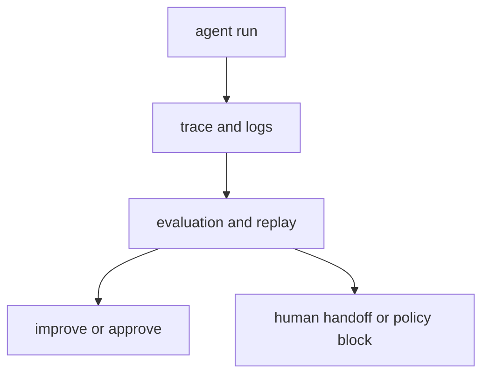

# P5-14.2 하네스(harness)

P5-14.1에서는 MCP가 모델과 외부 도구, 데이터 사이의 연결을 더 일관되게 만드는 인터페이스 관점이라는 점을 보았습니다. 하지만 연결만으로는 충분하지 않습니다. 이 절에서는 에이전트 실행을 안정적으로 감싸고, 로그와 평가를 남기며, 반복 가능하게 관리하는 구조를 봅니다.

하네스(harness)는 에이전트나 모델 실행을 감싸서 입력, 도구 호출, 결과, 로그, 평가를 관리하는 실행 환경 또는 운영 장치에 가깝다.

## 이 절의 범위

이 절은 다음 질문에 답합니다.

- 하네스는 무엇을 감싸는가?
- 왜 에이전트 실행에는 하네스 같은 운영 장치가 필요한가?
- 하네스를 DevOps 도구 하나처럼 보면 왜 혼동이 생기는가?

이 절에서는 다음 내용을 깊게 다루지 않습니다.

- 테스트 프레임워크 세부 구현
- 관측성(observability) 스택 전체
- 배포 파이프라인 전체 설계

하네스의 역할은 여기서 큰 그림으로 잡고, 품질 점검은 뒤의 P5-15.1 LLM 평가와 P5-15.2 자동 평가와 사람 평가에서 다시 회수합니다. 운영 제약과 실패 대응은 P5-16.1, P5-16.2에서 다시 이어지며, 특정 관측성 스택과 배포 파이프라인 구현은 현재 본편 범위 밖으로 둡니다.

이 절에서는 harness를 단일 제품명처럼 보지 않고, `실행을 통제하고 기록하고 평가하는 감싸는 구조`로 설명합니다.

## 이 절의 목표

- 하네스를 입문 수준에서 설명할 수 있습니다.
- MCP와 하네스의 역할 차이를 말할 수 있습니다.
- trace, log, eval, replay 같은 운영 요구가 왜 중요한지 설명할 수 있습니다.
- 다음 장의 평가와 운영 문제로 자연스럽게 넘어갈 수 있습니다.

## 하네스는 무엇을 감싸나

다음처럼 보면 충분합니다.

하네스는 보통:

- 어떤 입력으로 실행했는지
- 어떤 도구를 호출했는지
- 어떤 결과가 나왔는지
- 중간에 어떤 실패가 있었는지
- 다시 재현할 수 있는지

를 관리하는 역할을 합니다.

즉, 하네스는 `모델이 무엇을 말했는가`만 보는 것이 아니라, `그 실행 전체를 어떻게 감싸고 관리할 것인가`를 다룹니다.

## 왜 agent 시대에 필요해졌나

단일 질의응답에서는 로그 한 줄로 끝날 수 있습니다. 하지만 에이전트는:

- 여러 단계 계획을 만들고
- 도구를 호출하고
- 중간 실패를 겪고
- 다시 시도하고
- 최종 결과를 냅니다

이 구조에서는 `최종 답변`만 보면 무엇이 잘됐고 무엇이 틀렸는지 알기 어렵습니다.

그래서 다음이 중요해집니다.

- trace: 어떤 순서로 움직였는가
- log: 어떤 입력과 결과가 오갔는가
- eval: 결과가 괜찮았는가
- replay: 같은 흐름을 다시 재현할 수 있는가

이 요구를 감싸는 구조가 바로 harness에 가깝습니다.

## MCP와 무엇이 다른가

이 차이도 분리해야 합니다.

| 구조 | 중심 역할 |
| --- | --- |
| MCP | 도구와 데이터 연결 인터페이스를 정리한다 |
| harness | 실행을 감싸고 기록하고 평가한다 |

즉:

- MCP는 `무엇과 어떻게 연결할까`에 가깝고
- harness는 `그 연결을 써서 실행한 흐름을 어떻게 관리할까`에 가깝습니다

둘은 함께 쓰일 수 있지만 같은 층위의 개념은 아닙니다.

## 왜 DevOps 도구 하나처럼 보면 혼동이 생기나

하네스를 단일 제품이나 특정 도구 하나로 이해하면 범위가 너무 좁아집니다. 더 안전한 설명은 다음입니다.

`하네스는 실행을 둘러싼 운영 패턴 또는 환경이라는 관점이 더 가깝다.`

즉, harness는:

- 테스트 러너일 수도 있고
- 평가 환경일 수도 있고
- trace 수집 구조일 수도 있고
- 승인과 권한 체크를 포함한 실행 래퍼일 수도 있습니다

핵심은 특정 브랜드보다 `실행을 감싸는 역할`입니다.

## 왜 평가와 재현성이 같이 중요해지나

agent 시스템은 한 번 잘 돌아가는 것처럼 보여도, 다음 번에는 다른 행동을 할 수 있습니다. 따라서 운영에서는 다음이 중요해집니다.

- 어떤 입력에서 실패했는가
- 어떤 도구 호출이 원인이었는가
- 어떤 설정에서 재현되는가
- 수정 후 실제로 나아졌는가

이 질문들은 harness 없이는 다루기 어렵습니다.

즉, harness는 단순 기록이 아니라 `디버깅과 개선의 기반`입니다.

## 아주 단순하게 그리면



이 도식의 핵심은 harness가 실행을 둘러싸서 `관찰 가능성`과 `개선 가능성`을 만들고, 필요하면 사람 검토나 정책 차단으로 넘기는 구조라는 점입니다.

## 사례로 보기

### 사례 1. 코딩 에이전트

코딩 에이전트가 여러 파일을 고친 뒤 테스트가 실패했다고 해 봅시다. 결과만 보면 `실패했다`는 사실은 알 수 있지만, 어떤 파일을 먼저 읽었고 어떤 패치를 넣었으며 어느 테스트에서 처음 문제가 났는지는 금방 사라집니다. 사람이 수동으로 되짚으면 가능한 일이지만, 반복 실험이 많아질수록 기억과 복기에 의존하게 됩니다. 예를 들어 마지막 실패는 로그인 테스트에서 보였지만, 실제 원인은 그 전에 바꾼 공용 유틸 함수 한 줄일 수 있습니다. 이 경로가 남지 않으면 원인 추적보다 같은 실험을 다시 하는 시간이 더 길어질 수 있습니다. harness가 있으면 읽은 파일, 적용한 변경, 실행한 테스트와 결과가 trace로 남아 문제 지점을 다시 추적하기 쉬워집니다. 여기서 바뀌는 점은 `최종 결과가 성공인가 실패인가`만 보던 기준에서 `어떤 실행 경로를 거쳐 실패했는가`를 다시 추적할 수 있는가를 보는 기준으로 이동한다는 것입니다. 그래서 이 사례에서 확인해야 할 결과는 최종 실패 한 줄만 남는 것이 아니라, 어떤 파일 변경 뒤 어떤 테스트가 처음 깨졌는지가 실제로 다시 추적되는가입니다.

### 사례 2. 문서 조사 에이전트

문서 조사 에이전트가 정책 변경 요약을 냈는데 내용이 틀렸다고 해 봅시다. 사람이 최종 문장만 보면 에이전트가 잘못 요약했는지, 애초에 엉뚱한 문서를 검색했는지 구분하기 어렵습니다. 실제 개선은 이 둘을 나누어 봐야 시작할 수 있는데, 실행 기록이 없으면 둘 다 추측으로만 남습니다. 예를 들어 작년 공지를 읽고 정확히 요약한 것과, 최신 공지를 읽고도 잘못 요약한 것은 완전히 다른 실패입니다. 이 구분이 안 되면 검색 로직을 고쳐야 할지 요약 프롬프트를 고쳐야 할지 판단도 흔들립니다. harness는 어떤 문서를 검색했는지, 어떤 문단을 읽었는지, 어떤 요약 단계를 거쳤는지를 함께 남겨 문제를 단계별로 나눠 보게 합니다. 여기서 바뀌는 점은 `답이 틀렸는가`만 보던 기준에서 `검색 단계와 요약 단계 중 어디서 틀렸는가`를 구분할 수 있는가를 보는 기준으로 이동한다는 것입니다. 그래서 이 사례에서 확인해야 할 결과는 틀린 답이 나왔을 때 `검색 실패`와 `요약 실패`가 실제로 서로 다른 원인으로 분리되어 보이는가입니다.

### 사례 3. 고객 지원 에이전트

고객 지원 에이전트가 환불 불가 답변을 냈는데 실제 최신 정책은 환불 가능이었다고 해 봅시다. 이때 사람이 먼저 확인해야 할 것은 `정책 문서를 오래된 것으로 읽었는가`, `읽은 내용은 맞았지만 응답 규칙이 잘못 적용되었는가`, `승인 단계 없이 바로 전송되었는가` 같은 흐름입니다. 하지만 실행 기록이 없으면 잘못된 답 하나만 남고, 어디서 틀렸는지 조직적으로 설명하기가 어려워집니다. 예를 들어 정책 해석은 맞았지만 승인 단계를 건너뛰어 바로 발송했다면, 문제는 모델 지식이 아니라 운영 통제 실패일 수 있습니다. 이런 차이가 보이지 않으면 같은 답변 오류를 다시 막기 위한 통제도 설계하기 어렵습니다. harness는 읽은 정책, 사용한 도구, 승인 여부, 평가 상태를 함께 남겨 감사와 재현을 가능하게 합니다. 여기서 바뀌는 점은 `답변이 틀렸는가`만 보던 기준에서 `오류가 어떤 운영 단계에서 발생했는가`를 보는 기준으로 이동한다는 것입니다. 그래서 이 사례에서 확인해야 할 결과는 답변 오류가 났을 때 오래된 문서 참조, 규칙 적용 오류, 승인 누락 중 어느 단계에서 문제가 났는지가 실제로 다시 설명되는가입니다.

세 사례를 운영 관점으로 다시 묶으면 다음과 같습니다.

| 상황 | 하네스가 남겨야 하는 핵심 기록 | 기록이 없으면 생기는 문제 |
| --- | --- | --- |
| 코딩 에이전트 | 읽은 파일, 패치 순서, 테스트 실패 지점 | 어느 변경이 회귀를 만들었는지 추적이 어려움 |
| 문서 조사 에이전트 | 검색 문서, 읽은 문단, 요약 단계 | 검색 실패와 요약 실패를 구분하기 어려움 |
| 고객 지원 에이전트 | 사용한 정책 문서, 승인 여부, 발송 경로 | 답변 오류가 지식 문제인지 운영 통제 문제인지 흐려짐 |

## 실행 가능한 Python 예제로 보기

이번 예제의 목표는 실제 하네스 전체를 구현하는 것이 아니라, 실행을 감싸는 기록이 `최종 결과` 하나로 끝나는 것이 아니라 `도구 호출`, `trace`, `평가 상태`, `재현 가능성`까지 함께 남겨야 한다는 점을 보는 것입니다.

문제 상황:

- 에이전트가 최신 환불 정책을 찾고 요약함
- 최종 답만 보면 실행 과정에서 무슨 일이 있었는지 알기 어려움
- 따라서 실행 기록 전체를 묶는 run record가 필요함

입력:

- 하나의 agent 실행
- 실행 중 사용한 도구와 단계별 기록

출력:

- run record
- 재현과 평가에 필요한 항목이 남았는지에 대한 점검값

```python
run_record = {
    "goal": "최신 환불 정책을 찾아 요약한다",
    "tools_used": ["search_policy_docs", "read_file"],
    "trace": [
        {"step": 1, "action": "search_policy_docs", "observation": "found 2 recent notices"},
        {"step": 2, "action": "read_file", "observation": "opened policy_notice_2026_06_29"},
    ],
    "result": "정책 변경 요약 완료",
    "trace_saved": True,
    "eval_status": "needs_review",
    "replay_id": "run-2026-06-30-001",
}


def inspect_run_record(record):
    return {
        "tool_count": len(record["tools_used"]),
        "trace_steps": len(record["trace"]),
        "has_eval_status": "eval_status" in record,
        "has_replay_id": "replay_id" in record,
        "is_reproducible_shape": record["trace_saved"] and "replay_id" in record,
    }


inspection = inspect_run_record(run_record)

print("[run_record]")
print(run_record)
print("[inspection]")
print(inspection)
```

실행 결과 예시는 다음처럼 읽을 수 있습니다.

```text
[run_record]
{'goal': '최신 환불 정책을 찾아 요약한다', 'tools_used': ['search_policy_docs', 'read_file'], 'trace': [{'step': 1, 'action': 'search_policy_docs', 'observation': 'found 2 recent notices'}, {'step': 2, 'action': 'read_file', 'observation': 'opened policy_notice_2026_06_29'}], 'result': '정책 변경 요약 완료', 'trace_saved': True, 'eval_status': 'needs_review', 'replay_id': 'run-2026-06-30-001'}
[inspection]
{'tool_count': 2, 'trace_steps': 2, 'has_eval_status': True, 'has_replay_id': True, 'is_reproducible_shape': True}
```

그래서 이 예제에서 확인해야 할 결과는 결과 텍스트 하나만 남는 것이 아니라, 사용한 도구, 실행 trace, 평가 상태, replay 식별자까지 함께 추적된다는 점입니다.

이 예제에서 독자가 직접 해 볼 수 있는 조정은 다음과 같습니다.

- `trace_saved`를 `False`로 바꿔 재현 가능성이 어떻게 약해지는지 보기
- `eval_status`를 `passed`나 `failed`로 바꿔 평가 단계 연결을 상상해 보기
- `trace`에 실패 단계 하나를 추가해 어떤 운영 정보가 더 필요해지는지 확인하기

## 이 예제를 운영 기록 관점으로 다시 보면

앞의 예제는 실제 하네스를 구현하는 코드가 아니라, `좋은 결과가 나왔는가`보다 먼저 `무슨 실행이 있었고 무엇이 남아야 하는가`를 점검하는 최소 장면입니다. 여기서 중요한 것은 기록 항목을 많이 나열하는 일이 아니라, 결과 문장 하나로는 운영 개선이 불가능하다는 점을 짧게 체감하는 데 있습니다.

## 역사와 커리큘럼 관점

LLM과 agent가 실제 업무에 들어오면서, 사람들은 곧 `답변 품질`만이 아니라 `실행 과정 전체의 통제 가능성`을 더 많이 요구하게 되었습니다. 이 흐름에서 trace, eval, replay, approval 같은 요구가 커졌고, 이를 감싸는 운영 패턴이 중요해졌습니다.

커리큘럼 관점에서 이 절이 중요한 이유는 다음과 같습니다.

- tool use와 agent를 운영 가능성 관점으로 확장해 읽게 하고
- 이후 평가(evaluation), 비용, 실패 대응, 서비스 제약 장으로 자연스럽게 연결하며
- Part 6 프로젝트에서 `단순 동작`보다 `관리 가능한 동작`을 설계하게 만들기 때문입니다

## 다음 장과의 연결

여기까지 오면 다음 질문이 남습니다.

- 이런 LLM 기반 시스템의 품질은 실제로 어떻게 평가해야 하는가?
- 답변이 괜찮은지, 검색이 괜찮은지, 실행이 괜찮은지를 무엇으로 점검할 것인가?

이 질문은 P5-15.1 LLM 평가(evaluation)로 이어집니다.

## 이 절에서 기억할 관점

- 하네스는 에이전트 실행을 감싸고 기록하고 평가하는 운영 장치에 가깝습니다.
- MCP는 연결 인터페이스, harness는 실행 관리 구조라는 점에서 다릅니다.
- trace, log, eval, replay는 실행 기록을 남기고, 같은 실패를 재현하고, 수정 전후 차이를 비교하게 해 주는 운영 기준선입니다.
- harness를 통해 같은 실행을 다시 재생하고 승인 경계를 남기며 수정 전후 차이를 비교할 수 있어, 운영 개선의 기준선이 됩니다.

## 체크리스트

- 하네스를 입문 수준에서 설명할 수 있는가?
- MCP와 하네스의 차이를 말할 수 있는가?
- 왜 trace, log, eval, replay가 중요한지 설명할 수 있는가?
- 왜 다음 장에서 평가를 따로 다뤄야 하는지 말할 수 있는가?

## 출처와 참고 자료

- OpenAI, Agents 및 observability/evaluation 관련 공식 문서, 확인 날짜: 2026-06-29.
- 관련 agent engineering 및 evaluation 운영 자료, 확인 날짜: 2026-06-29.
