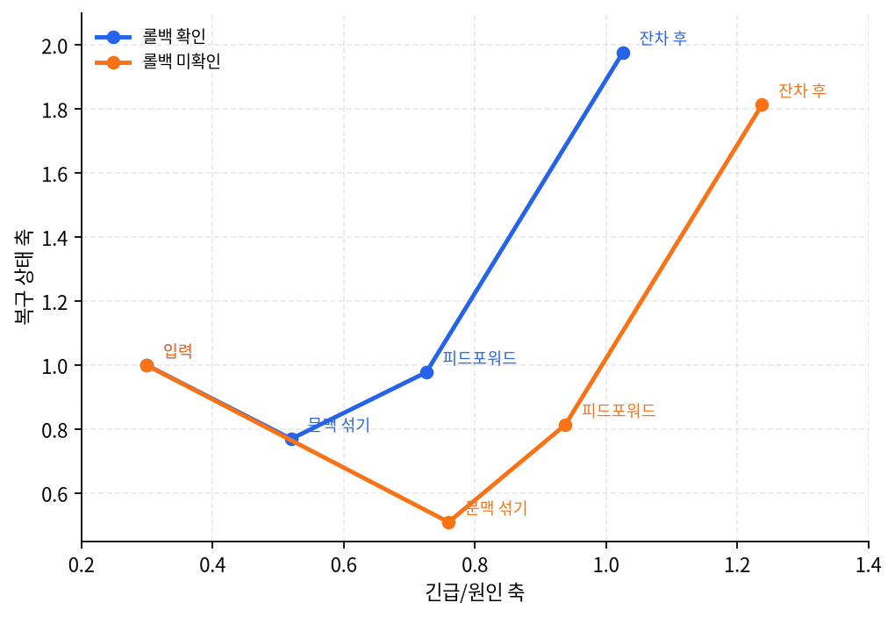

# P5-14.2 Transformer 블록의 네 부품은 각각 무엇을 맡는가

> Section ID: `P5-14.2`
> Version: `v2026.07.31`

P5-14.1에서는 Transformer를 self-attention 하나로만 설명하면 부족하다는 점을 보았습니다. 이제 블록 안의 역할 분담을 더 직접 나누어야 합니다.

Transformer 블록 안에서 self-attention, feed-forward network, residual connection, layer normalization은 각각 무엇을 맡는가?

핵심은 부품 이름 암기가 아니라 역할 분담입니다. 같은 토큰 표현이 블록 안에서 지나가는 경로를 읽으려면 `관계 읽기`, `위치별 가공`, `원래 정보 보존`, `값 범위 안정화`를 구분해야 합니다.

실제로 읽을 때는 각 부품을 따로 외우기보다 `current_token`, `attended_context`, `updated_position`, `residual_base`, `normalized_output`처럼 표현이 거치는 중간 이름을 붙여 봅니다. 그러면 self-attention은 관계를 섞고, feed-forward는 현재 위치를 다시 가공하며, residual과 normalization은 다음 블록으로 넘길 표현을 안정화한다는 역할 차이가 보입니다.

## 네 부품을 구분해야 하는 이유

- self-attention은 무엇을 담당하는가?
- feed-forward network는 attention과 무엇이 다른가?
- residual connection과 layer normalization은 왜 함께 등장하는가?

이 절에서는 각 부품이 블록 안에서 맡는 역할과, 관계 읽기와 위치별 가공의 차이를 닫습니다. 숫자 예제로 표현이 실제로 어떻게 이동하는지도 이 절 안에서 함께 확인하고, 병렬 처리와 긴 문맥 계산 감각은 P5-14.4와 P5-14.5에서 따로 다룹니다.

## self-attention은 관계를 읽는다

P5-13장에서 본 것처럼 self-attention은 각 토큰이 같은 시퀀스 안의 다른 토큰을 참고해 자기 표현을 다시 계산하는 방식입니다.

`self-attention은 지금 이 토큰을 이해하기 위해 문장 안 어디를 더 봐야 하는지 정하는 장치다.`

핵심은 `관계 읽기`입니다. 현재 토큰이 문장 안의 다른 위치에서 필요한 문맥을 가져오게 만듭니다.

## feed-forward network는 현재 위치 표현을 가공한다

self-attention은 토큰 간 관계를 섞지만, 그 결과가 바로 충분히 좋은 표현이 되는 것은 아닙니다. feed-forward network는 문맥이 섞인 현재 위치 표현을 다시 비선형적으로 가공합니다.

`attention이 다른 토큰과의 관계를 반영해 문맥을 섞는다면, feed-forward는 각 위치의 표현을 더 풍부하게 다시 가공한다.`

여기서 `각 위치`라는 말이 중요합니다. self-attention은 현재 위치가 다른 위치에서 어떤 정보를 가져올지에 더 가깝고, feed-forward network는 그렇게 섞인 표현을 그 위치 안에서 다시 바꿉니다. 같은 feed-forward network가 각 토큰 위치에 적용되지만, 입력 표현이 다르기 때문에 각 위치에서 다듬어지는 의미도 달라집니다.

```mermaid
--8<-- "assets/part-05/chapter-14/feed-forward-position-update-ko.mmd"
```

이 도식에서 각 줄은 서로 다른 토큰 위치를 뜻합니다. 점선은 같은 feed-forward network의 가중치가 여러 위치에 공유된다는 뜻이고, 실선은 각 위치의 표현이 자기 위치 안에서 따로 가공된다는 뜻입니다. 따라서 feed-forward network는 새로 참고할 토큰을 고르는 장치가 아니라, 이미 문맥이 섞인 표현을 위치별 다음 표현으로 바꾸는 장치입니다.

작업 허가 문장을 예로 들면, attention은 `재기동` 위치가 `압력 미해소`와 `보류`를 함께 보게 만듭니다. feed-forward network는 그 결과를 현재 위치 안에서 다시 가공해, `재기동` 표현이 단순한 행동 이름이 아니라 `조건이 붙어 차단되어야 하는 조치` 쪽으로 읽히게 만듭니다.

이 차이를 한 토큰 기준으로 보면 더 선명합니다.

| 단계 | 먼저 묻는 질문 | 역할 |
| --- | --- | --- |
| self-attention | 이 토큰이 다른 토큰 중 무엇을 참고할까? | 바깥 관계 읽기 |
| feed-forward | 참고한 문맥이 섞인 현재 표현을 이 위치에서 어떻게 바꿀까? | 현재 위치 안의 표현 가공 |

따라서 feed-forward network를 단순한 후처리로 읽으면 안 됩니다. attention이 `무엇을 같이 볼지`를 열어 준다면, feed-forward는 `그렇게 섞인 표현을 현재 위치의 다음 표현으로 어떻게 만들지`를 맡습니다. 이 차이를 잡아야 Transformer 블록을 attention 하나가 아니라 역할이 나뉜 반복 단위로 읽을 수 있습니다.

feed-forward network가 왜 같은 가중치를 여러 위치에 적용하면서도 위치마다 다른 표현을 만들 수 있는지는 [P5-14.6 보충학습: feed-forward network는 왜 위치별 표현 가공을 맡는가](section-06.md)에서 따로 정리합니다.

## residual connection은 원래 정보 흐름을 남긴다

깊은 신경망에서는 새 계산이 반복되면서 원래 정보가 지나치게 덮이거나 학습이 불안정해질 수 있습니다. residual connection은 이전 표현을 새 계산 결과와 함께 넘겨, 원래 정보 흐름을 보존합니다.

`완전히 새 계산만 믿지 말고, 원래 입력 표현도 함께 남겨 다음 단계로 보내는 안전장치`

여기서 중요한 점은 residual connection이 새 계산을 없애는 장치가 아니라는 것입니다. self-attention이나 feed-forward가 만든 새 표현은 그대로 필요합니다. 다만 그 새 표현만 다음 단계로 넘기면, 원래 토큰이 갖고 있던 기본 의미가 너무 쉽게 덮일 수 있습니다. 그래서 residual connection은 `새 계산 결과 + 원래 입력 표현`을 함께 남기는 경로로 읽으면 됩니다.

```mermaid
--8<-- "assets/part-05/chapter-14/residual-connection-skip-path-ko.mmd"
```

이 도식에서 실선 경로는 새 계산이 만드는 표현이고, 점선 경로는 원래 입력 표현이 우회해 더해지는 길입니다. residual connection의 핵심은 새 계산을 막는 것이 아니라, 새 계산과 원래 표현이 함께 다음 단계로 넘어가게 하는 데 있습니다.

feed-forward가 `현재 표현을 어떻게 바꿀까`를 맡는다면, residual connection은 `바뀐 표현이 원래 출발점을 완전히 잃지 않게 할까`를 맡습니다. layer normalization이 값 범위를 정리하는 장치라면, residual connection은 정보가 지나가는 우회 경로를 남기는 장치에 가깝습니다.

| 구분 | 먼저 묻는 질문 | 역할 |
| --- | --- | --- |
| feed-forward network | 문맥이 섞인 현재 표현을 어떻게 바꿀까? | 새 표현을 만든다 |
| residual connection | 새 표현이 원래 표현을 완전히 덮지 않게 할까? | 원래 정보 흐름을 함께 남긴다 |
| layer normalization | 다음 계산이 다루기 쉬운 범위인가? | 값 범위를 정리한다 |

이 차이를 잡아야 residual connection을 단순한 덧셈으로 낮춰 보지 않게 됩니다. 더 정확한 직관은 `새 계산이 들어와도 원래 정보가 지나갈 길을 남겨 깊은 블록 반복을 견디게 하는 장치`입니다.

residual connection이 왜 단순한 건너뛰기가 아니라 원래 표현과 새 계산을 함께 넘기는 경로인지는 [P5-14.7 보충학습: residual connection은 왜 원래 표현의 길을 남기는가](section-07.md)에서 따로 정리합니다.

## layer normalization은 값 범위를 정리한다

여러 층과 큰 행렬 연산을 반복하면 표현값의 크기와 분포가 흔들릴 수 있습니다. layer normalization은 각 위치 표현을 더 다루기 쉬운 범위로 정리해 다음 계산이 덜 흔들리게 돕습니다.

`layer normalization은 표현값의 크기와 분포를 정리해, 다음 계산이 안정적으로 이어지게 만드는 장치다.`

여기서 정리한다는 말은 의미를 새로 판단한다는 뜻이 아닙니다. self-attention과 feed-forward가 만든 표현은 여러 숫자 축으로 이루어져 있고, residual connection까지 더해지면 어떤 축은 너무 커지고 어떤 축은 상대적으로 작아질 수 있습니다. 값의 크기 차이가 계속 커지면 다음 attention이나 feed-forward가 같은 종류의 입력을 받아도 매번 다루기 어려운 범위에서 계산하게 됩니다.

layer normalization은 한 위치의 표현 안에서 값들의 평균과 퍼짐을 다시 맞춰, 다음 부품이 비슷한 기준선에서 계산을 시작하게 만듭니다. 입문 단계에서는 수식을 외우기보다 다음처럼 읽으면 충분합니다.

```mermaid
--8<-- "assets/part-05/chapter-14/layer-normalization-value-scale-ko.mmd"
```

이 도식에서 중요한 점은 layer normalization이 토큰 사이 관계를 새로 고르거나 원래 정보를 보존하는 경로를 추가하지 않는다는 것입니다. 한 위치 표현 안의 값 범위를 다시 맞춰, 다음 self-attention이나 feed-forward가 너무 흔들린 입력을 받지 않게 하는 역할입니다.

| 오해하기 쉬운 읽기 | 더 적절한 읽기 |
| --- | --- |
| layer normalization이 의미를 고른다 | 의미를 고르는 일은 attention과 feed-forward가 더 직접 맡는다 |
| residual connection처럼 원래 정보를 남긴다 | 원래 정보를 남기는 길은 residual connection이 맡는다 |
| 단순히 값을 작게 만든다 | 다음 계산이 다루기 쉬운 기준선으로 값의 분포를 정리한다 |

그래서 Transformer 블록 안에서 residual connection과 layer normalization은 함께 보이지만 같은 일을 하지 않습니다. residual connection이 `정보가 지나갈 길`을 남긴다면, layer normalization은 그 길을 지난 표현이 다음 계산에서 너무 흔들리지 않도록 `계산 기준선`을 맞춥니다.

layer normalization이 왜 의미 선택이 아니라 한 위치 표현의 값 기준선 정리인지, batch normalization과는 무엇이 다른지는 [P5-14.8 보충학습: layer normalization은 왜 값의 기준선을 맞추는가](section-08.md)에서 따로 정리합니다.

네 부품을 한 번에 묶어 보면, 같은 토큰 표현을 두고 묻는 질문이 서로 다릅니다.

| 부품 | 표현에서 먼저 보는 것 | 직접 맡지 않는 것 |
| --- | --- | --- |
| self-attention | 현재 위치가 어떤 다른 위치를 참고해야 하는가 | 참고한 표현을 현재 위치 안에서 다시 가공하는 일 |
| feed-forward network | 문맥이 섞인 현재 위치 표현을 어떻게 바꿀까 | 새로 참고할 토큰 위치를 고르는 일 |
| residual connection | 새 계산이 원래 표현을 완전히 덮지 않는가 | 새 의미를 직접 만드는 일 |
| layer normalization | 다음 계산이 다루기 쉬운 값 범위인가 | 의미를 고르거나 원래 정보를 보존하는 일 |

## 아주 단순하게 그리면

```mermaid
--8<-- "assets/part-05/chapter-14/transformer-block-flow-ko.mmd"
```

이 도식은 Transformer 블록 하나를 입문 수준에서 압축한 것입니다. 흐름은 `self-attention으로 관계를 읽고 -> 그 결과를 원래 표현과 함께 안정화하고 -> feed-forward로 현재 위치 표현을 가공하고 -> 다시 원래 정보와 값 범위를 정리해 다음 블록으로 넘긴다`로 읽으면 됩니다.

## Transformer 블록의 네 부품은 각각 무엇을 맡는가: 확인할 판단 기준

이 사례를 읽을 때는 다음 두 가지를 먼저 확인한다.

- self-attention, feed-forward, residual connection, layer normalization의 역할을 `관계 읽기`, `위치별 가공`, `정보 흐름 보존`, `값 범위 안정화`로 나누어 설명해야 합니다. 통합된 Python 예제는 현재 토큰 표현이 `input -> after attention -> after feed-forward -> after residual`로 이동하는 흐름을 확인하는 데만 쓰고, normalization의 값 범위 정리는 P5-14.3으로 넘겨야 하는지 확인한다.
- 이어지는 사례에서 입력, 비교 기준, 출력, 한계가 제목의 판단 기준과 어떻게 연결되는지 확인한다.

### 사례. `재기동` 위치 표현을 네 부품으로 나누어 읽기

작업 허가 문장 `압력 미해소 상태에서는 재기동을 보류한다`를 보겠습니다. 현재 관심 위치는 `재기동`입니다. 사람이 단어만 빨리 보면 `재기동`을 단순한 실행 조치로 읽기 쉽습니다. 하지만 문장 안에는 `압력 미해소`라는 조건과 `보류한다`는 판단이 함께 있습니다.

이 사례에서 너무 빨리 내리기 쉬운 판단은 `재기동이라는 단어가 보였으니 실행 요청이다`입니다. Transformer 블록을 역할별로 읽으면 이 판단이 한 번에 바뀌는 것이 아니라, 같은 위치 표현이 여러 부품을 지나며 다른 질문에 답합니다.

먼저 입력을 토큰 위치별로 나누면 다음처럼 볼 수 있습니다.

| 위치 | 토큰 | `재기동`을 이해할 때 맡는 단서 |
| --- | --- | --- |
| 1 | `압력` | 어떤 조건을 말하는지 알려 주는 대상 |
| 2 | `미해소` | 조건이 아직 해결되지 않았다는 상태 |
| 3 | `상태에서는` | 앞 상태가 뒤 조치의 조건이라는 연결 |
| 4 | `재기동` | 현재 해석해야 할 조치 |
| 5 | `보류한다` | 조치가 실행이 아니라 멈춤 쪽이라는 판단 |

이 표에서 `재기동` 위치만 따로 보면 실행 조치처럼 보입니다. 그러나 현재 Section의 중심축은 `재기동`이 최종적으로 무엇을 뜻하느냐가 아니라, 그 위치 표현이 Transformer 블록 안에서 어떤 부품을 지나며 어떻게 바뀌는가입니다.

| 읽는 단계 | 현재 `재기동` 위치에서 묻는 질문 | 너무 빨리 읽으면 생기는 오해 |
| --- | --- | --- |
| 시작 표현 | 이 위치의 기본 단어는 무엇인가 | `재기동`이라는 조치 이름만 본다 |
| self-attention | 이 위치가 문장 안 어디를 함께 봐야 하는가 | attention이 곧 최종 판단을 내린다고 본다 |
| feed-forward network | 섞인 문맥을 이 위치 표현 안에서 어떻게 바꿀까 | feed-forward가 관련 토큰을 다시 고른다고 본다 |
| residual connection | 새 계산이 원래 조치 축을 완전히 덮지 않는가 | residual이 새 계산을 생략한다고 본다 |
| layer normalization | 다음 계산이 다루기 쉬운 값 범위인가 | normalization이 중요한 의미만 남긴다고 본다 |

self-attention 단계에서는 `재기동` 위치가 `압력 미해소`와 `보류한다`를 함께 참고합니다. 이때 확인할 결과는 `재기동`이 혼자 떨어진 실행 단어가 아니라, 앞 조건과 뒤 판단을 함께 보게 되었다는 점입니다. 하지만 여기서 아직 `조건부 차단 조치`라는 현재 위치 표현이 완전히 정리된 것은 아닙니다.

feed-forward network 단계에서는 attention으로 섞인 문맥을 현재 위치 안에서 다시 가공합니다. `재기동` 표현은 단순한 조치 이름에서 `압력 조건 때문에 보류되어야 하는 조치` 쪽으로 더 선명해집니다. 이 단계의 핵심은 새로 참고할 단어를 고르는 일이 아니라, 이미 들어온 문맥을 현재 위치 표현으로 바꾸는 일입니다.

residual connection 단계에서는 새로 가공된 차단 의미만 남기지 않습니다. 원래 `재기동`이라는 조치 축도 함께 남아야 뒤 블록이 `무엇을 보류해야 하는가`를 잃지 않습니다. 따라서 residual connection은 새 계산을 건너뛰는 길이 아니라, 새 계산 결과와 원래 입력 표현을 함께 넘기는 길입니다.

layer normalization 단계에서는 새 의미를 다시 고르지 않습니다. attention, feed-forward, residual을 지나 여러 값 축이 섞인 현재 표현을 다음 블록이 다루기 쉬운 기준선으로 정리합니다. 값 범위를 맞추는 일과 의미를 판단하는 일은 같은 일이 아닙니다.

이 흐름을 `재기동` 위치 표현의 변화로만 좁혀 쓰면 다음과 같습니다.

| 블록 안 지점 | `재기동` 위치 표현을 말로 풀면 | 여기서 배워야 할 역할 구분 |
| --- | --- | --- |
| 입력 표현 | `재기동`이라는 조치 이름 | 아직 앞 조건과 뒤 판단이 충분히 반영되지 않았다 |
| self-attention 뒤 | `압력 미해소`, `보류한다`를 함께 본 조치 | 관계 단서를 가져왔지만 현재 위치 표현을 최종적으로 다듬은 것은 아니다 |
| feed-forward 뒤 | 압력 조건 때문에 실행보다 보류 쪽으로 읽히는 조치 | 현재 위치 안에서 문맥이 섞인 표현을 다시 가공했다 |
| residual 뒤 | 보류 쪽 의미와 원래 `재기동` 조치 축이 함께 남은 표현 | 새 계산이 원래 조치 정보를 완전히 덮지 않게 했다 |
| layer normalization 뒤 | 다음 블록이 다루기 쉬운 범위로 정리된 표현 | 의미 선택이 아니라 계산 기준선을 맞추었다 |

따라서 이 사례의 출력은 `재기동은 보류다`라는 결론 하나가 아닙니다. 더 중요한 출력은 `관계 읽기`, `위치별 가공`, `원래 정보 보존`, `값 범위 안정화`가 서로 다른 부품의 일이라는 구분입니다. 이 구분이 잡히면, Transformer 블록을 `attention이 답을 내는 장치`가 아니라 여러 역할이 반복되는 표현 갱신 단위로 읽을 수 있습니다.

같은 사례를 출력 관점으로 닫으면 다음과 같습니다.

| 부품 | 이 사례에서 직접 만든 변화 | 직접 맡지 않는 일 |
| --- | --- | --- |
| self-attention | `재기동` 위치가 `압력 미해소`, `보류한다`를 함께 보게 만든다 | 현재 위치 표현을 최종 의미로 가공하는 일 |
| feed-forward network | 문맥이 섞인 `재기동`을 `조건부 차단 조치` 쪽으로 가공한다 | 새로 볼 토큰 위치를 고르는 일 |
| residual connection | `조건부 차단` 의미와 원래 `재기동` 조치 축을 함께 남긴다 | 중요한 의미를 새로 선택하는 일 |
| layer normalization | 합쳐진 표현의 값 범위를 다음 계산 기준선으로 정리한다 | 원래 조치 축을 보존하거나 관계를 새로 고르는 일 |

이 사례에서 확인해야 할 결과는 `재기동` 표현이 한 번에 마법처럼 바뀌는 것이 아니라는 점입니다. self-attention은 관계를 읽고, feed-forward는 현재 위치 표현을 가공하며, residual connection은 원래 정보 흐름을 남기고, layer normalization은 다음 계산을 위한 값 기준선을 맞춥니다. 이 네 질문이 분리되어야 Transformer 블록을 attention 하나가 아니라 역할이 나뉜 반복 단위로 읽을 수 있습니다.

## 연습 및 예제

### 예제. action token 표현 이동을 숫자로 따라가기

같은 역할 구분을 다른 운영 로그 장면으로 아주 작게 줄이면, 같은 action token도 attention 행이 달라질 때 다른 방향으로 이동한다는 점을 직접 볼 수 있습니다. 여기서는 layer normalization까지 계산하지 않고, `input -> after attention -> after feed-forward -> after residual`까지만 따라갑니다. 값 범위 정리는 다음 안정화 절에서 따로 봅니다.

코드를 읽을 때는 전체 행렬을 한꺼번에 외우려 하지 말고, action token이 다른 단서를 얼마나 참고하는지만 먼저 보십시오.

| 조작할 값 | 관찰할 출력 | 확인할 질문 |
| --- | --- | --- |
| action token 행의 attention 비중 | `after attention` | 조치 토큰이 자기 자신, 증상, 배포 단서 중 무엇을 더 섞는가 |
| 같은 비중이 feed-forward를 지난 뒤 | `after feed-forward` | 섞인 문맥이 현재 위치 표현 안에서 어떻게 다시 가공되는가 |
| residual 이후 action token | `after residual` | 원래 조치 축이 남은 상태에서 블록 출력 방향이 어떻게 달라지는가 |

```python
# rollback 확인 여부에 따라 action token 표현이 attention, feed-forward, residual을 지나며 어떻게 이동하는지 비교하는 예제입니다.
import numpy as np

tokens = np.array([
    [1.0, 0.2],   # symptom token: urgency high
    [0.8, 0.5],   # deploy clue token: cause evidence medium
    [0.3, 1.0],   # action token: recovery status important
])

attention_cases = {
    "rollback_confirmed": np.array([
        [0.6, 0.3, 0.1],
        [0.2, 0.5, 0.3],
        [0.1, 0.3, 0.6],
    ]),
    "rollback_not_confirmed": np.array([
        [0.6, 0.3, 0.1],
        [0.3, 0.5, 0.2],
        [0.3, 0.5, 0.2],
    ]),
}

ff_weights = np.array([
    [1.1, 0.4],
    [0.2, 1.0],
])

for name, attention_weights in attention_cases.items():
    contextual = attention_weights @ tokens
    ff_output = contextual @ ff_weights
    residual_added = ff_output + tokens
    action_trace = [
        ("input", tokens[2]),
        ("after attention", contextual[2]),
        ("after feed-forward", ff_output[2]),
        ("after residual", residual_added[2]),
    ]

    print(f"[{name}]")
    print("action attention row =", np.round(attention_weights[2], 3))
    print("action token stage trace")
    for stage, values in action_trace:
        print(f"{stage:24s}", np.round(values, 3))
    print("---")
```

출력 예시는 다음처럼 읽을 수 있습니다.

```text
[rollback_confirmed]
action attention row = [0.1 0.3 0.6]
action token stage trace
input                    [0.3 1. ]
after attention          [0.52 0.77]
after feed-forward       [0.726 0.978]
after residual           [1.026 1.978]
---
[rollback_not_confirmed]
action attention row = [0.3 0.5 0.2]
action token stage trace
input                    [0.3 1. ]
after attention          [0.76 0.51]
after feed-forward       [0.938 0.814]
after residual           [1.238 1.814]
---
```

해설: 두 장면은 같은 입력 토큰에서 시작하지만 action token의 attention 행이 달라지면서 표현 이동 경로도 달라집니다. `rollback_confirmed`에서는 attention 이후부터 복구 상태 축이 더 크게 남고, `rollback_not_confirmed`에서는 증상/원인 축이 상대적으로 더 남습니다. 이 차이는 feed-forward와 residual을 거치며 블록 출력 방향으로 남습니다.

직접 확인할 때는 `rollback_not_confirmed`의 action token 행 `[0.3, 0.5, 0.2]`를 `[0.2, 0.4, 0.4]`처럼 합이 1이 되게 바꿔 보십시오. action token이 자기 자신을 더 많이 참고할수록 `after attention` 이후 복구 상태 축이 어떻게 달라지는지 비교할 수 있습니다.



### 연습. 역할 이름 붙이기

아래 설명이 어떤 부품과 가장 직접 연결되는지 판단해 보십시오.

| 설명 | 더 직접 연결되는 부품 | 해설 |
| --- | --- | --- |
| 현재 토큰이 문장 안 다른 토큰 중 어디를 더 볼지 정한다 | self-attention | 관계 읽기 역할입니다. |
| 문맥이 섞인 `재기동` 표현을 현재 위치 안에서 `조건부 차단` 쪽으로 바꾼다 | feed-forward network | attention으로 가져온 관계를 현재 위치 표현으로 다시 가공하는 역할입니다. |
| 같은 가공 장치가 각 토큰 위치에 적용되지만, 위치마다 입력 표현이 달라 다른 의미로 다듬어진다 | feed-forward network | feed-forward는 토큰 사이 관계를 새로 고르는 장치라기보다, 각 위치 표현을 다시 변환하는 장치입니다. |
| 가공된 `조건부 차단` 의미와 원래 `재기동` 조치 축을 함께 남긴다 | residual connection | 새 계산과 원래 표현을 함께 넘겨 정보 흐름을 보존하는 역할입니다. |
| 새 표현을 만드는 것이 아니라 원래 표현이 지나갈 길을 남긴다 | residual connection | feed-forward와 구분되는 지점입니다. |
| 새 계산과 원래 표현이 더해진 뒤 값의 기준선을 다시 맞춘다 | layer normalization | 의미를 고르기보다 다음 계산이 안정적으로 이어지도록 값의 분포를 정리하는 역할입니다. |
| 다음 계산으로 넘기기 전 값 범위를 정리한다 | layer normalization | 안정화 역할입니다. |

해설: 이 연습의 핵심은 부품 이름을 외우는 것이 아니라, 같은 블록 안에서도 `무엇을 참고하는가`, `현재 표현을 어떻게 바꾸는가`, `원래 정보를 어떻게 남기는가`, `계산을 어떻게 안정화하는가`가 서로 다른 질문이라는 점을 구분하는 것입니다.

### 연습. 오해 문장 고치기

아래 문장은 모두 일부만 맞거나 역할이 섞여 있습니다. 더 정확한 설명으로 고쳐 보십시오.

| 오해 문장 | 더 정확한 설명 | 해설 |
| --- | --- | --- |
| feed-forward network가 관련 토큰을 다시 고른다 | 관련 토큰을 참고하게 만드는 쪽은 self-attention이고, feed-forward network는 문맥이 섞인 현재 위치 표현을 다시 가공한다 | `무엇을 볼까`와 `이 위치 표현을 어떻게 바꿀까`를 나누어야 합니다. |
| residual connection은 새 계산을 건너뛰게 만든다 | residual connection은 새 계산 결과와 원래 입력 표현을 함께 넘긴다 | 새 계산을 없애는 장치가 아니라, 원래 정보가 지나갈 길을 함께 남기는 장치입니다. |
| layer normalization은 중요한 의미만 남긴다 | layer normalization은 한 위치 표현의 값 범위를 다음 계산이 다루기 쉬운 기준선으로 맞춘다 | 의미 선택이 아니라 값 분포 안정화가 중심입니다. |
| self-attention만 이해하면 Transformer 블록 설명은 충분하다 | self-attention은 관계 읽기를 맡고, feed-forward, residual connection, layer normalization이 표현 가공과 안정화를 나눠 맡는다 | 블록은 attention 하나가 아니라 역할이 분리된 반복 단위입니다. |

해설: 이 연습에서 틀린 문장을 고치는 이유는 용어 암기가 아니라 경계 감각을 만들기 위해서입니다. 네 부품은 모두 같은 표현 흐름 안에 있지만, `관계 선택`, `위치 안 변환`, `정보 보존`, `값 안정화`라는 질문이 섞이면 뒤에서 Transformer 구조를 다시 읽을 때 계산 흐름이 흐려집니다.

## 체크리스트

- self-attention과 feed-forward의 역할 차이를 말할 수 있는가?
- residual connection을 원래 정보 흐름을 남기는 장치로 설명할 수 있는가?
- layer normalization을 깊은 블록 반복의 안정화 장치로 설명할 수 있는가?
- action token stage trace에서 `after attention`, `after feed-forward`, `after residual`이 각각 어떤 표현 이동을 보여 주는지 말할 수 있는가?

## 출처와 참고 자료

- Ashish Vaswani et al., `Attention Is All You Need`, NeurIPS 2017, 확인 날짜: 2026-07-19. [https://papers.nips.cc/paper/2017/hash/3f5ee243547dee91fbd053c1c4a845aa-Abstract.html](https://papers.nips.cc/paper/2017/hash/3f5ee243547dee91fbd053c1c4a845aa-Abstract.html){: target="_blank" rel="noopener noreferrer" }
- Ian Goodfellow, Yoshua Bengio, Aaron Courville, `Deep Learning`, MIT Press, 2016, 확인 날짜: 2026-06-29. [https://www.deeplearningbook.org/](https://www.deeplearningbook.org/){: target="_blank" rel="noopener noreferrer" }
