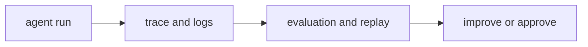

# P5-14.2 하네스(harness)

P5-14.1에서는 MCP가 모델과 외부 도구, 데이터 사이의 연결을 더 일관되게 만드는 인터페이스 관점이라는 점을 보았습니다. 하지만 연결만으로는 충분하지 않습니다. 이제 다음 질문이 필요합니다.

에이전트 실행을 안정적으로 감싸고, 로그와 평가를 남기며, 반복 가능하게 관리하는 구조는 무엇인가?

이 절은 그 질문에 답합니다.

하네스(harness)는 에이전트나 모델 실행을 감싸서 입력, 도구 호출, 결과, 로그, 평가를 관리하는 실행 환경 또는 운영 장치에 가깝다.

## 이 절의 범위

이 절은 다음 질문에 답합니다.

- 하네스는 무엇을 감싸는가?
- 왜 에이전트 실행에는 하네스 같은 운영 장치가 필요한가?
- 하네스를 DevOps 도구 하나처럼 보면 왜 혼동이 생기는가?

이 절은 다음 내용은 깊게 다루지 않습니다.

- 테스트 프레임워크 세부 구현
- 관측성(observability) 스택 전체
- 배포 파이프라인 전체 설계

하네스의 역할은 여기서 큰 그림으로 잡고, 품질 점검은 뒤의 P5-15.1 LLM 평가와 P5-15.2 자동 평가와 사람 평가에서 다시 회수합니다. 운영 제약과 실패 대응은 P5-16.1, P5-16.2에서 다시 이어지며, 특정 관측성 스택과 배포 파이프라인 구현은 현재 본편 범위 밖으로 둡니다.

이 절의 목적은 harness를 단일 제품명처럼 보지 않고, `실행을 통제하고 기록하고 평가하는 감싸는 구조`로 설명하는 데 있습니다.

## 이 절의 목표

- 하네스를 입문 수준에서 설명할 수 있습니다.
- MCP와 하네스의 역할 차이를 말할 수 있습니다.
- trace, log, eval, replay 같은 운영 요구가 왜 중요한지 설명할 수 있습니다.
- 다음 장의 평가와 운영 문제로 자연스럽게 넘어갈 수 있습니다.

## 하네스는 무엇을 감싸나

다음처럼 보면 충분합니다.

하네스는 보통:

- 어떤 입력으로 실행했는지
- 어떤 도구를 호출했는지
- 어떤 결과가 나왔는지
- 중간에 어떤 실패가 있었는지
- 다시 재현할 수 있는지

를 관리하는 역할을 합니다.

즉, 하네스는 `모델이 무엇을 말했는가`만 보는 것이 아니라, `그 실행 전체를 어떻게 감싸고 관리할 것인가`를 다룹니다.

## 왜 agent 시대에 필요해졌나

단일 질의응답에서는 로그 한 줄로 끝날 수 있습니다. 하지만 에이전트는:

- 여러 단계 계획을 만들고
- 도구를 호출하고
- 중간 실패를 겪고
- 다시 시도하고
- 최종 결과를 냅니다

이 구조에서는 `최종 답변`만 보면 무엇이 잘됐고 무엇이 틀렸는지 알기 어렵습니다.

그래서 다음이 중요해집니다.

- trace: 어떤 순서로 움직였는가
- log: 어떤 입력과 결과가 오갔는가
- eval: 결과가 괜찮았는가
- replay: 같은 흐름을 다시 재현할 수 있는가

이 요구를 감싸는 구조가 바로 harness에 가깝습니다.

## MCP와 무엇이 다른가

이 차이도 분리해야 합니다.

| 구조 | 중심 역할 |
| --- | --- |
| MCP | 도구와 데이터 연결 인터페이스를 정리한다 |
| harness | 실행을 감싸고 기록하고 평가한다 |

즉:

- MCP는 `무엇과 어떻게 연결할까`에 가깝고
- harness는 `그 연결을 써서 실행한 흐름을 어떻게 관리할까`에 가깝습니다

둘은 함께 쓰일 수 있지만 같은 층위의 개념은 아닙니다.

## 왜 DevOps 도구 하나처럼 보면 혼동이 생기나

하네스를 단일 제품이나 특정 도구 하나로 이해하면 범위가 너무 좁아집니다. 더 안전한 설명은 다음입니다.

`하네스는 실행을 둘러싼 운영 패턴 또는 환경이라는 관점이 더 가깝다.`

즉, harness는:

- 테스트 러너일 수도 있고
- 평가 환경일 수도 있고
- trace 수집 구조일 수도 있고
- 승인과 권한 체크를 포함한 실행 래퍼일 수도 있습니다

핵심은 특정 브랜드보다 `실행을 감싸는 역할`입니다.

## 왜 평가와 재현성이 같이 중요해지나

agent 시스템은 한 번 잘 돌아가는 것처럼 보여도, 다음 번에는 다른 행동을 할 수 있습니다. 따라서 운영에서는 다음이 중요해집니다.

- 어떤 입력에서 실패했는가
- 어떤 도구 호출이 원인이었는가
- 어떤 설정에서 재현되는가
- 수정 후 실제로 나아졌는가

이 질문들은 harness 없이는 다루기 어렵습니다.

즉, harness는 단순 기록이 아니라 `디버깅과 개선의 기반`입니다.

## 아주 단순하게 그리면



이 도식의 핵심은 harness가 실행을 둘러싸서 `관찰 가능성`과 `개선 가능성`을 만드는 구조라는 점입니다.

## 사례로 보기

### 사례 1. 코딩 에이전트

파일 수정 후 테스트 실패가 났을 때, 어떤 파일을 읽었고 어떤 패치를 했는지 trace가 남아 있어야 원인을 다시 볼 수 있습니다.

### 사례 2. 문서 조사 에이전트

최종 요약이 틀렸다면, 검색 문서 선택이 문제였는지, 요약 단계가 문제였는지 실행 기록이 있어야 구분할 수 있습니다.

### 사례 3. 고객 지원 에이전트

잘못된 답변이 나왔을 때, 어떤 정책 문서를 읽었고 어떤 규칙으로 응답했는지 남아 있어야 감사와 개선이 가능합니다.

## 작은 Python 예제로 보기

이번 예제의 목표는 실제 harness를 구현하는 것이 아니라, 실행을 감싸는 기록 항목이 무엇인지 감각적으로 보는 것입니다.

입력:

- 하나의 agent 실행

출력:

- 기록과 평가 항목

```python
run_record = {
    "goal": "최신 환불 정책을 찾아 요약한다",
    "tools_used": ["search_policy_docs", "read_file"],
    "result": "정책 변경 요약 완료",
    "trace_saved": True,
    "eval_status": "needs_review",
}

print("run_record =", run_record)
```

실행 결과 예시는 다음처럼 읽을 수 있습니다.

```text
run_record = {'goal': '최신 환불 정책을 찾아 요약한다', 'tools_used': ['search_policy_docs', 'read_file'], 'result': '정책 변경 요약 완료', 'trace_saved': True, 'eval_status': 'needs_review'}
```

이 예제는 harness가 `결과만 저장`하는 것이 아니라, 어떤 실행이 있었고 어떻게 평가할지를 함께 다루는 구조라는 점을 보여 줍니다.

## 역사와 커리큘럼 관점

LLM과 agent가 실제 업무에 들어오면서, 사람들은 곧 `답변 품질`만이 아니라 `실행 과정 전체의 통제 가능성`을 더 많이 요구하게 되었습니다. 이 흐름에서 trace, eval, replay, approval 같은 요구가 커졌고, 이를 감싸는 운영 패턴이 중요해졌습니다.

커리큘럼 관점에서 이 절이 중요한 이유는 다음과 같습니다.

- tool use와 agent를 운영 가능성 관점으로 확장해 읽게 하고
- 이후 평가(evaluation), 비용, 실패 대응, 서비스 제약 장으로 자연스럽게 연결하며
- Part 6 프로젝트에서 `단순 동작`보다 `관리 가능한 동작`을 설계하게 만들기 때문입니다

## 다음 장과의 연결

여기까지 오면 다음 질문이 남습니다.

- 이런 LLM 기반 시스템의 품질은 실제로 어떻게 평가해야 하는가?
- 답변이 괜찮은지, 검색이 괜찮은지, 실행이 괜찮은지를 무엇으로 점검할 것인가?

이 질문은 P5-15.1 LLM 평가(evaluation)로 이어집니다.

## 이 절에서 기억할 관점

- 하네스는 에이전트 실행을 감싸고 기록하고 평가하는 운영 장치에 가깝습니다.
- MCP는 연결 인터페이스, harness는 실행 관리 구조라는 점에서 다릅니다.
- trace, log, eval, replay는 agent 운영에서 매우 중요합니다.
- harness는 디버깅, 재현성, 승인, 개선의 기반입니다.

## 체크리스트

- 하네스를 입문 수준에서 설명할 수 있는가?
- MCP와 하네스의 차이를 말할 수 있는가?
- 왜 trace, log, eval, replay가 중요한지 설명할 수 있는가?
- 왜 다음 장에서 평가를 따로 다뤄야 하는지 말할 수 있는가?

## 출처와 참고 자료

- OpenAI, Agents 및 observability/evaluation 관련 공식 문서, 확인 날짜: 2026-06-29.
- 관련 agent engineering 및 evaluation 운영 자료, 확인 날짜: 2026-06-29.
