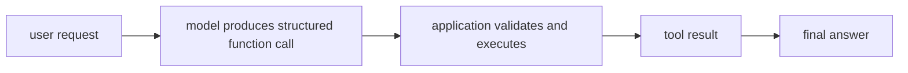

# P5-14.2 함수 호출(function calling)

P5-14.1에서는 도구 사용(tool use)이 모델과 외부 기능을 연결하는 구조라는 점을 보았습니다. 그러면 이제 더 구체적인 질문이 나옵니다.

도구를 써야 한다는 판단을 시스템은 어떤 형식으로 주고받는가?

이 절은 그 질문에 답합니다.

함수 호출(function calling)은 모델이 어떤 도구를 어떤 인자(arguments)로 호출해야 하는지 구조화된 형식으로 표현하게 하는 방식이다.

## 이 절의 범위

이 절은 다음 질문에 답합니다.

- 함수 호출은 왜 필요한가?
- 자연어 요청과 구조화된 도구 호출은 무엇이 다른가?
- 함수 이름과 인자를 나누는 것이 왜 중요한가?

이 절은 다음 내용은 깊게 다루지 않습니다.

- 특정 API 스펙 세부
- JSON schema 전체 문법
- 에이전트 프레임워크 구현 상세

이 절에서는 함수 호출의 구조적 의미만 다루고, 반복 작업을 이어 가는 실행 구조는 다음의 P5-15.1 에이전트와 P5-15.2 계획, 행동, 관찰에서 다시 회수합니다. API 스펙과 JSON schema 문법 전체는 현재 본편 범위 밖으로 둡니다.

이 절의 목적은 function calling을 단순 제품 기능명이 아니라, `도구 사용을 안정적으로 연결하기 위한 구조화 방식`으로 설명하는 데 있습니다.

## 이 절의 목표

- 함수 호출을 입문 수준에서 설명할 수 있습니다.
- 자연어 요청과 구조화된 호출의 차이를 말할 수 있습니다.
- 이름(name), 인자(arguments), 결과(result)를 나눠 보는 이유를 설명할 수 있습니다.
- 다음 장의 에이전트 구조로 자연스럽게 넘어갈 수 있습니다.

## 왜 구조화가 필요한가

도구 사용을 자연어 문장만으로 처리하면 애매함이 큽니다.

예를 들어 모델이 이렇게 말한다고 가정해 봅시다.

`서울의 오늘 환율을 검색해서 알려 주세요.`

이 문장은 사람은 이해할 수 있지만, 시스템 입장에서는 다음이 모호할 수 있습니다.

- 어떤 도구를 써야 하는가?
- 인자는 무엇인가?
- 날짜 형식은 어떻게 되는가?
- 실패하면 무엇을 돌려줘야 하는가?

그래서 함수 호출 구조는 보통 다음을 분리합니다.

- 도구 이름
- 인자 이름
- 인자 값

즉, 자연어를 그대로 실행하는 것이 아니라 `실행 가능한 구조`로 바꾸는 것입니다.

## 자연어 요청과 무엇이 다른가

| 표현 방식 | 특징 |
| --- | --- |
| 자연어 요청 | 사람이 읽기 쉽지만 모호할 수 있음 |
| 구조화된 함수 호출 | 시스템이 해석하기 쉽고 검증이 가능함 |

다음처럼 기억하면 좋습니다.

`함수 호출은 모델의 의도를 시스템이 더 안전하게 실행할 수 있도록 문장을 구조로 바꾸는 방법이다.`

## 함수 이름과 인자를 나누는 이유

이 구분은 매우 중요합니다.

예를 들어:

- 함수 이름: `lookup_exchange_rate`
- 인자: `{"currency": "USD", "region": "KR", "date": "2026-06-29"}`

이렇게 나누면 시스템은 다음을 하기 쉬워집니다.

- 허용된 도구인지 확인
- 인자 형식 검증
- 빠진 인자 탐지
- 실행 전 승인 요구

즉, 함수 호출은 단순히 예쁘게 정리하는 것이 아니라, `검증 가능성`과 `통제 가능성`을 높이는 구조입니다.

## 결과도 구조화가 중요한가

그렇습니다. 도구를 호출한 뒤에도 결과가 다시 구조적으로 돌아오면:

- 모델이 다시 읽기 쉬워지고
- 앱이 후처리하기 쉬워지며
- 로그와 추적(trace)이 쉬워집니다

즉, 함수 호출은 보통 입력 구조화만이 아니라, 실행 결과를 다시 연결하는 흐름까지 포함하는 구조로 보는 편이 좋습니다.

## 함수 호출이 항상 정답은 아니다

이 점도 같이 넣어야 합니다.

함수 호출이 있다고 해서:

- 모델이 항상 सही 도구를 고르는 것
- 인자를 완벽하게 채우는 것
- 잘못된 실행을 완전히 막는 것

이 보장되지는 않습니다.

따라서 실제 시스템은 보통:

- schema 검증
- 권한 확인
- 사용자 승인
- 실패 시 재시도 또는 오류 보고

같은 추가 구조를 둡니다.

## 아주 단순하게 그리면



이 도식의 핵심은 `문장 -> 구조 -> 실행 -> 결과` 흐름으로 바뀐다는 점입니다.

## 사례로 보기

### 사례 1. 환율 조회

`오늘 달러 환율 알려 줘`라는 질문을 구조화하면, 어느 지역 기준인지, 어떤 통화쌍인지, 어떤 날짜인지 더 명확하게 처리할 수 있습니다.

### 사례 2. 일정 생성

자연어로는 `내일 오후 3시에 회의 잡아 줘`라고 말하지만, 시스템은 참석자, 시간대, 제목 같은 인자를 분리해서 받아야 실제 캘린더 API를 호출할 수 있습니다.

### 사례 3. 코드 에이전트

파일 읽기, 테스트 실행, 패치 적용 같은 도구도 함수 호출 구조로 다루면 어떤 작업을 언제 실행했는지 추적하기 쉬워집니다.

## 작은 Python 예제로 보기

이번 예제의 목표는 실제 API를 부르는 것이 아니라, 자연어 요청이 어떻게 구조화된 호출로 바뀌는지 보는 것입니다.

입력:

- 사용자 요청

출력:

- 함수 이름과 인자 구조

```python
user_request = "내일 오후 3시에 디자인 리뷰 회의를 만들어 주세요."

function_call = {
    "name": "create_calendar_event",
    "arguments": {
        "title": "디자인 리뷰",
        "date": "tomorrow",
        "time": "15:00",
    },
}

print("user_request =", user_request)
print("function_call =", function_call)
```

실행 결과 예시는 다음처럼 읽을 수 있습니다.

```text
user_request = 내일 오후 3시에 디자인 리뷰 회의를 만들어 주세요.
function_call = {'name': 'create_calendar_event', 'arguments': {'title': '디자인 리뷰', 'date': 'tomorrow', 'time': '15:00'}}
```

이 예제는 함수 호출이 자연어를 대체하는 것이 아니라, 자연어 의도를 시스템이 실행하기 쉬운 구조로 바꾸는 역할이라는 점을 보여 줍니다.

## 역사와 커리큘럼 관점

LLM 서비스가 실무에 들어가면서 사람들은 곧 `잘 설명하는 모델`만으로는 부족하다는 점을 보았습니다. 실제 도구 연결이 필요해졌고, 그 연결을 덜 불안정하게 만들기 위한 구조화 방식이 중요해졌습니다. 함수 호출은 바로 그 흐름의 대표적인 형태입니다.

커리큘럼 관점에서 이 절이 중요한 이유는 다음과 같습니다.

- tool use를 모호한 자연어 수준에 두지 않게 하고
- agent, MCP, harness를 이해하기 위한 구조화 감각을 주며
- 실행 가능한 AI 서비스가 왜 애플리케이션 계층을 필요로 하는지 설명해 주기 때문입니다

## 다음 장과의 연결

여기까지 오면 다음 질문이 남습니다.

- 여러 단계 작업을 이어 가는 구조는 무엇인가?
- 검색, 도구 호출, 관찰, 재시도, 종료를 한 흐름으로 묶는 것은 어떻게 이해해야 하는가?

이 질문은 P5-15.1 에이전트(agent)로 이어집니다.

## 이 절에서 기억할 관점

- 함수 호출은 도구 사용을 구조화된 형식으로 표현하는 방식입니다.
- 자연어 요청과 구조화된 호출은 역할이 다릅니다.
- 함수 이름과 인자를 분리하면 검증과 통제가 쉬워집니다.
- 이 절은 다음 장의 에이전트 구조와 실행 환경 설명의 직접 기반입니다.

## 체크리스트

- 함수 호출을 입문 수준에서 설명할 수 있는가?
- 자연어 요청과 구조화된 호출의 차이를 말할 수 있는가?
- 이름과 인자를 나누는 이유를 설명할 수 있는가?
- 왜 다음 장에서 agent 구조가 등장하는지 말할 수 있는가?

## 출처와 참고 자료

- OpenAI, function calling 관련 공식 문서, 확인 날짜: 2026-06-29.
- Anthropic, tool use 관련 공개 문서, 확인 날짜: 2026-06-29.
- 관련 LLM application engineering 교육 자료, 확인 날짜: 2026-06-29.
