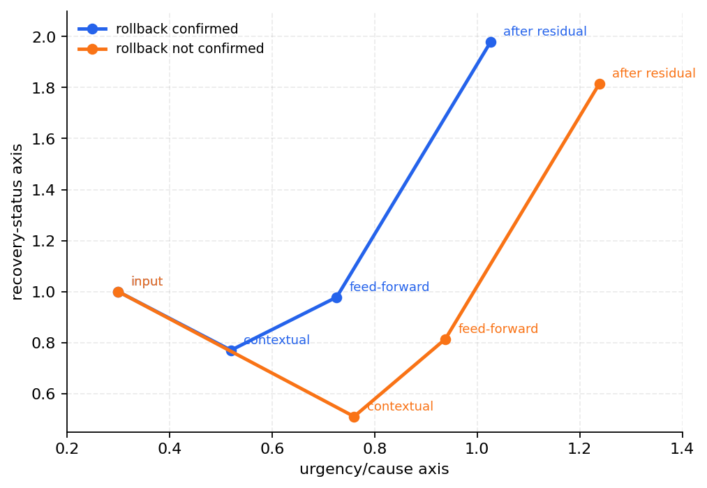

# P5-14.3 How Does A Token Representation Move Inside A Transformer Block?

> Section ID: `P5-14.3`
> Version: `v2026.07.19`

In P5-14.2, we divided the roles of the Transformer block components. Now we narrow the same flow again by following how one current representation actually passes through the block.

Inside a Transformer block, through what stages does the current token representation change?

The focus is not listing component names, but the update flow: `input representation -> context-mixed representation -> position-wise processed representation -> representation with original information added -> organized representation`.

## Questions Handled By Representation Update

- How is the representation after self-attention different from the input representation?
- How does feed-forward change that representation again?
- Why does passing through residual and normalization make it a representation that can be handed to the next block?

## If We View Representation Movement In Stages

If we follow one current representation, the Transformer block can be read as follows.

```mermaid
--8<-- "assets/part-05/chapter-14/transformer-representation-update-en.mmd"
```

What to see first in this diagram is not the formula, but the change in meaning.

| Stage | Change that happens to the representation |
| --- | --- |
| input representation | still close to the starting representation of the current token itself |
| after self-attention | context brought from other tokens is mixed in |
| after feed-forward | that context is processed again at the current position |
| after residual | the new computation and the original representation remain together |
| after normalization | it is organized into a range that is easier to pass to the next block |

## Cases And Examples

### Case. When An Action-Confirmation Cue Changes The Action Token Representation

Suppose an incident-response log contains a `symptom`, a `deployment cue`, and an `action state` in separate places. If the current position of interest is `action state`, its representation is not determined only by looking at itself. The current action representation changes depending on whether rollback was confirmed, whether the deployment cue looks like a cause, and whether the symptom still remains.

The first criterion a person may use is `what does the action-state token itself say`. But from the Transformer block viewpoint, it is more important which context that token mixed through attention, and in what direction the representation remained after feed-forward and residual.

| Scene | Direction the current representation should move toward | Why |
| --- | --- | --- |
| rollback confirmed | an action representation with stronger recovery state | because the action-confirmation cue is strongly mixed into the action token |
| rollback not confirmed | an action representation where symptom/cause cues remain more | because the action confirmation weakens, so the suspected-cause axis remains more |

| Too-quick judgment | Judgment from the representation-update viewpoint | Result to check |
| --- | --- | --- |
| Because the action token originally means `action state`, it remains similar in both scenes | If the cues mixed by attention differ, the same action token can move in different directions | the action token outputs of `rollback confirmed` and `rollback not confirmed` differ |

The result to confirm in this case is that the Transformer block does not mix a token once and stop. It moves the current position representation in stages.

## Practice And Example

### Example. Tracing The Movement Of The Action Token Representation

The goal of this example is to place the `context mixing stage` and the `stage that reprocesses each position representation` onto an actual operational-sentence scene.

When reading the code, do not try to memorize the whole matrix at once. First look only at how strongly the action token refers to other cues.

| Value to manipulate | Output to observe | Question to check |
| --- | --- | --- |
| attention weights in the action token row | the action token row of `contextual tokens` | does the action token mix more of itself, the symptom, or the deployment cue? |
| after the same weights pass through feed-forward | `feed-forward output` | how is the mixed context processed again inside the current position representation? |
| action token after residual | `action token after residual` | with the original action axis still remaining, how does the final block-output direction differ? |

```python
# This example compares how the action token's representation changes after attention, feed-forward, and residual inside a Transformer block depending on whether rollback is confirmed.
import numpy as np

tokens = np.array([
    [1.0, 0.2],   # symptom token: urgency high
    [0.8, 0.5],   # deploy clue token: cause evidence medium
    [0.3, 1.0],   # action token: recovery status important
])

attention_cases = {
    "rollback_confirmed": np.array([
        [0.6, 0.3, 0.1],
        [0.2, 0.5, 0.3],
        [0.1, 0.3, 0.6],
    ]),
    "rollback_not_confirmed": np.array([
        [0.6, 0.3, 0.1],
        [0.3, 0.5, 0.2],
        [0.3, 0.5, 0.2],
    ]),
}

ff_weights = np.array([
    [1.1, 0.4],
    [0.2, 1.0],
])

def simple_layer_norm(row):
    mean = np.mean(row)
    std = np.std(row)
    return (row - mean) / (std + 1e-6)

for name, attention_weights in attention_cases.items():
    contextual = attention_weights @ tokens
    ff_output = contextual @ ff_weights
    residual_added = ff_output + tokens
    normalized = np.vstack([simple_layer_norm(row) for row in residual_added])

    print(f"[{name}]")
    print("contextual tokens =")
    print(np.round(contextual, 3))
    print("feed-forward output =")
    print(np.round(ff_output, 3))
    print("after residual =")
    print(np.round(residual_added, 3))
    print("after simple layer norm =")
    print(np.round(normalized, 3))
    print("action token after residual =", np.round(residual_added[2], 3))
    print("---")
```

The example output can be read as follows.

```text
[rollback_confirmed]
action token after residual = [1.026 1.978]
---
[rollback_not_confirmed]
action token after residual = [1.238 1.814]
---
```

Explanation: The two scenes start from the same input tokens, but the action token representation moves differently because the attention weights differ. In `rollback_confirmed`, the recovery-state axis remains stronger, while in `rollback_not_confirmed`, the symptom/cause axis remains relatively more. This difference starts at the attention stage, but it remains as block output after passing through feed-forward and residual.



### Practice. Change The Action Token Row

The three changes below can be checked by changing only the action token row in `attention_cases` in the same code.

| Value to change | Expected change | Explanation |
| --- | --- | --- |
| Change the action token row of `rollback_confirmed` to `[0.05, 0.15, 0.8]` | the recovery-state axis remains stronger | because the action token preserves more of its own action state |
| Change the action token row of `rollback_not_confirmed` to `[0.45, 0.45, 0.1]` | the symptom/deployment-cue axis remains stronger | because more context from the suspected-cause cues is mixed in than from the action confirmation |
| Make the action token rows in the two scenes the same | the difference between the action token outputs in the two scenes shrinks | the point of this section is that even with the same input, representation movement changes when the context mixed by attention changes |

Explanation: What matters in this practice is not which number is the correct answer. The point is to confirm the flow that when we change which context the action token mixes more strongly, that difference remains as block output after passing through feed-forward and residual.

## Checklist

- Can you explain the Transformer block as a flow of representation movement?
- Can you say what `contextual tokens`, `feed-forward output`, and `after residual` each show?
- Can you explain that even with the same input, the current representation can change when attention weights change?

## Sources And References

- Ashish Vaswani et al., `Attention Is All You Need`, NeurIPS 2017, checked on 2026-07-19. [https://papers.nips.cc/paper/2017/hash/3f5ee243547dee91fbd053c1c4a845aa-Abstract.html](https://papers.nips.cc/paper/2017/hash/3f5ee243547dee91fbd053c1c4a845aa-Abstract.html){: target="_blank" rel="noopener noreferrer" }
