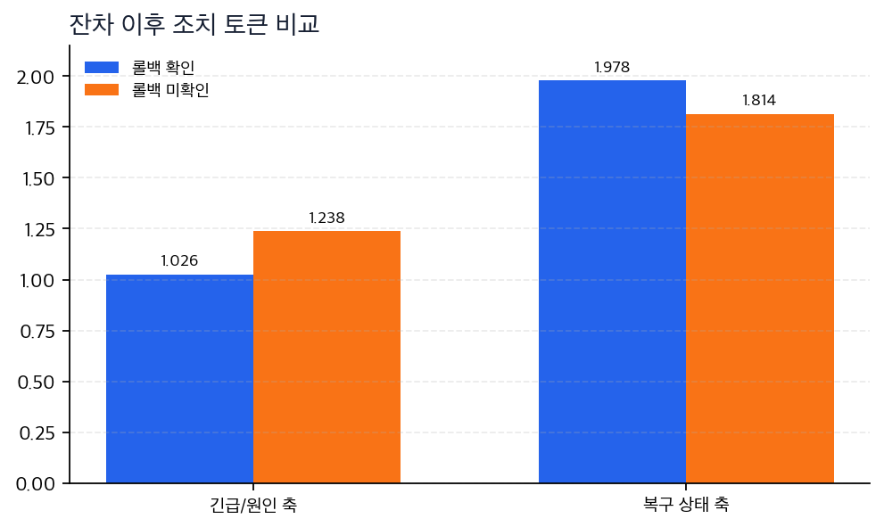

# P5-14.3 깊은 반복을 안정화하는 두 장치

> Section ID: `P5-14.3`
> Version: `v2026.07.31`

_보조제목: residual과 normalization은 정보 흐름과 값 범위를 어떻게 나누어 안정화하는가_

P5-14.2에서는 현재 표현이 attention과 feed-forward를 지나 residual 이후 어떤 방향으로 남는지 보았습니다. 그런데 Transformer 블록은 새 계산만 계속 쌓지 않습니다. 원래 표현을 남기고, 값 범위를 정리하는 안정화 장치를 함께 둡니다.

왜 residual connection과 layer normalization은 Transformer 블록에서 부차적 장식이 아닌가?

핵심은 `더 강한 attention`이 아니라 `깊은 반복을 견디는 정보 흐름`입니다.

깊은 블록을 읽을 때는 `new_signal`, `original_signal`, `combined_representation`, `normalized_representation`을 분리해 봅니다. 이 구분을 남기면 residual은 원래 축을 보존하는 장치로, normalization은 다음 계산이 다룰 수 있는 값 범위를 맞추는 장치로 읽힙니다.

## 안정화 장치가 다루는 질문

- 새 계산만 반복하면 어떤 문제가 생길 수 있는가?
- residual connection은 왜 원래 표현을 함께 남기는가?
- layer normalization은 왜 다음 계산으로 넘기기 전에 값 범위를 정리하는가?

## 새 계산만 믿으면 무엇이 흔들리나

깊은 블록을 반복하면 표현은 계속 바뀝니다. 이때 새 계산이 원래 입력 축을 지나치게 덮어쓰면 중요한 단서가 사라질 수 있고, 값의 크기와 분포가 흔들리면 다음 계산도 불안정해질 수 있습니다.

그래서 Transformer 블록은 보통 다음 두 감각을 함께 둡니다.

| 장치 | 막으려는 문제 | 먼저 남길 직관 |
| --- | --- | --- |
| residual connection | 새 계산이 원래 정보를 너무 덮는 문제 | 원래 표현을 함께 남긴다 |
| layer normalization | 값 범위가 흔들려 다음 계산이 불안정해지는 문제 | 표현 범위를 정리한다 |

## 깊은 반복을 안정화하는 두 장치: 확인할 판단 기준

이 사례에서는 residual과 normalization을 부차적 덧셈·정리가 아니라 깊은 블록 반복에서 정보 흐름과 값 범위를 안정화하는 장치로 설명하는지 확인한다.

### 사례. 조치 토큰이 원래 의미를 잃지 않아야 하는 경우

장애 대응 문장에서 action token은 `복구 상태`라는 원래 축을 갖고 있습니다. attention과 feed-forward가 새 문맥을 반영하더라도, 그 원래 축이 완전히 사라지면 현재 표현은 불안정해집니다. rollback이 확인되었는지 아닌지에 따라 표현은 달라져야 하지만, action token이 조치 상태를 가리킨다는 기본 의미는 유지되어야 합니다.

이때 residual connection은 새 계산과 원래 표현을 함께 남겨 조치 축을 보존합니다. layer normalization은 그 결과를 다음 블록이 다루기 쉬운 범위로 정리합니다.

사람이 빠르게 보기 쉬운 기준은 `새 문맥을 더 강하게 반영하면 더 좋은 표현이 된다`입니다. 하지만 깊은 블록 반복에서는 새 문맥만 강하게 남기는 것이 항상 안전하지 않습니다. 원래 조치 축이 사라지면 다음 블록은 현재 표현이 무엇을 기준으로 바뀌었는지 잃기 쉽습니다.

이 장면을 세 단계로 나누면 residual과 normalization의 역할이 더 분명해집니다.

| 단계 | 현재 표현을 읽는 질문 | 빠지면 생기는 문제 |
| --- | --- | --- |
| 새 계산만 남김 | 새 문맥이 현재 조치 표현을 어떻게 바꾸었는가 | 원래 action token의 조치 축이 약해질 수 있다 |
| residual 이후 | 새 문맥과 원래 조치 축이 함께 남았는가 | 값 축이 합쳐지며 크기와 분포가 흔들릴 수 있다 |
| normalization 이후 | 다음 블록이 다루기 쉬운 값 범위인가 | 다음 attention과 feed-forward가 불안정한 입력을 받을 수 있다 |

| 비교 포인트 | rollback confirmed | rollback not confirmed | 왜 중요한가 |
| --- | --- | --- | --- |
| action token after residual | `[1.026, 1.978]` | `[1.238, 1.814]` | 조치 확정 여부가 현재 위치 표현을 다른 방향으로 움직입니다. |
| 해석 | 복구 상태 축이 더 강함 | 증상/원인 축이 상대적으로 더 남음 | 새 문맥 반영과 원래 정보 보존을 같이 봐야 합니다. |

이 그래프는 normalization 이후 값을 새로 보여 주는 그림이 아닙니다. 먼저 residual 이후에 원래 조치 축과 새 문맥 축이 함께 남는지 확인하고, 그다음 normalization이 이 합쳐진 값을 다음 블록이 읽기 쉬운 기준선으로 맞춘다고 읽어야 합니다.

숫자를 읽을 때는 어느 값이 절대적으로 정답인지보다, 두 축이 함께 남았다는 점을 먼저 봅니다. `rollback confirmed`에서는 복구 상태 축이 더 강하지만, 원래 action token의 조치 축도 사라지지 않아야 합니다. `rollback not confirmed`에서는 증상/원인 축이 상대적으로 더 남지만, 그 역시 어떤 조치에 붙은 의미인지 추적 가능해야 합니다. residual은 이 추적 경로를 남기고, normalization은 합쳐진 값을 다음 블록이 다루기 쉬운 범위로 맞춥니다.

이 사례에서 확인해야 할 결과는 residual과 normalization이 `정답을 새로 만드는 부품`이 아니라, 새 계산이 들어온 뒤에도 조치 토큰의 기본 축과 다음 계산의 안정성을 지키는 장치라는 점입니다.

## 연습 및 예제

### 연습. residual과 normalization을 빼면 무엇이 비는가

아래 질문을 residual과 normalization의 역할로 나누어 답해 보십시오.

| 질문 | 답 | 해설 |
| --- | --- | --- |
| attention과 feed-forward 결과만 남기고 원래 입력 표현을 버리면 어떤 위험이 생기는가? | 새 계산이 중요한 출발 단서를 덮을 수 있다 | residual connection은 원래 표현을 함께 남겨, 새 문맥이 들어와도 기본 정보 흐름이 끊기지 않게 합니다. |
| residual 이후 값이 너무 커지거나 작아지면 다음 블록에서는 어떤 문제가 생길 수 있는가? | 다음 계산이 불안정해질 수 있다 | layer normalization은 값 범위와 분포를 정리해, 다음 블록이 다루기 쉬운 표현으로 넘깁니다. |
| residual과 normalization은 답을 더 똑똑하게 만드는 장치인가, 깊은 반복 계산을 견디게 하는 장치인가? | 깊은 반복 계산을 견디게 하는 장치에 가깝다 | 의미를 새로 만드는 주연이라기보다, 블록 반복이 정보 흐름과 값 범위를 잃지 않게 돕는 안정화 축입니다. |

해설: 이 연습의 핵심은 residual과 normalization을 `성능을 올리는 장식`으로 읽지 않는 것입니다. 깊은 Transformer 블록은 새 계산을 계속 쌓기 때문에, 원래 정보가 남는 경로와 다음 계산이 감당할 수 있는 값 범위가 함께 필요합니다.

### 연습. action token 축을 진단하기

아래 상황에서 먼저 필요한 안정화 장치가 무엇인지 골라 보십시오.

| 상황 | 더 직접 필요한 장치 | 해설 |
| --- | --- | --- |
| 새 계산 뒤에 `차단`, `위험` 의미만 강하게 남고, 무엇을 차단해야 하는지 약해졌다 | residual connection | 원래 action token의 조치 축이 함께 남아야 뒤 블록이 대상을 잃지 않습니다. |
| residual로 원래 축과 새 문맥을 더했더니 한 축 값만 지나치게 커졌다 | layer normalization | 다음 계산이 한 축에 과하게 끌리지 않도록 값 범위를 정리해야 합니다. |
| rollback confirmed와 not confirmed가 서로 다른 방향으로 움직였지만 둘 다 조치 상태 축을 유지해야 한다 | residual connection | 장면별 새 의미는 달라져도 현재 위치가 조치 토큰이라는 기본 축은 남아야 합니다. |
| 여러 블록을 지나며 표현값 크기가 매번 크게 달라진다 | layer normalization | 반복 블록이 비슷한 기준선에서 계산을 이어 가게 해야 합니다. |

해설: 이 연습은 residual과 normalization을 한 덩어리로 외우지 않기 위한 것입니다. `무엇을 잃었는가`가 원래 정보라면 residual을 먼저 떠올리고, `어떤 범위로 계산되는가`가 흔들린다면 normalization을 먼저 떠올립니다.

## 체크리스트

- residual connection이 원래 정보 흐름을 보존하는 이유를 말할 수 있는가?
- layer normalization이 값 범위를 정리해 다음 계산을 안정화한다는 점을 설명할 수 있는가?
- Transformer 블록을 `문맥 섞기 + 위치별 가공 + 원래 정보 보존 + 안정화`의 조합으로 설명할 수 있는가?

## 출처와 참고 자료

- Ashish Vaswani et al., `Attention Is All You Need`, NeurIPS 2017, 확인 날짜: 2026-07-19. [https://papers.nips.cc/paper/2017/hash/3f5ee243547dee91fbd053c1c4a845aa-Abstract.html](https://papers.nips.cc/paper/2017/hash/3f5ee243547dee91fbd053c1c4a845aa-Abstract.html){: target="_blank" rel="noopener noreferrer" }
- Ian Goodfellow, Yoshua Bengio, Aaron Courville, `Deep Learning`, MIT Press, 2016, 확인 날짜: 2026-06-29. [https://www.deeplearningbook.org/](https://www.deeplearningbook.org/){: target="_blank" rel="noopener noreferrer" }
