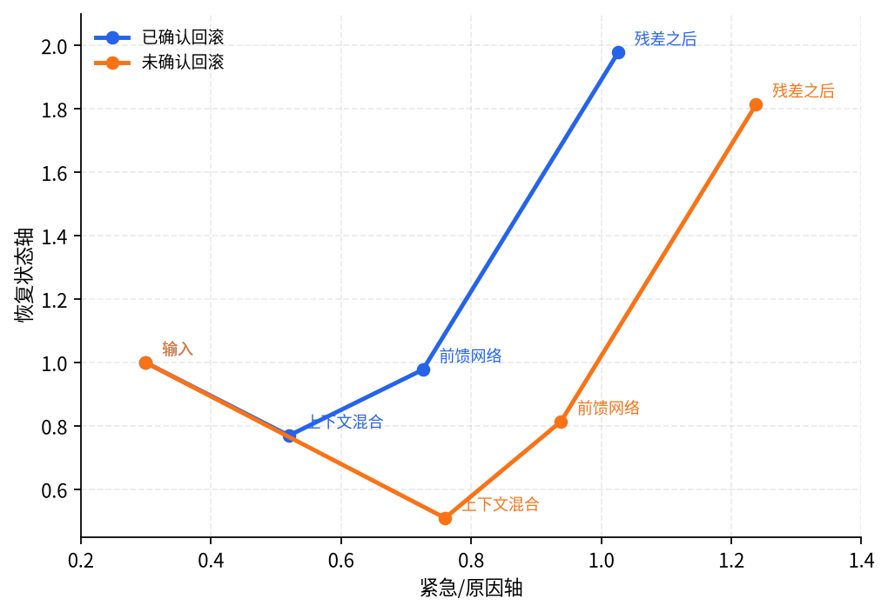

# P5-14.3 token 表示在 Transformer block 里怎样移动？

> Section ID: `P5-14.3`
> Version: `v2026.07.19`

在 P5-14.2 中，我们已经拆开看过 Transformer block 各部件的角色。现在把同一条流程再缩小到一个当前表示，看看它实际怎样经过 block。

在 Transformer block 里，当前 token 表示会经过哪些阶段而改变？

重点不是列出部件名称，而是`输入表示 -> 混入上下文的表示 -> 按位置加工后的表示 -> 加回原始信息的表示 -> 整理后的表示`这一条更新流程。

## 表示更新处理的问题

- self-attention 之后的表示和输入表示有什么不同？
- feed-forward 会怎样再次改变这个表示？
- 经过 residual 和 normalization 后，为什么会变成可以传给下一个 block 的表示？

## 把表示移动拆成阶段来看

沿着同一个当前表示看，Transformer block 可以读成下面这样。

```mermaid
--8<-- "assets/part-05/chapter-14/transformer-representation-update-zh.mmd"
```

这张图里首先要看的不是计算公式，而是意义变化。

| 阶段 | 表示发生的变化 |
| --- | --- |
| 输入表示 | 还接近当前 token 自身的起始表示 |
| self-attention 之后 | 混入了从其他 token 带来的上下文 |
| feed-forward 之后 | 这些上下文在当前位置被再次加工 |
| residual 之后 | 新计算和原始表示一起留下 |
| normalization 之后 | 被整理到更容易传给下一个 block 的范围 |

## 案例与示例

### 案例：处置确认线索改变 action token 表示

假设故障响应日志里分别出现了`症状`、`部署线索`、`处置状态`。如果当前关注的位置是`处置状态`，它的表示就不是只看自己本身来决定的。rollback 是否已确认、部署线索是否像原因、症状是否仍然存在，都会改变当前处置表示。

人容易先使用的标准是`处置状态 token 自己说了什么`。但从 Transformer block 的角度看，更重要的是这个 token 通过 attention 混入了哪些上下文，又经过 feed-forward 和 residual 后，以什么方向的表示留下来。

| 场景 | 当前表示应该朝向的方向 | 原因 |
| --- | --- | --- |
| rollback confirmed | 恢复状态更强的处置表示 | 处置确认线索强烈混入了 action token |
| rollback not confirmed | 症状/原因线索保留更多的处置表示 | 处置确认变弱，原因怀疑轴保留得更多 |

| 过快判断 | 表示更新视角的判断 | 要确认的结果 |
| --- | --- | --- |
| action token 原本表示`处置状态`，所以两个场景中会差不多 | 如果 attention 混入的线索不同，同一个 action token 也会朝不同方向移动 | `rollback confirmed` 和 `rollback not confirmed` 的 action token 输出不同 |

这个案例要确认的是：Transformer block 不是把 token 混合一次就结束，而是分阶段移动当前位置表示。

## 练习与例子

### 例子：跟踪 action token 表示移动

这个例子的目标，是把`混入上下文的阶段`和`重新加工各位置表示的阶段`放到实际运维句子场景中看。

读代码时，不要试图一次背下整个矩阵。先只看 action token 对其他线索参考了多少。

| 要操作的值 | 要观察的输出 | 要确认的问题 |
| --- | --- | --- |
| action token 行的 attention 权重 | `contextual tokens` 的 action token 行 | 处置 token 更多混入自己、症状、还是部署线索？ |
| 同一组权重经过 feed-forward 后 | `feed-forward output` | 混入的上下文在当前位置表示内部怎样被再次加工？ |
| residual 之后的 action token | `action token after residual` | 原始处置轴仍然留下时，最终 block 输出方向怎样不同？ |

```python
# 这个例子比较 rollback 是否已确认时，action token 在 Transformer block 内经过 attention、feed-forward、residual 后的表示如何变化。
import numpy as np

tokens = np.array([
    [1.0, 0.2],   # symptom token: urgency high
    [0.8, 0.5],   # deploy clue token: cause evidence medium
    [0.3, 1.0],   # action token: recovery status important
])

attention_cases = {
    "rollback_confirmed": np.array([
        [0.6, 0.3, 0.1],
        [0.2, 0.5, 0.3],
        [0.1, 0.3, 0.6],
    ]),
    "rollback_not_confirmed": np.array([
        [0.6, 0.3, 0.1],
        [0.3, 0.5, 0.2],
        [0.3, 0.5, 0.2],
    ]),
}

ff_weights = np.array([
    [1.1, 0.4],
    [0.2, 1.0],
])

def simple_layer_norm(row):
    mean = np.mean(row)
    std = np.std(row)
    return (row - mean) / (std + 1e-6)

for name, attention_weights in attention_cases.items():
    contextual = attention_weights @ tokens
    ff_output = contextual @ ff_weights
    residual_added = ff_output + tokens
    normalized = np.vstack([simple_layer_norm(row) for row in residual_added])

    print(f"[{name}]")
    print("contextual tokens =")
    print(np.round(contextual, 3))
    print("feed-forward output =")
    print(np.round(ff_output, 3))
    print("after residual =")
    print(np.round(residual_added, 3))
    print("after simple layer norm =")
    print(np.round(normalized, 3))
    print("action token after residual =", np.round(residual_added[2], 3))
    print("---")
```

输出示例可以这样读。

```text
[rollback_confirmed]
action token after residual = [1.026 1.978]
---
[rollback_not_confirmed]
action token after residual = [1.238 1.814]
---
```

解说：两个场景从相同输入 token 开始，但由于 attention 权重不同，action token 表示也会朝不同方向移动。`rollback_confirmed` 中，恢复状态轴保留得更强；`rollback_not_confirmed` 中，症状/原因轴相对保留得更多。这个差异从 attention 阶段开始，但经过 feed-forward 和 residual 后会作为 block 输出留下。



### 练习：改变 action token 行

下面三个变化，只要在同一段代码中改 `attention_cases` 的 action token 行就能确认。

| 要改变的值 | 预期变化 | 解说 |
| --- | --- | --- |
| 把 `rollback_confirmed` 的 action token 行改成 `[0.05, 0.15, 0.8]` | 恢复状态轴会保留得更强 | 因为 action token 更多保留了自己的处置状态。 |
| 把 `rollback_not_confirmed` 的 action token 行改成 `[0.45, 0.45, 0.1]` | 症状/部署线索轴会保留得更强 | 因为比起处置确认，原因线索一侧的上下文混入得更多。 |
| 让两个场景的 action token 行相同 | 两个场景的 action token 输出差异会缩小 | 本节核心是：即使输入相同，只要 attention 混入的上下文不同，表示移动也会不同。 |

解说：这个练习中重要的不是哪个数字是正确答案。要确认的是，只要改变 action token 更多混入哪种上下文，这个差异就会经过 feed-forward 和 residual 留成 block 输出。

## 检查清单

- 能把 Transformer block 解释成表示移动的流程吗？
- 能说明 `contextual tokens`、`feed-forward output`、`after residual` 分别展示什么吗？
- 能解释即使输入相同，只要 attention 权重不同，当前表示也可能不同吗？

## 来源与参考资料

- Ashish Vaswani et al., `Attention Is All You Need`, NeurIPS 2017, 确认日期：2026-07-19. [https://papers.nips.cc/paper/2017/hash/3f5ee243547dee91fbd053c1c4a845aa-Abstract.html](https://papers.nips.cc/paper/2017/hash/3f5ee243547dee91fbd053c1c4a845aa-Abstract.html){: target="_blank" rel="noopener noreferrer" }
