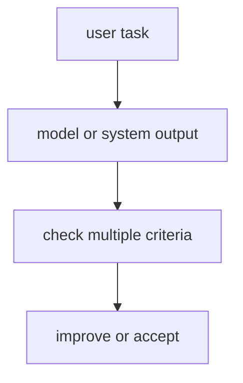

# P5-15.1 LLM 평가(evaluation)

P5-14.2에서는 하네스(harness)가 에이전트 실행을 감싸고 기록하고 평가하는 운영 장치에 가깝다는 점을 보았습니다. 그러면 이제 직접적인 질문으로 들어가야 합니다.

LLM 기반 시스템의 품질은 실제로 무엇으로 점검해야 하는가?

이 절은 그 질문에 답합니다.

LLM 평가(evaluation)는 답변이 그럴듯한지만 보는 일이 아니라, 정확성, 유용성, 안전성, 근거성, 실행 결과를 기준에 따라 점검하는 일이다.

같은 말을 더 쉽게 바꾸면 다음과 같습니다.

평가는 답이 좋아 보이는지 묻는 일이 아니라, 무엇이 좋고 무엇이 아직 위험한지를 항목별로 확인하는 일이다.

## 이 절의 범위

이 절은 다음 질문에 답합니다.

- LLM 평가는 왜 어려운가?
- 무엇을 평가해야 하는가?
- 모델 평가와 시스템 평가를 왜 구분해야 하는가?

이 절에서는 다음 내용을 깊게 다루지 않습니다.

- 벤치마크 점수 상세 비교
- 통계적 유의성 검정 세부
- 대규모 평가 플랫폼 구현

평가 축의 큰 그림은 여기서 잡고, 자동 평가와 사람 평가의 역할 분담은 바로 다음 P5-15.2에서 다시 회수합니다. 운영 제약 안에서 평가를 어떻게 읽을지는 P5-16.1 서비스 운영 제약과 P5-16.2 운영 중 실패 대응에서 다시 이어집니다.

이 절의 목적은 평가를 단순히 `정답률 하나 보는 일`로 설명하지 않고, 생성형 AI와 에이전트 구조에 맞는 다층 평가 문제로 설명하는 데 있습니다.

## 이 절의 목표

- LLM 평가를 입문 수준에서 설명할 수 있습니다.
- 정확성, 유용성, 안전성, 근거성 같은 평가 축을 구분할 수 있습니다.
- 모델 평가와 시스템 평가의 차이를 말할 수 있습니다.
- 다음 절의 자동 평가와 사람 평가 비교로 자연스럽게 넘어갈 수 있습니다.

## 왜 LLM 평가는 어려운가

전통적인 분류 문제에서는 정답 레이블이 분명한 경우가 많습니다. 하지만 생성형 AI에서는 다음과 같은 어려움이 생깁니다.

먼저 다음 세 질문으로 읽으면 좋습니다.

| 질문 | 짧은 답 |
| --- | --- |
| 왜 평가가 어려운가? | 답이 하나만 있는 문제가 아니기 때문 |
| 무엇이 더 복잡해졌는가? | 자연스러움, 사실성, 형식, 근거를 함께 봐야 함 |
| 그래서 어떻게 읽어야 하는가? | 한 점수보다 여러 평가 축으로 읽어야 함 |

- 답이 하나만 있는 것이 아닐 수 있음
- 문장은 자연스러운데 사실은 틀릴 수 있음
- 내용은 맞지만 형식이 부적절할 수 있음
- 답변은 좋아 보여도 근거가 약할 수 있음

즉, LLM 평가는 `맞다/틀리다` 한 줄로 끝나지 않는 경우가 많습니다.

이 점은 전통적인 머신러닝 평가와의 중요한 차이입니다. 분류 문제에서는 `맞았는가`가 중심이었다면, 생성형 AI에서는 `어떻게 맞았는가`, `무엇은 맞고 무엇은 부족한가`까지 같이 봐야 합니다.

## 무엇을 평가해야 하나

다음 축을 먼저 구분하면 충분합니다.

| 평가 축 | 중심 질문 |
| --- | --- |
| 정확성(accuracy / correctness) | 사실과 계산이 맞는가? |
| 유용성(helpfulness) | 사용자의 일을 실제로 돕는가? |
| 안전성(safety) | 해로운 결과를 줄이는가? |
| 근거성(groundedness) | 답이 주어진 문서나 근거와 연결되는가? |
| 형식 적합성(format compliance) | 요청한 형식과 제약을 따르는가? |

이 축을 나누지 않으면, 유창한 답변을 좋은 답변으로 쉽게 오해하게 됩니다.

이 표를 다음 한 줄로 다시 기억해도 좋습니다.

- 정확성은 `맞는가`
- 유용성은 `도움이 되는가`
- 안전성은 `위험을 줄이는가`
- 근거성은 `어디에서 왔는가`
- 형식 적합성은 `요청한 방식대로 나왔는가`

## 모델 평가와 시스템 평가는 왜 다른가

이 구분이 중요합니다.

LLM 기반 시스템은 보통 모델만으로 이루어지지 않습니다. 예를 들어 RAG 시스템에서는:

- 검색이 잘 됐는지
- 검색 문서를 잘 읽었는지
- 답변이 근거를 잘 반영했는지

를 따로 봐야 합니다.

에이전트 시스템에서는 여기에 더해:

- 적절한 도구를 골랐는지
- 호출 인자가 맞았는지
- 실행 결과를 잘 읽었는지

도 봐야 합니다.

즉:

- 모델 평가는 `문장 생성 능력`에 더 가깝고
- 시스템 평가는 `검색, 도구, 실행, 출력까지 포함한 전체 흐름`에 가깝습니다

이 구분이 특히 중요합니다. LLM 서비스에서 문제가 생겼을 때, 곧바로 `모델이 나쁘다`고 결론내리면 검색 품질, 도구 호출, 후처리 오류를 놓치기 쉽기 때문입니다.

같은 흐름으로 다시 정리하면 다음과 같습니다.

| 평가 대상 | 주로 보는 것 |
| --- | --- |
| 모델 | 문장 생성, 형식, 추론 결과 |
| 시스템 | 검색, 도구, 실행, 응답 전체 경로 |

## 왜 한 점수로 끝내기 어렵나

독자에게는 `그럼 점수 하나로 정리하면 안 되는가?`라는 질문이 자연스럽습니다. 하지만 실제로는 한 점수에 여러 문제가 숨습니다.

예를 들어:

- 유용성은 높지만 사실성이 낮을 수 있고
- 안전성은 높지만 지나치게 보수적일 수 있으며
- 검색은 좋지만 최종 요약이 틀릴 수 있습니다

따라서 LLM 평가는 보통 `하나의 절대 점수`보다 `여러 평가 축의 묶음`으로 읽는 편이 더 안전합니다.

## 왜 운영 관점에서도 중요하나

평가는 학술 벤치마크만을 위한 일이 아닙니다. 서비스 운영에서는 다음 질문과 직접 연결됩니다.

- 이 배포 버전이 이전보다 나아졌는가?
- 어떤 유형의 질문에서 실패가 늘었는가?
- 검색 품질이 떨어졌는가, 생성 품질이 떨어졌는가?
- 비용을 줄였더니 품질이 얼마나 흔들렸는가?

즉, 평가는 모델 자랑용 수치가 아니라 `변경과 운영을 통제하는 기준`입니다.

이 절을 서비스 구조 흐름 안에 놓으면 다음처럼 이어집니다.

- 프롬프트, RAG, 도구, 에이전트를 설계하고
- 실제 출력을 만들고
- 그 결과를 어떤 기준으로 유지·비교할지 정하는 단계가 evaluation입니다

## 아주 단순하게 그리면



이 도식의 핵심은 출력이 나온 뒤 `무엇을 기준으로 괜찮다고 볼지`가 반드시 필요하다는 점입니다.

## 사례로 보기

### 사례 1. 문서 요약 평가

회의록 요약이 문장만 매끄럽게 정리되어 있다고 해 봅시다. 사람은 첫눈에 보면 읽기 편하고 형식도 단정하니 좋은 결과라고 먼저 판단하기 쉽습니다. 하지만 실제로는 `다음 주 배포 연기`, `법무 검토 필요`, `담당자 변경` 같은 핵심 결론이 빠졌다면 이 요약은 실무에서 바로 쓸 수 없습니다. 즉, 보기 좋은 문장과 중요한 정보 보존은 다른 평가 축입니다. 예를 들어 말투는 자연스러워도 연기 사유가 빠지면, 보고용 요약으로는 실패에 가깝습니다. 이런 상태로 보고가 올라가면 읽는 사람은 일정 변경 사실만 알고 왜 연기됐는지는 다시 원문을 찾아야 할 수 있습니다. 그래서 평가에서는 `자연스러운가`만 보지 않고 `핵심 정보가 남았는가`를 따로 확인해야 합니다. 이 사례는 출력이 좋아 보여도 평가 축을 나누지 않으면 중요한 실패를 놓칠 수 있다는 점을 보여 줍니다.

### 사례 2. RAG 기반 질의응답

RAG 답변이 매우 유창하게 나왔는데, 실제 검색 문서에는 없는 숫자나 조건을 덧붙였다고 해 봅시다. 사람은 문장이 매끄러우면 일단 신뢰하기 쉬워서, 근거 문서와 한 줄씩 대조하지 않으면 이런 차이를 놓칠 수 있습니다. 예를 들어 문서에는 `기본 14일`만 있는데 답변이 `개봉 제품도 30일 가능`처럼 없는 조건을 붙이면, 말은 자연스러워도 근거성은 무너집니다. 인용 링크가 있어도 실제 인용 문단이 그 조건을 말하지 않는다면, 형식은 맞아 보여도 groundedness는 실패입니다. 이런 답이 그대로 고객 안내에 쓰이면 문체는 매끄러워도 정책 위반 답변이 될 수 있습니다. 하지만 RAG에서 중요한 것은 `그럴듯함`보다 `붙인 근거와 실제로 맞는가`입니다. 그래서 이 경우 평가는 답변 문장 자체보다 검색 문서와의 일치 여부, 근거 인용의 정확성을 따로 확인해야 합니다. 이 장면은 평가 축 중 groundedness가 왜 독립적으로 필요한지 잘 보여 줍니다.

### 사례 3. 에이전트 실행 평가

에이전트가 최종적으로 보고서를 잘 만들어 냈다고 해 봅시다. 사람은 결과물만 보면 우선 성공처럼 느끼기 쉽습니다. 하지만 중간에 같은 문서를 여러 번 읽고, 실패한 검색을 반복하고, 필요 없는 도구 호출을 계속했다면 실제 운영 비용과 지연 시간은 크게 나빠질 수 있습니다. 최종 산출물만 보면 이런 실행 비효율은 거의 보이지 않습니다. 예를 들어 한 번의 검색으로 충분했던 작업을 다섯 번 반복했다면, 결과는 맞아도 실서비스 운영성은 나쁘다고 봐야 합니다. 이 비효율이 누적되면 한 건은 성공해도 여러 요청이 몰릴 때 전체 시스템이 느려질 수 있습니다. 그래서 평가에서는 `결과가 맞는가`와 함께 `어떤 경로로 그 결과에 도달했는가`를 따로 봐야 합니다. 이 사례는 에이전트 평가가 정답 여부만이 아니라 실행 품질까지 포함한다는 점을 보여 줍니다.

세 사례를 한 줄로 묶으면 다음과 같습니다.

| 상황 | 평가에서 특히 봐야 하는 것 |
| --- | --- |
| 요약 | 핵심 정보 보존 여부 |
| RAG 질의응답 | 문서 근거와 답변 일치 여부 |
| 에이전트 실행 | 최종 결과뿐 아니라 실행 경로와 비용 |

## 작은 Python 예제로 보기

이번 예제의 목표는 LLM 평가가 한 항목이 아니라 여러 축이라는 점을 감각적으로 보는 것입니다.

입력:

- 하나의 출력
- 여러 평가 기준

출력:

- 항목별 점검 구조

```python
output = "환불 정책은 14일로 변경되었습니다."

evaluation = {
    "correctness": "check_document",
    "helpfulness": "looks_good",
    "groundedness": "needs_source_match",
    "format": "plain_sentence_ok",
}

print("output =", output)
print("evaluation =", evaluation)
```

실행 결과 예시는 다음처럼 읽을 수 있습니다.

```text
output = 환불 정책은 14일로 변경되었습니다.
evaluation = {'correctness': 'check_document', 'helpfulness': 'looks_good', 'groundedness': 'needs_source_match', 'format': 'plain_sentence_ok'}
```

이 예제는 하나의 출력도 여러 기준으로 따로 봐야 한다는 점을 보여 줍니다.

이 예제에서 여기서 읽어야 할 핵심은 다음입니다.

- 출력 문장은 하나여도
- 검토 질문은 여러 개일 수 있고
- 따라서 평가도 한 줄 결론보다 항목별 점검표에 가깝다는 점입니다

## 역사와 커리큘럼 관점

초기 생성형 AI 논의에서는 모델이 얼마나 유창하게 말하는지가 크게 보였습니다. 하지만 서비스 사용이 늘면서 사람들은 곧 `말을 잘하는 것`과 `믿고 쓸 수 있는 것`이 다르다는 점을 더 강하게 체감하게 되었습니다. 이 흐름에서 evaluation은 중심 주제가 되었습니다.

이 역사 설명을 다음처럼 받아들이면 충분합니다.

`생성형 AI가 널리 쓰이면서, 좋은 문장보다 믿고 운영할 수 있는 답을 어떻게 판별할지가 더 중요해졌다.`

커리큘럼 관점에서 이 절이 중요한 이유는 다음과 같습니다.

- 평가를 모델 성능 자랑이 아니라 운영 기준으로 읽게 하고
- 다음 절의 자동 평가와 사람 평가 비교를 준비시키며
- Part 6 프로젝트에서 결과를 검증하는 기준을 미리 만들어 주기 때문입니다

## 다음 절과의 연결

여기까지 오면 다음 질문이 남습니다.

- 이런 평가를 자동으로 할 수 있는가?
- 결국 사람의 검토가 왜 여전히 필요한가?

이 질문은 P5-15.2 자동 평가와 사람 평가로 이어집니다.

## 이 절에서 기억할 관점

- LLM 평가는 그럴듯함이 아니라 정확성, 유용성, 안전성, 근거성 등을 함께 점검하는 일입니다.
- 모델 평가와 시스템 평가는 다를 수 있습니다.
- 하나의 절대 점수보다 여러 평가 축을 함께 보는 편이 더 안전합니다.
- 평가는 서비스 운영과 개선의 직접 기준입니다.

## 체크리스트

- LLM 평가를 입문 수준에서 설명할 수 있는가?
- 어떤 평가 축이 필요한지 말할 수 있는가?
- 모델 평가와 시스템 평가의 차이를 설명할 수 있는가?
- 왜 다음 절에서 자동 평가와 사람 평가를 나눠 봐야 하는지 말할 수 있는가?

## 출처와 참고 자료

- OpenAI, evaluation 관련 공식 문서, 확인 날짜: 2026-06-29.
- 관련 LLM evaluation 교육 자료, 확인 날짜: 2026-06-29.
- RAG 및 agent evaluation 사례 자료, 확인 날짜: 2026-06-29.
