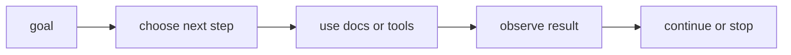

# P5-15.1 에이전트(agent)

P5-14.2에서는 함수 호출(function calling)이 도구 사용을 구조화된 형식으로 표현하는 방식이라는 점을 보았습니다. 그러면 이제 질문이 한 단계 더 커집니다.

도구 호출이 한 번으로 끝나지 않고, 여러 단계 작업을 이어 가야 하면 무엇이라고 보아야 하는가?

이 절은 그 질문에 답합니다.

에이전트(agent)는 목표를 받고, 필요한 하위 작업을 이어 가며, 도구 사용과 관찰을 반복해 결과를 만드는 작업 구조다.

같은 말을 더 쉽게 바꾸면 다음과 같습니다.

에이전트는 한 번 답하고 끝나는 모델이 아니라, 목표를 끝까지 처리하기 위해 여러 단계를 이어 가는 구조다.

## 이 절의 범위

이 절은 다음 질문에 답합니다.

- 에이전트는 무엇을 하는 구조인가?
- 프롬프트, RAG, tool use와 agent는 어떻게 다른가?
- 왜 에이전트를 단순 챗봇과 같은 것으로 보면 혼동이 생기는가?

이 절은 다음 내용은 깊게 다루지 않습니다.

- 다중 에이전트(multi-agent) 협업 설계
- planner, executor, critic 세부 패턴 비교
- 프레임워크별 구현 차이

에이전트의 최소 실행 구조는 여기와 다음 P5-15.2 계획, 행동, 관찰에서 먼저 회수합니다. 도구 연결 표준과 실행 환경 문제는 P5-16.1 MCP와 도구 연결, P5-16.2 하네스에서 다시 다루고, 다중 에이전트 설계 전개는 현재 본편 범위 밖으로 둡니다.

이 절의 목적은 agent를 유행어처럼 쓰지 않고, `목표를 작업 흐름으로 이어 가는 실행 구조`로 설명하는 데 있습니다.

## 이 절의 목표

- 에이전트를 입문 수준에서 설명할 수 있습니다.
- 프롬프트, RAG, tool use와 agent의 차이를 말할 수 있습니다.
- 에이전트가 왜 여러 단계와 상태(state)를 다루는 구조인지 설명할 수 있습니다.
- 다음 절의 계획, 행동, 관찰 흐름으로 자연스럽게 넘어갈 수 있습니다.

## 에이전트는 무엇을 더하나

프롬프트는 입력 설계입니다.  
RAG는 외부 문서를 찾아 붙이는 구조입니다.  
tool use는 외부 기능을 호출하는 구조입니다.

먼저 다음 세 질문으로 읽으면 좋습니다.

| 질문 | 짧은 답 |
| --- | --- |
| 에이전트에서 새로 중요해지는 것은 무엇인가? | 여러 단계의 연결 |
| 한 번의 도구 호출과 무엇이 다른가? | 중간 결과를 보고 다음 행동을 바꾼다 |
| 그래서 중심이 무엇으로 바뀌는가? | 한 번의 답변에서 목표 중심 워크플로우로 |

그러면 agent는 무엇을 더할까요?

핵심은 `여러 단계를 이어 가는 것`입니다.

예를 들어 어떤 목표가:

- 정보를 찾고
- 필요한 도구를 고르고
- 중간 결과를 읽고
- 다음 행동을 바꾸고
- 실패하면 다시 시도하고
- 최종 결과를 정리하는

흐름으로 이어진다면, 이것은 단순 단발 요청보다 agent 구조에 가깝습니다.

즉, 에이전트는 `한 번의 응답`보다 `목표를 향한 작업 흐름`에 중심이 있습니다.

서비스 구조 관점으로 보면, 프롬프트는 `어떻게 물을까`, RAG는 `무엇을 읽을까`, tool use는 `무엇을 실행할까`를 다룹니다. agent는 여기에 `어떤 순서로 이어 갈까`를 더합니다.

## 왜 단순 챗봇과 같은 말이 아닌가

종종 agent를 `더 똑똑한 챗봇` 정도로 이해합니다. 하지만 더 안전한 설명은 다음과 같습니다.

`에이전트는 대화형 인터페이스를 가질 수 있지만, 핵심은 대화 자체가 아니라 목표를 위해 작업 단계를 이어 가는 실행 구조에 있다.`

예를 들어 에이전트는 다음을 할 수 있습니다.

- 질문을 다시 분해하기
- 문서를 검색하기
- 파일을 읽기
- 테스트를 실행하기
- 실패 원인을 보고 다시 시도하기

이런 흐름은 단순한 한 번의 답변보다 `작업 orchestration`에 더 가깝습니다.

## 프롬프트, RAG, tool use와 어떻게 다른가

| 구조 | 중심 역할 |
| --- | --- |
| 프롬프트(prompt) | 입력을 설계한다 |
| RAG | 관련 문서를 찾아 답변 근거로 붙인다 |
| tool use | 외부 기능을 호출한다 |
| agent | 여러 단계 작업을 목표 중심으로 이어 간다 |

즉, agent는 앞선 구조들을 포함할 수 있습니다. 프롬프트도 쓰고, RAG도 쓰고, 도구도 쓸 수 있습니다. 하지만 그 자체로는 각각과 다른 `상위 작업 구조`입니다.

이 표를 다음 한 줄로 다시 기억해도 좋습니다.

- 프롬프트는 입력 단위
- RAG와 tool use는 기능 단위
- agent는 흐름 단위

## 왜 상태(state)가 중요해지나

여러 단계 작업을 이어 가려면 시스템은 중간 상태를 알아야 합니다.

예를 들어:

- 이미 어떤 문서를 읽었는가
- 어떤 도구 호출이 성공했는가
- 어떤 오류가 발생했는가
- 다음에 무엇을 해야 하는가

이런 정보가 없으면 에이전트는 매 단계마다 맥락을 잃고 같은 실수를 반복할 수 있습니다.

따라서 agent는 단순한 출력 생성보다 `상태를 가진 실행`에 더 가깝습니다.

이 점 때문에 agent 설명에서는 `왜?`라는 질문에 답하기 위해 현재 단계, 이전 결과, 남은 목표를 함께 봐야 합니다.

## 왜 실무에서 중요해졌나

LLM이 실제 작업에 들어가면서 사람들은 곧 다음을 원하게 되었습니다.

- 단순 설명을 넘어서
- 실제 자료를 모으고
- 도구를 사용하고
- 결과를 다시 정리하고
- 끝까지 처리해 주는 흐름

이 요구가 커질수록, 단일 응답 모델보다 agent 구조가 더 자주 등장하게 됩니다.

예를 들어:

- 개발 보조
- 리서치 보조
- 문서 처리 자동화
- 고객 대응 워크플로우

같은 곳에서 agent 구조가 두드러집니다.

## 에이전트도 만능은 아니다

이 점도 반드시 같이 넣어야 합니다.

에이전트가 있다고 해서:

- 항상 올바른 계획을 세우는 것
- 무한 반복을 피하는 것
- 잘못된 도구 호출을 모두 막는 것
- 비용과 지연 시간을 자동으로 최적화하는 것

이 보장되지는 않습니다.

오히려 단계가 늘어나면:

- 실패 지점이 늘고
- 로그가 더 필요하며
- 승인과 권한 관리가 중요해지고
- 평가와 재현성이 더 어려워질 수 있습니다

즉, agent는 능력을 넓히는 동시에 운영 복잡도도 크게 키웁니다.

## 아주 단순하게 그리면



이 도식의 핵심은 agent가 `질문 -> 답변` 한 번으로 끝나는 구조가 아니라, `목표 -> 단계 선택 -> 실행 -> 관찰`의 반복 구조라는 점입니다.

## 사례로 보기

### 사례 1. 코딩 에이전트

요청을 받으면 파일을 읽고, 필요한 부분을 찾고, 수정하고, 테스트를 돌리고, 결과를 요약합니다. 이것은 단순 응답이 아니라 작업 흐름입니다.

### 사례 2. 문서 조사 에이전트

질문을 받고, 관련 자료를 검색하고, 요약하고, 출처를 정리하고, 빠진 부분을 다시 찾습니다. 이 역시 여러 단계 관찰과 재시도를 포함합니다.

### 사례 3. 업무 자동화 에이전트

이메일 분류, 일정 확인, 내부 시스템 조회, 결과 저장을 이어 가는 구조는 tool use를 포함하지만, 핵심은 그 단계들을 하나의 목표 흐름으로 연결하는 데 있습니다.

세 사례를 한 줄로 묶으면 다음과 같습니다.

| 상황 | agent로 보는 이유 |
| --- | --- |
| 코딩 보조 | 읽기-수정-테스트-요약이 이어져서 |
| 문서 조사 | 검색-읽기-정리-재탐색이 반복되어서 |
| 업무 자동화 | 여러 시스템 동작을 하나의 목표로 묶어서 |

## 작은 Python 예제로 보기

이번 예제의 목표는 실제 agent를 구현하는 것이 아니라, 목표와 단계가 분리된다는 점을 감각적으로 보는 것입니다.

입력:

- 하나의 목표
- 가능한 다음 단계 목록

출력:

- 작업 흐름 관점

```python
goal = "최신 환불 정책을 찾아 요약하고 출처를 붙여 답변한다."

steps = [
    "search_policy_docs",
    "read_top_documents",
    "summarize_changes",
    "attach_sources",
]

print("goal =", goal)
print("steps =", steps)
print("observation = this is a workflow, not a single response")
```

실행 결과 예시는 다음처럼 읽을 수 있습니다.

```text
goal = 최신 환불 정책을 찾아 요약하고 출처를 붙여 답변한다.
steps = ['search_policy_docs', 'read_top_documents', 'summarize_changes', 'attach_sources']
observation = this is a workflow, not a single response
```

이 예제는 에이전트가 `좋은 한 문장`보다 `좋은 작업 흐름`을 더 중심에 둔 구조라는 점을 보여 줍니다.

이 예제에서 여기서 읽어야 할 핵심은 다음입니다.

- 목표는 하나지만
- 단계는 여러 개일 수 있고
- 각 단계의 결과가 다음 단계 선택에 영향을 준다는 점입니다

## 역사와 커리큘럼 관점

LLM이 널리 쓰이기 시작했을 때는 대화형 응답이 가장 먼저 주목받았습니다. 하지만 실제 생산성 도구나 자동화 도구로 확장되면서, 사람들은 곧 `답만 잘하는 모델`보다 `일을 이어 가는 구조`를 원하게 되었습니다. 이 흐름에서 agent 개념이 빠르게 중요해졌습니다.

커리큘럼 관점에서 이 절이 중요한 이유는 다음과 같습니다.

- tool use를 더 큰 실행 구조 안에 놓게 하고
- 다음 절의 계획, 행동, 관찰 루프를 이해하게 하며
- 이후 MCP, harness, evaluation을 왜 함께 봐야 하는지 준비시키기 때문입니다

## 다음 절과의 연결

여기까지 오면 다음 질문이 남습니다.

- 에이전트는 실제로 어떤 반복 구조로 움직이는가?
- 계획(plan), 행동(action), 관찰(observation), 종료(stop)는 어떻게 구분되는가?

이 질문은 P5-15.2 계획, 행동, 관찰로 이어집니다.

## 이 절에서 기억할 관점

- 에이전트는 목표를 작업 흐름으로 이어 가는 실행 구조입니다.
- 프롬프트, RAG, tool use와는 다른 상위 구조입니다.
- 에이전트는 여러 단계, 상태, 관찰, 재시도를 다룹니다.
- 능력을 넓히는 대신 운영 복잡도도 키웁니다.

## 체크리스트

- 에이전트를 입문 수준에서 설명할 수 있는가?
- 프롬프트, RAG, tool use와의 차이를 말할 수 있는가?
- 왜 상태와 단계 반복이 중요한지 설명할 수 있는가?
- 왜 다음 절에서 계획/행동/관찰 구조를 더 봐야 하는지 말할 수 있는가?

## 출처와 참고 자료

- Shunyu Yao et al., `ReAct: Synergizing Reasoning and Acting in Language Models`, arXiv, 2022, 확인 날짜: 2026-06-29.
- OpenAI, Agents 관련 공식 문서, 확인 날짜: 2026-06-29.
- 관련 LLM agent engineering 교육 자료, 확인 날짜: 2026-06-29.
