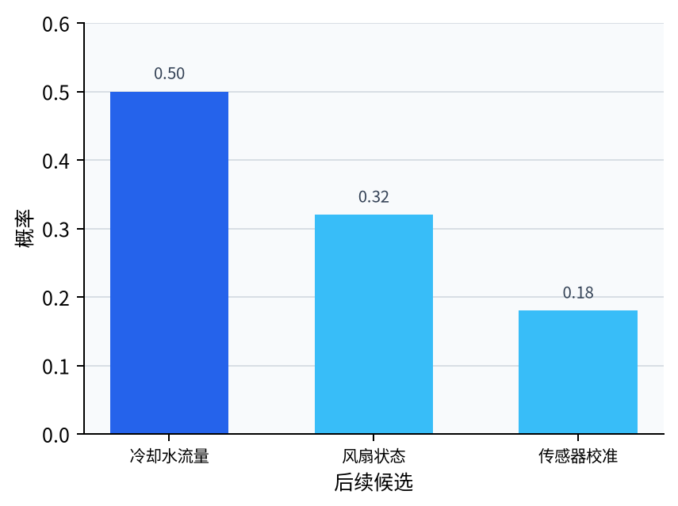
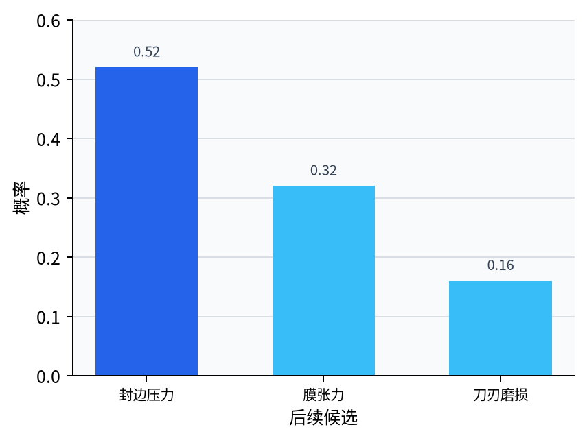

# P5-15.1 生成模型（generative model）学习的是什么

Section ID: `P5-15.1`
Version: `v2026.07.17`

在 P5-14.2 里，我们已经看到：Transformer 在并行处理和长上下文处理上成为了一个大转折点，而这种结构最终也成了 LLM 与生成式 AI 普及的基础。接下来就会自然出现一个问题。

那么，生成模型（generative model）和分类模型到底有什么不同？它实际学习的又是什么？

生成模型不只是学习把输入放进哪个类别里，它还试图学习数据通常以什么模式出现，以及接下来什么内容更有可能自然地继续下去。

当你需要快速重新区分分类与生成时，可以回到英文概念词汇表里的 [generative model](/AiBook/en/reference/concept-glossary/#generative-model) 条目。

## 本节范围

- 生成模型和分类模型有什么不同？
- `学习数据分布（data distribution）` 这句话，应该怎样解释给读者？
- 为什么生成常常会和概率性输出（probabilistic output）连在一起？
- 这种视角又是怎样继续延伸到 LLM 与图像生成模型里的？

本节首先要收住的核心，是`生成模型不会停在挑出正确标签，而是会学习什么样的输出本身是自然的`。

如果先把这一节固定在`候选分布学习`这条轴上，理解会更稳。

也就是说，本章的手柄会从`输入应该归到哪个标签`，转向`可能的后续输出分布应该怎样被学习`。

这里首先要读的，不是 temperature、sampling 之类的输出控制步骤，而是模型到底在学习什么候选分布本身。

| 这一节现在要读的内容 | 交给下一节或后面 Part 去读的内容 |
| --- | --- |
| 生成模型学习了什么模式与候选分布 | 在已经学到的候选里，实际输出是按什么规则被取出来的 |
| 分类问题与生成问题所提出的问题有什么不同 | token 级生成设置和服务质量调节会怎样变化 |

sampling 与输出质量波动，会在紧接着的 P5-15.2 里更具体说明；文本生成里的 next-token prediction 会在 P6-5.1 重新接回。也就是说，这里先收住的是`生成模型到底学习了什么候选分布`。

## 本节目标

- 能把生成模型解释成`学习数据模式，并生成新样本或下一个输出的模型`。
- 能以入门层次比较分类模型与生成模型的差异。
- 能从同一个生成视角，把`下一个 token 预测`和`图像生成`放在一起解释。
- 能通过可运行的 Python 例子，直观确认基于分布的生成感觉。

## 本节的阅读顺序

1. 先比较分类模型与生成模型提出的问题到底有什么不同。
2. 然后用入门层次拆开理解`学习数据分布`这句话的含义。
3. 接着把文本生成和图像生成放到同一个生成视角下来看。
4. 最后整理：为什么生成问题会自然从`学到了什么`继续走向`实际会取出什么`。

## 分类模型和生成模型有什么不同

分类模型（classification model）通常回答的是下面这类问题。

- 这个输入属于哪个类别？
- 是需要立即停机，还是只记录即可？
- 是残余异常，还是稳定恢复？

也就是说，它的中心是把输入映射到某个类别。

相比之下，生成模型更接近下面这类问题。

- 这种数据通常以什么模式出现？
- 这句话后面，什么 token 最可能接着出现？
- 在这种绘图风格里，什么像素模式才自然？

也就是说，生成模型更直接地连接到`创造一个新的输出本身`这个问题。

如果先把这种差异放进表里，可以看成下面这样。

| 视角 | 分类模型 | 生成模型 |
| --- | --- | --- |
| 核心问题 | 它属于什么类别？ | 什么输出是自然的？ |
| 代表性输出 | 标签、分数 | 下一个 token、新句子、新图像 |
| 代表例子 | 警报等级分类、残余异常判断 | 生成运维提示语、事故摘要、设备图像生成 |

如果把同一个场景拆成两种方式来看，差异会更直接。

| 同一个输入场景 | 分类模型先给出的内容 | 生成模型先给出的内容 |
| --- | --- | --- |
| 运维询问 `请告诉我停线后的重启顺序` | `重启流程请求` 这样的询问类型标签 | `请先确认 interlock，再开始低速重启。` 这样的真实回应句子 |
| 检修报告句子 `温度已恢复，但压力波动仍在` | `部分恢复` 或 `残余异常` 这样的状态标签 | 同时包含恢复状态与剩余风险的摘要句 |
| 设备场景照片 | `混合罐` 这样的设备类型标签 | 设备描述语句或替代文本草稿 |

也就是说，分类先决定`把它看成什么`，而生成直接处理`实际该说出什么、创造什么`。

## `学习数据分布` 是什么意思

读者往往会在 `distribution` 这个词上立刻感到困难。这里最好先把它抓成`哪些模式经常一起出现、哪些组合是自然的统计感觉`。

`学习数据分布，指的是模型学会了：什么模式经常出现，什么组合看起来更自然。`

例如在文本里，模型会学习：

- 什么词后面经常跟着什么词
- 什么句子结构更自然

在图像里，它可以学习：

- 什么颜色和形状常常一起出现
- 什么局部结构能组成一个自然的对象

为了让读者能在实际场景里重新抓住这句话，最好至少把`看过很多什么`、`什么会自然地一起出现`、`结果里该先确认什么`分开来看。

| 数据类型 | 模型会大量看到的模式 | 在结果里先要确认什么 |
| --- | --- | --- |
| 运维句子 | 哪些动作短语经常继续出现，哪些警告句式反复出现 | 下一句与提示语气，是否顺着当前警报语境自然延续 |
| 设备图像 | 哪些颜色、轮廓、布局经常一起出现 | 构图与形状是否自然，没有怪异断裂 |
| 现场支援回答 | 每类问题通常会用什么回答长度和结构 | 回答顺序与警告语句位置，是否会随情境合适地改变 |

也就是说，生成模型比起`只把标签答对`，更接近去学习数据模式本身。

## 为什么生成常常和概率性输出连在一起

生成问题往往并不只有一个唯一正确答案。

例如：

- 一句话后面的下一个词未必只有一种可能
- 画一张图也可能有多种自然方式
- 一段摘要也可能有多种自然表达

所以，生成模型经常处理的是`在多个可能输出中，哪一个更可信`。正因为如此，probability、sampling、temperature 这样的概念会自然跟着出现。

`生成常常不是去选唯一正确答案，而是在多个可信候选中决定实际产出哪一个。`

## 为什么 LLM 和图像生成能放到同一个视角里

表面上看，文本生成和图像生成差得很远。但从生成模型视角看，它们有共同点。

- 两者都在学习数据模式
- 两者都在创造新的输出
- 两者都可能和概率性选择或 sampling 连在一起

也就是说，生成式 AI 指的是：在不同数据领域里，去创造可信新输出的模型。

### 文本生成

它通过预测下一个 token 来继续句子。

### 图像生成

它通过逐步构造像素或潜在表示（latent representation）来形成图像。

虽然领域不同，但它们共享同一个视角：`学习模式，然后创造新的结果`。

## 如果把它画得非常简单

```mermaid
--8<-- "assets/part-05/chapter-15/generative-model-flow-zh.mmd"
```

这张图把生成模型压缩到了最宽的层级。

## 案例与示例

| 情况 | 生成模型直接处理的问题 | 实际会变化的输出 |
| --- | --- | --- |
| 生成运维提示语 | 现在后面接什么动作短语更自然？ | 句子选择，以及后续提示语气 |
| 现场支援回答 | 什么回答结构更符合当前设备语境？ | 解释顺序、长度、警告语句位置 |
| 设备图像生成 | 什么视觉组合更可信？ | 构图、色彩、布局、强调对象 |

下面这张图把本节的三个案例重新整理成：它们不是`选一个正确标签的问题`，而是`在多个候选里创造自然输出的问题`。

```mermaid
--8<-- "assets/part-05/chapter-15/generative-task-flow-zh.mmd"
```

### 代表案例：预测下一个词

想一想这样一个场景：要把运维通知句子 `Batch inspection result` 往后接着写。人也会想到几种可能的后续动作短语，比如 `需要重新确认`、`经主管确认后恢复`、`10 分钟后重新测量`，但一开始很容易觉得应该只有一个正确答案。可是真实运维文本里，什么后续短语更自然，会随着警报语境、现场状态、提示语气而变化。比如传感器异常反复出现时，`需要重新确认` 更自然；而如果现场处置已经开始，`经主管确认后恢复` 可能更自然。若只用像分类那样挑一个正确标签的方法，就很难把这种差异装进去。生成模型正是学习了这些候选之间的相对可信度，并把在当前语境里更自然的候选抬到输出前面。

所以，这个案例里要确认的结果是：`Batch inspection result` 后面可能接上的句子，不会只剩一个正确答案，而是会保留成多个后续动作候选；生成模型学到的是它们之间的相对可信度。

同样的视角也会直接延伸到现场支援回答和图像生成。不过，本节真正要抓住的核心不是领域名称，而是`模型学习的不是单个正确答案，而是当前语境里自然输出的整个候选分布`。

| 人容易先看到的标准 | 从生成模型视角重新阅读时的标准 |
| --- | --- |
| 容易觉得找到一个正确答案，解释就结束了 | 真正核心是：各个候选有多可信，这整个分布会一起被学到 |
| 容易觉得只看最可能的一个候选就够了 | 在最高候选后面，其他自然候选也必须一起保留下来，生成直觉才算闭合 |
| 文本生成和图像生成看起来像完全不同的问题 | 虽然领域不同，但它们都共享`学习模式并创造新输出`这种候选分布学习结构 |

把这三个案例放在一起时，生成模型的核心不是`它挑中了一个正确答案`，而是`它学会了当前语境里可能自然成立的整个候选输出空间`。

如果再从运维判断角度把这三个案例拆开，会更直接看出：为什么把生成模型读成`挑一句正确句子`是不够的。

| 案例 | 只寻找一个固定答案时容易留下什么 | 看到候选分布时真正保留下来的是什么 |
| --- | --- | --- |
| 运维提示语生成 | 容易给每类警报反复套一个固定模板 | 即使同一警报下，也会同时保留重新确认、重新测量、主管确认等多个后续短语候选 |
| 现场支援回答 | 容易把一条 SOP 句子当成唯一正确答案 | 会同时保留先释放压力、先查 interlock、先给警告等不同回答结构候选 |
| 设备图像生成 | 容易只在脑中固定一张“正确图片” | 即使同一提示下，也会一起保留阀门强调、警示灯强调、管路布局差异等视觉候选空间 |

如果在这里停一下，短暂固定住`什么时候应该先想起生成视角，而不是只想标签预测`，那么到了下一节 sampling 时，学习阶段和输出阶段就不容易混在一起。

| 先想到的问题 | 为什么必须先从生成模型视角来读 | 紧接着下一节会继续什么 |
| --- | --- | --- |
| 为什么会有多个自然答案，而不是只有一个正确答案？ | 因为生成问题处理的是候选分布本身，而不只是标签选择 | 这些候选里，实际会取出哪一个 |
| 为什么 LLM 和图像生成能放在同一条轴上解释？ | 因为虽然领域不同，但它们都共享“学习模式、创造新输出”的结构 | sampling 与多样性控制 |
| 为什么只靠分类式解释，讲不清运维提示语或现场支援回答？ | 因为输出不是一个类别名，而是真正的句子、图像或组合 | 输出选择步骤和用户体验差异 |

## 练习与例子

这个例子的目标，是确认生成模型怎样把`每种警报之后，什么后续动作短语经常接着出现`学成一个分布。这里还不做真正的 sampling，而是先从运维记录角度固定：当我们说模型“学到了什么”时，到底在指什么。

在读代码前，先把下面三个值一起看住，这一节的问题会更稳。

| 先看的值 | 为什么要先看它 |
| --- | --- |
| `probabilities` | 因为它能显示：生成模型抓住的不是一个标签，而是`后面通常会接什么`的分布 |
| `most_likely` | 因为它能让我们同时看见“最可能的候选是什么”以及“它和整个分布有什么不同” |
| `temperature_alert` 与 `seal_edge_alert` 的差异 | 因为它能确认：即使是同一个生成模型，语境变了，学到的候选分布也会完全不同 |

输入：

- 两种不同的运维警报语境
- 在每种语境下，过去经常接着出现的后续动作短语计数

输出：

- 按警报类型整理出的后续动作概率分布
- 每种警报里最可能的后续动作

问题场景：

- 当我们说生成模型“学到了什么”时，在真实运维记录里，需要先弄清楚：`接下来可能出现的短语分布` 应该怎样被理解

要确认的概念：

- 生成模型学的是候选分布本身，而不是只决定一个候选
- 即使在同一个语境里，也不会只剩一个后续动作，而是会以相对权重形式同时保留多个短语
- 语境变了，最可能的候选和整个分布都会一起变化

在看代码前，先把两个警报语境拆成`只选一个标签的读法`和`保留候选分布的读法`来预测，会更有帮助。

| 语境 | 只按“选一个标签”来读时容易出现的误解 | 从生成模型视角先要预测的变化 |
| --- | --- | --- |
| `temperature_alert` | 容易觉得只要知道“最常见的后续动作”就够了 | 即使第一候选最高，其他检查短语也应一起留在分布里 |
| `seal_edge_alert` | 容易觉得它会产出和前一个警报类似的运维回答 | 语境一变，最高候选和整个候选集合都应一起改变 |
| 两种警报都一样 | 容易觉得一看到 `most_likely`，生成解释就结束了 | 只有把 `probabilities` 一起看，才能说明模型到底学到了什么 |

这里真正要确认的差异也很明确。只抓着 `most_likely` 的读法，很容易最后只剩下`这个警报对应这句话`这样的固定模板；而同时看 `probabilities` 的读法，会保留下来的是：即使同一警报下，也还有哪些检查顺序和警告短语可以一起成为候选。也就是说，生成模型应该被读成是在一起学习`运维回答空间`。

输入：

这里使用前面整理的、按警报类型统计的后续动作记录次数。

```python
history = {
    "temperature_alert": {
        "先检查冷却水流量。": 14,
        "确认热交换器风扇状态。": 9,
        "重新查看传感器校准。": 5,
    },
    "seal_edge_alert": {
        "重新调整封边压力。": 13,
        "重新校准薄膜张力。": 8,
        "确认刀刃磨损状态。": 4,
    },
}

for case, counts in history.items():
    total = sum(counts.values())
    probabilities = {text: round(count / total, 2) for text, count in counts.items()}
    ranked = sorted(probabilities.items(), key=lambda item: (-item[1], item[0]))
    print(case)
    print("probabilities =", probabilities)
    print("most_likely =", ranked[0])
```

输出里，只要确认：在每个语境下，留下来的不只是一个答案，而是整个`接下来可能继续出现的后续动作分布`。

```text
temperature_alert
probabilities = {'先检查冷却水流量。': 0.5, '确认热交换器风扇状态。': 0.32, '重新查看传感器校准。': 0.18}
most_likely = ('先检查冷却水流量。', 0.5)
seal_edge_alert
probabilities = {'重新调整封边压力。': 0.52, '重新校准薄膜张力。': 0.32, '确认刀刃磨损状态。': 0.16}
most_likely = ('重新调整封边压力。', 0.52)
```

第一个结果，是温度警报语境里的候选分布。`先检查冷却水流量` 最高，但 `检查风扇状态` 与 `重新查看传感器校准` 也仍然留在候选空间里。



第二个结果，是封边警报语境里的候选分布。这里真正要看的，是语境一变，不只是最高候选会变，留下来的候选集合本身也会一起变化。



| 先看的输出 | 这个输出表示什么 | 改动它时会看到什么变化 |
| --- | --- | --- |
| `temperature_alert` 的 `probabilities` | 表示在温度警报语境里，`检查冷却水流量` 最常接着出现，但其他动作也一起保留在分布里 | 如果改动记录比重，最可能动作和分布宽度会一起变化 |
| `seal_edge_alert` 的 `probabilities` | 表示在封边警报里，中心会变成一套完全不同的后续动作集合 | 如果继续增加更多语境类型，会更清楚看到生成模型会按语境学习不同短语分布 |
| 每个语境的 `most_likely` | 表示除了整个分布之外，我们也能单独读出一个最高概率候选 | 如果只盯住一个候选来读，就会漏掉它后面仍然保留着的其他候选可能性 |

| 运维回答设计标准 | 只看 `most_likely` 时容易做出的判断 | 把 `probabilities` 一起读进去后会改变的判断 |
| --- | --- | --- |
| 温度警报提示语 | 容易只输出 `先检查冷却水流量` 这一条固定回应 | 会倾向于把 `检查风扇状态`、`重新查看传感器校准` 也保留成后续候选，并根据情境补到后面 |
| 封边警报提示语 | 容易觉得可以沿用和前一个警报相似的检查短语 | 会倾向于维持一套完全不同的候选集合，比如封边压力、膜张力、刀刃磨损 |

如果把这种差异更直接翻译成运维提示语设计决策，它就会变成：`要不要立刻把一个最可能候选锁成固定模板`，还是`保留候选空间，再根据情境调整后续句子和警告位置`之间的差异。

| 示例语境 | 只抓住 `most_likely` 时较不危险的读法 | 只抓住 `most_likely` 时更危险的读法 | 同时把 `probabilities` 读进去后更安全的下一步判断 |
| --- | --- | --- | --- |
| `temperature_alert` | 可以把 `检查冷却水流量` 放在第一句，然后先停在那里 | 可能把风扇状态和传感器复核候选全部丢掉，把后续检查顺序冻结成一个模板 | 以冷却水流量检查开头，但同时保留风扇状态和传感器复核作为后续句子候选，再按情境调整提示语 |
| `seal_edge_alert` | 可以把 `重新调整封边压力` 作为默认动作 | 若沿用类似温度警报的回应语气，可能会太晚才附上膜张力和刀刃磨损检查，甚至遗漏 | 先把封边压力调整放在第一候选，但同时保留膜张力与刀刃磨损在同一候选空间里，让其他设备原因也能立刻接上 |

- 生成模型不会把`接下来是什么`背成一句固定句子，而是会把`在这个语境里，什么内容出现过多少次`整理成一个分布。
- 即使存在一个最可能候选，其他候选也仍会一起留在它后面。
- 因此，如果只看 `most_likely`，生成很容易被误读成分类；只有把 `probabilities` 一起看，生成模型学到的候选空间才会显现出来。
- 只有看到这个差异，我们才会把生成问题读成`学习候选分布`，而不是`挑一个正确标签`。

如果把它翻译成一个运维支援系统，那么只看 `most_likely` 的系统，很容易被读成“每种警报都重复一条固定短语”的模板；而同时看 `probabilities` 的系统，则更接近一种结构：即使是同一警报，也能把检查顺序、警告语句、后续提示语组合成多个候选集合。生成模型学习到的，正是这种`候选回答空间`；而在真正输出阶段，这个空间被收窄多少、保留多少，会在下一节的 sampling 里再次决定。

这个例子最好不要看过就停，而是继续顺手检查：改变哪些值，可以让“候选分布”的感觉更明显。

| 先看到的输出信号 | 现在马上可以尝试的变化 | 不应只凭这个例子就仓促下结论的事 |
| --- | --- | --- |
| 温度警报里，一个候选以 0.5 最高 | 增减第一候选的记录次数，观察最可能动作会多快改变 | 不要因为存在最高候选，就断言生成已经是决定性的 |
| 封边警报里，三个候选一起保留着 | 继续增加或删去候选，看看分布宽度如何变化 | 不要因为保留了多个候选，就立刻断言运维质量一定更好 |
| 语境一变，整个分布都会变 | 再加入新的警报类型，看看短语分布如何继续分裂 | 不要只凭这两个简单运维例子，就立刻泛化到整个大规模生成模型学习 |

## 检查清单

- 能解释生成模型（generative model）处理的是不同于分类模型的问题吗？
- 能说清“生成模型学习了什么输出是自然的”这句话吗？
- 能解释生成模型是学习数据模式并产生新样本或下一个输出的模型吗？
- 能说明分类模型在选类别，而生成模型在创造输出本身吗？
- 能解释为什么生成问题常会和概率性输出联系在一起，因为它往往有多个可信答案吗？
- 能否不只把生成模型说成“会产出东西的模型”，而是解释成“学习什么输出自然的候选分布的模型”？
- 能否通过案例区分：同一个输入场景里，分类先给什么，生成先给什么？
- 在阅读下一节 sampling 时，是否已经准备好先区分`学到了什么`与`实际会取出什么`？

## 出处与参考资料

- Ian Goodfellow, Yoshua Bengio, Aaron Courville, `Deep Learning`, MIT Press, 2016，确认日期：2026-06-29。[https://www.deeplearningbook.org/](https://www.deeplearningbook.org/){: target="_blank" rel="noopener noreferrer" }
- Diederik P. Kingma, Max Welling, `Auto-Encoding Variational Bayes`, ICLR 2014，确认日期：2026-06-29。
- Ian J. Goodfellow et al., `Generative Adversarial Nets`, NeurIPS 2014，确认日期：2026-06-29。
