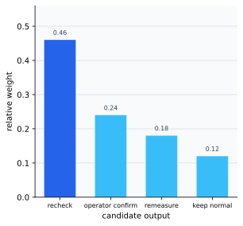
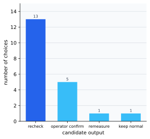

# P5-15.2 Generation And Sampling

> Section ID: `P5-15.2`
> Version: `v2026.07.19`

In P5-15.1, we saw that, unlike a classification model, a generative model learns data patterns and tries to create a new output itself. The next question naturally follows.

If a generative model can produce several plausible answers, how does it actually choose one answer?

Sampling is the process by which the model takes out one actual output at a time from several candidates it judged plausible, and this method directly affects the diversity and stability of the result.

When the model’s scores and the actual output choice need to be separated again, reread the glossary entry on [sampling](../../../reference/concept-glossary.md#sampling).

## Scope Of This Section

- Why can the output of a generative model fail to stay fixed as only one result?
- How can sampling be explained as what it does?
- What relationship do probability distribution and output diversity have?
- Why can even the same model feel different depending on the sampling method?

The core point to hold first in this section is that `the quality of a generative model depends not only on what it learned, but also very strongly on which candidates it actually samples`. Therefore, here we first read not the learning structure of what distribution the model learned, but the procedure by which actual outputs are pulled out from already calculated candidates.

| What is read in this section now | What is read more in later Parts |
| --- | --- |
| after the candidate distribution is calculated, by what feel the actual output is chosen | how top-k, top-p, and temperature are handled in more detail as product-setting language |
| why the choice between diversity and stability changes the result | comparisons of diffusion sampling implementation and detailed search algorithms |

The detailed differences of beam search, top-k, top-p, and temperature are made concrete again in P6-5.2. That is, here we first close `after the candidate distribution is calculated, by what feel the actual output is sampled` and `why the balance between diversity and stability changes the result`.

What must actually be closed here is that `sampling is not a simple option, but part of the generative problem itself`. Even if the detailed setting names are seen again in later Parts, within the current section the reader still has to hold to the end that `the stage of calculating the candidate distribution` and `the stage of selecting the actual output` are different, and that output quality depends on both.

## Goals Of This Section

- You can explain sampling as `the procedure that selects an actual output from among several candidates`.
- You can say why a generative result does not always have to stay the same.
- You can read generative results through the viewpoint of a balance between diversity and stability.
- You can understand in advance why later concepts such as token, next-token prediction, and temperature become necessary.

## The Reading Order Of This Section

1. First confirm why generative output does not have to stay fixed as only one answer.
2. Then read sampling as `the procedure that chooses an actual output among candidates`.
3. Next see why the balance between diversity and stability matters.
4. Finally organize why this concept makes us separate `model score calculation` from `actual output selection`.

## Why Might Generative Output Not Stay Fixed To One Result

In classification problems, there are many situations where one simply chooses the class with the highest score. But generation is different.

For example, consider the beginning of an operation-notice sentence.

- `Batch inspection result`

After this, several follow-up phrases can continue naturally, such as `reverification is required`, `resume after supervisor confirmation`, `remeasure in 10 minutes`, or `for now it remains normal by the current standard`.

That is, a generative problem may from the beginning not be `a problem that has only one correct answer`.

So a generative model usually calculates the relative plausibility of several candidates, and then needs a stage that chooses the actual output among them.

If P5-15.1 was the section explaining `what does the generative model learn`, this section explains the next stage, `among the candidates so calculated, how is the actual output sampled`.

## What Does Sampling Do

The core of sampling is that it is a selection procedure that prioritizes higher candidates while still leaving room for other candidates to become actual outputs too.

`Sampling is the procedure that lets the model choose candidates it judged more plausible more often, while still allowing other candidates to become the actual output in some cases.`

That is, sampling deals with the problem between the following two extremes.

- a method that always chooses only the highest candidate
- a method that mixes possible candidates too randomly

In generative AI, the balance between these two is important.

At the introductory stage, it is enough if we distinguish only the following three methods.

| Method | Intuition to hold first |
| --- | --- |
| argmax | always chooses only the highest candidate |
| sampling | chooses higher candidates more often but allows other candidates too |
| temperature adjustment | makes the candidate distribution be read more conservatively or more diversely |

This difference becomes clearer when we place side by side the candidate distribution and the actual choice frequency. First, if we look at how much weight the model gives to each candidate, one highest candidate clearly exists, but the other candidates are not all zero either.



Then, if we look at the choice frequency when actually sampling 20 times, the highest candidate appears most often, but the lower candidates do not disappear completely and can still remain as some of the results.



The key point in this graph is that sampling is not `picking anything at random`. It should be read as a selection procedure that samples actual outputs based on the weights the model gave to each candidate, but does not fix only one candidate as argmax does.

## Why Must Diversity And Stability Be Seen Together

If sampling is not used at all and only the highest candidate is repeatedly chosen, the output can look stable. But the result can also feel too monotonous or repetitive.

Conversely, if candidates are allowed too broadly, output diversity can increase, but the sentence can suddenly become unnatural or the meaning can start to drift.

`Generative quality is not only a question of correctness, but also a question of balance between diversity and stability.`

## In What Situations Do We First Look At Which Balance

When reading sampling, it is safer to first ask not `always more diverse` or `always more conservative`, but `what should be prioritized more right now`.

| Situation | Standard looked at first | Choice feel to recall first |
| --- | --- | --- |
| inspection-result guidance phrase | repeatability, minimizing instability | choosing mainly the highest-probability candidates |
| explanatory field-support response | correctness, structural stability | relatively conservative sampling |
| operation-message drafts, response-message variants | breadth of candidates, expression diversity | allowing more diverse candidates |
| image concept exploration | scene variation, style range | allowing broader sampling |

That is, sampling is safer to read not only as `a device that increases fun`, but as a choice that decides which side to prioritize more between consistency and diversity of the output.

## Why Can Even The Same Model Produce Different Results

Even for the same model, the result can change if the following conditions change.

- up to which candidates are left
- how sharply the probability distribution is read
- whether only the highest candidate is chosen, or several candidates are allowed

Because of this, users often feel that `the model changed`, but sometimes what actually changed was only the output-selection strategy.

This viewpoint becomes very important later when reading token-level generation and prompt experiments.

## If We Draw The Flow Very Simply

```mermaid
--8<-- "assets/part-05/chapter-15/sampling-selection-flow-en.mmd"
```

The result to confirm in this diagram is that the stage that calculates `model scores` and the stage that decides which candidate to sample as the actual output are different from one another.

Even when the same candidate scores are given, the user experience can change immediately depending on the final selection rule.

| The same prefix and candidate scores | Result that appears first when only the highest candidate is chosen | Result that appears first when several candidates are allowed |
| --- | --- | --- |
| after `Batch inspection result`, all of `reverification is required`, `resume after supervisor confirmation`, and `remeasure in 10 minutes` are possible | it becomes easy to repeat only one most conservative sentence | the inspection context can remain while the action phrasing and sentence length vary a little |
| a field-support response explains `restart order after shutdown due to pressure anomaly` | it becomes easy to repeat only the same step sentence every time | the core safety procedure can remain while the position of warning phrases and the explanation length vary |
| an image is generated from the prompt `stainless mixing tank with side valve and warning beacon` | similar tank composition and warning-beacon placement can repeat too much | the core equipment scene can remain while the lighting, viewpoint, and pipe placement vary |

That is, `which candidate the model judged highly` and `which one was actually sampled as the output` are not the same problem.

## Cases And Examples

The diagram below regroups the three cases of this section through the common question `among several candidates, which one should actually be chosen as the output`, rather than `what is the correct answer`.

```mermaid
--8<-- "assets/part-05/chapter-15/sampling-task-flow-en.mmd"
```

### Representative Case. Inspection-Result Guidance Phrase

`Batch inspection result`

People usually first think of `one most reasonable response phrase`. So it is easy to think that guidance-phrase generation also only needs to choose the one highest candidate. But in real operation sentences, several candidates such as `reverification is required`, `resume after supervisor confirmation`, and `remeasure in 10 minutes` can all be natural, and which one fits better can change depending on the inspection state. For example, if an alert is repeated, `reverification is required` sounds natural, while if field action has already begun, `resume after supervisor confirmation` may sound more natural. If we always choose only the highest candidate, the guidance phrase becomes fixed in the same tone every time. Conversely, if candidates are allowed too broadly, even action phrases less suited to the field context can jump out. Sampling is the stage that controls which candidate will actually be sampled between those extremes.

So the result to confirm in this case is that, even while the prefix `Batch inspection result` stays the same, the actual guidance phrase can vary slightly depending on the operational situation, and sampling is exactly the stage that controls that width of choice.

The same viewpoint extends directly to field-support responses and image-generation prompts. But the core point to hold in this section is not the domain name, but `whether, given the same candidate distribution, the actual output that is sampled changes the width of variation in the result`.

| Case | Candidates the model can hold | What happens if we choose too narrowly | Result to confirm when broader allowance is used |
| --- | --- | --- | --- |
| inspection-result guidance phrase | response candidates such as `reverification is required`, `resume after supervisor confirmation`, and `remeasure in 10 minutes` | the same action phrase repeats every time | does variation appear in the response phrasing while the operational context is still kept? |
| field-support response | short step-type, warning-first, explanation-expanded answer candidates | the same length and structure repeat every time | does the format of the explanation vary while the core safety procedure is still kept? |
| image generation | tank angle, pipe layout, warning-beacon emphasis, viewpoint candidates | the resulting scene becomes too similar every time | does scene variation appear while the core prompt is still preserved? |

| Standard that is easy for a person to see first | Standard to reread from the sampling viewpoint |
| --- | --- |
| it is easy to feel that the one candidate given the highest score by the model immediately becomes the final output | score calculation and actual selection are different stages, so even with the same distribution the result changes depending on what selection rule is used |
| if the result changes every time, it is easy to feel only that the model is unstable | it may be the result of allowing different choices inside the candidate distribution, so diversity and stability must be seen together |
| it is easy to understand sampling as simply adding randomness | the actual core is that it sets how strongly to prioritize the high candidates while allowing other candidates within some range |

If we place the three cases together, the core of sampling does not lie in re-explaining `what the model learned`, but in adjusting `which candidate among several will actually be sampled as the output` to fit the operation context.

If we pause once here and briefly fix `when the explanation that the model learned a candidate distribution is not enough, and the actual output-selection procedure needs to be pulled out separately`, then the later discussion of temperature, top-k, and top-p feels less sudden.

| Question to recall first | Why the sampling viewpoint is needed first | What continues in later Parts |
| --- | --- | --- |
| why can even the same model produce slightly different results each time? | because, apart from the learned candidate distribution, a separate procedure exists that samples the actual output | temperature, top-k, and top-p adjustment |
| why should we not always choose only the highest-score candidate? | because stability rises, but expression diversity and situational fit can shrink too much | product settings and user-experience control |
| why is output quality not only a model problem? | because what has been learned and what has actually been chosen together create the result | response style, length, and variation-width design |

## Practice And Example

The goal of this example is to confirm the difference between `always choosing only the highest candidate` and `sampling several candidates into actual sentences according to probability`, in an operational scene where inspection-result guidance phrases are automatically generated.

Before reading the example, it helps to fix first the minimum points that actually need to be confirmed in this section.

| Point to confirm | Value to look at directly in the example | Why it matters |
| --- | --- | --- |
| what the one highest candidate is | `argmax_choice` and `argmax_sentences` | shows how monotonous the operational message becomes if one conservative phrase is fixed |
| where argmax and sampling split | `argmax_sentences` and `sampled_sentences` | shows that even in the same inspection situation, several practical guidance variants can appear |
| how often each response phrase is chosen | `counts` | lets us confirm whether sampling chooses the high-probability phrase more often while still leaving other action phrases in the actual output |
| how result length and action range change | `avg_length` and the varied candidate sentences | lets us read that the balance between diversity and stability changes not only sentence length, but also the width of operational action |

Input:

- the same inspection-result guidance prefix
- four candidate operational guidance phrases that can follow it
- the relative weights of those candidates

Output:

- guidance sentences fixed by the argmax method
- guidance sentences generated several times by the sampling method
- the frequency of which response phrase was chosen how many times
- the average length of the result sentences

Problem situation:

- argmax and sampling can create different kinds of operational-message diversity even from the same set of candidates

Concepts to confirm:

- argmax fixes the highest response phrase
- sampling makes several response phrases appear as actual outputs according to the probability distribution

Before looking at the code, it helps to predict first where argmax and sampling will split, even under the same set of candidates.

| Comparison point | Result to predict first in argmax | Result to predict first in sampling |
| --- | --- | --- |
| `argmax_sentences` / `sampled_sentences` | the same sentence is likely to repeat | even if the highest candidate dominates, other response phrases can still mix into the actual sentences |
| `counts` | it will effectively become a reading centered on almost one candidate | the high-probability candidate will dominate, but lower candidates can still remain a small number of times |
| `average_sampled_length` | it is easy to feel that length variation will hardly exist | depending on the length of the chosen phrases, the average length can also shake together |

Input:

We use the inspection-result guidance prefix and response-candidate list summarized above, but this time we vary `response_weights` in three ways. This makes the example a small experiment that checks how the sampling width changes when the same candidates are read with sharper or flatter weights.

```python
# This example compares how argmax and sampling create different output diversity, choice counts, and average sentence length from the same response candidates and weights.
import random

inspection_prefix = "Batch inspection result"
response_candidates = [
    "Reverification is required.",
    "Resume after supervisor confirmation.",
    "Remeasure in 10 minutes.",
    "For now it remains normal by the current standard.",
]

experiments = {
    "base": [0.46, 0.24, 0.18, 0.12],
    "sharper": [0.65, 0.18, 0.11, 0.06],
    "flatter": [0.30, 0.27, 0.23, 0.20],
}

def run_sampling(label, weights, seed=7, draws=20):
    rng = random.Random(seed)
    argmax_choice = response_candidates[weights.index(max(weights))]
    sampled_choices = rng.choices(response_candidates, weights=weights, k=draws)
    counts = {
        candidate: sampled_choices.count(candidate)
        for candidate in response_candidates
    }
    sampled_sentences = [
        f"{inspection_prefix} {choice}"
        for choice in sampled_choices
    ]
    avg_length = sum(len(sentence) for sentence in sampled_sentences) / draws
    unique_choices = sum(1 for count in counts.values() if count > 0)

    print(f"[{label}]")
    print("weights =", weights)
    print("argmax_choice =", argmax_choice)
    print("counts =", counts)
    print("unique_choices =", unique_choices)
    print("average_sampled_length =", round(avg_length, 1))
    print()

for label, weights in experiments.items():
    run_sampling(label, weights)
```

| Output to look at first | What this output means | What changes if you vary it |
| --- | --- | --- |
| `counts` | shows how often each phrase is actually selected in each weight scenario | in `sharper`, selection concentrates more on the highest candidate; in `flatter`, lower candidates can appear more often |
| `unique_choices` | shows how many different phrases appeared across 20 generations | a larger value means wider variation, but the stability of the operation message still needs to be checked separately |
| `average_sampled_length` | shows how the density of the resulting sentence changes with the lengths of the selected candidate phrases | if the weight of a longer candidate increases, average length and explanation density change together |

- the argmax method chooses only `Reverification is required.`, so the most conservative response is consistent but the width of operational expression is extremely narrow
- the sampling method can still choose `Reverification is required.` most often, but as the weights become flatter, other action phrases such as `Resume after supervisor confirmation.` and `Remeasure in 10 minutes.` can remain in the actual outputs more often
- if we look at the frequency and the average length together, it becomes clear that sampling changes not only `which response appears how often`, but also `the density of explanation and the width of action choice`
- therefore, unless we separate `the stage that calculated response_weights` from `the procedure that actually sampled the sentence`, it becomes difficult to explain why the result experience changes even under the same model

This result should not stop only at `they are different`. It is better if it continues directly into checking what values change the balance between diversity and stability.

| Output signal seen first | Change to try right now | Conclusion not to rush to from this example alone |
| --- | --- | --- |
| `argmax_sentences` are all the same sentence | raise or lower the highest candidate weight and see how quickly the conservative message becomes fixed | do not conclude that argmax is always bad |
| in `counts`, the reverification phrase appears most often but other responses also remain | make `response_weights` flatter or sharper and see how the width of responses changes | do not conclude that sampling automatically gives better quality |
| `average_sampled_length` can also change | add or remove a longer guidance phrase and see how explanatory density and repetitiveness change together | do not jump to the conclusion that a longer answer is automatically a better one |

If we go one step further here, it is better to read the example as `a sampling sensitivity experiment`.

| Value to change first | What we get to see shaking | Result to confirm first in this section |
| --- | --- | --- |
| raise the highest candidate weight from 0.46 to 0.65 | how much argmax and sampling become more similar | does the reverification-centered message become more repetitive while the width of variation shrinks? |
| make `response_weights` flatter | how much more often lower candidates appear as actual guidance phrases | does the `counts` distribution widen and the action range change with it? |
| add a longer explanatory follow-up action among the candidates | whether not only expression diversity but also explanation density changes together | does it become clearer that sampling also shakes length distribution and operational-message density? |

That is, the example in this section should not remain only at confirming `argmax and sampling are different`, but should also let us directly see `if the candidate distribution is shaken, how do the operational message and the follow-up action phrasing change`.

Language models usually calculate the plausibility of the next token, and image-generation models gradually construct possible visual patterns. At that point, the actual output appears by going through the calculated distribution and the selection strategy.

- token and tokenization
- next-token prediction
- generation settings such as temperature, top-k, and top-p
- why output changes according to the prompt

## Checklist

- Can you explain that sampling is the process that chooses the actual output among learned candidates?
- Can you explain how the choice between diversity and stability affects the result?
- Can you explain that the generative model calculates the plausibility of candidates, and sampling chooses the actual output among them?
- Can you say that a generative problem may not be one that has only one correct answer?
- Can you explain that the balance between diversity and stability is important in generative quality?
- Can you explain sampling not only as `adding randomness`, but as `the procedure that selects the actual output from the candidate distribution`?
- Can you distinguish argmax and sampling as `fix only the highest candidate` versus `choose high candidates more often but still allow other candidates`?
- When reading the generation settings in later Parts, are you ready first to see `model score calculation` and `actual output selection` as different stages?

## Sources And References

- Ian Goodfellow, Yoshua Bengio, Aaron Courville, `Deep Learning`, MIT Press, 2016, checked on 2026-06-29. [https://www.deeplearningbook.org/](https://www.deeplearningbook.org/){: target="_blank" rel="noopener noreferrer" }
- Christopher D. Manning, Hinrich Schutze, `Foundations of Statistical Natural Language Processing`, MIT Press, 1999, checked on 2026-07-19. [https://mitpress.mit.edu/9780262133609/foundations-of-statistical-natural-language-processing/](https://mitpress.mit.edu/9780262133609/foundations-of-statistical-natural-language-processing/){: target="_blank" rel="noopener noreferrer" }
- Daniel Jurafsky, James H. Martin, `Speech and Language Processing` draft materials, checked on 2026-07-19. [https://web.stanford.edu/~jurafsky/slp3/](https://web.stanford.edu/~jurafsky/slp3/){: target="_blank" rel="noopener noreferrer" }
