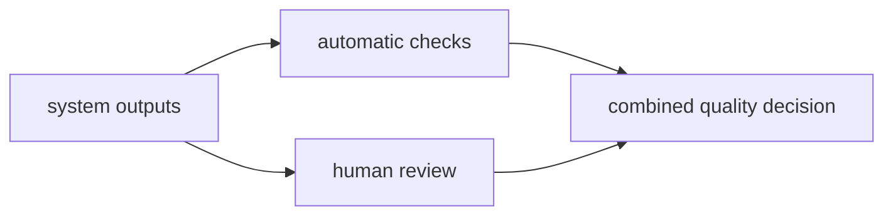

# P5-15.2 자동 평가와 사람 평가

P5-15.1에서는 LLM 평가가 정확성, 유용성, 안전성, 근거성 같은 여러 축을 함께 보는 문제라는 점을 보았습니다. 그러면 이제 다음 질문이 자연스럽게 이어집니다.

이 평가를 자동으로 할 수 있다면 사람 검토는 왜 여전히 필요한가?

이 절은 그 질문에 답합니다.

자동 평가는 빠르고 반복 가능하지만, 사람 평가는 맥락과 품질 감각을 더 잘 본다. 실제 운영에서는 둘을 함께 쓰는 경우가 많다.

## 이 절의 범위

이 절은 다음 질문에 답합니다.

- 자동 평가는 무엇에 강한가?
- 사람 평가는 무엇에 여전히 필요한가?
- 왜 둘을 섞어 쓰는 구조가 자주 등장하는가?

이 절에서는 다음 내용을 깊게 다루지 않습니다.

- 평가 모델(judge model) 설계 세부
- 통계적 샘플링 전략 세부
- 조직별 QA 프로세스 전체

이 절에서는 평가 층의 역할 분담만 다루고, 운영 안에서 어떤 실패를 다시 추적해야 하는지는 P5-16.1과 P5-16.2에서 다시 회수합니다. judge model 설계와 조직별 QA 프로세스의 세부 운영은 현재 본편 범위 밖으로 둡니다.

이 절의 목적은 자동 평가와 사람 평가를 경쟁 관계로만 보지 않고, `서로 다른 장단점을 가진 평가 층`으로 설명하는 데 있습니다.

## 이 절의 목표

- 자동 평가와 사람 평가의 차이를 설명할 수 있습니다.
- 반복 가능성과 맥락 판단의 차이를 말할 수 있습니다.
- 운영에서 왜 두 방식을 섞는지 설명할 수 있습니다.
- 다음 장의 서비스 제약과 운영 문제로 자연스럽게 넘어갈 수 있습니다.

## 자동 평가는 무엇에 강한가

자동 평가는 보통 다음에 강합니다.

- 빠른 반복
- 많은 샘플 비교
- 회귀(regression) 탐지
- 형식 검사
- 기준이 명확한 항목 점검

예를 들어:

- JSON 형식이 맞는가
- 필수 필드가 있는가
- 검색 문서 출처가 붙었는가
- 이전 버전보다 특정 점수가 나빠졌는가

같은 것은 자동화하기 좋습니다.

다음처럼 기억하면 좋습니다.

`자동 평가는 반복과 비교에 강하다.`

## 사람 평가는 무엇에 강한가

사람 평가는 보통 다음에 강합니다.

- 맥락 이해
- 미묘한 품질 차이 판단
- 표현의 어색함 감지
- 실제 업무 적합성 판단
- 사회적 위험과 오해 가능성 판단

예를 들어:

- 답이 형식상 맞지만 실제로는 오해를 만든다
- 설명은 유창하지만 독자 수준에 맞지 않는다
- 근거는 있지만 표현이 지나치게 단정적이다

같은 것은 자동 평가만으로 놓치기 쉽습니다.

다음처럼 기억하면 좋습니다.

`사람 평가는 맥락과 뉘앙스를 더 잘 본다.`

## 왜 자동 평가만으로는 부족한가

자동 평가는 기준을 명확히 세운 항목에는 강하지만, 모든 품질을 완전히 대체하기는 어렵습니다.

예를 들어 자동 평가는:

- 문서에 특정 키워드가 있는지
- 형식 제약을 지켰는지
- 일부 점수 기준을 넘었는지

는 잘 볼 수 있지만,

- 실제로 믿고 쓸 만한 답인지
- 사용자에게 오해를 줄 표현인지
- 조직의 실제 목적에 맞는지

까지는 한계가 있습니다.

## 왜 사람 평가만으로도 부족한가

반대로 사람 평가만으로 가면 다음 문제가 생깁니다.

- 속도가 느림
- 비용이 큼
- 평가자마다 기준이 흔들릴 수 있음
- 자주 반복하기 어려움

즉, 사람 평가는 깊이가 있지만, 운영 규모가 커질수록 자동화 없이 버티기 어렵습니다.

## 왜 둘을 함께 쓰나

실무에서는 보통 다음처럼 섞습니다.

- 자동 평가로 대량 회귀와 형식 오류를 먼저 잡고
- 사람 평가로 중요한 샘플과 미묘한 품질 문제를 확인하고
- 필요하면 다시 자동 기준을 보강합니다

즉, 자동 평가와 사람 평가는 대체 관계라기보다 분업 관계에 가깝습니다.

## 아주 단순하게 그리면



이 도식의 핵심은 실제 품질 판단이 한 경로로만 끝나지 않는다는 점입니다.

## 사례로 보기

### 사례 1. RAG 답변 평가

RAG 답변에 출처 링크와 인용 구간이 모두 붙어 있다고 해 봅시다. 사람은 링크와 형식이 잘 붙어 있으면 우선 `근거가 있네`라고 느끼기 쉽습니다. 자동 점검은 `출처가 있는가`, `형식이 맞는가`를 빠르게 확인할 수 있지만, 링크가 있다고 해서 답이 실제 문서 뜻을 제대로 반영한 것은 아닙니다. 예를 들어 문서에는 예외 조항이 있는데 답변이 본문 한 줄만 보고 단정했을 수 있습니다. 이런 해석 오류는 사람이 문서와 답을 같이 읽어 봐야 드러납니다. 그래서 이 장면은 자동 평가는 형식과 기본 누락을 잡고, 사람 평가는 근거 해석의 적절성을 본다는 차이를 잘 보여 줍니다.

### 사례 2. 에이전트 실행 평가

에이전트가 목표를 달성했더라도 도구를 열두 번 호출하고 그중 다섯 번을 실패했다고 해 봅시다. 사람은 최종 결과가 있으면 일단 성공처럼 느끼기 쉽습니다. 자동 평가는 이런 호출 횟수, 실패율, 평균 시간 같은 수치를 바로 계산해 줄 수 있습니다. 하지만 숫자만으로는 `정말 이런 복잡한 경로가 필요했는가`, `중간에 더 단순한 계획으로 갈 수 있었는가`를 판단하기 어렵습니다. 이 부분은 사람이 실행 흐름을 보고 과도한 우회나 불필요한 재시도를 읽어야 합니다. 그래서 에이전트 평가는 자동 수치와 사람의 실행 흐름 해석이 함께 있어야 균형이 맞습니다.

### 사례 3. 고객 지원 답변

고객 지원 답변이 응답 시간도 빠르고 금지 표현도 없으며 형식도 지켰다고 해 봅시다. 사람은 자동 평가가 다 통과했으면 거의 충분하다고 느끼기 쉽습니다. 하지만 실제 문장이 지나치게 차갑거나 책임을 고객에게 돌리는 듯 읽히면 서비스 품질은 나빠질 수 있습니다. 반대로 문장은 공손해도 핵심 안내 순서가 어색해 고객이 다음 행동을 헷갈릴 수 있습니다. 이런 문제는 형식 검사만으로는 잘 드러나지 않고 사람이 읽어야 보입니다. 그래서 고객 지원 장면에서는 자동 평가는 기본 안전선이고, 사람 평가는 실제 오해 가능성과 말투 품질을 확인하는 역할을 맡습니다.

## 작은 Python 예제로 보기

이번 예제의 목표는 자동 평가와 사람 평가가 서로 다른 역할을 가진다는 점을 감각적으로 보는 것입니다.

입력:

- 하나의 출력

출력:

- 자동 평가 항목
- 사람 평가 항목

```python
output = "환불 정책은 14일입니다. 자세한 내용은 공지를 참고하세요."

automatic_checks = ["has_source_hint", "format_ok", "length_ok"]
human_checks = ["is_the_tone_clear", "is_the_summary_misleading", "is_it_actually_helpful"]

print("output =", output)
print("automatic_checks =", automatic_checks)
print("human_checks =", human_checks)
```

실행 결과 예시는 다음처럼 읽을 수 있습니다.

```text
output = 환불 정책은 14일입니다. 자세한 내용은 공지를 참고하세요.
automatic_checks = ['has_source_hint', 'format_ok', 'length_ok']
human_checks = ['is_the_tone_clear', 'is_the_summary_misleading', 'is_it_actually_helpful']
```

이 예제는 자동 평가와 사람 평가가 같은 일을 하는 것이 아니라, 서로 다른 질문을 던진다는 점을 보여 줍니다.

## 역사와 커리큘럼 관점

생성형 AI가 실제 서비스에 들어오면서, 사람들은 곧 두 가지를 동시에 원하게 되었습니다.

- 빠르게 많은 결과를 점검할 것
- 중요한 오류는 사람 눈으로 놓치지 않을 것

이 때문에 evaluation은 점점 `자동화된 점검`과 `사람 검토`의 혼합 구조로 발전했습니다.

커리큘럼 관점에서 이 절이 중요한 이유는 다음과 같습니다.

- 평가를 단순 점수표가 아니라 운영 프로세스로 보게 하고
- 다음 장의 비용, 지연 시간, 실패 대응 문제와 연결하며
- Part 6 프로젝트에서 최소한의 검증 절차를 설계하게 만들기 때문입니다

## 다음 장과의 연결

여기까지 오면 다음 질문이 남습니다.

- 품질만 좋으면 충분한가?
- 실제 서비스에서는 비용, 지연 시간, 사용량 제한, 실패 대응을 어떻게 같이 봐야 하는가?

이 질문은 P5-16.1 서비스 운영 제약으로 이어집니다.

## 이 절에서 기억할 관점

- 자동 평가는 반복과 비교에 강합니다.
- 사람 평가는 맥락과 미묘한 품질 판단에 강합니다.
- 실제 운영에서는 두 방식을 함께 쓰는 경우가 많습니다.
- 평가는 기술 문제가 아니라 운영 프로세스 문제이기도 합니다.

## 체크리스트

- 자동 평가와 사람 평가의 차이를 설명할 수 있는가?
- 왜 자동 평가만으로 부족한지 말할 수 있는가?
- 왜 사람 평가만으로도 운영이 어려운지 설명할 수 있는가?
- 왜 다음 장에서 서비스 제약을 다뤄야 하는지 말할 수 있는가?

## 출처와 참고 자료

- OpenAI, evaluation 관련 공식 문서, 확인 날짜: 2026-06-29.
- 관련 LLM evaluation 운영 자료, 확인 날짜: 2026-06-29.
- RAG 및 agent 평가 사례 자료, 확인 날짜: 2026-06-29.
