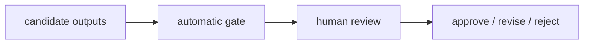
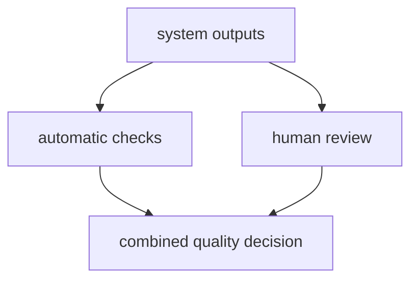

# P5-15.2 자동 평가와 사람 평가

P5-15.1에서는 LLM 평가가 정확성, 유용성, 안전성, 근거성 같은 여러 축을 함께 보는 문제라는 점을 보았습니다. 이 절에서는 그 평가를 자동으로 돌릴 수 있어도 사람 검토가 왜 여전히 필요한지 봅니다.

자동 평가는 빠르고 반복 가능하지만, 사람 평가는 맥락과 품질 감각을 더 잘 본다. 실제 운영에서는 둘을 함께 쓰는 경우가 많다.

## 이 절의 범위

이 절은 다음 질문에 답합니다.

- 자동 평가는 무엇에 강한가?
- 사람 평가는 무엇에 여전히 필요한가?
- 왜 둘을 섞어 쓰는 구조가 자주 등장하는가?

이 절에서는 다음 내용을 깊게 다루지 않습니다.

- 평가 모델(judge model) 설계 세부
- 통계적 샘플링 전략 세부
- 조직별 QA 프로세스 전체

judge model 설계와 통계적 샘플링 전략의 세부는 여기서 다루지 않습니다. 대신 운영 안에서 어떤 실패를 다시 추적해야 하는지는 P5-16.1과 P5-16.2에서 다시 회수합니다. 조직별 QA 프로세스 전체와 세부 운영은 현재 본편 범위 밖으로 둡니다.

지금 읽는 층위는 `평가 분업 층위`입니다. 앞 절이 `무엇을 평가해야 하는가`라는 축을 세웠다면, 여기서는 `그 평가를 누구에게 어떤 비중으로 맡길 것인가`로 질문이 바뀝니다. 아직 비용, 지연 시간, 실패 대응 같은 운영 한도 자체를 다루는 단계까지는 가지 않고, 바로 다음 장에서 그 판단을 실제 서비스 제약과 실패 경로로 넘깁니다.

| 지금 읽는 층위 | 앞 절에서 가져온 것 | 지금 가장 먼저 봐야 하는 질문 | 바로 다음 장에서 다시 읽는 것 |
| --- | --- | --- | --- |
| 평가 분업 층위 | 정확성, 유용성, 안전성, 근거성 같은 평가 축 | 어떤 항목을 자동으로 거르고 어떤 항목을 사람에게 넘길 것인가? | 비용·지연 시간·실패 대응 안에서 이 판단을 어떻게 운영할 것인가? |

이 표의 핵심은 자동 평가와 사람 평가를 `누가 더 좋은가`의 경쟁으로 읽지 않는 데 있습니다. 여기서는 같은 출력도 `자동 게이트`, `사람 검토`, `다음 운영 조치`로 서로 다른 경로를 타게 된다는 점만 먼저 잡으면 충분합니다.

즉, 이 절은 `무엇을 평가할까`에서 `누가 어떤 평가를 맡을까`로 손잡이가 바뀌는 자리입니다. 자동 게이트와 사람 검토 구분은 바로 다음 장의 운영 경로 판단과 뒤의 요청 기록 구조로 이어집니다.

여기서는 `자동 게이트, 사람 검토, 승인 후보를 먼저 나눈다`는 점을 먼저 붙잡으면 됩니다. retry, fallback, stop 같은 복구 경로와 실제 서비스 통제는 바로 다음 P5-16에서 닫습니다.

## 이 절의 목표

- 자동 평가와 사람 평가의 차이를 설명할 수 있습니다.
- 반복 가능성과 맥락 판단의 차이를 말할 수 있습니다.
- 운영에서 왜 두 방식을 섞는지 설명할 수 있습니다.
- 다음 장의 서비스 제약과 운영 문제로 자연스럽게 넘어갈 수 있습니다.

## 이 절을 읽는 순서

이 절은 다음 순서로 읽으면 비교 기준이 더 분명해집니다.

1. 먼저 자동 평가와 사람 평가가 각각 무엇에 강한지 읽습니다.
2. 그다음 왜 둘 중 하나만으로는 운영이 불안정한지 봅니다.
3. 사례와 Python 예제에서는 `자동 게이트`, `사람 검토`, `최종 조치`가 어떻게 나뉘는지 확인합니다.

## 자동 평가는 무엇에 강한가

자동 평가는 보통 다음에 강합니다.

- 빠른 반복
- 많은 샘플 비교
- 회귀(regression) 탐지
- 형식 검사
- 기준이 명확한 항목 점검

예를 들어:

- JSON 형식이 맞는가
- 필수 필드가 있는가
- 검색 문서 출처가 붙었는가
- 이전 버전보다 특정 점수가 나빠졌는가

같은 것은 자동화하기 좋습니다.

다음처럼 기억하면 좋습니다.

`자동 평가는 반복과 비교에 강하다.`

## 사람 평가는 무엇에 강한가

사람 평가는 보통 다음에 강합니다.

- 맥락 이해
- 미묘한 품질 차이 판단
- 표현의 어색함 감지
- 실제 업무 적합성 판단
- 사회적 위험과 오해 가능성 판단

예를 들어:

- 답이 형식상 맞지만 실제로는 오해를 만든다
- 설명은 유창하지만 독자 수준에 맞지 않는다
- 근거는 있지만 표현이 지나치게 단정적이다

같은 것은 자동 평가만으로 놓치기 쉽습니다.

다음처럼 기억하면 좋습니다.

`사람 평가는 맥락과 뉘앙스를 더 잘 본다.`

## 왜 자동 평가만으로는 부족한가

자동 평가는 기준을 명확히 세운 항목에는 강하지만, 모든 품질을 완전히 대체하기는 어렵습니다.

예를 들어 자동 평가는:

- 문서에 특정 키워드가 있는지
- 형식 제약을 지켰는지
- 일부 점수 기준을 넘었는지

는 잘 볼 수 있지만,

- 실제로 믿고 쓸 만한 답인지
- 사용자에게 오해를 줄 표현인지
- 조직의 실제 목적에 맞는지

까지는 한계가 있습니다.

## 왜 사람 평가만으로도 부족한가

반대로 사람 평가만으로 가면 다음 문제가 생깁니다.

- 속도가 느림
- 비용이 큼
- 평가자마다 기준이 흔들릴 수 있음
- 자주 반복하기 어려움

즉, 사람 평가는 깊이가 있지만, 운영 규모가 커질수록 자동화 없이 버티기 어렵습니다.

## 왜 둘을 함께 쓰나

실무에서는 보통 다음처럼 섞습니다.

- 자동 평가로 대량 회귀와 형식 오류를 먼저 잡고
- 사람 평가로 중요한 샘플과 미묘한 품질 문제를 확인하고
- 필요하면 다시 자동 기준을 보강합니다

즉, 자동 평가와 사람 평가는 대체 관계라기보다 분업 관계에 가깝습니다.

이 분업을 한 번 더 단순화하면 다음과 같습니다.



이 그림의 핵심은 자동 평가가 먼저 모든 판단을 끝내는 것이 아니라, 사람 검토가 필요한 후보를 줄이고 최종 조치를 더 빠르게 정하게 만든다는 점입니다.

## 아주 단순하게 그리면



이 도식의 핵심은 실제 품질 판단이 한 경로로만 끝나지 않는다는 점입니다.

여기서 중요한 점은 자동 평가와 사람 평가의 결과가 곧바로 다음 장의 운영 판단 입력이 된다는 것입니다. 이 절의 끝은 `품질 판단 완료`가 아니라 `어떤 후보를 계속 살리고 멈출지 정리된 상태`에 가깝습니다.

| 이 절에서 남기는 판단 | 바로 다음 장에서 다시 읽는 질문 |
| --- | --- |
| 자동 게이트 통과 여부 | 비용과 지연 시간을 들여 계속 운영할 후보인가? |
| 사람 검토 필요 여부 | 승인, 수정, 보류 중 어느 경로로 넘길 것인가? |
| 최종 승인 후보 여부 | 실제 서비스 경로에 올려도 되는가? |
| 탈락 또는 재검토 사유 | 실패 대응에서 어떤 원인을 먼저 추적할 것인가? |

즉, 자동 평가와 사람 평가는 `좋다/나쁘다`를 말하고 끝나는 절차가 아니라, 다음 장에서 후보를 운영 경로별로 나누는 기준선입니다.

## 사례로 보기

사례를 읽을 때는 `무엇이 맞는가`보다 `어떤 실패는 자동으로 걸러지고 어떤 실패는 사람이 끝까지 봐야 하는가`를 중심으로 보면 좋습니다.

### 사례 1. RAG 답변 평가

RAG 답변에 출처 링크와 인용 구간이 모두 붙어 있다고 해 봅시다. 사람은 링크와 형식이 잘 붙어 있으면 우선 `근거가 있네`라고 느끼기 쉽습니다. 자동 점검은 `출처가 있는가`, `형식이 맞는가`를 빠르게 확인할 수 있지만, 링크가 있다고 해서 답이 실제 문서 뜻을 제대로 반영한 것은 아닙니다. 예를 들어 문서에는 예외 조항이 있는데 답변이 본문 한 줄만 보고 `항상 가능하다`고 단정했을 수 있습니다. 이런 경우 자동 점검은 통과해도 실제 사용자 안내는 틀릴 수 있습니다. 이런 해석 오류는 사람이 문서와 답을 같이 읽어 봐야 드러납니다. 즉, 자동 평가는 `근거가 붙어 있는가`를 보고, 사람 평가는 `붙인 근거를 제대로 읽었는가`를 봅니다. 여기서 바뀌는 점은 `출처 링크가 있는가`를 보던 기준에서 `그 출처가 실제 해석까지 뒷받침하는가`를 보는 기준으로 이동한다는 것입니다. 그래서 이 사례에서 확인해야 할 결과는 링크 존재 여부와 별개로 답변 해석이 실제 예외 조항까지 반영하는가입니다.

### 사례 2. 에이전트 실행 평가

에이전트가 목표를 달성했더라도 도구를 열두 번 호출하고 그중 다섯 번을 실패했다고 해 봅시다. 사람은 최종 결과가 있으면 일단 성공처럼 느끼기 쉽습니다. 자동 평가는 이런 호출 횟수, 실패율, 평균 시간 같은 수치를 바로 계산해 줄 수 있습니다. 하지만 숫자만으로는 `정말 이런 복잡한 경로가 필요했는가`, `중간에 더 단순한 계획으로 갈 수 있었는가`를 판단하기 어렵습니다. 예를 들어 첫 검색에서 충분한 문서를 찾았는데도 비슷한 검색을 여러 번 반복했다면, 실패율 숫자보다 계획 품질 문제가 더 중요할 수 있습니다. 이 경우 결과가 맞아도 운영 비용과 지연 시간이 불필요하게 커질 수 있습니다. 이 부분은 사람이 실행 흐름을 보고 과도한 우회나 불필요한 재시도를 읽어야 합니다. 그래서 에이전트 평가는 자동 수치와 사람의 실행 흐름 해석이 함께 있어야 균형이 맞습니다. 여기서 바뀌는 점은 `최종 성공 여부`만 보던 기준에서 `성공에 이르는 실행 경로가 과도하지 않은가`를 보는 기준으로 이동한다는 것입니다. 그래서 이 사례에서 확인해야 할 결과는 성공 여부 외에 호출 횟수, 실패율, 우회 경로가 불필요하게 크지 않은가입니다.

### 사례 3. 고객 지원 답변

고객 지원 답변이 응답 시간도 빠르고 금지 표현도 없으며 형식도 지켰다고 해 봅시다. 사람은 자동 평가가 다 통과했으면 거의 충분하다고 느끼기 쉽습니다. 하지만 실제 문장이 지나치게 차갑거나 책임을 고객에게 돌리는 듯 읽히면 서비스 품질은 나빠질 수 있습니다. 반대로 문장은 공손해도 핵심 안내 순서가 어색해 고객이 다음 행동을 헷갈릴 수 있습니다. 예를 들어 환불 가능 여부보다 먼저 서류 제출 경로를 길게 설명하면, 사실은 맞아도 고객은 `그래서 환불이 되는 건가`를 끝까지 읽고도 바로 파악하지 못할 수 있습니다. 이런 문제는 형식 검사만으로는 잘 드러나지 않고 사람이 읽어야 보입니다. 그래서 고객 지원 장면에서는 자동 평가는 기본 안전선이고, 사람 평가는 실제 오해 가능성과 말투 품질을 확인하는 역할을 맡습니다. 여기서 바뀌는 점은 `형식 검사를 통과했는가`를 보던 기준에서 `고객이 실제로 다음 행동을 이해할 수 있는가`를 보는 기준으로 이동한다는 것입니다. 그래서 이 사례에서 확인해야 할 결과는 형식 통과와 별개로 고객이 다음 행동을 바로 이해할 수 있는가입니다.

세 사례를 자동 평가와 사람 평가의 분담으로 다시 묶으면 다음과 같습니다.

| 상황 | 자동 평가가 먼저 보기 좋은 것 | 사람 평가가 끝까지 봐야 하는 것 |
| --- | --- | --- |
| RAG 답변 평가 | 출처 존재, 형식 일치, 인용 표기 | 예외 조항까지 올바르게 해석했는가 |
| 에이전트 실행 평가 | 호출 횟수, 실패율, 지연 시간 | 계획이 과도하게 우회하지 않았는가 |
| 고객 지원 답변 | 금지 표현, 형식, 길이, 응답 속도 | 말투, 오해 가능성, 다음 행동 이해도 |

## 실행 가능한 Python 예제로 보기

이번 예제의 목표는 자동 평가와 사람 평가가 서로 다른 역할을 가진다는 점을 실제 점검 항목 차이로 보고, 최종적으로 `승인`, `수정 후 재검토`, `즉시 탈락` 중 어떤 조치가 내려지는지 확인하는 것입니다. 이번에는 답변 하나만 보는 대신, 여러 답변 후보를 함께 놓고 `자동 평가는 무엇을 바로 탈락시키고`, `무엇은 사람 검토로 넘기며`, `무엇은 둘 다 통과하는가`를 비교하겠습니다.

문제 상황:

- 여러 개의 환불 정책 답변 후보가 있음
- 자동 평가는 형식과 표면 조건을 빠르게 확인할 수 있음
- 사람 평가는 말투, 오해 가능성, 실제 도움성을 더 잘 볼 수 있음
- 운영에서는 `자동 통과`, `자동 탈락`, `사람 검토 필요`를 나눠야 함

입력:

- 여러 개의 출력 문장

출력:

- 답변별 자동 평가 결과
- 답변별 사람 평가가 추가로 봐야 할 질문
- 어떤 답변이 자동 탈락, 사람 검토 필요, 최종 승인 후보인지에 대한 요약값
- 각 답변에 대해 운영에서 내려야 할 다음 조치

먼저 이 예제에서 함께 볼 운영 판단 기준은 다음과 같습니다.

| 점검 항목 | 왜 필요한가 |
| --- | --- |
| `auto_pass` | 형식, 길이, 근거 힌트 같은 기본 안전선을 먼저 통과하는지 보기 위해 |
| `needs_human_review` | 자동 통과 뒤에도 뉘앙스나 오해 가능성이 남는지 보기 위해 |
| `final_ready` | 자동 평가와 사람 검토 질문까지 감안했을 때 바로 승인 후보인지 보기 위해 |
| `review_reason` | 왜 사람이 다시 봐야 하는지 운영 로그에 남기기 위해 |
| `next_action` | 승인, 수정, 탈락 중 다음 조치를 분명히 남기기 위해 |

문제 상황:

- 사람 검토는 자동 평가를 대체하기보다 자동 통과 뒤에도 남는 애매함을 잡아내는 마지막 단계로 읽어야 한다

입력(input):

위에 정리한 후보 출력 목록과 자동 평가 기준을 사용합니다.

확인할 개념:

- 사람 평가는 자동 평가를 대체하기보다 자동 통과 뒤에도 남는 애매함과 운영 위험을 잡아내는 단계다

```python
from pprint import pprint


outputs = [
    {
        "name": "answer_a",
        "text": "환불 정책은 14일입니다. 자세한 내용은 공지를 참고하세요.",
    },
    {
        "name": "answer_b",
        "text": "환불은 14일 이내 가능합니다. 주문번호를 보내 주시면 바로 확인하겠습니다.",
    },
    {
        "name": "answer_c",
        "text": "환불은 가능하지만 조건은 직접 찾아보세요.",
    },
    {
        "name": "answer_d",
        "text": "환불 요청 처리 기한은 14일이며 주문번호를 보내 주시면 접수를 도와드리겠습니다. 자세한 내용은 공지를 참고하세요.",
    },
]


def automatic_eval(output):
    result = {
        "has_source_hint": "공지" in output,
        "format_ok": output.endswith("."),
        "length_ok": len(output) >= 20,
    }
    result["auto_pass"] = all(result.values())
    return result


def human_review_questions(output):
    questions = []
    if "주문번호" not in output:
        questions.append("사용자가 다음 행동을 바로 이해할 수 있는가?")
    if "직접 찾아보세요" in output:
        questions.append("문장이 책임을 사용자에게 돌리는 듯 들리지는 않는가?")
    if "가능" in output and "조건" in output and "공지" not in output:
        questions.append("예외 조건이나 근거 위치가 빠져 오해를 만들 가능성은 없는가?")
    if not questions:
        questions.append("말투와 안내 순서가 실제 고객 경험에도 자연스러운가?")
    return questions

reports = []
for item in outputs:
    automatic_result = automatic_eval(item["text"])
    human_questions = human_review_questions(item["text"])

    if not automatic_result["auto_pass"]:
        review_reason = "automatic_gate_failed"
    elif human_questions == ["말투와 안내 순서가 실제 고객 경험에도 자연스러운가?"]:
        review_reason = "light_human_confirmation"
    else:
        review_reason = "needs_human_judgment"

    final_ready = automatic_result["auto_pass"] and review_reason == "light_human_confirmation"
    if review_reason == "automatic_gate_failed":
        next_action = "reject_before_human_review"
    elif final_ready:
        next_action = "approve_candidate"
    else:
        next_action = "revise_and_send_to_human_review"

    reports.append(
        {
            "name": item["name"],
            "output": item["text"],
            "automatic_result": automatic_result,
            "human_review_questions": human_questions,
            "needs_human_review": review_reason != "automatic_gate_failed",
            "review_reason": review_reason,
            "final_ready": final_ready,
            "next_action": next_action,
        }
    )

summary = {
    "auto_pass_count": sum(report["automatic_result"]["auto_pass"] for report in reports),
    "auto_fail_count": sum(not report["automatic_result"]["auto_pass"] for report in reports),
    "needs_human_judgment_count": sum(report["review_reason"] == "needs_human_judgment" for report in reports),
    "final_ready_count": sum(report["final_ready"] for report in reports),
    "approved_count": sum(report["next_action"] == "approve_candidate" for report in reports),
    "revise_count": sum(report["next_action"] == "revise_and_send_to_human_review" for report in reports),
    "reject_count": sum(report["next_action"] == "reject_before_human_review" for report in reports),
}

print("[summary]")
pprint(summary)
print()

for report in reports:
    print("=" * 80)
    print(f"[{report['name']}]")
    print("output =", report["output"])
    print("automatic_result =")
    pprint(report["automatic_result"])
    print("human_review_questions =")
    pprint(report["human_review_questions"])
    print("review_reason =", report["review_reason"])
    print("final_ready =", report["final_ready"])
    print("next_action =", report["next_action"])
    print()
```

실행 결과 예시는 다음처럼 읽을 수 있습니다.

```text
[summary]
{'approved_count': 1,
 'auto_fail_count': 2,
 'auto_pass_count': 2,
 'final_ready_count': 1,
 'needs_human_judgment_count': 1,
 'reject_count': 2,
 'revise_count': 1}

================================================================================
[answer_a]
output = 환불 정책은 14일입니다. 자세한 내용은 공지를 참고하세요.
automatic_result =
{'auto_pass': True, 'format_ok': True, 'has_source_hint': True, 'length_ok': True}
human_review_questions =
['사용자가 다음 행동을 바로 이해할 수 있는가?']
review_reason = needs_human_judgment
final_ready = False
next_action = revise_and_send_to_human_review

================================================================================
[answer_b]
output = 환불은 14일 이내 가능합니다. 주문번호를 보내 주시면 바로 확인하겠습니다.
automatic_result =
{'auto_pass': False, 'format_ok': True, 'has_source_hint': False, 'length_ok': True}
human_review_questions =
['말투와 안내 순서가 실제 고객 경험에도 자연스러운가?']
review_reason = automatic_gate_failed
final_ready = False
next_action = reject_before_human_review

================================================================================
[answer_c]
output = 환불은 가능하지만 조건은 직접 찾아보세요.
automatic_result =
{'auto_pass': False, 'format_ok': True, 'has_source_hint': False, 'length_ok': True}
human_review_questions =
['사용자가 다음 행동을 바로 이해할 수 있는가?',
 '문장이 책임을 사용자에게 돌리는 듯 들리지는 않는가?',
 '예외 조건이나 근거 위치가 빠져 오해를 만들 가능성은 없는가?']
review_reason = automatic_gate_failed
final_ready = False
next_action = reject_before_human_review

================================================================================
[answer_d]
output = 환불 요청 처리 기한은 14일이며 주문번호를 보내 주시면 접수를 도와드리겠습니다. 자세한 내용은 공지를 참고하세요.
automatic_result =
{'auto_pass': True, 'format_ok': True, 'has_source_hint': True, 'length_ok': True}
human_review_questions =
['말투와 안내 순서가 실제 고객 경험에도 자연스러운가?']
review_reason = light_human_confirmation
final_ready = True
next_action = approve_candidate
```

이 예제에서 먼저 봐야 할 것은 `auto_pass_count`, `needs_human_judgment_count`, `final_ready_count`가 서로 다르고, `next_action`이 그 차이를 실제 운영 조치로 바꾼다는 점입니다. 즉, 어떤 답은 자동 평가에서 바로 탈락하고, 어떤 답은 자동 평가를 통과했지만 사람 검토가 더 필요하며, 어떤 답만이 자동 기준과 사람 기준을 함께 만족해 최종 승인 후보가 됩니다.

그래서 이 예제에서 확인해야 할 결과는 자동 평가는 형식·길이·출처 힌트 같은 표면 조건을 빠르게 보고, 사람 평가는 실제 도움성, 오해 가능성, 말투 품질을 따로 보며, 운영에서는 이 둘을 합쳐 `탈락`, `재검토`, `승인 후보`를 나눈다는 점입니다. 특히 `answer_a`처럼 자동 평가는 통과해도 다음 행동이 불분명할 수 있고, `answer_b`, `answer_c`처럼 형식은 맞더라도 출처 힌트가 없어 자동 게이트부터 통과하지 못할 수 있습니다.

이 예제에서 독자가 직접 해 볼 수 있는 조정은 다음과 같습니다.

- `outputs`에 더 친절하거나 더 차가운 답변을 추가해 자동 평가와 사람 질문의 차이를 느껴 보기
- `automatic_eval`에 금지 표현 점검을 넣어 자동 탈락 조건을 더 늘려 보기
- 사람 질문 목록을 팀의 실제 QA 체크리스트처럼 다시 써 보고 `review_reason`이 어떻게 달라지는지 보기

## 이 예제를 운영 판단으로 다시 보면

앞의 예제는 자동 평가와 사람 평가를 둘 다 흉내 내는 완성 구현이 아니라, `같은 출력도 서로 다른 검토 경로를 탄다`는 점을 가장 짧게 보여 주는 장면입니다. 여기서 읽어야 할 핵심은 자동 점검을 늘리는 일과 사람 검토를 줄이는 일이 같은 목표가 아니라, 서로 다른 실패를 잡기 위한 분업이라는 점입니다.

여기까지를 한 줄로 묶으면, 자동 평가와 사람 평가는 `누가 더 우월한가`를 가리는 관계가 아니라 `어떤 후보를 바로 탈락시키고 어떤 후보를 사람에게 넘기며 어떤 후보를 승인할지 나누는 운영 분업`입니다.

생성형 AI가 실제 서비스에 들어오면서, 사람들은 곧 두 가지를 동시에 원하게 되었습니다.

- 빠르게 많은 결과를 점검할 것
- 중요한 오류는 사람 눈으로 놓치지 않을 것

이 때문에 evaluation은 점점 `자동화된 점검`과 `사람 검토`의 혼합 구조로 발전했습니다.

커리큘럼 관점에서 이 절이 중요한 이유는 다음과 같습니다.

- 바로 앞의 P5-15.1 평가 축을 `무엇을 볼 것인가`에서 `어떻게 점검할 것인가`로 확장하게 하고
- 평가를 단순 점수표가 아니라 운영 프로세스로 보게 하고
- 다음 장의 비용, 지연 시간, 실패 대응 문제와 연결하며
- 이후 검증 절차를 설계할 기준을 세우기 때문입니다

## 다음 장과의 연결

여기까지 오면 다음 질문이 남습니다.

- 품질만 좋으면 충분한가?
- 실제 서비스에서는 비용, 지연 시간, 사용량 제한, 실패 대응을 어떻게 같이 봐야 하는가?

이 질문은 P5-16.1 서비스 운영 제약으로 이어집니다.

## 이 절에서 기억할 관점

| 지금 이 절에서 정리한 것 | 바로 다음에 붙는 질문 | 이 본류 단계가 닫는 역할 |
| --- | --- | --- |
| 자동 평가와 사람 평가를 나눠 후보를 거르고 다음 조치를 정한다 | 이 판단을 실제 비용, 지연, 실패 경로 안에서 어떻게 운영할까 | Part 5 후반이 `좋은 답을 고르는 기준`을 세우는 첫 운영 단계 |

- 자동 평가는 반복과 비교에 강합니다.
- 사람 평가는 맥락과 미묘한 품질 판단에 강합니다.
- 실제 운영에서는 두 방식을 함께 쓰는 경우가 많습니다.
- 평가는 기술 문제가 아니라 운영 프로세스 문제이기도 합니다.

자동 평가와 사람 평가는 `누가 더 좋은가`보다 `어떤 후보를 어떤 경로로 넘길까`를 가르는 평가 분업 구조입니다.

## 체크리스트

- 자동 평가와 사람 평가의 차이를 설명할 수 있는가?
- 왜 자동 평가만으로 부족한지 말할 수 있는가?
- 왜 사람 평가만으로도 운영이 어려운지 설명할 수 있는가?
- 왜 다음 장에서 서비스 제약을 다뤄야 하는지 말할 수 있는가?

## 출처와 참고 자료

- OpenAI, evaluation 관련 공식 문서, 확인 날짜: 2026-06-29.
- 관련 LLM evaluation 운영 자료, 확인 날짜: 2026-06-29.
- RAG 및 agent 평가 사례 자료, 확인 날짜: 2026-06-29.
