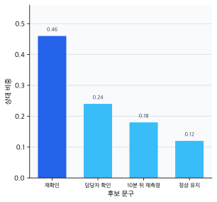
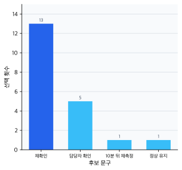
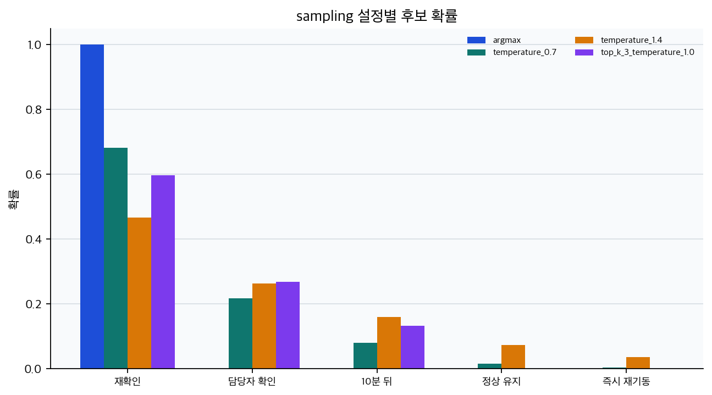
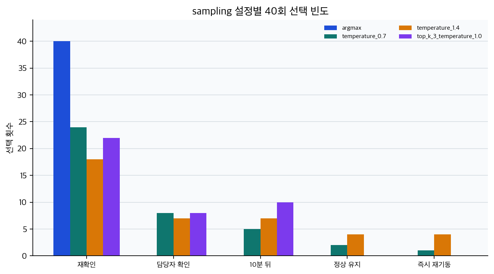

# P5-15.3 샘플링(sampling)은 후보 분포에서 실제 출력을 어떻게 꺼내는가

> Section ID: `P5-15.3`
> Version: `v2026.07.24`

P5-15.2에서는 생성 모델(generative model)이 정답 하나를 외워 꺼내는 것이 아니라, 가능한 출력 후보들의 상대적 그럴듯함을 후보 분포로 남긴다는 점을 보았습니다. 그러면 다음 질문이 자연스럽게 따라옵니다.

생성 모델이 여러 그럴듯한 답을 만들 수 있다면, 실제로 어떤 답을 고르는가?

샘플링(sampling)은 모델이 그럴듯하다고 본 여러 후보 중 실제 출력을 하나씩 꺼내는 과정이며, 이 방식은 결과의 다양성과 안정성에 직접 영향을 줍니다.

모델 점수와 실제 출력 선택을 다시 구분해야 할 때는 개념사전의 [샘플링(sampling)](../../../reference/concept-glossary-parts/07-siot.md#sampling) 항목을 기준으로 다시 읽습니다.

## 후보 분포와 실제 출력 선택은 다르다

이 절에서 먼저 붙잡아야 할 핵심은 `생성 모델의 품질은 무엇을 배웠는가뿐 아니라, 후보들 중 무엇을 실제로 꺼내는가에도 크게 달려 있다`는 점입니다. P5-15.2가 모델이 후보들의 상대적 그럴듯함을 어떻게 남기는지 보았다면, P5-15.3은 이미 계산된 후보들 중 실제 출력을 어떤 절차로 꺼내는지 봅니다.

| 지금 이 절에서 읽는 것 | 뒤 Part에서 더 읽는 것 |
| --- | --- |
| 후보 분포를 계산한 뒤 실제 출력을 어떤 감각으로 고르는가 | top-k, top-p, temperature를 제품 설정 언어로 어떻게 세밀하게 다루는가 |
| 다양성과 안정성 사이의 선택이 왜 결과를 바꾸는가 | 생성 설정이 응답 스타일, 길이, 변주 폭을 어떻게 조정하는가 |

top-k, top-p, temperature의 세부 차이는 P6-5.2에서 다시 구체화합니다. 여기서는 `후보 분포를 계산하는 단계`와 `실제 출력을 꺼내는 단계`가 다르며, 결과 품질이 이 두 단계 모두에 걸려 있다는 감각을 닫습니다.

예를 들어 운영 알림 문장 앞부분을 다시 생각해 보겠습니다.

- `배치 점검 결과`

이 뒤에는 `재확인이 필요합니다`, `담당자 확인 후 재개합니다`, `10분 뒤 재측정합니다`, `현재 기준에서는 정상으로 유지합니다` 같은 여러 후속 문구가 자연스럽게 이어질 수 있습니다.

이 후보 분포를 계산하는 것과, 그중 어떤 문구를 실제 안내 문장으로 꺼내는 것은 같은 일이 아닙니다. 샘플링은 바로 이 두 번째 단계입니다.

## 샘플링(sampling)은 무엇을 하나

샘플링의 핵심은 높은 후보를 우선하되, 다른 후보도 실제 출력으로 남을 여지를 두는 선택 절차라는 점입니다.

`샘플링은 모델이 더 그럴듯하다고 본 후보를 더 자주 고르되, 경우에 따라 다른 후보도 실제 출력으로 선택할 수 있게 하는 절차다.`

즉, 샘플링은 다음 두 극단 사이의 문제를 다룹니다.

- 항상 가장 높은 후보만 고르는 방식
- 가능한 후보를 너무 무작위로 섞어 버리는 방식

생성형 AI에서는 이 사이의 균형이 중요합니다.

입문 단계에서는 다음 세 방식만 구분해도 충분합니다.

| 방식 | 먼저 잡아야 할 감각 |
| --- | --- |
| argmax | 항상 가장 높은 후보만 고른다 |
| sampling | 높은 후보를 더 자주 고르되 다른 후보도 허용한다 |
| temperature 조정 | 후보 분포를 더 보수적이거나 더 다양하게 읽게 만든다 |

이 차이는 후보 분포와 실제 선택 빈도를 나란히 보면 더 잘 보입니다. 먼저 모델이 후보마다 어느 정도 비중을 두는지 보면, 가장 높은 후보가 분명히 있지만 다른 후보도 완전히 0은 아닙니다.



그 다음 실제로 20번 샘플링했을 때의 선택 빈도를 보면, 가장 높은 후보가 가장 많이 남더라도 낮은 후보가 완전히 사라지지 않고 일부 결과로 남을 수 있습니다.



이 그래프에서 핵심은 sampling이 `아무거나 뽑기`가 아니라는 점입니다. 모델이 후보마다 준 비중을 기준으로 실제 출력을 꺼내되, argmax처럼 하나의 후보만 고정하지 않는 선택 절차로 읽어야 합니다.

## 다양성과 안정성은 왜 함께 보아야 하나

샘플링을 전혀 하지 않고 가장 높은 후보만 반복해서 선택하면, 출력은 안정적으로 보일 수 있습니다. 하지만 결과가 지나치게 단조롭거나 반복적으로 느껴질 수 있습니다.

반대로 후보를 너무 넓게 허용하면 출력 다양성은 커질 수 있지만, 문장이 갑자기 부자연스러워지거나 의미가 흐트러질 수 있습니다.

`생성 품질은 정답 여부만이 아니라, 다양성과 안정성의 균형 문제이기도 하다.`

## 어떤 상황에서 어떤 균형을 먼저 보나

샘플링을 읽을 때는 `무조건 다양하게` 또는 `무조건 보수적으로`보다, 지금 무엇을 더 우선할지 먼저 보는 편이 좋습니다.

| 상황 | 먼저 보는 기준 | 더 먼저 떠올릴 선택 감각 |
| --- | --- | --- |
| 점검 결과 안내 문구 | 반복 가능성, 흔들림 최소화 | 높은 확률 후보 중심 선택 |
| 설명형 현장 지원 응답 | 정확성, 구조 안정성 | 비교적 보수적인 샘플링 |
| 운영 문구 초안, 대응 메시지 시안 | 후보 폭, 표현 다양성 | 다양한 후보 허용 |
| 이미지 콘셉트 탐색 | 장면 변주, 스타일 폭 | 더 넓은 샘플링 허용 |

즉, 샘플링은 `재미를 늘리는 장치`만이 아니라, 출력의 일관성과 다양성 사이에서 어느 쪽을 더 우선할지 정하는 선택으로 읽는 편이 안전합니다.

## 같은 모델도 결과가 달라질 수 있는 이유

같은 모델이어도 다음 조건이 달라지면 결과가 달라질 수 있습니다.

- 어떤 후보까지만 남길지
- 확률 분포를 얼마나 날카롭게 읽을지
- 가장 높은 후보만 고를지, 여러 후보를 허용할지

이 때문에 사용자는 종종 `모델이 바뀌었다`고 느끼지만, 실제로는 출력 선택 전략이 바뀐 경우도 있습니다.

이 관점은 이후 토큰(token) 단위 생성과 프롬프트(prompt) 실험을 읽을 때 매우 중요해집니다.

## 아주 단순한 흐름으로 그리면

```mermaid
--8<-- "assets/part-05/chapter-15/sampling-selection-flow-ko.mmd"
```

이 도식에서 확인해야 할 결과는 `모델 점수`를 계산하는 단계와 그 후보 중 무엇을 실제 출력으로 꺼낼지 정하는 단계가 서로 다르다는 점입니다.

같은 후보 점수를 받아도 마지막 선택 규칙에 따라 사용자 경험은 바로 달라질 수 있습니다.

| 같은 앞문장과 후보 점수 | 가장 높은 후보만 고를 때 먼저 보이는 결과 | 여러 후보를 허용할 때 먼저 보이는 결과 |
| --- | --- | --- |
| `배치 점검 결과` 뒤에 `재확인이 필요합니다`, `담당자 확인 후 재개합니다`, `10분 뒤 재측정합니다`가 모두 가능함 | 늘 가장 보수적인 한 문장만 반복되기 쉽다 | 점검 맥락은 유지하면서 조치 표현과 길이가 조금씩 달라질 수 있다 |
| 현장 지원이 `압력 이상 정지 뒤 재기동 순서`를 설명함 | 늘 같은 단계 문장만 반복되기 쉽다 | 핵심 안전 절차는 유지하면서 경고 문구 위치와 설명 길이가 달라질 수 있다 |
| `stainless mixing tank with side valve and warning beacon` 프롬프트로 이미지를 생성함 | 비슷한 탱크 구도와 경광등 배치가 반복되기 쉽다 | 핵심 설비 장면은 유지하면서 조명, 시점, 배관 배치가 달라질 수 있다 |

즉, `모델이 어떤 후보를 높게 봤는가`와 `그 후보 중 무엇을 실제 출력으로 꺼냈는가`는 같은 문제가 아닙니다.

## 사례 및 예시

### 대표 사례. 점검 결과 안내 문구

`배치 점검 결과`

사람은 보통 `가장 무난한 한 대응 문구`를 먼저 떠올립니다. 그래서 안내 문구 생성도 늘 가장 높은 후보 하나만 고르면 된다고 생각하기 쉽습니다. 하지만 실제 운영 문장에서는 `재확인이 필요합니다`, `담당자 확인 후 재개합니다`, `10분 뒤 재측정합니다`처럼 여러 후보가 모두 자연스러울 수 있고, 점검 상태에 따라 더 어울리는 표현도 달라집니다. 예를 들어 경보가 반복되면 `재확인이 필요합니다`가 자연스럽고, 이미 현장 조치가 시작되었다면 `담당자 확인 후 재개합니다`가 더 어울릴 수 있습니다. 항상 가장 높은 후보만 고르면 안내 문구가 매번 같은 톤으로 굳고, 반대로 후보를 너무 넓게 허용하면 현장 맥락에 덜 맞는 조치 표현까지 튈 수 있습니다. 샘플링은 이 사이에서 어떤 후보를 실제로 꺼낼지 조절하는 단계입니다.

그래서 이 사례에서 확인해야 할 결과는 `배치 점검 결과`라는 같은 prefix를 유지하더라도, 실제 운영 상황에 따라 후보 문구가 조금씩 달라질 수 있고, 샘플링이 바로 그 선택 폭을 조절하는 단계라는 점입니다.

같은 관점은 현장 지원 응답이나 이미지 생성 프롬프트에도 그대로 이어집니다. 다만 이 절에서 붙잡을 핵심은 도메인 이름이 아니라, `같은 후보 분포를 두고도 실제로 어떤 출력을 꺼내느냐가 결과 변주 폭을 바꾸는가`입니다.

| 사례 | 모델이 가질 수 있는 후보 | 너무 좁게 고를 때 생기는 일 | 더 넓게 허용할 때 확인할 결과 |
| --- | --- | --- | --- |
| 점검 결과 안내 문구 | `재확인이 필요합니다`, `담당자 확인 후 재개합니다`, `10분 뒤 재측정합니다` 같은 대응 후보 | 늘 같은 조치 문구만 반복된다 | 운영 맥락을 유지한 채 대응 표현 변주가 생기는가 |
| 현장 지원 응답 | 짧은 단계형, 경고 선배치형, 설명 보강형 답변 후보 | 늘 비슷한 길이와 구조만 나온다 | 핵심 안전 절차는 유지하면서 설명 형식이 달라지는가 |
| 이미지 생성 | 탱크 각도, 배관 배치, 경광등 강조, 시점 후보 | 결과 장면이 지나치게 비슷해진다 | 핵심 프롬프트는 유지하면서 장면 변주가 생기는가 |

| 사람이 먼저 보기 쉬운 기준 | 샘플링 관점으로 다시 읽는 기준 |
| --- | --- |
| 모델이 가장 높은 점수를 준 후보 하나가 곧바로 최종 출력이 된다고 느끼기 쉽다 | 점수 계산과 실제 선택은 다른 단계라서, 같은 분포라도 어떤 선택 규칙을 쓰느냐에 따라 결과가 달라진다 |
| 결과가 매번 달라지면 모델이 불안정하다고만 느끼기 쉽다 | 후보 분포 안에서 다른 선택이 허용된 결과일 수 있으므로 다양성과 안정성의 균형을 같이 봐야 한다 |
| sampling을 단순 무작위성 추가라고 이해하기 쉽다 | 실제 핵심은 높은 후보를 우선하되 다른 후보도 어느 범위까지 허용할지 정하는 선택 절차다 |

세 사례를 같이 놓고 보면, 샘플링의 핵심은 `모델이 무엇을 배웠는가`를 다시 설명하는 데 있지 않고, `여러 후보 중 무엇을 실제 출력으로 꺼낼 것인가`를 운영 맥락에 맞게 조절하는 데 있다는 점입니다.

여기서 한 번 멈추고, `언제 후보 분포를 배웠다는 설명만으로는 부족하고 실제 출력 선택 절차를 따로 꺼내야 하는가`를 짧게 고정해 두면 뒤 Part의 temperature, top-k, top-p 설명도 덜 갑작스럽습니다.

| 먼저 떠올릴 질문 | 샘플링 관점이 먼저 필요한 이유 | 뒤 Part에서 이어질 것 |
| --- | --- | --- |
| 왜 같은 모델도 매번 결과가 조금씩 달라질 수 있는가 | 학습된 후보 분포와 별개로 실제 출력을 꺼내는 절차가 따로 있기 때문 | temperature, top-k, top-p 조절 |
| 왜 늘 최고 점수 후보만 고르면 안 되는가 | 안정성은 높아도 표현 다양성과 상황 적합성이 지나치게 줄어들 수 있기 때문 | 제품 설정과 사용자 경험 조정 |
| 왜 결과 품질이 모델 자체만의 문제가 아닌가 | 무엇을 배웠는가와 무엇을 실제로 선택했는가가 함께 결과를 만들기 때문 | 응답 스타일, 길이, 변주 폭 설계 |

## 연습 및 예제

### 예제 1. 고정 logits로 temperature와 top-k 확인하기

이번 예제의 목표는 실제 LLM을 실행하기 전에, 이미 계산된 후보 점수(logits)에서 temperature와 top-k가 실제 선택 분포를 어떻게 바꾸는지 재현 가능한 숫자로 확인하는 것입니다. LLM은 내부에서 훨씬 많은 토큰 후보를 다루지만, 입문 단계에서는 작은 후보 집합으로도 `점수 -> 확률 -> 실제 선택`의 구분을 충분히 볼 수 있습니다.

입력:

- 같은 prefix 뒤에 올 수 있는 5개 운영 안내 후보
- 후보별 logits
- `argmax`, 낮은 temperature, 높은 temperature, top-k 제한 설정

출력:

- 설정별 후보 확률
- 40회 sampling 선택 빈도
- 후보 분포가 얼마나 넓게 퍼졌는지 보여 주는 entropy

확인할 개념:

- argmax는 후보 하나만 남긴다
- temperature를 높이면 낮은 후보도 선택될 여지가 커진다
- top-k는 낮은 후보 일부를 선택 대상에서 제외한다
- 같은 logits라도 선택 규칙이 바뀌면 실제 출력 경험이 달라진다

```python
# 고정 logits에서 sampling 설정만 바꾸어 후보 확률, 선택 빈도, entropy를 비교하는 예제입니다.
import math
import random

import numpy as np

candidates = [
    "재확인이 필요합니다.",
    "담당자 확인 후 재개합니다.",
    "10분 뒤 재측정합니다.",
    "현재 기준에서는 정상으로 유지합니다.",
    "즉시 재기동합니다.",
]
logits = np.array([3.2, 2.4, 1.7, 0.6, -0.4])

experiments = [
    ("argmax", 0.0, None),
    ("temperature_0.7", 0.7, None),
    ("temperature_1.4", 1.4, None),
    ("top_k_3_temperature_1.0", 1.0, 3),
]


def softmax(values, temperature):
    scaled = values / temperature
    shifted = scaled - np.max(scaled)
    exp_scores = np.exp(shifted)
    return exp_scores / exp_scores.sum()


def apply_top_k(probabilities, k):
    if k is None:
        return probabilities
    kept_indices = np.argsort(probabilities)[-k:]
    filtered = np.zeros_like(probabilities)
    filtered[kept_indices] = probabilities[kept_indices]
    return filtered / filtered.sum()


def probabilities_for(temperature, top_k):
    if temperature == 0.0:
        probabilities = np.zeros_like(logits, dtype=float)
        probabilities[int(np.argmax(logits))] = 1.0
        return probabilities
    return apply_top_k(softmax(logits, temperature), top_k)


def entropy_bits(probabilities):
    non_zero = probabilities[probabilities > 0]
    if len(non_zero) <= 1:
        return 0.0
    return -sum(p * math.log2(p) for p in non_zero)


for label, temperature, top_k in experiments:
    probabilities = probabilities_for(temperature, top_k)
    random.seed(15)
    choices = random.choices(
        range(len(candidates)),
        weights=probabilities,
        k=40,
    )
    counts = [choices.count(index) for index in range(len(candidates))]

    print(f"[{label}]")
    print("probabilities =", [round(float(value), 3) for value in probabilities])
    print("counts =", counts)
    print("entropy_bits =", round(entropy_bits(probabilities), 3))
    print("top_choice =", candidates[int(np.argmax(probabilities))])
    print()
```

```text
[argmax]
probabilities = [1.0, 0.0, 0.0, 0.0, 0.0]
counts = [40, 0, 0, 0, 0]
entropy_bits = 0.0
top_choice = 재확인이 필요합니다.

[temperature_0.7]
probabilities = [0.682, 0.217, 0.08, 0.017, 0.004]
counts = [24, 8, 5, 2, 1]
entropy_bits = 1.277
top_choice = 재확인이 필요합니다.

[temperature_1.4]
probabilities = [0.467, 0.264, 0.16, 0.073, 0.036]
counts = [18, 7, 7, 4, 4]
entropy_bits = 1.89
top_choice = 재확인이 필요합니다.

[top_k_3_temperature_1.0]
probabilities = [0.598, 0.269, 0.133, 0.0, 0.0]
counts = [22, 8, 10, 0, 0]
entropy_bits = 1.341
top_choice = 재확인이 필요합니다.
```

이 출력에서 먼저 볼 것은 `top_choice`가 네 설정 모두 같다는 점입니다. 가장 높은 후보는 계속 `재확인이 필요합니다.`이지만, 실제 선택 분포는 크게 달라집니다. `argmax`는 한 후보만 40번 고르고, `temperature_1.4`는 낮은 후보까지 더 넓게 남기며, `top_k_3_temperature_1.0`은 하위 두 후보를 아예 선택 대상에서 제외합니다.





따라서 이 예제의 결론은 `temperature가 높으면 항상 좋다`가 아닙니다. 같은 logits에서 선택 규칙만 바꿔도 후보 분포의 퍼짐과 실제 선택 빈도가 달라지므로, 생성 설정은 모델의 지식 자체가 아니라 `그 지식에서 무엇을 꺼낼지`를 조절하는 단계로 읽어야 합니다.

### 선택 예제. Ollama로 실제 LLM 출력 변화 관찰하기

앞 예제는 고정 logits로 재현 가능한 선택 규칙을 확인했습니다. 이제 로컬에 Ollama와 모델이 준비되어 있다면, 같은 프롬프트라도 생성 설정을 바꾸면 실제 출력의 안정성과 변주 폭이 달라질 수 있음을 관찰할 수 있습니다. Part 1에서는 Python으로 LLM을 호출하지 않았지만, 여기서는 이미 생성 모델과 샘플링을 다뤘으므로 실제 출력으로 확인해 볼 수 있습니다.

이 예제는 API 사용법을 익히기 위한 절이 아닙니다. 핵심은 `모델이 후보를 계산하는 일`과 `그 후보 중 실제 문장을 꺼내는 일`이 분리되어 있으며, 생성 설정이 두 번째 단계의 사용자 경험을 바꿀 수 있다는 점을 보는 것입니다.

실행하려면 Ollama가 로컬에서 실행 중이어야 하고, 코드의 `MODEL` 값에는 자신의 환경에 설치된 모델 이름을 넣어야 합니다. Ollama는 기본적으로 로컬 API를 `http://localhost:11434/api`에서 제공하며, `/api/generate`는 프롬프트에 대한 응답을 생성하는 엔드포인트입니다.

코드를 보기 전에 아래 네 값만 먼저 붙잡으면 충분합니다.

| 확인 포인트 | 예제에서 바로 볼 값 | 왜 중요한가 |
| --- | --- | --- |
| 같은 프롬프트를 몇 번 실행하는가 | `RUNS_PER_SETTING` | 한 번 나온 답만 보고 모델 성향을 단정하지 않게 한다 |
| 생성 설정을 어떻게 바꾸는가 | `temperature` | 낮은 값과 높은 값에서 표현 안정성과 변주 폭을 비교하게 한다 |
| 응답을 어느 정도로 제한하는가 | `num_predict` | 출력 길이가 너무 길어져 관찰 지점이 흐려지는 것을 막는다 |
| 실제 출력에서 무엇을 볼 것인가 | `response` | 같은 요청에서도 문장 순서, 경고 위치, 표현 폭이 달라지는지 확인한다 |

코드를 보기 전에, 같은 프롬프트에서도 설정에 따라 어디서 먼저 차이가 날지 예상해 보면 좋습니다.

| 비교 포인트 | 낮은 temperature에서 먼저 예상할 결과 | 높은 temperature에서 먼저 예상할 결과 |
| --- | --- | --- |
| 문장 구조 | 비슷한 순서와 표현이 반복될 가능성이 높다 | 핵심은 유지하더라도 표현 순서나 문장 길이가 달라질 수 있다 |
| 경고 문구 | 안전 확인 문구가 안정적으로 반복될 수 있다 | 경고 위치나 표현 방식이 바뀔 수 있다 |
| 검토 부담 | 비교하기 쉽지만 단조로울 수 있다 | 더 다양한 초안을 얻지만 검토해야 할 차이도 늘 수 있다 |

프롬프트는 일부러 짧은 운영 안내 문구 생성 장면으로 둡니다. 모델 이름은 자신의 Ollama 환경에 설치된 이름으로 바꿉니다. `temperature`와 `RUNS_PER_SETTING`은 독자가 직접 바꿔 볼 조작 변수입니다.

```python
# Ollama 로컬 API로 같은 프롬프트를 여러 번 실행해 생성 설정에 따른 출력 변화를 관찰합니다.
import json
import textwrap
import urllib.error
import urllib.request

OLLAMA_GENERATE_URL = "http://localhost:11434/api/generate"
MODEL = "gemma3"  # 자신의 Ollama 환경에 설치된 모델 이름으로 바꿉니다.
RUNS_PER_SETTING = 2

PROMPT = """
다음 상황을 현장 작업자가 읽을 수 있는 안내 문구로 2문장 이내로 작성해줘.

상황:
배치 점검 결과 압력 흔들림은 줄었지만, 재기동 전 인터록과 센서 상태를 다시 확인해야 한다.

조건:
- 보이지 않는 원인은 단정하지 마.
- 재기동 전 확인할 행동을 포함해.
- 과장된 표현은 피하고, 검토 가능한 문장으로 써.
""".strip()

experiments = [
    {
        "label": "stable_temperature",
        "options": {
            "temperature": 0.1,
            "num_predict": 80,
        },
    },
    {
        "label": "wider_temperature",
        "options": {
            "temperature": 0.9,
            "num_predict": 80,
        },
    },
]

def generate_with_ollama(label, options, run_index):
    payload = {
        "model": MODEL,
        "prompt": PROMPT,
        "stream": False,
        # 이 예제의 조작 변수입니다. temperature를 바꾸면 출력 선택 폭이 달라질 수 있습니다.
        "options": options,
    }
    request = urllib.request.Request(
        OLLAMA_GENERATE_URL,
        data=json.dumps(payload).encode("utf-8"),
        headers={"Content-Type": "application/json"},
        method="POST",
    )

    try:
        with urllib.request.urlopen(request, timeout=120) as response:
            data = json.loads(response.read().decode("utf-8"))
    except urllib.error.URLError as error:
        print("Ollama에 연결하지 못했습니다.")
        print("Ollama가 실행 중인지, MODEL 값이 설치된 모델 이름인지 확인하세요.")
        print("error =", error)
        return

    generated = data.get("response", "").strip()
    one_line = " ".join(generated.split())

    print(f"[{label} / run {run_index}]")
    print("options =", options)
    print(textwrap.shorten(one_line, width=220, placeholder=" ..."))
    print()

for experiment in experiments:
    for run_index in range(1, RUNS_PER_SETTING + 1):
        generate_with_ollama(
            experiment["label"],
            experiment["options"],
            run_index,
        )
```

실행 결과는 모델, 버전, 로컬 환경, 실행 시점에 따라 달라집니다. 여기서 중요한 것은 특정 문장을 정답으로 맞히는 일이 아니라, 같은 프롬프트와 같은 모델에서도 생성 설정이 출력 경험을 바꿀 수 있음을 관찰하는 것입니다.

| 먼저 볼 출력 | 이 출력이 뜻하는 것 | 바꿔 보면 달라지는 것 |
| --- | --- | --- |
| `stable_temperature`의 응답 | 낮은 temperature에서 비교적 안정적인 문장 구조가 나오는지 보여 줍니다 | `temperature`를 더 낮추면 반복성은 커질 수 있지만 표현 폭은 좁아질 수 있습니다 |
| `wider_temperature`의 응답 | 높은 temperature에서 표현 순서, 문장 길이, 어휘 선택이 더 흔들리는지 보여 줍니다 | `temperature`를 더 높이면 변주가 커질 수 있지만 검토 부담도 늘 수 있습니다 |
| 같은 설정의 두 번 실행 결과 | 한 번의 출력만으로 생성 설정의 성격을 단정하면 안 된다는 점을 보여 줍니다 | `RUNS_PER_SETTING`을 늘리면 반복성과 변주 폭을 더 잘 비교할 수 있습니다 |

- 낮은 temperature에서 두 응답이 거의 같은 구조로 나오면, 후보 선택 폭이 좁아져 안정성이 커진 장면으로 읽을 수 있습니다.
- 높은 temperature에서 문장 순서나 표현이 더 달라지면, 후보 선택 폭이 넓어져 초안의 다양성이 커진 장면으로 읽을 수 있습니다.
- 하지만 높은 temperature가 항상 더 좋은 답을 뜻하지는 않습니다. 현장 안내 문구에서는 안전 확인, 단정 금지, 재기동 전 행동이 빠지지 않는지 사람이 다시 검토해야 합니다.
- 따라서 이 예제의 결론은 `설정을 높이면 창의적이다`가 아니라, `출력 선택 절차가 실제 문장 경험을 바꾸며, 그 결과는 다시 검토해야 한다`입니다.

이 결과도 단순히 `다르다`에서 멈추지 말고, 어떤 값을 바꿔 보면 다양성과 안정성 균형이 어떻게 흔들리는지 바로 확인할 수 있어야 합니다.

| 먼저 보인 출력 신호 | 지금 바로 해 볼 변화 | 아직 이 예제만으로 서두르지 않을 결론 |
| --- | --- | --- |
| 낮은 temperature에서 문장이 거의 반복된다 | `temperature`를 조금씩 올려 표현 폭이 언제부터 넓어지는지 본다 | 반복성이 높다고 항상 품질이 좋다고 단정하지 않는다 |
| 높은 temperature에서 문장이 더 다양해진다 | 같은 조건에서 `RUNS_PER_SETTING`을 늘려 변주 폭을 더 관찰한다 | 다양성이 곧바로 정확성이나 안전성을 뜻한다고 단정하지 않는다 |
| 중요한 확인 행동이 빠진 출력이 있다 | 프롬프트의 조건을 더 분명히 쓰거나 temperature를 낮춰 본다 | 프롬프트와 설정만으로 검토 책임이 사라진다고 보지 않는다 |

여기서 한 걸음 더 나가면, 이 절의 예제를 `실제 LLM 출력 선택 민감도 실험`으로 읽는 편이 좋습니다.

| 먼저 바꿔 볼 값 | 무엇이 흔들리는지 보게 되는가 | 이 절에서 먼저 확인할 결과 |
| --- | --- | --- |
| `temperature`를 0.1에서 0.9로 높인다 | 같은 프롬프트의 표현 순서와 어휘 선택이 얼마나 달라지는가 | 변주 폭이 커지더라도 핵심 안전 조건이 유지되는가 |
| `num_predict`를 줄이거나 늘린다 | 출력 길이와 생략되는 정보가 달라지는가 | 짧은 출력이 검토하기 쉬운 대신 중요한 조건을 빠뜨리지는 않는가 |
| 프롬프트 조건에 `보이지 않는 원인은 단정하지 마`를 빼 본다 | 모델이 원인을 더 쉽게 단정하는지 관찰하게 된다 | 출력 다양성뿐 아니라 위험한 단정도 함께 검토해야 한다 |

즉, 이 절의 예제는 `argmax와 sampling이 다르다`는 손계산 직관에 머무르지 않고, 로컬 LLM의 실제 출력에서 생성 설정과 프롬프트 조건이 운영 메시지와 후속 조치 표현을 어떻게 흔드는지 보게 합니다.

언어 모델(language model)은 대개 다음 토큰의 가능성을 계산하고, 이미지 생성 모델은 가능한 시각 패턴을 점차 구성합니다. 이때 실제 출력은 계산된 분포와 선택 전략을 거쳐 나타납니다.

- 토큰(token)과 토큰화(tokenization)
- 다음 토큰 예측(next-token prediction)
- temperature, top-k, top-p 같은 생성 설정
- 프롬프트(prompt)에 따라 출력이 달라지는 이유

## 체크리스트

- 샘플링(sampling)이 학습된 후보들 중 실제 출력을 고르는 과정이라는 점을 설명할 수 있는가?
- 다양성과 안정성 사이의 선택이 결과에 어떤 영향을 주는지 말할 수 있는가?
- 생성 모델은 후보들의 그럴듯함을 계산하고, 샘플링은 그중 실제 출력을 고른다는 점을 설명할 수 있는가?
- 생성 문제는 정답이 하나만 있는 문제가 아닐 수 있다는 점을 말할 수 있는가?
- 다양성과 안정성의 균형이 생성 품질에 중요하다는 점을 설명할 수 있는가?
- 샘플링을 `무작위성 추가` 정도로만 말하지 않고, `후보 분포에서 실제 출력을 선택하는 절차`로 설명할 수 있는가?
- argmax와 sampling의 차이를 `무조건 최고 후보 고정`과 `높은 후보를 더 자주 고르되 다른 후보도 허용`으로 나눠 말할 수 있는가?
- 뒤 Part의 생성 설정을 읽을 때도 먼저 `모델 점수 계산`과 `실제 출력 선택`을 다른 단계로 볼 준비가 되어 있는가?

## 출처와 참고 자료

- Ian Goodfellow, Yoshua Bengio, Aaron Courville, `Deep Learning`, MIT Press, 2016, 확인 날짜: 2026-06-29. [https://www.deeplearningbook.org/](https://www.deeplearningbook.org/){: target="_blank" rel="noopener noreferrer" }
- Christopher D. Manning, Hinrich Schutze, `Foundations of Statistical Natural Language Processing`, MIT Press, 1999, 확인 날짜: 2026-07-19. [https://mitpress.mit.edu/9780262133609/foundations-of-statistical-natural-language-processing/](https://mitpress.mit.edu/9780262133609/foundations-of-statistical-natural-language-processing/){: target="_blank" rel="noopener noreferrer" }
- Daniel Jurafsky, James H. Martin, `Speech and Language Processing` draft materials, 확인 날짜: 2026-07-19. [https://web.stanford.edu/~jurafsky/slp3/](https://web.stanford.edu/~jurafsky/slp3/){: target="_blank" rel="noopener noreferrer" }
- Ollama, [Introduction](https://docs.ollama.com/api/introduction){: target="_blank" rel="noopener noreferrer" }, Ollama API documentation, 확인 날짜: 2026-07-22.
- Ollama, [Generate a response](https://docs.ollama.com/api/generate){: target="_blank" rel="noopener noreferrer" }, Ollama API documentation, 확인 날짜: 2026-07-22.
