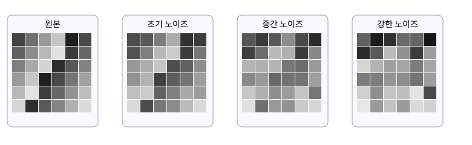

# P5-15.4 디퓨전 모델은 노이즈를 어떻게 학습하고 복원하는가

> Section ID: `P5-15.4`
> Version: `v2026.08.28`

P5-15.2와 P5-15.3에서는 텍스트 생성에서 후보 분포를 만들고 다음 출력을 선택하는 흐름을 보았습니다. 이미지 디퓨전은 그 후보 중 완성 이미지 하나를 고르는 방식이 아닙니다. 이미지 전체가 아직 보이지 않는 노이즈 상태에서 출발해, 여러 번의 계산으로 데이터에 가까운 상태를 복원합니다.

이 절의 질문은 **디퓨전 모델은 무엇을 정답으로 삼아 학습하고, 생성할 때는 노이즈를 어떤 반복으로 이미지 쪽에 가깝게 만드는가**입니다.

## 원본을 노이즈 상태로 보내는 정방향 확산

디퓨전 모델은 먼저 실제 데이터 `x_0`에 작은 무작위 노이즈를 여러 단계로 섞는 장면을 생각합니다. 이 과정은 이미지를 망가뜨리는 목적이 아니라, 모델이 어느 정도 흐려진 상태에서도 원래 데이터의 방향을 찾도록 학습 입력을 만드는 과정입니다.

```mermaid
--8<-- "assets/part-05/chapter-15/diffusion-forward-reverse-flow-ko.mmd"
```

시간 단계 `t`가 작을 때는 원본의 윤곽이 많이 남고, `t`가 커질수록 노이즈 비중이 커집니다. 아래 식은 원본과 노이즈가 시간 단계에 따라 섞인 상태를 간단히 나타냅니다.

\[
x_t = \sqrt{\bar{\alpha}_t}x_0 + \sqrt{1-\bar{\alpha}_t}\epsilon
\]

여기서 외워야 할 것은 기호 자체가 아닙니다.

| 기호 | 이 절에서 읽을 역할 |
| --- | --- |
| `x_0` | 처음의 실제 이미지 또는 데이터 상태 |
| `epsilon` | 무작위로 섞은 노이즈 |
| `t` | 노이즈를 어느 단계까지 섞었는지 나타내는 시간 단계 |
| `x_t` | 원본과 노이즈가 섞인 현재 상태 |



이 그림은 실제 사진을 망가뜨린 예가 아니라, 자체 제작한 작은 격자 상태에 노이즈 비중을 늘린 관찰용 자료입니다. 핵심은 `t`가 커질수록 모델이 받는 입력에서 원본 단서가 줄어든다는 점입니다.

## 모델은 완성 이미지를 맞히는 대신 노이즈를 예측한다

학습에서는 원본 `x_0` 하나를 고르고, 시간 단계 `t`와 노이즈 `epsilon`을 무작위로 뽑아 `x_t`를 만듭니다. 그다음 모델에 `x_t`와 `t`를 주고, 방금 섞은 노이즈 `epsilon`을 예측하게 합니다.

| 학습 단계 | 모델이 받거나 만드는 것 | 왜 필요한가 |
| --- | --- | --- |
| 1 | 원본 상태 `x_0` | 학습 데이터에서 출발점을 잡는다 |
| 2 | 시간 단계 `t`, 노이즈 `epsilon` | 서로 다른 흐림 정도의 입력을 만든다 |
| 3 | 노이즈가 섞인 상태 `x_t` | 모델이 실제로 읽는 입력이다 |
| 4 | 예측 노이즈 `epsilon_theta(x_t, t)` | 현재 상태에서 무엇을 제거할지 추정한다 |
| 5 | 실제 노이즈와 예측 노이즈의 차이 | 손실과 gradient를 만들 학습 신호다 |

가장 단순한 설명에서는 실제 노이즈와 예측 노이즈의 평균 제곱 오차(MSE)를 줄이는 것으로 볼 수 있습니다.

\[
L = \left\lVert \epsilon - \epsilon_\theta(x_t, t) \right\rVert^2
\]

이 식은 Part 5 앞부분의 학습 루프와 같은 자리에 놓입니다. 예측 노이즈가 실제로 섞은 노이즈와 다르면 손실이 커지고, 역전파와 optimizer update는 그 차이를 줄이는 방향으로 파라미터를 바꿉니다. 디퓨전의 새로운 점은 손실·gradient·update라는 원리가 아니라, 모델이 맞혀야 하는 대상이 클래스 라벨이나 완성 이미지가 아니라 **현재 단계에 섞인 노이즈**라는 점입니다.

## 생성은 노이즈에서 시작하는 역방향 반복이다

학습이 끝난 뒤에는 원본 이미지 `x_0`를 주지 않습니다. 대신 무작위 노이즈 상태에서 시작해, 현재 단계의 노이즈를 모델이 예측하게 하고 다음 단계의 조금 덜 노이즈인 상태로 이동합니다. 이 과정을 여러 번 반복하면 마지막 상태가 이미지에 가까워집니다.

```text
초기 노이즈 x_T
반복: 현재 상태 x_t와 시간 t를 넣어 노이즈를 예측
반복: scheduler 규칙으로 다음 상태 x_(t-1) 계산
최종 상태 x_0에 가까운 생성 결과
```

여기서 `scheduler`는 모델의 가중치나 학습률이 아닙니다. 이미 학습된 노이즈 예측을 바탕으로, 현재 상태에서 다음 상태로 어떻게 이동할지 정하는 생성 경로의 규칙입니다. 따라서 같은 모델이어도 seed, steps, scheduler가 달라지면 복원 경로와 결과가 달라질 수 있습니다.

| 값 | 먼저 구분할 역할 |
| --- | --- |
| seed | 초기 노이즈 출발점을 재현하기 위한 값 |
| steps | 역방향 이동을 반복하는 횟수 |
| scheduler | 예측을 이용해 다음 상태로 이동하는 수치 규칙 |
| model weights | 노이즈 또는 복원 방향을 예측하도록 학습된 값 |

텍스트 생성의 temperature·top-k·top-p는 다음 토큰 후보를 어떻게 선택할지 조절하는 값입니다. 반면 이미지 디퓨전의 scheduler는 현재 잠재 또는 이미지 상태를 다음 복원 상태로 이동시키는 규칙입니다. 둘 다 결과 변주에 영향을 주지만 같은 알고리즘은 아닙니다.

## 작은 상태 변화로 확인하기

아래 관찰에서는 같은 작은 격자 상태, 같은 노이즈 seed를 두고 시간 단계만 달리 봅니다. 독자가 확인할 것은 `노이즈가 많으면 못 알아본다`는 감상이 아니라, 시간 단계가 모델 입력 `x_t`를 바꾸므로 모델이 예측해야 하는 제거 방향도 달라진다는 관계입니다.

| 바꾸는 값 | 고정할 값 | 관찰할 것 |
| --- | --- | --- |
| 시간 단계 `t` | 원본 격자, noise seed | 원본 단서와 노이즈 비중이 어떻게 달라지는가 |
| noise seed | 원본 격자, 시간 단계 | 같은 단계에서도 서로 다른 노이즈 상태가 가능한가 |
| 예측 노이즈의 오차 | `x_t`, 시간 단계 | 오차가 작아질수록 다음 복원 이동의 근거가 어떻게 좋아지는가 |

실제 대형 이미지 모델을 여러 설정으로 비교하는 일은 Part 6의 P6-21.3에서 다룹니다. 여기서는 알고리즘이 `원본을 직접 되찾는 마법`이 아니라, 여러 노이즈 단계에서 제거 방향을 예측하도록 배운 뒤 그 예측을 반복 적용하는 과정이라는 점을 붙잡으면 충분합니다.

## 체크리스트

- 정방향 확산, 노이즈 예측 학습, 역방향 생성을 서로 다른 과정으로 설명할 수 있다.
- `x_0`, `epsilon`, `t`, `x_t`가 각각 어떤 상태를 가리키는지 말할 수 있다.
- 모델이 완성 이미지를 직접 맞히기보다 섞인 노이즈를 예측하도록 학습된다는 점을 설명할 수 있다.
- 노이즈 예측 오차가 Part 5의 손실·gradient·update 흐름으로 이어지는 이유를 설명할 수 있다.
- scheduler와 모델 가중치, 텍스트 token sampling과 이미지 디퓨전 scheduler를 구분할 수 있다.

## 출처와 참고 자료

- Jonathan Ho, Ajay Jain, Pieter Abbeel, [Denoising Diffusion Probabilistic Models](https://arxiv.org/abs/2006.11239){: target="_blank" rel="noopener noreferrer" }, arXiv, 2020, 확인 날짜: 2026-08-28. 정방향 노이즈 과정, 역방향 denoising, 노이즈 예측 학습의 근거로 사용했다.
- Yang Song et al., [Score-Based Generative Modeling through Stochastic Differential Equations](https://arxiv.org/abs/2011.13456){: target="_blank" rel="noopener noreferrer" }, arXiv, 2021, 확인 날짜: 2026-08-28. 노이즈 상태에서 데이터 쪽으로 이동하는 생성 경로를 더 넓은 score-based 생성 관점에서 확인하는 참고 자료로 사용했다.
