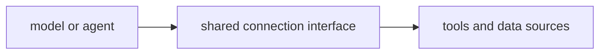

# P5-16.1 MCP와 도구 연결

P5-15.2에서는 에이전트(agent)가 계획, 행동, 관찰의 반복 구조를 가진다는 점을 보았습니다. 그러면 이제 다음 질문이 나옵니다.

이런 도구와 상태를 여러 시스템 사이에서 더 일관되게 연결하려면 무엇이 필요한가?

이 절은 그 질문에 답합니다.

MCP(Model Context Protocol)는 모델, 에이전트, 애플리케이션이 외부 도구와 데이터에 더 일관되게 연결되도록 돕는 인터페이스 관점이다.

같은 말을 더 쉽게 바꾸면 다음과 같습니다.

MCP는 여러 도구와 데이터를 제각각 붙이지 말고, 더 일정한 방식으로 연결하자는 약속에 가깝다.

## 이 절의 범위

이 절은 다음 질문에 답합니다.

- 왜 도구 연결에 표준화된 인터페이스 관점이 필요한가?
- MCP를 어떤 역할로 이해하면 좋은가?
- MCP는 모델 자체가 아니라 어떤 연결 문제를 다루는가?

이 절은 다음 내용은 깊게 다루지 않습니다.

- 프로토콜 메시지 포맷 세부
- 특정 SDK 구현 비교
- 인증/권한 체계 전체 설계

이 절의 목적은 MCP를 제품 유행어처럼 소개하지 않고, `도구 연결을 덜 제각각으로 만들려는 표준화 관점`으로 설명하는 데 있습니다.

## 이 절의 목표

- MCP를 초심자 수준에서 설명할 수 있습니다.
- 모델 능력과 연결 인터페이스를 구분할 수 있습니다.
- 왜 agent와 tool use가 커질수록 연결 표준이 중요해지는지 말할 수 있습니다.
- 다음 절의 하네스(harness) 설명으로 자연스럽게 넘어갈 수 있습니다.

## 왜 표준 연결이 필요해지나

도구 사용이 한두 개일 때는 개별 연결을 직접 만들어도 됩니다. 하지만 에이전트 구조가 커지면 문제가 생깁니다.

초심자는 먼저 다음 세 질문으로 읽으면 좋습니다.

| 질문 | 초심자용 짧은 답 |
| --- | --- |
| 왜 이런 연결 약속이 필요한가? | 도구 수가 늘면 연결 방식이 제각각이 되기 쉬워서 |
| 무엇을 일정하게 맞추려는가? | 도구 설명, 요청 형식, 응답 형식 |
| 그래서 바뀌는 것은 무엇인가? | 모델보다 연결 환경이 덜 혼란스러워진다 |

- 어떤 도구는 파일을 읽고
- 어떤 도구는 검색을 하고
- 어떤 도구는 데이터베이스를 조회하고
- 어떤 도구는 API를 호출하고

이런 연결이 모두 제각각이면, 시스템은 점점 다루기 어려워집니다.

초심자 기준에서는 다음처럼 이해하면 좋습니다.

`도구가 늘어날수록, 모델이 무엇을 쓸 수 있고 어떤 형식으로 써야 하는지를 일정하게 맞추는 방법이 필요해진다.`

서비스 구조 관점으로 다시 말하면, tool use는 `도구를 부른다`에 가깝고, MCP는 `그 도구들을 어떤 공통 형식으로 드러낼까`를 다루는 단계입니다.

## MCP는 무엇을 표준화하려 하나

MCP를 너무 기술 세부로 들어가기 전에, 먼저 역할만 잡으면 충분합니다.

MCP가 다루는 핵심은 다음과 같습니다.

- 어떤 도구가 있는가
- 어떤 데이터나 리소스를 읽을 수 있는가
- 어떤 형식으로 요청하고 응답할 것인가

즉, MCP는 보통 `모델이 더 똑똑해지는 방법`이 아니라, `모델과 외부 시스템이 덜 혼란스럽게 연결되는 방법`으로 읽는 편이 정확합니다.

초심자는 여기서 `능력 향상`과 `연결 정리`를 분리해서 기억하는 것이 중요합니다.

## 왜 모델 자체와 구분해야 하나

이 구분이 중요합니다.

모델은:

- 텍스트를 이해하고 생성하는 능력

을 중심으로 합니다.

반면 MCP 같은 연결 관점은:

- 외부 도구와 데이터에 접근하는 방법
- 그 접근 형식의 일관성

을 중심으로 합니다.

따라서 MCP는 `모델 내부 능력`이 아니라 `주변 실행 환경의 연결 문제`에 가깝습니다.

## 왜 에이전트 시대에 더 중요해졌나

단일 프롬프트 기반 사용에서는 연결 문제가 비교적 단순했습니다. 하지만 agent 구조가 등장하면 다음이 같이 필요해집니다.

- 파일 읽기
- 검색
- 코드 실행
- 데이터 조회
- 상태 전달

이처럼 여러 도구가 한 작업 흐름 안에서 엮일수록, 도구 설명 방식과 호출 방식이 일정해야 시스템이 커지기 쉽습니다.

즉, MCP는 `agent가 더 많은 외부 능력을 다루는 시대`와 함께 중요해진 관점이라고 볼 수 있습니다.

## MCP가 있으면 무엇이 쉬워지나

초심자 기준에서는 너무 과장하지 말고 다음 정도만 잡으면 좋습니다.

- 도구 목록을 일정한 방식으로 드러내기 쉬워짐
- 요청/응답 구조를 더 일관되게 유지하기 쉬워짐
- 여러 시스템을 바꿔도 연결 관점을 재사용하기 쉬워짐

즉, MCP는 `새 능력 생성기`라기보다 `연결 정리 도구`에 가깝습니다.

같은 요청 흐름으로 다시 정리하면 다음과 같습니다.

- 프롬프트: 요청을 적는다
- RAG: 읽을 문서를 붙인다
- 도구 사용: 실행할 기능을 부른다
- 에이전트: 여러 단계를 이어 간다
- MCP: 그 연결들을 더 일정한 형식으로 다루게 돕는다

## MCP도 만능은 아니다

이 점도 같이 넣어야 합니다.

MCP가 있다고 해서:

- 도구 품질이 자동으로 좋아지거나
- 권한 문제가 사라지거나
- 잘못된 호출이 모두 없어지거나
- 평가가 자동 해결되는 것

은 아닙니다.

즉, 연결 형식이 정리되는 것과, 실제 운영 품질이 좋아지는 것은 다른 문제입니다.

## 아주 단순하게 그리면



이 도식의 핵심은 MCP를 `모델과 도구 사이의 연결 계층`으로 읽는 데 있습니다.

## 사례로 보기

### 사례 1. 문서 읽기와 검색을 함께 쓰는 에이전트

파일 읽기 도구와 검색 도구가 따로 있어도, 연결 방식이 일관되면 에이전트가 어떤 자원을 쓸 수 있는지 다루기 쉬워집니다.

### 사례 2. 코딩 에이전트

파일 시스템, 실행기, 검색기, 패치 도구가 같이 들어가면 각각의 호출 방식이 너무 다를 경우 관리가 어려워집니다. 이때 연결 표준 관점이 중요해집니다.

### 사례 3. 조직 내부 시스템 연결

사내 문서 저장소, 업무 DB, 캘린더 API를 함께 쓰는 경우, 각 시스템을 모델 친화적으로 드러내는 일관된 계층이 필요할 수 있습니다.

세 사례를 한 줄로 묶으면 다음과 같습니다.

| 상황 | MCP 관점이 필요한 이유 |
| --- | --- |
| 문서 읽기 + 검색 | 여러 읽기 자원을 같은 식으로 다루기 위해 |
| 코딩 에이전트 | 파일, 실행기, 검색기 호출 방식을 정리하기 위해 |
| 내부 시스템 연결 | 서로 다른 시스템을 공통 인터페이스로 묶기 위해 |

## 작은 Python 예제로 보기

이번 예제의 목표는 실제 프로토콜을 구현하는 것이 아니라, 모델이 직접 도구를 아는 것이 아니라 `연결 정보`를 통해 접근한다는 감각을 보는 것입니다.

입력:

- 도구 목록
- 접근 가능한 리소스

출력:

- 연결 계층 관점

```python
connection_layer = {
    "tools": ["search_docs", "read_file", "run_tests"],
    "resources": ["policy_repository", "codebase_files"],
    "goal": "provide a consistent interface between agent and external systems",
}

print("connection_layer =", connection_layer)
```

실행 결과 예시는 다음처럼 읽을 수 있습니다.

```text
connection_layer = {'tools': ['search_docs', 'read_file', 'run_tests'], 'resources': ['policy_repository', 'codebase_files'], 'goal': 'provide a consistent interface between agent and external systems'}
```

이 예제는 MCP를 특정 구현이 아니라, 도구와 리소스를 일관되게 드러내는 연결 계층으로 이해하게 돕습니다.

이 예제에서 초심자가 읽어야 할 핵심은 다음입니다.

- 모델이 직접 모든 시스템을 제각각 아는 것이 아니라
- 중간 연결 계층을 통해
- 도구와 리소스를 일정하게 본다는 점입니다

## 역사와 커리큘럼 관점

LLM이 실제 작업 환경으로 들어오면서, 문제는 단순히 `모델이 무슨 답을 하는가`를 넘어서 `어떤 시스템과 어떻게 연결되는가`로 이동했습니다. 이 흐름에서 연결 표준과 공통 인터페이스 관점이 점점 더 중요해졌습니다.

커리큘럼 관점에서 이 절이 중요한 이유는 다음과 같습니다.

- agent와 tool use를 시스템 연결 문제까지 확장해 읽게 하고
- 다음 절의 하네스(harness)가 왜 필요한지 준비시키며
- Part 6 프로젝트에서 도구 연결 아키텍처를 설계할 때 재사용할 관점을 제공하기 때문입니다

## 다음 절과의 연결

여기까지 오면 다음 질문이 남습니다.

- 연결 형식이 정리되어도, 실행을 안정적으로 감싸고 로그와 평가를 남기는 구조는 무엇인가?
- 에이전트 실행을 반복 가능하게 관리하려면 무엇이 더 필요한가?

이 질문은 P5-16.2 하네스(harness)로 이어집니다.

## 이 절에서 기억할 관점

- MCP는 모델과 도구/데이터 사이 연결을 더 일관되게 만드는 인터페이스 관점입니다.
- 이것은 모델 능력 자체보다 연결 구조의 문제를 다룹니다.
- agent와 tool use가 커질수록 연결 표준의 중요성이 커집니다.
- 연결 표준이 있다고 해서 운영 품질이 자동 해결되지는 않습니다.

## 체크리스트

- MCP를 초심자 수준에서 설명할 수 있는가?
- 모델 능력과 연결 인터페이스를 구분할 수 있는가?
- 왜 agent 시대에 연결 표준이 중요해졌는지 말할 수 있는가?
- 왜 다음 절에서 하네스를 따로 봐야 하는지 설명할 수 있는가?

## 출처와 참고 자료

- OpenAI, MCP 관련 공식 문서와 소개 자료, 확인 날짜: 2026-06-29.
- 관련 tool integration 및 agent engineering 교육 자료, 확인 날짜: 2026-06-29.
