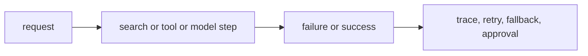

# P5-16.2 운영 중 실패 대응

P5-16.1에서는 AI 서비스가 품질만으로는 성립하지 않고, 비용, 지연 시간, 사용량 제한, 운영 복잡도 안에서 설계되어야 한다는 점을 보았습니다. 그러면 이제 마지막으로 더 직접적인 질문이 남습니다.

실제로 실패가 발생하면 무엇을 어떻게 봐야 하는가?

이 절은 그 질문에 답합니다.

AI 서비스의 실패 대응은 모델 출력만 보는 일이 아니라, 검색, 도구 호출, 실행 흐름, 권한, 로그까지 포함한 전체 경로를 점검하는 일이다.

같은 말을 더 쉽게 바꾸면 다음과 같습니다.

AI 서비스에서 실패를 고친다는 것은 답변 한 줄만 보는 일이 아니라, 그 답이 만들어진 전체 과정을 다시 추적하는 일이다.

## 이 절의 범위

이 절은 다음 질문에 답합니다.

- AI 서비스에서 실패는 어떤 형태로 나타나는가?
- 모델 실패와 시스템 실패는 어떻게 구분해야 하는가?
- 운영 중에는 어떤 대응 기준이 필요한가?

이 절에서는 다음 내용을 깊게 다루지 않습니다.

- 온콜(on-call) 조직 운영 상세
- 장애 등급 체계 전체
- 복잡한 관측성 스택 설계

대신 이 절에서는 Part 5 전체에서 본 프롬프트, RAG, 도구 사용, 에이전트, 평가, 권한 문제를 운영 관점으로 다시 묶습니다. 조직 운영 체계와 대규모 관측성 스택의 세부 설계는 현재 본편 범위 밖으로 두고, `어디를 추적해야 실패 원인을 구분할 수 있는가`까지를 이 절의 회수 범위로 삼습니다.

이 절의 목적은 실패 대응을 단순한 오류 메시지 처리로 축소하지 않고, LLM 서비스 특유의 다단계 실패 구조로 설명하는 데 있습니다.

## 이 절의 목표

- AI 서비스 실패 유형을 입문 수준에서 설명할 수 있습니다.
- 모델 실패와 시스템 실패를 구분할 수 있습니다.
- trace, fallback, retry, approval 같은 대응 수단의 역할을 설명할 수 있습니다.
- Part 5 전체 내용을 운영 관점에서 묶어 볼 수 있습니다.

## 실패는 어디서 생기나

AI 서비스에서는 실패가 한 지점에서만 생기지 않습니다.

먼저 다음 세 질문으로 읽으면 좋습니다.

| 질문 | 짧은 답 |
| --- | --- |
| 실패는 어디서 생길 수 있는가? | 모델, 검색, 도구, 성능, 권한 등 여러 층위 |
| 왜 구분이 필요한가? | 원인마다 대응 방법이 다르기 때문 |
| 그래서 무엇이 중요해지는가? | 실패를 단계별로 좁혀 보는 관찰 |

예를 들어:

- 모델이 사실과 다른 답을 했다
- 검색이 관련 없는 문서를 가져왔다
- 도구 호출이 실패했다
- 함수 인자가 잘못 구성되었다
- 응답은 맞았지만 너무 늦게 왔다

이처럼 실패는 `출력 내용`, `검색`, `실행`, `성능`, `권한` 등 여러 층위에서 생길 수 있습니다.

이 절의 핵심은 `실패 = 틀린 답`으로만 읽지 않는 데 있습니다. 너무 느린 응답, 호출 권한 오류, 잘못된 검색도 모두 운영 관점에서는 실패입니다.

## 모델 실패와 시스템 실패는 어떻게 다른가

이 구분이 중요합니다.

### 모델 실패

- 환각(hallucination)
- 잘못된 요약
- 형식 불일치
- 근거 없는 일반론적 답변

### 시스템 실패

- 검색 누락
- 도구/API 호출 실패
- 데이터 접근 권한 오류
- 타임아웃(timeout)
- 캐시/상태 불일치

이 둘을 구분하지 않으면, 모든 문제를 `모델이 멍청하다`로 뭉뚱그리게 됩니다. 하지만 실제 운영에서는 원인을 더 좁혀야 합니다.

다음처럼 한 줄로 다시 묶으면 좋습니다.

- 모델 실패: 답을 만드는 과정의 내용 문제
- 시스템 실패: 답을 만드는 경로의 연결·실행 문제

## 왜 trace가 중요한가

최종 답만 보면 실패 원인을 알기 어렵습니다. 따라서 운영 중에는 다음 질문을 다시 볼 수 있어야 합니다.

- 어떤 문서를 검색했는가?
- 어떤 도구를 호출했는가?
- 어떤 인자가 들어갔는가?
- 어느 단계에서 시간이 오래 걸렸는가?

이런 정보가 남아 있어야 `검색 실패인지`, `모델 실패인지`, `도구 실패인지`를 구분할 수 있습니다.

즉, trace는 단순 기록이 아니라 실패 분석의 출발점입니다.

서비스 구조 흐름으로 보면, trace는 에이전트와 도구 사용이 많아질수록 더 중요해집니다. 단계가 늘수록 `어디에서 잘못되었는가`를 되짚을 수 있어야 하기 때문입니다.

## retry와 fallback은 왜 필요한가

운영에서는 모든 실패를 완전히 막기보다, 실패했을 때 어떻게 완화할지가 중요합니다.

예를 들어:

- 검색이 실패하면 일반 답변 모드로 전환
- 도구 호출이 실패하면 사용자에게 확인 요청
- 느린 모델이 지연되면 더 작은 모델로 대체
- 외부 API가 실패하면 캐시된 최근 결과 사용

이런 구조를 fallback이라고 볼 수 있습니다.

retry는 일시적 실패를 다시 시도하는 방법입니다. 하지만 무한 재시도는 비용과 지연 시간을 키우므로 한계가 필요합니다.

독자에게는 다음 구분이 특히 중요합니다.

| 대응 수단 | 중심 목적 |
| --- | --- |
| retry | 잠깐의 실패를 다시 시도해 회복 |
| fallback | 원래 경로가 실패했을 때 대체 경로 사용 |
| stop | 더 큰 오류를 막기 위해 진행 중단 |

## 승인(approval)과 권한(permission)은 왜 중요한가

특히 agent 구조에서는 모든 행동을 자동 실행하는 것이 위험할 수 있습니다.

예를 들어:

- 파일 삭제
- 메일 발송
- 외부 시스템 수정
- 비용이 큰 실행

같은 작업은 승인 절차가 필요할 수 있습니다.

즉, 실패 대응은 오류가 난 뒤 수습하는 것만이 아니라, 위험한 실패를 미리 막는 구조도 포함합니다.

이 점 때문에 실패 대응은 `사후 복구`와 `사전 방지`를 함께 포함합니다.

## 아주 단순하게 그리면



이 도식의 핵심은 실패 대응이 최종 출력 뒤의 부가 작업이 아니라, 실행 구조 전체에 들어가야 한다는 점입니다.

## 사례로 보기

### 사례 1. RAG 답변 실패

RAG 답변이 틀렸다고 해 봅시다. 사람은 최종 답이 틀리면 먼저 모델이 멍청했다고 결론내리기 쉽습니다. 하지만 실제로는 `문서를 아예 잘못 찾았는가`, `맞는 문서를 찾았는데 요약 단계에서 잘못 읽었는가`를 구분해야 합니다. trace가 없으면 최종 답 하나만 남고, 검색 실패인지 생성 실패인지가 한 덩어리로 보입니다. 실패 대응 구조가 있으면 검색된 문서 목록, 선택된 문단, 최종 답변을 함께 남겨 어디서 어긋났는지 다시 볼 수 있습니다. 그래서 이 장면에서 중요한 것은 `틀렸다는 사실`보다 `어느 단계가 틀렸는가를 다시 설명할 수 있는가`입니다.

### 사례 2. 에이전트 도구 호출 실패

에이전트가 파일 읽기 도구를 호출했는데 권한 오류가 났다고 해 봅시다. 사람은 수동으로 작업할 때 보통 여기서 멈추고 다른 경로를 찾습니다. 하지만 자동 구조에서는 실패를 모른 척한 채 다음 단계로 넘어가면 없는 내용을 본 것처럼 답을 만들 수 있습니다. 이 경우 문제는 단순 도구 오류가 아니라 `실패 후에도 계속 진행한 실행 정책`입니다. 실패 대응 구조는 어디서 멈출지, 몇 번 다시 시도할지, 실패 시 사람 승인을 받을지를 미리 정해 둡니다. 그래서 도구 호출 실패 사례는 stop condition과 retry 정책이 왜 실행 구조의 일부여야 하는지 보여 줍니다.

### 사례 3. 느린 응답

답변 내용은 맞지만 응답까지 20초가 걸린다고 해 봅시다. 사람은 내용만 맞으면 우선 성공이라고 느끼기 쉽습니다. 하지만 기술적으로는 정답이라도, 사용자는 이미 새로고침을 누르거나 서비스를 떠났을 수 있습니다. 사람이 운영에서 봐야 하는 실패는 `내용 오류`만이 아니라 `기다릴 수 없는 속도`도 포함합니다. 이때 필요한 대응은 더 좋은 문장을 만드는 일이 아니라, timeout 기준, 간단 답변 우선 반환, 나중 상세 답변 같은 fallback 설계일 수 있습니다. 그래서 느린 응답은 `틀린 답`이 아닌데도 서비스 차원에서는 분명한 실패가 될 수 있습니다.

세 사례를 한 줄로 묶으면 다음과 같습니다.

| 상황 | 실패를 읽는 핵심 질문 |
| --- | --- |
| RAG 답변 실패 | 문서가 잘못됐는가, 해석이 잘못됐는가? |
| 에이전트 도구 호출 실패 | 어디서 멈추고 다시 시도할 것인가? |
| 느린 응답 | 내용은 맞아도 서비스로는 실패인가? |

## 작은 Python 예제로 보기

이번 예제의 목표는 실패 대응이 여러 대응 장치를 함께 본다는 점을 감각적으로 보는 것입니다.

입력:

- 하나의 실패 상황

출력:

- 대응 장치 목록

```python
failure_case = {
    "step": "search_docs",
    "error": "timeout",
    "retry": True,
    "fallback": "use cached summary",
    "trace_saved": True,
}

print("failure_case =", failure_case)
```

실행 결과 예시는 다음처럼 읽을 수 있습니다.

```text
failure_case = {'step': 'search_docs', 'error': 'timeout', 'retry': True, 'fallback': 'use cached summary', 'trace_saved': True}
```

이 예제는 실패 대응이 단순히 오류를 띄우는 것이 아니라, 재시도, 대체 경로, 기록 저장을 함께 포함하는 구조라는 점을 보여 줍니다.

이 예제에서 여기서 읽어야 할 핵심은 다음입니다.

- 실패를 발견하고
- 바로 끝내는 것이 아니라
- 재시도, 대체 경로, 기록 저장을 같이 설계해야 한다는 점입니다

## 역사와 커리큘럼 관점

생성형 AI 서비스가 커지면서, 많은 팀이 `정답 생성`보다 `실패를 어떻게 다룰 것인가`에 더 많은 시간을 쓰게 되었습니다. 특히 agent와 tool use 구조에서는 실패가 내용 오류뿐 아니라 실행 오류로도 확장되었기 때문입니다.

이 역사 설명을 다음처럼 받아들이면 충분합니다.

`AI 서비스가 복잡해질수록, 좋은 답을 만드는 일만큼 실패를 안전하게 다루는 일이 중요해졌다.`

커리큘럼 관점에서 이 절이 중요한 이유는 다음과 같습니다.

- Part 5의 프롬프트, RAG, tool use, agent, evaluation을 운영 관점으로 다시 묶어 주고
- 바로 다음 통합 미니 실습과 Part 6 프로젝트에서 단순 기능 구현이 아니라 실패 대응까지 설계하게 만들며
- `AI를 쓴다`와 `AI 서비스를 운영한다`의 차이를 분명히 보여 주기 때문입니다

## 다음 장으로 이어 가며

여기까지 오면 Part 5의 핵심 흐름이 한 줄로 묶입니다.

- 토큰과 임베딩
- LLM 발전사와 구조
- 사전학습, 파인튜닝, 정렬
- 프롬프트, RAG, 벡터 검색
- 도구 사용, 에이전트, MCP, 하네스
- 평가, 비용, 실패 대응

즉, LLM은 더 이상 `문장 생성 모델 하나`로만 설명되지 않습니다. 실제로는 검색, 도구, 실행, 평가, 운영을 함께 봐야 하는 서비스 구조입니다.

이제 마지막으로 남은 일은 이 구조를 아주 작은 기능 흐름으로 다시 묶어 보는 것입니다. 다음 장에서는 `모델 호출`, `검색`, `기록`이 어떻게 한 요청 경로로 연결되는지 통합 미니 실습으로 확인합니다.

## 이 절에서 기억할 관점

- AI 서비스 실패는 모델 오류와 시스템 오류를 함께 포함합니다.
- trace, retry, fallback, approval은 핵심 대응 장치입니다.
- 실패 대응은 출력 뒤 수습이 아니라 실행 구조 안에 들어가야 합니다.
- 이 절은 통합 미니 실습과 Part 6 프로젝트에서 실제 설계 판단으로 이어지는 운영 관점의 연결 절입니다.

## 체크리스트

- AI 서비스 실패 유형을 입문 수준에서 설명할 수 있는가?
- 모델 실패와 시스템 실패를 구분할 수 있는가?
- 왜 trace, retry, fallback이 필요한지 설명할 수 있는가?
- 왜 Part 6에서 기능 구현뿐 아니라 운영 판단도 필요해지는지 말할 수 있는가?

## 출처와 참고 자료

- OpenAI, Agents/evaluation/observability 관련 공식 문서, 확인 날짜: 2026-06-29.
- 관련 LLM application engineering 운영 자료, 확인 날짜: 2026-06-29.
