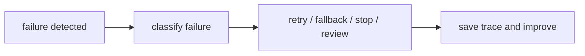

# P5-16.2 운영 중 실패 대응

P5-16.1에서는 AI 서비스가 품질만으로는 성립하지 않고, 비용, 지연 시간, 사용량 제한, 운영 복잡도 안에서 설계되어야 한다는 점을 보았습니다. 이 절에서는 실제로 실패가 발생했을 때 무엇을 어떻게 봐야 하는지 다룹니다.

AI 서비스의 실패 대응은 모델 출력만 보는 일이 아니라, 검색, 도구 호출, 실행 흐름, 권한, 로그까지 포함한 전체 경로를 점검하는 일입니다. 즉, 답변 한 줄만 보는 것이 아니라 그 답이 만들어진 전체 과정을 다시 추적하는 일에 가깝습니다.

## 이 절의 범위

이 절은 다음 질문에 답합니다.

- AI 서비스에서 실패는 어떤 형태로 나타나는가?
- 모델 실패와 시스템 실패는 어떻게 구분해야 하는가?
- 운영 중에는 어떤 대응 기준이 필요한가?

이 절에서는 다음 내용을 깊게 다루지 않습니다.

- 온콜(on-call) 조직 운영 상세
- 장애 등급 체계 전체
- 복잡한 관측성 스택 설계

대신 이 절에서는 Part 5 전체에서 본 프롬프트, RAG, 도구 사용, 에이전트, 평가, 권한 문제를 운영 관점으로 다시 묶습니다. 조직 운영 체계와 대규모 관측성 스택의 세부 설계는 현재 본편 범위 밖으로 두고, `어디를 추적해야 실패 원인을 구분할 수 있는가`까지를 이 절의 회수 범위로 삼습니다.

이 절에서는 실패 대응을 단순한 오류 메시지 처리로 축소하지 않고, LLM 서비스 특유의 다단계 실패 구조로 설명합니다.

지금 읽는 층위는 `운영 복구 층위`입니다. 앞 절의 자동 평가와 사람 평가는 `무엇이 좋은 답인가`를 가르는 기준을 다뤘다면, 여기서는 `문제가 났을 때 어떤 경로로 멈추고, 다시 시도하고, 사람에게 넘길 것인가`로 질문이 바뀝니다. 아직 조직 운영 체계 전체를 설계하는 단계까지는 가지 않고, 뒤의 P5-17에서는 이 운영 판단을 하나의 작은 기능 흐름과 회고 기록으로 다시 묶습니다.

이 전환을 먼저 잡아 두면, 평가와 운영을 같은 말로 섞지 않게 됩니다. 평가는 `이 답을 채택할 수 있는가`를 가르는 단계이고, 실패 대응은 `채택할 수 없거나 실행이 끊겼을 때 어떤 복구 경로를 탈 것인가`를 가르는 단계입니다.

| 단계 | 지금 잡아야 할 질문 | 이 질문을 본 위치 |
| --- | --- | --- |
| 평가 | 이 답을 품질 기준으로 통과시킬 수 있는가? | P5-15.1, P5-15.2 |
| 운영 복구 | 실패가 났을 때 retry, fallback, stop, approval 중 어디로 보낼 것인가? | P5-16.1, P5-16.2 |
| 요청 흐름 통합 | 이 판단과 기록을 실제 요청 흐름에 어떻게 남길 것인가? | P5-17.1, P5-17.2 |

처음 읽을 때는 Part 5 뒤쪽 본류를 `평가 기준을 세운다 -> 운영 한도와 실패 경로를 정한다 -> 그 판단을 실제 기록으로 남긴다` 정도로만 잡아도 충분합니다.

즉, 이 절에서 가장 짧게 붙잡아야 할 닫힘 구조는 `좋은 답 판단 -> 실패 경로 결정 -> 기록 가능한 요청 흐름`입니다. 여기서는 그 가운데 단계인 `실패 경로 결정`을 맡고 있고, 바로 다음 절에서 이 판단이 run record와 회고 항목으로 어떻게 남는지 닫습니다.

이 연결을 한 번 더 고정하면 다음처럼 읽을 수 있습니다.

| 바로 앞 단계에서 이미 세운 것 | 지금 여기서 추가하는 것 | 바로 다음 단계에서 닫는 것 |
| --- | --- | --- |
| 좋은 답을 고르는 기준 | 실패 시 retry, fallback, stop, approval 중 어디로 갈지 | 이 운영 판단을 실제 요청 흐름과 기록 필드로 남기는 것 |
| 자동 게이트와 사람 검토 결과 | 운영 한도와 복구 경로 | run record, trace, incident_records |

핵심은 평가 뒤에 운영이 덧붙는 것이 아니라, 좋은 답 판단이 실제 서비스 경로를 만나면서 비로소 Part 5 본류 마지막 단계로 닫히기 시작한다는 점입니다.

처음 읽을 때는 아래 세 줄만 바로 구분해도 충분합니다.

| 지금 이 절에서 먼저 못 박을 것 | 아직 여기서 끝내지 않는 것 | 바로 다음 장으로 넘길 것 |
| --- | --- | --- |
| 실패 시 retry, fallback, stop, approval 중 어디로 갈지 정한다 | 이 판단을 요청 흐름 기록으로 완전히 정리하지 않는다 | P5-17에서 run record와 회고 구조로 남긴다 |
| 운영 복구 경로를 고른다 | 프로젝트 산출물 형태로 정리하지 않는다 | 기록 가능한 요청 흐름으로 닫는다 |

## 이 절의 목표

- AI 서비스 실패 유형을 입문 수준에서 설명할 수 있습니다.
- 모델 실패와 시스템 실패를 구분할 수 있습니다.
- trace, fallback, retry, approval 같은 대응 수단의 역할을 설명할 수 있습니다.
- Part 5 전체 내용을 운영 관점에서 묶어 볼 수 있습니다.

## 이 절을 읽는 순서

이 절은 다음 순서로 읽으면 대응 기준이 더 분명해집니다.

1. 먼저 실패가 어디서 생기는지와 모델 실패, 시스템 실패를 구분합니다.
2. 그다음 trace, retry, fallback, approval이 왜 필요한지 읽습니다.
3. 사례와 Python 예제에서는 `어떤 실패를 다시 시도하고`, `어떤 실패를 멈추고`, `어떤 실패를 사람에게 넘겨야 하는가`를 확인합니다.

## 실패는 어디서 생기나

AI 서비스에서는 실패가 한 지점에서만 생기지 않습니다.

먼저 다음 세 질문으로 읽으면 좋습니다.

| 질문 | 짧은 답 |
| --- | --- |
| 실패는 어디서 생길 수 있는가? | 모델, 검색, 도구, 성능, 권한 등 여러 층위 |
| 왜 구분이 필요한가? | 원인마다 대응 방법이 다르기 때문 |
| 그래서 무엇이 중요해지는가? | 실패를 단계별로 좁혀 보는 관찰 |

예를 들어:

- 모델이 사실과 다른 답을 했다
- 검색이 관련 없는 문서를 가져왔다
- 도구 호출이 실패했다
- 함수 인자가 잘못 구성되었다
- 응답은 맞았지만 너무 늦게 왔다

이처럼 실패는 `출력 내용`, `검색`, `실행`, `성능`, `권한` 등 여러 층위에서 생길 수 있습니다.

이 절의 핵심은 `실패 = 틀린 답`으로만 읽지 않는 데 있습니다. 너무 느린 응답, 호출 권한 오류, 잘못된 검색도 모두 운영 관점에서는 실패입니다.

## 모델 실패와 시스템 실패는 어떻게 다른가

이 구분이 중요합니다.

### 모델 실패

- 환각(hallucination)
- 잘못된 요약
- 형식 불일치
- 근거 없는 일반론적 답변

### 시스템 실패

- 검색 누락
- 도구/API 호출 실패
- 데이터 접근 권한 오류
- 타임아웃(timeout)
- 캐시/상태 불일치

이 둘을 구분하지 않으면, 모든 문제를 `모델이 멍청하다`로 뭉뚱그리게 됩니다. 하지만 실제 운영에서는 원인을 더 좁혀야 합니다.

다음처럼 한 줄로 다시 묶으면 좋습니다.

- 모델 실패: 문서를 읽고도 요약·추론·표현 단계에서 내용이 어긋난 문제
- 시스템 실패: 검색, 도구 호출, 권한, 후처리처럼 답을 만드는 경로 자체가 끊긴 문제

## 왜 trace가 중요한가

최종 답만 보면 실패 원인을 알기 어렵습니다. 따라서 운영 중에는 다음 질문을 다시 볼 수 있어야 합니다.

- 어떤 문서를 검색했는가?
- 어떤 도구를 호출했는가?
- 어떤 인자가 들어갔는가?
- 어느 단계에서 시간이 오래 걸렸는가?

이런 정보가 남아 있어야 `검색 실패인지`, `모델 실패인지`, `도구 실패인지`를 구분할 수 있습니다.

즉, trace는 단순 기록이 아니라 실패 분석의 출발점입니다.

서비스 구조 흐름으로 보면, trace는 에이전트와 도구 사용이 많아질수록 더 중요해집니다. 단계가 늘수록 `어디에서 잘못되었는가`를 되짚을 수 있어야 하기 때문입니다.

## retry와 fallback은 왜 필요한가

운영에서는 모든 실패를 완전히 막기보다, 실패했을 때 어떻게 완화할지가 중요합니다.

예를 들어:

- 검색이 실패하면 일반 답변 모드로 전환
- 도구 호출이 실패하면 사용자에게 확인 요청
- 느린 모델이 지연되면 더 작은 모델로 대체
- 외부 API가 실패하면 캐시된 최근 결과 사용

이런 구조를 fallback이라고 볼 수 있습니다.

retry는 일시적 실패를 다시 시도하는 방법입니다. 하지만 무한 재시도는 비용과 지연 시간을 키우므로 한계가 필요합니다.

독자에게는 다음 구분이 특히 중요합니다.

| 대응 수단 | 중심 목적 |
| --- | --- |
| retry | 잠깐의 실패를 다시 시도해 회복 |
| fallback | 원래 경로가 실패했을 때 대체 경로 사용 |
| stop | 더 큰 오류를 막기 위해 진행 중단 |

## 서비스 체크리스트로 다시 묶으면

P5-15.2의 자동 평가와 사람 평가, P5-16.1의 운영 제약, 지금 절의 실패 대응을 실제 운영 순서로 다시 묶으면 다음 네 줄이 먼저 보여야 합니다.

| 운영 단계 | 먼저 확인할 질문 | 남겨야 할 대표 기록 |
| --- | --- | --- |
| 자동 게이트 | 형식, 출처 힌트, 금지 표현, 기본 길이 조건을 통과하는가? | `answer_status`, 자동 점검 결과 |
| 사람 검토 | 말투, 오해 가능성, 다음 행동 이해도, 예외 해석이 괜찮은가? | `review_summary`, 검토 의견 |
| 운영 한도 확인 | latency, cost, retry 횟수, 처리량 한도를 버티는가? | 실행 시간, 호출 수, 비용 요약 |
| 실패 대응 | retry, fallback, stop, approval 중 어느 경로로 갈 것인가? | `incident_records`, `next_action`, trace |

이 표의 핵심은 `평가`와 `운영`을 따로 읽지 않는 데 있습니다. 좋은 답처럼 보여도 자동 게이트를 못 넘기면 배포 후보가 아니고, 자동 게이트를 통과해도 사람이 읽었을 때 오해를 만들면 수정이 필요합니다. 또 둘 다 좋아 보여도 latency나 cost를 못 버티면 운영안으로는 탈락할 수 있고, 실제 실패가 났을 때 trace와 `next_action`이 없으면 같은 문제를 반복하게 됩니다.

즉, Part 5 뒤쪽을 실제 서비스 판단으로 줄이면 다음 한 문장으로 묶을 수 있습니다.

`자동으로 거를 것 -> 사람이 끝까지 볼 것 -> 운영 한도 안에 있는지 볼 것 -> 실패 시 어떤 경로로 남길지 정할 것`

## 승인(approval)과 권한(permission)은 왜 중요한가

특히 agent 구조에서는 모든 행동을 자동 실행하는 것이 위험할 수 있습니다.

예를 들어:

- 파일 삭제
- 메일 발송
- 외부 시스템 수정
- 비용이 큰 실행

같은 작업은 승인 절차가 필요할 수 있습니다.

즉, 실패 대응은 오류가 난 뒤 수습하는 것만이 아니라, 위험한 실패를 미리 막는 구조도 포함합니다.

이 점 때문에 실패 대응은 `사후 복구`와 `사전 방지`를 함께 포함합니다.

이 흐름을 한 번 더 단순화하면 다음과 같습니다.



이 그림의 핵심은 실패 대응이 오류 문구를 보여 주고 끝나는 것이 아니라, 실패를 분류하고 대응 경로를 고른 뒤 흔적을 남겨 다음 개선으로 이어지는 구조라는 점입니다.

핵심은 실패 대응이 최종 출력 뒤의 부가 작업이 아니라, 실행 구조 전체에 들어가야 한다는 점입니다.

## 사례로 보기

사례를 읽을 때는 `실패가 났는가`보다 `실패 뒤에 경로가 어떻게 갈라져야 하는가`를 중심으로 보면 좋습니다.

### 사례 1. RAG 답변 실패

RAG 답변이 틀렸다고 해 봅시다. 사람은 최종 답이 틀리면 먼저 모델이 멍청했다고 결론내리기 쉽습니다. 하지만 실제로는 `문서를 아예 잘못 찾았는가`, `맞는 문서를 찾았는데 요약 단계에서 잘못 읽었는가`를 구분해야 합니다. trace가 없으면 최종 답 하나만 남고, 검색 실패인지 생성 실패인지가 한 덩어리로 보입니다. 예를 들어 검색 후보에 최신 공지가 아예 없었다면 retrieval 문제이고, 최신 공지를 찾았는데 예외 조항을 빼먹었다면 reading 문제입니다. 이 둘을 구분하지 못하면 같은 실패가 반복돼도 검색을 고쳐야 하는지 프롬프트를 고쳐야 하는지 판단할 수 없습니다. 여기서 바뀌는 점은 `최종 답이 틀렸는가`만 보는 기준에서 `어느 단계에서 틀어졌는가`를 분해해 보는 기준으로 이동한다는 것입니다. 실패 대응 구조가 있으면 검색된 문서 목록, 선택된 문단, 최종 답변을 함께 남겨 어디서 어긋났는지 다시 볼 수 있습니다. 그래서 이 사례에서 확인해야 할 결과는 `틀렸다`는 사실만 남는 것이 아니라, 검색 실패인지 해석 실패인지 어느 단계가 어긋났는지를 실제로 다시 설명할 수 있는가입니다.

### 사례 2. 에이전트 도구 호출 실패

에이전트가 파일 읽기 도구를 호출했는데 권한 오류가 났다고 해 봅시다. 사람은 수동으로 작업할 때 보통 여기서 멈추고 다른 경로를 찾습니다. 하지만 자동 구조에서는 실패를 모른 척한 채 다음 단계로 넘어가면 없는 내용을 본 것처럼 답을 만들 수 있습니다. 예를 들어 설정 파일을 못 읽었는데도 `설정을 확인했다`는 전제로 패치를 제안하면, 오류 하나가 바로 허위 작업 기록으로 이어질 수 있습니다. 그 상태로 실제 수정까지 진행하면 잘못된 전제를 바탕으로 저장소를 더 망가뜨릴 수도 있습니다. 이 경우 문제는 단순 도구 오류가 아니라 `실패 후에도 계속 진행한 실행 정책`입니다. 여기서 바뀌는 점은 `오류가 났다`는 사실만 보는 기준에서 `오류 뒤에 경로가 실제로 멈춤·재시도·승인 대기로 바뀌는가`를 보는 기준으로 이동한다는 것입니다. 실패 대응 구조는 어디서 멈출지, 몇 번 다시 시도할지, 실패 시 사람 승인을 받을지를 미리 정해 둡니다. 그래서 이 사례에서 확인해야 할 결과는 권한 오류 뒤에 거짓 성공 흐름으로 계속 가지 않고, 실제로 멈춤·재시도·사람 승인 중 하나로 경로가 바뀌는가입니다.

### 사례 3. 느린 응답

답변 내용은 맞지만 응답까지 20초가 걸린다고 해 봅시다. 사람은 내용만 맞으면 우선 성공이라고 느끼기 쉽습니다. 하지만 기술적으로는 정답이라도, 사용자는 이미 새로고침을 누르거나 서비스를 떠났을 수 있습니다. 예를 들어 긴 문서 분석 요청이라면 기다릴 수도 있지만, 단순 정책 확인 질문에서 20초는 이미 실패에 가깝습니다. 사람이 운영에서 봐야 하는 실패는 `내용 오류`만이 아니라 `기다릴 수 없는 속도`도 포함합니다. 응답이 너무 늦으면 맞는 답도 읽히지 못한 채 버려질 수 있습니다. 여기서 바뀌는 점은 `내용이 맞는가`만 보는 기준에서 `사용 가능한 시간 안에 도착하는가`를 함께 보는 기준으로 이동한다는 것입니다. 이때 필요한 대응은 더 좋은 문장을 만드는 일이 아니라, timeout 기준, 간단 답변 우선 반환, 나중 상세 답변 같은 fallback 설계일 수 있습니다. 그래서 이 사례에서 확인해야 할 결과는 정답 여부와 별개로 사용자가 기다릴 수 있는 시간 안에 최소한의 답을 실제로 받는가입니다.

세 사례를 한 줄로 묶으면 다음과 같습니다.

| 상황 | 실패를 읽는 핵심 질문 |
| --- | --- |
| RAG 답변 실패 | 문서가 잘못됐는가, 해석이 잘못됐는가? |
| 에이전트 도구 호출 실패 | 어디서 멈추고 다시 시도할 것인가? |
| 느린 응답 | 내용은 맞아도 서비스로는 실패인가? |

세 사례를 대응 흐름 관점으로 다시 묶으면 다음과 같습니다.

| 상황 | 먼저 남겨야 하는 관찰 기록 | 다음에 고쳐야 하는 지점 |
| --- | --- | --- |
| RAG 답변 실패 | 검색 후보, 선택 문단, 최종 답변 | retrieval, reading, prompt 중 어디가 틀렸는지 |
| 에이전트 도구 호출 실패 | 오류 종류, 재시도 횟수, 승인 여부 | stop 규칙, retry 정책, 권한 처리 |
| 느린 응답 | 단계별 지연 시간, fallback 사용 여부 | timeout 기준, 간단 답 우선 반환, 경량 경로 |

## 실행 가능한 Python 예제로 보기

이번 예제의 목표는 실패 대응이 `에러가 났다`에서 끝나는 것이 아니라, 재시도, fallback, stop 분기가 실제로 나뉘고 각 경우에 다음 운영 조치가 달라진다는 점을 보는 것입니다. 이번에는 실패 사례 하나만 보지 않고, `시스템 실패`와 `모델 실패`를 함께 넣어 어떤 경우에 retry가 맞고 어떤 경우에 fallback, 사람 검토, 모델 수정이 맞는지 비교하겠습니다.

문제 상황:

- 검색 단계에서 timeout이 발생할 수 있음
- 도구 호출 단계에서는 permission error가 날 수 있음
- 답변 단계에서는 근거 문서를 읽고도 환각이나 형식 불일치가 날 수 있음
- 어떤 경우에는 한 번 더 시도할 수 있고
- 어떤 경우에는 캐시 요약으로 fallback 하거나 사람 검토로 멈춰야 함

입력:

- 여러 개의 실패 상황
- 재시도 허용 횟수와 캐시 사용 가능 여부
- 사람 검토 가능 여부와 근거 문서 존재 여부

출력:

- 실패 유형별 최종 대응 결정
- retry 여부
- fallback 여부
- 사람 검토 전환 여부
- 어떤 실패가 모델 수정 과제이고 어떤 실패가 시스템 복구 과제인지에 대한 요약값
- 각 실패 유형에 대해 운영자가 바로 해야 할 다음 조치

먼저 이 예제에서 함께 볼 대응 기준은 다음과 같습니다.

| 점검 항목 | 왜 필요한가 |
| --- | --- |
| `failure_family` | 모델 실패와 시스템 실패를 섞어 보지 않기 위해 |
| `decision` | retry, fallback, stop, fix 중 어떤 경로를 탈지 남기기 위해 |
| `next_action` | 운영자가 다음에 무엇을 해야 하는지 바로 읽기 위해 |
| `trace_saved` | 실패 원인을 나중에 다시 재현하고 분석할 수 있어야 해서 |
| `user_impact` | 사용자 경험을 즉시 보호해야 하는 실패인지 구분해야 해서 |

문제 상황:

- 운영 실패는 모두 같은 종류가 아니므로 모델 오류와 시스템 오류를 구분해 다음 대응을 정해야 한다

입력(input):

위에 정리한 failure case 목록을 사용합니다.

확인할 개념:

- 운영 실패는 모델 오류와 시스템 오류를 구분해야 적절한 복구 절차와 사용자 대응을 정할 수 있다

```python
from pprint import pprint


failure_cases = [
    {
        "name": "timeout_retry",
        "failure_family": "system",
        "step": "search_docs",
        "error": "timeout",
        "retry_count": 1,
        "max_retries": 2,
        "cached_summary_available": True,
        "trace_saved": True,
    },
    {
        "name": "timeout_fallback",
        "failure_family": "system",
        "step": "search_docs",
        "error": "timeout",
        "retry_count": 2,
        "max_retries": 2,
        "cached_summary_available": True,
        "trace_saved": True,
    },
    {
        "name": "timeout_escalate",
        "failure_family": "system",
        "step": "search_docs",
        "error": "timeout",
        "retry_count": 2,
        "max_retries": 2,
        "cached_summary_available": False,
        "trace_saved": True,
    },
    {
        "name": "permission_stop",
        "failure_family": "system",
        "step": "read_file",
        "error": "permission_error",
        "retry_count": 0,
        "max_retries": 2,
        "cached_summary_available": False,
        "trace_saved": True,
        "human_review_available": True,
        "grounding_available": False,
    },
    {
        "name": "hallucination_review",
        "failure_family": "model",
        "step": "answer_generation",
        "error": "hallucination",
        "retry_count": 0,
        "max_retries": 1,
        "cached_summary_available": False,
        "trace_saved": True,
        "human_review_available": True,
        "grounding_available": True,
    },
    {
        "name": "format_fix",
        "failure_family": "model",
        "step": "answer_generation",
        "error": "format_mismatch",
        "retry_count": 0,
        "max_retries": 1,
        "cached_summary_available": False,
        "trace_saved": True,
        "human_review_available": False,
        "grounding_available": True,
    },
]


def decide_recovery(case):
    if case["error"] == "hallucination":
        return {
            "decision": "human_review",
            "next_action": "compare_with_grounding",
            "trace_saved": case["trace_saved"],
            "user_impact": "potential_wrong_answer",
        }
    if case["error"] == "format_mismatch":
        return {
            "decision": "model_fix",
            "next_action": "tighten_prompt_or_parser",
            "trace_saved": case["trace_saved"],
            "user_impact": "delivery_blocked_until_format_fixed",
        }
    if case["error"] == "permission_error":
        return {
            "decision": "stop_and_escalate",
            "next_action": "ask_human_review",
            "trace_saved": case["trace_saved"],
            "user_impact": "unsafe_to_continue",
        }
    if case["retry_count"] < case["max_retries"]:
        return {
            "decision": "retry",
            "next_action": "search_docs_again",
            "trace_saved": case["trace_saved"],
            "user_impact": "temporary_delay",
        }
    if case["cached_summary_available"]:
        return {
            "decision": "fallback",
            "next_action": "use_cached_summary",
            "trace_saved": case["trace_saved"],
            "user_impact": "reduced_freshness_but_service_continues",
        }
    return {
        "decision": "stop_and_escalate",
        "next_action": "ask_human_review",
        "trace_saved": case["trace_saved"],
        "user_impact": "service_stopped_for_this_request",
    }


reports = []
for case in failure_cases:
    recovery = decide_recovery(case)
    reports.append(
        {
            "name": case["name"],
            "failure_family": case["failure_family"],
            "failure_case": case,
            "recovery": recovery,
        }
    )

summary = {
    "retry_count": sum(report["recovery"]["decision"] == "retry" for report in reports),
    "fallback_count": sum(report["recovery"]["decision"] == "fallback" for report in reports),
    "human_review_count": sum(report["recovery"]["decision"] == "human_review" for report in reports),
    "stop_and_escalate_count": sum(report["recovery"]["decision"] == "stop_and_escalate" for report in reports),
    "model_fix_count": sum(report["recovery"]["decision"] == "model_fix" for report in reports),
    "system_failure_count": sum(report["failure_family"] == "system" for report in reports),
    "model_failure_count": sum(report["failure_family"] == "model" for report in reports),
}

print("[summary]")
print(summary)
print()

for report in reports:
    print("=" * 80)
    print(f"[{report['name']}]")
    print("failure_family =", report["failure_family"])
    print("failure_case =")
    pprint(report["failure_case"])
    print("recovery =")
    pprint(report["recovery"])
    print()
```

실행 결과 예시는 다음처럼 읽을 수 있습니다.

```text
[summary]
{'retry_count': 1,
 'fallback_count': 1,
 'human_review_count': 1,
 'stop_and_escalate_count': 2,
 'model_fix_count': 1,
 'system_failure_count': 4,
 'model_failure_count': 2}

================================================================================
[timeout_retry]
failure_family = system
failure_case =
{'cached_summary_available': True,
 'error': 'timeout',
 'failure_family': 'system',
 'max_retries': 2,
 'name': 'timeout_retry',
 'retry_count': 1,
 'step': 'search_docs',
 'trace_saved': True}
recovery =
{'decision': 'retry',
 'next_action': 'search_docs_again',
 'trace_saved': True,
 'user_impact': 'temporary_delay'}

================================================================================
[timeout_fallback]
failure_family = system
failure_case =
{'cached_summary_available': True,
 'error': 'timeout',
 'failure_family': 'system',
 'max_retries': 2,
 'name': 'timeout_fallback',
 'retry_count': 2,
 'step': 'search_docs',
 'trace_saved': True}
recovery =
{'decision': 'fallback',
 'next_action': 'use_cached_summary',
 'trace_saved': True,
 'user_impact': 'reduced_freshness_but_service_continues'}

================================================================================
[timeout_escalate]
failure_family = system
failure_case =
{'cached_summary_available': False,
 'error': 'timeout',
 'failure_family': 'system',
 'max_retries': 2,
 'name': 'timeout_escalate',
 'retry_count': 2,
 'step': 'search_docs',
 'trace_saved': True}
recovery =
{'decision': 'stop_and_escalate',
 'next_action': 'ask_human_review',
 'trace_saved': True,
 'user_impact': 'service_stopped_for_this_request'}

================================================================================
[permission_stop]
failure_family = system
failure_case =
{'cached_summary_available': False,
 'error': 'permission_error',
 'failure_family': 'system',
 'grounding_available': False,
 'human_review_available': True,
 'max_retries': 2,
 'name': 'permission_stop',
 'retry_count': 0,
 'step': 'read_file',
 'trace_saved': True}
recovery =
{'decision': 'stop_and_escalate',
 'next_action': 'ask_human_review',
 'trace_saved': True,
 'user_impact': 'unsafe_to_continue'}

================================================================================
[hallucination_review]
failure_family = model
failure_case =
{'cached_summary_available': False,
 'error': 'hallucination',
 'failure_family': 'model',
 'grounding_available': True,
 'human_review_available': True,
 'max_retries': 1,
 'name': 'hallucination_review',
 'retry_count': 0,
 'step': 'answer_generation',
 'trace_saved': True}
recovery =
{'decision': 'human_review',
 'next_action': 'compare_with_grounding',
 'trace_saved': True,
 'user_impact': 'potential_wrong_answer'}

================================================================================
[format_fix]
failure_family = model
failure_case =
{'cached_summary_available': False,
 'error': 'format_mismatch',
 'failure_family': 'model',
 'grounding_available': True,
 'human_review_available': False,
 'max_retries': 1,
 'name': 'format_fix',
 'retry_count': 0,
 'step': 'answer_generation',
 'trace_saved': True}
recovery =
{'decision': 'model_fix',
 'next_action': 'tighten_prompt_or_parser',
 'trace_saved': True,
 'user_impact': 'delivery_blocked_until_format_fixed'}
```

이 예제에서 먼저 봐야 할 것은 `system`과 `model` 실패가 같은 표에서 다르게 갈라지고, `user_impact`와 `next_action`이 그 차이를 실제 운영 판단으로 바꿔 준다는 점입니다. `timeout`과 `permission_error`는 실행 경로를 복구하거나 멈추는 문제이고, `hallucination`과 `format_mismatch`는 검색 재시도보다 사람 검토나 프롬프트/파서 수정이 더 먼저인 문제입니다.

그래서 이 예제에서 확인해야 할 결과는 실패가 났을 때 응답이 그냥 중단되는 것이 아니라, 재시도, 대체 경로, 사람 검토 전환, 모델 수정 같은 분기가 실제로 따로 설계된다는 점입니다. 특히 `timeout`이라고 해도 retry 가능 횟수와 캐시 존재 여부에 따라 다른 경로를 타고, `permission_error`처럼 재시도보다 즉시 중단이 맞는 오류, `hallucination`처럼 근거 비교가 먼저 필요한 오류도 따로 구분해야 한다는 점이 중요합니다.

이 예제에서 읽어야 할 핵심은 다음입니다.

- 실패를 발견하고
- 바로 끝내는 것이 아니라
- 재시도, 대체 경로, 기록 저장, 사람 전환, 모델 수정 경로를 같이 설계해야 한다는 점입니다
- 같은 실패처럼 보여도 오류 종류와 남은 복구 수단에 따라 대응이 달라져야 한다는 점입니다

이 예제에서 독자가 직접 해 볼 수 있는 조정은 다음과 같습니다.

- `max_retries`를 줄여 retry보다 fallback이나 중단이 더 빨리 열리는지 보기
- `cached_summary_available`를 바꿔 같은 timeout이라도 어떤 경로를 타는지 비교해 보기
- 다른 실패 유형 `rate_limit`, `tool_not_found`, `wrong_citation`을 넣어 어떤 오류가 시스템 복구인지 모델 수정인지 비교해 보기

## 이 예제를 복구 설계 관점으로 다시 보면

이 예제는 실패 대응을 단순한 예외 처리 한 줄로 보지 않게 해 줍니다. 실제 운영에서는 오류를 `어떻게 복구할 것인가`, `어떤 흔적을 남길 것인가`, `사용자 경험을 어디까지 유지할 것인가`까지 함께 설계해야 하므로, 실패 장면은 곧 복구 구조를 점검하는 장면이 됩니다.

여기까지를 한 줄로 묶으면, 운영 중 실패 대응은 `에러를 잡는 일`이 아니라 `실패를 분류해 적절한 복구 경로와 다음 조치를 고르고, 그 흔적을 남겨 다시 개선하는 일`입니다.

생성형 AI 서비스가 커지면서, 많은 팀이 `정답 생성`보다 `실패를 어떻게 다룰 것인가`에 더 많은 시간을 쓰게 되었습니다. 특히 agent와 tool use 구조에서는 실패가 내용 오류뿐 아니라 실행 오류로도 확장되었기 때문입니다.

이 역사 설명을 다음처럼 받아들이면 충분합니다.

`AI 서비스가 복잡해질수록, 좋은 답을 만드는 일만큼 실패를 안전하게 다루는 일이 중요해졌다.`

커리큘럼 관점에서 이 절이 중요한 이유는 다음과 같습니다.

- 바로 앞의 P5-16.1 서비스 운영 제약을 `무엇을 조심해야 하는가`에서 `실패가 났을 때 어디를 추적해야 하는가`로 더 구체화하고
- Part 5의 프롬프트, RAG, tool use, agent, evaluation을 운영 관점으로 다시 묶어 주고
- 바로 다음 통합 미니 실습과 Part 6 프로젝트에서 단순 기능 구현이 아니라 실패 대응까지 설계하게 만들며
- `AI를 쓴다`와 `AI 서비스를 운영한다`의 차이를 분명히 보여 주기 때문입니다

## 다음 장과의 연결

여기까지 오면 Part 5의 핵심 흐름이 한 줄로 묶입니다.

- 토큰과 임베딩
- LLM 발전사와 구조
- 사전학습, 파인튜닝, 정렬
- 프롬프트, RAG, 벡터 검색
- 도구 사용, 에이전트, MCP, 하네스
- 평가, 비용, 실패 대응

즉, LLM은 더 이상 `문장 생성 모델 하나`로만 설명되지 않습니다. 실제로는 검색, 도구, 실행, 평가, 운영을 함께 봐야 하는 서비스 구조입니다.

이제 마지막으로 남은 일은 이 구조를 아주 작은 기능 흐름으로 다시 묶어 보는 것입니다. 다음 장에서는 `모델 호출`, `검색`, `기록`이 어떻게 한 요청 경로로 연결되는지 통합 미니 실습으로 확인합니다.

## 이 절에서 기억할 관점

| 지금 이 절에서 정리한 것 | 바로 다음에 붙는 질문 | 이 본류 단계가 닫는 역할 |
| --- | --- | --- |
| 실패를 분류하고 retry, fallback, human review 같은 복구 경로를 정한다 | 이 운영 판단을 실제 요청 하나의 흐름과 기록으로 어떻게 남길까 | Part 5 후반이 `나쁜 경우를 어떻게 통제할까`를 운영 구조로 닫는 단계 |

- AI 서비스 실패는 모델 오류와 시스템 오류를 함께 포함합니다.
- trace, retry, fallback, approval은 핵심 대응 장치입니다.
- 실패 대응은 출력 뒤 수습이 아니라 실행 구조 안에 들어가야 합니다.
- 이 절은 통합 미니 실습과 Part 6 프로젝트에서 실제 설계 판단으로 이어지는 운영 관점의 연결 절입니다.

처음 읽은 뒤에는 아래 경계만 다시 말할 수 있어도 충분합니다.

| 지금 장의 손잡이 | 바로 다음 장에서 더 보는 것 | 아직 여기서 하지 않는 것 |
| --- | --- | --- |
| 실패 대응은 `어디서 멈추고 어디로 복구할까`를 고르는 운영 복구 구조다. | P5-17에서는 이 판단을 실제 요청 하나의 흐름과 기록 안에 어떻게 남길지 더 봅니다. | Part 6처럼 배포 단위 프로젝트 문서와 장기 운영 회고까지는 아직 아닙니다. |
| 평가는 `채택할 수 있는가`를 가르고, 실패 대응은 `채택할 수 없을 때 어떤 경로를 탈까`를 가른다. | 바로 다음 절에서는 prompt, retrieval, tool use, 기록이 한 요청 안에서 어떻게 함께 움직이는지 더 봅니다. | 개별 벤더의 온콜 체계나 조직 운영 절차 전체는 아직 여기서 다루지 않습니다. |
| 핵심은 오류를 잡는 것보다 `복구 경로와 다음 조치`를 함께 남기는 데 있다. | 뒤 절로 갈수록 이 운영 판단이 trace, answer_status, incident_records 같은 기록 구조로 바뀝니다. | 실제 프로젝트 산출물 형식으로 고정하는 일은 Part 6에서 닫습니다. |

## 체크리스트

- AI 서비스 실패 유형을 입문 수준에서 설명할 수 있는가?
- 모델 실패와 시스템 실패를 구분할 수 있는가?
- 왜 trace, retry, fallback이 필요한지 설명할 수 있는가?
- 왜 Part 6에서 기능 구현뿐 아니라 운영 판단도 필요해지는지 말할 수 있는가?

## 출처와 참고 자료

- OpenAI, Agents/evaluation/observability 관련 공식 문서, 확인 날짜: 2026-06-29.
- 관련 LLM application engineering 운영 자료, 확인 날짜: 2026-06-29.
