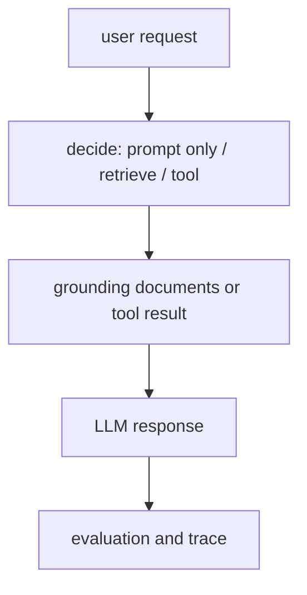

# P5-17.1 작은 생성형 AI 기능을 한 흐름으로 묶기

P5-16장까지 오면 LLM, RAG, 도구 사용, 에이전트, 평가, 실패 대응을 각각 따로 설명할 수는 있게 됩니다. 하지만 여기서 한 번 더 중요한 질문이 남습니다.

이 개념들은 실제 요청 하나 안에서 어떻게 함께 움직이는가?

이 절은 그 질문에 답합니다.

작은 생성형 AI 기능은 `요청 해석 -> 필요한 근거 검색 또는 도구 선택 -> 모델 응답 생성 -> 간단한 평가와 기록`의 흐름으로 묶어 이해하는 편이 안전하다.

## 이 절의 범위

이 절은 다음 질문에 답합니다.

- Part 5에서 배운 개념들을 하나의 요청 흐름으로 어떻게 다시 묶을 수 있는가?
- 언제 프롬프트만으로 답하고, 언제 검색이나 도구를 붙여야 하는가?
- 작은 기능을 설계할 때 최소한 무엇을 기록해야 하는가?

이 절에서는 다음 내용을 깊게 다루지 않습니다.

- 실제 상용 모델 API의 세부 문법
- 복잡한 멀티에이전트 오케스트레이션
- 장기 메모리 저장소 설계

상용 API별 인자 차이와 배포 자동화는 이 절에서 직접 다루지 않습니다. 대신 검색과 근거 연결은 앞의 P5-10.1, P5-10.2와 P5-11.1, P5-11.2에서 이미 배운 흐름 위에 놓고, 도구 선택과 실행 연결은 P5-12.1, P5-12.2와 P5-13.1, P5-13.2에서 다시 묶어 읽습니다. 실제 구현과 배포 자동화는 P6-6.1 도구를 사용하는 에이전트 목표, P6-7.1 배포와 모니터링 목표에서 다시 회수합니다. 이 절은 `어떤 구조를 구현해야 하는가`를 먼저 읽는 자리입니다.

이 절에서는 Part 5를 개념 설명으로만 끝내지 않고, 실제 기능 설계의 최소 흐름까지 연결합니다.

## 이 절의 목표

- 작은 생성형 AI 기능을 요청 흐름으로 설명할 수 있습니다.
- 프롬프트만으로 처리할 일과 검색·도구가 필요한 일을 구분할 수 있습니다.
- 입력, 근거, 출력, 평가, 기록을 하나의 설계 문장으로 묶을 수 있습니다.
- 다음 절의 최소 구현 예제를 더 쉽게 읽을 수 있습니다.

## 어떤 기능을 예로 들 것인가

이 절에서는 `사내 문서 기반 휴가 정책 안내 도우미`를 예로 듭니다. 사용자가 `이번 달에 입사한 직원도 여름휴가를 바로 쓸 수 있나요?`라고 물으면, 겉으로는 단순한 질문 응답처럼 보일 수 있습니다. 하지만 실제로는 현재 규정 문서를 찾아야 하고, 경우에 따라서는 `내 잔여 휴가는 며칠인가요?`처럼 시스템 조회까지 이어질 수 있습니다. 또 답변 뒤에는 어떤 문서를 근거로 썼는지와, 문서를 못 찾았는지까지 남겨야 다음 수정이 가능합니다. 그래서 이 예는 Part 5에서 다룬 프롬프트, 검색, 도구 사용, 평가와 기록을 한 요청 안에서 함께 묶어 보기 좋습니다.

## 한 요청 흐름으로 그리면

방금 본 질문을 처리하는 가장 단순한 흐름은 다음과 같습니다.

1. 질문이 어떤 종류인지 읽는다.
2. 최신 규정이 필요한 질문인지 판단한다.
3. 필요하면 관련 문서를 검색한다.
4. 답변을 만들고 근거를 함께 붙인다.
5. 애매하거나 누락이 있으면 사람 확인 또는 추가 질문으로 넘긴다.

이 다섯 단계만 있어도 이미 단순 프롬프트 예제와는 다른 구조가 됩니다.

## 언제 프롬프트만으로 충분한가

프롬프트만으로 충분한 경우는 주로 다음과 같습니다.

- 문장 다듬기
- 요약 형식 바꾸기
- 이미 입력된 자료 안에서 답하기
- 창의적 초안 작성

이 경우에는 모델이 `현재 입력 안의 정보`만으로도 작업을 수행할 수 있습니다.

예를 들어:

- 메일 문장을 더 공손하게 바꾸기
- 이미 붙여 둔 회의록을 세 문장으로 요약하기

같은 일은 검색이나 도구 호출 없이도 시작할 수 있습니다.

## 언제 검색이 필요한가

다음 조건이 붙으면 검색이 필요해집니다.

- 최신 규정이 중요하다
- 문서 근거를 함께 보여 줘야 한다
- 긴 내부 문서를 그대로 프롬프트에 다 넣기 어렵다
- 모델의 내부 기억보다 현재 저장소의 문서가 더 신뢰할 만하다

휴가 정책 안내 도우미는 여기에 해당합니다. `정답처럼 보이는 일반론`보다 `현재 회사 문서의 실제 규정`이 더 중요하기 때문입니다.

즉, 이런 경우에는 `말투를 더 잘 만드는 문제`가 아니라 `현재 문서를 정확히 찾아 근거와 함께 답하는 문제`로 읽어야 합니다.

`모델이 답을 잘 쓰는 능력`과 `올바른 근거를 가져오는 능력`은 같은 문제가 아니다.

## 언제 도구 사용이 필요한가

검색만으로 충분하지 않은 경우도 있습니다.

예를 들어 사용자가:

- 남은 휴가 일수 조회
- 승인 상태 확인
- 신청 양식 생성

을 요청한다면, 이제는 문서 검색만으로는 부족합니다.

이 경우에는 실제 시스템에서 값을 읽거나 작업을 수행하는 도구가 필요합니다.

즉, 검색은 `무엇이 규정인가`를 확인하는 데 가깝고, 도구 사용은 `현재 상태에서 무엇을 실행하거나 조회할 것인가`를 다루는 데 가깝습니다.

## 작은 기능도 최소 평가가 필요하다

작은 기능이라고 해도 답변 하나만 보고 끝내면 개선이 어렵습니다.

최소한 다음 네 가지는 남기는 편이 좋습니다.

| 기록 항목 | 왜 필요한가 |
| --- | --- |
| 사용자 질문 | 어떤 요청을 처리했는지 남기기 위해 |
| 검색 또는 도구 사용 여부 | 실패 원인을 나중에 구분하기 위해 |
| 최종 답변 | 출력 품질을 다시 보기 위해 |
| 근거 또는 실패 이유 | 틀린 답과 시스템 문제를 구분하기 위해 |

이 네 가지는 Part 5 뒤쪽의 평가와 실패 대응 설명을 실제 설계로 끌어오는 최소 장치입니다.

## 아주 단순하게 그리면

이 도식의 핵심은 생성형 AI 기능을 `모델 호출 한 번`으로만 그리지 않는 데 있습니다.

## 사례로 보기

앞에서 본 `prompt 중심`, `retrieval 결합`, `tool use 결합` 구분을 실제 기능 장면으로 다시 묶으면 다음처럼 읽을 수 있습니다.

### 사례 1. 문장 다듬기

입력된 안내 문장을 더 공손하게 다듬는 기능을 생각해 볼 수 있습니다. 사람은 생성형 AI 기능이면 검색이나 도구가 항상 붙어야 한다고 느끼기 쉽지만, 이 경우 먼저 확인할 것은 `현재 문장 자체`이고 외부 문서나 실시간 시스템 값은 필요하지 않을 수 있습니다. 예를 들어 `서류를 다시 제출하세요`를 더 부드럽게 바꾸는 작업은, 최신 규정을 찾는 문제가 아니라 이미 주어진 문장을 어떻게 표현하느냐의 문제입니다. 이때 검색까지 붙이면 오히려 관련 없는 규정 문구가 섞여 원래 문장보다 길고 딱딱한 답이 나올 수 있습니다. 그래서 핵심 구조는 좋은 지시와 예시를 넣는 프롬프트 쪽에 더 가깝습니다. 즉, 바꿔야 할 대상이 이미 입력 안에 다 들어 있으면 prompt 중심 구조로 충분할 수 있습니다. 여기서 바뀌는 점은 `생성형 AI면 검색도 붙어야 하는가`를 보던 기준에서 `현재 입력만으로 작업이 닫히는가`를 보는 기준으로 이동한다는 것입니다. 그래서 이 사례에서 확인해야 할 결과는 검색 없이도 입력 문장 자체만으로 원하는 표현 수정이 충분히 닫히는가입니다.

### 사례 2. 사내 정책 안내

사내 정책 안내 챗봇을 생각해 보겠습니다. 사람은 `휴가 신청은 며칠 전까지 해야 하나요?`나 `육아휴직 신청 순서는 어떻게 되나요?` 같은 질문을 보면 모델이 바로 답을 써 주면 된다고 느끼기 쉽습니다. 하지만 이런 질문은 말투보다 최신 규정 문서를 정확히 가져오는 일이 먼저입니다. 예를 들어 지난 분기 규정에는 `3일 전`이라고 되어 있었는데 최신 규정은 `5영업일 전`으로 바뀌었다면, 프롬프트만 잘 써도 내부 기억만으로는 최신 기준을 보장하기 어렵습니다. 정책은 바뀔 수 있으므로, 말투가 자연스러운 답보다 최신 문서를 먼저 찾고 근거 문장을 붙이는 구조가 더 중요합니다. 이 경우 핵심 구조는 검색으로 최신 문단을 붙이고 그 근거를 바탕으로 답을 정리하는 쪽에 가깝습니다. 여기서 바뀌는 점은 `답을 바로 잘 쓰는가`를 보던 기준에서 `최신 규정 근거를 실제로 가져오는가`를 보는 기준으로 이동한다는 것입니다. 그래서 이 사례에서 확인해야 할 결과는 최신 문단을 붙였을 때 답이 말투보다 규정 근거 정확성 쪽에서 실제로 더 안정되는가입니다.

### 사례 3. 잔여 휴가 조회

잔여 휴가 조회는 한 단계 더 다릅니다. 정책 문서만 읽어서는 `연차는 어떤 기준으로 계산되는가`는 설명할 수 있어도, `내 계정에 실제로 며칠이 남았는가`는 알 수 없습니다. 사람은 정책을 찾았으니 답도 끝났다고 느끼기 쉽지만, 이 질문을 닫으려면 규정뿐 아니라 인사 시스템 값 조회가 필요하다는 점을 바로 구분해야 합니다. 예를 들어 정책상 연차 계산식은 알아도, 이미 사용한 일수와 승인 대기 휴가까지 반영된 현재 잔액은 시스템을 조회해야만 알 수 있습니다. 그래서 이 기능은 retrieval만으로도 부족하고, 실제 상태를 읽는 tool use가 붙어야 닫힙니다. 여기서 바뀌는 점은 `규정 설명이 가능한가`를 보던 기준에서 `현재 상태 값을 실제로 조회해 답을 닫을 수 있는가`를 보는 기준으로 이동한다는 것입니다. 그래서 이 사례에서 확인해야 할 결과는 규정 설명만으로는 못 닫히는 질문이 실제 시스템 조회를 붙였을 때 비로소 현재 상태 답변으로 닫히는가입니다.

세 사례를 실제 설계 판단으로 다시 줄이면 다음과 같습니다.

| 질문 형태 | 먼저 봐야 할 것 | 잘못 붙이면 생기는 문제 |
| --- | --- | --- |
| 문장 표현 수정 | 이미 입력 안에 필요한 정보가 있는가 | 불필요한 검색으로 답이 산만해짐 |
| 규정 설명 | 최신 근거 문서가 필요한가 | 오래된 기준이나 일반론으로 답함 |
| 현재 상태 조회 | 문서가 아니라 시스템 값이 필요한가 | 규정 설명만 하고 실제 상태는 못 답함 |

이 세 사례를 한 줄로 다시 정리하면 다음과 같습니다.

| 기능 유형 | 중심 구조 |
| --- | --- |
| 표현 변환 | prompt 중심 |
| 근거 기반 답변 | prompt + retrieval |
| 상태 조회/실행 | prompt + tool use |

## 설계 문장으로 다시 묶기

이 절에서는 긴 설계 문서를 다 쓰기보다, 기능 하나를 다음처럼 한 문장으로 요약할 수 있으면 충분합니다.

`휴가 정책 안내 도우미는 사용자의 질문을 읽고, 관련 규정 문서를 검색한 뒤, 근거 문장을 포함한 답변을 만들고, 검색 실패나 근거 누락은 기록한다.`

이 문장 안에는 이미 다음 요소가 들어 있습니다.

- 입력
- 검색
- 출력
- 근거
- 실패 기록

즉, Part 5 전체 내용을 작은 서비스 문장 하나로 압축한 셈입니다.

같은 형식으로 앞 사례들도 다시 써 볼 수 있습니다.

- 문장 다듬기 도우미: 입력 문장을 읽고, 예시 말투를 반영해 다시 쓰고, 수정 전후 문장을 함께 남긴다.
- 정책 안내 도우미: 질문을 읽고, 최신 규정 문서를 검색한 뒤, 근거 문장을 포함해 답하고, 근거가 없으면 사람 확인으로 넘긴다.
- 잔여 휴가 조회 도우미: 질문을 읽고, 조회 도구로 현재 잔액을 확인한 뒤, 규정 문서와 함께 결과를 설명하고, 조회 실패는 기록한다.

## 다음 절과의 연결

여기까지 오면 다음 질문이 남습니다.

- 이 흐름을 가장 작은 코드로 흉내 내면 어떤 모습이 되는가?
- 실제 API를 붙이기 전에도 어떤 출력과 기록을 먼저 확인할 수 있는가?

이 질문은 P5-17.2 최소 구현과 회고 포인트로 이어집니다.

## 이 절에서 기억할 관점

- 작은 생성형 AI 기능도 `무엇을 요청했는가`, `어떤 근거를 붙였는가`, `어떤 출력이 나왔는가`, `그 출력을 어떻게 평가할 것인가`의 흐름으로 읽어야 합니다.
- 프롬프트만으로 충분한 일과 검색·도구가 필요한 일은 다릅니다.
- 검색은 근거 확보 문제이고, 도구 사용은 상태 조회·실행 문제입니다.
- 작은 기능이라도 trace와 평가 관점을 처음부터 넣는 편이 안전합니다.

## 체크리스트

- Part 5의 개념을 하나의 요청 흐름으로 다시 설명할 수 있는가?
- 언제 prompt만으로 충분하고 언제 retrieval이나 tool이 필요한지 구분할 수 있는가?
- 작은 기능 설계에서 무엇을 기록해야 하는지 말할 수 있는가?
- 다음 절의 최소 구현 예제가 왜 필요한지 설명할 수 있는가?

## 출처와 참고 자료

이 문서는 Part 5의 통합 미니 실습을 위한 자체 구성 문서입니다. 외부 자료를 직접 인용하지 않았습니다.
