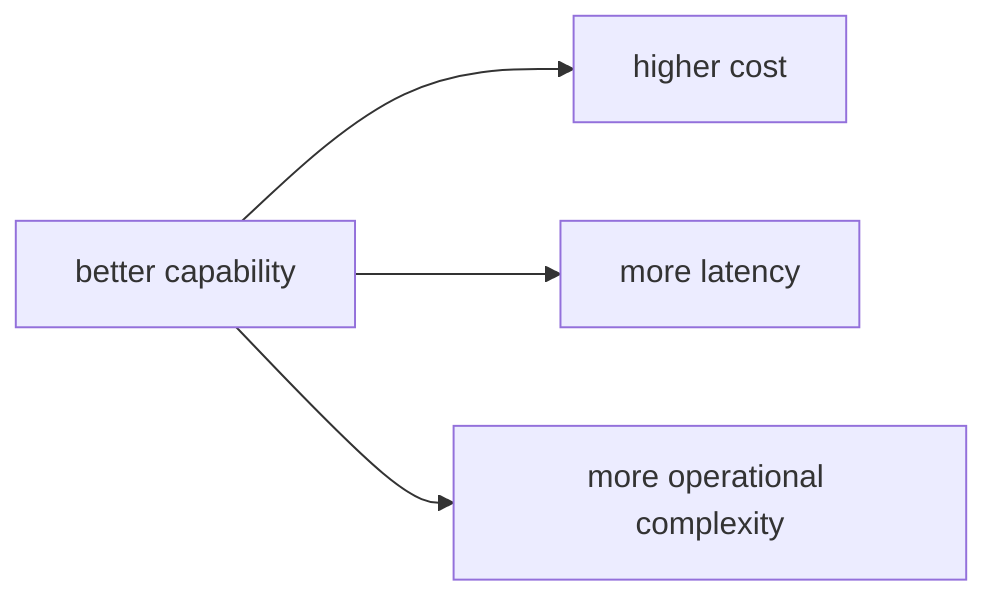

# P5-18.1 AI 서비스가 현실에서 만나는 제약

P5-17.2에서는 자동 평가와 사람 평가가 서로 다른 장단점을 가지며 실제 운영에서는 함께 쓰이는 경우가 많다는 점을 보았습니다. 하지만 평가만 좋아도 서비스가 바로 성립하는 것은 아닙니다. 이제 더 현실적인 질문이 나옵니다.

품질이 괜찮아 보여도, 실제 서비스에서는 무엇이 다시 발목을 잡는가?

이 절은 그 질문에 답합니다.

AI 서비스는 모델 품질만으로 결정되지 않고, 비용(cost), 지연 시간(latency), 사용량 제한(limit), 실패 가능성 같은 현실 제약 안에서 운영되어야 한다.

같은 말을 더 쉽게 바꾸면 다음과 같습니다.

좋은 모델이 있어도, 너무 느리거나 너무 비싸거나 너무 자주 멈추면 좋은 서비스가 되기 어렵다.

## 이 절의 범위

이 절은 다음 질문에 답합니다.

- 왜 좋은 모델만으로는 좋은 서비스가 되지 않는가?
- 비용, 지연 시간, 사용량 제한은 어떤 식으로 문제를 만들까?
- 서비스 설계에서 무엇을 함께 타협해야 하나?

이 절은 다음 내용은 깊게 다루지 않습니다.

- 구체적인 클라우드 가격 비교
- GPU 인프라 설계 세부
- SLA/SLI/SLO 수치 설계 전체

이 절의 목적은 AI 서비스를 `모델 성능 문제`에만 가두지 않고, 실제 운영 제약을 함께 읽게 만드는 데 있습니다.

## 이 절의 목표

- AI 서비스 제약을 초심자 수준에서 설명할 수 있습니다.
- 비용, 지연 시간, 사용량 제한을 서로 다른 문제로 구분할 수 있습니다.
- 품질과 운영 제약 사이의 균형을 말할 수 있습니다.
- 다음 절의 실패 대응 문제로 자연스럽게 넘어갈 수 있습니다.

## 왜 모델 품질만으로는 부족한가

좋은 답을 만들 수 있는 모델이 있다고 해도, 실제 서비스는 다음 조건을 함께 만족해야 합니다.

초심자는 먼저 다음 세 질문으로 읽으면 좋습니다.

| 질문 | 초심자용 짧은 답 |
| --- | --- |
| 왜 품질만으로 부족한가? | 서비스는 반복적으로 제공되어야 하기 때문 |
| 무엇을 함께 봐야 하는가? | 속도, 비용, 처리량, 안정성 |
| 그래서 바뀌는 질문은 무엇인가? | `잘 되나?`에서 `계속 운영 가능한가?`로 이동 |

- 충분히 빠르게 응답해야 함
- 너무 비싸지 않아야 함
- 많은 요청을 감당할 수 있어야 함
- 장애가 나도 완전히 멈추지 않아야 함

즉, 서비스는 `정답 품질`만이 아니라 `운영 가능성`까지 포함한 문제입니다.

이 절은 Part 5의 앞선 장들과 다르게, 모델 내부보다 `서비스를 실제로 돌릴 때 생기는 조건`을 읽는 절입니다.

## 비용(cost)은 왜 큰 문제인가

AI 서비스는 보통 호출마다 비용이 생기거나, 자체 운영 시에는 인프라 비용이 생깁니다. 특히 다음이 함께 늘어나면 부담이 커집니다.

- 긴 입력 문맥
- 긴 출력
- 더 큰 모델
- 더 많은 도구 호출
- 더 많은 재시도

초심자 기준에서는 다음처럼 기억하면 좋습니다.

`에이전트 구조와 RAG 구조는 품질을 높일 수 있지만, 호출 단계가 늘어날수록 비용도 함께 커질 수 있다.`

초심자는 여기서 `더 많은 기능 = 항상 더 좋은 선택`이 아니라는 점을 먼저 기억하면 좋습니다.

## 지연 시간(latency)은 왜 중요하나

사용자는 단순히 `맞는 답`만 원하는 것이 아니라, `기다릴 수 있는 시간 안의 답`도 원합니다.

예를 들어:

- 문서 검색
- 모델 생성
- 도구 호출
- 후처리

가 모두 이어지면 지연 시간이 누적될 수 있습니다.

이때 서비스는 다음 질문을 던져야 합니다.

- 모든 단계를 꼭 매번 다 수행해야 하는가?
- 어느 단계는 캐시할 수 있는가?
- 어느 정도 느림까지 허용 가능한가?

즉, latency는 기술 문제가 아니라 사용자 경험 문제이기도 합니다.

같은 답이라도 2초 안에 오는 답과 20초 뒤에 오는 답은 서비스 경험이 다릅니다. 따라서 latency는 정확도보다 덜 중요해 보이지만, 실제 사용에서는 서비스 채택을 크게 좌우할 수 있습니다.

## 사용량 제한(limit)과 용량(capacity) 문제

서비스가 커지면 요청량도 커집니다. 이때 다음 문제가 생길 수 있습니다.

- 분당 요청 수 제한
- 동시 처리 수 제한
- 모델 공급자 API 제한
- 내부 인프라 병목

초심자 기준에서는 다음처럼 볼 수 있습니다.

`좋은 데모와 운영 가능한 서비스는 다르다. 데모는 한 번 잘 되면 되지만, 서비스는 반복 요청을 견뎌야 한다.`

이 한 줄은 초심자에게 특히 중요합니다. 많은 AI 데모가 인상적이어도, 실제 서비스로 옮기면 동시 요청과 비용 문제가 먼저 드러나기 때문입니다.

## 품질과 제약은 왜 같이 봐야 하나

이 지점이 중요합니다.

더 큰 모델을 쓰면 품질이 좋아질 수 있습니다. 하지만:

- 비용이 커지고
- 지연 시간이 늘고
- 운영 복잡도가 증가할 수 있습니다

반대로 더 작은 모델을 쓰면:

- 응답은 빨라질 수 있지만
- 품질이나 안정성이 낮아질 수 있습니다

따라서 서비스 설계는 보통 다음 균형 문제에 가깝습니다.

`어느 정도 품질을, 어느 정도 비용과 속도로, 어떤 사용량 범위에서 제공할 것인가?`

같은 서비스 흐름으로 다시 정리하면 다음과 같습니다.

| 높이고 싶은 것 | 함께 늘어날 수 있는 부담 |
| --- | --- |
| 더 큰 모델 | 비용, 지연 시간 |
| 더 많은 검색 문서 | 비용, 문맥 길이, 처리 시간 |
| 더 많은 도구 호출 | 실패 지점, 운영 복잡도 |

## RAG와 agent 구조에서는 왜 더 복잡해지나

단순 채팅보다 RAG와 agent는 단계가 많습니다.

- 검색
- 문서 정리
- 모델 생성
- 도구 호출
- 재시도

이 단계가 늘수록:

- 호출 수가 늘고
- 실패 가능성이 늘고
- 지연 시간이 누적되며
- 로그와 평가 비용도 커집니다

즉, 구조가 강해질수록 운영 제약도 강해집니다.

프롬프트만 쓰는 단순 구조에서는 제약이 비교적 단순합니다. 하지만 RAG와 에이전트가 붙으면 `좋은 답을 만들기 위한 단계`와 `그 단계를 유지하는 운영 부담`이 함께 늘어난다는 점이 이 절의 핵심입니다.

## 아주 단순하게 그리면



이 도식의 핵심은 성능을 높이는 선택이 종종 다른 비용을 동반한다는 점입니다.

## 사례로 보기

### 사례 1. 고객 지원 챗봇

긴 문서 검색과 긴 답변을 항상 수행하면 정확도는 좋아질 수 있지만, 응답이 너무 느리면 실제 고객 경험은 나빠질 수 있습니다.

### 사례 2. 개발 보조 도구

에이전트가 파일 탐색, 검색, 테스트, 재시도를 모두 수행하면 작업 품질은 좋아질 수 있지만, 토큰 비용과 실행 시간이 빠르게 늘 수 있습니다.

### 사례 3. 사내 문서 질의응답

RAG 품질을 높이기 위해 많은 문서를 붙이면 비용과 지연 시간이 늘고, 오히려 핵심 문장이 묻혀 답변 품질이 다시 떨어질 수도 있습니다.

세 사례를 한 줄로 묶으면 다음과 같습니다.

| 상황 | 현실 제약으로 다시 보게 되는 질문 |
| --- | --- |
| 고객 지원 챗봇 | 정확하지만 너무 느리면 괜찮은가? |
| 개발 보조 도구 | 품질 향상을 위해 든 비용이 감당 가능한가? |
| 사내 문서 질의응답 | 더 많은 문서가 항상 더 좋은가? |

## 작은 Python 예제로 보기

이번 예제의 목표는 품질과 제약을 함께 읽는 감각을 만드는 것입니다.

입력:

- 두 가지 서비스 설계안

출력:

- 품질과 비용/지연 시간 비교

```python
service_fast = {"quality": 0.78, "latency_ms": 900, "cost": 1}
service_rich = {"quality": 0.89, "latency_ms": 3200, "cost": 4}

print("service_fast =", service_fast)
print("service_rich =", service_rich)
print("observation = better quality may come with more latency and cost")
```

실행 결과 예시는 다음처럼 읽을 수 있습니다.

```text
service_fast = {'quality': 0.78, 'latency_ms': 900, 'cost': 1}
service_rich = {'quality': 0.89, 'latency_ms': 3200, 'cost': 4}
observation = better quality may come with more latency and cost
```

이 예제는 서비스 선택이 `정답 하나`가 아니라, 품질과 제약을 함께 읽는 의사결정이라는 점을 보여 줍니다.

이 예제에서 초심자가 읽어야 할 핵심은 다음입니다.

- 더 좋은 품질이 항상 공짜로 오지 않고
- 속도와 비용이 함께 바뀔 수 있으며
- 그래서 서비스 설계는 비교표와 타협의 문제라는 점입니다

## 역사와 커리큘럼 관점

생성형 AI가 데모를 넘어 제품으로 들어가면서, 많은 팀이 비슷한 문제를 반복해서 만났습니다. `좋아 보이는 응답`은 만들 수 있지만, 그 응답을 `빠르고 싸고 안정적으로` 제공하는 문제는 전혀 다른 층위였습니다.

초심자 기준에서는 이 역사 설명을 다음처럼 받아들이면 충분합니다.

`생성형 AI가 실서비스로 들어오자, 모델 성능보다 운영 제약을 다루는 일이 빠르게 큰 비중을 차지하게 되었다.`

커리큘럼 관점에서 이 절이 중요한 이유는 다음과 같습니다.

- 모델 중심 시각에서 서비스 운영 시각으로 관점을 전환하게 하고
- 다음 절의 실패 대응과 장애 관리 문제를 준비시키며
- Part 6 프로젝트에서 기능 구현뿐 아니라 제약 설계까지 생각하게 만들기 때문입니다

## 다음 절과의 연결

여기까지 오면 다음 질문이 남습니다.

- 제약은 이해했지만, 실제로 실패가 발생하면 어떻게 대응해야 하는가?
- 모델 오류, 검색 실패, 도구 호출 실패를 어떻게 다뤄야 하는가?

이 질문은 P5-18.2 운영 중 실패 대응으로 이어집니다.

## 이 절에서 기억할 관점

- AI 서비스는 품질만으로 결정되지 않습니다.
- 비용, 지연 시간, 사용량 제한, 운영 복잡도를 함께 봐야 합니다.
- RAG와 agent 구조는 품질을 높일 수 있지만 운영 제약도 함께 키울 수 있습니다.
- 서비스 설계는 품질과 현실 제약의 균형 문제입니다.

## 체크리스트

- AI 서비스 제약을 초심자 수준에서 설명할 수 있는가?
- 비용, 지연 시간, 사용량 제한을 구분할 수 있는가?
- 왜 품질과 운영 제약을 함께 봐야 하는지 말할 수 있는가?
- 왜 다음 절에서 실패 대응을 따로 다뤄야 하는지 설명할 수 있는가?

## 출처와 참고 자료

- OpenAI, 비용/지연 시간/운영 관련 공식 문서, 확인 날짜: 2026-06-29.
- 관련 LLM application engineering 운영 자료, 확인 날짜: 2026-06-29.
