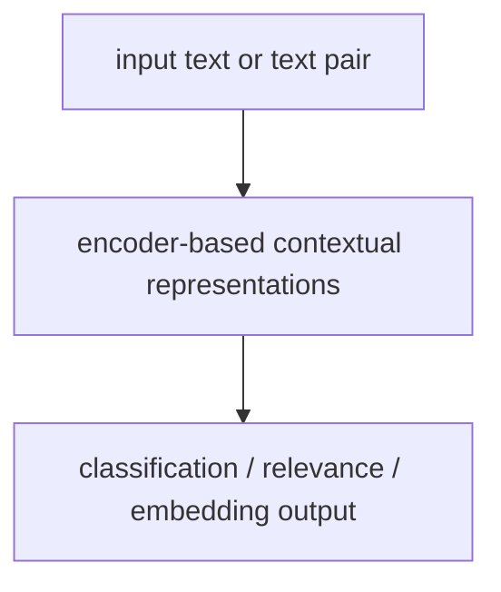

# P5-19.2 이해 중심 태스크

P5-19.1에서는 BERT 계열을 Transformer 인코더 기반의 표현 모델로 설명했습니다. 그러면 다음 질문이 이어집니다.

그 표현은 실제로 어떤 종류의 작업에 쓰였고, 왜 그런 작업과 잘 맞았는가?

이 절은 그 질문에 답합니다.

이해 중심 태스크는 입력 전체를 읽고 분류, 관련도 판단, 검색, 임베딩처럼 `무엇인지` 또는 `얼마나 맞는지`를 판단하는 작업이며, BERT 계열 표현 모델과 잘 맞는다.

## 이 절의 범위

이 절은 다음 질문에 답합니다.

- `이해 중심 태스크`란 무엇이라고 설명할 수 있는가?
- BERT 계열은 어떤 작업에서 특히 유용했는가?
- 분류, 검색, 문장쌍 비교, 임베딩은 어떻게 한 흐름으로 묶을 수 있는가?

이 절에서는 다음 내용을 깊게 다루지 않습니다.

- GLUE 같은 벤치마크의 세부 점수
- cross-encoder, bi-encoder의 구현 차이
- reranker와 dense retrieval의 세부 설계

이 절에서는 판단 작업의 큰 흐름까지만 잡고, 검색 파이프라인 안에서 cross-encoder, bi-encoder, dense retrieval이 어떻게 갈라지는지는 P5-11.1 벡터 데이터베이스와 P5-11.2 인덱스와 검색 품질에서 다시 회수합니다. 세부 벤치마크 점수 비교는 현재 본편 범위 밖으로 둡니다.

이 절의 목적은 태스크 이름을 많이 나열하는 데 있지 않습니다. `입력을 읽고 판단하는 흐름`을 한 묶음으로 이해하게 하는 데 있습니다. Part 5 전체에서는 이 장을 생성형 AI 본류와 대비되는 `배경 축`으로 읽으면 충분합니다.

## 이 절의 목표

- 이해 중심 태스크를 입문 수준에서 설명할 수 있습니다.
- 분류, 관련도 판단, 검색, 임베딩을 같은 계열의 작업으로 묶어 설명할 수 있습니다.
- 왜 이런 작업이 BERT 계열과 잘 맞는지 말할 수 있습니다.
- 이후 GPT 계열과의 대비를 더 선명하게 읽을 수 있습니다.

## 이 절을 어디까지 읽으면 충분한가

이 절은 태스크 백과사전을 만드는 장이 아닙니다. 우선은 다음 한 가지 구분만 남기고 넘어가도 충분합니다.

`BERT 계열은 긴 답을 생성하는 일보다, 입력을 읽고 라벨·점수·관련도·임베딩을 만드는 일에 더 자연스럽다.`

이 한 줄이 잡히면 세부 태스크 이름을 모두 외우지 않아도 뒤의 GPT 장과 RAG 장을 읽는 데 큰 문제는 없습니다.

## 이해 중심 태스크란 무엇인가

이 책에서 `이해 중심 태스크`는 사람처럼 이해한다는 철학적 뜻이 아니라, 다음과 같은 작업 묶음을 가리킵니다.

- 이 입력은 어떤 라벨인가?
- 이 두 문장은 같은 뜻에 가까운가?
- 이 질문과 이 문서는 얼마나 관련 있는가?
- 이 문장을 대표하는 벡터는 어떤가?

즉, 출력이 긴 생성 문장이라기보다:

- 라벨
- 점수
- 관련도
- 대표 표현

으로 이어지는 작업입니다.

## 대표적인 작업 1. 문서 분류와 감성 분류

가장 익숙한 예는 분류(classification)입니다.

예를 들어:

- 스팸 / 정상 메일 분류
- 문의 카테고리 분류
- 감성 분류(긍정 / 부정 / 중립)

같은 작업은 문장 전체를 읽고 `어느 범주에 넣을지` 판단하는 흐름입니다.

BERT 계열은 입력 전체 문맥을 반영한 표현을 만들기 때문에 이런 작업과 잘 맞습니다.

## 대표적인 작업 2. 문장쌍 판단

두 문장 관계를 판단하는 작업도 중요합니다.

예를 들어:

- 두 문장이 같은 의미에 가까운가?
- 질문과 답이 서로 맞는가?
- 문장 A가 문장 B를 함의(entailment)하는가?

이런 작업은 단일 문장 분류보다 한 단계 더 나아가, 두 입력 사이 관계를 보는 문제입니다.

다음처럼 이해하면 충분합니다.

`문장쌍 판단은 입력 하나를 읽는 일이 아니라, 두 입력의 관계를 비교해 점수나 라벨을 내는 작업이다.`

## 대표적인 작업 3. 검색과 랭킹

검색(search)도 이해 중심 태스크로 볼 수 있습니다.

질문을 입력으로 주고:

- 어떤 문서가 관련 있는지
- 여러 후보 중 어느 문서를 더 위에 둘지

판단하는 작업이기 때문입니다.

이때 BERT 계열은 다음 두 방식으로 연결될 수 있습니다.

- 질문과 문서를 함께 읽고 관련도 점수를 내는 방식
- 질문과 문서를 각각 표현 벡터로 바꾼 뒤 비교하는 방식

후자는 임베딩 검색과도 직접 연결됩니다.

## 대표적인 작업 4. 임베딩과 표현 재사용

BERT 계열과 그 이후의 encoder 중심 모델은 문장을 임베딩으로 바꾸는 데도 널리 쓰입니다.

예를 들어:

- 비슷한 문장 찾기
- FAQ 중복 질문 찾기
- 문서 군집화
- 검색용 dense vector 생성

이런 작업은 `생성`보다 `표현 재사용`에 가깝습니다.

즉, BERT 계열은 단지 분류 모델이 아니라, 다양한 판단 작업의 공통 표현 엔진으로도 볼 수 있습니다.

## 왜 이런 작업들이 한 흐름으로 묶이나

이 작업들은 겉으로는 달라 보여도 중심 질문이 비슷합니다.

- 무엇인가?
- 서로 얼마나 비슷한가?
- 얼마나 관련 있는가?
- 어떤 범주에 속하는가?

즉, `다음 문장을 길게 생성하는 일`보다 `입력을 읽고 판단하는 일`에 가깝습니다.

그래서 다음처럼 하나의 흐름으로 묶을 수 있습니다.



이 도식은 BERT 계열의 실무 사용 감각을 가장 단순하게 보여 줍니다.

## 사례로 보기

### 사례 1. 고객 문의 분류

고객 문의를 `배송`, `계정`, `결제`, `오류`로 나누는 작업은 전형적인 이해 중심 태스크입니다. 사람은 이 장면에서 긴 답변보다 `어느 처리 흐름으로 보내야 하는가`를 먼저 판단합니다. 예를 들어 `결제는 됐는데 주문이 안 보여요` 같은 문장은 겉으로는 결제와 주문이 같이 보이지만, 실제 운영에서는 어느 팀이 먼저 봐야 하는지가 더 중요합니다. 답을 길게 생성하는 것보다 `결제 확인 팀`과 `주문 동기화 점검 팀` 중 어디로 먼저 보내는지가 서비스 처리 속도에 더 직접적입니다. 잘못된 큐로 보내면 답변을 길게 잘 써도 실제 처리 시간은 더 늦어질 수 있습니다. 즉, 중요한 일은 긴 답변을 쓰는 것이 아니라 들어온 문장을 읽고 어느 처리 흐름으로 보낼지 결정하는 것입니다. 이 사례는 `생성 품질`보다 `판단 정확도`가 먼저인 장면을 잘 보여 줍니다.

### 사례 2. FAQ 검색

사용자 질문과 기존 FAQ를 비교해 가장 가까운 항목을 찾는 일은 관련도 판단과 임베딩 검색이 함께 쓰이는 사례입니다. 사람도 이 장면에서는 새 설명을 쓰기보다 `이미 있는 답 중 무엇이 가장 맞는가`를 먼저 고릅니다. 예를 들어 `비밀번호를 잊어버렸어요`와 `로그인 비밀번호 재설정은 어떻게 하나요?`는 표면 표현이 달라도 같은 도움말로 연결되는 편이 더 실용적입니다. 기존 FAQ가 이미 단계별 스크린샷까지 포함하고 있다면, 새 답을 생성하는 것보다 그 항목으로 정확히 연결하는 쪽이 훨씬 안전합니다. 반대로 관련 없는 FAQ를 골라 새 문장으로 덧붙이면 말은 자연스러워도 사용자는 잘못된 경로로 이동할 수 있습니다. 이때 핵심은 `새 문장을 만드는 일`이 아니라 `가장 맞는 문서를 고르는 일`입니다.

### 사례 3. 문서 중복 탐지

문서 제목과 본문이 거의 같은지 판별하는 일은 문장쌍 비교와 유사도 판단 흐름으로 볼 수 있습니다. 사람은 이 작업에서 보통 `둘 다 새로 쓰기`보다 `둘이 얼마나 같은가`를 먼저 점검합니다. 예를 들어 공지 두 개가 문장 순서만 조금 다르고 핵심 내용은 같다면, 새 답변을 만드는 것보다 중복으로 묶는 편이 운영상 더 중요할 수 있습니다. 하나는 제목이 `점검 안내`, 다른 하나는 `서비스 점검 공지`여도 실제 본문이 같은 이벤트를 설명한다면 중복 판단이 더 중요합니다. 중복을 놓치면 비슷한 문서가 계속 쌓여 검색 결과까지 지저분해질 수 있습니다. 결국 이 사례도 `읽고 비교해 점수를 매기는 일`이라는 점에서 같은 계열입니다.

## 작은 Python 예제로 보기

이번 예제의 목표는 BERT를 학습하는 것이 아니라, 이해 중심 태스크의 출력이 `생성 문장`이 아니라 `판단 결과`인 경우가 많다는 점을 확인하는 것입니다.

입력:

- 문의 문장
- 라벨

출력:

- 문장과 라벨
- 문장쌍 유사 여부 예시

```python
classification_examples = [
    ("배송이 지연되고 있습니다", "배송"),
    ("로그인이 되지 않습니다", "계정"),
]

pair_examples = [
    ("비밀번호를 변경하고 싶어요", "비밀번호를 다시 설정하려면 어떻게 하나요?", "related"),
    ("환불은 언제 되나요?", "오늘 날씨가 좋네요", "not_related"),
]

print("[classification]")
for text, label in classification_examples:
    print(text, "->", label)

print("[pair relation]")
for left, right, tag in pair_examples:
    print(left, "|", right, "->", tag)
```

실행 결과 예시는 다음처럼 읽을 수 있습니다.

```text
[classification]
배송이 지연되고 있습니다 -> 배송
로그인이 되지 않습니다 -> 계정
[pair relation]
비밀번호를 변경하고 싶어요 | 비밀번호를 다시 설정하려면 어떻게 하나요? -> related
환불은 언제 되나요? | 오늘 날씨가 좋네요 -> not_related
```

이 예제에서 읽어야 할 핵심은 다음입니다.

- 이해 중심 태스크는 대개 `판단 결과`를 출력합니다
- 생성형 모델처럼 긴 답변을 만드는 것이 중심은 아닙니다
- BERT 계열은 이런 판단 작업과 잘 맞습니다

## 사례로 다시 묶어 보기

### 사례 1. 고객 문의 라우팅

고객센터에 `배송이 지연되고 있습니다`, `로그인이 되지 않습니다` 같은 문장이 들어오면, 운영팀은 먼저 어느 처리 큐로 보낼지 판단해야 합니다. 사람이 이 장면에서 먼저 보는 기준은 `답을 예쁘게 쓰는가`보다 `올바른 담당 흐름으로 보내는가`입니다. 예를 들어 배송 문제를 계정 큐로 잘못 보내면, 정중한 안내 문장을 붙여도 실제 해결은 더 늦어집니다. 즉, 여기서 중요한 것은 긴 설명 생성보다 `배송`, `계정`, `환불` 같은 라벨 판단입니다. BERT 계열은 문장을 읽고 이런 분류 결과를 내는 작업과 잘 맞습니다.

### 사례 2. 문장쌍 관계 판단

FAQ 정리나 중복 문의 묶기에서는 `비밀번호를 변경하고 싶어요`와 `비밀번호를 다시 설정하려면 어떻게 하나요?`가 같은 흐름인지 판단해야 합니다. 사람이 단어만 보면 두 문장이 조금 달라 보여 다른 질문처럼 느낄 수 있지만, 실제 지원 흐름에서는 같은 도움말로 닫히는 편이 더 유용합니다. 반대로 `로그인이 계속 실패합니다`처럼 비슷한 단어가 보여도, 실제로는 비밀번호 재설정보다 장애 대응 흐름으로 보내야 할 수 있습니다. 즉, 표면 단어 일치보다 `사용자가 하려는 일`과 `처리 경로`가 더 중요한 기준입니다. 이런 관계 판단도 BERT 계열이 잘 맞는 대표 이해 중심 태스크입니다.

### 사례 3. 생성과의 대비

같은 고객 문의를 보고 생성형 모델은 긴 답변 초안을 만들 수 있지만, 운영 첫 단계에서 더 급한 일은 종종 `어느 라벨로 보낼 것인가`입니다. 사람은 챗봇 시대가 되면 모든 문제가 생성으로 풀릴 것처럼 느끼기 쉽지만, 실제 현장에서는 먼저 읽고 분류해야 다음 단계가 열립니다. 예를 들어 환불 문의를 계정 잠금 큐로 잘못 보내면, 아무리 정중한 답변 초안을 붙여도 실제 해결은 더 늦어집니다. 반대로 라우팅이 먼저 정확하면, 그 뒤의 답변 생성은 더 안전한 위치에서 붙일 수 있습니다. 즉, 읽기 중심 모델은 답을 길게 쓰기보다 `어떤 판단을 먼저 내려야 하는가`에 집중합니다. 이 대비가 BERT 계열의 역할을 더 선명하게 보여 줍니다.

## 역사와 커리큘럼 관점

BERT가 중요했던 이유는 단지 새로운 구조였기 때문이 아닙니다. Transformer encoder 기반 사전학습 표현이 다양한 NLP 과업에 강하게 전이된다는 점을 강하게 보여 주었기 때문입니다.

이 시기를 거치며 많은 실무 팀은:

- 분류
- 검색
- 랭킹
- 문장 유사도
- 임베딩 생성

을 하나의 표현 모델 계열로 묶어 다루기 시작했습니다.

커리큘럼 관점에서 이 절은 GPT 계열과의 대비를 만들기 위한 기반입니다. BERT 계열이 잘하는 일을 먼저 분명히 해야, GPT 계열이 왜 다른 사용 경험을 열었는지도 정확히 설명할 수 있습니다. 이후 검색, 임베딩, RAG로 넘어갈 때도 이 절의 판단 중심 관점을 다시 사용합니다.

## 본류와의 연결

여기까지 오면 이 배경 비교가 왜 필요한지 더 분명해집니다.

- 입력을 읽고 판단하는 BERT 계열과 달리, GPT 계열은 어떻게 `계속 이어서 생성`하는가?
- 왜 사용자 경험은 GPT 계열에서 더 크게 바뀌었는가?

이 질문은 본류의 P5-4.1 GPT 계열의 위치를 다시 읽게 만듭니다. 즉, 이 절은 새 순서를 이끄는 절이 아니라, 앞에서 본 GPT 중심 설명을 비교 관점으로 다시 정리하는 배경 장입니다.

## 이 절에서 기억할 관점

- 이해 중심 태스크는 입력을 읽고 라벨, 점수, 관련도, 임베딩 같은 판단 결과를 내는 작업입니다.
- 분류, 문장쌍 판단, 검색, 임베딩은 하나의 흐름으로 묶을 수 있습니다.
- BERT 계열은 이런 작업과 특히 잘 맞습니다.
- 이 대비가 다음 장의 GPT 계열 설명을 더 선명하게 만듭니다.

## 체크리스트

- 이해 중심 태스크를 입문 수준에서 설명할 수 있는가?
- 분류, 검색, 문장쌍 판단, 임베딩을 같은 흐름으로 설명할 수 있는가?
- 왜 BERT 계열이 이런 작업과 잘 맞는지 말할 수 있는가?
- 다음 장의 GPT 계열 설명으로 왜 이어지는지 설명할 수 있는가?

## 출처와 참고 자료

- Jacob Devlin et al., `BERT: Pre-training of Deep Bidirectional Transformers for Language Understanding`, arXiv, 2018, 확인 날짜: 2026-06-29.
- Daniel Jurafsky, James H. Martin, `Speech and Language Processing` draft materials, 확인 날짜: 2026-06-29.
- Matthew E. Peters et al., `Deep contextualized word representations`, arXiv, 2018, 확인 날짜: 2026-06-29.
