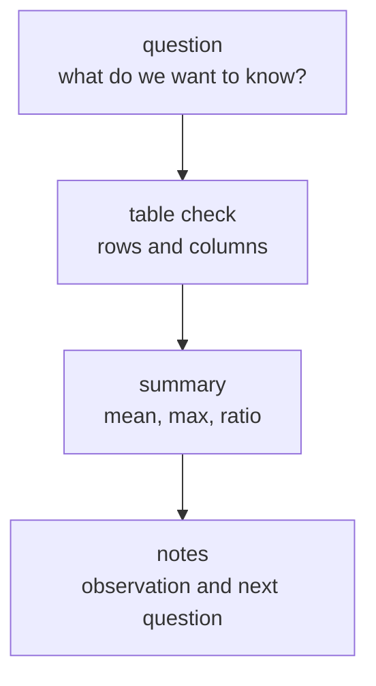

# P6-1.1 데이터 분석 미니 프로젝트 목표

Part 5까지 오면서 모델, 검색, 에이전트(agent), 운영까지 큰 구조를 보았습니다. 하지만 프로젝트 파트의 첫 출발은 더 작고 단순해야 합니다.

`작은 표를 읽고, 질문을 세우고, 요약 결과를 남기는 일`부터 다시 시작해야 합니다.

이 절은 그 첫 단계입니다.

이 프로젝트의 목적은 모델을 쓰는 것이 아니라, 작은 표에서 질문을 만들고 요약 결과를 프로젝트 기록으로 남기는 습관을 만드는 것이다.

## 이 절의 범위

이 절은 다음 질문에 답합니다.

- 작은 데이터셋(dataset) 하나를 받았을 때 무엇부터 확인해야 하는가?
- 데이터 분석 미니 프로젝트는 어떤 질문 구조로 시작하면 좋은가?
- 표를 요약하는 코드가 왜 프로젝트 문서의 출발점이 되는가?
- 숫자를 계산한 뒤 무엇을 관찰과 해석으로 남겨야 하는가?

이 절은 다음 내용은 깊게 다루지 않습니다.

- 통계 검정(statistical test)의 엄밀한 적용
- 시계열 예측(time-series forecasting)의 모델링
- 대시보드 구축
- 대규모 데이터 파이프라인

이 절은 작은 표를 읽고 질문을 세우는 출발점에 집중합니다. 결과를 해석과 회고까지 연결하는 일은 바로 다음 P6-1.2 결과와 회고에서 다시 회수하고, 통계 검정이나 대규모 파이프라인 설계는 현재 본편 범위 밖으로 둡니다.

## 이 절의 목표

- 작은 데이터 분석 프로젝트를 `질문 -> 표 확인 -> 요약 -> 관찰 기록` 흐름으로 시작할 수 있습니다.
- 데이터셋을 처음 받았을 때 바로 모델부터 만들지 않는 이유를 설명할 수 있습니다.
- 실습 코드가 단지 계산이 아니라 프로젝트 기록의 근거라는 점을 이해할 수 있습니다.

## 왜 이 프로젝트부터 시작하나

종종 프로젝트를 시작할 때 바로 모델을 고르려 합니다. 하지만 실제 프로젝트에서는 그보다 먼저 다음 질문이 필요합니다.

- 데이터는 몇 행인가?
- 어떤 열(column)이 있는가?
- 지금 확인하려는 질문은 무엇인가?
- 평균(mean), 합(sum), 비율(ratio)만 봐도 드러나는 패턴이 있는가?

이 단계를 건너뛰면 뒤의 분류(classification)나 회귀(regression) 프로젝트도 흔들립니다. 그래서 Part 6의 첫 프로젝트는 일부러 `모델 없는 프로젝트`로 시작합니다.

먼저 다음 세 질문으로 읽으면 좋습니다.

| 질문 | 짧은 답 |
| --- | --- |
| 왜 모델부터 시작하지 않는가? | 질문과 데이터 이해가 먼저이기 때문 |
| 이 프로젝트의 최소 산출물은 무엇인가? | 요약값과 관찰 메모 |
| 그래서 무엇을 연습하는가? | 프로젝트 문서의 시작 방식 |

## 프로젝트 질문 설정

이번 미니 프로젝트의 질문은 다음처럼 단순하게 잡겠습니다.

> 지난 7일 운영 기록에서 방문자(visitors), 가입(signups), 오류(errors)의 기본 흐름은 어떠한가?

이 질문이 좋은 이유는 다음과 같습니다.

- 입력 데이터가 작아도 됩니다.
- 평균과 비율만으로도 기본 패턴을 볼 수 있습니다.
- 이후 `어느 날이 이상한가`, `전환율(conversion)이 왜 떨어졌는가` 같은 다음 질문으로 자연스럽게 이어집니다.

프로젝트 문서에는 이 질문을 그대로 첫 줄에 남기는 편이 좋습니다. Part 6에서는 `코드보다 질문 문장`이 먼저 보이는 구성이 더 중요합니다.

## 프로젝트 흐름



이 도식은 데이터 분석 미니 프로젝트가 모델 선택으로 시작하지 않는다는 점을 보여 줍니다. 질문을 먼저 적고, 표를 확인하고, 요약값을 만든 뒤, 그 결과를 다시 관찰 메모로 남겨야 다음 분석 질문이 자연스럽게 이어집니다.

이 프로젝트의 핵심은 `복잡한 계산`이 아니라 `질문과 요약을 연결하는 태도`입니다.

프로젝트 문서 관점으로 다시 쓰면 다음 순서입니다.

| 단계 | 문서에 남길 것 |
| --- | --- |
| 질문 | 무엇을 알고 싶은가 |
| 표 확인 | 어떤 열과 기간을 보는가 |
| 요약 | 평균, 비율, 최고값 |
| 관찰 | 눈에 띄는 점과 다음 질문 |

## 예제 데이터

이번 절에서는 외부 파일 다운로드 없이 바로 볼 수 있도록 작은 CSV를 코드 안에 넣습니다.

| date | visitors | signups | errors |
| --- | ---: | ---: | ---: |
| 2026-06-01 | 120 | 12 | 1 |
| 2026-06-02 | 135 | 15 | 0 |
| 2026-06-03 | 150 | 14 | 2 |
| 2026-06-04 | 160 | 18 | 1 |
| 2026-06-05 | 170 | 22 | 1 |
| 2026-06-06 | 155 | 10 | 5 |
| 2026-06-07 | 165 | 20 | 1 |

이 데이터는 실습용 장난감 데이터입니다. 외부 운영 로그를 그대로 복제한 것이 아니라, `질문 -> 요약 -> 관찰` 흐름을 보여 주기 위해 만든 자체 예제입니다.

## Python 예제

이번 예제의 목적은 데이터셋을 읽고, 프로젝트 문서에 바로 적을 수 있는 핵심 요약값을 뽑는 것입니다. 이번에는 평균과 최대값만 출력하고 끝내지 않고, `질문`, `요약`, `관찰`, `다음 질문`을 한 번에 묶은 작은 project note까지 함께 남겨 보겠습니다.

| 이 기록 이름 | 지금 남기는 이유 | 뒤에서 다시 쓰는 곳 |
| --- | --- | --- |
| `project_note` | 요약값을 단순 숫자 목록으로 두지 않고, 이번에 본 질문과 관찰을 한 묶음으로 남기기 위해 | 뒤 절에서 `retrospective_note`와 다음 실행 질문을 정리할 때 시작점이 된다 |

- 문제 상황: 운영 기록에서 기본 흐름을 확인한다.
- 입력(input): 날짜, 방문자 수, 가입 수, 오류 수
- 기대 출력(output): 평균 방문자 수, 평균 가입 수, 평균 전환율, 최고 가입일, 최고 오류일, 그리고 프로젝트 메모
- 확인할 개념:
  - 데이터 분석 프로젝트는 요약값부터 시작할 수 있다
  - 비율 계산은 다음 질문을 만들기 위한 단서가 된다
  - 요약값은 project note로 다시 묶여야 다음 절의 회고 문서가 쉬워진다

```python
import csv
import io
import statistics

csv_text = """date,visitors,signups,errors
2026-06-01,120,12,1
2026-06-02,135,15,0
2026-06-03,150,14,2
2026-06-04,160,18,1
2026-06-05,170,22,1
2026-06-06,155,10,5
2026-06-07,165,20,1
"""

rows = list(csv.DictReader(io.StringIO(csv_text)))

visitors = [int(row["visitors"]) for row in rows]
signups = [int(row["signups"]) for row in rows]
errors = [int(row["errors"]) for row in rows]
conversion = [s / v for s, v in zip(signups, visitors)]

best_signup_day = max(rows, key=lambda row: int(row["signups"]))
highest_error_day = max(rows, key=lambda row: int(row["errors"]))
best_conversion_index = max(range(len(rows)), key=lambda i: conversion[i])

project_note = {
    "question": "지난 7일 운영 기록에서 방문자, 가입, 오류의 기본 흐름은 어떠한가?",
    "summary": {
        "days": len(rows),
        "avg_visitors": round(statistics.mean(visitors), 1),
        "avg_signups": round(statistics.mean(signups), 1),
        "avg_conversion": round(statistics.mean(conversion), 3),
        "best_signup_day": best_signup_day["date"],
        "highest_error_day": highest_error_day["date"],
        "best_conversion_day": rows[best_conversion_index]["date"],
    },
    "observations": [
        "가입이 가장 많았던 날과 전환율이 가장 높았던 날이 모두 2026-06-05입니다.",
        "오류가 가장 많았던 날은 2026-06-06이며, 가입 수는 직전 날짜보다 줄었습니다.",
    ],
    "next_questions": [
        "2026-06-06 오류 증가는 배포나 이벤트와 연결되는가?",
        "2026-06-05 전환율 상승은 유입 품질 변화와 연결되는가?",
    ],
}

print("days =", len(rows))
print("avg_visitors =", round(statistics.mean(visitors), 1))
print("avg_signups =", round(statistics.mean(signups), 1))
print("avg_conversion =", round(statistics.mean(conversion), 3))
print("best_signup_day =", best_signup_day["date"], int(best_signup_day["signups"]))
print("highest_error_day =", highest_error_day["date"], int(highest_error_day["errors"]))
print("best_conversion_day =", rows[best_conversion_index]["date"], round(conversion[best_conversion_index], 3))
print("[project_note]")
print(project_note)
```

실행 결과 예시는 다음과 같습니다.

```text
days = 7
avg_visitors = 150.7
avg_signups = 15.9
avg_conversion = 0.105
best_signup_day = 2026-06-05 22
highest_error_day = 2026-06-06 5
best_conversion_day = 2026-06-05 0.129
[project_note]
{'question': '지난 7일 운영 기록에서 방문자, 가입, 오류의 기본 흐름은 어떠한가?', 'summary': {'days': 7, 'avg_visitors': 150.7, 'avg_signups': 15.9, 'avg_conversion': 0.105, 'best_signup_day': '2026-06-05', 'highest_error_day': '2026-06-06', 'best_conversion_day': '2026-06-05'}, 'observations': ['가입이 가장 많았던 날과 전환율이 가장 높았던 날이 모두 2026-06-05입니다.', '오류가 가장 많았던 날은 2026-06-06이며, 가입 수는 직전 날짜보다 줄었습니다.'], 'next_questions': ['2026-06-06 오류 증가는 배포나 이벤트와 연결되는가?', '2026-06-05 전환율 상승은 유입 품질 변화와 연결되는가?']}
```

## 결과를 어떻게 읽는가

이 출력에서 바로 적을 수 있는 관찰은 다음 정도면 충분합니다.

- 7일 평균 방문자 수는 약 150.7명입니다.
- 7일 평균 가입 수는 약 15.9건입니다.
- 평균 전환율은 약 10.5%입니다.
- 가입이 가장 많았던 날은 `2026-06-05`입니다.
- 오류가 가장 많았던 날은 `2026-06-06`입니다.
- 이 다섯 줄은 그대로 `project_note["summary"]`에 다시 들어가 이후 회고의 출발점이 됩니다.

여기서 중요한 것은 `정답을 찾았다`가 아니라 `다음 질문이 생겼다`는 점입니다.

예를 들어 이런 질문이 이어질 수 있습니다.

- `2026-06-06`은 왜 오류가 많았는가?
- 오류가 많았던 날에 가입 수가 같이 줄었는가?
- 전환율이 높은 날은 방문자 수가 많아서 그런가, 아니면 메시지나 화면이 바뀌어서 그런가?

즉, 데이터 분석 프로젝트의 첫 성공은 `모델 학습`이 아니라 `더 나은 질문 생성`입니다.

여기서 `분석이 끝났다`보다 `다음 질문이 선명해졌다`를 성공 기준으로 잡는 편이 좋습니다.

특히 이번 예제에서 확인해야 할 결과는 숫자 출력이 한 번 끝나고 사라지는 것이 아니라, 질문과 요약과 관찰과 다음 질문이 `project_note` 하나로 다시 묶이는가입니다. 그래야 다음 절에서 `사실`, `해석`, `다음 질문` 구조로 회고 문서를 쓰기가 쉬워집니다.

## 실무에서의 의미

이런 작은 분석은 실제 업무에서 매우 자주 등장합니다.

- 서비스 운영 팀은 일별 오류와 가입 흐름을 먼저 봅니다.
- 마케팅 팀은 방문자 대비 전환율을 먼저 봅니다.
- 제품 팀은 특정 날짜의 변화를 보고 배포, 이벤트, 정책 변경과 연결해 봅니다.

이 수준의 분석을 빠르게 할 수 있어야 뒤에서 분류 모델이나 예측 모델을 붙일 때도 기준점(baseline)이 생깁니다.

즉, 이 프로젝트는 작은 분석 실습이면서 동시에 `뒤 프로젝트를 위한 baseline 문서 만들기`이기도 합니다.

## 이 절에서 기억할 관점

- 프로젝트는 질문에서 시작합니다.
- 작은 표를 요약하는 일은 프로젝트 기록의 출발점입니다.
- 평균, 최대값, 비율만으로도 다음 질문을 만들 수 있습니다.
- 모델을 만들기 전에 데이터의 기본 흐름을 읽는 습관이 필요합니다.

## 체크리스트

- 데이터 분석 프로젝트의 첫 질문을 한 문장으로 적을 수 있는가?
- 입력 열(column)과 요약할 값이 무엇인지 구분할 수 있는가?
- 평균, 최대값, 비율을 계산해 기본 관찰을 남길 수 있는가?
- 결과를 보고 다음 질문을 최소 2개 이상 만들 수 있는가?

## 출처와 참고 자료

- Python Software Foundation, `csv — CSV File Reading and Writing`, Python 3 Documentation, 확인 날짜: 2026-06-29. [https://docs.python.org/3/library/csv.html](https://docs.python.org/3/library/csv.html){: target="_blank" rel="noopener noreferrer" }
- Python Software Foundation, `statistics — Mathematical statistics functions`, Python 3 Documentation, 확인 날짜: 2026-06-29. [https://docs.python.org/3/library/statistics.html](https://docs.python.org/3/library/statistics.html){: target="_blank" rel="noopener noreferrer" }
